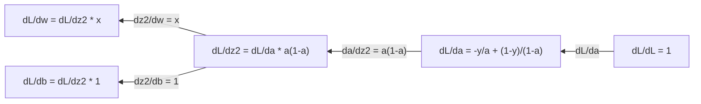
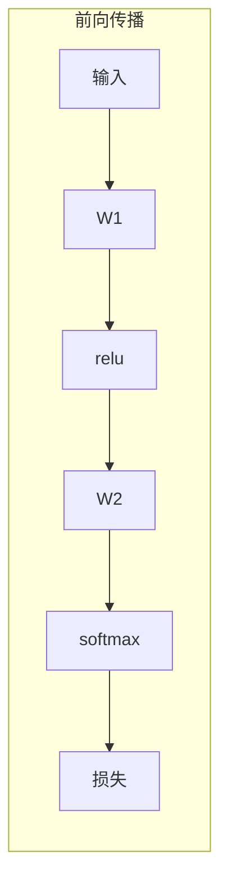
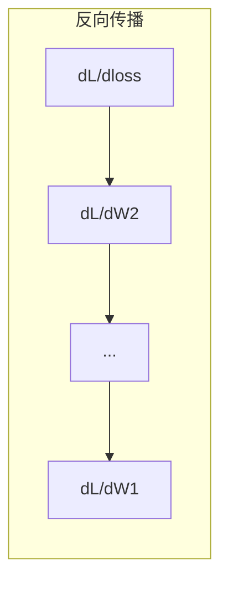

# 机器学习中的微积分

> 导数告诉你哪个方向是下坡。这就是神经网络学习所需的全部。

**类型：** 学习
**语言：** Python
**前置知识：** Phase 1 第 01-03 课
**时间：** ~60 分钟

## 学习目标

- 为常见 ML 函数（x^2、sigmoid、交叉熵）计算数值和解析导数
- 从零实现梯度下降，在 1D 和 2D 中最小化损失函数
- 推导线性回归模型的梯度，通过手动权重更新训练模型
- 解释 Hessian 矩阵、Taylor 级数近似及其与优化方法的联系

## 问题背景

你有一个拥有数百万个权重的神经网络，每个权重都是一个旋钮。你需要知道应该朝哪个方向拧每个旋钮，才能让模型稍微减少错误。微积分给出了那个方向。

没有微积分，训练神经网络就意味着随机尝试变化并寄希望于最好的结果。有了导数，你就确切知道每个权重如何影响误差，每次都能正确地转动每个旋钮。

## 核心概念

### 什么是导数？

导数衡量变化率。对于函数 y = f(x)，导数 f'(x) 告诉你：如果你微微改变 x，y 会改变多少？

从几何上看，导数是某点切线的斜率。

**f(x) = x^2：**

| x | f(x) | f'(x)（斜率） |
|---|------|---------------|
| 0 | 0    | 0（平坦，在底部） |
| 1 | 1    | 2 |
| 2 | 4    | 4（该点的切线斜率） |
| 3 | 9    | 6 |

在 x=2 处，斜率为 4。如果你把 x 向右微移，y 的增加量约为该移动量的 4 倍。在 x=0 处，斜率为 0，你在碗的底部。

形式定义：

```
f'(x) = lim   f(x + h) - f(x)
        h->0  -----------------
                     h
```

在代码中，你跳过极限，只使用非常小的 h。这就是数值导数。

### 偏导数：每次只对一个变量求导

实际函数有很多输入。神经网络损失取决于数千个权重。偏导数保持所有变量不变，只对其中一个求导。

```
f(x, y) = x^2 + 3xy + y^2

df/dx = 2x + 3y     （将 y 视为常数）
df/dy = 3x + 2y     （将 x 视为常数）
```

每个偏导数回答：如果我只微调这一个权重，损失会如何变化？

### 梯度：所有偏导数的向量

梯度将所有偏导数收集到一个向量中。对于函数 f(x, y, z)，梯度为：

```
grad f = [ df/dx, df/dy, df/dz ]
```

梯度指向最陡上升的方向。要最小化函数，朝反方向走。

**f(x,y) = x^2 + y^2 的等高线图：**

该函数形成碗形，等高线为同心圆，最小值在 (0, 0)。

| 点 | grad f | -grad f（下降方向） |
|-------|--------|----------------------------|
| (1, 1) | [2, 2]（指向上坡，远离最小值） | [-2, -2]（指向下坡，朝向最小值） |
| (0, 0) | [0, 0]（平坦，在最小值） | [0, 0] |

这就是梯度下降的图示：计算梯度，取反，迈一步。

### 与优化的联系

训练神经网络就是优化。你有一个损失函数 L(w1, w2, ..., wn) 衡量模型的错误程度，你想最小化它。

```
梯度下降更新规则：

  w_新 = w_旧 - 学习率 * dL/dw

对每个权重：
  1. 计算损失关于该权重的偏导数
  2. 从权重中减去它的一个小倍数
  3. 重复
```

学习率控制步长。太大会过冲，太小会慢慢爬行。

**损失面（1D 截面）：**

损失函数 L(w) 随权重 w 的变化形成有峰谷的曲线。

| 特征 | 描述 |
|---------|-------------|
| 全局最小值 | 整条曲线上的最低点——最佳解 |
| 局部最小值 | 比邻近点低但不是整体最低的谷 |
| 斜率 | 梯度下降从任何起始点沿斜率下坡 |

梯度下降沿斜率下坡，可能陷入局部最小值，但在高维空间（数百万个权重）中，这在实践中很少是问题。

### 数值导数 vs 解析导数

计算导数有两种方式。

解析法：手工应用微积分规则。对于 f(x) = x^2，导数为 f'(x) = 2x。精确，快速。

数值法：用定义近似。对很小的 h 计算 f(x+h) 和 f(x-h)，然后用差商。

```
数值法（中心差分）：

f'(x) ~= f(x + h) - f(x - h)
          -----------------------
                  2h

实践中 h = 0.0001 效果很好
```

数值导数较慢，但适用于任何函数。解析导数快，但需要推导公式。神经网络框架使用第三种方法：自动微分，机械地计算精确导数。Phase 3 会看到这个方法。

### 手算简单函数的导数

这些是机器学习中会反复看到的导数。

```
函数           导数             用途
--------       ----------       -------
f(x) = x^2    f'(x) = 2x      损失函数（MSE）
f(x) = wx + b f'(w) = x        线性层（关于权重的梯度）
               f'(b) = 1        线性层（关于偏置的梯度）
               f'(x) = w        线性层（关于输入的梯度）
f(x) = e^x    f'(x) = e^x     Softmax，注意力机制
f(x) = ln(x)  f'(x) = 1/x     交叉熵损失
f(x) = 1/(1+e^-x)  f'(x) = f(x)(1-f(x))   Sigmoid 激活
```

### 链式法则

当函数复合时，链式法则告诉你如何求导。

```
若 y = f(g(x))，则 dy/dx = f'(g(x)) * g'(x)

示例：y = (3x + 1)^2
  外层：f(u) = u^2       f'(u) = 2u
  内层：g(x) = 3x + 1    g'(x) = 3
  dy/dx = 2(3x + 1) * 3 = 6(3x + 1)
```

神经网络是函数链：输入 -> 线性 -> 激活 -> 线性 -> 激活 -> 损失。反向传播就是链式法则从输出到输入的反复应用，这就是整个算法。

### Hessian 矩阵

梯度告诉你斜率，Hessian 告诉你曲率。

Hessian 是二阶偏导数矩阵。对于函数 f(x1, x2, ..., xn)，Hessian 的 (i, j) 元素为：

```
H[i][j] = d^2f / (dx_i * dx_j)
```

对于二元函数 f(x, y)：

```
H = | d^2f/dx^2    d^2f/dxdy |
    | d^2f/dydx    d^2f/dy^2 |
```

**Hessian 在临界点（梯度为 0 处）告诉你什么：**

| Hessian 性质 | 含义 | 示例曲面 |
|-----------------|---------|-----------------|
| 正定（所有特征值 > 0）| 局部最小值 | 向上的碗 |
| 负定（所有特征值 < 0）| 局部最大值 | 向下的碗 |
| 不定（混合特征值）| 鞍点 | 马鞍形状 |

**示例：** f(x, y) = x^2 - y^2（鞍形函数）

```
df/dx = 2x       df/dy = -2y
d^2f/dx^2 = 2    d^2f/dy^2 = -2    d^2f/dxdy = 0

H = | 2   0 |
    | 0  -2 |

特征值：2 和 -2（一正一负）
--> (0, 0) 是鞍点
```

对比 f(x, y) = x^2 + y^2（碗形）：

```
H = | 2  0 |
    | 0  2 |

特征值：2 和 2（都是正数）
--> (0, 0) 是局部最小值
```

**Hessian 在机器学习中的重要性：**

牛顿法使用 Hessian 比梯度下降迈出更好的优化步骤。它不只是沿斜率走，还考虑了曲率：

```
牛顿法更新：   w_新 = w_旧 - H^(-1) * 梯度
梯度下降：     w_新 = w_旧 - lr * 梯度
```

牛顿法收敛更快，因为 Hessian"重新缩放"了梯度——陡峭方向步子小，平坦方向步子大。

问题在于：对于有 N 个参数的神经网络，Hessian 是 N×N 的矩阵。一百万参数的模型需要一万亿个元素的矩阵。这就是为什么我们使用近似方法。

| 方法 | 使用什么 | 代价 | 收敛速度 |
|--------|-------------|------|-------------|
| 梯度下降 | 仅一阶导数 | O(N) 每步 | 慢（线性） |
| 牛顿法 | 完整 Hessian | O(N^3) 每步 | 快（二次） |
| L-BFGS | 用梯度历史近似 Hessian | O(N) 每步 | 中等（超线性） |
| Adam | 每参数自适应学习率（对角 Hessian 近似） | O(N) 每步 | 中等 |
| 自然梯度 | Fisher 信息矩阵（统计 Hessian） | O(N^2) 每步 | 快 |

实践中，Adam 是深度学习的默认优化器。它通过追踪每个参数梯度的运行均值和方差，以低廉的代价近似二阶信息。

### Taylor 级数近似

任何光滑函数都可以在局部用多项式近似：

```
f(x + h) = f(x) + f'(x)*h + (1/2)*f''(x)*h^2 + (1/6)*f'''(x)*h^3 + ...
```

包含的项越多，近似越好，但只在点 x 附近。

**Taylor 级数在机器学习中的重要性：**

- **一阶 Taylor = 梯度下降。** 当你用 f(x + h) ~ f(x) + f'(x)*h 时，你做了线性近似。梯度下降最小化这个线性模型，选择 h = -lr * f'(x)。

- **二阶 Taylor = 牛顿法。** 使用 f(x + h) ~ f(x) + f'(x)*h + (1/2)*f''(x)*h^2，你得到二次模型。最小化它给出 h = -f'(x)/f''(x)——牛顿步。

- **损失函数设计。** MSE 和交叉熵是光滑的，这意味着它们的 Taylor 展开表现良好。这不是偶然的，光滑损失使优化可预测。

```
近似阶数         捕获什么        优化方法
-----------      ---------      -------------------
0 阶（常数）     仅值            随机搜索
1 阶（线性）     斜率            梯度下降
2 阶（二次）     曲率            牛顿法
更高阶          更精细结构       在机器学习中很少使用
```

关键见解：所有基于梯度的优化实际上都是在局部近似损失函数，然后步进到该近似的最小值。

### 机器学习中的积分

导数告诉你变化率，积分计算累积量——曲线下的面积。

在机器学习中，你很少手工计算积分，但这个概念无处不在：

**概率。** 对于密度为 p(x) 的连续随机变量：
```
P(a < X < b) = 从 a 到 b 对 p(x)dx 积分
```
概率密度曲线在 a 到 b 之间的面积就是落在该区间的概率。

**期望值。** 概率加权的平均结果：
```
E[f(X)] = f(x) * p(x) dx 的积分
```
数据分布上的期望损失是一个积分。训练最小化它的经验近似。

**KL 散度。** 衡量两个分布的差异：
```
KL(p || q) = p(x) * log(p(x) / q(x)) dx 的积分
```
用于 VAE、知识蒸馏和贝叶斯推断。

**归一化常数。** 在贝叶斯推断中：
```
p(w | 数据) = p(数据 | w) * p(w) / p(数据 | w) * p(w) dw 的积分
```
分母是对所有可能参数值的积分，通常难以处理，这就是我们使用 MCMC 和变分推断等近似方法的原因。

| 积分概念 | 在机器学习中的出现 |
|-----------------|----------------------|
| 曲线下面积 | 密度函数的概率 |
| 期望值 | 损失函数，风险最小化 |
| KL 散度 | VAE，策略优化，蒸馏 |
| 归一化 | 贝叶斯后验，softmax 分母 |
| 边际似然 | 模型比较，证据下界（ELBO） |

### 计算图中的多变量链式法则

链式法则不只适用于一线上的标量函数。在神经网络中，变量分叉和合并。下面是导数如何在简单前向传播中流动的：


反向传播从右到左计算梯度：



每个箭头乘以局部导数。任何参数的梯度是从损失到该参数路径上所有局部导数的乘积。当路径分叉和合并时，你将贡献求和（多元链式法则）。

这就是反向传播的全部：通过计算图从输出到输入系统地应用链式法则。

### Jacobian 矩阵

当函数将向量映射到向量时（如神经网络层），其导数是矩阵。Jacobian 包含每个输出关于每个输入的所有偏导数。

对于 f: R^n -> R^m，Jacobian J 是 m×n 矩阵：

| | x1 | x2 | ... | xn |
|---|---|---|---|---|
| f1 | df1/dx1 | df1/dx2 | ... | df1/dxn |
| f2 | df2/dx1 | df2/dx2 | ... | df2/dxn |
| ... | ... | ... | ... | ... |
| fm | dfm/dx1 | dfm/dx2 | ... | dfm/dxn |

你不会手工为神经网络计算 Jacobian，PyTorch 会处理它。但知道它的存在有助于理解反向传播中的形状：如果一层将 R^n 映射到 R^m，其 Jacobian 是 m×n 的。梯度通过这个矩阵的转置向后流动。

### 这对神经网络意味着什么

神经网络中的每个权重都获得一个梯度，告诉你如何调整该权重来减少损失。





每次权重更新：
- `W1 = W1 - lr * dL/dW1`
- `W2 = W2 - lr * dL/dW2`

前向传播计算预测和损失，反向传播计算损失关于每个权重的梯度，然后每个权重迈出一小步下坡。对数百万步重复。这就是深度学习。

## 动手实现

### 第一步：从零实现数值导数

```python
def numerical_derivative(f, x, h=1e-7):
    return (f(x + h) - f(x - h)) / (2 * h)

def f(x):
    return x ** 2

for x in [-2, -1, 0, 1, 2]:
    numerical = numerical_derivative(f, x)
    analytical = 2 * x
    print(f"x={x:2d}  f'(x) 数值={numerical:.6f}  解析={analytical:.1f}")
```

数值导数与解析值精确匹配到多位小数。

### 第二步：偏导数和梯度

```python
def numerical_gradient(f, point, h=1e-7):
    gradient = []
    for i in range(len(point)):
        point_plus = list(point)
        point_minus = list(point)
        point_plus[i] += h
        point_minus[i] -= h
        partial = (f(point_plus) - f(point_minus)) / (2 * h)
        gradient.append(partial)
    return gradient

def f_multi(point):
    x, y = point
    return x**2 + 3*x*y + y**2

grad = numerical_gradient(f_multi, [1.0, 2.0])
print(f"(1,2) 处的数值梯度：{[f'{g:.4f}' for g in grad]}")
print(f"(1,2) 处的解析梯度：[2*1+3*2, 3*1+2*2] = [{2*1+3*2}, {3*1+2*2}]")
```

### 第三步：梯度下降求 f(x) = x^2 的最小值

```python
x = 5.0
lr = 0.1
for step in range(20):
    grad = 2 * x
    x = x - lr * grad
    print(f"步骤 {step:2d}  x={x:8.4f}  f(x)={x**2:10.6f}")
```

从 x=5 开始，每步都更接近 x=0（最小值）。

### 第四步：二维函数的梯度下降

```python
def f_2d(point):
    x, y = point
    return x**2 + y**2

point = [4.0, 3.0]
lr = 0.1
for step in range(30):
    grad = numerical_gradient(f_2d, point)
    point = [p - lr * g for p, g in zip(point, grad)]
    loss = f_2d(point)
    if step % 5 == 0 or step == 29:
        print(f"步骤 {step:2d}  点=({point[0]:7.4f}, {point[1]:7.4f})  f={loss:.6f}")
```

### 第五步：比较数值和解析导数

```python
import math

test_functions = [
    ("x^2",      lambda x: x**2,          lambda x: 2*x),
    ("x^3",      lambda x: x**3,          lambda x: 3*x**2),
    ("sin(x)",   lambda x: math.sin(x),   lambda x: math.cos(x)),
    ("e^x",      lambda x: math.exp(x),   lambda x: math.exp(x)),
    ("1/x",      lambda x: 1/x,           lambda x: -1/x**2),
]

x = 2.0
print(f"{'函数':<12} {'数值':>12} {'解析':>12} {'误差':>12}")
print("-" * 50)
for name, f, df in test_functions:
    num = numerical_derivative(f, x)
    ana = df(x)
    err = abs(num - ana)
    print(f"{name:<12} {num:12.6f} {ana:12.6f} {err:12.2e}")
```

### 第六步：数值计算 Hessian

```python
def hessian_2d(f, x, y, h=1e-5):
    fxx = (f(x + h, y) - 2 * f(x, y) + f(x - h, y)) / (h ** 2)
    fyy = (f(x, y + h) - 2 * f(x, y) + f(x, y - h)) / (h ** 2)
    fxy = (f(x + h, y + h) - f(x + h, y - h) - f(x - h, y + h) + f(x - h, y - h)) / (4 * h ** 2)
    return [[fxx, fxy], [fxy, fyy]]

def saddle(x, y):
    return x ** 2 - y ** 2

def bowl(x, y):
    return x ** 2 + y ** 2

H_saddle = hessian_2d(saddle, 0.0, 0.0)
H_bowl = hessian_2d(bowl, 0.0, 0.0)
print(f"鞍点 Hessian：{H_saddle}")  # [[2, 0], [0, -2]] -- 符号混合
print(f"碗形 Hessian：{H_bowl}")    # [[2, 0], [0, 2]]  -- 都是正数
```

鞍形函数的 Hessian 特征值为 2 和 -2（混合符号，确认是鞍点）。碗形的特征值为 2 和 2（都是正数，确认是最小值）。

### 第七步：Taylor 近似实战

```python
import math

def taylor_approx(f, f_prime, f_double_prime, x0, h, order=2):
    result = f(x0)
    if order >= 1:
        result += f_prime(x0) * h
    if order >= 2:
        result += 0.5 * f_double_prime(x0) * h ** 2
    return result

x0 = 0.0
for h in [0.1, 0.5, 1.0, 2.0]:
    true_val = math.sin(h)
    t1 = taylor_approx(math.sin, math.cos, lambda x: -math.sin(x), x0, h, order=1)
    t2 = taylor_approx(math.sin, math.cos, lambda x: -math.sin(x), x0, h, order=2)
    print(f"h={h:.1f}  sin(h)={true_val:.4f}  一阶={t1:.4f}  二阶={t2:.4f}")
```

在 x0=0 附近，sin(x) ~ x（一阶 Taylor）。近似在小 h 时很好，但大 h 时失效。这就是梯度下降在小学习率下效果最好的原因——每步都假设线性近似是精确的。

### 第八步：这对神经网络意味着什么

```python
import random

random.seed(42)

w = random.gauss(0, 1)
b = random.gauss(0, 1)
lr = 0.01

xs = [1.0, 2.0, 3.0, 4.0, 5.0]
ys = [3.0, 5.0, 7.0, 9.0, 11.0]

for epoch in range(200):
    total_loss = 0
    dw = 0
    db = 0
    for x, y in zip(xs, ys):
        pred = w * x + b
        error = pred - y
        total_loss += error ** 2
        dw += 2 * error * x
        db += 2 * error
    dw /= len(xs)
    db /= len(xs)
    total_loss /= len(xs)
    w -= lr * dw
    b -= lr * db
    if epoch % 40 == 0 or epoch == 199:
        print(f"轮次 {epoch:3d}  w={w:.4f}  b={b:.4f}  损失={total_loss:.6f}")

print(f"\n学到的：y = {w:.2f}x + {b:.2f}")
print(f"实际：  y = 2x + 1")
```

每个基于梯度的训练循环都遵循这个模式：预测、计算损失、计算梯度、更新权重。

## 实际使用

用 NumPy，同样的操作更快更简洁：

```python
import numpy as np

x = np.array([1, 2, 3, 4, 5], dtype=float)
y = np.array([3, 5, 7, 9, 11], dtype=float)

w, b = np.random.randn(), np.random.randn()
lr = 0.01

for epoch in range(200):
    pred = w * x + b
    error = pred - y
    loss = np.mean(error ** 2)
    dw = np.mean(2 * error * x)
    db = np.mean(2 * error)
    w -= lr * dw
    b -= lr * db

print(f"学到的：y = {w:.2f}x + {b:.2f}")
```

你刚从零实现了梯度下降。PyTorch 自动化了梯度计算，但更新循环是完全相同的。

## 练习题

1. 实现 `numerical_second_derivative(f, x)`，调用 `numerical_derivative` 两次。验证 x^3 在 x=2 处的二阶导数为 12。
2. 用梯度下降找到 f(x, y) = (x - 3)^2 + (y + 1)^2 的最小值。从 (0, 0) 开始，答案应该收敛到 (3, -1)。
3. 为梯度下降循环添加动量：维护一个累积过去梯度的速度向量。在 f(x) = x^4 - 3x^2 上比较有动量和没有动量的收敛速度。

## 关键术语

| 术语 | 通俗说法 | 实际含义 |
|------|----------------|----------------------|
| 导数（Derivative）| "斜率" | 函数在某点的变化率。告诉你输出随输入单位变化改变多少。 |
| 偏导数（Partial derivative）| "对一个变量求导" | 保持所有其他变量不变时对一个变量的导数。 |
| 梯度（Gradient）| "最陡上升方向" | 所有偏导数的向量。指向函数增加最快的方向。 |
| 梯度下降（Gradient descent）| "走下坡" | 从参数中减去梯度（乘以学习率）以减少损失。神经网络训练的核心。 |
| 学习率（Learning rate）| "步长" | 控制每次梯度下降步子大小的标量。太大：发散。太小：收敛慢。 |
| 链式法则（Chain rule）| "乘以导数" | 复合函数求导规则：df/dx = df/dg * dg/dx。反向传播的数学基础。 |
| Jacobian | "导数矩阵" | 当函数将向量映射到向量时，Jacobian 是所有输出关于输入的偏导数矩阵。 |
| 数值导数（Numerical derivative）| "有限差分" | 通过在两个邻近点求值并计算斜率来近似导数。 |
| 反向传播（Backpropagation）| "反向模式自动微分" | 使用链式法则从输出到输入逐层计算梯度。神经网络的学习方式。 |
| Hessian | "二阶导数矩阵" | 所有二阶偏导数的矩阵。描述函数的曲率。临界点处正定 Hessian 意味着局部最小值。 |
| Taylor 级数（Taylor series）| "多项式近似" | 用导数在某点附近近似函数：f(x+h) ~ f(x) + f'(x)h + (1/2)f''(x)h^2 + ...理解梯度下降和牛顿法的基础。 |
| 积分（Integral）| "曲线下面积" | 某个量在一定范围内的累积。在机器学习中，积分定义概率、期望值和 KL 散度。 |

## 延伸阅读

- [3Blue1Brown：微积分的本质](https://www.3blue1brown.com/topics/calculus) - 导数、积分和链式法则的视觉直觉
- [Stanford CS231n：反向传播](https://cs231n.github.io/optimization-2/) - 梯度如何在神经网络层中流动
