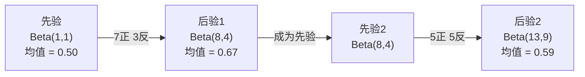

# 贝叶斯定理

> 概率关于你的预期，贝叶斯定理关于你的学习。

**类型：** 构建
**语言：** Python
**前置知识：** Phase 1 第 06 课（概率基础）
**时间：** ~75 分钟

## 学习目标

- 应用贝叶斯定理从先验、似然和证据计算后验概率
- 从零构建带 Laplace 平滑和对数空间计算的朴素贝叶斯文本分类器
- 比较 MLE 和 MAP 估计，解释 MAP 如何对应 L2 正则化
- 使用 Beta-Binomial 共轭先验实现序列贝叶斯更新用于 A/B 测试

## 问题背景

一项医学测试准确率为 99%。你测试结果阳性，你真的患病的概率是多少？

大多数人会说 99%。但真实答案取决于这种疾病有多罕见。如果每 10,000 人中有 1 人患病，阳性结果只给你约 1% 的患病概率，其他 99% 的阳性结果都是健康人的假阳性。

这不是陷阱题，这就是贝叶斯定理。每个垃圾邮件过滤器、每个医疗诊断、每个量化不确定性的机器学习模型都使用完全相同的推理。你从一个信念开始，看到证据，然后更新。

如果不理解这一点就构建 ML 系统，你会误解模型输出、设置错误的阈值，并发布过度自信的预测。

## 核心概念

### 从联合概率到贝叶斯

你在第 06 课中已知条件概率：

```
P(A|B) = P(A 且 B) / P(B)
```

对称地：

```
P(B|A) = P(A 且 B) / P(A)
```

两个表达式共享同一分子：P(A 且 B)。令它们相等并整理：

```
P(A 且 B) = P(A|B) * P(B) = P(B|A) * P(A)

因此：

P(A|B) = P(B|A) * P(A) / P(B)
```

这就是贝叶斯定理——四个量，一个方程。

### 四个部分

| 部分 | 名称 | 含义 |
|------|------|---------------|
| P(A\|B) | 后验 | 看到证据 B 后你关于 A 的更新信念 |
| P(B\|A) | 似然 | 如果 A 为真，证据 B 的可能性 |
| P(A) | 先验 | 看到任何证据之前你关于 A 的信念 |
| P(B) | 证据 | 在所有可能情况下看到 B 的总概率 |

证据项 P(B) 充当归一化因子。你可以用全概率公式展开它：

```
P(B) = P(B|A) * P(A) + P(B|非A) * P(非A)
```

### 医学测试示例

一种疾病影响每 10,000 人中的 1 人。测试准确率为 99%（捕获 99% 的患者，假阳性率 1%）。

```
P(患病)           = 0.0001     （先验：疾病罕见）
P(阳性|患病)      = 0.99       （似然：测试能捕获）
P(阳性|健康)      = 0.01       （假阳性率）

P(阳性) = P(阳性|患病) * P(患病) + P(阳性|健康) * P(健康)
        = 0.99 * 0.0001 + 0.01 * 0.9999
        = 0.000099 + 0.009999
        = 0.010098

P(患病|阳性) = P(阳性|患病) * P(患病) / P(阳性)
            = 0.99 * 0.0001 / 0.010098
            = 0.0098
            = 0.98%
```

不到 1%！先验主导。当一个条件罕见时，即使准确的测试也主要产生假阳性。这就是为什么医生要做确认测试。

### 垃圾邮件示例

你收到一封包含"彩票"一词的邮件，是垃圾邮件吗？

```
P(垃圾邮件)           = 0.3      （30% 的邮件是垃圾邮件）
P("彩票"|垃圾邮件)    = 0.05     （5% 的垃圾邮件包含"彩票"）
P("彩票"|非垃圾邮件)  = 0.001    （0.1% 的正常邮件包含"彩票"）

P("彩票") = 0.05 * 0.3 + 0.001 * 0.7
          = 0.015 + 0.0007
          = 0.0157

P(垃圾邮件|"彩票") = 0.05 * 0.3 / 0.0157
                  = 0.955
                  = 95.5%
```

一个词就将概率从 30% 提高到 95.5%。真实的垃圾邮件过滤器同时对数百个词应用贝叶斯。

### 朴素贝叶斯：独立性假设

朴素贝叶斯通过假设给定类别时所有特征条件独立，将贝叶斯扩展到多个特征：

```
P(类别 | 特征1, 特征2, ..., 特征n)
  = P(类别) * P(特征1|类别) * P(特征2|类别) * ... * P(特征n|类别)
    / P(特征1, 特征2, ..., 特征n)
```

"朴素"的部分是独立性假设。在文本中，词的出现不是独立的（"纽约"中的两个词是相关的）。但这个假设在实践中出奇地有效，因为分类器只需要对类别排序，而不是产生校准的概率。

由于分母对所有类别相同，你可以跳过它，只比较分子：

```
score(类别) = P(类别) * 所有P(特征i | 类别)的乘积
```

选择得分最高的类别。

### 最大似然估计（MLE）

你如何从训练数据获得 P(特征|类别)？数数。

```
P("免费"|垃圾邮件) = (包含"免费"的垃圾邮件数量) / (垃圾邮件总量)
```

这就是 MLE：选择使观察到的数据最可能的参数值。你在最大化似然函数，对于离散计数，这等于相对频率。

问题：如果一个词在训练时从未出现在垃圾邮件中，MLE 给它概率零。一个未见词就破坏整个乘积。用 Laplace 平滑修复这个问题：

```
P(词|类别) = (count(词, 类别) + 1) / (类别中的总词数 + 词汇表大小)
```

给每个计数加 1 确保没有概率为零。

### 最大后验估计（MAP）

MLE 问：什么参数使 P(数据|参数) 最大？

MAP 问：什么参数使 P(参数|数据) 最大？

由贝叶斯定理：

```
P(参数|数据) 正比于 P(数据|参数) * P(参数)
```

MAP 在参数本身上添加先验。如果你相信参数应该很小，你将其编码为惩罚大值的先验。这与 ML 中的 L2 正则化完全相同。岭回归中的"岭"惩罚字面上就是权重的高斯先验。

| 估计方法 | 优化 | ML 等价 |
|------------|-----------|---------------|
| MLE | P(数据\|参数) | 无正则化训练 |
| MAP | P(数据\|参数) * P(参数) | L2 / L1 正则化 |

### 贝叶斯 vs 频率主义：实际差异

频率主义者将参数视为固定的未知量。他们问："如果我多次重复这个实验，会发生什么？"

贝叶斯主义者将参数视为分布。他们问："给定我观察到的内容，我对参数相信什么？"

对于构建 ML 系统，实际差异：

| 方面 | 频率主义 | 贝叶斯 |
|--------|-------------|----------|
| 输出 | 点估计 | 值的分布 |
| 不确定性 | 置信区间（关于过程）| 可信区间（关于参数）|
| 小数据 | 可能过拟合 | 先验起正则化作用 |
| 计算 | 通常更快 | 通常需要采样（MCMC）|

大多数生产 ML 是频率主义的（SGD，点估计）。贝叶斯方法在需要校准不确定性（医疗决策、安全关键系统）或数据稀少时（少样本学习、冷启动）表现出色。

### 贝叶斯思维对 ML 的重要性

这种联系比类比更深：

**先验即正则化。** 权重的高斯先验就是 L2 正则化。Laplace 先验就是 L1。每次你添加正则化项，你都在做关于期望参数值的贝叶斯声明。

**后验即不确定性。** 单个预测概率不能告诉你模型对该估计有多自信。贝叶斯方法给你一个分布："我认为 P(垃圾邮件) 在 0.8 到 0.95 之间。"

**贝叶斯更新即在线学习。** 今天的后验成为明天的先验。当你的模型看到新数据时，它增量更新信念，而不是从头重训练。

**模型比较即贝叶斯。** 贝叶斯信息准则（BIC）、边际似然和贝叶斯因子都使用贝叶斯推理在不过拟合的情况下选择模型。

## 动手实现

### 第一步：贝叶斯定理函数

```python
def bayes(prior, likelihood, false_positive_rate):
    evidence = likelihood * prior + false_positive_rate * (1 - prior)
    posterior = likelihood * prior / evidence
    return posterior

result = bayes(prior=0.0001, likelihood=0.99, false_positive_rate=0.01)
print(f"P(患病|阳性) = {result:.4f}")
```

### 第二步：朴素贝叶斯分类器

```python
import math
from collections import defaultdict

class NaiveBayes:
    def __init__(self, smoothing=1.0):
        self.smoothing = smoothing
        self.class_counts = defaultdict(int)
        self.word_counts = defaultdict(lambda: defaultdict(int))
        self.class_word_totals = defaultdict(int)
        self.vocab = set()

    def train(self, documents, labels):
        for doc, label in zip(documents, labels):
            self.class_counts[label] += 1
            words = doc.lower().split()
            for word in words:
                self.word_counts[label][word] += 1
                self.class_word_totals[label] += 1
                self.vocab.add(word)

    def predict(self, document):
        words = document.lower().split()
        total_docs = sum(self.class_counts.values())
        vocab_size = len(self.vocab)
        best_class = None
        best_score = float("-inf")
        for cls in self.class_counts:
            score = math.log(self.class_counts[cls] / total_docs)
            for word in words:
                count = self.word_counts[cls].get(word, 0)
                total = self.class_word_totals[cls]
                score += math.log((count + self.smoothing) / (total + self.smoothing * vocab_size))
            if score > best_score:
                best_score = score
                best_class = cls
        return best_class
```

对数概率防止下溢。将许多小概率相乘会产生太小的浮点数。求和对数概率在数值上稳定且数学等价。

### 第三步：在垃圾邮件数据上训练

```python
train_docs = [
    "win free money now",
    "free lottery ticket winner",
    "claim your prize today free",
    "urgent offer free cash",
    "congratulations you won free",
    "meeting tomorrow at noon",
    "project update attached",
    "can we schedule a call",
    "quarterly report review",
    "lunch on thursday sounds good",
    "team standup notes attached",
    "please review the pull request",
]

train_labels = [
    "spam", "spam", "spam", "spam", "spam",
    "ham", "ham", "ham", "ham", "ham", "ham", "ham",
]

classifier = NaiveBayes()
classifier.train(train_docs, train_labels)

test_messages = [
    "free money waiting for you",
    "meeting rescheduled to friday",
    "you won a free prize",
    "please review the attached report",
]

for msg in test_messages:
    print(f"  '{msg}' -> {classifier.predict(msg)}")
```

### 第四步：检查学习到的概率

```python
def show_top_words(classifier, cls, n=5):
    vocab_size = len(classifier.vocab)
    total = classifier.class_word_totals[cls]
    probs = {}
    for word in classifier.vocab:
        count = classifier.word_counts[cls].get(word, 0)
        probs[word] = (count + classifier.smoothing) / (total + classifier.smoothing * vocab_size)
    sorted_words = sorted(probs.items(), key=lambda x: x[1], reverse=True)
    for word, prob in sorted_words[:n]:
        print(f"    {word}: {prob:.4f}")

print("\n垃圾邮件高频词：")
show_top_words(classifier, "spam")
print("\n正常邮件高频词：")
show_top_words(classifier, "ham")
```

## 实际使用

Scikit-learn 提供了生产就绪的朴素贝叶斯实现：

```python
from sklearn.feature_extraction.text import CountVectorizer
from sklearn.naive_bayes import MultinomialNB
from sklearn.metrics import classification_report

vectorizer = CountVectorizer()
X_train = vectorizer.fit_transform(train_docs)
clf = MultinomialNB()
clf.fit(X_train, train_labels)

X_test = vectorizer.transform(test_messages)
predictions = clf.predict(X_test)
for msg, pred in zip(test_messages, predictions):
    print(f"  '{msg}' -> {pred}")
```

相同算法。CountVectorizer 处理分词和词汇表构建，MultinomialNB 内部处理平滑和对数概率。你的从零版本用 40 行代码做同样的事。

## 输出产物

这里构建的 NaiveBayes 类演示了完整管道：分词、带 Laplace 平滑的概率估计、对数空间预测。`code/bayes.py` 中的代码端到端运行，除 Python 标准库外没有依赖。

### 共轭先验

当先验和后验属于同一分布族时，称先验为"共轭"。这使贝叶斯更新在代数上简洁——你得到封闭形式的后验，无需数值积分。

| 似然 | 共轭先验 | 后验 | 示例 |
|-----------|----------------|-----------|---------|
| 伯努利 | Beta(a, b) | Beta(a + 成功次数, b + 失败次数) | 硬币翻转偏差估计 |
| 正态（已知方差）| Normal(mu_0, sigma_0) | Normal(加权均值, 更小方差) | 传感器校准 |
| 泊松 | Gamma(a, b) | Gamma(a + 计数和, b + n) | 建模到达率 |
| 多项式 | Dirichlet(alpha) | Dirichlet(alpha + 计数) | 主题建模，语言模型 |

为什么重要：没有共轭先验，你需要蒙特卡洛采样或变分推断来近似后验。有了共轭先验，你只需更新两个数字。

Beta 分布是实践中最常见的共轭先验。Beta(a, b) 表示你对概率参数的信念，均值为 a/(a+b)，a+b 越大，分布越集中（越自信）。

Beta 先验的特殊情况：
- Beta(1, 1) = 均匀分布，你对参数没有任何意见
- Beta(10, 10) = 峰值在 0.5，你强烈相信参数接近 0.5
- Beta(1, 10) = 偏向 0，你相信参数很小

更新规则极为简单：

```
先验：    Beta(a, b)
数据：    s 次成功，f 次失败
后验：   Beta(a + s, b + f)
```

无积分，无采样，只是加法。

### 序列贝叶斯更新

贝叶斯推断天然是序列式的。今天的后验成为明天的先验。这就是实际系统如何增量学习而不重新处理所有历史数据。

具体示例：估计硬币是否公平。

**第一天：还没有数据。**
从 Beta(1, 1) 开始——均匀先验。你没有意见。
- 先验均值：0.5
- 先验在 [0, 1] 上是平坦的

**第二天：观察到 7 次正面，3 次反面。**
后验 = Beta(1 + 7, 1 + 3) = Beta(8, 4)
- 后验均值：8/12 = 0.667
- 证据表明硬币偏向正面

**第三天：再观察 5 次正面，5 次反面。**
用昨天的后验作为今天的先验。
后验 = Beta(8 + 5, 4 + 5) = Beta(13, 9)
- 后验均值：13/22 = 0.591
- 均衡的新数据将估计拉回 0.5



观察顺序无关紧要。Beta(1,1) 一次性更新所有 12 正面和 8 反面给出 Beta(13, 9)——与序列更新相同。序列更新和批量更新在数学上等价，但序列更新让你在每步做出决策，无需存储原始数据。

这是生产 ML 系统中在线学习的基础。多臂老虎机的汤普森采样、增量推荐系统和流式异常检测器都使用这种模式。

### 与 A/B 测试的联系

A/B 测试是贝叶斯推断的伪装。

设置：你在测试两种按钮颜色，变体 A（蓝色）和变体 B（绿色），想知道哪个点击率更高。

贝叶斯 A/B 测试：

1. **先验。** 对两个变体从 Beta(1, 1) 开始。没有先验偏好。
2. **数据。** 变体 A：1000 次展示中 50 次点击。变体 B：1000 次展示中 65 次点击。
3. **后验。**
   - A：Beta(1 + 50, 1 + 950) = Beta(51, 951)。均值 = 0.051
   - B：Beta(1 + 65, 1 + 935) = Beta(66, 936)。均值 = 0.066
4. **决策。** 计算 P(B > A)——B 的真实转化率高于 A 的概率。

解析计算 P(B > A) 很难，但蒙特卡洛使其简单：

```
1. 从 Beta(51, 951) 抽取 100,000 个样本  -> samples_A
2. 从 Beta(66, 936) 抽取 100,000 个样本  -> samples_B
3. P(B > A) = B > A 的样本比例
```

如果 P(B > A) > 0.95，发布变体 B。如果在 0.05 和 0.95 之间，继续收集数据。如果 P(B > A) < 0.05，发布变体 A。

相比频率主义 A/B 测试的优势：
- 你得到直接的概率陈述："B 更好的概率为 97%"
- 无需 p 值混淆，无需"未能拒绝零假设"的模糊
- 可以在任何时候检查结果而不会膨胀误报率（无"偷看问题"）
- 可以合并先验知识（例如，之前的测试表明转化率通常在 3-8%）

| 方面 | 频率主义 A/B | 贝叶斯 A/B |
|--------|----------------|--------------|
| 输出 | p 值 | P(B > A) |
| 解释 | "如果 A=B，这些数据有多令人惊讶？" | "B 比 A 好的可能性有多大？" |
| 提前停止 | 膨胀误报 | 在任何时点安全（给定良好先验和正确指定的模型）|
| 先验知识 | 不使用 | 编码为 Beta 先验 |
| 决策规则 | p < 0.05 | P(B > A) > 阈值 |

## 练习题

1. **多次测试。** 一个患者在独立测试上两次测试阳性（两次都是 99% 准确，疾病患病率 1/10,000）。两次测试后 P(患病) 是多少？用第一次测试的后验作为第二次的先验。

2. **平滑影响。** 用平滑值 0.01、0.1、1.0 和 10.0 运行垃圾邮件分类器。高频词概率如何变化？当 smoothing=0 且某个词只出现在正常邮件中时会发生什么？

3. **添加特征。** 扩展 NaiveBayes 类，除词数外还使用消息长度（短/长）作为特征。从训练数据估计 P(短|垃圾邮件) 和 P(短|正常邮件)，并将其纳入预测分数。

4. **手算 MAP。** 给定观察数据（10 次硬币翻转中 7 次正面），用 Beta(2,2) 先验计算偏差的 MAP 估计。与 MLE 估计（7/10）比较。

## 关键术语

| 术语 | 通俗说法 | 实际含义 |
|------|----------------|----------------------|
| 先验（Prior）| "我的初始猜测" | P(假设) 在观察证据之前。在 ML 中：正则化项。 |
| 似然（Likelihood）| "数据拟合程度" | P(证据\|假设)。在特定假设下观察数据的可能性。 |
| 后验（Posterior）| "我的更新信念" | P(假设\|证据)。先验乘以似然，然后归一化。 |
| 证据（Evidence）| "归一化常数" | 所有假设上的 P(数据)。确保后验之和为 1。 |
| 朴素贝叶斯（Naive Bayes）| "简单的文本分类器" | 假设给定类别时特征独立的分类器。尽管假设是错的，效果仍然很好。 |
| Laplace 平滑（Laplace smoothing）| "加一平滑" | 给每个特征添加小计数以防止来自未见数据的零概率。 |
| MLE | "只用频率" | 选择最大化 P(数据\|参数) 的参数。无先验，小数据时可能过拟合。 |
| MAP | "有先验的 MLE" | 选择最大化 P(数据\|参数) * P(参数) 的参数。等价于正则化 MLE。 |
| 对数概率（Log-probability）| "在对数空间工作" | 使用 log(P) 而不是 P，避免相乘许多小数时的浮点下溢。 |
| 假阳性（False positive）| "错误的警报" | 测试结果阳性，但真实状态为阴性。驱动基率谬误。 |

## 延伸阅读

- [3Blue1Brown：贝叶斯定理](https://www.youtube.com/watch?v=HZGCoVF3YvM) - 医学测试示例的视觉解释
- [Stanford CS229：生成学习算法](https://cs229.stanford.edu/notes2022fall/cs229-notes2.pdf) - 朴素贝叶斯及其与判别模型的联系
- [Think Bayes](https://greenteapress.com/wp/think-bayes/) - 免费书籍，用 Python 代码讲解贝叶斯统计
- [scikit-learn 朴素贝叶斯](https://scikit-learn.org/stable/modules/naive_bayes.html) - 生产实现及各变体使用时机
