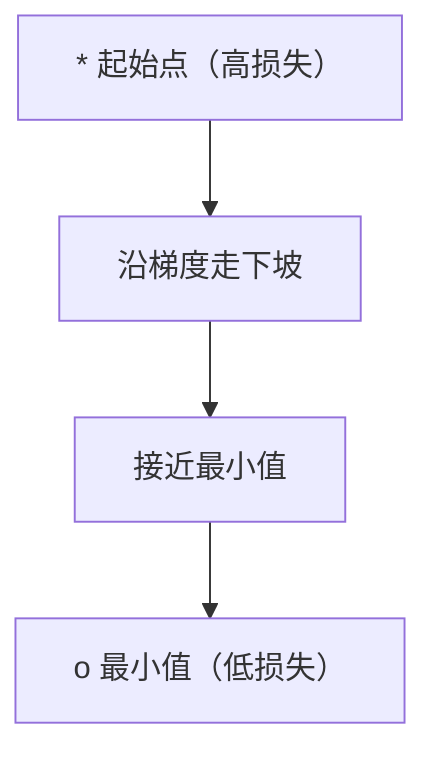
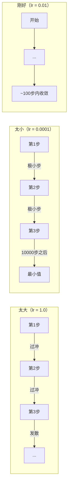
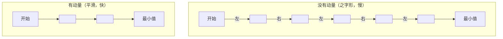
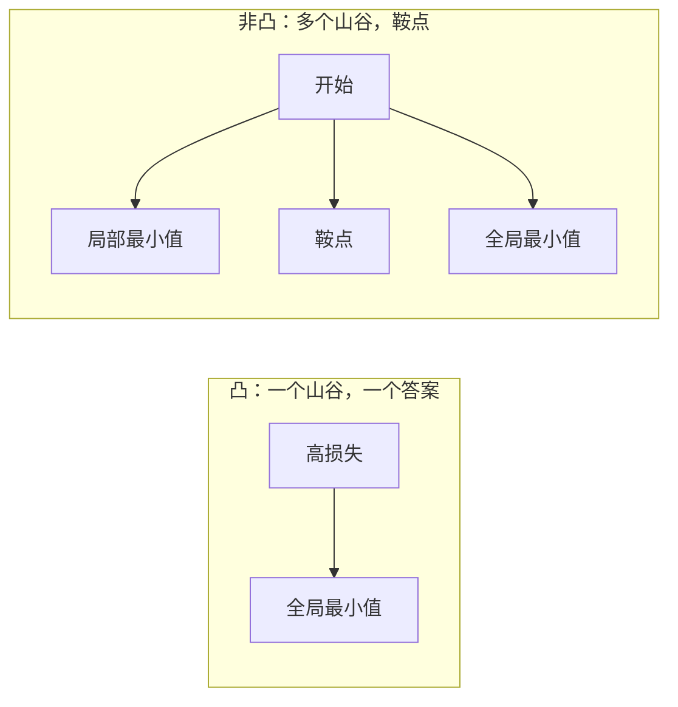
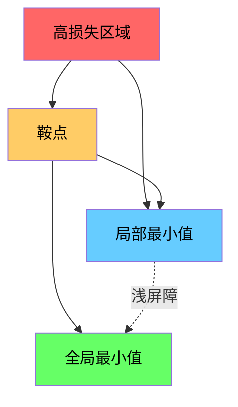

# 优化

> 训练神经网络不过是找到山谷的底部。

**类型：** 构建
**语言：** Python
**前置知识：** Phase 1 第 04-05 课（导数、梯度）
**时间：** ~75 分钟

## 学习目标

- 从零实现普通梯度下降、带动量的 SGD 和 Adam
- 在 Rosenbrock 函数上比较优化器的收敛性，解释 Adam 为什么对每个权重使用自适应学习率
- 区分凸与非凸损失面，解释高维情况下鞍点的作用
- 为训练稳定性配置学习率调度（步进衰减、余弦退火、预热）

## 问题背景

你有一个损失函数，告诉你模型有多错。你有梯度，告诉你哪个方向使损失更差。现在你需要一个策略来走下坡。

朴素方法很简单：沿梯度反方向移动，用一个称为学习率的数字缩放步长，重复。这就是梯度下降，它有效。但"有效"有条件。学习率太大，你会完全越过山谷，在两壁之间来回反弹。太小，你会经历成千上万次不必要的步骤才能到达答案。遇到鞍点，你就停下来了，即使还没找到最小值。

深度学习中的每个优化器都是对同一问题的回答：如何更快更可靠地到达山谷底部？

## 核心概念

### 优化的含义

优化是找到使函数最小（或最大）的输入值。在机器学习中，函数是损失，输入是模型权重。训练就是优化。

```
最小化 L(w)，其中：
  L = 损失函数
  w = 模型权重（可能是数百万个参数）
```

### 梯度下降（普通版）

最简单的优化器：计算损失关于每个权重的梯度，朝梯度反方向移动，步长由学习率缩放。

```
w = w - lr * 梯度
```

这就是整个算法——一行。



### 学习率：最重要的超参数

学习率控制步长，决定收敛的一切。



没有求正确学习率的公式，要靠实验找。常见起点：Adam 用 0.001，带动量的 SGD 用 0.01。

### SGD vs 批量梯度下降 vs 小批量

普通梯度下降在迈出一步之前对整个数据集计算梯度，这称为批量梯度下降，稳定但慢。

随机梯度下降（SGD）对单个随机样本计算梯度并立即迈步，噪声多但快。

小批量梯度下降取两者的折中：对小批量（32、64、128、256 个样本）计算梯度，然后迈步。这是实际使用的方式。

| 变体 | 批量大小 | 梯度质量 | 每步速度 | 噪声 |
|---------|-----------|-----------------|---------------|-------|
| 批量梯度下降 | 整个数据集 | 精确 | 慢 | 无 |
| SGD | 1 个样本 | 极噪 | 快 | 高 |
| 小批量 | 32-256 | 良好估计 | 均衡 | 中等 |

SGD 和小批量中的噪声不是缺陷。它有助于逃脱浅层局部最小值和鞍点。

### 动量：滚下山的球

普通梯度下降只看当前梯度。如果梯度来回振荡（在狭窄山谷中常见），进度就很慢。动量通过将过去的梯度累积到速度项来解决这个问题。

```
v = beta * v + 梯度
w = w - lr * v
```

类比：滚下山的球，不会在每次颠簸时停下重启，而是在一致方向上积累速度，抑制振荡。



`beta`（通常为 0.9）控制保留多少历史。更高的 beta 意味着更多动量，更平滑的路径，但对方向变化响应更慢。

### Adam：自适应学习率

不同权重需要不同学习率。很少获得大梯度的权重，当它最终获得时应该迈更大步。不断获得巨大梯度的权重应该迈更小步。

Adam（自适应矩估计）为每个权重追踪两件事：

1. 一阶矩（m）：梯度的运行平均（类似动量）
2. 二阶矩（v）：梯度平方的运行平均（梯度大小）

```
m = beta1 * m + (1 - beta1) * 梯度
v = beta2 * v + (1 - beta2) * 梯度^2

m_hat = m / (1 - beta1^t)    偏差修正
v_hat = v / (1 - beta2^t)    偏差修正

w = w - lr * m_hat / (sqrt(v_hat) + epsilon)
```

除以 `sqrt(v_hat)` 是关键见解。梯度大的权重除以大数（小的有效步长），梯度小的权重除以小数（大的有效步长）。每个权重都有自己的自适应学习率。

默认超参数：`lr=0.001, beta1=0.9, beta2=0.999, epsilon=1e-8`。这些默认值对大多数问题效果很好。

### 学习率调度

固定学习率是一种妥协。训练早期想要大步骤快速进展，训练晚期想要小步骤在最小值附近微调。

常见调度：

| 调度 | 公式 | 使用场景 |
|----------|---------|----------|
| 步进衰减 | 每 N 个 epoch 乘以 factor | 简单，手动控制 |
| 指数衰减 | lr = lr_0 * decay^t | 平滑减少 |
| 余弦退火 | lr = lr_min + 0.5 * (lr_max - lr_min) * (1 + cos(pi * t / T)) | Transformer，现代训练 |
| 预热 + 衰减 | 线性预热，然后衰减 | 大型模型，防止早期不稳定 |

### 凸 vs 非凸

凸函数有一个最小值，梯度下降总能找到它。像 `f(x) = x^2` 这样的二次函数是凸的。

神经网络损失函数是非凸的，有许多局部最小值、鞍点和平坦区域。



实践中，高维神经网络中的局部最小值很少成为问题。大多数局部最小值的损失值接近全局最小值。鞍点（某些方向平坦，某些方向弯曲）才是真正的障碍。动量和小批量的噪声有助于逃脱它们。

### 损失面可视化

损失是所有权重的函数。对于 100 万个权重的模型，损失面存在于 100 万零 1 维空间中。我们通过在权重空间中选择两个随机方向并绘制沿这些方向的损失来可视化它，产生一个 2D 曲面。



尖锐最小值泛化差。平坦最小值泛化好。这是带动量的 SGD 在最终测试精度上通常优于 Adam 的原因之一：它的噪声防止陷入尖锐最小值。

## 动手实现

### 第一步：定义测试函数

Rosenbrock 函数是经典的优化基准。其最小值在 (1, 1)，位于一个容易找到但难以沿着走的狭窄弯曲山谷内。

```
f(x, y) = (1 - x)^2 + 100 * (y - x^2)^2
```

```python
def rosenbrock(params):
    x, y = params
    return (1 - x) ** 2 + 100 * (y - x ** 2) ** 2

def rosenbrock_gradient(params):
    x, y = params
    df_dx = -2 * (1 - x) + 200 * (y - x ** 2) * (-2 * x)
    df_dy = 200 * (y - x ** 2)
    return [df_dx, df_dy]
```

### 第二步：普通梯度下降

```python
class GradientDescent:
    def __init__(self, lr=0.001):
        self.lr = lr

    def step(self, params, grads):
        return [p - self.lr * g for p, g in zip(params, grads)]
```

### 第三步：带动量的 SGD

```python
class SGDMomentum:
    def __init__(self, lr=0.001, momentum=0.9):
        self.lr = lr
        self.momentum = momentum
        self.velocity = None

    def step(self, params, grads):
        if self.velocity is None:
            self.velocity = [0.0] * len(params)
        self.velocity = [
            self.momentum * v + g
            for v, g in zip(self.velocity, grads)
        ]
        return [p - self.lr * v for p, v in zip(params, self.velocity)]
```

### 第四步：Adam

```python
class Adam:
    def __init__(self, lr=0.001, beta1=0.9, beta2=0.999, epsilon=1e-8):
        self.lr = lr
        self.beta1 = beta1
        self.beta2 = beta2
        self.epsilon = epsilon
        self.m = None
        self.v = None
        self.t = 0

    def step(self, params, grads):
        if self.m is None:
            self.m = [0.0] * len(params)
            self.v = [0.0] * len(params)

        self.t += 1

        self.m = [
            self.beta1 * m + (1 - self.beta1) * g
            for m, g in zip(self.m, grads)
        ]
        self.v = [
            self.beta2 * v + (1 - self.beta2) * g ** 2
            for v, g in zip(self.v, grads)
        ]

        m_hat = [m / (1 - self.beta1 ** self.t) for m in self.m]
        v_hat = [v / (1 - self.beta2 ** self.t) for v in self.v]

        return [
            p - self.lr * mh / (vh ** 0.5 + self.epsilon)
            for p, mh, vh in zip(params, m_hat, v_hat)
        ]
```

### 第五步：运行并比较

```python
def optimize(optimizer, func, grad_func, start, steps=5000):
    params = list(start)
    history = [params[:]]
    for _ in range(steps):
        grads = grad_func(params)
        params = optimizer.step(params, grads)
        history.append(params[:])
    return history

start = [-1.0, 1.0]

gd_history = optimize(GradientDescent(lr=0.0005), rosenbrock, rosenbrock_gradient, start)
sgd_history = optimize(SGDMomentum(lr=0.0001, momentum=0.9), rosenbrock, rosenbrock_gradient, start)
adam_history = optimize(Adam(lr=0.01), rosenbrock, rosenbrock_gradient, start)

for name, history in [("GD", gd_history), ("SGD+M", sgd_history), ("Adam", adam_history)]:
    final = history[-1]
    loss = rosenbrock(final)
    print(f"{name:6s} -> x={final[0]:.6f}, y={final[1]:.6f}, loss={loss:.8f}")
```

预期输出：Adam 收敛最快，带动量的 SGD 路径更平滑，普通梯度下降沿狭窄山谷缓慢前进。

## 实际使用

实践中，使用 PyTorch 或 JAX 优化器，它们处理参数组、权重衰减、梯度裁剪和 GPU 加速。

```python
import torch

model = torch.nn.Linear(784, 10)

sgd = torch.optim.SGD(model.parameters(), lr=0.01, momentum=0.9)
adam = torch.optim.Adam(model.parameters(), lr=0.001)
adamw = torch.optim.AdamW(model.parameters(), lr=0.001, weight_decay=0.01)

scheduler = torch.optim.lr_scheduler.CosineAnnealingLR(adam, T_max=100)
```

经验规则：

- 从 Adam（lr=0.001）开始，对大多数问题无需调参。
- 需要最佳最终精度且能承受更多调参时，切换到带动量的 SGD（lr=0.01，momentum=0.9）。
- 对 Transformer 使用 AdamW（解耦权重衰减的 Adam）。
- 对超过几个 epoch 的训练运行，始终使用学习率调度。
- 如果训练不稳定，降低学习率。如果训练太慢，提高学习率。

## 输出产物

本课产出选择正确优化器的提示词，见 `outputs/prompt-optimizer-guide.md`。

这里构建的优化器类在 Phase 3 中从零训练神经网络时再次出现。

## 练习题

1. **学习率扫描。** 在 Rosenbrock 函数上用学习率 [0.0001, 0.0005, 0.001, 0.005, 0.01] 运行普通梯度下降。打印每个 5000 步后的最终损失。找到仍能收敛的最大学习率。

2. **动量比较。** 在 Rosenbrock 函数上用动量值 [0.0, 0.5, 0.9, 0.99] 运行 SGD。追踪每步的损失。哪个动量值收敛最快？哪个过冲？

3. **鞍点逃脱。** 定义函数 `f(x, y) = x^2 - y^2`（在原点有鞍点）。从 (0.01, 0.01) 开始，比较普通梯度下降、带动量的 SGD 和 Adam 的行为。哪个能逃脱鞍点？

4. **实现学习率衰减。** 给 GradientDescent 类添加指数衰减调度：`lr = lr_0 * 0.999^step`。在 Rosenbrock 函数上比较有衰减和无衰减的收敛情况。

## 关键术语

| 术语 | 通俗说法 | 实际含义 |
|------|----------------|----------------------|
| 梯度下降（Gradient descent）| "走下坡" | 通过减去学习率缩放的梯度来更新权重。最基本的优化器。 |
| 学习率（Learning rate）| "步长" | 控制每次更新移动权重多远的标量。太大导致发散，太小浪费计算。 |
| 动量（Momentum）| "持续滚动" | 将过去的梯度累积到速度向量中。抑制振荡，加速沿一致方向的运动。 |
| SGD | "随机采样" | 随机梯度下降。对随机子集而不是完整数据集计算梯度。实践中几乎总是指小批量 SGD。 |
| 小批量（Mini-batch）| "一小块数据" | 用于估计梯度的训练数据小子集（32-256 个样本）。平衡速度和梯度准确性。 |
| Adam | "默认优化器" | 自适应矩估计。追踪每权重梯度和梯度平方的运行平均，为每个权重提供自适应学习率。 |
| 偏差修正（Bias correction）| "修复冷启动" | Adam 的一阶和二阶矩初始化为零，偏差修正在早期步骤中除以 (1 - beta^t) 补偿。 |
| 学习率调度（Learning rate schedule）| "随时间改变 lr" | 在训练过程中调整学习率的函数。早期大步，晚期小步。 |
| 凸函数（Convex function）| "一个山谷" | 任何局部最小值就是全局最小值的函数。梯度下降总能找到它。神经网络损失不是凸的。 |
| 鞍点（Saddle point）| "平坦但不是最小值" | 梯度为零但在某些方向是最小值、在其他方向是最大值的点。在高维中常见。 |
| 损失面（Loss landscape）| "地形" | 绘制在权重空间上的损失函数。通过沿两个随机方向切片来可视化。 |
| 收敛（Convergence）| "到达那里" | 优化器达到进一步的步骤不会有意义地减少损失的点。 |

## 延伸阅读

- [Sebastian Ruder：梯度下降优化算法综述](https://ruder.io/optimizing-gradient-descent/) - 所有主要优化器的全面调查
- [动量为什么真正有效（Distill）](https://distill.pub/2017/momentum/) - 动量动态的交互可视化
- [Adam：随机优化方法（Kingma & Ba，2014）](https://arxiv.org/abs/1412.6980) - 原始 Adam 论文，可读且简短
- [神经网络的损失面可视化（Li 等人，2018）](https://arxiv.org/abs/1712.09913) - 展示尖锐 vs 平坦最小值的论文
