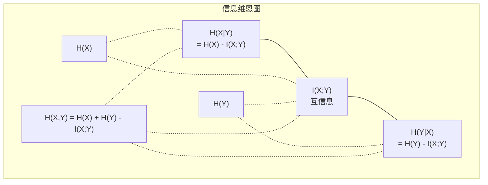

# 信息论

> 信息论衡量惊喜。损失函数建立在它之上。

**类型：** 学习
**语言：** Python
**前置知识：** Phase 1 第 06 课（概率）
**时间：** ~60 分钟

## 学习目标

- 从零计算熵、交叉熵和 KL 散度，并解释它们之间的关系
- 推导最小化交叉熵损失等价于最大化对数似然
- 计算特征和目标之间的互信息以排列特征重要性
- 解释困惑度（perplexity）作为语言模型从中选择的有效词汇量

## 问题背景

你在训练的每个分类模型中都调用 `CrossEntropyLoss()`。你在每篇语言模型论文中都看到"困惑度"。你在 VAE、蒸馏和 RLHF 中读到 KL 散度。这些不是脱节的概念，它们都是同一个想法换了不同的帽子。

信息论给你推理不确定性、压缩和预测的语言。Claude Shannon 于 1948 年为解决通信问题而发明了它。结果发现，训练神经网络就是一个通信问题：模型试图通过学习权重的嘈杂信道传输正确的标签。

本课从零构建每个公式，让你看到它们来自哪里以及为什么有效。

## 核心概念

### 信息量（惊喜）

当不太可能的事情发生时，它携带更多信息。硬币正面朝上？不奇怪。彩票中奖？非常奇怪。

概率为 p 的事件的信息量为：

```
I(x) = -log(p(x))
```

用以 2 为底的对数给你比特（bits），用自然对数给你奈特（nats），相同的想法，不同的单位。

```
事件              概率       惊喜量（比特）
公平硬币正面      0.5        1.0
掷出 6 点         0.167      2.58
千分之一事件      0.001      9.97
确定事件          1.0        0.0
```

确定事件携带零信息。你已经知道它会发生。

### 熵（平均惊喜）

熵是分布所有可能结果的期望惊喜。

```
H(P) = -sum( p(x) * log(p(x)) )  对所有 x
```

公平硬币对二进制变量有最大熵：1 比特。有偏硬币（99% 正面）熵很低：0.08 比特，你已经知道会发生什么，所以每次翻转几乎什么都告诉不了你。

```
公平硬币：   H = -(0.5 * log2(0.5) + 0.5 * log2(0.5)) = 1.0 比特
有偏硬币：   H = -(0.99 * log2(0.99) + 0.01 * log2(0.01)) = 0.08 比特
```

熵衡量分布中的不可约不确定性，无法压缩到它以下。

### 交叉熵（你每天使用的损失函数）

交叉熵衡量当你使用分布 Q 来编码实际来自分布 P 的事件时的平均惊喜。

```
H(P, Q) = -sum( p(x) * log(q(x)) )  对所有 x
```

P 是真实分布（标签），Q 是模型的预测。如果 Q 完美匹配 P，交叉熵等于熵。任何不匹配都会使它更大。

在分类中，P 是 one-hot 向量（真实类别概率为 1，其他为 0）。这简化交叉熵为：

```
H(P, Q) = -log(q(真实类别))
```

这就是分类的完整交叉熵损失公式——最大化正确类别的预测概率。

### KL 散度（分布间的距离）

KL 散度衡量使用 Q 替代 P 所增加的额外惊喜。

```
D_KL(P || Q) = sum( p(x) * log(p(x) / q(x)) )  对所有 x
             = H(P, Q) - H(P)
```

交叉熵是熵加 KL 散度。由于训练过程中真实分布的熵是常数，最小化交叉熵等于最小化 KL 散度——你在推动模型的分布接近真实分布。

KL 散度不对称：D_KL(P || Q) ≠ D_KL(Q || P)。它不是真正的距离度量。

### 互信息

互信息衡量知道一个变量对另一个变量的告知程度。

```
I(X; Y) = H(X) - H(X|Y)
        = H(X) + H(Y) - H(X, Y)
```

如果 X 和 Y 独立，互信息为零。如果它们完全相关，互信息等于任一变量的熵。

在特征选择中，特征与目标之间的高互信息意味着该特征有用，低互信息意味着它是噪声。

### 条件熵

H(Y|X) 衡量观察 X 后 Y 的不确定性还有多少。

```
H(Y|X) = H(X,Y) - H(X)
```

两个极端：
- 如果 X 完全决定 Y，则 H(Y|X) = 0。知道 X 消除了关于 Y 的所有不确定性。例如：X = 摄氏温度，Y = 华氏温度。
- 如果 X 对 Y 什么都不告诉，则 H(Y|X) = H(Y)。知道 X 完全不减少你对 Y 的不确定性。例如：X = 硬币翻转，Y = 明天天气。

条件熵始终非负且不超过 H(Y)：

```
0 <= H(Y|X) <= H(Y)
```

在机器学习中，条件熵出现在决策树中。在每次分裂时，算法选择最小化 H(Y|X) 的特征——去除关于标签 Y 最多不确定性的特征。

### 联合熵

H(X,Y) 是 X 和 Y 一起的联合分布的熵。

```
H(X,Y) = -sum sum p(x,y) * log(p(x,y))   对所有 x, y
```

关键属性：

```
H(X,Y) <= H(X) + H(Y)
```

当 X 和 Y 独立时等号成立。如果它们共享信息，联合熵小于个别熵的和，"缺少的"熵恰好是互信息。



关系：
- H(X,Y) = H(X) + H(Y|X) = H(Y) + H(X|Y)
- I(X;Y) = H(X) - H(X|Y) = H(Y) - H(Y|X)
- H(X,Y) = H(X) + H(Y) - I(X;Y)

### 互信息（深入研究）

互信息 I(X;Y) 量化知道一个变量减少关于另一个变量的不确定性多少。

```
I(X;Y) = H(X) - H(X|Y)
       = H(Y) - H(Y|X)
       = H(X) + H(Y) - H(X,Y)
       = sum sum p(x,y) * log(p(x,y) / (p(x) * p(y)))
```

属性：
- I(X;Y) >= 0 始终成立。观察某事从不损失信息。
- I(X;Y) = 0 当且仅当 X 和 Y 独立。
- I(X;Y) = I(Y;X)。与 KL 散度不同，它是对称的。
- I(X;X) = H(X)。变量与自身共享所有信息。

**互信息用于特征选择。** 在 ML 中，你想要对目标有信息量的特征。互信息提供了一种有原则的方式对特征排序：

1. 对每个特征 X_i，计算 I(X_i; Y)，其中 Y 是目标变量。
2. 按 MI 分数排列特征。
3. 保留前 k 个特征。

这对特征和目标之间的任何关系都有效——线性、非线性、单调或非单调。相关性只捕获线性关系，MI 捕获一切。

| 方法 | 检测 | 计算代价 | 处理分类变量？ |
|--------|---------|-------------------|---------------------|
| Pearson 相关 | 线性关系 | O(n) | 否 |
| Spearman 相关 | 单调关系 | O(n log n) | 否 |
| 互信息 | 任何统计依赖 | O(n log n)（分箱） | 是 |

### 标签平滑与交叉熵

标准分类使用硬目标：[0, 0, 1, 0]。真实类别概率为 1，其他为 0。标签平滑用软目标替换：

```
soft_target = (1 - epsilon) * hard_target + epsilon / num_classes
```

epsilon = 0.1，4 个类别时：
- 硬目标：[0, 0, 1, 0]
- 软目标：[0.025, 0.025, 0.925, 0.025]

从信息论角度看，标签平滑增加了目标分布的熵。硬 one-hot 目标熵为 0——没有不确定性。软目标有正熵。

为什么有帮助：
- 防止模型将 logit 推向极值（完美匹配 one-hot 目标需要无穷大的 logit）
- 充当正则化：模型不能 100% 确定
- 改善校准：预测概率更好地反映真实不确定性
- 减少训练和推断行为之间的差距

带标签平滑的交叉熵损失变为：

```
L = (1 - epsilon) * CE(硬目标, 预测) + epsilon * H_uniform(预测)
```

第二项惩罚远离均匀分布的预测——直接对置信度进行正则化。

### 为什么交叉熵是分类损失

三种视角，相同结论。

**信息论视角。** 交叉熵衡量使用模型分布而非真实分布浪费的比特数。最小化它使模型成为最高效的现实编码器。

**最大似然视角。** 对 N 个训练样本，真实类别 y_i：

```
似然        = product( q(y_i) )
对数似然    = sum( log(q(y_i)) )
负对数似然  = -sum( log(q(y_i)) )
```

最后一行就是交叉熵损失。最小化交叉熵 = 最大化训练数据在模型下的似然。

**梯度视角。** 交叉熵关于 logit 的梯度简单地是（预测 - 真实）。干净、稳定、计算快。这就是为什么它与 softmax 完美搭配。

### 比特 vs 奈特

唯一区别是对数底数。

```
以 2 为底   -> 比特（bits）   （信息论传统）
以 e 为底   -> 奈特（nats）   （机器学习惯例）
以 10 为底  -> 哈特利（hartleys）（很少使用）
```

1 奈特 = 1/ln(2) 比特 = 1.4427 比特。PyTorch 和 TensorFlow 默认使用自然对数（奈特）。

### 困惑度

困惑度是交叉熵的指数。它告诉你模型在不确定的情况下有效的等可能选择数。

```
困惑度 = 2^H(P,Q)   （使用比特）
困惑度 = e^H(P,Q)   （使用奈特）
```

困惑度为 50 的语言模型，平均来说，就像在 50 个可能的下一个 token 中均匀选择一样困惑。越低越好。

GPT-2 在常见基准上达到了约 30 的困惑度。现代模型在有良好表示的领域个位数困惑度。

## 动手实现

### 第一步：信息量和熵

```python
import math

def information_content(p, base=2):
    if p <= 0 or p > 1:
        return float('inf') if p <= 0 else 0.0
    return -math.log(p) / math.log(base)

def entropy(probs, base=2):
    return sum(
        p * information_content(p, base)
        for p in probs if p > 0
    )

fair_coin = [0.5, 0.5]
biased_coin = [0.99, 0.01]
fair_die = [1/6] * 6

print(f"公平硬币熵：   {entropy(fair_coin):.4f} 比特")
print(f"有偏硬币熵：   {entropy(biased_coin):.4f} 比特")
print(f"公平骰子熵：   {entropy(fair_die):.4f} 比特")
```

### 第二步：交叉熵和 KL 散度

```python
def cross_entropy(p, q, base=2):
    total = 0.0
    for pi, qi in zip(p, q):
        if pi > 0:
            if qi <= 0:
                return float('inf')
            total += pi * (-math.log(qi) / math.log(base))
    return total

def kl_divergence(p, q, base=2):
    return cross_entropy(p, q, base) - entropy(p, base)

true_dist = [0.7, 0.2, 0.1]
good_model = [0.6, 0.25, 0.15]
bad_model = [0.1, 0.1, 0.8]

print(f"真实分布熵：         {entropy(true_dist):.4f} 比特")
print(f"CE（好模型）：       {cross_entropy(true_dist, good_model):.4f} 比特")
print(f"CE（差模型）：       {cross_entropy(true_dist, bad_model):.4f} 比特")
print(f"KL 散度（好）：      {kl_divergence(true_dist, good_model):.4f} 比特")
print(f"KL 散度（差）：      {kl_divergence(true_dist, bad_model):.4f} 比特")
```

### 第三步：交叉熵作为分类损失

```python
def softmax(logits):
    max_logit = max(logits)
    exps = [math.exp(z - max_logit) for z in logits]
    total = sum(exps)
    return [e / total for e in exps]

def cross_entropy_loss(true_class, logits):
    probs = softmax(logits)
    return -math.log(probs[true_class])

logits = [2.0, 1.0, 0.1]
true_class = 0

probs = softmax(logits)
loss = cross_entropy_loss(true_class, logits)

print(f"Logits：     {logits}")
print(f"Softmax：    {[f'{p:.4f}' for p in probs]}")
print(f"真实类别：   {true_class}")
print(f"损失：       {loss:.4f} 奈特")
print(f"困惑度：     {math.exp(loss):.2f}")
```

### 第四步：交叉熵等于负对数似然

```python
import random

random.seed(42)

n_samples = 1000
n_classes = 3
true_labels = [random.randint(0, n_classes - 1) for _ in range(n_samples)]
model_logits = [[random.gauss(0, 1) for _ in range(n_classes)] for _ in range(n_samples)]

ce_loss = sum(
    cross_entropy_loss(label, logits)
    for label, logits in zip(true_labels, model_logits)
) / n_samples

nll = -sum(
    math.log(softmax(logits)[label])
    for label, logits in zip(true_labels, model_logits)
) / n_samples

print(f"交叉熵损失：     {ce_loss:.6f}")
print(f"负对数似然：     {nll:.6f}")
print(f"差异：           {abs(ce_loss - nll):.2e}")
```

### 第五步：互信息

```python
def mutual_information(joint_probs, base=2):
    rows = len(joint_probs)
    cols = len(joint_probs[0])

    margin_x = [sum(joint_probs[i][j] for j in range(cols)) for i in range(rows)]
    margin_y = [sum(joint_probs[i][j] for i in range(rows)) for j in range(cols)]

    mi = 0.0
    for i in range(rows):
        for j in range(cols):
            pxy = joint_probs[i][j]
            if pxy > 0:
                mi += pxy * math.log(pxy / (margin_x[i] * margin_y[j])) / math.log(base)
    return mi

independent = [[0.25, 0.25], [0.25, 0.25]]
dependent = [[0.45, 0.05], [0.05, 0.45]]

print(f"MI（独立）：   {mutual_information(independent):.4f} 比特")
print(f"MI（相关）：   {mutual_information(dependent):.4f} 比特")
```

## 实际使用

使用 NumPy 的相同概念，你实际使用的方式：

```python
import numpy as np

def np_entropy(p):
    p = np.asarray(p, dtype=float)
    mask = p > 0
    result = np.zeros_like(p)
    result[mask] = p[mask] * np.log(p[mask])
    return -result.sum()

def np_cross_entropy(p, q):
    p, q = np.asarray(p, dtype=float), np.asarray(q, dtype=float)
    mask = p > 0
    return -(p[mask] * np.log(q[mask])).sum()

def np_kl_divergence(p, q):
    return np_cross_entropy(p, q) - np_entropy(p)

true = np.array([0.7, 0.2, 0.1])
pred = np.array([0.6, 0.25, 0.15])
print(f"熵：        {np_entropy(true):.4f} 奈特")
print(f"交叉熵：    {np_cross_entropy(true, pred):.4f} 奈特")
print(f"KL 散度：   {np_kl_divergence(true, pred):.4f} 奈特")
```

你从零构建了 `torch.nn.CrossEntropyLoss()` 内部做的事情。现在你知道为什么损失在训练中下降：你的模型预测分布越来越接近真实分布，以浪费的信息奈特衡量。

## 练习题

1. 假设均匀分布（26 个字母），计算英文字母表的熵。然后用实际字母频率估计它。哪个更高？为什么？

2. 模型对真实类别为 1 的样本输出 logit [5.0, 2.0, 0.5]。手工计算交叉熵损失，然后用你的 `cross_entropy_loss` 函数验证。什么 logit 会给零损失？

3. 展示 KL 散度不对称。选择两个分布 P 和 Q，计算 D_KL(P || Q) 和 D_KL(Q || P)，解释它们为什么不同。

4. 构建一个计算 token 预测序列困惑度的函数。给定 (真实 token 索引, 预测 logit) 对的列表，返回序列的困惑度。

## 关键术语

| 术语 | 通俗说法 | 实际含义 |
|------|----------------|----------------------|
| 信息量（Information content）| "惊喜" | 编码一个事件所需的比特（或奈特）数：-log(p) |
| 熵（Entropy）| "随机性" | 分布所有结果的平均惊喜，衡量不可约不确定性 |
| 交叉熵（Cross-entropy）| "损失函数" | 使用模型分布 Q 编码来自真实分布 P 的事件的平均惊喜 |
| KL 散度（KL divergence）| "分布间距离" | 使用 Q 替代 P 浪费的额外比特，等于交叉熵减去熵，不对称 |
| 互信息（Mutual information）| "X 和 Y 有多相关" | 知道 Y 后 X 不确定性的减少，零表示独立 |
| Softmax | "将 logit 变概率" | 指数化并归一化，将任意实值向量映射到有效概率分布 |
| 困惑度（Perplexity）| "模型有多困惑" | 交叉熵的指数，模型在每步从中选择的有效词汇量，越低越好 |
| 比特（Bits）| "Shannon 的单位" | 用以 2 为底的对数衡量信息，一比特解决一次公平硬币翻转 |
| 奈特（Nats）| "ML 的单位" | 用自然对数衡量信息，PyTorch 和 TensorFlow 默认使用 |
| 负对数似然（Negative log-likelihood）| "NLL 损失" | 对 one-hot 标签与交叉熵损失完全相同。最小化它最大化正确预测的概率。 |

## 延伸阅读

- [Shannon 1948：通信的数学理论](https://people.math.harvard.edu/~ctm/home/text/others/shannon/entropy/entropy.pdf) - 原始论文，仍然可读
- [视觉信息论（Chris Olah）](https://colah.github.io/posts/2015-09-Visual-Information/) - 熵和 KL 散度的最佳视觉解释
- [PyTorch CrossEntropyLoss 文档](https://pytorch.org/docs/stable/generated/torch.nn.CrossEntropyLoss.html) - 框架如何实现你刚构建的内容
