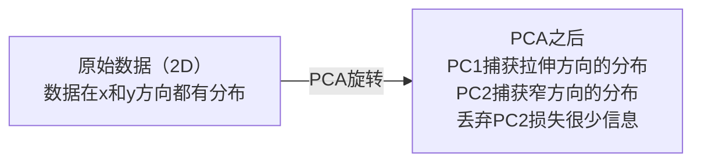

# 降维

> 高维数据具有内在结构。找到正确的视角，你就能发现它。

**类型：** 构建实现
**语言：** Python
**前置知识：** 第一阶段，第01课（线性代数直觉）、第02课（向量、矩阵与运算）、第03课（特征值与特征向量）、第06课（概率与分布）
**时间：** 约90分钟

## 学习目标

- 从零实现PCA：中心化数据、计算协方差矩阵、特征分解、投影
- 使用解释方差比和肘部法则选择主成分数量
- 比较PCA、t-SNE和UMAP在2D可视化MNIST数字时的效果，并解释各自的权衡
- 使用RBF核的核PCA处理标准PCA无法分离的非线性数据结构

## 问题背景

你有一个每个样本784个特征的数据集。也许是手写数字的像素值，也许是基因表达水平，也许是用户行为信号。你无法可视化784个维度，无法绘制它们，甚至无法构思它们。

但这784个特征中的大多数是冗余的。真正的信息存在于一个小得多的曲面上。一个手写的"7"并不需要784个独立的数字来描述——它只需要几个：笔画的角度、横线的长度、倾斜程度。其余的都是噪声。

降维就是找到那个更小的曲面。它将784维数据压缩到2维、10维或50维，同时保留重要的结构。

## 核心概念

### 维数灾难

高维空间违反直觉。随着维度增长，有三件事会出错。

**距离失去意义。** 在高维空间中，任意两个随机点之间的距离会收敛到相同的值。如果每个点与其他所有点的距离大致相同，最近邻搜索就失效了。

```
维度数    随机点间平均距离比（最大/最小）
2         ~5.0
10        ~1.8
100       ~1.2
1000      ~1.02
```

**体积集中在角落。** d维单位超立方体有2^d个角。在100维中，几乎所有体积都集中在角落，远离中心。数据点扩散到边缘，模型在内部区域严重缺乏数据。

**需要指数级更多数据。** 为了在一个空间中保持相同的样本密度，从2D扩展到20D意味着你需要10^18倍的数据。你永远不会有足够的数据。降维将数据密度恢复到可处理的水平。

### PCA：找到重要的方向

主成分分析（PCA）找到数据变化最大的轴。它旋转坐标系，使第一个轴捕获最多方差，第二个轴捕获次多，依此类推。

算法步骤：

```
1. 中心化数据        （从每个特征中减去均值）
2. 计算协方差矩阵    （特征如何共同变化）
3. 特征分解          （找到主方向）
4. 按特征值排序      （最大方差优先）
5. 投影              （保留前k个特征向量，丢弃其余）
```

为什么要特征分解？协方差矩阵是对称半正定的。其特征向量是特征空间中的正交方向。特征值告诉你每个方向捕获了多少方差。最大特征值对应的特征向量指向最大方差方向。



- **PCA之前：** 数据云在x轴和y轴上斜向分布
- **PCA之后：** 坐标系旋转，使PC1对齐最大方差方向（拉伸分布），PC2对齐最小方差方向（窄分布）
- **降维：** 丢弃PC2将数据投影到PC1上，损失极少信息

### 解释方差比

每个主成分捕获总方差的一个比例。解释方差比告诉你具体捕获了多少。

```
成分    特征值    解释比例    累积比例
PC1     4.73      0.473       0.473
PC2     2.51      0.251       0.724
PC3     1.12      0.112       0.836
PC4     0.89      0.089       0.925
...
```

当累积解释方差达到0.95时，你知道这些成分捕获了95%的信息。之后的成分大多是噪声。

### 选择成分数量

三种策略：

1. **阈值法。** 保留足够多的成分以解释90-95%的方差。
2. **肘部法则。** 绘制每个成分的解释方差。寻找急剧下降的拐点。
3. **下游性能法。** 将PCA用作预处理。遍历不同的k值并测量模型准确率。最佳k是准确率趋于平稳的地方。

### t-SNE：保留邻域关系

t分布随机邻域嵌入（t-SNE）专为可视化设计。它将高维数据映射到2D（或3D），同时保留哪些点彼此接近的关系。

直觉：在原始空间中，根据点之间的距离计算点对的概率分布。近点获得高概率，远点获得低概率。然后找到一个2D排列，使相同的概率分布成立。在784维中是邻居的点在2D中仍然是邻居。

t-SNE的关键特性：
- 非线性。它可以展开PCA无法处理的复杂流形。
- 随机性。不同的运行会产生不同的布局。
- 困惑度参数控制考虑多少个邻居（典型范围：5-50）。
- 输出中簇之间的距离没有意义。只有簇本身有意义。
- 在大数据集上速度慢，默认为O(n^2)。

### UMAP：更快、更好的全局结构

均匀流形逼近与投影（UMAP）的工作方式类似于t-SNE，但有两个优势：
- 更快。它使用近似最近邻图，而不是计算所有成对距离。
- 更好的全局结构。输出中簇的相对位置往往比t-SNE更有意义。

UMAP在高维空间中构建加权图（"模糊拓扑表示"），然后找到尽可能保留此图的低维布局。

关键参数：
- `n_neighbors`：定义局部结构的邻居数量（类似于困惑度）。更高的值保留更多全局结构。
- `min_dist`：输出中点的紧密程度。更低的值创建更密集的簇。

### 何时使用哪种方法

| 方法 | 使用场景 | 保留什么 | 速度 |
|------|----------|----------|------|
| PCA | 训练前的预处理 | 全局方差 | 快速（精确），适用于百万级样本 |
| PCA | 快速探索性可视化 | 线性结构 | 快速 |
| t-SNE | 高质量2D图表（发表级） | 局部邻域 | 慢（理想情况下< 10k样本） |
| UMAP | 大规模2D可视化 | 局部+部分全局结构 | 中等（可处理百万级数据） |
| PCA | 为模型做特征降维 | 方差排序特征 | 快速 |
| t-SNE / UMAP | 理解簇结构 | 簇分离 | 中等到慢 |

经验法则：使用PCA进行预处理和数据压缩。当需要在2D中可视化结构时，使用t-SNE或UMAP。

### 核PCA

标准PCA寻找线性子空间。它旋转坐标系并丢弃轴。但如果数据位于非线性流形上呢？2D中的圆形无法被任何直线分离。标准PCA无法处理这种情况。

核PCA在由核函数诱导的高维特征空间中应用PCA，而无需显式计算该空间中的坐标。这就是核技巧——与SVM背后相同的思想。

算法步骤：
1. 计算核矩阵K，其中K_ij = k(x_i, x_j)
2. 在特征空间中中心化核矩阵
3. 对中心化核矩阵进行特征分解
4. 前k个特征向量（按1/sqrt(特征值)缩放）即为投影

常用核函数：

| 核函数 | 公式 | 适用场景 |
|--------|------|----------|
| RBF（高斯核） | exp(-gamma * \|\|x - y\|\|^2) | 大多数非线性数据、光滑流形 |
| 多项式核 | (x · y + c)^d | 多项式关系 |
| Sigmoid核 | tanh(alpha * x · y + c) | 类神经网络映射 |

何时使用核PCA vs 标准PCA：

| 标准 | 标准PCA | 核PCA |
|------|---------|-------|
| 数据结构 | 线性子空间 | 非线性流形 |
| 速度 | O(min(n^2 d, d^2 n)) | O(n^2 d + n^3) |
| 可解释性 | 成分是特征的线性组合 | 成分缺乏直接特征解释 |
| 可扩展性 | 适用于百万级样本 | 核矩阵为n×n，受内存限制 |
| 重建 | 直接逆变换 | 需要原像近似 |

经典例子：2D中的同心圆。两组点，一组在内圈，一组在外圈。标准PCA将两者投影到同一条线上——对分类毫无用处。使用RBF核的核PCA将内圆和外圆映射到不同区域，使它们线性可分。

### 重建误差

你的降维效果有多好？你将784维压缩到50维。损失了什么？

测量重建误差：
1. 将数据投影到k维：X_reduced = X @ W_k
2. 重建：X_hat = X_reduced @ W_k^T
3. 计算MSE：mean((X - X_hat)^2)

对于PCA，重建误差与解释方差有清晰的关系：

```
重建误差 = 未包含的特征值之和
总方差   = 所有特征值之和
损失比例 = （丢弃的特征值之和）/（所有特征值之和）
```

每个成分的解释方差比为：

```
explained_ratio_k = eigenvalue_k / sum(all eigenvalues)
```

将累积解释方差对成分数量作图，得到"肘部"曲线。正确的成分数量是：
- 曲线趋于平坦（收益递减）
- 累积方差超过阈值（通常为0.90或0.95）
- 下游任务性能趋于稳定

重建误差不仅用于选择k值，还可用于异常检测：重建误差高的样本是不符合所学子空间的异常点。这是生产系统中基于PCA的异常检测的基础。

## 动手实现

### 步骤1：从零实现PCA

```python
import numpy as np

class PCA:
    def __init__(self, n_components):
        self.n_components = n_components
        self.components = None
        self.mean = None
        self.eigenvalues = None
        self.explained_variance_ratio_ = None

    def fit(self, X):
        self.mean = np.mean(X, axis=0)
        X_centered = X - self.mean

        cov_matrix = np.cov(X_centered, rowvar=False)

        eigenvalues, eigenvectors = np.linalg.eigh(cov_matrix)

        sorted_idx = np.argsort(eigenvalues)[::-1]
        eigenvalues = eigenvalues[sorted_idx]
        eigenvectors = eigenvectors[:, sorted_idx]

        self.components = eigenvectors[:, :self.n_components].T
        self.eigenvalues = eigenvalues[:self.n_components]
        total_var = np.sum(eigenvalues)
        self.explained_variance_ratio_ = self.eigenvalues / total_var

        return self

    def transform(self, X):
        X_centered = X - self.mean
        return X_centered @ self.components.T

    def fit_transform(self, X):
        self.fit(X)
        return self.transform(X)
```

### 步骤2：在合成数据上测试

```python
np.random.seed(42)
n_samples = 500

t = np.random.uniform(0, 2 * np.pi, n_samples)
x1 = 3 * np.cos(t) + np.random.normal(0, 0.2, n_samples)
x2 = 3 * np.sin(t) + np.random.normal(0, 0.2, n_samples)
x3 = 0.5 * x1 + 0.3 * x2 + np.random.normal(0, 0.1, n_samples)

X_synthetic = np.column_stack([x1, x2, x3])

pca = PCA(n_components=2)
X_reduced = pca.fit_transform(X_synthetic)

print(f"原始形状: {X_synthetic.shape}")
print(f"降维后形状: {X_reduced.shape}")
print(f"解释方差比: {pca.explained_variance_ratio_}")
print(f"捕获的总方差: {sum(pca.explained_variance_ratio_):.4f}")
```

### 步骤3：MNIST数字的2D可视化

```python
from sklearn.datasets import fetch_openml

mnist = fetch_openml("mnist_784", version=1, as_frame=False, parser="auto")
X_mnist = mnist.data[:5000].astype(float)
y_mnist = mnist.target[:5000].astype(int)

pca_mnist = PCA(n_components=50)
X_pca50 = pca_mnist.fit_transform(X_mnist)
print(f"50个成分捕获了 {sum(pca_mnist.explained_variance_ratio_):.2%} 的方差")

pca_2d = PCA(n_components=2)
X_pca2d = pca_2d.fit_transform(X_mnist)
print(f"2个成分捕获了 {sum(pca_2d.explained_variance_ratio_):.2%} 的方差")
```

### 步骤4：与sklearn对比

```python
from sklearn.decomposition import PCA as SklearnPCA
from sklearn.manifold import TSNE

sklearn_pca = SklearnPCA(n_components=2)
X_sklearn_pca = sklearn_pca.fit_transform(X_mnist)

print(f"\n我们的PCA解释方差:    {pca_2d.explained_variance_ratio_}")
print(f"Sklearn PCA解释方差: {sklearn_pca.explained_variance_ratio_}")

diff = np.abs(np.abs(X_pca2d) - np.abs(X_sklearn_pca))
print(f"最大绝对差值: {diff.max():.10f}")

tsne = TSNE(n_components=2, perplexity=30, random_state=42)
X_tsne = tsne.fit_transform(X_mnist)
print(f"\nt-SNE输出形状: {X_tsne.shape}")
```

### 步骤5：UMAP对比

```python
try:
    from umap import UMAP

    reducer = UMAP(n_components=2, n_neighbors=15, min_dist=0.1, random_state=42)
    X_umap = reducer.fit_transform(X_mnist)
    print(f"UMAP输出形状: {X_umap.shape}")
except ImportError:
    print("安装umap-learn: pip install umap-learn")
```

## 应用示例

将PCA用作分类器的预处理：

```python
from sklearn.decomposition import PCA as SklearnPCA
from sklearn.linear_model import LogisticRegression
from sklearn.model_selection import train_test_split
from sklearn.metrics import accuracy_score

X_train, X_test, y_train, y_test = train_test_split(
    X_mnist, y_mnist, test_size=0.2, random_state=42
)

results = {}
for k in [10, 30, 50, 100, 200]:
    pca_k = SklearnPCA(n_components=k)
    X_tr = pca_k.fit_transform(X_train)
    X_te = pca_k.transform(X_test)

    clf = LogisticRegression(max_iter=1000, random_state=42)
    clf.fit(X_tr, y_train)
    acc = accuracy_score(y_test, clf.predict(X_te))
    var_captured = sum(pca_k.explained_variance_ratio_)
    results[k] = (acc, var_captured)
    print(f"k={k:>3d}  准确率={acc:.4f}  方差={var_captured:.4f}")
```

性能在远未达到784维时就趋于平稳。那个平稳点就是你的最佳工作点。

## 产出物

本课程产出：
- `outputs/skill-dimensionality-reduction.md` — 针对给定任务选择正确降维技术的技能文档

## 练习

1. 修改PCA类以支持`inverse_transform`。从10、50和200个成分重建MNIST数字。打印每种情况下的重建误差（与原始数据的均方差）。

2. 以困惑度值5、30和100在相同的MNIST子集上运行t-SNE。描述输出如何变化。为什么困惑度会影响簇的紧密程度？

3. 取一个有50个特征但只有5个信息特征的数据集（用`sklearn.datasets.make_classification`生成一个）。应用PCA并检查解释方差曲线是否正确识别出数据实际上是5维的。

## 关键术语

| 术语 | 通俗说法 | 实际含义 |
|------|---------|---------|
| 维数灾难（Curse of dimensionality） | "特征太多" | 随着维度增长，距离、体积和数据密度都表现出违反直觉的行为。模型需要指数级更多的数据来补偿。 |
| 主成分分析（PCA） | "降维" | 旋转坐标系使轴与最大方差方向对齐，然后丢弃低方差轴。 |
| 主成分（Principal component） | "一个重要方向" | 协方差矩阵的特征向量。数据在特征空间中变化最大的方向。 |
| 解释方差比（Explained variance ratio） | "该成分包含多少信息" | 一个主成分捕获的总方差比例。对前k个比例求和可以看出k个成分保留了多少信息。 |
| 协方差矩阵（Covariance matrix） | "特征如何相关" | 一个对称矩阵，其中条目(i,j)衡量特征i和特征j如何共同变化。对角线条目是各自的方差。 |
| t-SNE | "那个簇图" | 一种非线性方法，通过保留成对邻域概率将高维数据映射到2D。适合可视化，不适合预处理。 |
| UMAP | "更快的t-SNE" | 一种基于拓扑数据分析的非线性方法。保留局部和部分全局结构，比t-SNE扩展性更好。 |
| 困惑度（Perplexity） | "t-SNE的一个调节旋钮" | 控制每个点考虑的有效邻居数量。低困惑度关注非常局部的结构，高困惑度捕获更广泛的模式。 |
| 流形（Manifold） | "数据所在的曲面" | 嵌入在高维空间中的低维曲面。在3D中揉皱的一张纸就是一个2D流形。 |

## 延伸阅读

- [A Tutorial on Principal Component Analysis](https://arxiv.org/abs/1404.1100)（Shlens）——从基础开始清晰推导PCA
- [How to Use t-SNE Effectively](https://distill.pub/2016/misread-tsne/)（Wattenberg等）——t-SNE陷阱和参数选择的交互式指南
- [UMAP documentation](https://umap-learn.readthedocs.io/)——来自UMAP作者的理论和实践指导
