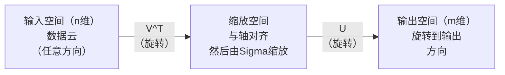
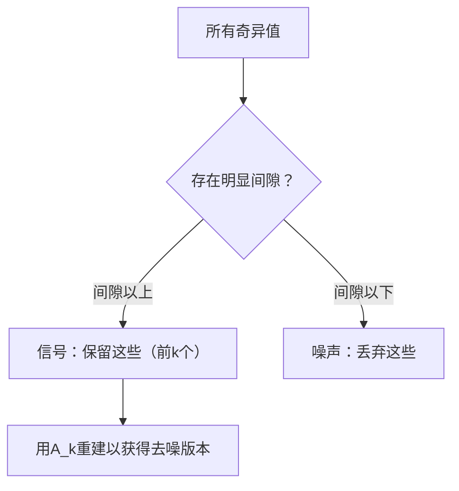

# 奇异值分解

> SVD是线性代数的瑞士军刀。每个矩阵都有SVD。每个数据科学家都需要它。

**类型：** 构建实现
**语言：** Python、Julia
**前置知识：** 第一阶段，第01课（线性代数直觉）、第02课（向量与矩阵运算）、第03课（矩阵变换）
**时间：** 约120分钟

## 学习目标

- 通过幂迭代实现SVD，并解释U、Sigma和V^T的几何含义
- 将截断SVD应用于图像压缩，测量压缩比与重建误差的关系
- 通过SVD计算Moore-Penrose伪逆，求解超定最小二乘系统
- 将SVD与PCA、推荐系统（潜在因子）和NLP中的潜在语义分析联系起来

## 问题背景

你有一个1000×2000的矩阵。也许是用户-电影评分矩阵，也许是文档-词频表，也许是图像的像素值。你需要压缩它、去噪、发现其中的隐藏结构，或用它求解最小二乘系统。特征分解只适用于方阵，而且要求矩阵有完整的线性无关特征向量集合。

SVD适用于任何矩阵——任意形状、任意秩、没有前提条件。它将矩阵分解为三个因子，揭示矩阵对空间做了什么变换的几何本质。这是线性代数中最通用、最有用的分解。

## 核心概念

### SVD的几何含义

每个矩阵，无论形状如何，都依次执行三个操作：旋转、缩放、旋转。SVD使这种分解变得明确。

```
A = U * Sigma * V^T

      m x n     m x m    m x n    n x n
     (任意)    (旋转)    (缩放)   (旋转)
```

对于任意矩阵A，SVD将其分解为：
- V^T 旋转输入空间中的向量（n维）
- Sigma 沿每个轴缩放（拉伸或压缩）
- U 将结果旋转到输出空间（m维）



这样理解：你把一个矩阵交给SVD，它告诉你："这个矩阵取一个输入球面，先用V^T旋转它，然后用Sigma将它拉伸成一个椭球，再用U旋转椭球。"奇异值是椭球各轴的长度。

### 完整分解

对于形状为m×n的矩阵A：

```
A = U * Sigma * V^T

其中：
  U     是 m x m 的正交矩阵（U^T U = I）
  Sigma 是 m x n 的对角矩阵（对角线上是奇异值）
  V     是 n x n 的正交矩阵（V^T V = I）

奇异值 sigma_1 >= sigma_2 >= ... >= sigma_r > 0
其中 r = rank(A)（A的秩）
```

U的列称为左奇异向量，V的列称为右奇异向量，Sigma的对角元素称为奇异值。奇异值总是非负的，按降序排列。

### 左奇异向量、奇异值、右奇异向量

SVD的每个组成部分都有独特的几何含义。

**右奇异向量（V的列）：** 构成输入空间（R^n）的标准正交基。它们是输入空间中矩阵映射到输出空间正交方向的方向。可以把它们想象成定义域的自然坐标系。

**奇异值（Sigma的对角线）：** 这些是缩放因子。第i个奇异值告诉你矩阵沿第i个右奇异向量方向拉伸向量的程度。零奇异值意味着矩阵将该方向完全压缩。

**左奇异向量（U的列）：** 构成输出空间（R^m）的标准正交基。第i个左奇异向量是第i个右奇异向量（缩放后）在输出空间中落点的方向。

它们之间的关系：

```
A * v_i = sigma_i * u_i

矩阵A取第i个右奇异向量v_i，
将其缩放sigma_i倍，并将其映射到第i个左奇异向量u_i。
```

这给了你一个坐标分量的图，描述任意矩阵的作用。

### 外积形式

SVD可以写成秩1矩阵之和：

```
A = sigma_1 * u_1 * v_1^T + sigma_2 * u_2 * v_2^T + ... + sigma_r * u_r * v_r^T

每一项 sigma_i * u_i * v_i^T 是一个秩1矩阵（外积）。
完整矩阵是r个这样矩阵的和，其中r是秩。
```

这种形式是低秩近似的基础。每一项添加一层结构。第一项捕获最重要的单一模式。第二项捕获次重要的模式。依此类推。截断这个求和给你在任何给定秩下最好的近似。

```
秩1近似:    A_1 = sigma_1 * u_1 * v_1^T
                  （捕获主导模式）

秩2近似:    A_2 = sigma_1 * u_1 * v_1^T + sigma_2 * u_2 * v_2^T
                  （捕获两个最重要的模式）

秩k近似:    A_k = 前k项之和
                  （由Eckart-Young定理可知，这是最优近似）
```

### 与特征分解的关系

SVD和特征分解有深刻的联系。A的奇异值和奇异向量直接来自A^T A和A A^T的特征值和特征向量。

```
A^T A = V * Sigma^T * U^T * U * Sigma * V^T
      = V * Sigma^T * Sigma * V^T
      = V * D * V^T

其中 D = Sigma^T * Sigma 是对角线上为 sigma_i^2 的对角矩阵。

因此：
- 右奇异向量（V）是 A^T A 的特征向量
- 奇异值的平方（sigma_i^2）是 A^T A 的特征值

类似地：
A A^T = U * Sigma * V^T * V * Sigma^T * U^T
      = U * Sigma * Sigma^T * U^T

因此：
- 左奇异向量（U）是 A A^T 的特征向量
- A A^T 的特征值也是 sigma_i^2
```

这种联系告诉你三件事：
1. 奇异值总是实数且非负（它们是半正定矩阵特征值的平方根）。
2. 你可以通过A^T A的特征分解来计算SVD，但这会使条件数平方，损失数值精度。专用SVD算法可以避免这一问题。
3. 当A是方对称半正定矩阵时，SVD和特征分解是同一件事。

### 截断SVD：低秩近似

Eckart-Young-Mirsky定理指出，A的最优秩k近似（在Frobenius范数和谱范数意义下）通过只保留前k个奇异值及其对应向量来获得：

```
A_k = U_k * Sigma_k * V_k^T

其中：
  U_k     是 m x k  （U的前k列）
  Sigma_k 是 k x k  （Sigma的左上k×k块）
  V_k     是 n x k  （V的前k列）

近似误差 = sigma_{k+1}  （谱范数意义下）
         = sqrt(sigma_{k+1}^2 + ... + sigma_r^2)  （Frobenius范数意义下）
```

这不仅仅是"一个好的"近似，而是在秩k约束下可证明的最优近似。没有其他秩k矩阵比它更接近A。

| 成分 | 相对大小 | 包含在秩3近似中？ |
|------|---------|-----------------|
| sigma_1 | 最大 | 是 |
| sigma_2 | 大 | 是 |
| sigma_3 | 中大 | 是 |
| sigma_4 | 中 | 否（误差） |
| sigma_5 | 中小 | 否（误差） |
| sigma_6 | 小 | 否（误差） |
| sigma_7 | 很小 | 否（误差） |
| sigma_8 | 极小 | 否（误差） |

保留前3个：A_3捕获三个最大奇异值。误差 = 剩余值（sigma_4到sigma_8）。

如果奇异值衰减很快，小k就能捕获大部分矩阵。如果衰减缓慢，矩阵没有低秩结构。

### 用SVD进行图像压缩

灰度图像是像素强度矩阵。800×600图像有480,000个值。SVD让你用少得多的数据来近似它。

```
原始图像: 800 x 600 = 480,000 个值

秩k的SVD:
  U_k:      800 x k 个值
  Sigma_k:  k 个值
  V_k:      600 x k 个值
  总计:     k * (800 + 600 + 1) = k * 1401 个值

  k=10:   14,010 个值   （原始的2.9%）
  k=50:   70,050 个值  （原始的14.6%）
  k=100: 140,100 个值  （原始的29.2%）

  压缩比随k减小而提高，
  但视觉质量下降。
```

关键洞察：自然图像具有快速衰减的奇异值。前几个奇异值捕获宏观结构（形状、渐变）。后面的捕获细节和噪声。截断到秩50通常产生看起来与原始图像几乎相同的图像，同时使用85%更少的存储空间。

### SVD用于推荐系统

Netflix大奖赛使这一点广为人知。你有一个用户-电影评分矩阵，其中大多数条目是缺失的。

```
             电影1  电影2  电影3  电影4  电影5
  用户1      [  5      ?       3       ?       1  ]
  用户2      [  ?      4       ?       2       ?  ]
  用户3      [  3      ?       5       ?       ?  ]
  用户4      [  ?      ?       ?       4       3  ]

  ? = 未知评分
```

核心思想：这个评分矩阵具有低秩。用户的偏好并不完全独立。少数几个潜在因子（动作 vs. 剧情、新旧电影、烧脑 vs. 感官刺激）能解释大多数偏好。

对（填充后的）评分矩阵进行SVD，分解为：
- U：用户在潜在因子空间中的画像
- Sigma：每个潜在因子的重要性
- V^T：电影在潜在因子空间中的画像

用户对电影的预测评分是其用户画像与电影画像的点积（由奇异值加权）。低秩近似填补了缺失的条目。

在实践中，你使用Simon Funk的增量SVD或ALS（交替最小二乘）等变体，可以直接处理缺失数据。但核心思想是相同的：通过SVD进行潜在因子分解。

### SVD在NLP中的应用：潜在语义分析

潜在语义分析（LSA），也称为潜在语义索引（LSI），将SVD应用于词-文档矩阵。

```
             文档1  文档2  文档3  文档4
  "猫"       [  3      0      1      0  ]
  "狗"       [  2      0      0      1  ]
  "鱼"       [  0      4      1      0  ]
  "宠物"     [  1      1      1      1  ]
  "海洋"     [  0      3      0      0  ]

使用秩k=2的SVD后：

  每个文档成为2D"概念空间"中的一个点。
  每个词成为同一2D空间中的一个点。
  讨论类似主题的文档聚在一起。
  含义相似的词聚在一起。

  "猫"和"狗"最终相近（陆地宠物）。
  "鱼"和"海洋"最终相近（水生概念）。
  如果文档1和文档3讨论类似主题，它们会聚集在一起。
```

LSA是最早从原始文本中捕获语义相似性的成功方法之一。它之所以有效，是因为同义词倾向于出现在类似的文档中，SVD将它们分组到相同的潜在维度中。现代词嵌入（Word2Vec、GloVe）可以被视为这一思想的后代。

### SVD用于降噪

嘈杂数据的信号集中在前几个奇异值中，噪声分散在所有奇异值中。截断去除了噪声本底。

**纯净信号的奇异值：**

| 成分 | 大小 | 类型 |
|------|------|------|
| sigma_1 | 非常大 | 信号 |
| sigma_2 | 大 | 信号 |
| sigma_3 | 中等 | 信号 |
| sigma_4 | 接近零 | 可忽略 |
| sigma_5 | 接近零 | 可忽略 |

**含噪信号的奇异值（噪声叠加在所有成分上）：**

| 成分 | 大小 | 类型 |
|------|------|------|
| sigma_1 | 非常大 | 信号 |
| sigma_2 | 大 | 信号 |
| sigma_3 | 中等 | 信号 |
| sigma_4 | 小 | 噪声 |
| sigma_5 | 小 | 噪声 |
| sigma_6 | 小 | 噪声 |
| sigma_7 | 小 | 噪声 |



这用于信号处理、科学测量和数据清洗。每当你有一个被加性噪声污染的矩阵，截断SVD就是分离信号与噪声的有原则的方法。

### 通过SVD计算伪逆

Moore-Penrose伪逆A+将矩阵求逆推广到非方阵和奇异矩阵。SVD使计算变得简单。

```
若 A = U * Sigma * V^T，则：

A+ = V * Sigma+ * U^T

其中 Sigma+ 的构造方式：
  1. 转置 Sigma（交换行和列）
  2. 将每个非零对角元素 sigma_i 替换为 1/sigma_i
  3. 零保持为零

对于 A（m x n）：      A+ 是 (n x m)
对于 Sigma（m x n）：  Sigma+ 是 (n x m)
```

伪逆解决最小二乘问题。如果Ax = b没有精确解（超定系统），则 x = A+b 是最小二乘解（最小化||Ax - b||）。

```
超定系统（方程数多于未知数）：

  [1  1]         [3]
  [2  1] x   =   [5]       不存在精确解。
  [3  1]         [6]

  x_ls = A+ b = V * Sigma+ * U^T * b

  这给出了最小化残差平方和的x。
  与正规方程 (A^T A)^(-1) A^T b 结果相同，
  但数值上更稳定。
```

### 数值稳定性优势

计算A^T A的特征分解会使奇异值平方（A^T A的特征值是sigma_i^2）。这使条件数平方，放大了数值误差。

```
示例：
  A 的奇异值为 [1000, 1, 0.001]
  A 的条件数: 1000 / 0.001 = 10^6

  A^T A 的特征值为 [10^6, 1, 10^{-6}]
  A^T A 的条件数: 10^6 / 10^{-6} = 10^{12}

  直接计算SVD: 条件数为 10^6
  通过A^T A计算: 条件数为 10^{12}
                 （损失6位额外精度）
```

现代SVD算法（Golub-Kahan双对角化）直接作用于A，从不构造A^T A。这就是为什么你应该总是选择`np.linalg.svd(A)`而不是`np.linalg.eig(A.T @ A)`。

### 与PCA的联系

**PCA就是对中心化数据做SVD。** 这不是类比，而是字面上相同的计算。

```
给定数据矩阵X（n_samples x n_features），已中心化（减去均值）：

协方差矩阵: C = (1/(n-1)) * X^T X

PCA找到C的特征向量。但是：

  X = U * Sigma * V^T    （X的SVD）

  X^T X = V * Sigma^2 * V^T

  C = (1/(n-1)) * V * Sigma^2 * V^T

所以主成分恰好就是右奇异向量V。
每个成分的解释方差为 sigma_i^2 / (n-1)。

在sklearn中，PCA使用SVD实现，而非特征分解。
这更快，数值上更稳定。
```

这意味着你在第10课中学到的关于降维的所有知识，底层都是SVD。PCA是机器学习中SVD最常见的应用。

## 动手实现

### 步骤1：使用幂迭代从零实现SVD

核心思想：为找到最大奇异值及其向量，对A^T A（或A A^T）使用幂迭代。然后从矩阵中减去该成分，对下一个奇异值重复。

```python
import numpy as np

def power_iteration(M, num_iters=100):
    n = M.shape[1]
    v = np.random.randn(n)
    v = v / np.linalg.norm(v)

    for _ in range(num_iters):
        Mv = M @ v
        v = Mv / np.linalg.norm(Mv)

    eigenvalue = v @ M @ v
    return eigenvalue, v

def svd_from_scratch(A, k=None):
    m, n = A.shape
    if k is None:
        k = min(m, n)

    sigmas = []
    us = []
    vs = []

    A_residual = A.copy().astype(float)

    for _ in range(k):
        AtA = A_residual.T @ A_residual
        eigenvalue, v = power_iteration(AtA, num_iters=200)

        if eigenvalue < 1e-10:
            break

        sigma = np.sqrt(eigenvalue)
        u = A_residual @ v / sigma

        sigmas.append(sigma)
        us.append(u)
        vs.append(v)

        A_residual = A_residual - sigma * np.outer(u, v)

    U = np.column_stack(us) if us else np.empty((m, 0))
    S = np.array(sigmas)
    V = np.column_stack(vs) if vs else np.empty((n, 0))

    return U, S, V
```

### 步骤2：测试并与NumPy对比

```python
np.random.seed(42)
A = np.random.randn(5, 4)

U_ours, S_ours, V_ours = svd_from_scratch(A)
U_np, S_np, Vt_np = np.linalg.svd(A, full_matrices=False)

print("我们的奇异值:", np.round(S_ours, 4))
print("NumPy的奇异值:", np.round(S_np, 4))

A_reconstructed = U_ours @ np.diag(S_ours) @ V_ours.T
print(f"重建误差: {np.linalg.norm(A - A_reconstructed):.8f}")
```

### 步骤3：图像压缩演示

```python
def compress_image_svd(image_matrix, k):
    U, S, Vt = np.linalg.svd(image_matrix, full_matrices=False)
    compressed = U[:, :k] @ np.diag(S[:k]) @ Vt[:k, :]
    return compressed

image = np.random.seed(42)
rows, cols = 200, 300
image = np.random.randn(rows, cols)

for k in [1, 5, 10, 20, 50]:
    compressed = compress_image_svd(image, k)
    error = np.linalg.norm(image - compressed) / np.linalg.norm(image)
    original_size = rows * cols
    compressed_size = k * (rows + cols + 1)
    ratio = compressed_size / original_size
    print(f"k={k:>3d}  误差={error:.4f}  存储比={ratio:.1%}")
```

### 步骤4：噪声消除

```python
np.random.seed(42)
clean = np.outer(np.sin(np.linspace(0, 4*np.pi, 100)),
                 np.cos(np.linspace(0, 2*np.pi, 80)))
noise = 0.3 * np.random.randn(100, 80)
noisy = clean + noise

U, S, Vt = np.linalg.svd(noisy, full_matrices=False)
denoised = U[:, :5] @ np.diag(S[:5]) @ Vt[:5, :]

print(f"含噪误差:    {np.linalg.norm(noisy - clean):.4f}")
print(f"去噪后误差: {np.linalg.norm(denoised - clean):.4f}")
print(f"改善程度:    {(1 - np.linalg.norm(denoised - clean) / np.linalg.norm(noisy - clean)):.1%}")
```

### 步骤5：伪逆

```python
A = np.array([[1, 1], [2, 1], [3, 1]], dtype=float)
b = np.array([3, 5, 6], dtype=float)

U, S, Vt = np.linalg.svd(A, full_matrices=False)
S_inv = np.diag(1.0 / S)
A_pinv = Vt.T @ S_inv @ U.T

x_svd = A_pinv @ b
x_lstsq = np.linalg.lstsq(A, b, rcond=None)[0]
x_pinv = np.linalg.pinv(A) @ b

print(f"SVD伪逆解:            {x_svd}")
print(f"np.linalg.lstsq解:   {x_lstsq}")
print(f"np.linalg.pinv解:    {x_pinv}")
```

## 应用示例

完整工作示例在`code/svd.py`中。运行它可以看到SVD应用于图像压缩、推荐系统、潜在语义分析和噪声消除。

```bash
python svd.py
```

`code/svd.jl`中的Julia版本使用Julia原生的`svd()`函数和`LinearAlgebra`包演示相同的概念。

```bash
julia svd.jl
```

## 产出物

本课程产出：
- `outputs/skill-svd.md` — 了解何时以及如何在实际项目中应用SVD的技能文档

## 练习

1. 不使用幂迭代从头实现完整SVD。改为计算A^T A的特征分解来获得V和奇异值，然后计算U = A V Sigma^{-1}。比较与幂迭代版本和NumPy的数值精度。

2. 加载一张真实的灰度图像（或将一张图像转换为灰度）。在秩1、5、10、25、50、100下压缩它。对每个秩计算压缩比和相对误差。找到图像在视觉上可以接受的秩。

3. 构建一个小型推荐系统。创建一个10×8的用户-电影评分矩阵，有一些已知条目。用行均值填充缺失条目。计算SVD并重建秩3近似。使用重建矩阵预测缺失评分。验证预测是合理的。

4. 创建一个100×50的文档-词矩阵，有3个合成主题。每个主题有5个关联词。添加噪声。应用SVD并验证前3个奇异值远大于其余奇异值。将文档投影到3D潜在空间，检查来自同一主题的文档是否聚在一起。

5. 生成一个纯净低秩矩阵（秩3，大小50×40）并在不同噪声水平下添加高斯噪声（sigma = 0.1、0.5、1.0、2.0）。对每个噪声水平，通过从1到40遍历k值并测量与干净矩阵的重建误差来找到最优截断秩。绘制最优k随噪声水平的变化图。

## 关键术语

| 术语 | 通俗说法 | 实际含义 |
|------|---------|---------|
| SVD | "分解任意矩阵" | 将A分解为U Sigma V^T，其中U和V是正交矩阵，Sigma是对角线上为非负元素的对角矩阵。适用于任意形状的矩阵。 |
| 奇异值（Singular value） | "这个成分有多重要" | Sigma的第i个对角元素。衡量矩阵沿第i个主方向的拉伸程度。总是非负的，按降序排列。 |
| 左奇异向量（Left singular vector） | "输出方向" | U的一列。第i个右奇异向量映射到的输出空间方向（按sigma_i缩放后）。 |
| 右奇异向量（Right singular vector） | "输入方向" | V的一列。矩阵将其映射到第i个左奇异向量的输入空间方向（按sigma_i缩放后）。 |
| 截断SVD（Truncated SVD） | "低秩近似" | 只保留前k个奇异值及其向量。产生可证明最优的秩k近似（Eckart-Young定理）。 |
| 秩（Rank） | "真实维度" | 非零奇异值的数量。告诉你矩阵实际使用了多少个独立方向。 |
| 伪逆（Pseudoinverse） | "广义逆" | V Sigma+ U^T。对非零奇异值求逆，零保持为零。解决非方阵或奇异矩阵的最小二乘问题。 |
| 条件数（Condition number） | "对误差的敏感程度" | sigma_max / sigma_min。条件数大意味着输入的小变化会导致输出的大变化。SVD直接揭示这一点。 |
| 潜在因子（Latent factor） | "隐变量" | SVD发现的低秩空间中的一个维度。在推荐系统中，潜在因子可能对应类型偏好。在NLP中，它可能对应一个主题。 |
| Frobenius范数（Frobenius norm） | "矩阵的总大小" | 所有元素平方和的平方根。等于奇异值平方和的平方根。用于测量近似误差。 |
| Eckart-Young定理（Eckart-Young theorem） | "SVD给出最优压缩" | 对于任意目标秩k，截断SVD在所有可能的秩k矩阵中最小化近似误差。 |
| 幂迭代（Power iteration） | "找最大特征向量" | 将随机向量重复乘以矩阵并归一化。收敛到最大特征值对应的特征向量。许多SVD算法的基本构件。 |

## 延伸阅读

- [Gilbert Strang: Linear Algebra and Its Applications, Chapter 7](https://math.mit.edu/~gs/linearalgebra/) — 对SVD及其应用的深入讲解
- [3Blue1Brown: But what is the SVD?](https://www.youtube.com/watch?v=vSczTbgc8Rc) — SVD的几何直觉
- [We Recommend a Singular Value Decomposition](https://www.ams.org/publicoutreach/feature-column/fcarc-svd) — 来自美国数学学会的通俗综述
- [Netflix Prize and Matrix Factorization](https://sifter.org/~simon/journal/20061211.html) — Simon Funk关于SVD用于推荐系统的原始博客文章
- [Latent Semantic Analysis](https://en.wikipedia.org/wiki/Latent_semantic_analysis) — SVD最早的NLP应用
- [Numerical Linear Algebra by Trefethen and Bau](https://people.maths.ox.ac.uk/trefethen/text.html) — 理解SVD算法及其数值特性的黄金标准
