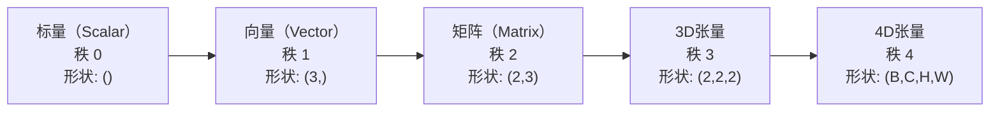
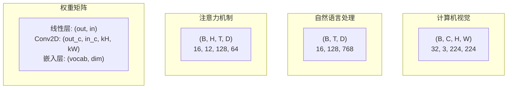
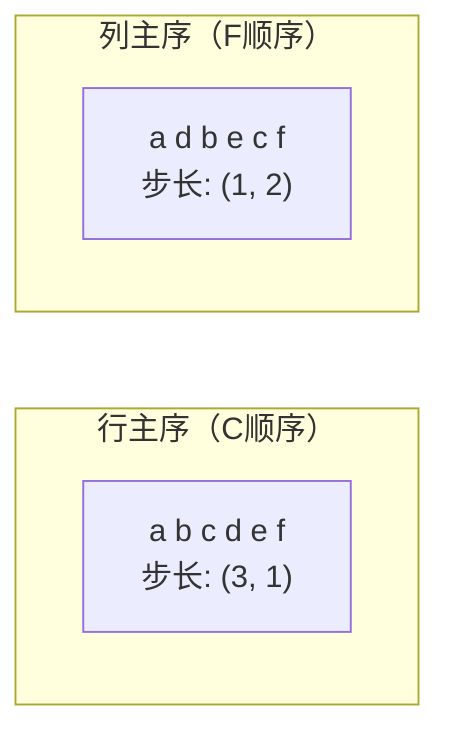
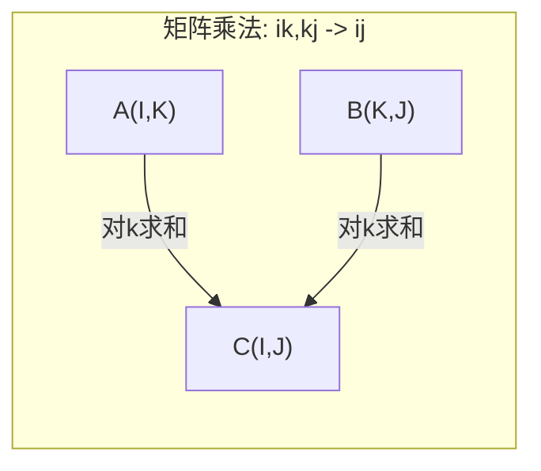

# 张量运算

> 张量是数据与深度学习之间的通用语言。每张图像、每个句子、每个梯度都流经张量。

**类型：** 构建实现
**语言：** Python
**前置知识：** 第一阶段，第01课（线性代数直觉）、第02课（向量、矩阵与运算）
**时间：** 约90分钟

## 学习目标

- 从零实现一个张量类，包含形状、步长、reshape、转置和逐元素运算
- 应用广播规则，对不同形状的张量进行运算而无需复制数据
- 编写einsum表达式，处理点积、矩阵乘法、外积和批量运算
- 追踪多头注意力机制每一步的精确张量形状

## 问题背景

你构建了一个Transformer。前向传播代码看起来很简洁。你运行它，得到：`RuntimeError: mat1 and mat2 shapes cannot be multiplied (32x768 and 512x768)`。你盯着这些形状，尝试转置，现在它说`Expected 4D input (got 3D input)`。你添加了一个unsqueeze，结果其他地方又出错了。

**形状错误是深度学习代码中最常见的bug。** 概念上并不难——每个操作都有形状约定——但错误会快速累积。一个Transformer有几十个reshape、转置和广播操作串联在一起，一个错误的轴就会引发错误雪崩。更糟糕的是，某些形状错误根本不会抛出异常，而是无声地沿着错误的维度广播或求和，产生垃圾结果。

矩阵处理两组事物之间的成对关系。真实数据不能装进两个维度。32张224×224的RGB图像批次是4D张量：`(32, 3, 224, 224)`。12头的自注意力也是4D：`(batch, heads, seq_len, head_dim)`。你需要一个能推广到任意维度的数据结构，其运算能在所有维度上整洁地组合。这个结构就是张量。掌握其运算，形状错误将变得微不足道地易于调试。

## 核心概念

### 什么是张量

张量是具有统一数据类型的多维数字数组。维度的数量称为**秩**（或**阶**）。每个维度是一个**轴**。**形状**是列出每个轴大小的元组。



总元素数 = 所有维度大小的乘积。形状`(2, 3, 4)`包含`2 * 3 * 4 = 24`个元素。

### 深度学习中的张量形状

不同数据类型按照约定映射到特定的张量形状。



PyTorch使用NCHW（通道优先）格式，TensorFlow默认使用NHWC（通道在后）格式。布局不匹配会导致无声的性能下降或错误。

### 内存布局的工作方式

内存中的2D数组是一个一维字节序列。**步长（Strides）**告诉你沿每个轴前进一步需要跳过多少个元素。



转置不移动数据。它交换步长，使张量变为**非连续**——一行的元素在内存中不再相邻。

### 广播规则

广播让你无需复制数据就能对不同形状的张量进行运算。从右侧对齐形状，当两个维度相等或其中一个为1时，它们兼容。维度较少的张量在左侧用1填充。

```
张量A:     (8, 1, 6, 1)
张量B:        (7, 1, 5)
填充后B:   (1, 7, 1, 5)
结果:       (8, 7, 6, 5)
```

### Einsum：通用张量运算

爱因斯坦求和对每个轴用一个字母标记。出现在输入但不在输出中的轴被求和。在输入和输出中都有的轴被保留。



关键模式：`i,i->`（点积）、`i,j->ij`（外积）、`ii->`（迹）、`ij->ji`（转置）、`bij,bjk->bik`（批量矩阵乘法）、`bhtd,bhsd->bhts`（注意力分数）。

## 动手实现

代码位于`code/tensors.py`。每个步骤引用其中的实现。

### 步骤1：张量存储和步长

张量存储一个扁平的数字列表加上形状元数据。步长告诉索引逻辑如何将多维索引映射到扁平位置。

```python
class Tensor:
    def __init__(self, data, shape=None):
        if isinstance(data, (list, tuple)):
            self._data, self._shape = self._flatten_nested(data)
        elif isinstance(data, np.ndarray):
            self._data = data.flatten().tolist()
            self._shape = tuple(data.shape)
        else:
            self._data = [data]
            self._shape = ()

        if shape is not None:
            total = reduce(lambda a, b: a * b, shape, 1)
            if total != len(self._data):
                raise ValueError(
                    f"Cannot reshape {len(self._data)} elements into shape {shape}"
                )
            self._shape = tuple(shape)

        self._strides = self._compute_strides(self._shape)

    @staticmethod
    def _compute_strides(shape):
        if len(shape) == 0:
            return ()
        strides = [1] * len(shape)
        for i in range(len(shape) - 2, -1, -1):
            strides[i] = strides[i + 1] * shape[i + 1]
        return tuple(strides)
```

对于形状`(3, 4)`，步长为`(4, 1)`——前进一行跳过4个元素，前进一列跳过1个元素。

### 步骤2：Reshape、squeeze、unsqueeze

Reshape在不改变元素顺序的情况下更改形状。元素总数必须保持不变。对一个维度使用`-1`可以自动推断其大小。

```python
t = Tensor(list(range(12)), shape=(2, 6))
r = t.reshape((3, 4))
r = t.reshape((-1, 3))
```

Squeeze去除大小为1的轴，unsqueeze插入一个大小为1的轴。Unsqueeze对广播至关重要——将偏置向量`(D,)`加到批次`(B, T, D)`上需要先unsqueeze成`(1, 1, D)`。

```python
t = Tensor(list(range(6)), shape=(1, 3, 1, 2))
s = t.squeeze()
v = Tensor([1, 2, 3])
u = v.unsqueeze(0)
```

### 步骤3：转置和置换

转置交换两个轴，置换重新排序所有轴。这是NCHW和NHWC格式互转的方法。

```python
mat = Tensor(list(range(6)), shape=(2, 3))
tr = mat.transpose(0, 1)

t4d = Tensor(list(range(24)), shape=(1, 2, 3, 4))
perm = t4d.permute((0, 2, 3, 1))
```

转置或置换后，张量在内存中变为非连续。在PyTorch中，`view`在非连续张量上会失败——改用`reshape`或先调用`.contiguous()`。

### 步骤4：逐元素运算和归约

逐元素运算（加法、乘法、减法）对每个元素独立应用并保留形状。归约（sum、mean、max）折叠一个或多个轴。

```python
a = Tensor([[1, 2], [3, 4]])
b = Tensor([[10, 20], [30, 40]])
c = a + b
d = a * 2
s = a.sum(axis=0)
```

CNN中的全局平均池化：`(B, C, H, W).mean(axis=[2, 3])`产生`(B, C)`。NLP中的序列均值池化：`(B, T, D).mean(axis=1)`产生`(B, D)`。

### 步骤5：使用NumPy广播

`tensors.py`中的`demo_broadcasting_numpy()`函数展示了核心模式。

```python
activations = np.random.randn(4, 3)
bias = np.array([0.1, 0.2, 0.3])
result = activations + bias

images = np.random.randn(2, 3, 4, 4)
scale = np.array([0.5, 1.0, 1.5]).reshape(1, 3, 1, 1)
result = images * scale

a = np.array([1, 2, 3]).reshape(-1, 1)
b = np.array([10, 20, 30, 40]).reshape(1, -1)
outer = a * b
```

通过广播计算成对距离：将`(M, 2)`reshape为`(M, 1, 2)`，`(N, 2)`reshape为`(1, N, 2)`，相减、平方、沿最后一轴求和、取平方根。结果：`(M, N)`。

### 步骤6：Einsum运算

`demo_einsum()`和`demo_einsum_gallery()`函数演示了每种常见模式。

```python
a = np.array([1.0, 2.0, 3.0])
b = np.array([4.0, 5.0, 6.0])
dot = np.einsum("i,i->", a, b)

A = np.array([[1, 2], [3, 4], [5, 6]], dtype=float)
B = np.array([[7, 8, 9], [10, 11, 12]], dtype=float)
matmul = np.einsum("ik,kj->ij", A, B)

batch_A = np.random.randn(4, 3, 5)
batch_B = np.random.randn(4, 5, 2)
batch_mm = np.einsum("bij,bjk->bik", batch_A, batch_B)
```

一次缩并的计算代价是所有索引大小的乘积（包含保留的和求和的）。对于`bij,bjk->bik`，B=32、I=128、J=64、K=128：`32 * 128 * 64 * 128 = 33,554,432`次乘加运算。

### 步骤7：通过einsum实现注意力机制

`demo_attention_einsum()`函数端到端实现了多头注意力。

```python
B, H, T, D = 2, 4, 8, 16
E = H * D

X = np.random.randn(B, T, E)
W_q = np.random.randn(E, E) * 0.02

Q = np.einsum("bte,ek->btk", X, W_q)
Q = Q.reshape(B, T, H, D).transpose(0, 2, 1, 3)

scores = np.einsum("bhtd,bhsd->bhts", Q, K) / np.sqrt(D)
weights = softmax(scores, axis=-1)
attn_output = np.einsum("bhts,bhsd->bhtd", weights, V)

concat = attn_output.transpose(0, 2, 1, 3).reshape(B, T, E)
output = np.einsum("bte,ek->btk", concat, W_o)
```

每一步都是一个张量运算：投影（通过einsum的矩阵乘法）、分头（reshape + transpose）、注意力分数（通过einsum的批量矩阵乘法）、加权求和（通过einsum的批量矩阵乘法）、合并多头（transpose + reshape）、输出投影（通过einsum的矩阵乘法）。

## 应用示例

### 从零实现 vs NumPy

| 操作 | 从零实现（Tensor类） | NumPy |
|------|---------------------|-------|
| 创建 | `Tensor([[1,2],[3,4]])` | `np.array([[1,2],[3,4]])` |
| Reshape | `t.reshape((3,4))` | `a.reshape(3,4)` |
| 转置 | `t.transpose(0,1)` | `a.T` 或 `a.transpose(0,1)` |
| Squeeze | `t.squeeze(0)` | `np.squeeze(a, 0)` |
| 求和 | `t.sum(axis=0)` | `a.sum(axis=0)` |
| Einsum | 不支持 | `np.einsum("ij,jk->ik", a, b)` |

### 从零实现 vs PyTorch

```python
import torch

t = torch.tensor([[1, 2, 3], [4, 5, 6]], dtype=torch.float32)
t.shape
t.stride()
t.is_contiguous()

t.reshape(3, 2)
t.unsqueeze(0)
t.transpose(0, 1)
t.transpose(0, 1).contiguous()

torch.einsum("ik,kj->ij", A, B)
```

PyTorch增加了自动微分、GPU支持和优化的BLAS内核。形状语义完全相同。如果你理解了从零实现的版本，PyTorch的形状错误就变得可读了。

### 每个神经网络层作为张量运算

| 操作 | 张量形式 | Einsum |
|------|---------|--------|
| 线性层 | `Y = X @ W.T + b` | `"bd,od->bo"` + 偏置 |
| 注意力QKV | `Q = X @ W_q` | `"btd,dh->bth"` |
| 注意力分数 | `Q @ K.T / sqrt(d)` | `"bhtd,bhsd->bhts"` |
| 注意力输出 | `softmax(scores) @ V` | `"bhts,bhsd->bhtd"` |
| 批归一化 | `(X - mu) / sigma * gamma` | 逐元素 + 广播 |
| Softmax | `exp(x) / sum(exp(x))` | 逐元素 + 归约 |

## 产出物

本课程产出两个可复用的提示模板：

1. **`outputs/prompt-tensor-shapes.md`** — 用于调试张量形状不匹配的系统性提示。包含每种常见操作（matmul、broadcast、cat、Linear、Conv2d、BatchNorm、softmax）的决策表和修复查找表。

2. **`outputs/prompt-tensor-debugger.md`** — 当形状错误困住你时粘贴到AI助手的逐步调试提示。输入错误消息和张量形状，得到精确的修复方案。

## 练习

1. **简单 — Reshape往返。** 取一个形状为`(2, 3, 4)`的张量。将其reshape为`(6, 4)`，然后为`(24,)`，再回到`(2, 3, 4)`。通过打印扁平数据验证每一步保留了元素顺序。

2. **中等 — 实现广播。** 扩展`Tensor`类，加入`broadcast_to(shape)`方法，将大小为1的维度扩展以匹配目标形状。然后修改`_elementwise_op`，使其在运算前自动广播。用形状`(3, 1)`和`(1, 4)`测试，应产生`(3, 4)`。

3. **困难 — 从零构建einsum。** 实现一个基本的`einsum(subscripts, *tensors)`函数，至少处理：点积（`i,i->`）、矩阵乘法（`ij,jk->ik`）、外积（`i,j->ij`）和转置（`ij->ji`）。解析下标字符串，识别被缩并的索引，遍历所有索引组合。将结果与`np.einsum`对比。

4. **困难 — 注意力形状追踪器。** 编写一个函数，接受`batch_size`、`seq_len`、`embed_dim`和`num_heads`作为输入，打印多头注意力每一步的精确形状：输入、Q/K/V投影、分头、注意力分数、softmax权重、加权求和、合并多头、输出投影。与`demo_attention_einsum()`的输出对比验证。

## 关键术语

| 术语 | 通俗说法 | 实际含义 |
|------|---------|---------|
| 张量（Tensor） | "多维矩阵" | 具有统一类型和定义形状、步长和运算的多维数组 |
| 秩（Rank） | "维度数量" | 轴的数量。矩阵的秩为2，不等于其矩阵秩 |
| 形状（Shape） | "张量的大小" | 列出每个轴大小的元组。`(2, 3)`表示2行3列 |
| 步长（Stride） | "内存布局方式" | 沿每个轴前进一个位置需要跳过的元素数量 |
| 广播（Broadcasting） | "形状不同时自动工作" | 严格的一套规则：从右对齐，维度必须相等或其中一个为1 |
| 连续（Contiguous） | "张量是正常的" | 元素在内存中按逻辑布局顺序连续存储，没有间隙或重排 |
| Einsum | "矩阵乘法的花式写法" | 一种通用符号，用一行表达任何张量缩并、外积、迹或转置 |
| 视图（View） | "和reshape一样" | 共享同一内存缓冲区但具有不同形状/步长元数据的张量。在非连续数据上失败 |
| 缩并（Contraction） | "对一个索引求和" | 张量间共享索引被相乘并求和的通用操作，产生低秩结果 |
| NCHW / NHWC | "PyTorch vs TensorFlow格式" | 图像张量的内存布局约定。NCHW将通道放在空间维度之前，NHWC放在之后 |

## 延伸阅读

- [NumPy Broadcasting](https://numpy.org/doc/stable/user/basics.broadcasting.html) — 带视觉示例的权威规则
- [PyTorch Tensor Views](https://pytorch.org/docs/stable/tensor_view.html) — 视图何时有效，何时复制数据
- [einops](https://github.com/arogozhnikov/einops) — 使张量reshape可读且安全的库
- [The Illustrated Transformer](https://jalammar.github.io/illustrated-transformer/) — 可视化流经注意力机制的张量形状
- [Einstein Summation in NumPy](https://numpy.org/doc/stable/reference/generated/numpy.einsum.html) — 带示例的完整einsum文档
