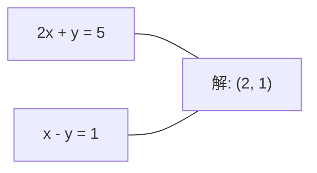
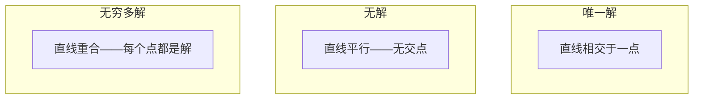

# 线性方程组

> 求解Ax = b是数学中最古老的问题，它至今仍在驱动你的神经网络。

**类型：** 构建实现
**语言：** Python
**前置知识：** 第一阶段，第01课（线性代数直觉）、第02课（向量与矩阵）、第03课（矩阵变换）
**时间：** 约120分钟

## 学习目标

- 使用带部分主元的高斯消去法和回代法求解Ax = b
- 对矩阵进行LU、QR和Cholesky分解，并解释每种方法的适用场景
- 推导最小二乘法的正规方程，并将其与线性回归和岭回归联系起来
- 使用条件数诊断病态系统，并应用正则化来稳定它们

## 问题背景

每次训练线性回归时，你都在求解一个线性方程组。每次计算最小二乘拟合时，你都在求解一个线性方程组。每次神经网络层计算`y = Wx + b`时，它都在评估线性方程组的一侧。添加正则化时，你在修改方程组。使用高斯过程时，你在分解矩阵。为马哈拉诺比斯距离求协方差矩阵的逆时，你在求解线性方程组。

**方程Ax = b无处不在。** A是已知系数矩阵，b是已知输出向量，x是你想找到的未知向量。在线性回归中，A是你的数据矩阵，b是目标向量，x是权重向量。整个模型归结为：找到x，使得Ax尽可能接近b。

本课从零构建求解该方程的每种主要方法。你将理解为什么某些方法快而另一些稳定，为什么某些只适用于方形系统而另一些处理超定系统，以及为什么矩阵的条件数决定你的答案是否有任何意义。

## 核心概念

### Ax = b的几何含义

线性方程组有几何解释。每个方程定义一个超平面。解是所有超平面相交的点（或点集）。

```
2x + y = 5          2D中的两条直线。
x - y  = 1          它们在x=2, y=1处相交。
```



三种情况可能发生：



在矩阵形式中，"唯一解"意味着A可逆，"无解"意味着系统不一致，"无穷多解"意味着A有零空间。大多数ML问题属于"无精确解"类别，因为你有比未知数（参数）更多的方程（数据点）。这就是最小二乘法的用武之地。

### 列图像 vs 行图像

读取Ax = b有两种方式。

**行图像。** A的每一行定义一个方程，每个方程是一个超平面，解是所有超平面的交点。

**列图像。** A的每一列是一个向量，问题变成：A的列的什么线性组合产生b？

```
A = | 2  1 |    b = | 5 |
    | 1 -1 |        | 1 |

行图像: 同时求解 2x + y = 5 和 x - y = 1。

列图像: 找到x1, x2使得：
  x1 * [2, 1] + x2 * [1, -1] = [5, 1]
  2 * [2, 1] + 1 * [1, -1] = [4+1, 2-1] = [5, 1]   验证正确。
```

列图像更基本。如果b在A的列空间中，系统有解。如果不在，你找到列空间中最近的点。那个最近点就是最小二乘解。

### 高斯消去法

高斯消去法将Ax = b变换为上三角系统Ux = c，然后用回代法求解。这是最直接的方法。

算法步骤：

```
1. 对每一列k（主元列）：
   a. 找到第k列在第k行及以下的最大元素（部分主元选取）。
   b. 将该行与第k行交换。
   c. 对k以下的每一行i：
      - 计算乘数 m = A[i][k] / A[k][k]
      - 从第i行中减去m倍的第k行。
2. 回代：从最后一个方程向上求解。
```

示例：

```
原始矩阵:
| 2  1  1 | 8 |       R2 = R2 - (2)R1     | 2  1   1 |  8 |
| 4  3  3 |20 |  -->  R3 = R3 - (1)R1 --> | 0  1   1 |  4 |
| 2  3  1 |12 |                            | 0  2   0 |  4 |

                       R3 = R3 - (2)R2     | 2  1   1 |  8 |
                                       --> | 0  1   1 |  4 |
                                           | 0  0  -2 | -4 |

回代：
  -2 * x3 = -4    -->  x3 = 2
  x2 + 2  = 4     -->  x2 = 2
  2*x1 + 2 + 2 = 8 --> x1 = 2
```

高斯消去法耗费O(n^3)次运算。对于1000×1000的系统，这大约是十亿次浮点运算——快，但如果你需要用相同的A求解多个系统，还可以做得更好。

### 部分主元选取：为什么重要

没有主元选取，高斯消去法可能失败或产生垃圾结果。如果主元为零，你会除以零；如果它很小，会放大舍入误差。

```
坏主元:                             使用部分主元:
| 0.001  1 | 1.001 |               先交换行:
| 1      1 | 2     |               | 1      1 | 2     |
                                    | 0.001  1 | 1.001 |
m = 1/0.001 = 1000                  m = 0.001/1 = 0.001
R2 = R2 - 1000*R1                   R2 = R2 - 0.001*R1
| 0.001  1     | 1.001   |          | 1      1     | 2     |
| 0     -999   | -999.0  |          | 0      0.999 | 0.999 |

x2 = 1.000（正确）                  x2 = 1.000（正确）
x1 = (1.001 - 1)/0.001              x1 = (2 - 1)/1 = 1.000（正确）
   = 0.001/0.001 = 1.000            稳定是因为乘数很小。
```

在精度有限的浮点运算中，无主元版本可能丢失有效数字。部分主元选取始终选择最大可用主元以最小化误差放大。

### LU分解

LU分解将A分解为下三角矩阵L和上三角矩阵U：A = LU。L矩阵存储高斯消去的乘数，U矩阵是消去的结果。

```
A = L @ U

| 2  1  1 |   | 1  0  0 |   | 2  1   1 |
| 4  3  3 | = | 2  1  0 | @ | 0  1   1 |
| 2  3  1 |   | 1  2  1 |   | 0  0  -2 |
```

为什么要分解而不只是消去？因为一旦你有了L和U，用任意新的b求解Ax = b只需O(n^2)：

```
Ax = b
LUx = b
令 y = Ux：
  Ly = b    （前代，O(n^2)）
  Ux = y    （回代，O(n^2)）
```

O(n^3)的代价在分解时只付一次。每次后续求解都是O(n^2)。如果你需要用相同的A但不同的b向量求解1000个系统，LU节省了总工作量的1000/3倍。

使用部分主元，你得到PA = LU，其中P是记录行交换的置换矩阵。

### QR分解

QR分解将A分解为正交矩阵Q和上三角矩阵R：A = QR。

正交矩阵有特性Q^T Q = I，其列是标准正交向量。乘以Q保持长度和角度。

```
A = Q @ R

Q有标准正交列: Q^T Q = I
R是上三角矩阵

求解Ax = b：
  QRx = b
  Rx = Q^T b    （只需乘以Q^T，不需要求逆）
  回代得到x。
```

QR在求解最小二乘问题时比LU数值更稳定。Gram-Schmidt过程逐列构建Q：

```
给定A的列a1, a2, ...：

q1 = a1 / ||a1||

q2 = a2 - (a2 · q1) * q1        （减去在q1上的投影）
q2 = q2 / ||q2||                （归一化）

q3 = a3 - (a3 · q1) * q1 - (a3 · q2) * q2
q3 = q3 / ||q3||

R[i][j] = qi · aj    对于 i <= j
```

每步去除沿所有先前q向量的分量，只留下新的正交方向。

### Cholesky分解

当A是对称的（A = A^T）且正定（所有特征值为正）时，你可以将其分解为A = L L^T，其中L是下三角矩阵。这就是Cholesky分解。

```
A = L @ L^T

| 4  2 |   | 2  0 |   | 2  1 |
| 2  5 | = | 1  2 | @ | 0  2 |

L[i][i] = sqrt(A[i][i] - sum(L[i][k]^2 for k < i))
L[i][j] = (A[i][j] - sum(L[i][k]*L[j][k] for k < j)) / L[j][j]    对于 i > j
```

Cholesky比LU快两倍，只需一半的存储空间。它只适用于对称正定矩阵，但这类矩阵非常常见：

- 协方差矩阵是对称半正定的（加正则化后变为正定）。
- 高斯过程中的核矩阵是对称正定的。
- 凸函数在极小值处的Hessian矩阵是对称正定的。
- A^T A始终是对称半正定的。

在高斯过程中，你用Cholesky分解核矩阵K，然后求解K alpha = y得到预测均值。Cholesky因子还给出边际似然的对数行列式：log det(K) = 2 * sum(log(diag(L)))。

### 最小二乘：当Ax = b没有精确解时

如果A是m×n且m > n（方程比未知数多），系统是超定的，不存在精确解。你转而最小化平方误差：

```
minimize ||Ax - b||^2

这是残差平方和：
  sum((A[i,:] @ x - b[i])^2 for i in range(m))
```

极小化满足正规方程：

```
A^T A x = A^T b
```

推导：展开||Ax - b||^2 = (Ax - b)^T (Ax - b) = x^T A^T A x - 2 x^T A^T b + b^T b。对x求梯度，令其为零：2 A^T A x - 2 A^T b = 0。

```
原始系统（超定，4个方程，2个未知数）：
| 1  1 |         | 3 |
| 1  2 | x     = | 5 |       没有精确的x满足所有4个方程。
| 1  3 |         | 6 |
| 1  4 |         | 8 |

正规方程：
A^T A = | 4  10 |    A^T b = | 22 |
        | 10 30 |            | 63 |

求解: x = [1.5, 1.7]

这就是线性回归。x[0]是截距，x[1]是斜率。
```

### 正规方程 = 线性回归

联系是精确的。在线性回归中，数据矩阵X每行对应一个样本，每列对应一个特征。目标向量y每个样本有一个条目。权重向量w满足：

```
X^T X w = X^T y
w = (X^T X)^(-1) X^T y
```

这是线性回归的封闭形式解。每次调用`sklearn.linear_model.LinearRegression.fit()`都会计算这个（或通过QR或SVD的等效形式）。

向矩阵添加正则化项lambda * I，你得到岭回归：

```
(X^T X + lambda * I) w = X^T y
w = (X^T X + lambda * I)^(-1) X^T y
```

正则化使矩阵条件更好（更容易精确求逆），并通过将权重收缩向零来防止过拟合。当lambda > 0时，矩阵X^T X + lambda * I始终是对称正定的，所以你可以用Cholesky求解它。

### 伪逆（Moore-Penrose）

伪逆A+将矩阵求逆推广到非方阵和奇异矩阵。对于任意矩阵A：

```
x = A+ b

其中 A+ = V Sigma+ U^T    （通过SVD计算）
```

Sigma+通过对每个非零奇异值取倒数并转置结果来构建。若A = U Sigma V^T，则A+ = V Sigma+ U^T。

```
A = U Sigma V^T        （SVD）

Sigma = | 5  0 |       Sigma+ = | 1/5  0  0 |
        | 0  2 |                | 0  1/2  0 |
        | 0  0 |

A+ = V Sigma+ U^T
```

伪逆给出最小范数最小二乘解。若系统有：
- 唯一解：A+ b给出它。
- 无解：A+ b给出最小二乘解。
- 无穷多解：A+ b给出||x||最小的那个。

NumPy的`np.linalg.lstsq`和`np.linalg.pinv`都在内部使用SVD。

### 条件数

条件数测量解对输入小变化的敏感程度。对于矩阵A，条件数是：

```
kappa(A) = ||A|| * ||A^(-1)|| = sigma_max / sigma_min
```

其中sigma_max和sigma_min是最大和最小奇异值。

```
良好条件（kappa ~ 1）:          病态（kappa ~ 10^15）:
b的小变化 -->                    b的小变化 -->
x的小变化                        x的巨大变化

| 2  0 |   kappa = 2/1 = 2       | 1   1          |   kappa ~ 10^15
| 0  1 |   安全求解               | 1   1+10^(-15) |   解是垃圾
```

经验规则：
- kappa < 100：安全，解是精确的。
- kappa ~ 10^k：从浮点运算中损失约k位精度。
- kappa ~ 10^16（float64）：解毫无意义，矩阵实际上是奇异的。

在ML中，当特征几乎共线时会出现病态。正则化（添加lambda * I）将条件数从sigma_max / sigma_min改善为(sigma_max + lambda) / (sigma_min + lambda)。

### 迭代方法：共轭梯度法

对于非常大的稀疏系统（数百万个未知数），LU或Cholesky等直接方法过于昂贵。迭代方法通过多次迭代改进猜测来近似解。

共轭梯度法（CG）当A是对称正定时求解Ax = b。在精确算术中，它最多经过n次迭代找到精确解，但如果A的特征值集中，通常收敛更快。

```
算法概要：
  x0 = 初始猜测（通常为零）
  r0 = b - A x0           （残差）
  p0 = r0                 （搜索方向）

  对 k = 0, 1, 2, ...:
    alpha = (rk · rk) / (pk · A pk)
    x_{k+1} = xk + alpha * pk
    r_{k+1} = rk - alpha * A pk
    beta = (r_{k+1} · r_{k+1}) / (rk · rk)
    p_{k+1} = r_{k+1} + beta * pk
    若 ||r_{k+1}|| < 容差: 停止
```

CG用于：
- 大规模优化（Newton-CG方法）
- 求解PDE离散化
- 核矩阵太大无法分解的核方法
- 其他迭代求解器的预处理

收敛速度取决于条件数。条件更好的系统收敛更快，这是正则化帮助的另一个原因。

### 全景图：何时用哪种方法

| 方法 | 要求 | 代价 | 使用场景 |
|------|------|------|----------|
| 高斯消去法 | 方形非奇异A | O(n^3) | 方形系统的一次性求解 |
| LU分解 | 方形非奇异A | O(n^3)分解 + O(n^2)求解 | 用相同A的多次求解 |
| QR分解 | 任意A（m >= n） | O(mn^2) | 最小二乘，数值稳定 |
| Cholesky | 对称正定A | O(n^3/3) | 协方差矩阵、高斯过程、岭回归 |
| 正规方程 | 超定（m > n） | O(mn^2 + n^3) | 线性回归（小n） |
| SVD / 伪逆 | 任意A | O(mn^2) | 秩亏系统，最小范数解 |
| 共轭梯度法 | 对称正定稀疏A | O(n * k * nnz) | 大型稀疏系统，k=迭代次数 |

### 与ML的联系

本课的每种方法都出现在生产ML中：

**线性回归。** 封闭形式解求解正规方程X^T X w = X^T y。通过Cholesky（如果n小）、QR（如果数值稳定性重要）或SVD（如果矩阵可能秩亏）来实现。

**岭回归。** 向X^T X添加lambda * I。正则化系统(X^T X + lambda * I) w = X^T y可以始终通过Cholesky求解，因为当lambda > 0时X^T X + lambda * I是对称正定的。

**高斯过程。** 预测均值需要求解K alpha = y，其中K是核矩阵。Cholesky分解K是标准方法。对数边际似然使用log det(K) = 2 sum(log(diag(L)))。

**神经网络初始化。** 正交初始化使用QR分解创建列标准正交的权重矩阵，防止深度网络中的信号坍塌。

**预处理。** 大规模优化器使用不完全Cholesky或不完全LU作为共轭梯度求解器的预处理器。

**特征工程。** X^T X的条件数告诉你特征是否共线。如果kappa很大，删除特征或添加正则化。

## 动手实现

### 步骤1：带部分主元的高斯消去法

```python
import numpy as np

def gaussian_elimination(A, b):
    n = len(b)
    Ab = np.hstack([A.astype(float), b.reshape(-1, 1).astype(float)])

    for k in range(n):
        max_row = k + np.argmax(np.abs(Ab[k:, k]))
        Ab[[k, max_row]] = Ab[[max_row, k]]

        if abs(Ab[k, k]) < 1e-12:
            raise ValueError(f"矩阵在主元{k}处奇异或近奇异")

        for i in range(k + 1, n):
            m = Ab[i, k] / Ab[k, k]
            Ab[i, k:] -= m * Ab[k, k:]

    x = np.zeros(n)
    for i in range(n - 1, -1, -1):
        x[i] = (Ab[i, -1] - Ab[i, i+1:n] @ x[i+1:n]) / Ab[i, i]

    return x
```

### 步骤2：LU分解

```python
def lu_decompose(A):
    n = A.shape[0]
    L = np.eye(n)
    U = A.astype(float).copy()
    P = np.eye(n)

    for k in range(n):
        max_row = k + np.argmax(np.abs(U[k:, k]))
        if max_row != k:
            U[[k, max_row]] = U[[max_row, k]]
            P[[k, max_row]] = P[[max_row, k]]
            if k > 0:
                L[[k, max_row], :k] = L[[max_row, k], :k]

        for i in range(k + 1, n):
            L[i, k] = U[i, k] / U[k, k]
            U[i, k:] -= L[i, k] * U[k, k:]

    return P, L, U

def lu_solve(P, L, U, b):
    n = len(b)
    Pb = P @ b.astype(float)

    y = np.zeros(n)
    for i in range(n):
        y[i] = Pb[i] - L[i, :i] @ y[:i]

    x = np.zeros(n)
    for i in range(n - 1, -1, -1):
        x[i] = (y[i] - U[i, i+1:] @ x[i+1:]) / U[i, i]

    return x
```

### 步骤3：Cholesky分解

```python
def cholesky(A):
    n = A.shape[0]
    L = np.zeros_like(A, dtype=float)

    for i in range(n):
        for j in range(i + 1):
            s = A[i, j] - L[i, :j] @ L[j, :j]
            if i == j:
                if s <= 0:
                    raise ValueError("矩阵不是正定的")
                L[i, j] = np.sqrt(s)
            else:
                L[i, j] = s / L[j, j]

    return L
```

### 步骤4：通过正规方程求最小二乘

```python
def least_squares_normal(A, b):
    AtA = A.T @ A
    Atb = A.T @ b
    return gaussian_elimination(AtA, Atb)

def ridge_regression(A, b, lam):
    n = A.shape[1]
    AtA = A.T @ A + lam * np.eye(n)
    Atb = A.T @ b
    L = cholesky(AtA)
    y = np.zeros(n)
    for i in range(n):
        y[i] = (Atb[i] - L[i, :i] @ y[:i]) / L[i, i]
    x = np.zeros(n)
    for i in range(n - 1, -1, -1):
        x[i] = (y[i] - L.T[i, i+1:] @ x[i+1:]) / L.T[i, i]
    return x
```

### 步骤5：条件数

```python
def condition_number(A):
    U, S, Vt = np.linalg.svd(A)
    return S[0] / S[-1]
```

## 应用示例

将各部分组合起来，对真实数据进行线性回归和岭回归：

```python
np.random.seed(42)
X_raw = np.random.randn(100, 3)
w_true = np.array([2.0, -1.0, 0.5])
y = X_raw @ w_true + np.random.randn(100) * 0.1

X = np.column_stack([np.ones(100), X_raw])

w_ols = least_squares_normal(X, y)
print(f"OLS权重（我们的）:    {w_ols}")

w_np = np.linalg.lstsq(X, y, rcond=None)[0]
print(f"OLS权重（numpy）:     {w_np}")
print(f"最大差异: {np.max(np.abs(w_ols - w_np)):.2e}")

w_ridge = ridge_regression(X, y, lam=1.0)
print(f"Ridge权重（我们的）:  {w_ridge}")

from sklearn.linear_model import Ridge
ridge_sk = Ridge(alpha=1.0, fit_intercept=False)
ridge_sk.fit(X, y)
print(f"Ridge权重（sklearn）: {ridge_sk.coef_}")
```

## 产出物

本课程产出：
- `code/linear_systems.py` — 包含高斯消去法、LU分解、Cholesky分解、最小二乘和岭回归的从零实现
- 验证正规方程与sklearn的LinearRegression产生相同权重的演示

## 练习

1. 使用你的高斯消去法、LU求解器和`np.linalg.solve`求解系统`[[1,2,3],[4,5,6],[7,8,10]] x = [6, 15, 27]`。验证三者在浮点误差范围内给出相同答案。

2. 生成一个50×5的随机矩阵X和目标y = X @ w_true + 噪声。用正规方程、QR（通过`np.linalg.qr`）、SVD（通过`np.linalg.svd`）和`np.linalg.lstsq`求w。比较四种解，测量X^T X的条件数，解释它如何影响你信任哪种方法。

3. 通过使两列几乎相同（例如，第2列 = 第1列 + 1e-10 * 噪声）创建一个近奇异矩阵。计算其条件数。有和没有正则化（添加0.01 * I）时求解Ax = b，比较解和残差，解释正则化为什么有帮助。

4. 为100×100的随机对称正定矩阵实现共轭梯度算法。统计收敛到容差1e-8需要多少次迭代，与理论最大n次迭代对比。

5. 在大小10、50、200、500的对称正定矩阵上，对你的Cholesky求解器、LU求解器和`np.linalg.solve`计时。绘制结果，验证Cholesky约比LU快2倍。

## 关键术语

| 术语 | 通俗说法 | 实际含义 |
|------|---------|---------|
| 线性方程组（Linear system） | "求解x" | 线性方程组Ax = b。找到x意味着找到在变换A下产生输出b的输入。 |
| 高斯消去法（Gaussian elimination） | "行化简" | 使用行操作系统性地消去对角线以下的元素，产生可用回代法求解的上三角系统。O(n^3)。 |
| 部分主元（Partial pivoting） | "交换行以保持稳定" | 在消去第k列之前，将该列中绝对值最大的行交换到主元位置，防止除以小数。 |
| LU分解（LU decomposition） | "分解为三角矩阵" | 写成A = LU，其中L是下三角（存储乘数），U是上三角（消去后的矩阵）。将O(n^3)代价分摊到多次求解中。 |
| QR分解（QR decomposition） | "正交分解" | 写成A = QR，其中Q有标准正交列，R是上三角。比LU在最小二乘问题中更稳定。 |
| Cholesky分解（Cholesky decomposition） | "矩阵的平方根" | 对于对称正定A，写成A = LL^T。LU代价的一半。用于协方差矩阵、核矩阵和岭回归。 |
| 最小二乘（Least squares） | "当精确解不可能时的最优拟合" | 当系统超定（方程比未知数多）时，最小化残差平方和||Ax - b||^2。 |
| 正规方程（Normal equations） | "微积分的捷径" | A^T A x = A^T b。将||Ax - b||^2的梯度设为零。这就是线性回归的封闭形式解。 |
| 伪逆（Pseudoinverse） | "非方阵的求逆" | A+ = V Sigma+ U^T，通过SVD计算。对任意矩阵（方形或矩形、奇异或非奇异）给出最小范数最小二乘解。 |
| 条件数（Condition number） | "这个答案有多可信" | kappa = sigma_max / sigma_min。测量对输入扰动的敏感性。大约损失log10(kappa)位精度。 |
| 岭回归（Ridge regression） | "正则化最小二乘" | 求解(X^T X + lambda I) w = X^T y。添加lambda I改善条件性并将权重收缩向零，防止过拟合。 |
| 共轭梯度法（Conjugate gradient） | "大矩阵的迭代Ax=b" | 对称正定系统的迭代求解器。最多n步收敛，对大型稀疏系统（分解过于昂贵时）实用。 |
| 超定系统（Overdetermined system） | "数据多于参数" | m×n系统中m > n。不存在精确解。最小二乘找到最佳近似，这就是每个回归问题。 |
| 回代（Back substitution） | "从下向上求解" | 给定上三角系统，先求最后一个方程，然后向上回代。O(n^2)。 |
| 前代（Forward substitution） | "从上向下求解" | 给定下三角系统，先求第一个方程，然后向下代入。O(n^2)。用于LU求解的L步骤。 |

## 延伸阅读

- [MIT 18.06: Linear Algebra](https://ocw.mit.edu/courses/18-06-linear-algebra-spring-2010/)（Gilbert Strang）— 线性方程组和矩阵分解的权威课程
- [Numerical Linear Algebra](https://people.maths.ox.ac.uk/trefethen/text.html)（Trefethen & Bau）— 理解数值稳定性、条件数和算法失败原因的标准参考书
- [Matrix Computations](https://www.cs.cornell.edu/cv/GolubVanLoan4/golubandvanloan.htm)（Golub & Van Loan）— 每种矩阵算法的百科全书式参考
- [3Blue1Brown: Inverse Matrices](https://www.3blue1brown.com/lessons/inverse-matrices) — 求解Ax = b几何含义的视觉直觉
