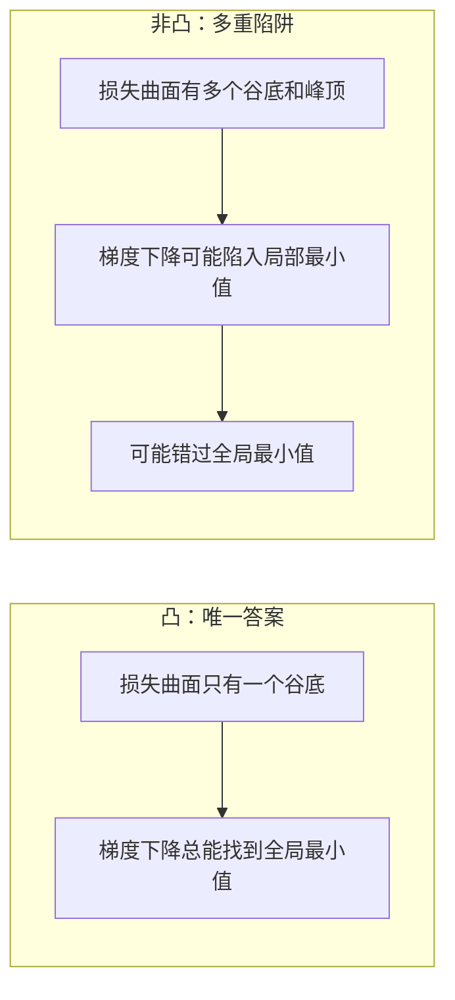
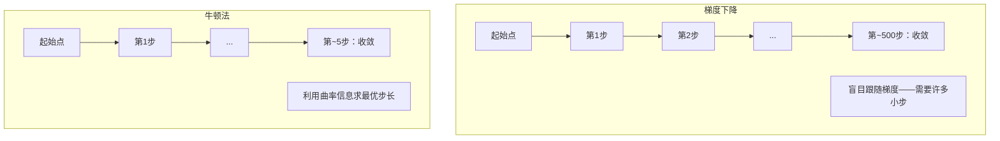
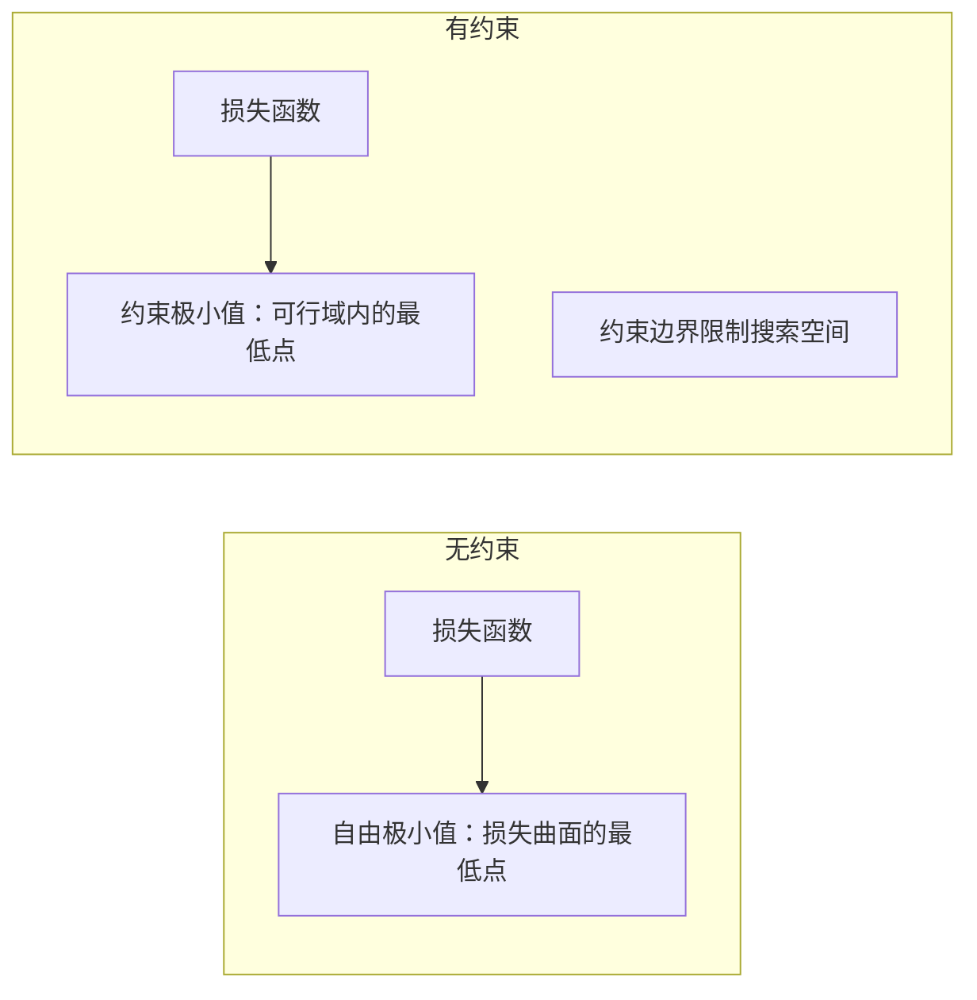
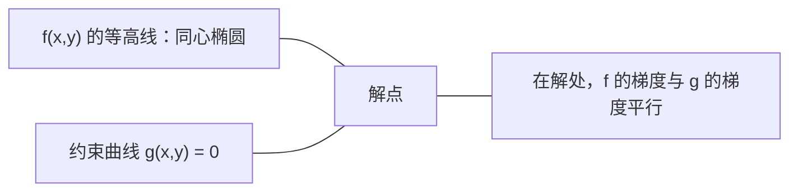

# 凸优化

> 凸问题只有一个谷底。神经网络有数百万个。了解两者的区别至关重要。

**类型：** 构建
**语言：** Python
**前置条件：** 第一阶段，第04课（机器学习微积分）、第08课（优化）
**时长：** 约90分钟

## 学习目标

- 使用定义、二阶导数和 Hessian 准则检验函数是否为凸函数
- 实现牛顿法，并将其二次收敛速度与梯度下降进行比较
- 使用拉格朗日乘数法求解约束优化问题，并解释 KKT 条件
- 解释为什么神经网络损失曲面是非凸的，但 SGD 仍能找到良好解

## 问题背景

第08课讲授了梯度下降、动量和 Adam。这些优化器可以在任意曲面上"下坡"，但没有任何保证：在非凸曲面上，梯度下降可能陷入差的局部极小值、停在鞍点，或永远震荡。之所以仍然使用，是因为神经网络本质上是非凸的，别无选择。

但机器学习中有很多问题是凸的：线性回归、逻辑回归、支持向量机（SVM）、LASSO、岭回归。对这些问题，存在更强有力的工具：带有数学保证的优化。凸问题只有一个谷底——任何"下坡"算法都必然到达全局最小值，无需重启，无需复杂的学习率调度，无需碰运气。

理解凸性有三大作用：第一，判断当前问题是容易的（凸）还是困难的（非凸）；第二，为凸问题提供更快的工具，如牛顿法；第三，解释贯穿整个机器学习的概念：正则化即约束、SVM 中的对偶性，以及深度学习为何在违反凸性所有良好性质的情况下依然有效。

## 核心概念

### 凸集（Convex Sets）

集合 S 是凸集，当且仅当其中任意两点之间的线段也完全位于 S 内。

| 凸集 | 非凸集 |
|---|---|
| **矩形**：内部任意两点之间的连线仍在内部 | **星形/月牙形**：某两个内部点之间的连线可能穿出集合 |
| **三角形**：所有内部点均满足此性质 | **圆环（环形）**：中间的孔使某些连线离开集合 |
| 任意两点之间的线段始终在集合内 | 某些点对之间的线段会穿出集合 |

形式化判断：对 S 中任意点 x、y 以及任意 t ∈ [0, 1]，点 tx + (1-t)y 也在 S 中。

凸集示例：
- 直线、平面、整个 R^n
- 球（圆、球面、超球面）
- 半空间：{x : a^T x <= b}
- 任意数量凸集的交集

非凸集示例：
- 圆环（环面）
- 两个不相交圆的并集
- 任何含有"凹陷"或"孔洞"的集合

### 凸函数（Convex Functions）

函数 f 是凸函数，当且仅当其定义域是凸集，且对定义域内任意两点 x、y 以及任意 t ∈ [0, 1]：

```
f(tx + (1-t)y) <= t*f(x) + (1-t)*f(y)
```

几何直觉：图像上任意两点之间的线段位于图像的上方或上方。

| 性质 | 凸函数 | 非凸函数 |
|---|---|---|
| **线段检验** | 图像上任意两点之间的连线**在曲线上方或重合** | 某些点之间的连线会**跌到曲线下方** |
| **形状** | 单一碗形/谷形，向上弯曲 | 有多个峰谷，曲率方向不一 |
| **局部极小值** | 每个局部极小值都是全局最小值 | 可能存在多个高度各异的局部极小值 |

常见凸函数：
- f(x) = x^2（抛物线）
- f(x) = |x|（绝对值）
- f(x) = e^x（指数函数）
- f(x) = max(0, x)（ReLU，分段线性）
- f(x) = -log(x)，x > 0（负对数）
- 任意线性函数 f(x) = a^T x + b（既凸又凹）

### 凸性检验

三种实用检验方法，从简到严。

**检验一：二阶导数检验（一维）。** 若对所有 x 有 f''(x) >= 0，则 f 是凸函数。

- f(x) = x^2：f''(x) = 2 >= 0，凸。
- f(x) = x^3：f''(x) = 6x，x < 0 时为负，不凸。
- f(x) = e^x：f''(x) = e^x > 0，凸。

**检验二：Hessian 矩阵检验（多元）。** 若对所有 x，Hessian 矩阵 H(x) 是半正定的，则 f 是凸函数。Hessian 矩阵是由所有二阶偏导数构成的矩阵。

**检验三：定义检验。** 直接验证不等式 f(tx + (1-t)y) <= t*f(x) + (1-t)*f(y)。适用于难以计算导数的函数。

### 凸性为何重要

凸优化的核心定理：

**对于凸函数，每个局部极小值都是全局最小值。**

这意味着梯度下降不会被困住——任何"下坡"路径都通往同一个答案，算法保证收敛到最优解。



推论：
- 无需随机重启
- 无需复杂的学习率调度
- 可以证明收敛性（收敛速率取决于函数性质）
- 解是唯一的（除平坦区域外）

### 机器学习中的凸与非凸

| 问题 | 是否凸 | 原因 |
|---------|---------|-----|
| 线性回归（MSE） | 是 | 损失关于权重是二次函数 |
| 逻辑回归 | 是 | 对数损失关于权重是凸的 |
| 支持向量机（合页损失） | 是 | 线性函数的最大值 |
| LASSO（L1 回归） | 是 | 凸函数之和仍为凸 |
| 岭回归（L2） | 是 | 二次 + 二次 = 凸 |
| 神经网络（任意损失） | 否 | 非线性激活函数导致非凸曲面 |
| k 均值聚类 | 否 | 离散赋值步骤 |
| 矩阵分解 | 否 | 未知量之积 |

使用凸损失的线性模型是凸的。一旦添加带有非线性激活函数的隐藏层，凸性即被破坏。

### Hessian 矩阵

函数 f: R^n -> R 的 Hessian 矩阵 H 是一个 n×n 的二阶偏导数矩阵。

```
H[i][j] = d^2 f / (dx_i dx_j)
```

对于 f(x, y) = x^2 + 3xy + y^2：

```
df/dx = 2x + 3y       d^2f/dx^2 = 2      d^2f/dxdy = 3
df/dy = 3x + 2y       d^2f/dydx = 3      d^2f/dy^2 = 2

H = [ 2  3 ]
    [ 3  2 ]
```

Hessian 矩阵揭示曲率信息：
- 特征值全为正：函数在各方向均向上弯曲（该点为凸）
- 特征值全为负：各方向均向下弯曲（凹，局部最大值）
- 特征值符号混合：鞍点（某些方向向上，某些方向向下）
- 零特征值：该方向平坦（退化）

对于凸性，Hessian 矩阵必须在**所有点**处都是半正定的（所有特征值 >= 0），而不仅仅在某一点处。

### 牛顿法（Newton's Method）

梯度下降使用一阶信息（梯度）。牛顿法使用二阶信息（Hessian 矩阵）：在当前点拟合二次近似，并直接跳到该二次函数的极小值处。

```
更新规则：
  x_new = x - H^(-1) * gradient

与梯度下降对比：
  x_new = x - lr * gradient
```

牛顿法用逆 Hessian 矩阵替代标量学习率，根据局部曲率自动调整步长和方向。



优点：
- 接近极小值时二次收敛（误差每步平方缩小）
- 无需调整学习率
- 尺度不变（与问题的参数化方式无关）

缺点：
- 计算 Hessian 需要 O(n^2) 内存，求逆需要 O(n^3) 操作
- 对于含 100 万个权重的神经网络，这意味着 10^12 个元素和 10^18 次操作
- 对深度学习不实用

### 约束优化

无约束优化：对所有 x 最小化 f(x)。
约束优化：在满足约束条件下最小化 f(x)。

实际问题往往有约束：希望最小化成本但预算有限；希望最小化误差但模型复杂度受限。



### 拉格朗日乘数法（Lagrange Multipliers）

拉格朗日乘数法将约束问题转化为无约束问题。

问题：在 g(x) = 0 的约束下最小化 f(x)。

解法：引入新变量（拉格朗日乘数 λ），求解无约束问题：

```
L(x, lambda) = f(x) + lambda * g(x)
```

在解处，L 的梯度为零：

```
dL/dx = df/dx + lambda * dg/dx = 0
dL/dlambda = g(x) = 0
```

几何直觉：在约束极小值处，f 的梯度必须与约束 g 的梯度平行。若不平行，则可以沿约束曲面移动并进一步减小 f。



示例：在 x + y = 1 的约束下最小化 f(x,y) = x^2 + y^2。

```
L = x^2 + y^2 + lambda(x + y - 1)

dL/dx = 2x + lambda = 0  =>  x = -lambda/2
dL/dy = 2y + lambda = 0  =>  y = -lambda/2
dL/dlambda = x + y - 1 = 0

由前两式：x = y
代入：2x = 1，所以 x = y = 0.5，lambda = -1
```

直线 x + y = 1 上距离原点最近的点是 (0.5, 0.5)。

### KKT 条件（KKT Conditions）

Karush-Kuhn-Tucker（KKT）条件将拉格朗日乘数法推广到不等式约束。

问题：在 g_i(x) <= 0（i = 1, ..., m）的约束下最小化 f(x)。

KKT 条件（最优性的必要条件）：

```
1. 稳定性：    df/dx + sum(lambda_i * dg_i/dx) = 0
2. 原始可行性：  g_i(x) <= 0  对所有 i
3. 对偶可行性：  lambda_i >= 0  对所有 i
4. 互补松弛性：  lambda_i * g_i(x) = 0  对所有 i
```

互补松弛性是关键洞察：要么约束是激活的（g_i = 0，解在边界上），要么乘数为零（约束不起作用）。不影响解的约束对应 λ = 0。

KKT 条件在 SVM 中至关重要。支持向量是约束激活的数据点（λ > 0）；其他数据点的 λ = 0，不影响决策边界。

### 正则化即约束优化

L1 和 L2 正则化并非任意技巧，而是伪装成无约束形式的约束优化问题。

**L2 正则化（Ridge 岭回归）：**

```
最小化  Loss(w)  满足  ||w||^2 <= t

等价无约束形式：
最小化  Loss(w) + lambda * ||w||^2
```

约束 ||w||^2 <= t 定义了一个球（二维为圆，三维为球面）。解是损失等高线第一次接触该球的点。

**L1 正则化（LASSO）：**

```
最小化  Loss(w)  满足  ||w||_1 <= t

等价无约束形式：
最小化  Loss(w) + lambda * ||w||_1
```

约束 ||w||_1 <= t 定义了一个菱形（二维为旋转正方形）。

| 性质 | L2 约束（圆形） | L1 约束（菱形） |
|---|---|---|
| **约束形状** | 圆（高维为球面） | 菱形（二维为旋转正方形） |
| **等高线接触位置** | 光滑边界——圆上任意点 | 顶角——与坐标轴对齐 |
| **解的行为** | 权重较小但非零 | 某些权重恰好为零（稀疏） |
| **结果** | 权重收缩 | 特征选择 |

这解释了为什么 L1 产生稀疏模型（特征选择），而 L2 只是收缩权重。菱形的顶角与坐标轴对齐，损失等高线更可能接触到顶角，从而将一个或多个权重精确置零。

### 对偶性（Duality）

每个约束优化问题（原始问题）都有一个对应的伴随问题（对偶问题）。对于凸问题，原始问题和对偶问题的最优值相同——这称为强对偶性。

拉格朗日对偶函数：

```
原始问题：最小化 f(x)，满足 g(x) <= 0
拉格朗日函数：L(x, lambda) = f(x) + lambda * g(x)
对偶函数：d(lambda) = min_x L(x, lambda)
对偶问题：在 lambda >= 0 的约束下最大化 d(lambda)
```

对偶性的意义：
- 对偶问题有时比原始问题更容易求解
- SVM 在对偶形式下求解，问题仅依赖数据点之间的内积（从而可以使用核技巧）
- 对偶提供原始最优值的下界，可用于检验解的质量

SVM 的具体形式：

```
原始：找 w, b，在以下约束下最大化间隔 2/||w||：
        y_i(w^T x_i + b) >= 1，对所有 i

对偶：最大化 sum(alpha_i) - 0.5 * sum_ij(alpha_i * alpha_j * y_i * y_j * x_i^T x_j)
       满足 alpha_i >= 0 且 sum(alpha_i * y_i) = 0

对偶形式只涉及内积 x_i^T x_j。
用 K(x_i, x_j) 替换 x_i^T x_j 即得到核技巧。
```

### 深度学习为何在非凸情形下仍然有效

神经网络损失函数极度非凸，按所有经典标准来看，优化应当失败。然而随机梯度下降却能可靠地找到良好解。以下几个因素解释了这一现象。

**大多数局部极小值已经足够好。** 在高维空间中，随机临界点（梯度为零的点）绝大多数是鞍点而非局部极小值。存在的少数局部极小值往往具有接近全局最小值的损失值。在参数空间有数百万维的情况下，陷入极差的局部极小值的概率极低。

**鞍点而非局部极小值才是真正的障碍。** 在 n 参数函数中，鞍点在某些方向曲率为正，在另一些方向为负。对于高维空间中随机临界点，所有 n 个特征值均为正（局部极小值）的概率约为 2^(-n)。几乎所有临界点都是鞍点，SGD 的噪声有助于逃离鞍点。

**过参数化使损失曲面更平滑。** 参数数量多于训练样本数量的网络具有更平滑、连通性更好的损失曲面。更宽的网络拥有更少的差局部极小值。这一结论反直觉，但与实验结果一致。

**损失曲面结构：**

| 性质 | 低维空间 | 高维空间 |
|---|---|---|
| **曲面** | 许多孤立的峰谷 | 平滑连通的谷地 |
| **极小值** | 许多孤立的局部极小值 | 很少有差的局部极小值；大多数接近最优 |
| **导航** | 难以找到全局最小值 | 许多路径通往良好解 |
| **临界点** | 局部极小值与鞍点混合 | 绝大多数是鞍点，而非局部极小值 |

**随机噪声作为隐式正则化。** 小批量 SGD 引入的噪声阻止收敛到尖锐极小值。尖锐极小值过拟合；平坦极小值泛化更好。噪声使优化偏向损失曲面的平坦区域。

### 实践中的二阶方法

纯牛顿法对大型模型不实用。以下几种近似方法使二阶信息得以实际使用。

**L-BFGS（有限内存 BFGS）：** 使用最近 m 次梯度差异近似逆 Hessian，需要 O(mn) 内存而非 O(n^2)。适用于参数约 10,000 以内的问题。用于经典机器学习（逻辑回归、CRF），但不用于深度学习。

**自然梯度（Natural Gradient）：** 使用 Fisher 信息矩阵（对数似然的期望 Hessian）代替标准 Hessian，考虑概率分布的几何结构。K-FAC（Kronecker 分解近似曲率）将 Fisher 矩阵近似为 Kronecker 积，使其对神经网络实用。

**无 Hessian 优化（Hessian-free Optimization）：** 使用共轭梯度法求解 Hx = g，无需显式构造 H，只需 Hessian-向量积，可通过自动微分在 O(n) 时间内计算。

**对角近似：** Adam 的二阶矩是 Hessian 对角元的对角近似；AdaHessian 通过 Hutchinson 估计器使用真实 Hessian 对角元。

| 方法 | 内存 | 每步代价 | 使用场景 |
|--------|--------|--------------|-------------|
| 梯度下降 | O(n) | O(n) | 基线，大型模型 |
| 牛顿法 | O(n^2) | O(n^3) | 小型凸问题 |
| L-BFGS | O(mn) | O(mn) | 中型凸问题 |
| Adam | O(n) | O(n) | 深度学习默认 |
| K-FAC | O(n) | 每层 O(n) | 研究，大批量训练 |

## 动手实现

### 步骤一：凸性检验器

构建一个函数，通过采样点并检验定义来经验性地检测凸性。

```python
import random
import math

def check_convexity(f, dim, bounds=(-5, 5), samples=1000):
    violations = 0
    for _ in range(samples):
        x = [random.uniform(*bounds) for _ in range(dim)]
        y = [random.uniform(*bounds) for _ in range(dim)]
        t = random.uniform(0, 1)
        mid = [t * xi + (1 - t) * yi for xi, yi in zip(x, y)]
        lhs = f(mid)
        rhs = t * f(x) + (1 - t) * f(y)
        if lhs > rhs + 1e-10:
            violations += 1
    return violations == 0, violations
```

### 步骤二：二维牛顿法

使用显式 Hessian 实现牛顿法，并与梯度下降的收敛速度进行比较。

```python
def newtons_method(f, grad_f, hessian_f, x0, steps=50, tol=1e-12):
    x = list(x0)
    history = [x[:]]
    for _ in range(steps):
        g = grad_f(x)
        H = hessian_f(x)
        det = H[0][0] * H[1][1] - H[0][1] * H[1][0]
        if abs(det) < 1e-15:
            break
        H_inv = [
            [H[1][1] / det, -H[0][1] / det],
            [-H[1][0] / det, H[0][0] / det],
        ]
        dx = [
            H_inv[0][0] * g[0] + H_inv[0][1] * g[1],
            H_inv[1][0] * g[0] + H_inv[1][1] * g[1],
        ]
        x = [x[0] - dx[0], x[1] - dx[1]]
        history.append(x[:])
        if sum(gi ** 2 for gi in g) < tol:
            break
    return history
```

### 步骤三：拉格朗日乘数求解器

通过对拉格朗日函数进行梯度下降来求解约束优化。

```python
def lagrange_solve(f_grad, g_val, g_grad, x0, lr=0.01,
                   lr_lambda=0.01, steps=5000):
    x = list(x0)
    lam = 0.0
    history = []
    for _ in range(steps):
        fg = f_grad(x)
        gv = g_val(x)
        gg = g_grad(x)
        x = [
            xi - lr * (fgi + lam * ggi)
            for xi, fgi, ggi in zip(x, fg, gg)
        ]
        lam = lam + lr_lambda * gv
        history.append((x[:], lam, gv))
    return history
```

### 步骤四：一阶与二阶方法对比

在同一个二次函数上分别运行梯度下降和牛顿法，统计收敛步数。

```python
def quadratic(x):
    return 5 * x[0] ** 2 + x[1] ** 2

def quadratic_grad(x):
    return [10 * x[0], 2 * x[1]]

def quadratic_hessian(x):
    return [[10, 0], [0, 2]]
```

牛顿法将在 1 步内收敛（对二次函数精确）。梯度下降则需要数百步，因为 Hessian 特征值之比为 5，形成一个细长的谷地。

## 实际应用

凸性分析直接指导机器学习模型和求解器的选择。

对于凸问题（逻辑回归、SVM、LASSO）：
- 使用专用求解器（liblinear、CVXPY、scipy.optimize.minimize with method='L-BFGS-B'）
- 期待唯一的全局解
- 二阶方法实用且高效

对于非凸问题（神经网络）：
- 使用一阶方法（SGD、Adam）
- 接受解依赖于初始化和随机性
- 使用过参数化、噪声和学习率调度作为隐式正则化
- 不要浪费时间搜索全局最小值，好的局部极小值已经足够

```python
from scipy.optimize import minimize

result = minimize(
    fun=lambda w: sum((y - X @ w) ** 2) + 0.1 * sum(w ** 2),
    x0=np.zeros(d),
    method='L-BFGS-B',
    jac=lambda w: -2 * X.T @ (y - X @ w) + 0.2 * w,
)
```

对于 SVM，对偶形式允许使用核技巧：

```python
from sklearn.svm import SVC

svm = SVC(kernel='rbf', C=1.0)
svm.fit(X_train, y_train)
print(f"Support vectors: {svm.n_support_}")
```

## 练习

1. **凸性图集。** 使用检验器测试以下函数的凸性：f(x) = x^4，f(x) = sin(x)，f(x,y) = x^2 + y^2，f(x,y) = x*y，f(x) = max(x, 0)。解释每个结果的原因。

2. **牛顿法与梯度下降竞速。** 从起点 (10, 10) 出发，在 f(x,y) = 50*x^2 + y^2 上分别运行两种方法。各自需要多少步才能使损失 < 1e-10？当条件数（Hessian 最大特征值与最小特征值之比）增大时，梯度下降有何变化？

3. **拉格朗日乘数的几何意义。** 在 x + 2y = 4 的约束下最小化 f(x,y) = (x-3)^2 + (y-3)^2。在解处验证 f 的梯度与 g 的梯度平行。

4. **正则化约束。** 实现 L1 约束优化：在 |x| + |y| <= 1 的约束下最小化 (x-3)^2 + (y-2)^2。证明解中有一个坐标恰好为零（菱形约束导致的稀疏性）。

5. **Hessian 特征值分析。** 在 (1,1) 和 (-1,1) 处计算 Rosenbrock 函数的 Hessian 矩阵，并计算两处的特征值。特征值分别告诉你极小值处和远离极小值处的曲率是什么？

## 关键术语

| 术语 | 含义 |
|------|---------------|
| 凸集（Convex set） | 集合内任意两点之间的线段始终在集合内 |
| 凸函数（Convex function） | 图像上任意两点之间的连线位于图像上方或重合。等价地，Hessian 矩阵在各处均为半正定 |
| 局部极小值（Local minimum） | 比所有邻近点都低的点。对凸函数，局部极小值即全局最小值 |
| 全局最小值（Global minimum） | 函数在整个定义域上的最低点 |
| Hessian 矩阵（Hessian matrix） | 所有二阶偏导数构成的矩阵，编码曲率信息 |
| 半正定（Positive semidefinite） | 所有特征值均非负的矩阵；是"二阶导数 >= 0"的多维类比 |
| 条件数（Condition number） | Hessian 最大特征值与最小特征值之比。条件数高意味着细长谷地，梯度下降缓慢 |
| 牛顿法（Newton's method） | 使用逆 Hessian 确定步长和方向的二阶优化器，接近极小值时二次收敛 |
| 拉格朗日乘数（Lagrange multiplier） | 为将约束优化问题转化为无约束问题而引入的变量 |
| KKT 条件（KKT conditions） | 不等式约束下最优性的必要条件，是拉格朗日乘数法的推广 |
| 互补松弛性（Complementary slackness） | 在解处，约束要么激活，要么其乘数为零，二者不同时非零 |
| 对偶性（Duality） | 每个约束问题都有伴随的对偶问题；对凸问题，两者最优值相等 |
| 强对偶性（Strong duality） | 原始问题与对偶问题的最优值相等；满足 Slater 条件的凸问题具有此性质 |
| L-BFGS | 近似二阶方法，存储最近 m 次梯度差异而非完整 Hessian |
| 鞍点（Saddle point） | 梯度为零，但在某些方向为极小值、在另一些方向为极大值的点 |
| 过参数化（Overparameterization） | 使用比训练样本更多的参数，使损失曲面更平滑并减少差的局部极小值 |

## 延伸阅读

- [Boyd & Vandenberghe: Convex Optimization](https://web.stanford.edu/~boyd/cvxbook/) — 标准教材，可在线免费获取
- [Bottou, Curtis, Nocedal: Optimization Methods for Large-Scale Machine Learning (2018)](https://arxiv.org/abs/1606.04838) — 连接凸优化理论与深度学习实践
- [Choromanska et al.: The Loss Surfaces of Multilayer Networks (2015)](https://arxiv.org/abs/1412.0233) — 为什么非凸神经网络损失曲面并不像看起来那么糟糕
- [Nocedal & Wright: Numerical Optimization](https://link.springer.com/book/10.1007/978-0-387-40065-5) — 牛顿法、L-BFGS 和约束优化的综合参考
