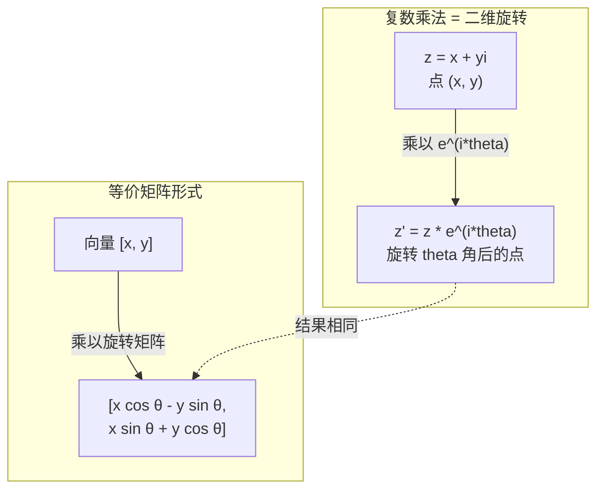
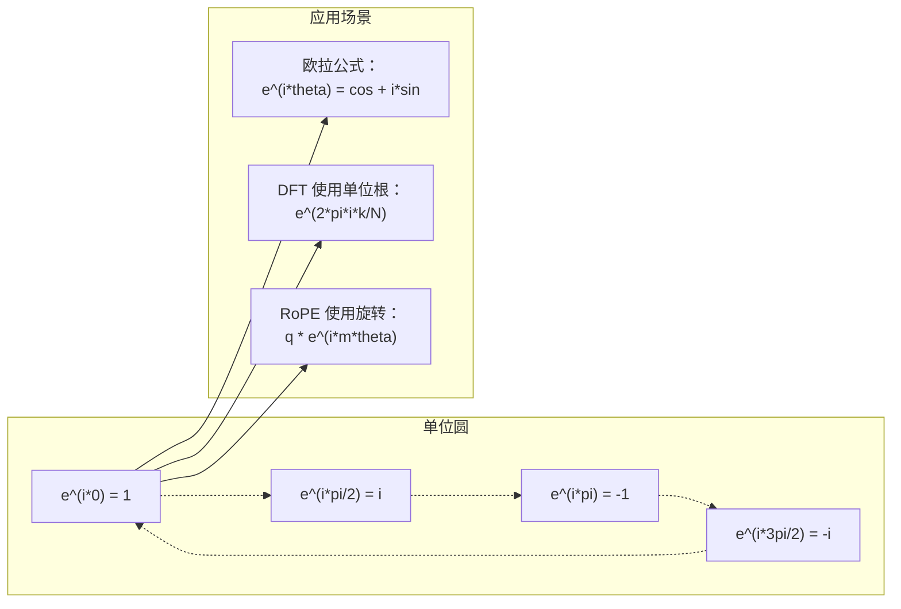

# 面向 AI 的复数

> -1 的平方根并不"虚"。它是旋转、频率以及信号处理半壁江山的钥匙。

**类型：** 学习
**语言：** Python
**前置条件：** 第一阶段，第01-04课（线性代数、微积分）
**时长：** 约60分钟

## 学习目标

- 以直角形式和极坐标形式完成复数运算（加法、乘法、除法、共轭）
- 应用欧拉公式在复指数与三角函数之间转换
- 使用单位根实现离散傅里叶变换（DFT）
- 解释复旋转如何支撑 Transformer 中的 RoPE 和正弦位置编码

## 问题背景

打开一篇关于傅里叶变换的论文，满眼都是 `i`。查看 Transformer 的位置编码，看到不同频率的 `sin` 和 `cos`——它们正是复指数的实部和虚部。阅读量子计算相关内容，发现一切都以复向量空间表达。

复数看似抽象，建立在 -1 的平方根上的数系感觉像是数学把戏。但它不是把戏——它是旋转与振荡的自然语言。凡是旋转、振动或震荡的事物，复数都是正确的描述工具。

不理解复数，就无法理解离散傅里叶变换（DFT），无法理解 FFT，无法理解现代语言模型中 RoPE（旋转位置编码）的工作原理，也无法理解原版 Transformer 论文中正弦位置编码为何使用那些频率。

本课从零构建复数运算，将其与几何相连，并展示复数在机器学习中的具体应用场景。

## 核心概念

### 什么是复数？

复数由两部分组成：实部和虚部。

```
z = a + bi

其中：
  a 是实部
  b 是虚部
  i 是虚数单位，定义为 i^2 = -1
```

就这么简单。将数轴延伸为平面：实数在一条轴上，虚数在另一条轴上，每个复数都是这个平面上的一个点。

### 复数运算

**加法。** 实部相加，虚部相加。

```
(a + bi) + (c + di) = (a + c) + (b + d)i

示例：(3 + 2i) + (1 + 4i) = 4 + 6i
```

**乘法。** 使用分配律，记住 i^2 = -1。

```
(a + bi)(c + di) = ac + adi + bci + bdi^2
                 = ac + adi + bci - bd
                 = (ac - bd) + (ad + bc)i

示例：(3 + 2i)(1 + 4i) = 3 + 12i + 2i + 8i^2
                        = 3 + 14i - 8
                        = -5 + 14i
```

**共轭（Conjugate）。** 将虚部取反。

```
(a + bi) 的共轭 = a - bi
```

一个复数与其共轭之积恒为实数：

```
(a + bi)(a - bi) = a^2 + b^2
```

**除法。** 分子分母同乘以分母的共轭。

```
(a + bi) / (c + di) = (a + bi)(c - di) / (c^2 + d^2)
```

这样可以消去分母中的虚部，得到规整的复数。

### 复平面（Complex Plane）

复平面将每个复数映射为二维点：水平轴为实轴，垂直轴为虚轴。

```
z = 3 + 2i  对应点 (3, 2)
z = -1 + 0i 对应实轴上的点 (-1, 0)
z = 0 + 4i  对应虚轴上的点 (0, 4)
```

复数既是一个点，也是从原点出发的向量。这种双重解释使复数在几何中大显身手。

### 极坐标形式（Polar Form）

平面上的任意点都可以用距原点的距离和相对正实轴的角度来描述。

```
z = r * (cos(theta) + i*sin(theta))

其中：
  r = |z| = sqrt(a^2 + b^2)     （模，即幅度）
  theta = atan2(b, a)             （辐角，即相位）
```

直角形式（a + bi）适合加法，极坐标形式（r, theta）适合乘法。

**极坐标形式下的乘法。** 模相乘，辐角相加。

```
z1 = r1 * e^(i*theta1)
z2 = r2 * e^(i*theta2)

z1 * z2 = (r1 * r2) * e^(i*(theta1 + theta2))
```

这正是复数完美描述旋转的原因。乘以模为 1 的复数就是纯旋转。

### 欧拉公式（Euler's Formula）

复指数与三角函数之间的桥梁：

```
e^(i*theta) = cos(theta) + i*sin(theta)
```

这是本课最重要的公式。当 theta = pi 时：

```
e^(i*pi) = cos(pi) + i*sin(pi) = -1 + 0i = -1

因此：e^(i*pi) + 1 = 0
```

五个基本常数（e、i、π、1、0）融于一个方程。

### 欧拉公式对机器学习的意义

欧拉公式表明，随着 theta 变化，`e^(i*theta)` 在单位圆上描绘轨迹：theta = 0 时在 (1, 0)，theta = π/2 时在 (0, 1)，theta = π 时在 (-1, 0)，theta = 3π/2 时在 (0, -1)，完整旋转一圈为 theta = 2π。

这意味着复指数本质上就是旋转。而旋转在信号处理和机器学习中无处不在。

### 与二维旋转的关系

将复数 (x + yi) 乘以 e^(i*theta)，等价于将点 (x, y) 绕原点旋转角度 theta。

```
通过复数乘法旋转：
  (x + yi) * (cos(theta) + i*sin(theta))
  = (x*cos(theta) - y*sin(theta)) + (x*sin(theta) + y*cos(theta))i

通过矩阵乘法旋转：
  [cos(theta)  -sin(theta)] [x]   [x*cos(theta) - y*sin(theta)]
  [sin(theta)   cos(theta)] [y] = [x*sin(theta) + y*cos(theta)]
```

两者结果完全相同。复数乘法就是二维旋转，旋转矩阵不过是用矩阵记号写出的复数乘法。



### 相量（Phasors）与旋转信号

复指数 e^(i*omega*t) 是一个以角频率 omega 绕单位圆旋转的点。随 t 增大，该点描绘出圆的轨迹。

此旋转点的实部为 cos(omega*t)，虚部为 sin(omega*t)。正弦信号是旋转复数在某方向的"投影"。

```
e^(i*omega*t) = cos(omega*t) + i*sin(omega*t)

实部：      cos(omega*t)    -- 余弦波
虚部：      sin(omega*t)    -- 正弦波
```

这就是相量表示法。无需追踪曲折的正弦波，只需追踪平滑旋转的箭头。相移变为角度偏移，幅度变化变为模的变化，信号叠加变为向量相加。

### 单位根（Roots of Unity）

N 次单位根是单位圆上等间距的 N 个点：

```
w_k = e^(2*pi*i*k/N)    其中 k = 0, 1, 2, ..., N-1
```

N = 4 时，单位根为：1、i、-1、-i（四个方向）。
N = 8 时，得到四个方向加上四个对角方向共八个点。

单位根是离散傅里叶变换的基础。DFT 将信号分解为这 N 个等间距频率的分量。

### 与 DFT 的关系

信号 x[0], x[1], ..., x[N-1] 的离散傅里叶变换为：

```
X[k] = sum_{n=0}^{N-1} x[n] * e^(-2*pi*i*k*n/N)
```

每个 X[k] 衡量信号与第 k 个单位根（频率为 k 的复正弦波）的相关程度。DFT 将信号分解为 N 个旋转相量，并给出每个相量的幅度和相位。

### 为什么 i 并不"虚"

"虚数"这个词是历史遗留的。笛卡尔用它来表示轻蔑，但 i 并不比负数更"虚"——当负数首次出现时，人们也拒绝接受它。负数回答的是"从 3 减去多少得 -5？"；虚数单位回答的是"什么数的平方等于 -1？"

更实用的理解：i 是一个 90 度旋转算子。将实数乘以 i 一次，旋转 90 度到虚轴；再乘以 i（即 i^2），再转 90 度——此时指向负实轴方向。这就是 i^2 = -1 的原因，毫不神秘，不过是两次 90 度旋转叠加成 180 度旋转。

这也是为什么复数在工程中无处不在：凡是旋转的事物——电磁波、量子态、信号振荡、位置编码——都天然用复数描述。

### 复指数与三角函数的对比

欧拉公式出现之前，工程师将信号写成 A*cos(omega*t + phi)——幅度 A、频率 omega、相位 phi。这种写法可以用，但运算繁琐：将两个相位不同的余弦叠加需要三角恒等式。

使用复指数，同样的信号写为 A*e^(i*(omega*t + phi))。信号叠加变为复数相加；调制（乘法）变为模相乘、辐角相加；相移变为角度加法；频移变为乘以相量。

整个信号处理领域转向复指数记法，因为运算更简洁。"实际信号"始终是复数表示的实部，虚部随之携带，使所有代数运算自然成立。

### 与 Transformer 的关系

**正弦位置编码**（原版 Transformer 论文）：

```
PE(pos, 2i) = sin(pos / 10000^(2i/d))
PE(pos, 2i+1) = cos(pos / 10000^(2i/d))
```

这些 sin 和 cos 对正是不同频率复指数的实部和虚部。每个频率提供不同"分辨率"来编码位置：低频变化缓慢（粗粒度位置），高频变化迅速（细粒度位置）。两者结合使每个位置拥有唯一的频率指纹。

**RoPE（旋转位置编码）** 更进一步：它显式地将查询向量和键向量乘以复旋转矩阵，两个 token 之间的相对位置成为旋转角度。注意力计算使用这些旋转后的向量，通过复数乘法使模型感知相对位置。

| 运算 | 代数形式 | 几何含义 |
|-----------|---------------|-------------------|
| 加法（Addition） | (a+c) + (b+d)i | 平面上的向量加法 |
| 乘法（Multiplication） | (ac-bd) + (ad+bc)i | 旋转并缩放 |
| 共轭（Conjugate） | a - bi | 关于实轴的反射 |
| 模（Magnitude） | sqrt(a^2 + b^2) | 距原点的距离 |
| 辐角（Phase） | atan2(b, a) | 相对正实轴的角度 |
| 除法（Division） | 乘以共轭 | 逆旋转并缩放 |
| 幂（Power） | r^n * e^(i*n*theta) | 旋转 n 次，模缩放为 r^n |



## 动手实现

### 步骤一：复数类

构建一个支持运算、模、辐角以及直角/极坐标转换的 Complex 类。

```python
import math

class Complex:
    def __init__(self, real, imag=0.0):
        self.real = real
        self.imag = imag

    def __add__(self, other):
        return Complex(self.real + other.real, self.imag + other.imag)

    def __mul__(self, other):
        r = self.real * other.real - self.imag * other.imag
        i = self.real * other.imag + self.imag * other.real
        return Complex(r, i)

    def __truediv__(self, other):
        denom = other.real ** 2 + other.imag ** 2
        r = (self.real * other.real + self.imag * other.imag) / denom
        i = (self.imag * other.real - self.real * other.imag) / denom
        return Complex(r, i)

    def magnitude(self):
        return math.sqrt(self.real ** 2 + self.imag ** 2)

    def phase(self):
        return math.atan2(self.imag, self.real)

    def conjugate(self):
        return Complex(self.real, -self.imag)
```

### 步骤二：极坐标转换与欧拉公式

```python
def to_polar(z):
    return z.magnitude(), z.phase()

def from_polar(r, theta):
    return Complex(r * math.cos(theta), r * math.sin(theta))

def euler(theta):
    return Complex(math.cos(theta), math.sin(theta))
```

验证：`euler(theta).magnitude()` 应始终为 1.0；`euler(0)` 应给出 (1, 0)；`euler(pi)` 应给出 (-1, 0)。

### 步骤三：旋转

将点 (x, y) 旋转 theta 角，只需一次复数乘法：

```python
point = Complex(3, 4)
rotated = point * euler(math.pi / 4)
```

模保持不变，只有角度改变。

### 步骤四：基于复数运算的 DFT

```python
def dft(signal):
    N = len(signal)
    result = []
    for k in range(N):
        total = Complex(0, 0)
        for n in range(N):
            angle = -2 * math.pi * k * n / N
            total = total + Complex(signal[n], 0) * euler(angle)
        result.append(total)
    return result
```

这是 O(N^2) 的 DFT 实现。每个输出 X[k] 是信号样本与单位根之积的求和。

### 步骤五：逆 DFT

逆 DFT 从频谱重建原始信号。与正向 DFT 相比，只需将指数符号取反并除以 N。

```python
def idft(spectrum):
    N = len(spectrum)
    result = []
    for n in range(N):
        total = Complex(0, 0)
        for k in range(N):
            angle = 2 * math.pi * k * n / N
            total = total + spectrum[k] * euler(angle)
        result.append(Complex(total.real / N, total.imag / N))
    return result
```

这实现了完美重建：先正向 DFT，再逆 DFT，即可恢复到机器精度的原始信号，信息零损失。

### 步骤六：单位根

```python
def roots_of_unity(N):
    return [euler(2 * math.pi * k / N) for k in range(N)]
```

验证两个性质：
- 每个根的模恰好为 1。
- 所有 N 个根之和为零（对称性相消）。

这些性质正是 DFT 可逆的原因。单位根构成频域的正交基。

## 实际应用

Python 内置支持复数，字面量 `j` 表示虚数单位。

```python
z = 3 + 2j
w = 1 + 4j

print(z + w)
print(z * w)
print(abs(z))

import cmath
print(cmath.phase(z))
print(cmath.exp(1j * cmath.pi))
```

对于数组，numpy 原生支持复数：

```python
import numpy as np

z = np.array([1+2j, 3+4j, 5+6j])
print(np.abs(z))
print(np.angle(z))
print(np.conj(z))
print(np.real(z))
print(np.imag(z))

signal = np.sin(2 * np.pi * 5 * np.linspace(0, 1, 128))
spectrum = np.fft.fft(signal)
freqs = np.fft.fftfreq(128, d=1/128)
```

## 发布

运行 `code/complex_numbers.py` 以生成 `outputs/skill-complex-arithmetic.md`。

## 练习

1. **手算复数运算。** 计算 (2 + 3i) * (4 - i) 并用代码验证，再计算 (5 + 2i) / (1 - 3i)。在复平面上画出两个结果，验证乘法对第一个数进行了旋转和缩放。

2. **旋转序列。** 从点 (1, 0) 出发，连续乘以 e^(i*pi/6) 十二次，验证经过 12 次乘法后回到 (1, 0)。打印每步坐标，确认它们描绘出正十二边形。

3. **已知信号的 DFT。** 创建一个信号：sin(2*pi*3*t) + 0.5*sin(2*pi*7*t)，在 32 个点处采样，运行 DFT，验证幅度谱在频率 3 和 7 处有峰值，且频率 7 处的峰值高度是频率 3 处峰值的一半。

4. **单位根可视化。** 计算 8 次单位根，验证其和为零，验证任意一个根乘以本原根 e^(2*pi*i/8) 等于下一个根。

5. **旋转矩阵等价性。** 对 10 个随机角度和 10 个随机点，验证复数乘法与 2×2 旋转矩阵-向量乘法给出相同结果，打印最大数值误差。

## 关键术语

| 术语 | 含义 |
|------|---------------|
| 复数（Complex number） | 形如 a + bi 的数，a 为实部，b 为虚部，i^2 = -1 |
| 虚数单位（Imaginary unit） | 数 i，定义为 i^2 = -1。哲学意义上并不"虚"——它是一个旋转算子 |
| 复平面（Complex plane） | x 轴为实轴、y 轴为虚轴的二维平面，也称 Argand 平面 |
| 模（Magnitude/Modulus） | 距原点的距离：sqrt(a^2 + b^2)，记为 \|z\| |
| 辐角（Phase/Argument） | 相对正实轴的角度：atan2(b, a)，记为 arg(z) |
| 共轭（Conjugate） | 关于实轴的镜像：a + bi 的共轭为 a - bi |
| 极坐标形式（Polar form） | 将 z 表示为 r * e^(i*theta) 而非 a + bi，使乘法更简便 |
| 欧拉公式（Euler's formula） | e^(i*theta) = cos(theta) + i*sin(theta)，连接指数与三角函数 |
| 相量（Phasor） | 表示正弦信号的旋转复数 e^(i*omega*t) |
| 单位根（Roots of unity） | k = 0 到 N-1 的 N 个复数 e^(2*pi*i*k/N)，单位圆上等间距的 N 个点 |
| DFT（离散傅里叶变换） | 使用单位根将信号分解为复正弦分量 |
| RoPE（旋转位置编码） | 利用复数乘法在 Transformer 注意力中编码相对位置 |

## 延伸阅读

- [欧拉公式的直观介绍](https://betterexplained.com/articles/intuitive-understanding-of-eulers-formula/) — 无需繁琐符号，建立几何直觉
- [Su et al.: RoFormer (2021)](https://arxiv.org/abs/2104.09864) — 引入基于复旋转的旋转位置编码的论文
- [Vaswani et al.: Attention Is All You Need (2017)](https://arxiv.org/abs/1706.03762) — 使用正弦位置编码的原版 Transformer 论文
- [3Blue1Brown: 结合群论的欧拉公式](https://www.youtube.com/watch?v=mvmuCPvRoWQ) — 为什么 e^(i*pi) = -1 的可视化解释
- [Needham: Visual Complex Analysis](https://global.oup.com/academic/product/visual-complex-analysis-9780198534464) — 复数最佳可视化教材，充满几何洞见
- [Strang: Introduction to Linear Algebra, Ch. 10](https://math.mit.edu/~gs/linearalgebra/) — 线性代数与特征值背景下的复数
