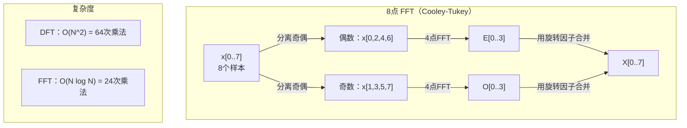
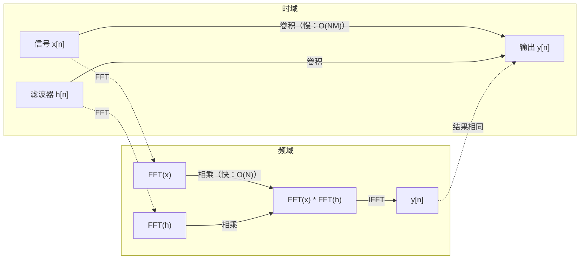

# 傅里叶变换

> 每个信号都是一组正弦波的叠加。傅里叶变换告诉你它们分别是什么。

**类型：** 构建
**语言：** Python
**前置条件：** 第一阶段，第01-04课及第19课（复数）
**时长：** 约90分钟

## 学习目标

- 从零实现 DFT，并与 O(N log N) 的 Cooley-Tukey FFT 进行验证对比
- 解读频率系数：从信号中提取幅度、相位和功率谱
- 应用卷积定理通过 FFT 乘法实现卷积
- 将傅里叶频率分解与 Transformer 位置编码和 CNN 卷积层相联系

## 问题背景

音频录音是随时间变化的气压值序列；股价是按天记录的数值序列；图像是空间上像素强度的网格。这些数据都处于时域（或空域）——你观察到的是某个索引上不断变化的值。

但许多模式在时域中是不可见的：这段音频是纯音还是和弦？股价有没有每周周期？这张图像有没有重复纹理？这些问题关乎频率内容，而时域将其隐藏了。

傅里叶变换将数据从时域转换到频域——它将信号分解为不同频率的正弦波，每个正弦波都有幅度（强弱）和相位（起始位置），傅里叶变换同时给出这两者。

这对机器学习意义重大，因为频域思维无处不在：卷积神经网络执行卷积，等价于频域中的逐点乘法；Transformer 位置编码使用频率分解来表示位置；音频模型（语音识别、音乐生成）在频谱图（声音的频率表示）上操作；时间序列模型寻找周期性模式。理解傅里叶变换，你就掌握了处理这一切的词汇。

## 核心概念

### DFT 定义

给定 N 个样本 x[0], x[1], ..., x[N-1]，离散傅里叶变换产生 N 个频率系数 X[0], X[1], ..., X[N-1]：

```
X[k] = sum_{n=0}^{N-1} x[n] * e^(-2*pi*i*k*n/N)

对 k = 0, 1, ..., N-1
```

每个 X[k] 是一个复数：模 |X[k]| 表示频率 k 的幅度，相位 angle(X[k]) 表示该频率的相位偏移。

核心洞察：`e^(-2*pi*i*k*n/N)` 是频率 k 处的旋转相量。DFT 计算信号与 N 个等间距频率中每一个的相关程度。若信号在频率 k 处有能量，相关值大；否则接近零。

### 各系数的含义

**X[0]：直流分量（DC component）。** 这是所有样本之和——与均值成比例，代表信号的常数（零频率）偏移。

```
X[0] = sum_{n=0}^{N-1} x[n] * e^0 = 所有样本之和
```

**1 <= k <= N/2 时的 X[k]：正频率。** X[k] 代表每 N 个样本内 k 个周期的频率，k 越大频率越高（振荡越快）。

**X[N/2]：奈奎斯特频率（Nyquist frequency）。** N 个样本可以表示的最高频率，超过此频率会发生混叠——高频伪装成低频。

**N/2 < k < N 时的 X[k]：负频率。** 对于实值信号，X[N-k] = conj(X[k])，负频率是正频率的镜像。因此有用信息集中在前 N/2 + 1 个系数中。

### 逆 DFT（Inverse DFT）

逆 DFT 从频率系数重建原始信号：

```
x[n] = (1/N) * sum_{k=0}^{N-1} X[k] * e^(2*pi*i*k*n/N)

对 n = 0, 1, ..., N-1
```

与正向 DFT 的唯一区别：指数中的符号为正（非负），并有 1/N 归一化因子。

逆 DFT 实现完美重建——信息零损失。可以从时域到频域再返回，无任何误差。DFT 本质上是换基——将相同信息用不同的坐标系重新表达。

### FFT：加速计算

按上述定义，DFT 是 O(N^2)：对 N 个输出系数中的每一个，都要对 N 个输入样本求和。N = 100 万时，这意味着 10^12 次操作。

快速傅里叶变换（FFT）以 O(N log N) 计算相同结果。N = 100 万时，约需 2000 万次操作而非万亿次。这使频率分析在实践中可行。

Cooley-Tukey 算法（最常见的 FFT）采用分治策略：

1. 将信号分为偶数索引和奇数索引的样本。
2. 递归计算各半部分的 DFT。
3. 使用"旋转因子"（twiddle factors）e^(-2*pi*i*k/N) 合并两个半长 DFT。

```
X[k] = E[k] + e^(-2*pi*i*k/N) * O[k]          对 k = 0, ..., N/2 - 1
X[k + N/2] = E[k] - e^(-2*pi*i*k/N) * O[k]    对 k = 0, ..., N/2 - 1

其中 E = 偶数索引样本的 DFT
      O = 奇数索引样本的 DFT
```

由于对称性，每层递归完成 O(N) 的工作，共有 log2(N) 层。总计：O(N log N)。



FFT 要求信号长度为 2 的幂次。实际使用中，将信号零填充到下一个 2 的幂次。

### 频谱分析

**功率谱（Power spectrum）**为 |X[k]|^2——每个频率系数的模的平方，显示各频率处的能量分布。

**相位谱（Phase spectrum）**为 angle(X[k])——每个频率的相位偏移。大多数分析任务只关心功率谱，忽略相位。

```
频率 k 处的功率：  P[k] = |X[k]|^2 = X[k].real^2 + X[k].imag^2
频率 k 处的相位：  phi[k] = atan2(X[k].imag, X[k].real)
```

### 频率分辨率

DFT 的频率分辨率取决于样本数 N 和采样率 fs。

```
第 k 个频率箱的频率：  f_k = k * fs / N
频率分辨率：          delta_f = fs / N
最高频率：            f_max = fs / 2  （奈奎斯特）
```

要分辨两个相近的频率，需要更多样本。要捕捉高频，需要更高的采样率。

### 卷积定理（Convolution Theorem）

这是信号处理中最重要的结论之一，与 CNN 直接相关。

**时域中的卷积等于频域中的逐点乘法。**

```
x * h = IFFT(FFT(x) . FFT(h))

其中 * 表示卷积，. 表示逐元素乘法
```

意义所在：

- 两个长度分别为 N 和 M 的信号直接卷积需要 O(N*M) 操作。
- 基于 FFT 的卷积需要 O(N log N)：变换两者、相乘、逆变换。
- 对大卷积核，FFT 卷积快得多。
- 这正是具有大感受野的卷积层所做的事情。

注意：DFT 计算的是循环卷积（信号首尾相接）。对于线性卷积（无首尾衔接），计算前需对两个信号零填充至长度 N + M - 1。



### 加窗（Windowing）

DFT 假设信号具有周期性——将 N 个样本视为无限重复信号的一个周期。若信号首尾值不同，则在边界产生不连续性，表现为虚假的高频内容，称为**频谱泄漏（spectral leakage）**。

加窗通过在计算 DFT 前将信号两端渐变为零来减少泄漏。

常见窗函数：

| 窗函数 | 形状 | 主瓣宽度 | 旁瓣电平 | 适用场景 |
|--------|-------|----------------|-----------------|----------|
| 矩形窗（Rectangular） | 平坦（无窗） | 最窄 | 最高（-13 dB） | 信号恰好在 N 个样本内周期化时 |
| Hann 窗 | 升余弦 | 中等 | 低（-31 dB） | 通用频谱分析 |
| Hamming 窗 | 改良余弦 | 中等 | 更低（-42 dB） | 音频处理、语音分析 |
| Blackman 窗 | 三重余弦 | 宽 | 极低（-58 dB） | 旁瓣抑制要求严格时 |

```
Hann 窗：    w[n] = 0.5 * (1 - cos(2*pi*n / (N-1)))
Hamming 窗： w[n] = 0.54 - 0.46 * cos(2*pi*n / (N-1))
```

使用方法：在 DFT 前将窗函数与信号逐元素相乘：`X = DFT(x * w)`。

### DFT 性质

| 性质 | 时域 | 频域 |
|----------|-------------|-----------------|
| 线性（Linearity） | a*x + b*y | a*X + b*Y |
| 时移（Time shift） | x[n - k] | X[f] * e^(-2*pi*i*f*k/N) |
| 频移（Frequency shift） | x[n] * e^(2*pi*i*f0*n/N) | X[f - f0] |
| 卷积（Convolution） | x * h | X * H（逐点） |
| 乘法（Multiplication） | x * h（逐点） | X * H（循环卷积，缩放 1/N） |
| 帕塞瓦尔定理（Parseval's） | sum \|x[n]\|^2 | (1/N) * sum \|X[k]\|^2 |
| 共轭对称（实输入） | x[n] 为实数 | X[k] = conj(X[N-k]) |

帕塞瓦尔定理表明两个域中的总能量相同，变换过程中能量守恒。

### 与位置编码的关系

原版 Transformer 使用正弦位置编码：

```
PE(pos, 2i)   = sin(pos / 10000^(2i/d_model))
PE(pos, 2i+1) = cos(pos / 10000^(2i/d_model))
```

每对维度 (2i, 2i+1) 以不同频率振荡，频率从高到低（前几个维度频率高，后几个维度频率低）几何分布。这使每个位置在所有频率带上都有唯一的模式——类似于傅里叶系数唯一标识一个信号。

此设计提供的关键性质：

- **唯一性：** 没有两个位置的编码相同。
- **有界性：** sin 和 cos 的值始终在 [-1, 1] 内。
- **相对位置：** 位置 p+k 的编码可以表示为位置 p 处编码的线性函数，模型可以学会关注相对位置。

### 与 CNN 的关系

卷积层通过在信号或图像上滑动学到的滤波器（卷积核）来处理输入，这在数学上就是卷积操作。

根据卷积定理，这等价于：
1. 对输入做 FFT
2. 对卷积核做 FFT
3. 在频域中逐元素相乘
4. 对结果做 IFFT

标准 CNN 实现对小的 3×3 卷积核使用直接卷积（更快）。但对于大卷积核或全局卷积，基于 FFT 的方法快得多。某些架构（如 FNet）用 FFT 完全替代注意力机制，以 O(N log N) 替代 O(N^2) 复杂度，同时获得有竞争力的精度。

### 频谱图与短时傅里叶变换（STFT）

单次 FFT 给出整个信号的频率内容，但不提供这些频率出现的时间信息。频率随时间增大的线性调频信号（chirp）和同时存在所有频率的和弦（chord）可以有相同的幅度谱。

短时傅里叶变换（STFT）通过对信号重叠窗口分别计算 FFT 来解决这一问题。结果是**频谱图（spectrogram）**：一个二维表示，横轴为时间，纵轴为频率，每个点的亮度表示该时刻该频率处的能量。

```
STFT 流程：
1. 选择窗口大小（如 1024 个样本）
2. 选择跳跃步长（如 256 个样本——75% 重叠）
3. 对每个窗口位置：
   a. 提取加窗片段
   b. 应用 Hann/Hamming 窗
   c. 计算 FFT
   d. 将幅度谱作为频谱图的一列存储
```

频谱图是音频机器学习模型的标准输入表示。语音识别模型（Whisper、DeepSpeech）使用**梅尔频谱图（mel-spectrogram）**——将频率映射到梅尔尺度的频谱图，更符合人类对音调的感知。

### 混叠（Aliasing）

若信号包含高于 fs/2（奈奎斯特频率）的频率，以采样率 fs 采样将产生混叠副本。以 100 Hz 采样的 90 Hz 信号与 10 Hz 信号看起来完全相同——仅凭样本无法区分。

```
示例：
  真实信号：90 Hz 正弦波
  采样率：100 Hz
  表观频率：100 - 90 = 10 Hz

  90 Hz 信号在 100 Hz 采样率下的样本
  与 10 Hz 信号的样本完全相同。
  任何数学方法都无法恢复原始的 90 Hz。
```

这就是模数转换器（ADC）在采样前必须包含抗混叠滤波器（去除奈奎斯特以上频率）的原因。在机器学习中，下采样特征图而不进行适当低通滤波时也会出现混叠——某些架构使用抗混叠池化层来解决这一问题。

### 零填充不能提高分辨率

一个常见误解：在 FFT 前对信号零填充可以提高频率分辨率。事实并非如此。零填充只是在现有频率箱之间做插值，使频谱看起来更平滑，但无法揭示原始样本中本不存在的频率细节。

真正的频率分辨率仅取决于观测时间 T = N / fs。要分辨相差 delta_f 的两个频率，需要至少 T = 1 / delta_f 秒的数据。任何零填充都无法改变这一基本限制。

## 动手实现

### 步骤一：从零实现 DFT

O(N^2) 的 DFT 直接从定义推导。

```python
import math

class Complex:
    ...

def dft(x):
    N = len(x)
    result = []
    for k in range(N):
        total = Complex(0, 0)
        for n in range(N):
            angle = -2 * math.pi * k * n / N
            w = Complex(math.cos(angle), math.sin(angle))
            xn = x[n] if isinstance(x[n], Complex) else Complex(x[n])
            total = total + xn * w
        result.append(total)
    return result
```

### 步骤二：逆 DFT

结构相同，指数符号取正，除以 N。

```python
def idft(X):
    N = len(X)
    result = []
    for n in range(N):
        total = Complex(0, 0)
        for k in range(N):
            angle = 2 * math.pi * k * n / N
            w = Complex(math.cos(angle), math.sin(angle))
            total = total + X[k] * w
        result.append(Complex(total.real / N, total.imag / N))
    return result
```

### 步骤三：FFT（Cooley-Tukey）

递归 FFT 要求长度为 2 的幂次。分离奇偶、递归求解、用旋转因子合并。

```python
def fft(x):
    N = len(x)
    if N <= 1:
        return [x[0] if isinstance(x[0], Complex) else Complex(x[0])]
    if N % 2 != 0:
        return dft(x)

    even = fft([x[i] for i in range(0, N, 2)])
    odd = fft([x[i] for i in range(1, N, 2)])

    result = [Complex(0)] * N
    for k in range(N // 2):
        angle = -2 * math.pi * k / N
        twiddle = Complex(math.cos(angle), math.sin(angle))
        t = twiddle * odd[k]
        result[k] = even[k] + t
        result[k + N // 2] = even[k] - t
    return result
```

### 步骤四：频谱分析辅助函数

```python
def power_spectrum(X):
    return [xk.real ** 2 + xk.imag ** 2 for xk in X]

def convolve_fft(x, h):
    N = len(x) + len(h) - 1
    padded_N = 1
    while padded_N < N:
        padded_N *= 2

    x_padded = x + [0.0] * (padded_N - len(x))
    h_padded = h + [0.0] * (padded_N - len(h))

    X = fft(x_padded)
    H = fft(h_padded)

    Y = [xk * hk for xk, hk in zip(X, H)]

    y = idft(Y)
    return [y[n].real for n in range(N)]
```

## 实际应用

实际工作中使用 numpy 的 FFT，其底层为高度优化的 C 库。

```python
import numpy as np

signal = np.sin(2 * np.pi * 5 * np.arange(256) / 256)
spectrum = np.fft.fft(signal)
freqs = np.fft.fftfreq(256, d=1/256)

power = np.abs(spectrum) ** 2

positive_freqs = freqs[:len(freqs)//2]
positive_power = power[:len(power)//2]
```

加窗及更高级的频谱分析：

```python
from scipy.signal import windows, stft

window = windows.hann(256)
windowed = signal * window
spectrum = np.fft.fft(windowed)
```

卷积：

```python
from scipy.signal import fftconvolve

result = fftconvolve(signal, kernel, mode='full')
```

频谱图：

```python
from scipy.signal import stft

frequencies, times, Zxx = stft(signal, fs=sample_rate, nperseg=256)
spectrogram = np.abs(Zxx) ** 2
```

频谱图矩阵的形状为 (频率数, 时间帧数)，每列是一个时间窗口的功率谱。这就是音频机器学习模型的输入。

## 发布

运行 `code/fourier.py` 以生成 `outputs/prompt-spectral-analyzer.md`。

## 练习

1. **纯音识别。** 创建一个单一正弦波信号（频率在 1-50 Hz 之间未知），以 128 Hz 采样 1 秒。用 DFT 识别频率，验证结果正确。然后添加标准差为 0.5 的高斯噪声并重复，观察噪声如何影响频谱。

2. **FFT 与 DFT 验证。** 生成长度为 64 的随机信号，分别计算 DFT（O(N^2)）和 FFT，验证所有系数在 1e-10 内一致。对长度为 256、512、1024、2048 的信号分别计时，绘制 DFT 时间与 FFT 时间之比。

3. **卷积定理的实例证明。** 令 x = [1, 2, 3, 4, 0, 0, 0, 0]，h = [1, 1, 1, 0, 0, 0, 0, 0]。先用嵌套循环直接计算循环卷积，再通过 FFT（变换、相乘、逆变换）计算，验证结果一致。然后通过适当零填充完成线性卷积。

4. **加窗效果对比。** 创建一个 10 Hz 和 12 Hz 两个正弦波之和的信号（频率非常接近），以 128 Hz 采样 1 秒。分别用无窗、Hann 窗和 Hamming 窗计算功率谱。哪种窗函数最容易区分两个峰值？为什么？

5. **位置编码分析。** 生成 d_model = 128、max_pos = 512 的正弦位置编码。对每对位置 (p1, p2)，计算其编码的内积。证明内积只取决于 |p1 - p2|，而与绝对位置无关。随着距离增大，内积如何变化？

## 关键术语

| 术语 | 含义 |
|------|---------------|
| DFT（离散傅里叶变换） | 将 N 个时域样本转换为 N 个频域系数。每个系数是信号与该频率处复正弦波的相关值 |
| FFT（快速傅里叶变换） | 以 O(N log N) 计算 DFT 的算法。Cooley-Tukey 算法递归地分离奇偶索引 |
| 逆 DFT（Inverse DFT） | 从频率系数重建时域信号。公式与 DFT 相同，但指数符号取反，并乘以 1/N |
| 频率箱（Frequency bin） | DFT 输出的每个索引 k 代表频率 k*fs/N Hz，"箱"是离散的频率槽 |
| 直流分量（DC component） | X[0]，零频率系数，与信号均值成比例 |
| 奈奎斯特频率（Nyquist frequency） | fs/2，在采样率 fs 下可表示的最高频率。超过此频率会产生混叠 |
| 功率谱（Power spectrum） | \|X[k]\|^2，每个频率系数模的平方，显示各频率的能量分布 |
| 相位谱（Phase spectrum） | angle(X[k])，每个频率分量的相位偏移，分析中通常忽略 |
| 频谱泄漏（Spectral leakage） | 将非周期信号视为周期性处理所产生的虚假频率内容，可通过加窗减少 |
| 窗函数（Window function） | 在 DFT 前应用的渐变函数（Hann、Hamming、Blackman），用于减少频谱泄漏 |
| 旋转因子（Twiddle factor） | FFT 蝴蝶运算中用于合并子 DFT 的复指数 e^(-2*pi*i*k/N) |
| 卷积定理（Convolution theorem） | 时域卷积等于频域逐点乘法，是信号处理和 CNN 的基本定理 |
| 循环卷积（Circular convolution） | 信号首尾相接的卷积，是 DFT 自然计算的形式 |
| 线性卷积（Linear convolution） | 无首尾衔接的标准卷积，通过在 DFT 前零填充实现 |
| 帕塞瓦尔定理（Parseval's theorem） | 傅里叶变换中总能量守恒：sum \|x[n]\|^2 = (1/N) sum \|X[k]\|^2 |
| 混叠（Aliasing） | 由于采样率不足，奈奎斯特以上的频率表现为更低频率 |

## 延伸阅读

- [Cooley & Tukey: An Algorithm for the Machine Calculation of Complex Fourier Series (1965)](https://www.ams.org/journals/mcom/1965-19-090/S0025-5718-1965-0178586-1/) — 改变了计算领域的原版 FFT 论文
- [3Blue1Brown: But what is the Fourier Transform?](https://www.youtube.com/watch?v=spUNpyF58BY) — 傅里叶变换最佳可视化入门
- [Lee-Thorp et al.: FNet: Mixing Tokens with Fourier Transforms (2021)](https://arxiv.org/abs/2105.03824) — 在 Transformer 中用 FFT 替代自注意力
- [Smith: The Scientist and Engineer's Guide to Digital Signal Processing](http://www.dspguide.com/) — 免费在线教材，深入介绍 FFT、加窗和频谱分析
- [Vaswani et al.: Attention Is All You Need (2017)](https://arxiv.org/abs/1706.03762) — 从傅里叶频率分解推导出正弦位置编码的原版 Transformer 论文
- [Radford et al.: Whisper (2022)](https://arxiv.org/abs/2212.04356) — 以梅尔频谱图为输入的语音识别模型
