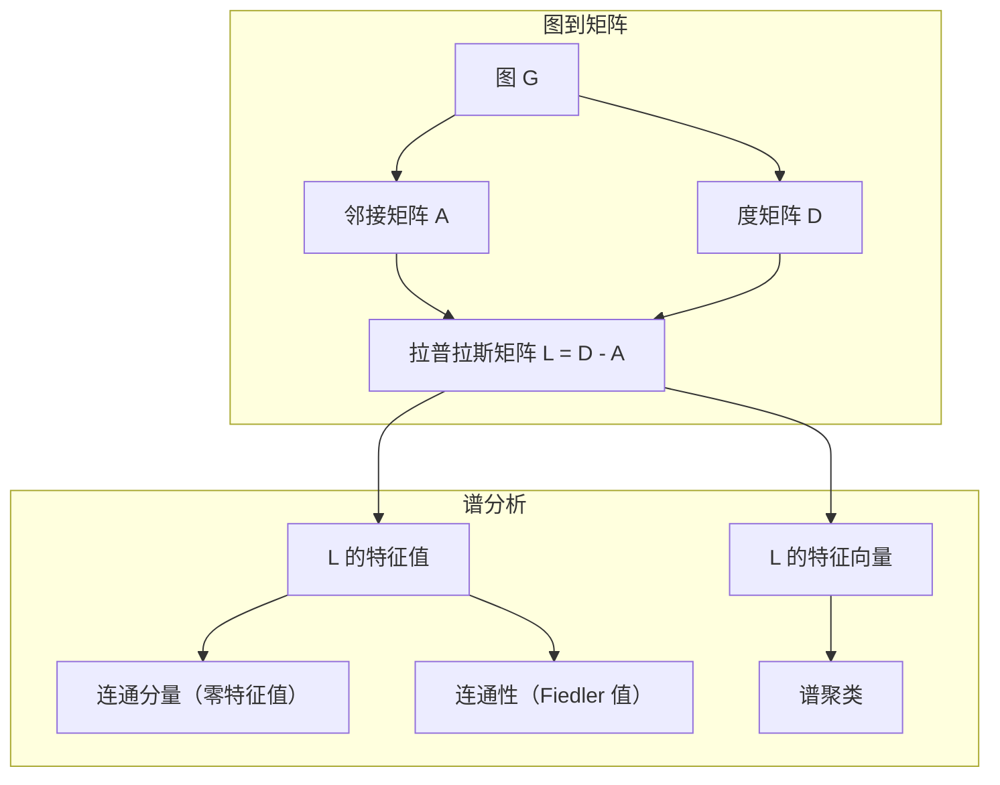
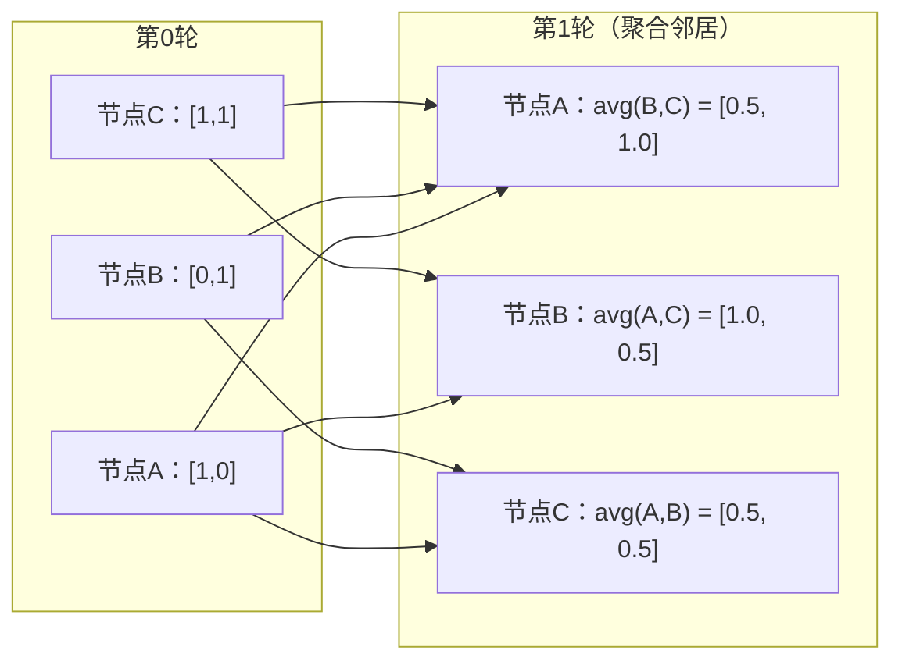

# 面向机器学习的图论

> 图是关系的数据结构。如果你的数据存在连接，就需要图论。

**类型：** 构建
**语言：** Python
**前置条件：** 第一阶段，第01-03课（线性代数、矩阵）
**时长：** 约90分钟

## 学习目标

- 构建图类，支持邻接矩阵/邻接表表示，并实现 BFS 和 DFS 遍历
- 计算图拉普拉斯矩阵，并利用其特征值检测连通分量和对节点聚类
- 将 GNN 风格的一轮消息传递实现为归一化邻接矩阵乘法
- 使用 Fiedler 向量进行谱聚类，对图进行划分

## 问题背景

社交网络、分子结构、知识库、引文网络、道路地图——这些都是图。传统机器学习将数据视为扁平表格：每行独立，每列是一个特征。但当连接的结构本身携带信息时，表格就无能为力了。

以社交网络为例：你想预测用户会购买什么产品，用户自身的购买历史固然重要，但其朋友的购买历史更重要——连接关系本身就是信号。

再看分子结构：你想预测某分子是否与蛋白质结合，原子本身重要，但真正决定性的是原子之间如何成键——结构本身就是数据。

图神经网络（GNN）是深度学习中增长最快的领域，驱动着药物发现、社交推荐、欺诈检测和知识图谱推理。每个 GNN 都建立在相同的基础上：基本图论。

你需要四样东西：
1. 将图表示为矩阵（以便进行矩阵乘法）的方法
2. 探索图结构的遍历算法
3. 拉普拉斯矩阵——谱图理论中最重要的矩阵
4. 消息传递——使 GNN 运作的核心操作

## 核心概念

### 图：节点与边

图 G = (V, E) 由顶点（节点）集合 V 和边集合 E 组成，每条边连接两个节点。

**有向图与无向图。** 在无向图中，边 (u, v) 意味着 u 与 v 相互连接。在有向图（digraph）中，边 (u, v) 意味着 u 指向 v，但不一定反方向成立。

**带权图与无权图。** 在无权图中，边只有存在与否之分。在带权图中，每条边有一个数值权重——距离、代价或强度。

| 图类型 | 示例 |
|-----------|---------|
| 无向无权图 | Facebook 好友网络 |
| 有向无权图 | Twitter 关注网络 |
| 无向带权图 | 道路地图（距离） |
| 有向带权图 | 网页链接（PageRank 分数） |

### 邻接矩阵（Adjacency Matrix）

邻接矩阵 A 是核心表示方式。对于含 n 个节点的图：

```
A[i][j] = 1    如果节点 i 到节点 j 之间有边
A[i][j] = 0    否则
```

无向图的邻接矩阵是对称的：A[i][j] = A[j][i]。带权图中，A[i][j] = 边 (i, j) 的权重。

**示例——三角形：**

```
节点：0, 1, 2
边：(0,1), (1,2), (0,2)

A = [[0, 1, 1],
     [1, 0, 1],
     [1, 1, 0]]
```

邻接矩阵是所有 GNN 的输入，对 A 的矩阵操作对应图上的操作。

### 度（Degree）

节点的度是与该节点相连的边的数量。有向图有入度（进入的边）和出度（离开的边）。

度矩阵 D 是对角矩阵：

```
D[i][i] = 节点 i 的度
D[i][j] = 0    当 i != j
```

对于三角形示例：D = diag(2, 2, 2)，因为每个节点都与另外两个节点相连。

度反映节点的重要性：高度数 = 枢纽节点。网络的度分布揭示其结构——社交网络遵循幂律分布（少量枢纽，大量叶节点），随机图的度服从泊松分布。

### BFS 与 DFS

两种基本图遍历算法，都很重要。

**广度优先搜索（BFS）：** 先探索所有邻居，再探索邻居的邻居。使用队列（FIFO）。

```
从节点 0 出发的 BFS：
  访问 0
  队列：[1, 2]        （0 的邻居）
  访问 1
  队列：[2, 3]        （加入 1 的邻居）
  访问 2
  队列：[3]           （2 的邻居已访问）
  访问 3
  队列：[]            （完成）
```

BFS 在无权图中找到最短路径。从起点到任意节点的距离等于该节点被首次发现时的 BFS 层数。这就是 BFS 用于社交网络中跳数距离的原因。

**深度优先搜索（DFS）：** 尽可能深入，再回溯。使用栈（LIFO）或递归。

```
从节点 0 出发的 DFS：
  访问 0
  栈：[1, 2]        （0 的邻居）
  访问 2               （从栈中弹出）
  栈：[1, 3]           （加入 2 的邻居）
  访问 3               （从栈中弹出）
  栈：[1]
  访问 1               （从栈中弹出）
  栈：[]               （完成）
```

DFS 适用于：
- 找连通分量（从未访问节点出发运行 DFS）
- 检测环（DFS 树中的后向边）
- 拓扑排序（DFS 完成顺序的逆序）

| 算法 | 数据结构 | 查找目标 | 应用场景 |
|-----------|---------------|-------|----------|
| BFS | 队列 | 最短路径 | 社交网络距离、知识图谱遍历 |
| DFS | 栈 | 连通分量、环 | 连通性检验、拓扑排序 |

### 图拉普拉斯矩阵（Graph Laplacian）

L = D - A。谱图理论中最重要的矩阵。

对于三角形：

```
D = [[2, 0, 0],    A = [[0, 1, 1],    L = [[2, -1, -1],
     [0, 2, 0],         [1, 0, 1],         [-1, 2, -1],
     [0, 0, 2]]         [1, 1, 0]]         [-1, -1,  2]]
```

拉普拉斯矩阵具有显著性质：

1. **L 是半正定的。** 所有特征值 >= 0。

2. **零特征值的数量等于连通分量的数量。** 连通图恰好有一个零特征值；有 3 个不连通分量的图有三个零特征值。

3. **最小非零特征值（Fiedler 值）衡量图的连通性。** Fiedler 值大说明图连通性好；Fiedler 值小说明图有薄弱点——瓶颈。

4. **Fiedler 值对应的特征向量（Fiedler 向量）揭示最优划分。** 取值为正的节点分为一组，取值为负的节点分为另一组。这就是谱聚类。



### 谱性质

邻接矩阵和拉普拉斯矩阵的特征值在无需任何遍历的情况下就能揭示图的结构性质。

**谱聚类**流程如下：
1. 计算拉普拉斯矩阵 L
2. 找到 L 的 k 个最小特征向量（跳过第一个——连通图的全一向量）
3. 将这些特征向量作为每个节点的新坐标
4. 在这些坐标上运行 k-means

为什么有效？L 的特征向量编码了图上"最平滑"的函数：连通性好的节点具有相似的特征向量值，被瓶颈隔开的节点具有不同的值。特征向量自然地分离聚类。

**随机游走的联系。** 归一化拉普拉斯矩阵与图上的随机游走相关。随机游走的平稳分布与节点度成比例，混合时间（游走收敛所需的速度）取决于谱间隙。

### 消息传递（Message Passing）

图神经网络的核心操作：每个节点从邻居收集消息、聚合信息，并更新自身状态。

```
h_v^(k+1) = UPDATE(h_v^(k), AGGREGATE({h_u^(k) : u 是 v 的邻居}))
```

最简形式中，AGGREGATE = 均值，UPDATE = 线性变换 + 激活函数：

```
h_v^(k+1) = sigma(W * mean({h_u^(k) : u 是 v 的邻居}))
```

这本质上是矩阵乘法。设 H 是所有节点特征矩阵，A 是邻接矩阵：

```
H^(k+1) = sigma(A_norm * H^(k) * W)
```

其中 A_norm 是归一化邻接矩阵（每行之和为 1）。

一轮消息传递让每个节点"看到"其直接邻居，两轮让它看到邻居的邻居，K 轮让每个节点获得来自 K 跳邻域的信息。



### 概念与机器学习应用

| 概念 | 机器学习应用 |
|---------|---------------|
| 邻接矩阵（Adjacency matrix） | GNN 输入表示 |
| 图拉普拉斯（Graph Laplacian） | 谱聚类、社区检测 |
| BFS/DFS | 知识图谱遍历、路径查找 |
| 度分布（Degree distribution） | 节点重要性、特征工程 |
| 消息传递（Message passing） | GNN 层（GCN、GAT、GraphSAGE） |
| L 的特征值 | 社区检测、图划分 |
| 谱聚类（Spectral clustering） | 节点无监督分组 |
| PageRank | 节点重要性排名、网络搜索 |

## 动手实现

### 步骤一：从零构建图类

```python
class Graph:
    def __init__(self, n_nodes, directed=False):
        self.n = n_nodes
        self.directed = directed
        self.adj = {i: {} for i in range(n_nodes)}

    def add_edge(self, u, v, weight=1.0):
        self.adj[u][v] = weight
        if not self.directed:
            self.adj[v][u] = weight

    def neighbors(self, node):
        return list(self.adj[node].keys())

    def degree(self, node):
        return len(self.adj[node])

    def adjacency_matrix(self):
        import numpy as np
        A = np.zeros((self.n, self.n))
        for u in range(self.n):
            for v, w in self.adj[u].items():
                A[u][v] = w
        return A

    def degree_matrix(self):
        import numpy as np
        D = np.zeros((self.n, self.n))
        for i in range(self.n):
            D[i][i] = self.degree(i)
        return D

    def laplacian(self):
        return self.degree_matrix() - self.adjacency_matrix()
```

邻接表（`self.adj`）高效存储邻居关系。邻接矩阵转换使用 numpy，因为所有谱运算都需要它。

### 步骤二：BFS 与 DFS

```python
from collections import deque

def bfs(graph, start):
    visited = set()
    order = []
    distances = {}
    queue = deque([(start, 0)])
    visited.add(start)
    while queue:
        node, dist = queue.popleft()
        order.append(node)
        distances[node] = dist
        for neighbor in graph.neighbors(node):
            if neighbor not in visited:
                visited.add(neighbor)
                queue.append((neighbor, dist + 1))
    return order, distances


def dfs(graph, start):
    visited = set()
    order = []
    stack = [start]
    while stack:
        node = stack.pop()
        if node in visited:
            continue
        visited.add(node)
        order.append(node)
        for neighbor in reversed(graph.neighbors(node)):
            if neighbor not in visited:
                stack.append(neighbor)
    return order
```

BFS 使用双端队列（deque）以实现 O(1) 的 popleft；DFS 使用列表作为栈。两者都恰好访问每个节点一次——时间复杂度 O(V + E)。

### 步骤三：连通分量与拉普拉斯特征值

```python
def connected_components(graph):
    visited = set()
    components = []
    for node in range(graph.n):
        if node not in visited:
            order, _ = bfs(graph, node)
            visited.update(order)
            components.append(order)
    return components


def laplacian_eigenvalues(graph):
    import numpy as np
    L = graph.laplacian()
    eigenvalues = np.linalg.eigvalsh(L)
    return eigenvalues
```

`eigvalsh` 用于对称矩阵——无向图的拉普拉斯矩阵始终对称。它按升序返回特征值。统计零的数量即可找到连通分量数目。

### 步骤四：谱聚类

```python
def spectral_clustering(graph, k=2):
    import numpy as np
    L = graph.laplacian()
    eigenvalues, eigenvectors = np.linalg.eigh(L)
    features = eigenvectors[:, 1:k+1]

    labels = np.zeros(graph.n, dtype=int)
    for i in range(graph.n):
        if features[i, 0] >= 0:
            labels[i] = 0
        else:
            labels[i] = 1
    return labels
```

对 k=2，Fiedler 向量的符号将图分为两个簇。对 k>2，在前 k 个特征向量（排除全一的平凡特征向量）上运行 k-means。

### 步骤五：消息传递

```python
def message_passing(graph, features, weight_matrix):
    import numpy as np
    A = graph.adjacency_matrix()
    row_sums = A.sum(axis=1, keepdims=True)
    row_sums[row_sums == 0] = 1
    A_norm = A / row_sums
    aggregated = A_norm @ features
    output = aggregated @ weight_matrix
    return output
```

这是一轮 GNN 消息传递：每个节点的新特征是其邻居特征的加权平均值，经权重矩阵变换后输出。叠加多轮可进一步传播信息。

## 实际应用

使用 networkx 和 numpy，同样的操作只需一行代码：

```python
import networkx as nx
import numpy as np

G = nx.karate_club_graph()

A = nx.adjacency_matrix(G).toarray()
L = nx.laplacian_matrix(G).toarray()

eigenvalues = np.linalg.eigvalsh(L.astype(float))
print(f"Smallest eigenvalues: {eigenvalues[:5]}")
print(f"Connected components: {nx.number_connected_components(G)}")

communities = nx.community.greedy_modularity_communities(G)
print(f"Communities found: {len(communities)}")

pr = nx.pagerank(G)
top_nodes = sorted(pr.items(), key=lambda x: x[1], reverse=True)[:5]
print(f"Top 5 PageRank nodes: {top_nodes}")
```

networkx 使用优化的 C 后端处理任意规模的图，生产环境中使用它；使用从零实现的版本来理解其原理。

### numpy 谱分析

```python
import numpy as np

A = np.array([
    [0, 1, 1, 0, 0],
    [1, 0, 1, 0, 0],
    [1, 1, 0, 1, 0],
    [0, 0, 1, 0, 1],
    [0, 0, 0, 1, 0]
])

D = np.diag(A.sum(axis=1))
L = D - A

eigenvalues, eigenvectors = np.linalg.eigh(L)
print(f"Eigenvalues: {np.round(eigenvalues, 4)}")
print(f"Fiedler value: {eigenvalues[1]:.4f}")
print(f"Fiedler vector: {np.round(eigenvectors[:, 1], 4)}")

fiedler = eigenvectors[:, 1]
group_a = np.where(fiedler >= 0)[0]
group_b = np.where(fiedler < 0)[0]
print(f"Cluster A: {group_a}")
print(f"Cluster B: {group_b}")
```

Fiedler 向量完成了繁重的工作：正值属于一个簇，负值属于另一个簇。无需迭代优化——只需一次特征分解。

## 发布

本课产出：
- `outputs/skill-graph-analysis.md` — 分析图结构数据的技能参考

## 知识联系

| 概念 | 应用场景 |
|---------|------------------|
| 邻接矩阵（Adjacency matrix） | GCN、GAT、GraphSAGE 输入 |
| 拉普拉斯矩阵（Laplacian） | 谱聚类、ChebNet 滤波器 |
| BFS | 知识图谱遍历、最短路径查询 |
| 消息传递（Message passing） | 每个 GNN 层、神经消息传递 |
| 谱间隙（Spectral gap） | 图连通性、随机游走混合时间 |
| 度分布（Degree distribution） | 幂律网络、节点特征工程 |
| 连通分量（Connected components） | 预处理、处理不连通图 |
| PageRank | 节点重要性排名、注意力初始化 |

GNN 值得特别说明。GCN（Kipf & Welling, 2017）中的图卷积操作使用添加了自环的邻接矩阵 A_hat = A + I：

```text
H^(l+1) = sigma(D_hat^(-1/2) * A_hat * D_hat^(-1/2) * H^(l) * W^(l))
```

其中 A_hat = A + I（邻接矩阵加自环），D_hat 是 A_hat 的度矩阵。自环确保每个节点在聚合时包含自身特征。这正是带对称归一化的消息传递。D_hat^(-1/2) * A_hat * D_hat^(-1/2) 是归一化邻接矩阵，这种归一化与对称归一化拉普拉斯 L_sym = I - D^(-1/2) * A * D^(-1/2) 相关。理解拉普拉斯矩阵意味着理解 GCN 为何有效。

## 练习

1. **从零实现 PageRank。** 从均匀分数出发，每步：score(v) = (1-d)/n + d * sum(score(u)/out_degree(u))，对所有指向 v 的 u 求和。使用 d=0.85，运行至收敛（变化量 < 1e-6），在小型网页图上测试。

2. **用谱聚类发现社区。** 创建一个有两个明显分离簇的图（如两个团通过单条边相连），运行谱聚类并验证找到正确的划分。增加更多跨簇边时会发生什么？

3. **实现 Dijkstra 算法**求带权图的最短路径，与相同图上使用均匀权重的 BFS 结果进行对比。

4. **构建两层消息传递网络。** 用不同的权重矩阵连续应用消息传递两次，证明经过 2 轮后，每个节点拥有来自其 2 跳邻域的信息。

5. **分析真实图。** 使用空手道俱乐部图（34 个节点，78 条边），计算度分布、拉普拉斯特征值和谱聚类结果，与已知的真实划分进行比较。

## 关键术语

| 术语 | 通俗说法 | 实际含义 |
|------|----------------|----------------------|
| 图（Graph） | "节点和边" | 编码成对关系的数学结构 G=(V,E) |
| 邻接矩阵（Adjacency matrix） | "连接表" | n×n 矩阵，A[i][j]=1 当节点 i 和 j 相连 |
| 度（Degree） | "节点的连接程度" | 与节点相连的边的数量 |
| 拉普拉斯矩阵（Laplacian） | "D 减 A" | L = D - A，其特征值揭示图的结构 |
| Fiedler 值（Fiedler value） | "代数连通度" | L 的最小非零特征值，衡量图的连通程度 |
| BFS（广度优先搜索） | "逐层搜索" | 先访问所有邻居再深入的遍历，找最短路径 |
| DFS（深度优先搜索） | "先深后回" | 沿一条路走到底再回溯的遍历 |
| 消息传递（Message passing） | "节点与邻居通信" | 每个节点聚合邻居信息，GNN 的核心 |
| 谱聚类（Spectral clustering） | "用特征向量聚类" | 使用拉普拉斯矩阵特征向量对图进行划分 |
| 连通分量（Connected component） | "独立的一块" | 最大子图，其中每个节点都能到达其他每个节点 |

## 延伸阅读

- **Kipf & Welling (2017)** — "Semi-Supervised Classification with Graph Convolutional Networks"，开启现代 GNN 时代的论文，证明谱图卷积可简化为消息传递
- **Spielman (2012)** — "Spectral Graph Theory" 讲义，关于拉普拉斯矩阵、谱间隙和图划分的权威入门
- **Hamilton (2020)** — "Graph Representation Learning"，从基础到应用全面覆盖 GNN 的教材
- **Bronstein et al. (2021)** — "Geometric Deep Learning: Grids, Groups, Graphs, Geodesics, and Gauges"，统一框架论文
- **Veličković et al. (2018)** — "Graph Attention Networks"，引入注意力机制扩展消息传递
