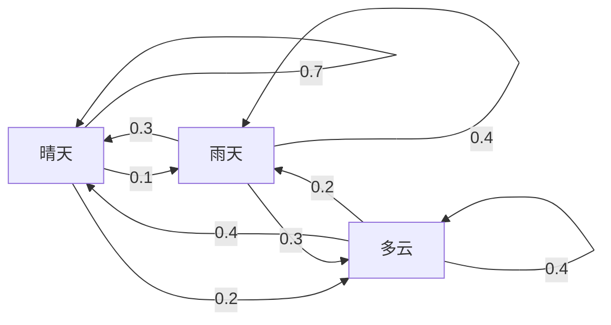
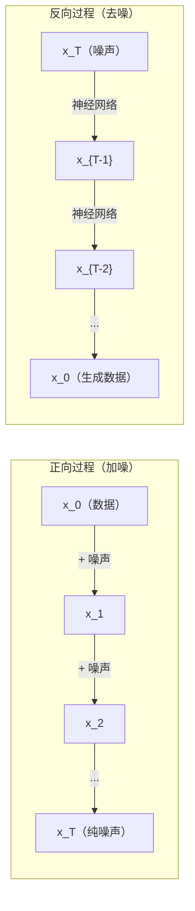

# 随机过程

> 带有结构的随机性。随机游走、马尔可夫链和扩散模型背后的数学。

**类型：** 学习
**语言：** Python
**前置条件：** 第一阶段，第06-07课（概率论、贝叶斯定理）
**时长：** 约75分钟

## 学习目标

- 模拟一维和二维随机游走，并验证位移的 sqrt(n) 缩放规律
- 构建马尔可夫链模拟器，通过特征分解计算其平稳分布
- 实现 Metropolis-Hastings MCMC 和 Langevin 动力学，从目标分布中采样
- 将扩散过程的正向过程与布朗运动相联系，并解释反向过程如何生成数据

## 问题背景

许多 AI 系统涉及随时间演化的随机性——不是静态随机，而是结构化的序列随机，每步依赖于之前发生的事情。

语言模型逐个生成 token：给定当前上下文，模型输出下一个 token 的概率分布，从中采样，然后继续。这就是一个随机过程。

扩散模型逐步向图像添加噪声，直到变为纯噪声；然后逆向逐步去噪，生成新图像。正向过程是马尔可夫链，反向过程是由神经网络学习的反向马尔可夫链。

强化学习智能体在环境中采取行动，每个行动以一定概率导致新状态，智能体在随机世界中遵循随机策略——整个系统是马尔可夫决策过程。

MCMC 采样——贝叶斯推断的基石——构造一个平稳分布为所需后验分布的马尔可夫链。

所有这些都建立在四个基础概念上：
1. 随机游走——最简单的随机过程
2. 马尔可夫链——带有转移矩阵的结构化随机性
3. Langevin 动力学——带噪声的梯度下降
4. Metropolis-Hastings——从任意分布采样

## 核心概念

### 随机游走（Random Walks）

从位置 0 出发，每步抛一枚公平硬币：正面向右移动（+1），反面向左移动（-1）。

n 步后，位置是 n 个随机 +/-1 值的和。期望位置为 0（游走无偏）。但距原点的期望距离以 sqrt(n) 增长。

这有些违反直觉：游走是公平的，没有任何方向的漂移，但随着时间推移，它越走越远。n 步后的标准差为 sqrt(n)。

```
第0步：  位置 = 0
第1步：  位置 = +1 或 -1
第2步：  位置 = +2, 0, 或 -2
...
第100步：距原点期望距离 ~ 10（sqrt(100)）
第10000步：距原点期望距离 ~ 100（sqrt(10000)）
```

**二维情形**：以等概率向上、下、左、右移动。到原点的距离同样遵循 sqrt(n) 缩放规律，路径呈分形状。

**为什么是 sqrt(n)？** 每步为 +1 或 -1，概率各半。n 步后位置 S_n = X_1 + X_2 + ... + X_n，每个 X_i 为 +/-1。每步方差为 1，步骤相互独立，故 Var(S_n) = n，标准差 = sqrt(n)。由中心极限定理，S_n / sqrt(n) 收敛于标准正态分布。

这一 sqrt(n) 缩放在机器学习中随处可见：SGD 噪声以 1/sqrt(batch_size) 缩放，嵌入维度以 sqrt(d) 缩放。平方根是独立随机相加的标志。

**与布朗运动的联系。** 取步长为 1/sqrt(n)、每单位时间走 n 步的随机游走，当 n 趋于无穷时，游走收敛为布朗运动 B(t)——一个连续时间过程，其中 B(t) 服从均值为 0、方差为 t 的正态分布。

布朗运动是扩散的数学基础，模拟流体中粒子的随机抖动、股价波动，以及扩散模型中的噪声过程。

**赌徒破产问题（Gambler's ruin）。** 从位置 k 出发的随机游走，在 0 和 N 处有吸收壁。到达 N 之前先到达 0 的概率是多少？对于公平游走：P(到达N) = k/N。这简洁而优雅，与鞅（martingale）理论相关——公平随机游走是鞅（未来期望值 = 当前值）。

### 马尔可夫链（Markov Chains）

马尔可夫链是根据固定概率在状态间转移的系统，核心性质：下一状态只取决于当前状态，与历史无关。

```
P(X_{t+1} = j | X_t = i, X_{t-1} = ...) = P(X_{t+1} = j | X_t = i)
```

这是马尔可夫性质。它意味着可以用转移矩阵 P 描述全部动态：

```
P[i][j] = 从状态 i 转移到状态 j 的概率
```

P 的每一行之和为 1（必须转移到某个状态）。

**示例——天气：**

```
状态：晴天(0)、雨天(1)、多云(2)

P = [[0.7, 0.1, 0.2],    （晴天：70%晴、10%雨、20%云）
     [0.3, 0.4, 0.3],    （雨天：30%晴、40%雨、30%云）
     [0.4, 0.2, 0.4]]    （多云：40%晴、20%雨、40%云）
```

从任意状态出发，经过多次转移后，状态分布收敛到平稳分布 π，满足 π * P = π。这是 P 的特征值为 1 的左特征向量。

对于天气链，平稳分布约为 [0.53, 0.18, 0.29]——无论从哪个状态出发，长期来看晴天占 53%。



**计算平稳分布的两种方法：**

1. **幂方法（Power method）**：将任意初始分布反复乘以 P，迭代足够多次后收敛。
2. **特征值方法**：找 P 的特征值为 1 的左特征向量，即 P^T 特征值为 1 的右特征向量。

**收敛条件。** 马尔可夫链收敛到唯一平稳分布需要满足：
- **不可约性（Irreducible）**：每个状态都可以从其他任意状态到达
- **非周期性（Aperiodic）**：链不以固定周期循环

机器学习中遇到的大多数链都满足这两个条件。

**吸收态（Absorbing states）。** 进入后永不离开的状态（P[i][i] = 1）。吸收马尔可夫链建模带有终态的过程——结束的游戏、流失的客户、到达结束 token 的序列。

**混合时间（Mixing time）。** 链"接近"平稳分布所需的步数——即与平稳分布的全变差距离降到某阈值以下所需步数。快速混合 = 步数少。P 的谱间隙（1 减去第二大特征值）控制混合时间，间隙越大混合越快。

### 与语言模型的关系

语言模型中的 token 生成近似为马尔可夫过程：给定当前上下文，模型输出下一个 token 的分布。温度控制分布的锐利程度：

```
P(token_i) = exp(logit_i / temperature) / sum(exp(logit_j / temperature))
```

- temperature = 1.0：标准分布
- temperature < 1.0：更锐利（更确定性）
- temperature > 1.0：更平坦（更随机）
- temperature -> 0：argmax（贪心）

Top-k 采样截断到概率最高的 k 个 token；Top-p（核采样）截断到累积概率超过 p 的最小 token 集合。两者都在修改马尔可夫转移概率。

### 布朗运动（Brownian Motion）

随机游走的连续时间极限。位置 B(t) 有三个性质：
1. B(0) = 0
2. B(t) - B(s) 服从均值为 0、方差为 t - s 的正态分布（t > s 时）
3. 不重叠区间上的增量相互独立

布朗运动是连续的但处处不可微——在每个尺度上都抖动。路径在平面上的分形维数为 2。

离散模拟中，通过以下方式近似布朗运动：

```
B(t + dt) = B(t) + sqrt(dt) * z,    其中 z ~ N(0, 1)
```

sqrt(dt) 的缩放来自应用于随机游走的中心极限定理，非常重要。

### Langevin 动力学（Langevin Dynamics）

梯度下降找函数的极小值；Langevin 动力学找与 exp(-U(x)/T) 成比例的概率分布，其中 U 是能量函数，T 是温度。

```
x_{t+1} = x_t - dt * gradient(U(x_t)) + sqrt(2 * T * dt) * z_t
```

两种力作用于粒子：
1. **梯度力**（-dt * gradient(U)）：推向低能量区域（类似梯度下降）
2. **随机力**（sqrt(2*T*dt) * z）：向随机方向推（探索）

T = 0 时是纯梯度下降；高温时近似随机游走；在适当温度下，粒子探索能量曲面，在低能量区域停留更多时间。

**与扩散模型的联系。** 扩散模型的正向过程为：

```
x_t = sqrt(alpha_t) * x_{t-1} + sqrt(1 - alpha_t) * noise
```

这是一个将数据逐步与噪声混合的马尔可夫链。经过足够多步后，x_T 是纯高斯噪声。

反向过程——从噪声回到数据——也是一个马尔可夫链，但其转移概率由神经网络学习。网络学会预测每步添加的噪声，然后减去它。



### MCMC：马尔可夫链蒙特卡洛

有时需要从分布 p(x) 中采样——你可以（在差一个常数的意义下）计算 p(x)，但无法直接从中采样。贝叶斯后验是经典例子：你知道似然乘以先验，但归一化常数难以处理。

**Metropolis-Hastings** 构造平稳分布为 p(x) 的马尔可夫链：

1. 从某个位置 x 出发
2. 从提议分布 Q(x'|x) 提议新位置 x'
3. 计算接受率：a = p(x') * Q(x|x') / (p(x) * Q(x'|x))
4. 以 min(1, a) 的概率接受 x'，否则留在 x
5. 重复

若 Q 对称（如 Q(x'|x) = Q(x|x') = N(x, sigma^2)），比值简化为 a = p(x') / p(x)，只需要概率之比——归一化常数相消。

在温和条件下，链保证收敛到 p(x)。但若提议步长太小（随机游走）或太大（高拒绝率），收敛可能很慢。调优提议分布是 MCMC 的技巧所在。

**为什么有效。** 接受率保证细致平衡（detailed balance）：处于 x 并移动到 x' 的概率，等于处于 x' 并移动到 x 的概率。细致平衡意味着 p(x) 是链的平稳分布，因此经过足够多步后，样本来自 p(x)。

**实践注意事项：**
- **燃烧期（Burn-in）**：丢弃前 N 个样本，链需要从起始点到达平稳分布的时间
- **稀疏化（Thinning）**：每隔 k 个样本保留一个，以降低自相关
- **多链（Multiple chains）**：从不同起始点运行多条链，若收敛到相同分布，说明已收敛
- **接受率（Acceptance rate）**：对 d 维高斯提议，最优接受率约为 23%（Roberts & Rosenthal, 2001）。太高意味着链几乎不移动；太低意味着几乎全部拒绝

### 随机过程在 AI 中的应用

| 随机过程 | AI 应用 |
|---------|---------------|
| 随机游走（Random walk） | 强化学习中的探索、Node2Vec 嵌入 |
| 马尔可夫链（Markov chain） | 文本生成、MCMC 采样 |
| 布朗运动（Brownian motion） | 扩散模型的正向过程 |
| Langevin 动力学 | 基于分数的生成模型、SGLD |
| 马尔可夫决策过程（MDP） | 强化学习 |
| Metropolis-Hastings | 贝叶斯推断、后验采样 |

## 动手实现

### 步骤一：随机游走模拟器

```python
import numpy as np

def random_walk_1d(n_steps, seed=None):
    rng = np.random.RandomState(seed)
    steps = rng.choice([-1, 1], size=n_steps)
    positions = np.concatenate([[0], np.cumsum(steps)])
    return positions


def random_walk_2d(n_steps, seed=None):
    rng = np.random.RandomState(seed)
    directions = rng.choice(4, size=n_steps)
    dx = np.zeros(n_steps)
    dy = np.zeros(n_steps)
    dx[directions == 0] = 1   # right
    dx[directions == 1] = -1  # left
    dy[directions == 2] = 1   # up
    dy[directions == 3] = -1  # down
    x = np.concatenate([[0], np.cumsum(dx)])
    y = np.concatenate([[0], np.cumsum(dy)])
    return x, y
```

一维游走存储累积和：每步 +1 或 -1，n 步后位置是这些值的和。方差以 n 线性增长，标准差以 sqrt(n) 增长。

### 步骤二：马尔可夫链

```python
class MarkovChain:
    def __init__(self, transition_matrix, state_names=None):
        self.P = np.array(transition_matrix, dtype=float)
        self.n_states = len(self.P)
        self.state_names = state_names or [str(i) for i in range(self.n_states)]

    def step(self, current_state, rng=None):
        if rng is None:
            rng = np.random.RandomState()
        probs = self.P[current_state]
        return rng.choice(self.n_states, p=probs)

    def simulate(self, start_state, n_steps, seed=None):
        rng = np.random.RandomState(seed)
        states = [start_state]
        current = start_state
        for _ in range(n_steps):
            current = self.step(current, rng)
            states.append(current)
        return states

    def stationary_distribution(self):
        eigenvalues, eigenvectors = np.linalg.eig(self.P.T)
        idx = np.argmin(np.abs(eigenvalues - 1.0))
        stationary = np.real(eigenvectors[:, idx])
        stationary = stationary / stationary.sum()
        return np.abs(stationary)
```

平稳分布是 P 的特征值为 1 的左特征向量。通过计算 P^T 的特征向量（转置将左特征向量变为右特征向量）来求得。

### 步骤三：Langevin 动力学

```python
def langevin_dynamics(grad_U, x0, dt, temperature, n_steps, seed=None):
    rng = np.random.RandomState(seed)
    x = np.array(x0, dtype=float)
    trajectory = [x.copy()]
    for _ in range(n_steps):
        noise = rng.randn(*x.shape)
        x = x - dt * grad_U(x) + np.sqrt(2 * temperature * dt) * noise
        trajectory.append(x.copy())
    return np.array(trajectory)
```

梯度将 x 推向低能量区域，噪声防止它陷入局部极小值。在平衡态，样本分布与 exp(-U(x)/temperature) 成比例。

### 步骤四：Metropolis-Hastings

```python
def metropolis_hastings(target_log_prob, proposal_std, x0, n_samples, seed=None):
    rng = np.random.RandomState(seed)
    x = np.array(x0, dtype=float)
    samples = [x.copy()]
    accepted = 0
    for _ in range(n_samples - 1):
        x_proposed = x + rng.randn(*x.shape) * proposal_std
        log_ratio = target_log_prob(x_proposed) - target_log_prob(x)
        if np.log(rng.rand()) < log_ratio:
            x = x_proposed
            accepted += 1
        samples.append(x.copy())
    acceptance_rate = accepted / (n_samples - 1)
    return np.array(samples), acceptance_rate
```

算法提议一个新点，检查其概率是否更高（或以与比值成比例的概率接受），然后重复。良好混合的接受率应在 23-50% 之间。

## 实际应用

实际中使用成熟库来运行这些算法，但理解其机制对于调试和调优至关重要。

```python
import numpy as np

rng = np.random.RandomState(42)
walk = np.cumsum(rng.choice([-1, 1], size=10000))
print(f"Final position: {walk[-1]}")
print(f"Expected distance: {np.sqrt(10000):.1f}")
print(f"Actual distance: {abs(walk[-1])}")
```

### numpy 处理转移矩阵

```python
import numpy as np

P = np.array([[0.7, 0.1, 0.2],
              [0.3, 0.4, 0.3],
              [0.4, 0.2, 0.4]])

distribution = np.array([1.0, 0.0, 0.0])
for _ in range(100):
    distribution = distribution @ P

print(f"Stationary distribution: {np.round(distribution, 4)}")
```

将初始分布反复乘以 P，迭代足够多次后，无论从哪里开始都收敛到平稳分布。这是求主左特征向量的幂方法。

### 与实际框架的连接

- **PyTorch 扩散**：Hugging Face `diffusers` 库中的 `DDPMScheduler` 实现了正向和反向马尔可夫链
- **NumPyro / PyMC**：使用 MCMC（NUTS 采样器，是 Metropolis-Hastings 的改进版）进行贝叶斯推断
- **Gymnasium（RL）**：环境的 step 函数定义了马尔可夫决策过程

### 验证马尔可夫链收敛

```python
import numpy as np

P = np.array([[0.9, 0.1], [0.3, 0.7]])

eigenvalues = np.linalg.eigvals(P)
spectral_gap = 1 - sorted(np.abs(eigenvalues))[-2]
print(f"Eigenvalues: {eigenvalues}")
print(f"Spectral gap: {spectral_gap:.4f}")
print(f"Approximate mixing time: {1/spectral_gap:.1f} steps")
```

谱间隙告诉你链忘记初始状态的速度：间隙为 0.2 意味着约 5 步混合，间隙为 0.01 意味着约 100 步。运行长时间模拟前务必检查——混合缓慢的链会浪费算力。

## 发布

本课产出：
- `outputs/prompt-stochastic-process-advisor.md` — 帮助识别哪种随机过程框架适用于给定问题的提示词

## 知识联系

| 概念 | 应用场景 |
|---------|------------------|
| 随机游走（Random walk） | Node2Vec 图嵌入、强化学习中的探索 |
| 马尔可夫链（Markov chain） | LLM 中的 token 生成、MCMC 采样 |
| 布朗运动（Brownian motion） | DDPM 的正向扩散过程、SDE 模型 |
| Langevin 动力学 | 基于分数的生成模型、随机梯度 Langevin 动力学（SGLD） |
| 平稳分布（Stationary distribution） | MCMC 收敛目标、PageRank |
| Metropolis-Hastings | 贝叶斯后验采样、模拟退火 |
| 温度（Temperature） | LLM 采样、RL 中的 Boltzmann 探索、模拟退火 |
| 混合时间（Mixing time） | MCMC 收敛速度、谱间隙分析 |
| 吸收态（Absorbing state） | 序列结束 token、RL 中的终止状态 |
| 细致平衡（Detailed balance） | MCMC 采样器的正确性保证 |

扩散模型值得特别关注。DDPM（Ho et al., 2020）定义正向马尔可夫链：

```
q(x_t | x_{t-1}) = N(x_t; sqrt(1-beta_t) * x_{t-1}, beta_t * I)
```

其中 beta_t 是噪声调度表。经过 T 步后，x_T 近似为 N(0, I)。反向过程由神经网络参数化，预测噪声：

```
p_theta(x_{t-1} | x_t) = N(x_{t-1}; mu_theta(x_t, t), sigma_t^2 * I)
```

生成的每一步都是学到的马尔可夫链中的一步。理解马尔可夫链意味着理解扩散模型如何以及为何能生成数据。

SGLD（随机梯度 Langevin 动力学）将小批量梯度下降与 Langevin 噪声结合：使用随机梯度估计代替全梯度，并添加校准过的噪声。随着学习率衰减，SGLD 从优化过渡到采样——你能免费获得近似贝叶斯后验样本。这是从神经网络获取不确定性估计的最简方法之一。

这些联系中的核心洞察：随机过程不只是理论工具，它们是现代 AI 系统内部的计算机制。调节 LLM 的温度，就是在调整马尔可夫链；训练扩散模型，就是在学习逆转类布朗运动的过程；运行贝叶斯推断，就是在构造收敛到后验分布的链。

## 练习

1. **模拟 1000 条各 10000 步的随机游走。** 绘制最终位置的分布，验证它近似服从均值为 0、标准差为 sqrt(10000) = 100 的高斯分布。

2. **用马尔可夫链构建文本生成器。** 在小型语料库上训练：统计每个词到下一个词的转移次数，构建转移矩阵，从链中采样生成新句子。

3. **用 Metropolis-Hastings 实现模拟退火。** 从高温（接受几乎所有提议）开始，逐渐降温（只接受改进）。用它找到一个多局部极小值函数的全局最小值。

4. **在不同温度下比较 Langevin 动力学。** 从双阱势 U(x) = (x^2 - 1)^2 中采样。低温时样本集中在一个势阱；高温时分布在两个势阱。找到链在两个势阱间混合的临界温度。

5. **实现正向扩散过程。** 从一维信号（如正弦波）出发，按线性噪声调度在 100 步内逐步添加噪声，展示信号如何退化为纯噪声。然后实现一个简单的去噪器来逆转该过程（即使是估计并减去噪声的简单实现也可以）。

## 关键术语

| 术语 | 通俗说法 | 实际含义 |
|------|----------------|----------------------|
| 随机游走（Random walk） | "抛硬币运动" | 每步位置随机增减的过程 |
| 马尔可夫性质（Markov property） | "无记忆性" | 未来只取决于当前状态，与历史无关 |
| 转移矩阵（Transition matrix） | "概率表" | P[i][j] = 从状态 i 移动到状态 j 的概率 |
| 平稳分布（Stationary distribution） | "长期平均" | 满足 π*P = π 的分布——链的均衡状态 |
| 布朗运动（Brownian motion） | "随机抖动" | 随机游走的连续时间极限，B(t) ~ N(0, t) |
| Langevin 动力学（Langevin dynamics） | "带噪声的梯度下降" | 结合确定性梯度和随机扰动的更新规则 |
| MCMC | "向目标走去" | 构造平稳分布为目标分布的马尔可夫链 |
| Metropolis-Hastings | "提议并接受/拒绝" | 利用接受率保证收敛的 MCMC 算法 |
| 温度（Temperature） | "随机性旋钮" | 控制探索与利用权衡的参数 |
| 扩散过程（Diffusion process） | "噪声进，噪声出" | 正向：逐步加噪；反向：逐步去噪，生成数据 |

## 延伸阅读

- **Ho, Jain, Abbeel (2020)** — "Denoising Diffusion Probabilistic Models"，引发扩散模型革命的 DDPM 论文，清晰推导了正向和反向马尔可夫链
- **Song & Ermon (2019)** — "Generative Modeling by Estimating Gradients of the Data Distribution"，使用 Langevin 动力学采样的基于分数的方法
- **Roberts & Rosenthal (2004)** — "General state space Markov chains and MCMC algorithms"，MCMC 何时以及为何有效的理论基础
- **Norris (1997)** — "Markov Chains"，标准教材，涵盖收敛性、平稳分布和命中时间
- **Welling & Teh (2011)** — "Bayesian Learning via Stochastic Gradient Langevin Dynamics"，结合 SGD 与 Langevin 动力学实现可扩展贝叶斯推断
