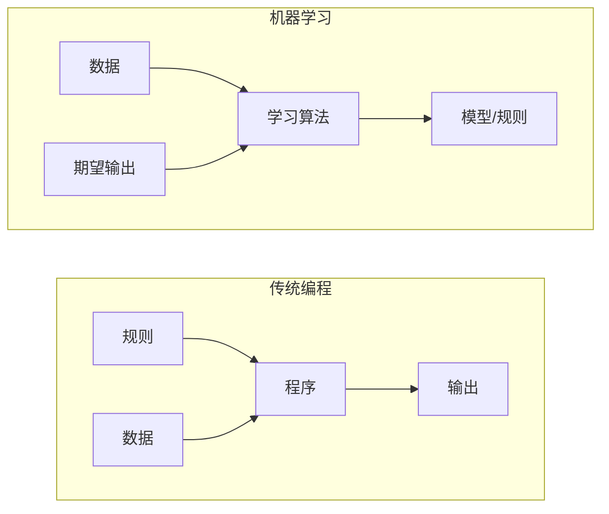
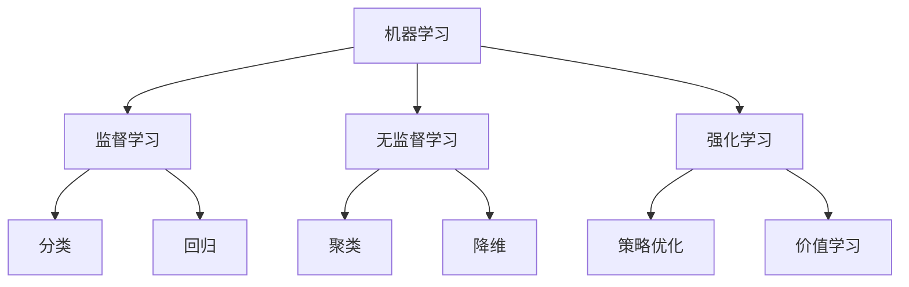
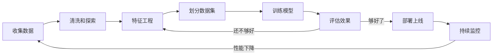
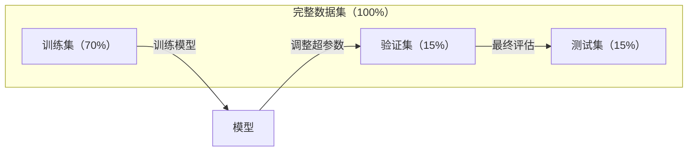
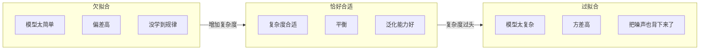
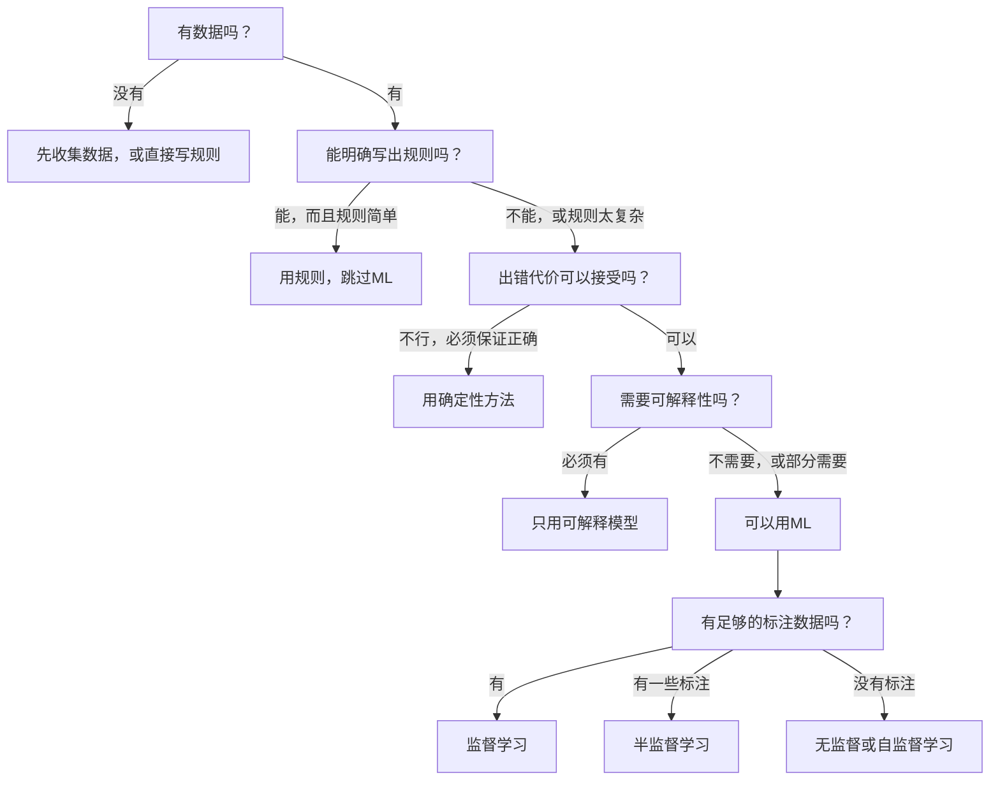

# 机器学习到底是什么

> 机器学习就是让计算机自己从数据里找规律，而不是由你手写一堆规则告诉它该怎么做。

**类型：** 学习
**语言：** Python
**前置条件：** 第一阶段（数学基础）
**时长：** 约45分钟

## 学习目标

- 说清楚监督学习、无监督学习和强化学习的区别，拿到一个问题能判断该用哪种
- 从零实现一个最近质心分类器，并和随机基线对比效果
- 搞懂分类和回归的区别，知道各自该用什么损失函数
- 判断一个业务问题是否真的适合用机器学习，还是老老实实写规则更省事

## 问题的起点

想象你要做一个垃圾邮件过滤器。传统做法是：坐下来，手写几百条规则——"邮件里有'免费领钱'，标记为垃圾"，"感叹号超过三个，标记为垃圾"。你写了好几周，结果发垃圾邮件的人换了措辞，规则全部失效。然后你继续写规则，这个循环永远不会结束。

机器学习把这件事翻过来了：你不用写规则，而是给计算机看几千封已经标注好的邮件（"垃圾"或"正常"），让它自己摸索出规律。它会找到你根本想不到的模式。等发垃圾邮件的人换了套路，你只需要用新数据重新训练，而不是改代码。

从"手写规则"到"从数据中学习"，这个思路的转变就是机器学习的核心。推荐系统、语音助手、自动驾驶、大语言模型，背后都是这套逻辑。

## 核心概念

### 从数据学规律，不是手写规律

传统编程和机器学习解决问题的方向恰好相反：



传统编程是你写规则，程序把规则应用到数据上，得出结果。

机器学习是你提供数据和期望结果，算法自己去发现规则。

训练结束后得到的"模型"，本质上就是那些规则——只不过以数字（权重、参数）的形式编码进去了。它能从见过的例子中归纳出规律，然后对从没见过的数据做预测。

### 三大类机器学习



**监督学习（Supervised Learning）**：你有成对的输入和输出，让模型学会这种映射关系。
- "给你一万张图，每张都标了'猫'或'狗'，学会区分它们。"
- "给你一批房子的信息和售价，学会预测价格。"

**无监督学习（Unsupervised Learning）**：只有输入，没有标签，让模型自己发现数据里的结构。
- "给你一万条用户购买记录，找出自然分组。"
- "给你一批高维数据，压缩到二维同时保留结构。"

**强化学习（Reinforcement Learning）**：一个智能体在环境中采取行动，根据结果拿到奖励或惩罚，学着制定让总收益最大的策略。
- "去玩这个游戏，赢了 +1，输了 -1，自己摸索出策略。"
- "控制这只机械臂，拿到物体 +1，每浪费一秒 -0.01。"

实际工程中，你用的大多是监督学习。无监督学习常用于数据预处理和探索性分析。强化学习用于游戏 AI、机器人，以及大语言模型的 RLHF 对齐。

### 三大类之外

上面三类的边界其实比较模糊，现实中很多方法介于其间。

**半监督学习（Semi-supervised learning）**：少量有标签数据 + 大量无标签数据。比如你有 100 张标注好的医疗影像，但还有 10 万张没标注的。常见技术：

- **标签传播（Label propagation）**：建一个图，把相似数据点连接起来，标签从已标注节点"流向"相邻的未标注节点。
- **伪标签（Pseudo-labeling）**：先用有标签数据训练一个模型，拿它给无标签数据预测"伪标签"，然后用全部数据再训练一轮。模型在给自己的训练集扩容。
- **一致性正则化（Consistency regularization）**：模型对同一个输入和它的轻微变体应该给出相同的预测——这个约束不需要任何标签就能用。

**自监督学习（Self-supervised learning）**：不需要人工标注，从数据本身的结构里造出监督信号。

- **掩码语言模型（BERT 的做法）**：遮掉句子里 15% 的词，让模型预测被遮掉的是什么，"标签"直接来自原文本。
- **对比学习（SimCLR 的做法）**：对同一张图做两种随机变换，训练模型识别"这两张是同一张图来的"，同时把它们和其他图的变换版本区分开。
- **下一个词预测（GPT 的做法）**：给定前面所有词，预测下一个词。每一篇文本本身就是一个训练样本。

这些并不是独立于三大类之外的新类别，而是结合了监督和无监督思路的策略。自监督学习技术上属于监督学习（模型在预测某个东西），只不过标签是自动生成的，不是人打的。

### 分类 vs 回归

这是监督学习的两种主要任务形式：

| 对比维度 | 分类（Classification） | 回归（Regression） |
|--------|---------------|------------|
| 输出 | 离散类别 | 连续数值 |
| 例子 | "这封邮件是垃圾邮件吗？" | "这房子能卖多少钱？" |
| 输出空间 | {猫, 狗, 鸟} | 任意实数 |
| 常用损失函数 | 交叉熵、准确率 | 均方误差（MSE）、MAE |
| 学的是什么 | 类别之间的边界 | 拟合数据的曲线 |

分类回答"是哪一类"，回归回答"是多少"。

同一个问题有时两种都能做。预测股票涨跌是分类，预测具体价格是回归——取决于你想要什么样的答案。

### 机器学习的工作流

不管用什么算法，每个机器学习项目的流程大致都是一样的：



**收集数据**：拿到原始数据。数据越多通常越好，但质量比数量更重要。

**清洗和探索**：处理缺失值、去掉重复项、可视化分布、发现异常。这一步往往要占整个项目 60-80% 的时间。

**特征工程**：把原始数据转换成模型能用的特征。比如把日期转成"星期几"，对数值列做归一化，对类别变量做编码。好特征比花哨的算法更重要。

**划分数据集**：分成训练集、验证集和测试集。训练集用来训练，验证集用来调参，测试集用来汇报最终结果。

**训练模型**：把训练数据喂给算法，算法调整内部参数让损失函数最小。

**评估效果**：在验证集/测试集上测性能。不满意就回头换特征、换算法、或调参数。

**部署上线**：把模型放到生产环境，让它对真实的新数据做预测。

**持续监控**：跟踪上线后的性能变化。数据分布会随时间漂移（数据漂移），模型会退化。性能下降时就重新训练。

### 训练集、验证集、测试集

这是初学者最容易搞错的地方。你必须在模型从没见过的数据上评估它，否则你测的是"记住了没有"，而不是"学会了没有"。



| 数据集 | 用途 | 使用时机 | 典型比例 |
|-------|---------|-----------|-------------|
| 训练集 | 模型从中学习 | 训练过程中 | 60-80% |
| 验证集 | 调超参、比较不同模型 | 每次训练后 | 10-20% |
| 测试集 | 最终、无偏的性能估计 | 只用一次，在最后 | 10-20% |

测试集是圣地——只能看一次。如果你反复根据测试集上的表现来调整模型，相当于在测试集上训练，最终汇报的数字就没意义了。

数据量少时用 k 折交叉验证（k-fold cross-validation）：把数据分成 k 份，轮流用 k-1 份训练、1 份验证，把 k 次结果取平均，估计更可靠。

### 过拟合 vs 欠拟合



**欠拟合（Underfitting）**：模型太简单，根本学不到数据里的规律。比如用一条直线去拟合明显弯曲的关系。训练误差高，测试误差也高。

**过拟合（Overfitting）**：模型太复杂，把训练数据连同噪声一起背了下来。在训练集上表现完美，在新数据上一塌糊涂。训练误差低，测试误差高。

**恰好合适**：学到了真实规律，没有死记噪声。训练误差和测试误差都在合理范围内。

过拟合的信号：
- 训练准确率远高于验证准确率
- 在训练数据上表现很好，在新数据上很差
- 加入更多训练数据后性能提升明显（说明之前是在死记）

过拟合的应对方法：
- 收集更多训练数据
- 降低模型复杂度（减少参数、简化结构）
- 正则化（给损失函数加上大权重惩罚项）
- Dropout（训练时随机置零一些神经元）
- 早停（验证误差开始上升时就停止训练）

欠拟合的应对方法：
- 换更复杂的模型
- 加入更多特征
- 降低正则化强度
- 训练更长时间

### 偏差-方差权衡

这是过拟合和欠拟合背后的数学框架。

**偏差（Bias）**：来自模型假设错误的误差。比如真实关系是非线性的，你却用线性模型，偏差就会很高。偏差高 → 欠拟合。

**方差（Variance）**：来自模型对训练数据细节过度敏感的误差。方差高的模型，换一批训练数据就会给出差异很大的预测。方差高 → 过拟合。

| 模型复杂度 | 偏差 | 方差 | 结果 |
|-----------------|------|----------|--------|
| 太低（弯曲关系用线性模型） | 高 | 低 | 欠拟合 |
| 恰好合适 | 中 | 中 | 泛化良好 |
| 太高（10个点用20次多项式） | 低 | 高 | 过拟合 |

总误差 = 偏差² + 方差 + 不可消除的噪声

不可消除的噪声是数据本身的随机性，你改变不了。目标是找到偏差² + 方差最小的那个甜蜜点。

### 没有免费的午餐定理

没有任何一个算法在所有问题上都是最好的。在某类问题上表现出色的算法，换到另一类问题上可能很差。这就是为什么数据科学家要尝试多个算法来比较结果。

实际选算法时要考虑：
- 你有多少数据
- 有多少特征
- 关系是线性还是非线性的
- 是否需要可解释性
- 计算资源有多少

### 什么时候不该用机器学习

ML 很强大，但不是万能药。动手建模之前，先问自己：真的需要吗？

**以下情况不要用 ML：**

- **规则简单清晰**：算税、排序、单位换算。如果几个 if 语句就能搞定，用模型只是给自己加麻烦。
- **根本没数据或数据极少**：ML 需要例子来学习。只有 10 条数据，训不出任何有意义的东西——先去收集数据。
- **出错代价灾难性，且必须保证正确**：医疗剂量计算、核反应堆控制、密码学验证。ML 是概率性的，它会犯错。如果"偶尔出错"不可接受，用确定性方法。
- **查表或启发式规则就能解决**：如果一个简单阈值或规则表能覆盖 99% 的情况，加 ML 只是增加维护成本，没有实质收益。
- **必须解释每一个决策**：金融贷款、保险、司法等受监管行业，有时要求每个决策都能完整说明理由。有些模型可解释（线性回归、小决策树），大多数不行。
- **问题变化速度比重新训练更快**：如果规则每天都在变，而重新训练要一周，模型永远是过时的。

用这个决策流程来判断：



## 动手实现

`code/ml_intro.py` 里实现了一个最近质心分类器（nearest centroid classifier）——最简单的 ML 算法。它展示的正是机器学习最核心的思路：先从数据中学，再对新数据做预测。

### 第一步：手写最近质心分类器

最近质心分类器的逻辑很直白：算出每个类在训练数据中的中心点（均值），预测时把新数据点分配给距离最近的那个中心。

```python
class NearestCentroid:
    def fit(self, X, y):
        self.classes = np.unique(y)
        self.centroids = np.array([
            X[y == c].mean(axis=0) for c in self.classes
        ])

    def predict(self, X):
        distances = np.array([
            np.sqrt(((X - c) ** 2).sum(axis=1))
            for c in self.centroids
        ])
        return self.classes[distances.argmin(axis=0)]
```

整个算法就这些。`fit` 算两个均值，`predict` 算距离。没有梯度下降，没有迭代，没有超参数。

### 第二步：在模拟数据上训练

生成一个二维两类分类数据集，两类之间有少量重叠。质心分类器会在两个类中心之间画一条线性决策边界。

```python
rng = np.random.RandomState(42)
X_class0 = rng.randn(100, 2) + np.array([1.0, 1.0])
X_class1 = rng.randn(100, 2) + np.array([-1.0, -1.0])
X = np.vstack([X_class0, X_class1])
y = np.array([0] * 100 + [1] * 100)
```

### 第三步：和基线对比

每个 ML 模型都应该和一个最简单的基线对比。这里的基线是随机猜类别。如果你的模型连随机猜都比不过，那肯定哪里出了问题。

```python
baseline_preds = rng.choice([0, 1], size=len(y_test))
baseline_acc = np.mean(baseline_preds == y_test)
```

在这个干净的数据集上，质心分类器的准确率应该在 90% 以上，随机基线大约 50%。

### 这个例子为什么重要

最近质心分类器极其简单，没有超参数，不需要迭代，不需要梯度下降。但它完整地体现了 ML 的核心模式：

1. **学习**：从训练数据中学到一种表示（质心位置）
2. **预测**：用这种表示对新数据做预测（看离哪个质心更近）
3. **评估**：和基线对比（随机猜）

从逻辑回归到 Transformer，每个 ML 算法都遵循这同一个三步模式，只是"表示"的形式越来越复杂，流程是一样的。

### 第四步：质心分类器做不到的事

质心分类器假设每个类只是一个"团"，决策边界是线性的。以下情况它会失效：

- 每个类有多个簇（比如数字"1"可以写得五花八门，形成多个簇）
- 决策边界是非线性的（比如一个类把另一个类包住了）
- 特征量纲差异很大（距离计算会被量纲最大的特征主导）

这些局限性正好引出了后续每个章节要学的内容：K 近邻处理多簇情况，决策树处理非线性边界，特征缩放解决量纲问题。每一课都是在弥补上一课的短板。

## 实际应用

sklearn 提供了现成的 `NearestCentroid` 和模拟数据生成器：

```python
from sklearn.neighbors import NearestCentroid
from sklearn.datasets import make_classification
from sklearn.model_selection import train_test_split

X, y = make_classification(
    n_samples=500, n_features=2, n_redundant=0,
    n_clusters_per_class=1, random_state=42
)
X_train, X_test, y_train, y_test = train_test_split(X, y, test_size=0.3)

clf = NearestCentroid()
clf.fit(X_train, y_train)
print(f"Accuracy: {clf.score(X_test, y_test):.3f}")
```

## 发布

本课产出 `outputs/prompt-ml-problem-framer.md`——一个把模糊业务需求转化为具体 ML 任务的提示词。给它一个问题描述（"我们想降低用户流失"或"预测下季度需求"），它会帮你确定学习类型、定义预测目标、列出候选特征、选择成功指标、建立基线，并提示数据泄漏或类别不平衡等常见坑。每个 ML 项目开始时用一下，避免做错方向。

## 关键术语

| 术语 | 通俗说法 | 实际含义 |
|------|----------------|----------------------|
| 模型（Model） | "那个AI" | 一个带可学习参数的数学函数，把输入映射到输出 |
| 训练（Training） | "教AI" | 运行优化算法调整模型参数，让预测结果逼近已知输出 |
| 特征（Feature） | "输入的列" | 数据中可量化的属性，模型用来做预测的依据 |
| 标签（Label） | "正确答案" | 训练样本的已知输出，用于计算误差信号 |
| 超参数（Hyperparameter） | "你要手动调的设置" | 训练开始前设定的参数，控制学习过程（学习率、层数等） |
| 损失函数（Loss function） | "模型有多错" | 衡量预测值和真实值之间差距的函数，训练就是让它最小化 |
| 过拟合（Overfitting） | "把训练集背下来了" | 模型学到了训练数据特有的噪声而非通用规律，在新数据上表现差 |
| 欠拟合（Underfitting） | "啥也没学会" | 模型太简单，连真实规律都学不到 |
| 泛化（Generalization） | "在新数据上也能用" | 模型对未参与训练的数据做出准确预测的能力 |
| 交叉验证（Cross-validation） | "换着花样测" | 反复用不同的训练/测试划分评估模型，结果更可靠 |
| 正则化（Regularization） | "让权重不要太大" | 在损失函数里加入惩罚项，防止模型过于复杂 |
| 数据漂移（Data drift） | "世界变了" | 上线后输入数据的统计分布随时间发生变化，导致模型性能下降 |

## 练习

1. 找一个数据集（如 Iris、Titanic），按 70/15/15 划分成训练集/验证集/测试集。解释为什么不能根据测试集上的结果来调整超参数。
2. 列举三个现实中的问题，判断每个是分类、回归还是聚类，以及是监督还是无监督。
3. 一个模型在训练集上准确率 99%，在测试集上只有 60%。诊断问题所在，列出三种可能的解决思路。

## 延伸阅读

- [An Introduction to Statistical Learning](https://www.statlearning.com/) — 免费教材，覆盖所有经典 ML 方法，有大量实例
- [Google's Machine Learning Crash Course](https://developers.google.com/machine-learning/crash-course) — 简洁的可视化 ML 入门
- [Scikit-learn User Guide](https://scikit-learn.org/stable/user_guide.html) — 用 Python 实践 ML 的参考手册
