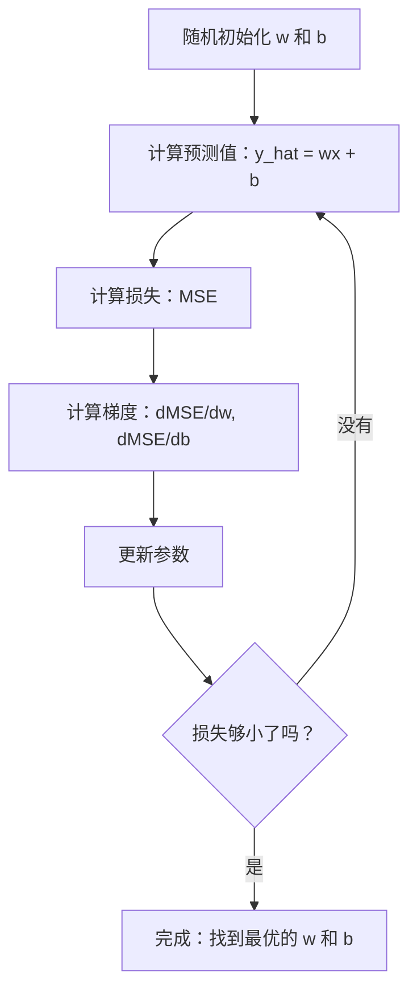

# 线性回归

> 线性回归就是找一条最贴合数据的直线——机器学习的 "Hello World"。

**类型：** 构建
**语言：** Python
**前置条件：** 第一阶段（线性代数、微积分、优化），第二阶段第1课
**时长：** 约90分钟

## 学习目标

- 推导均方误差的梯度下降更新公式，从零实现线性回归
- 比较梯度下降和正规方程的计算复杂度，知道各自的适用场景
- 构建带特征标准化的多元线性回归，并解读学到的权重含义
- 解释 Ridge 回归（L2 正则化）如何通过惩罚大权重来防止过拟合

## 问题的起点

你有一批数据：房子面积和对应的成交价。你想预测一套新房子的价格。用肉眼在散点图上估一估倒是可以，但你需要一个公式——一条最贴合数据的线，这样给定任何面积都能算出预测价格。

线性回归给你这条线。更重要的是，它完整地展示了 ML 训练的整个流程：定义模型 → 定义损失函数 → 优化参数。所有 ML 算法都遵循这个模式，在这里把最简单的情况搞透彻，后面遇到任何复杂算法都会认出这个骨架。

这不只是用来处理简单问题的。线性回归在生产系统里广泛应用于需求预测、A/B 测试分析、金融建模，也是每个回归任务的标准基线。

## 核心概念

### 模型

线性回归假设输入 x 和输出 y 之间存在线性关系：

```
y = wx + b
```

- `w`（权重/斜率）：x 每增加 1，y 变化多少
- `b`（偏置/截距）：x = 0 时 y 的值

有多个输入特征时，扩展为：

```
y = w1*x1 + w2*x2 + ... + wn*xn + b
```

向量形式：`y = w^T * x + b`

目标：找到 w 和 b，使得所有训练样本的预测值尽可能接近真实值。

### 损失函数：均方误差（MSE）

怎么衡量"尽可能接近"？需要一个数字来反映预测的整体偏差。最常用的是均方误差（Mean Squared Error）：

```
MSE = (1/n) * sum((预测值 - 真实值)^2)
```

为什么要平方？两个原因：第一，平方后大误差比小误差受到更重的惩罚（误差 10 比误差 1 糟糕 100 倍，而不是 10 倍）；第二，平方函数处处可微，求导直接，优化方便。

把 MSE 画出来就是一个碗形曲面（凸抛物面），碗底是 MSE 最小的地方。训练就是找到那个碗底。

### 梯度下降

梯度下降的思路就是沿着碗壁一步步往下走，直到到达底部。



梯度告诉你两件事：每个参数该往哪个方向移动，以及移动多少。

对于 MSE 且 y_hat = wx + b，梯度是：

```
dMSE/dw = (2/n) * sum((y_hat - y) * x)
dMSE/db = (2/n) * sum(y_hat - y)
```

更新规则：

```
w = w - 学习率 * dMSE/dw
b = b - 学习率 * dMSE/db
```

学习率控制步子大小。太大：一步跨过碗底，来回震荡甚至发散；太小：收敛慢到你怀疑人生。常见初始值：0.01、0.001、0.0001。

### 正规方程（解析解）

线性回归有个特殊之处：存在一个直接给出最优权重的公式，不需要迭代：

```
w = (X^T * X)^(-1) * X^T * y
```

通过矩阵求逆一步到位，数据量小时非常好用。但数据量大时（百万行或上千特征），矩阵求逆的复杂度是特征数的 O(n^3)，这时梯度下降反而更划算。

### 多元线性回归

有多个特征时：

```
y = w1*x1 + w2*x2 + ... + wn*xn + b
```

流程完全一样：MSE 作为损失，梯度下降同时更新所有权重。区别在于拟合的不是一条线，而是一个超平面。

这里特征缩放很关键。如果一个特征的值域是 0 到 1，另一个是 0 到 100 万，梯度下降会很吃力，因为损失曲面会变成一个极度拉长的椭圆。训练前先对特征做标准化（减均值、除标准差）。

### 多项式回归

如果关系本来就不是线性的怎么办？可以用多项式特征，然后继续用线性回归：

```
y = w1*x + w2*x^2 + w3*x^3 + b
```

这依然叫"线性"回归，因为模型对权重（w1, w2, w3）是线性的，只是用了 x 的非线性变换作为输入特征。

多项式次数越高能拟合越复杂的曲线，但越容易过拟合。10 次多项式在 10 个点的数据集上能完美通过每一个点，但在新数据上会一塌糊涂。

### R² 评分

MSE 是有量纲的，不同数据集之间没法比较。R²（R 平方）给出一个无量纲的评估指标：

```
R² = 1 - (残差平方和) / (总方差)
   = 1 - SS_res / SS_tot
```

- R² = 1.0：预测完美
- R² = 0.0：模型和"永远预测均值"一样好（或一样烂）
- R² < 0.0：模型还不如直接预测均值

### 正则化预告：Ridge 回归

特征很多时，模型可能会给某些特征分配很大的权重，从而过拟合。Ridge 回归（L2 正则化）在损失函数里加一个惩罚项：

```
总损失 = MSE + λ * sum(w_i^2)
```

惩罚项压制大权重，超参数 λ 控制惩罚力度——λ 越大，权重越小，正则化越强。后面会深入讲这个，现在只需要知道它能防止过拟合，以及为什么能防止。

## 动手实现

### 第一步：生成样本数据

```python
import random
import math

random.seed(42)

TRUE_W = 3.0
TRUE_B = 7.0
N_SAMPLES = 100

X = [random.uniform(0, 10) for _ in range(N_SAMPLES)]
y = [TRUE_W * x + TRUE_B + random.gauss(0, 2.0) for x in X]

print(f"Generated {N_SAMPLES} samples")
print(f"True relationship: y = {TRUE_W}x + {TRUE_B} (+ noise)")
print(f"First 5 points: {[(round(X[i], 2), round(y[i], 2)) for i in range(5)]}")
```

### 第二步：梯度下降实现线性回归

```python
class LinearRegression:
    def __init__(self, learning_rate=0.01):
        self.w = 0.0
        self.b = 0.0
        self.lr = learning_rate
        self.cost_history = []

    def predict(self, X):
        return [self.w * x + self.b for x in X]

    def compute_cost(self, X, y):
        predictions = self.predict(X)
        n = len(y)
        cost = sum((pred - actual) ** 2 for pred, actual in zip(predictions, y)) / n
        return cost

    def compute_gradients(self, X, y):
        predictions = self.predict(X)
        n = len(y)
        dw = (2 / n) * sum((pred - actual) * x for pred, actual, x in zip(predictions, y, X))
        db = (2 / n) * sum(pred - actual for pred, actual in zip(predictions, y))
        return dw, db

    def fit(self, X, y, epochs=1000, print_every=200):
        for epoch in range(epochs):
            dw, db = self.compute_gradients(X, y)
            self.w -= self.lr * dw
            self.b -= self.lr * db
            cost = self.compute_cost(X, y)
            self.cost_history.append(cost)
            if epoch % print_every == 0:
                print(f"  Epoch {epoch:4d} | Cost: {cost:.4f} | w: {self.w:.4f} | b: {self.b:.4f}")
        return self

    def r_squared(self, X, y):
        predictions = self.predict(X)
        y_mean = sum(y) / len(y)
        ss_res = sum((actual - pred) ** 2 for actual, pred in zip(y, predictions))
        ss_tot = sum((actual - y_mean) ** 2 for actual in y)
        return 1 - (ss_res / ss_tot)


print("=== Training Linear Regression (Gradient Descent) ===")
model = LinearRegression(learning_rate=0.005)
model.fit(X, y, epochs=1000, print_every=200)
print(f"\nLearned: y = {model.w:.4f}x + {model.b:.4f}")
print(f"True:    y = {TRUE_W}x + {TRUE_B}")
print(f"R-squared: {model.r_squared(X, y):.4f}")
```

### 第三步：正规方程（解析解）

```python
class LinearRegressionNormal:
    def __init__(self):
        self.w = 0.0
        self.b = 0.0

    def fit(self, X, y):
        n = len(X)
        x_mean = sum(X) / n
        y_mean = sum(y) / n
        numerator = sum((X[i] - x_mean) * (y[i] - y_mean) for i in range(n))
        denominator = sum((X[i] - x_mean) ** 2 for i in range(n))
        self.w = numerator / denominator
        self.b = y_mean - self.w * x_mean
        return self

    def predict(self, X):
        return [self.w * x + self.b for x in X]

    def r_squared(self, X, y):
        predictions = self.predict(X)
        y_mean = sum(y) / len(y)
        ss_res = sum((actual - pred) ** 2 for actual, pred in zip(y, predictions))
        ss_tot = sum((actual - y_mean) ** 2 for actual in y)
        return 1 - (ss_res / ss_tot)


print("\n=== Normal Equation (Closed-Form) ===")
model_normal = LinearRegressionNormal()
model_normal.fit(X, y)
print(f"Learned: y = {model_normal.w:.4f}x + {model_normal.b:.4f}")
print(f"R-squared: {model_normal.r_squared(X, y):.4f}")
```

### 第四步：多元线性回归

```python
class MultipleLinearRegression:
    def __init__(self, n_features, learning_rate=0.01):
        self.weights = [0.0] * n_features
        self.bias = 0.0
        self.lr = learning_rate
        self.cost_history = []

    def predict_single(self, x):
        return sum(w * xi for w, xi in zip(self.weights, x)) + self.bias

    def predict(self, X):
        return [self.predict_single(x) for x in X]

    def compute_cost(self, X, y):
        predictions = self.predict(X)
        n = len(y)
        return sum((pred - actual) ** 2 for pred, actual in zip(predictions, y)) / n

    def fit(self, X, y, epochs=1000, print_every=200):
        n = len(y)
        n_features = len(X[0])
        for epoch in range(epochs):
            predictions = self.predict(X)
            errors = [pred - actual for pred, actual in zip(predictions, y)]
            for j in range(n_features):
                grad = (2 / n) * sum(errors[i] * X[i][j] for i in range(n))
                self.weights[j] -= self.lr * grad
            grad_b = (2 / n) * sum(errors)
            self.bias -= self.lr * grad_b
            cost = self.compute_cost(X, y)
            self.cost_history.append(cost)
            if epoch % print_every == 0:
                print(f"  Epoch {epoch:4d} | Cost: {cost:.4f}")
        return self

    def r_squared(self, X, y):
        predictions = self.predict(X)
        y_mean = sum(y) / len(y)
        ss_res = sum((actual - pred) ** 2 for actual, pred in zip(y, predictions))
        ss_tot = sum((actual - y_mean) ** 2 for actual in y)
        return 1 - (ss_res / ss_tot)


random.seed(42)
N = 100
X_multi = []
y_multi = []
for _ in range(N):
    size = random.uniform(500, 3000)
    bedrooms = random.randint(1, 5)
    age = random.uniform(0, 50)
    price = 50 * size + 10000 * bedrooms - 1000 * age + 50000 + random.gauss(0, 20000)
    X_multi.append([size, bedrooms, age])
    y_multi.append(price)


def standardize(X):
    n_features = len(X[0])
    means = [sum(X[i][j] for i in range(len(X))) / len(X) for j in range(n_features)]
    stds = []
    for j in range(n_features):
        variance = sum((X[i][j] - means[j]) ** 2 for i in range(len(X))) / len(X)
        stds.append(variance ** 0.5)
    X_scaled = []
    for i in range(len(X)):
        row = [(X[i][j] - means[j]) / stds[j] if stds[j] > 0 else 0 for j in range(n_features)]
        X_scaled.append(row)
    return X_scaled, means, stds


y_mean_val = sum(y_multi) / len(y_multi)
y_std_val = (sum((yi - y_mean_val) ** 2 for yi in y_multi) / len(y_multi)) ** 0.5
y_scaled = [(yi - y_mean_val) / y_std_val for yi in y_multi]

X_scaled, x_means, x_stds = standardize(X_multi)

print("\n=== Multiple Linear Regression (3 features) ===")
print("Features: house size, bedrooms, age")
multi_model = MultipleLinearRegression(n_features=3, learning_rate=0.01)
multi_model.fit(X_scaled, y_scaled, epochs=1000, print_every=200)

print(f"\nWeights (standardized): {[round(w, 4) for w in multi_model.weights]}")
print(f"Bias (standardized): {multi_model.bias:.4f}")
print(f"R-squared: {multi_model.r_squared(X_scaled, y_scaled):.4f}")
```

### 第五步：多项式回归

```python
class PolynomialRegression:
    def __init__(self, degree, learning_rate=0.01):
        self.degree = degree
        self.weights = [0.0] * degree
        self.bias = 0.0
        self.lr = learning_rate

    def make_features(self, X):
        return [[x ** (d + 1) for d in range(self.degree)] for x in X]

    def predict(self, X):
        features = self.make_features(X)
        return [sum(w * f for w, f in zip(self.weights, row)) + self.bias for row in features]

    def fit(self, X, y, epochs=1000, print_every=200):
        features = self.make_features(X)
        n = len(y)
        for epoch in range(epochs):
            predictions = [sum(w * f for w, f in zip(self.weights, row)) + self.bias for row in features]
            errors = [pred - actual for pred, actual in zip(predictions, y)]
            for j in range(self.degree):
                grad = (2 / n) * sum(errors[i] * features[i][j] for i in range(n))
                self.weights[j] -= self.lr * grad
            grad_b = (2 / n) * sum(errors)
            self.bias -= self.lr * grad_b
            if epoch % print_every == 0:
                cost = sum(e ** 2 for e in errors) / n
                print(f"  Epoch {epoch:4d} | Cost: {cost:.6f}")
        return self

    def r_squared(self, X, y):
        predictions = self.predict(X)
        y_mean = sum(y) / len(y)
        ss_res = sum((actual - pred) ** 2 for actual, pred in zip(y, predictions))
        ss_tot = sum((actual - y_mean) ** 2 for actual in y)
        return 1 - (ss_res / ss_tot)


random.seed(42)
X_poly = [x / 10.0 for x in range(0, 50)]
y_poly = [0.5 * x ** 2 - 2 * x + 3 + random.gauss(0, 1.0) for x in X_poly]

x_max = max(abs(x) for x in X_poly)
X_poly_norm = [x / x_max for x in X_poly]
y_poly_mean = sum(y_poly) / len(y_poly)
y_poly_std = (sum((yi - y_poly_mean) ** 2 for yi in y_poly) / len(y_poly)) ** 0.5
y_poly_norm = [(yi - y_poly_mean) / y_poly_std for yi in y_poly]

print("\n=== Polynomial Regression (degree 2 vs degree 5) ===")
print("True relationship: y = 0.5x^2 - 2x + 3")

print("\nDegree 2:")
poly2 = PolynomialRegression(degree=2, learning_rate=0.1)
poly2.fit(X_poly_norm, y_poly_norm, epochs=2000, print_every=500)
print(f"  R-squared: {poly2.r_squared(X_poly_norm, y_poly_norm):.4f}")

print("\nDegree 5:")
poly5 = PolynomialRegression(degree=5, learning_rate=0.1)
poly5.fit(X_poly_norm, y_poly_norm, epochs=2000, print_every=500)
print(f"  R-squared: {poly5.r_squared(X_poly_norm, y_poly_norm):.4f}")

print("\nDegree 2 fits the true curve well. Degree 5 fits training data slightly better")
print("but risks overfitting on new data.")
```

### 第六步：Ridge 回归（L2 正则化）

```python
class RidgeRegression:
    def __init__(self, n_features, learning_rate=0.01, alpha=1.0):
        self.weights = [0.0] * n_features
        self.bias = 0.0
        self.lr = learning_rate
        self.alpha = alpha

    def predict_single(self, x):
        return sum(w * xi for w, xi in zip(self.weights, x)) + self.bias

    def predict(self, X):
        return [self.predict_single(x) for x in X]

    def fit(self, X, y, epochs=1000, print_every=200):
        n = len(y)
        n_features = len(X[0])
        for epoch in range(epochs):
            predictions = self.predict(X)
            errors = [pred - actual for pred, actual in zip(predictions, y)]
            mse = sum(e ** 2 for e in errors) / n
            reg_term = self.alpha * sum(w ** 2 for w in self.weights)
            cost = mse + reg_term
            for j in range(n_features):
                grad = (2 / n) * sum(errors[i] * X[i][j] for i in range(n))
                grad += 2 * self.alpha * self.weights[j]
                self.weights[j] -= self.lr * grad
            grad_b = (2 / n) * sum(errors)
            self.bias -= self.lr * grad_b
            if epoch % print_every == 0:
                print(f"  Epoch {epoch:4d} | Cost: {cost:.4f} | L2 penalty: {reg_term:.4f}")
        return self


print("\n=== Ridge Regression (L2 Regularization) ===")
print("Same data as multiple regression, with alpha=0.1")
ridge = RidgeRegression(n_features=3, learning_rate=0.01, alpha=0.1)
ridge.fit(X_scaled, y_scaled, epochs=1000, print_every=200)
print(f"\nRidge weights: {[round(w, 4) for w in ridge.weights]}")
print(f"Plain weights: {[round(w, 4) for w in multi_model.weights]}")
print("Ridge weights are smaller (shrunk toward zero) due to the L2 penalty.")
```

## 实际应用

用 scikit-learn 做同样的事情——这是你在生产中实际用的库：

```python
from sklearn.linear_model import LinearRegression as SklearnLR
from sklearn.linear_model import Ridge
from sklearn.preprocessing import PolynomialFeatures, StandardScaler
from sklearn.model_selection import train_test_split
from sklearn.metrics import mean_squared_error, r2_score
import numpy as np

np.random.seed(42)
X_sk = np.random.uniform(0, 10, (100, 1))
y_sk = 3.0 * X_sk.squeeze() + 7.0 + np.random.normal(0, 2.0, 100)

X_train, X_test, y_train, y_test = train_test_split(X_sk, y_sk, test_size=0.2, random_state=42)

lr = SklearnLR()
lr.fit(X_train, y_train)
y_pred = lr.predict(X_test)

print("=== Scikit-learn Linear Regression ===")
print(f"Coefficient (w): {lr.coef_[0]:.4f}")
print(f"Intercept (b): {lr.intercept_:.4f}")
print(f"R-squared (test): {r2_score(y_test, y_pred):.4f}")
print(f"MSE (test): {mean_squared_error(y_test, y_pred):.4f}")

poly = PolynomialFeatures(degree=2, include_bias=False)
X_poly_sk = poly.fit_transform(X_train)
X_poly_test = poly.transform(X_test)

lr_poly = SklearnLR()
lr_poly.fit(X_poly_sk, y_train)
print(f"\nPolynomial degree 2 R-squared: {r2_score(y_test, lr_poly.predict(X_poly_test)):.4f}")

scaler = StandardScaler()
X_train_scaled = scaler.fit_transform(X_train)
X_test_scaled = scaler.transform(X_test)

ridge = Ridge(alpha=1.0)
ridge.fit(X_train_scaled, y_train)
print(f"Ridge R-squared: {r2_score(y_test, ridge.predict(X_test_scaled)):.4f}")
print(f"Ridge coefficient: {ridge.coef_[0]:.4f}")
```

手写版和 sklearn 版结果应该一致。区别在于 sklearn 处理了各种边界情况、数值稳定性和性能优化。生产用库，手写版用来理解原理。

## 发布

本课产出：
- `outputs/skill-regression.md` — 帮你根据具体问题选择合适回归方法的技能参考

## 练习

1. 分别实现批量梯度下降、随机梯度下降（SGD）和小批量梯度下降，在同一数据集上比较收敛速度。哪个收敛最快？哪个损失曲线最平滑？
2. 用三次函数（y = ax³ + bx² + cx + d + 噪声）生成数据，分别用 1 次、3 次和 10 次多项式拟合，比较训练集和测试集上的 R²。从哪个次数开始过拟合变得明显？
3. 实现 Lasso 回归（L1 正则化：惩罚项 = alpha * sum(|w_i|)）。在多特征房价数据上训练，对比哪些权重被置零了，跟 Ridge 有什么不同。为什么 L1 产生稀疏解而 L2 不会？

## 关键术语

| 术语 | 通俗说法 | 实际含义 |
|------|----------------|----------------------|
| 线性回归（Linear regression） | "给数据画条线" | 找到 w 和 b，让 wx+b 与真实 y 的平方差之和最小 |
| 损失函数（Cost function） | "模型有多烂" | 把模型参数映射到单个误差数值的函数，训练就是最小化它 |
| 均方误差（MSE） | "误差的平均平方" | (1/n) * sum(预测值 - 真实值)²，对大误差惩罚更重 |
| 梯度下降（Gradient descent） | "往山下走" | 用偏导数方向反复更新参数，让损失函数减小 |
| 学习率（Learning rate） | "步子大小" | 控制每次梯度下降参数变化幅度的标量 |
| 正规方程（Normal equation） | "直接算出来" | 解析解 w = (X^T X)^-1 X^T y，无需迭代 |
| R 平方（R-squared） | "拟合有多好" | 模型解释了 y 的方差比例，范围负无穷到 1.0 |
| 特征缩放（Feature scaling） | "让特征可以比较" | 把特征变换到相近量级（如零均值单位方差），让梯度下降更快收敛 |
| 正则化（Regularization） | "惩罚复杂度" | 损失函数里加上权重惩罚项，防止过拟合 |
| Ridge 回归（Ridge regression） | "L2 正则化" | 在 MSE 基础上加 λ * sum(w_i²) 惩罚 |
| 多项式回归（Polynomial regression） | "用线性数学拟合曲线" | 用 x、x²、x³... 作为特征的线性回归，对权重仍是线性的 |
| 过拟合（Overfitting） | "把训练数据背下来了" | 模型复杂到连训练数据里的噪声都学进去，在新数据上表现差 |

## 延伸阅读

- [An Introduction to Statistical Learning (ISLR)](https://www.statlearning.com/) — 免费 PDF，第3和第6章讲线性回归与正则化，有大量实例
- [The Elements of Statistical Learning (ESL)](https://hastie.su.domains/ElemStatLearn/) — 免费 PDF，ISLR 的数学深化版，对 Ridge 和 Lasso 有更深入的推导
- [Stanford CS229 Lecture Notes on Linear Regression](https://cs229.stanford.edu/main_notes.pdf) — Andrew Ng 的讲义，从头推导正规方程和梯度下降
- [scikit-learn LinearRegression documentation](https://scikit-learn.org/stable/modules/linear_model.html) — 涵盖 LinearRegression、Ridge、Lasso、ElasticNet 的实用参考
