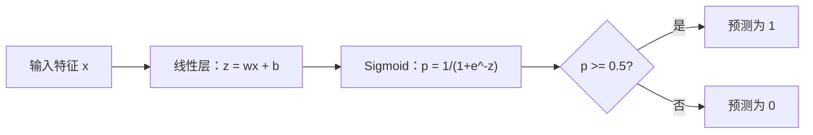
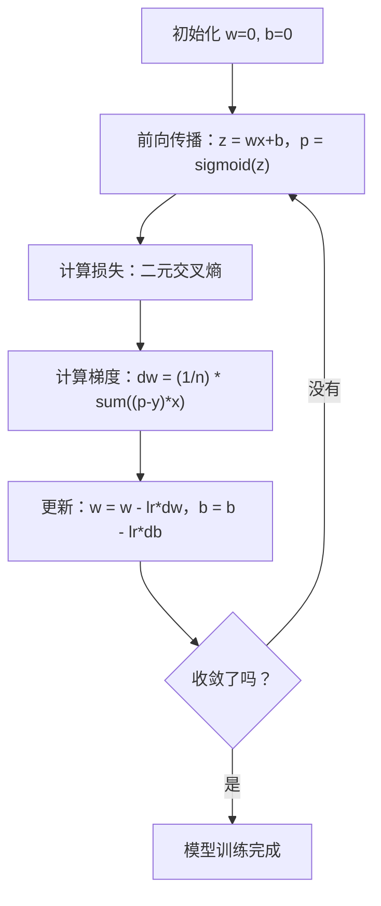

# 逻辑回归

> 逻辑回归把一条直线弯成 S 形曲线，用概率来回答"是或否"的问题。

**类型：** 构建
**语言：** Python
**前置条件：** 第二阶段第1-2课（什么是ML、线性回归）
**时长：** 约90分钟

## 学习目标

- 用 sigmoid 函数和二元交叉熵损失从零实现逻辑回归
- 计算并解读精确率、召回率、F1 分数和混淆矩阵
- 解释 MSE 为什么不适合分类任务，以及二元交叉熵为什么能产生凸损失曲面
- 构建用于多分类的 Softmax 回归，了解阈值调整的权衡

## 问题的起点

你想根据肿瘤大小预测它是恶性还是良性。先试了线性回归，输出的是 0.3、1.7、-0.5 这样的数。这些数代表什么意思？1.7 是"非常恶性"吗？-0.5 是"非常良性"吗？线性回归输出的是无界的数，而分类任务需要的是 0 到 1 之间的概率，再加一个明确的判断：是还是否。

逻辑回归解决的就是这个问题。它先算同样的线性组合（wx + b），然后把这个值送进 sigmoid 函数，把任意实数压缩到 (0, 1) 的范围内。输出就是一个概率，再设一个阈值（通常是 0.5）来做决策。

这是实际应用中使用最广泛的算法之一。别被名字骗了——尽管叫"回归"，逻辑回归做的是分类任务。"逻辑"这个名字来自它用的 logistic（sigmoid）函数。

## 核心概念

### 为什么线性回归做不了分类

假设要根据学习小时数预测通过/不通过（1/0）。线性回归会在数据上拟合一条线：

```
学习时间：1   2   3   4   5   6   7   8   9   10
实际结果：0   0   0   0   1   1   1   1   1   1
```

线性拟合出来的预测值可能是：1 小时时预测 -0.2，10 小时时预测 1.3。这些数字不是概率，它们会跑到 0 以下或 1 以上。更糟糕的是，如果有个异常值（比如学了 50 小时的人），整条线都会被拖歪，影响所有人的预测结果。

分类任务需要一个函数：
- 输出在 0 到 1 之间（表示概率）
- 有清晰的过渡（形成决策边界）
- 不会被边界附近的异常值拖偏

### Sigmoid 函数

Sigmoid 函数恰好满足这些要求：

```
sigmoid(z) = 1 / (1 + e^(-z))
```

它的特性：
- z 很大（正数）时，sigmoid(z) 趋近于 1
- z 很小（负数）时，sigmoid(z) 趋近于 0
- z = 0 时，sigmoid(z) = 0.5（正好在中间）
- 输出始终在 0 和 1 之间
- 处处光滑、可微

导数有个好用的形式：sigmoid'(z) = sigmoid(z) * (1 - sigmoid(z))，梯度计算很高效。

### 逻辑回归 = 线性模型 + Sigmoid

模型先算 z = wx + b（和线性回归一样），然后套上 sigmoid：



输出的 p 表示 P(y=1 | x)，即这个输入属于类别 1 的概率。决策边界是 wx + b = 0 的地方，此时 sigmoid 恰好输出 0.5。

### 二元交叉熵损失

逻辑回归不能用 MSE 作为损失函数。MSE 加上 sigmoid 会形成一个非凸的损失曲面，到处是局部极小值，梯度下降找不到好结果。改用二元交叉熵（也叫对数损失）：

```
Loss = -(1/n) * sum(y * log(p) + (1-y) * log(1-p))
```

为什么这个损失函数有效，逐条分析一下：
- 真实标签 y=1，预测概率 p 接近 1：log(1) = 0，损失近乎为零（预测对了，没有惩罚）
- 真实标签 y=1，预测概率 p 接近 0：log(0) 趋向负无穷，损失极大（预测错得很离谱）
- 真实标签 y=0，预测概率 p 接近 0：log(1) = 0，损失近乎为零（预测对了）
- 真实标签 y=0，预测概率 p 接近 1：log(0) 趋向负无穷，损失极大（预测错得很离谱）

对于逻辑回归，这个损失函数是凸的，保证只有一个全局最小值。

### 逻辑回归的梯度下降

二元交叉熵 + sigmoid 的梯度形式出乎意料地简洁：

```
dL/dw = (1/n) * sum((p - y) * x)
dL/db = (1/n) * sum(p - y)
```

和线性回归的梯度几乎一模一样！区别只是这里 p = sigmoid(wx + b)，而不是 p = wx + b。sigmoid 引入了非线性，但梯度更新规则的形式没变。



### 决策边界

对于二维输入（两个特征），决策边界是满足以下条件的直线：

```
w1*x1 + w2*x2 + b = 0
```

这条线一侧的点被分为类别 1，另一侧的点被分为类别 0。逻辑回归的决策边界永远是线性的。如果你需要弯曲的边界，要么加多项式特征，要么换非线性模型。

### 多分类：Softmax

二元逻辑回归只能处理两个类别。要处理 k 个类别，用 softmax 函数：

```
softmax(z_i) = e^(z_i) / sum(e^(z_j) for all j)
```

每个类别都有自己的权重向量。模型为每个类别算一个分数 z_i，然后 softmax 把这些分数转换成加和为 1 的概率。预测结果是概率最高的类别。

损失函数变成多分类交叉熵：

```
Loss = -(1/n) * sum(sum(y_k * log(p_k)))
```

其中 y_k 对于真实类别为 1，其他类别为 0（独热编码）。

### 评估指标

只看准确率是不够的。假设数据集里 95% 是负样本、5% 是正样本，一个永远预测负的模型准确率能达到 95%，但完全没有用。

**混淆矩阵**：

| | 预测为正 | 预测为负 |
|---|---|---|
| 实际为正 | 真阳性（TP） | 假阴性（FN） |
| 实际为负 | 假阳性（FP） | 真阴性（TN） |

**精确率（Precision）**：预测为正的里面，真正是正的占多少？
```
精确率 = TP / (TP + FP)
```

**召回率（Recall）**：实际为正的里面，被模型找到的占多少？
```
召回率 = TP / (TP + FN)
```

**F1 分数**：精确率和召回率的调和平均，两者都兼顾。
```
F1 = 2 * (精确率 * 召回率) / (精确率 + 召回率)
```

怎么选指标：
- **优先精确率**：假阳性代价高时（垃圾邮件过滤——误把正常邮件判成垃圾是大问题）
- **优先召回率**：假阴性代价高时（癌症筛查——漏掉一个肿瘤是不可接受的）
- **用 F1**：需要一个综合指标时

## 动手实现

### 第一步：Sigmoid 函数和数据生成

```python
import random
import math

def sigmoid(z):
    z = max(-500, min(500, z))
    return 1.0 / (1.0 + math.exp(-z))


random.seed(42)
N = 200
X = []
y = []

for _ in range(N // 2):
    X.append([random.gauss(2, 1), random.gauss(2, 1)])
    y.append(0)

for _ in range(N // 2):
    X.append([random.gauss(5, 1), random.gauss(5, 1)])
    y.append(1)

combined = list(zip(X, y))
random.shuffle(combined)
X, y = zip(*combined)
X = list(X)
y = list(y)

print(f"Generated {N} samples (2 classes, 2 features)")
print(f"Class 0 center: (2, 2), Class 1 center: (5, 5)")
print(f"First 5 samples:")
for i in range(5):
    print(f"  Features: [{X[i][0]:.2f}, {X[i][1]:.2f}], Label: {y[i]}")
```

### 第二步：逻辑回归的完整实现

```python
class LogisticRegression:
    def __init__(self, n_features, learning_rate=0.01):
        self.weights = [0.0] * n_features
        self.bias = 0.0
        self.lr = learning_rate
        self.loss_history = []

    def predict_proba(self, x):
        z = sum(w * xi for w, xi in zip(self.weights, x)) + self.bias
        return sigmoid(z)

    def predict(self, x, threshold=0.5):
        return 1 if self.predict_proba(x) >= threshold else 0

    def compute_loss(self, X, y):
        n = len(y)
        total = 0.0
        for i in range(n):
            p = self.predict_proba(X[i])
            p = max(1e-15, min(1 - 1e-15, p))
            total += y[i] * math.log(p) + (1 - y[i]) * math.log(1 - p)
        return -total / n

    def fit(self, X, y, epochs=1000, print_every=200):
        n = len(y)
        n_features = len(X[0])
        for epoch in range(epochs):
            dw = [0.0] * n_features
            db = 0.0
            for i in range(n):
                p = self.predict_proba(X[i])
                error = p - y[i]
                for j in range(n_features):
                    dw[j] += error * X[i][j]
                db += error
            for j in range(n_features):
                self.weights[j] -= self.lr * (dw[j] / n)
            self.bias -= self.lr * (db / n)
            loss = self.compute_loss(X, y)
            self.loss_history.append(loss)
            if epoch % print_every == 0:
                print(f"  Epoch {epoch:4d} | Loss: {loss:.4f} | w: [{self.weights[0]:.3f}, {self.weights[1]:.3f}] | b: {self.bias:.3f}")
        return self

    def accuracy(self, X, y):
        correct = sum(1 for i in range(len(y)) if self.predict(X[i]) == y[i])
        return correct / len(y)


split = int(0.8 * N)
X_train, X_test = X[:split], X[split:]
y_train, y_test = y[:split], y[split:]

print("\n=== Training Logistic Regression ===")
model = LogisticRegression(n_features=2, learning_rate=0.1)
model.fit(X_train, y_train, epochs=1000, print_every=200)

print(f"\nTrain accuracy: {model.accuracy(X_train, y_train):.4f}")
print(f"Test accuracy:  {model.accuracy(X_test, y_test):.4f}")
print(f"Weights: [{model.weights[0]:.4f}, {model.weights[1]:.4f}]")
print(f"Bias: {model.bias:.4f}")
```

### 第三步：混淆矩阵和各项指标

```python
class ClassificationMetrics:
    def __init__(self, y_true, y_pred):
        self.tp = sum(1 for t, p in zip(y_true, y_pred) if t == 1 and p == 1)
        self.tn = sum(1 for t, p in zip(y_true, y_pred) if t == 0 and p == 0)
        self.fp = sum(1 for t, p in zip(y_true, y_pred) if t == 0 and p == 1)
        self.fn = sum(1 for t, p in zip(y_true, y_pred) if t == 1 and p == 0)

    def accuracy(self):
        total = self.tp + self.tn + self.fp + self.fn
        return (self.tp + self.tn) / total if total > 0 else 0

    def precision(self):
        denom = self.tp + self.fp
        return self.tp / denom if denom > 0 else 0

    def recall(self):
        denom = self.tp + self.fn
        return self.tp / denom if denom > 0 else 0

    def f1(self):
        p = self.precision()
        r = self.recall()
        return 2 * p * r / (p + r) if (p + r) > 0 else 0

    def print_confusion_matrix(self):
        print(f"\n  Confusion Matrix:")
        print(f"                  Predicted")
        print(f"                  Pos   Neg")
        print(f"  Actual Pos     {self.tp:4d}  {self.fn:4d}")
        print(f"  Actual Neg     {self.fp:4d}  {self.tn:4d}")

    def print_report(self):
        self.print_confusion_matrix()
        print(f"\n  Accuracy:  {self.accuracy():.4f}")
        print(f"  Precision: {self.precision():.4f}")
        print(f"  Recall:    {self.recall():.4f}")
        print(f"  F1 Score:  {self.f1():.4f}")


y_pred_test = [model.predict(x) for x in X_test]
print("\n=== Classification Report (Test Set) ===")
metrics = ClassificationMetrics(y_test, y_pred_test)
metrics.print_report()
```

### 第四步：观察决策边界

```python
print("\n=== Decision Boundary ===")
w1, w2 = model.weights
b = model.bias
print(f"Decision boundary: {w1:.4f}*x1 + {w2:.4f}*x2 + {b:.4f} = 0")
if abs(w2) > 1e-10:
    print(f"Solved for x2:     x2 = {-w1/w2:.4f}*x1 + {-b/w2:.4f}")

print("\nSample predictions near the boundary:")
test_points = [
    [3.0, 3.0],
    [3.5, 3.5],
    [4.0, 4.0],
    [2.5, 2.5],
    [5.0, 5.0],
]
for point in test_points:
    prob = model.predict_proba(point)
    pred = model.predict(point)
    print(f"  [{point[0]}, {point[1]}] -> prob={prob:.4f}, class={pred}")
```

### 第五步：多分类 Softmax

```python
class SoftmaxRegression:
    def __init__(self, n_features, n_classes, learning_rate=0.01):
        self.n_features = n_features
        self.n_classes = n_classes
        self.lr = learning_rate
        self.weights = [[0.0] * n_features for _ in range(n_classes)]
        self.biases = [0.0] * n_classes

    def softmax(self, scores):
        max_score = max(scores)
        exp_scores = [math.exp(s - max_score) for s in scores]
        total = sum(exp_scores)
        return [e / total for e in exp_scores]

    def predict_proba(self, x):
        scores = [
            sum(self.weights[k][j] * x[j] for j in range(self.n_features)) + self.biases[k]
            for k in range(self.n_classes)
        ]
        return self.softmax(scores)

    def predict(self, x):
        probs = self.predict_proba(x)
        return probs.index(max(probs))

    def fit(self, X, y, epochs=1000, print_every=200):
        n = len(y)
        for epoch in range(epochs):
            grad_w = [[0.0] * self.n_features for _ in range(self.n_classes)]
            grad_b = [0.0] * self.n_classes
            total_loss = 0.0
            for i in range(n):
                probs = self.predict_proba(X[i])
                for k in range(self.n_classes):
                    target = 1.0 if y[i] == k else 0.0
                    error = probs[k] - target
                    for j in range(self.n_features):
                        grad_w[k][j] += error * X[i][j]
                    grad_b[k] += error
                true_prob = max(probs[y[i]], 1e-15)
                total_loss -= math.log(true_prob)
            for k in range(self.n_classes):
                for j in range(self.n_features):
                    self.weights[k][j] -= self.lr * (grad_w[k][j] / n)
                self.biases[k] -= self.lr * (grad_b[k] / n)
            if epoch % print_every == 0:
                print(f"  Epoch {epoch:4d} | Loss: {total_loss / n:.4f}")
        return self

    def accuracy(self, X, y):
        correct = sum(1 for i in range(len(y)) if self.predict(X[i]) == y[i])
        return correct / len(y)


random.seed(42)
X_3class = []
y_3class = []

centers = [(1, 1), (5, 1), (3, 5)]
for label, (cx, cy) in enumerate(centers):
    for _ in range(50):
        X_3class.append([random.gauss(cx, 0.8), random.gauss(cy, 0.8)])
        y_3class.append(label)

combined = list(zip(X_3class, y_3class))
random.shuffle(combined)
X_3class, y_3class = zip(*combined)
X_3class = list(X_3class)
y_3class = list(y_3class)

split_3 = int(0.8 * len(X_3class))
X_train_3 = X_3class[:split_3]
y_train_3 = y_3class[:split_3]
X_test_3 = X_3class[split_3:]
y_test_3 = y_3class[split_3:]

print("\n=== Multi-class Softmax Regression (3 classes) ===")
softmax_model = SoftmaxRegression(n_features=2, n_classes=3, learning_rate=0.1)
softmax_model.fit(X_train_3, y_train_3, epochs=1000, print_every=200)
print(f"\nTrain accuracy: {softmax_model.accuracy(X_train_3, y_train_3):.4f}")
print(f"Test accuracy:  {softmax_model.accuracy(X_test_3, y_test_3):.4f}")

print("\nSample predictions:")
for i in range(5):
    probs = softmax_model.predict_proba(X_test_3[i])
    pred = softmax_model.predict(X_test_3[i])
    print(f"  True: {y_test_3[i]}, Predicted: {pred}, Probs: [{', '.join(f'{p:.3f}' for p in probs)}]")
```

### 第六步：调整决策阈值

```python
print("\n=== Threshold Tuning ===")
print("Default threshold: 0.5. Adjusting the threshold trades precision for recall.\n")

thresholds = [0.3, 0.4, 0.5, 0.6, 0.7]
print(f"{'Threshold':>10} {'Accuracy':>10} {'Precision':>10} {'Recall':>10} {'F1':>10}")
print("-" * 52)

for t in thresholds:
    y_pred_t = [1 if model.predict_proba(x) >= t else 0 for x in X_test]
    m = ClassificationMetrics(y_test, y_pred_t)
    print(f"{t:>10.1f} {m.accuracy():>10.4f} {m.precision():>10.4f} {m.recall():>10.4f} {m.f1():>10.4f}")
```

阈值低于 0.5：更多样本被预测为正类，召回率上升，但精确率下降。阈值高于 0.5：反过来。根据你的业务场景选择合适的阈值。

## 实际应用

用 scikit-learn 实现同样的事：

```python
from sklearn.linear_model import LogisticRegression as SklearnLR
from sklearn.metrics import accuracy_score, precision_score, recall_score, f1_score
from sklearn.metrics import confusion_matrix, classification_report
from sklearn.model_selection import train_test_split
from sklearn.preprocessing import StandardScaler
import numpy as np

np.random.seed(42)
X_0 = np.random.randn(100, 2) + [2, 2]
X_1 = np.random.randn(100, 2) + [5, 5]
X_sk = np.vstack([X_0, X_1])
y_sk = np.array([0] * 100 + [1] * 100)

X_tr, X_te, y_tr, y_te = train_test_split(X_sk, y_sk, test_size=0.2, random_state=42)

scaler = StandardScaler()
X_tr_sc = scaler.fit_transform(X_tr)
X_te_sc = scaler.transform(X_te)

lr = SklearnLR()
lr.fit(X_tr_sc, y_tr)
y_pred = lr.predict(X_te_sc)

print("=== Scikit-learn Logistic Regression ===")
print(f"Accuracy:  {accuracy_score(y_te, y_pred):.4f}")
print(f"Precision: {precision_score(y_te, y_pred):.4f}")
print(f"Recall:    {recall_score(y_te, y_pred):.4f}")
print(f"F1:        {f1_score(y_te, y_pred):.4f}")
print(f"\nConfusion Matrix:\n{confusion_matrix(y_te, y_pred)}")
print(f"\nClassification Report:\n{classification_report(y_te, y_pred)}")
```

手写版和 sklearn 的决策边界与指标是一致的。sklearn 额外提供了多种求解器（liblinear、lbfgs、saga）、自动正则化、多分类策略（一对其余、多项式）以及更好的数值稳定性。

## 发布

本课产出：
- `code/logistic_regression.py` — 带评估指标的完整逻辑回归实现

## 练习

1. 生成一个线性不可分的数据集（比如两个同心圆）。训练逻辑回归，观察它失败的情况。然后添加多项式特征（x1²、x2²、x1*x2）再训练，看准确率是否提升。
2. 为三分类 Softmax 模型实现多分类混淆矩阵，计算每个类别的精确率和召回率。哪个类别最难分对？
3. 从零实现 ROC 曲线。对 0 到 1 之间的 100 个阈值，分别计算真阳性率和假阳性率。用梯形法则计算 AUC（曲线下面积）。

## 关键术语

| 术语 | 通俗说法 | 实际含义 |
|------|----------------|----------------------|
| 逻辑回归（Logistic regression） | "用于分类的回归" | 线性模型后接 sigmoid 函数，输出类别概率 |
| Sigmoid 函数 | "S 形曲线" | 1/(1+e^(-z))，把任意实数映射到 (0, 1) 区间 |
| 二元交叉熵（Binary cross-entropy） | "对数损失" | 损失函数 -[y*log(p) + (1-y)*log(1-p)]，对自信的错误预测惩罚极重 |
| 决策边界（Decision boundary） | "分界线" | 模型输出概率恰好等于 0.5 的那条线，把两个预测类别分开 |
| Softmax | "多分类版 Sigmoid" | 把一组分数转换成加和为 1 的概率分布 |
| 精确率（Precision） | "选对的比例" | TP / (TP + FP)，预测为正的里面真正是正的比例 |
| 召回率（Recall） | "找到的比例" | TP / (TP + FN)，实际为正的里面被模型找出来的比例 |
| F1 分数（F1 score） | "综合得分" | 精确率和召回率的调和平均：2*P*R / (P+R) |
| 混淆矩阵（Confusion matrix） | "错误明细表" | 展示 TP、TN、FP、FN 数量的表格 |
| 阈值（Threshold） | "分类切割点" | 概率超过此值就预测为类别 1，默认 0.5，可调整 |
| 独热编码（One-hot encoding） | "类别转二进制列" | 将类别 k 表示为一个向量，仅第 k 位为 1，其余为 0 |
| 多分类交叉熵（Categorical cross-entropy） | "多分类对数损失" | 二元交叉熵对 k 个类别的推广，使用独热编码标签 |
