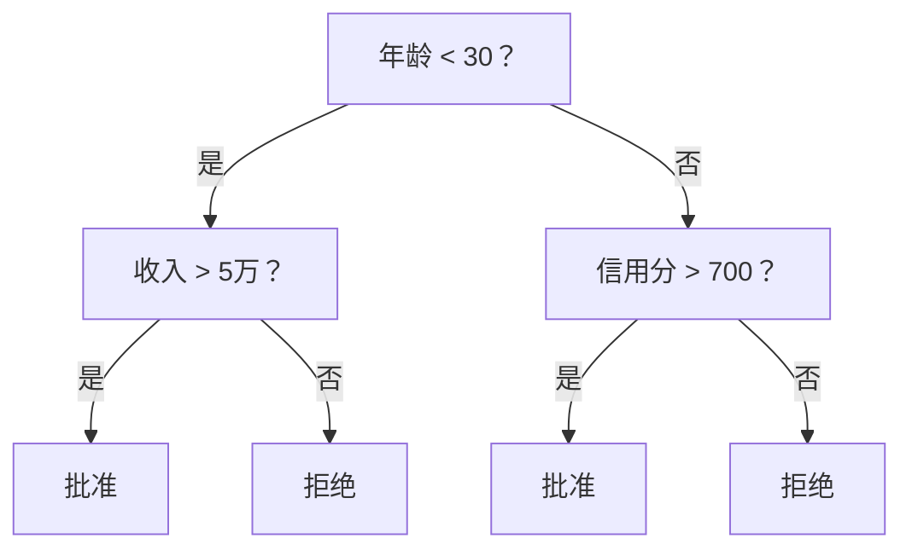
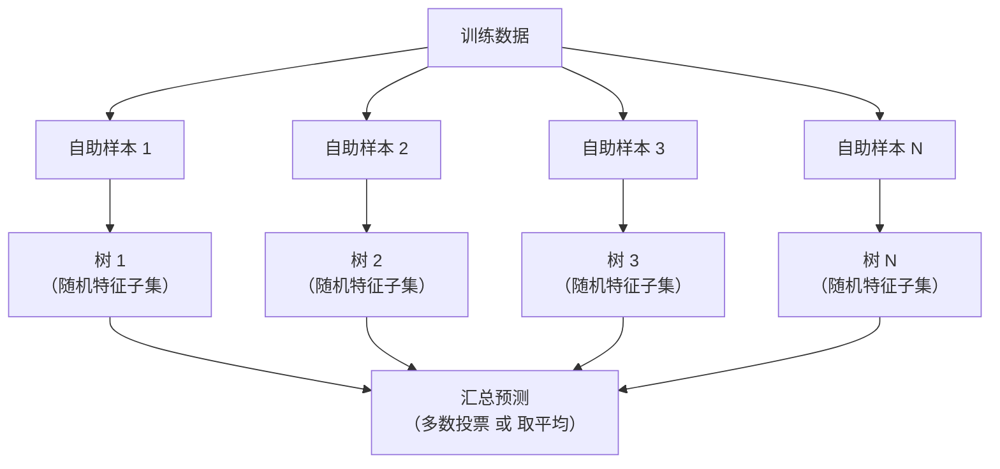

# 决策树与随机森林

> 一棵决策树，不过是一张流程图。但一片森林，却是机器学习中最强大的工具之一。

**类型：** 动手实现
**语言：** Python
**前置知识：** 第一阶段（第09课信息论、第06课概率论）
**预计时间：** 约90分钟

## 学习目标

- 从头实现基尼不纯度、信息熵和信息增益，找到最优分裂点
- 构建带预剪枝控制（最大深度、最少样本数）的决策树分类器
- 用自助采样和特征随机化构建随机森林，理解它为何能降低方差
- 对比MDI特征重要性与置换重要性，识别MDI的偏差来源

## 问题背景

你手头有一份表格数据：行是样本，列是特征，还有一列要预测的目标值。你当然可以直接上神经网络。但对于表格数据，基于树的模型（决策树、随机森林、梯度提升树）会持续击败深度学习。Kaggle上的结构化数据竞赛，冠军几乎都是XGBoost和LightGBM，而不是Transformer。

为什么？树模型天然支持混合特征类型（数值型和类别型），不需要预处理。它们能捕捉非线性关系，不需要手工特征工程。而且可解释性极强——你可以直接看着树，知道每个预测是怎么来的。随机森林通过对多棵树取平均，在中等规模数据集上对过拟合有极强的抵抗力。

这节课我们从头用递归分裂构建决策树，然后在此基础上搭建随机森林。你会亲手实现分裂准则背后的数学（基尼不纯度、信息熵、信息增益），并理解为什么一群"弱学习器"的集合能变成一个"强学习器"。

## 核心概念

### 决策树做的事

决策树通过一系列是/否问题，把特征空间切割成一块块矩形区域。



每个内部节点对某个特征做阈值判断，每个叶子节点给出预测结果。对新数据点做分类时，从根节点出发，沿分支一路走到叶子节点。

树的构建是自顶向下的：在每个节点，选出最能区分数据的特征和阈值。"最能区分"由分裂准则来衡量。

### 分裂准则：怎么衡量"不纯度"

每个节点都有一批样本。我们希望分裂后，子节点尽可能"纯"——也就是说，每个子节点里几乎只有一种类别。

**基尼不纯度（Gini Impurity）**衡量的是：如果按该节点的类别分布随机给一个样本贴标签，被贴错的概率有多大。

```
Gini(S) = 1 - sum(p_k^2)

p_k 是集合 S 中第 k 类的比例
```

节点越纯，基尼值越低（纯节点时为0）。对于二分类各占50%的情况，Gini = 0.5。数值越小越好。

```
例子：6只猫，4只狗

Gini = 1 - (0.6^2 + 0.4^2) = 1 - (0.36 + 0.16) = 0.48
```

**信息熵（Entropy）**衡量节点的混乱程度（不确定性）。这在第一阶段第09课信息论里介绍过。

```
Entropy(S) = -sum(p_k * log2(p_k))
```

纯节点熵值为0，二分类各占50%时熵值为1.0。同样，数值越小越好。

```
例子：6只猫，4只狗

Entropy = -(0.6 * log2(0.6) + 0.4 * log2(0.4))
        = -(0.6 * -0.737 + 0.4 * -1.322)
        = 0.442 + 0.529
        = 0.971 比特
```

**信息增益（Information Gain）**就是分裂后不纯度的下降量。

```
IG(S, 特征, 阈值) = Impurity(S) - 加权平均(Impurity(S_left), Impurity(S_right))

权重是每个子节点包含的样本比例
```

每个节点的贪心算法：遍历每个特征的每个可能阈值，选出信息增益最大的那对（特征, 阈值）。

### 分裂是怎么进行的

假设当前节点有 n 个特征、m 个样本：

1. 对每个特征 j（j 从 1 到 n）：
   - 按特征 j 的值对样本排序
   - 把相邻不同值的中点都试一遍作为阈值
   - 对每个阈值计算信息增益
2. 选出信息增益最高的（特征, 阈值）组合
3. 按 `特征值 <= 阈值` 分成左右两子节点
4. 对每个子节点递归重复上述过程

这种贪心方式不保证找到全局最优树——求最优树是NP难问题。但贪心分裂在实践中效果很好。

### 何时停止

如果不加任何限制，树会一直长，直到每个叶子节点都是纯的（极端情况下每个叶子只有一个样本）。这会把训练数据完全记住，但泛化能力极差。

**预剪枝**在树长满之前就叫停：
- 最大深度：达到设定深度就不再分裂
- 叶子最少样本数：节点样本数低于 k 就不再分裂
- 最小信息增益：最佳分裂的增益低于阈值就不再分裂
- 最大叶子节点数：限制叶子总数

**后剪枝**先把树长完，再往回剪：
- 代价复杂度剪枝（scikit-learn 默认）：给叶子数量加惩罚项，惩罚越大，树越小
- 减少误差剪枝：如果去掉某个子树不会让验证集误差变大，就剪掉

预剪枝更简单、更快。后剪枝通常效果更好——因为预剪枝可能会过早终止一个"先难后易"的分裂路径。

### 用于回归的决策树

回归树的叶子节点预测的是该叶子内所有样本目标值的均值。分裂准则也换了：

**方差减少**替代信息增益：

```
VR(S, 特征, 阈值) = Var(S) - 加权平均(Var(S_left), Var(S_right))
```

选出方差减少最多的分裂。树把输入空间切成若干区域，在每个区域内预测一个常数（均值）。

### 随机森林：集成的力量

单棵决策树方差很高——训练数据稍微变动，生成的树可能面目全非。随机森林通过对多棵树取平均来解决这个问题。



两种随机性让各棵树保持差异：

**Bagging（自助聚合）：** 每棵树在一个自助样本上训练——从训练数据中有放回地随机抽取，样本量与原始数据相同。大约有63%的原始样本会出现在每个自助样本中（剩余37%称为"袋外样本"，可用于验证）。

**特征随机化：** 每次分裂时，只从随机选出的一部分特征中挑最优分裂点。分类任务默认用 sqrt(n_features)，回归任务用 n_features/3。这样可以防止所有树都在同一个"强势特征"上分裂。

关键洞察：对许多去相关的树取平均，能降低方差而不增加偏差。每棵树单独看可能平淡无奇，但集成起来就很强。

### 特征重要性

随机森林自然提供特征重要性评分。最常用的方法：

**平均不纯度减少（MDI，Mean Decrease in Impurity）：** 对每个特征，把它在所有树的所有节点上带来的不纯度减少量加总起来。越早分裂、减少越多的特征越重要。

```
importance(特征_j) = 对所有使用特征_j的节点求和：
    (该节点样本数 / 总样本数) * 不纯度减少量
```

这种方法训练时顺便就算好了，速度快。但有个缺点：对高基数（取值很多）的特征有偏向，因为这类特征有更多可能的分裂点。

**置换重要性（Permutation Importance）**是另一种方法：把某个特征的值随机打乱，看模型准确率下降了多少。下降越多，特征越重要。更可靠，但速度慢一些。

### 树什么时候胜过神经网络

在表格数据上，树模型和森林模型碾压神经网络。原因如下：

| 因素 | 树模型 | 神经网络 |
|------|--------|----------|
| 混合特征类型（数值 + 类别） | 原生支持 | 需要编码预处理 |
| 小数据集（< 1万行） | 表现良好 | 容易过拟合 |
| 特征交互 | 分裂时自动发现 | 需要设计网络结构 |
| 可解释性 | 完全透明 | 黑盒 |
| 训练时间 | 分钟级 | 小时级 |
| 超参数敏感度 | 低 | 高 |

神经网络的主场是具有空间结构或时序结构的数据（图像、文本、音频）。对于扁平的特征表格，树模型才是默认首选。

## 动手实现

### 第一步：基尼不纯度和信息熵

从头实现两种分裂准则，验证它们在判断"哪个分裂更好"上是否一致。

```python
import math

def gini_impurity(labels):
    n = len(labels)
    if n == 0:
        return 0.0
    counts = {}
    for label in labels:
        counts[label] = counts.get(label, 0) + 1
    return 1.0 - sum((c / n) ** 2 for c in counts.values())

def entropy(labels):
    n = len(labels)
    if n == 0:
        return 0.0
    counts = {}
    for label in labels:
        counts[label] = counts.get(label, 0) + 1
    return -sum(
        (c / n) * math.log2(c / n) for c in counts.values() if c > 0
    )
```

### 第二步：找最优分裂点

遍历每个特征的每个阈值，返回信息增益最大的那个。

```python
def information_gain(parent_labels, left_labels, right_labels, criterion="gini"):
    measure = gini_impurity if criterion == "gini" else entropy
    n = len(parent_labels)
    n_left = len(left_labels)
    n_right = len(right_labels)
    if n_left == 0 or n_right == 0:
        return 0.0
    parent_impurity = measure(parent_labels)
    child_impurity = (
        (n_left / n) * measure(left_labels) +
        (n_right / n) * measure(right_labels)
    )
    return parent_impurity - child_impurity
```

### 第三步：构建 DecisionTree 类

递归分裂、预测，以及特征重要性追踪。

```python
class DecisionTree:
    def __init__(self, max_depth=None, min_samples_split=2,
                 min_samples_leaf=1, criterion="gini",
                 max_features=None):
        self.max_depth = max_depth
        self.min_samples_split = min_samples_split
        self.min_samples_leaf = min_samples_leaf
        self.criterion = criterion
        self.max_features = max_features
        self.tree = None
        self.feature_importances_ = None

    def fit(self, X, y):
        self.n_features = len(X[0])
        self.feature_importances_ = [0.0] * self.n_features
        self.n_samples = len(X)
        self.tree = self._build(X, y, depth=0)
        total = sum(self.feature_importances_)
        if total > 0:
            self.feature_importances_ = [
                fi / total for fi in self.feature_importances_
            ]

    def predict(self, X):
        return [self._predict_one(x, self.tree) for x in X]
```

### 第四步：构建 RandomForest 类

自助采样、特征随机化，以及多数投票。

```python
class RandomForest:
    def __init__(self, n_trees=100, max_depth=None,
                 min_samples_split=2, max_features="sqrt",
                 criterion="gini"):
        self.n_trees = n_trees
        self.max_depth = max_depth
        self.min_samples_split = min_samples_split
        self.max_features = max_features
        self.criterion = criterion
        self.trees = []

    def fit(self, X, y):
        n = len(X)
        for _ in range(self.n_trees):
            indices = [random.randint(0, n - 1) for _ in range(n)]
            X_boot = [X[i] for i in indices]
            y_boot = [y[i] for i in indices]
            tree = DecisionTree(
                max_depth=self.max_depth,
                min_samples_split=self.min_samples_split,
                max_features=self.max_features,
                criterion=self.criterion,
            )
            tree.fit(X_boot, y_boot)
            self.trees.append(tree)

    def predict(self, X):
        all_preds = [tree.predict(X) for tree in self.trees]
        predictions = []
        for i in range(len(X)):
            votes = {}
            for preds in all_preds:
                v = preds[i]
                votes[v] = votes.get(v, 0) + 1
            predictions.append(max(votes, key=votes.get))
        return predictions
```

完整实现（含所有辅助方法）见 `code/trees.py`。

## 实际使用

用 scikit-learn 训练随机森林只需三行：

```python
from sklearn.ensemble import RandomForestClassifier
from sklearn.datasets import load_iris
from sklearn.model_selection import train_test_split

X, y = load_iris(return_X_y=True)
X_train, X_test, y_train, y_test = train_test_split(X, y, random_state=42)

rf = RandomForestClassifier(n_estimators=100, random_state=42)
rf.fit(X_train, y_train)
print(f"Accuracy: {rf.score(X_test, y_test):.4f}")
print(f"Feature importances: {rf.feature_importances_}")
```

实际工程中，梯度提升树（XGBoost、LightGBM、CatBoost）通常比随机森林更强——因为它们是顺序构建的，每棵树专门纠正前一棵树的错误。但随机森林更难出错，几乎不需要调参。

## 交付产物

本课产出 `outputs/prompt-tree-interpreter.md`——一个帮你向业务干系人解释决策树的提示词模板。输入一棵训练好的树的结构（深度、特征、分裂阈值、准确率），它会把模型翻译成纯文字规则、排列特征重要性、标记过拟合或数据泄露风险，并给出后续建议。每当你需要向不懂代码的人解释树模型时都可以用上。

## 练习

1. 在一个二维、三分类的数据集上训练单棵决策树。手动追踪分裂过程，画出矩形决策边界。对比 max_depth=2 和 max_depth=10 时边界的差异。

2. 为回归树实现方差减少分裂。生成 200 个点的 y = sin(x) + 噪声数据，拟合你的回归树，把树的分段常数预测与真实曲线画在一张图上对比。

3. 用 1、5、10、50、200 棵树分别训练随机森林，画出训练准确率和测试准确率随树的数量的变化曲线。你会发现测试准确率趋于稳定但不会下降——这正是森林抗过拟合的体现。

4. 在5个不同数据集上对比基尼不纯度和信息熵两种分裂准则，分别记录准确率和树的深度。大多数情况下两者结果几乎相同——思考为什么。

5. 实现置换重要性。在一个包含随机噪声特征（但基数很高）的数据集上，把它与MDI重要性进行对比。你会发现MDI把噪声特征排得很高，而置换重要性不会。

## 关键术语

| 术语 | 通常的说法 | 实际含义 |
|------|-----------|----------|
| 决策树 (Decision Tree) | "用来预测的流程图" | 通过一系列 if/else 分裂，把特征空间切成矩形区域的模型 |
| 基尼不纯度 (Gini Impurity) | "节点有多混" | 在该节点按类别分布随机贴标签时，贴错的概率。0=纯，0.5=二分类最大不纯度 |
| 信息熵 (Entropy) | "节点的混乱程度" | 节点的信息量（不确定性）。0=纯，1.0=二分类最大不确定性。源自信息论 |
| 信息增益 (Information Gain) | "分裂有多好" | 分裂后不纯度的下降量。选择分裂点的贪心准则 |
| 预剪枝 (Pre-pruning) | "提前叫停" | 通过设置最大深度、最少样本数或最小增益阈值，在树长完前停止生长 |
| 后剪枝 (Post-pruning) | "长完再剪" | 先让树完全生长，再去掉不能改善验证性能的子树 |
| Bagging | "在随机子集上训练" | 自助聚合——每个模型在有放回的随机抽样数据上训练 |
| 随机森林 (Random Forest) | "一堆树" | 决策树的集成，每棵树在自助样本上训练，每次分裂随机选取特征子集 |
| MDI特征重要性 (Feature Importance MDI) | "哪些特征重要" | 某特征在所有树和所有节点上贡献的总不纯度减少量 |
| 置换重要性 (Permutation Importance) | "打乱后看看" | 随机打乱某特征值后准确率的下降幅度，对噪声特征比MDI更可靠 |
| 方差减少 (Variance Reduction) | "回归版的信息增益" | 回归树对应信息增益的准则，选择使目标值方差减少最多的分裂 |
| 自助样本 (Bootstrap Sample) | "带重复的随机抽样" | 从原始数据集有放回地随机抽取，大小相同但包含重复样本 |

## 延伸阅读

- [Breiman：随机森林（2001）](https://link.springer.com/article/10.1023/A:1010933404324) — 随机森林的原始论文
- [Grinsztajn 等：为什么树模型在表格数据上仍优于深度学习？（2022）](https://arxiv.org/abs/2207.08815) — 严谨对比树模型与神经网络在表格任务上的表现
- [scikit-learn 决策树文档](https://scikit-learn.org/stable/modules/tree.html) — 包含可视化工具的实用指南
- [XGBoost：可扩展的树提升系统（Chen & Guestrin，2016）](https://arxiv.org/abs/1603.02754) — 统治 Kaggle 的梯度提升论文
