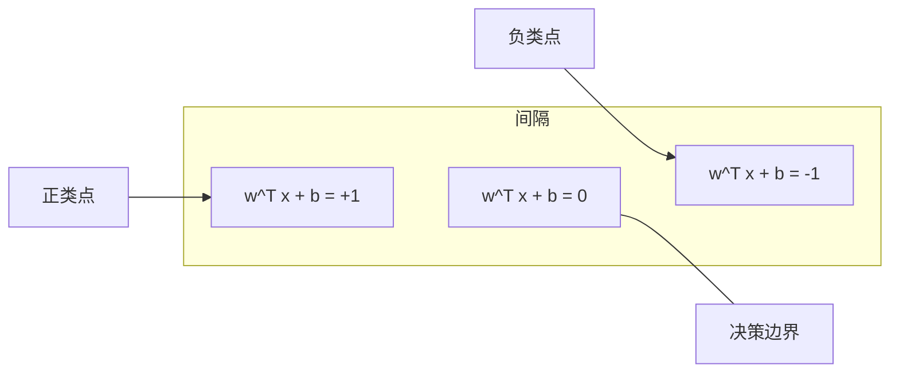
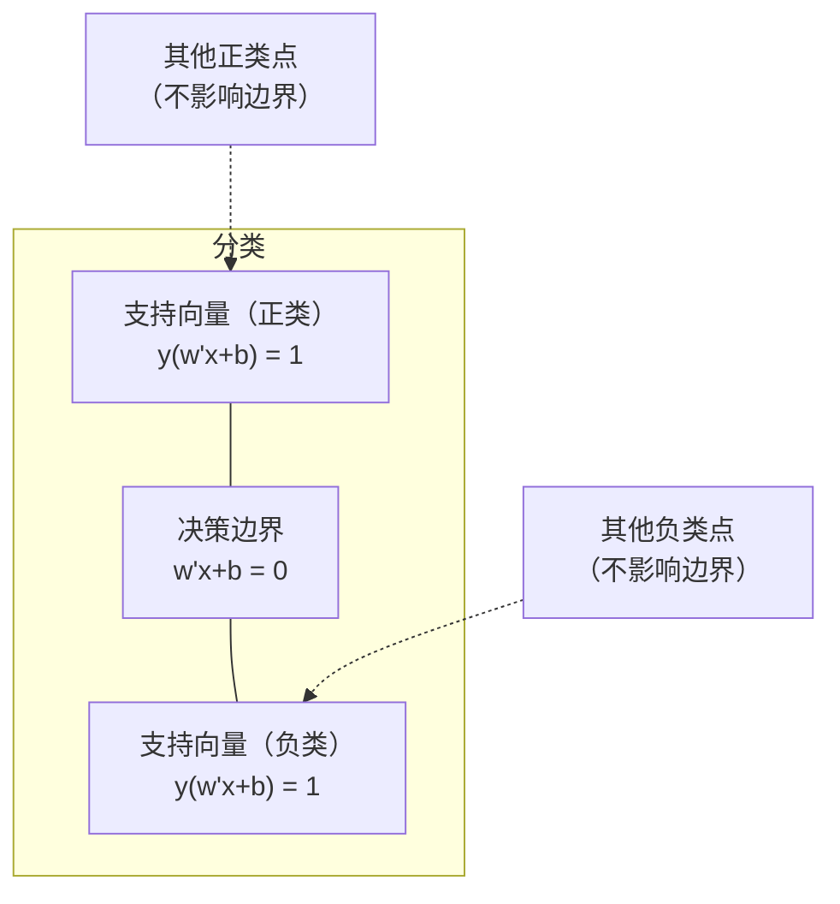
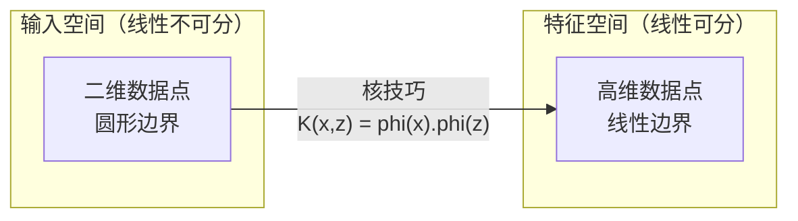

# 支持向量机

> 在两个类别之间找到最宽的那条街。这就是全部的思想。

**类型：** 动手实现
**语言：** Python
**前置知识：** 第一阶段（第08课优化、第14课范数与距离、第18课凸优化）
**预计时间：** 约90分钟

## 学习目标

- 用铰链损失和梯度下降（原始形式）从头实现线性SVM
- 解释最大间隔原理，并从训练好的模型中识别支持向量
- 对比线性核、多项式核和RBF核，说明核技巧如何避免显式映射到高维空间
- 理解参数C在间隔宽度与分类错误之间的权衡作用

## 问题背景

你有两类数据点，需要画一条线（或一个超平面）把它们分开。可以分开的直线有无数条，该选哪条？

选间隔最大的那条。间隔是决策边界到两侧最近数据点的距离。间隔越宽，分类器就越"有把握"，在新数据上的泛化能力也越强。

这个直觉催生了支持向量机——机器学习中数学最优雅的算法之一。SVM曾是深度学习兴起之前最主流的分类方法，时至今日，对于小数据集、高维数据，以及需要有理论保证的可解释模型的场景，它仍然是最佳选择。

SVM与第一阶段的知识直接挂钩：优化是凸的（第18课），间隔用范数度量（第14课），核技巧通过点积在不显式计算高维坐标的情况下处理非线性边界。

## 核心概念

### 最大间隔分类器

给定线性可分的数据，标签 y_i ∈ {-1, +1}，特征向量为 x_i。我们想找一个超平面 w^T x + b = 0 把两类数据分开。

点 x_i 到超平面的距离是：

```
distance = |w^T x_i + b| / ||w||
```

正确分类的点满足：y_i * (w^T x_i + b) > 0。间隔是超平面到两侧最近点距离之和。



优化问题如下：

```
最大化    2 / ||w||     （间隔宽度）
约束条件  y_i * (w^T x_i + b) >= 1  对所有 i
```

等价地（最小化 ||w||^2 更容易优化）：

```
最小化    (1/2) ||w||^2
约束条件  y_i * (w^T x_i + b) >= 1  对所有 i
```

这是一个凸二次规划问题，存在唯一的全局最优解。恰好落在间隔边界上的点（满足 y_i * (w^T x_i + b) = 1）就是**支持向量**。它们是唯一决定决策边界的点——移动或删除任何非支持向量点，边界纹丝不动。

### 支持向量：少数关键点



大多数训练点都是"路人甲"，只有支持向量才重要。这也是SVM在预测阶段内存效率高的原因——你只需要存储支持向量，不用存整个训练集。

支持向量的数量还给出了泛化误差的上界：相对于数据集规模，支持向量越少，泛化能力越强。

### 软间隔：用C参数处理噪声

现实数据很少是完全线性可分的，总会有些点落在错误的一侧，或者落在间隔内部。软间隔通过引入**松弛变量**来允许这些违规情况。

```
最小化    (1/2) ||w||^2 + C * sum(xi_i)
约束条件  y_i * (w^T x_i + b) >= 1 - xi_i
          xi_i >= 0  对所有 i
```

松弛变量 xi_i 衡量第 i 个点违规的程度。C 控制权衡关系：

| C 的取值 | 行为 |
|---------|------|
| C 大 | 对违规惩罚重。间隔窄，误分类少。容易过拟合 |
| C 小 | 允许更多违规。间隔宽，误分类多。容易欠拟合 |

C 是正则化强度的倒数。C 大 = 弱正则化；C 小 = 强正则化。

### 铰链损失：SVM的损失函数

软间隔SVM可以改写成无约束的优化形式：

```
最小化    (1/2) ||w||^2 + C * sum(max(0, 1 - y_i * (w^T x_i + b)))
```

其中 max(0, 1 - y_i * f(x_i)) 就是**铰链损失（Hinge Loss）**。当点被正确分类且在间隔外时，损失为零；当点在间隔内或被误分类时，损失线性增加。

```
单个点的铰链损失：

loss
  |
  | \
  |  \
  |   \
  |    \
  |     \_______________
  |
  +-----|-----|-------->  y * f(x)
       0     1

y*f(x) >= 1 时损失为0（正确分类且在间隔外）
y*f(x) < 1 时线性惩罚
```

对比逻辑回归的损失：

```
铰链损失：   max(0, 1 - y*f(x))          在间隔处硬截断
逻辑损失：   log(1 + exp(-y*f(x)))        平滑，永远不会精确为零
```

铰链损失会产生稀疏解——只有支持向量有非零贡献，其余点不参与计算。逻辑损失则利用所有数据点。这让SVM在预测阶段更节省内存。

### 用梯度下降训练线性SVM

不用解带约束的二次规划，直接对铰链损失加L2正则化做梯度下降就能训练：

```
L(w, b) = (lambda/2) * ||w||^2 + (1/n) * sum(max(0, 1 - y_i * (w^T x_i + b)))

关于 w 的梯度：
  若 y_i * (w^T x_i + b) >= 1：  dL/dw = lambda * w
  若 y_i * (w^T x_i + b) < 1：   dL/dw = lambda * w - y_i * x_i

关于 b 的梯度：
  若 y_i * (w^T x_i + b) >= 1：  dL/db = 0
  若 y_i * (w^T x_i + b) < 1：   dL/db = -y_i
```

这就是**原始形式（Primal Formulation）**。每轮训练的时间复杂度是 O(n * d)，n 是样本数，d 是特征维度。对于高维稀疏数据（比如文本分类），速度非常快。

### 对偶形式与核技巧

SVM问题的拉格朗日对偶（见第一阶段第18课KKT条件）是：

```
最大化    sum(alpha_i) - (1/2) * sum_ij(alpha_i * alpha_j * y_i * y_j * (x_i . x_j))
约束条件  0 <= alpha_i <= C
          sum(alpha_i * y_i) = 0
```

对偶形式里只出现数据点之间的点积 x_i · x_j。这是关键洞察：把每个点积替换成核函数 K(x_i, x_j)，SVM就能学习非线性边界——而且完全不用显式计算那个高维变换。

```
线性核：       K(x, z) = x . z
多项式核：     K(x, z) = (x . z + c)^d
RBF（高斯）核：K(x, z) = exp(-gamma * ||x - z||^2)
```

RBF核把数据映射到无限维空间。在输入空间中距离近的点，核值接近1；距离远的点，核值接近0。它可以拟合任意平滑的决策边界。



核技巧的精妙之处在于：它在高维空间里计算点积，但完全不需要真的去那里。对于 D 维特征的 d 次多项式核，显式展开的特征空间有 O(D^d) 维；但 K(x, z) 的计算只需 O(D) 时间。

### 支持向量回归（SVR）

支持向量回归在数据周围拟合一条宽度为 epsilon 的"管道"。管道内的点损失为零；管道外的点线性惩罚。

```
最小化    (1/2) ||w||^2 + C * sum(xi_i + xi_i*)
约束条件  y_i - (w^T x_i + b) <= epsilon + xi_i
          (w^T x_i + b) - y_i <= epsilon + xi_i*
          xi_i, xi_i* >= 0
```

epsilon 参数控制管道宽度。管道越宽，支持向量越少，拟合越平滑；管道越窄，支持向量越多，拟合越紧密。

### SVM为何输给了深度学习（以及什么时候仍然值得用）

SVM从1990年代末到2010年代初一直主宰着机器学习。深度学习超越它的原因：

| 因素 | SVM | 深度学习 |
|------|-----|----------|
| 特征工程 | 必须手工做 | 自动学习特征 |
| 可扩展性 | 核SVM O(n^2) ~ O(n^3) | SGD每轮 O(n) |
| 图像/文本/音频 | 需要手工特征 | 直接从原始数据学习 |
| 大数据集（>10万） | 很慢 | 扩展性好 |
| GPU加速 | 收益有限 | 巨大加速 |

SVM仍然有优势的场景：
- 小数据集（几百到几千个样本）
- 高维稀疏数据（TF-IDF特征的文本）
- 需要数学保证（间隔界限）
- 训练时间要求极短（线性SVM非常快）
- 具有清晰间隔结构的二分类问题
- 异常检测（单类SVM）

## 动手实现

### 第一步：铰链损失与梯度

基础部分：计算批量数据的铰链损失及其梯度。

```python
def hinge_loss(X, y, w, b):
    n = len(X)
    total_loss = 0.0
    for i in range(n):
        margin = y[i] * (dot(w, X[i]) + b)
        total_loss += max(0.0, 1.0 - margin)
    return total_loss / n
```

### 第二步：用梯度下降训练线性SVM

直接最小化正则化铰链损失，不需要二次规划求解器。

```python
class LinearSVM:
    def __init__(self, lr=0.001, lambda_param=0.01, n_epochs=1000):
        self.lr = lr
        self.lambda_param = lambda_param
        self.n_epochs = n_epochs
        self.w = None
        self.b = 0.0

    def fit(self, X, y):
        n_features = len(X[0])
        self.w = [0.0] * n_features
        self.b = 0.0

        for epoch in range(self.n_epochs):
            for i in range(len(X)):
                margin = y[i] * (dot(self.w, X[i]) + self.b)
                if margin >= 1:
                    self.w = [wj - self.lr * self.lambda_param * wj
                              for wj in self.w]
                else:
                    self.w = [wj - self.lr * (self.lambda_param * wj - y[i] * X[i][j])
                              for j, wj in enumerate(self.w)]
                    self.b -= self.lr * (-y[i])

    def predict(self, X):
        return [1 if dot(self.w, x) + self.b >= 0 else -1 for x in X]
```

### 第三步：核函数

实现线性核、多项式核和RBF核。

```python
def linear_kernel(x, z):
    return dot(x, z)

def polynomial_kernel(x, z, degree=3, c=1.0):
    return (dot(x, z) + c) ** degree

def rbf_kernel(x, z, gamma=0.5):
    diff = [xi - zi for xi, zi in zip(x, z)]
    return math.exp(-gamma * dot(diff, diff))
```

### 第四步：识别间隔与支持向量

训练完成后，找出哪些点是支持向量，并计算间隔宽度。

```python
def find_support_vectors(X, y, w, b, tol=1e-3):
    support_vectors = []
    for i in range(len(X)):
        margin = y[i] * (dot(w, X[i]) + b)
        if abs(margin - 1.0) < tol:
            support_vectors.append(i)
    return support_vectors
```

完整实现（含所有演示代码）见 `code/svm.py`。

## 实际使用

用 scikit-learn：

```python
from sklearn.svm import SVC, LinearSVC, SVR
from sklearn.preprocessing import StandardScaler
from sklearn.pipeline import Pipeline

clf = Pipeline([
    ("scaler", StandardScaler()),
    ("svm", SVC(kernel="rbf", C=1.0, gamma="scale")),
])
clf.fit(X_train, y_train)
print(f"Accuracy: {clf.score(X_test, y_test):.4f}")
print(f"Support vectors: {clf['svm'].n_support_}")
```

注意：训练SVM之前**一定要对特征做标准化**。SVM对特征的量纲非常敏感——因为间隔依赖 ||w||，未标准化的特征会扭曲几何关系。

对于大数据集，用 `LinearSVC`（原始形式，O(n) 每轮）代替 `SVC`（对偶形式，O(n²) ~ O(n³)）：

```python
from sklearn.svm import LinearSVC

clf = Pipeline([
    ("scaler", StandardScaler()),
    ("svm", LinearSVC(C=1.0, max_iter=10000)),
])
```

## 练习

1. 生成一个二维线性可分数据集，训练你的 LinearSVM，识别出支持向量，验证它们确实是离决策边界最近的点。

2. 在一个含噪声的数据集上，把 C 从 0.001 变到 1000，为每个 C 值画出决策边界，观察从宽间隔（欠拟合）到窄间隔（过拟合）的变化过程。

3. 构造一个类别边界是圆形（非线性）的数据集，证明线性SVM无法分类。计算RBF核矩阵，展示在核诱导的特征空间中，两类数据变得线性可分了。

4. 在同一个数据集上对比铰链损失和逻辑损失：分别训练线性SVM和逻辑回归，数一数有多少训练点对每个模型的决策边界有贡献（支持向量 vs 所有点）。

5. 实现SVR（epsilon不敏感损失），用它拟合 y = sin(x) + 噪声，画出预测值周围的epsilon管道，并高亮支持向量（管道外的点）。

## 关键术语

| 术语 | 实际含义 |
|------|----------|
| 支持向量 (Support Vectors) | 离决策边界最近的训练点，也是唯一决定超平面的点 |
| 间隔 (Margin) | 决策边界到最近支持向量的距离，SVM的优化目标就是最大化这个距离 |
| 铰链损失 (Hinge Loss) | max(0, 1 - y*f(x))，正确分类且在间隔外时为零，否则线性惩罚 |
| C 参数 | 间隔宽度与分类错误之间的权衡。C大=间隔窄；C小=间隔宽 |
| 软间隔 (Soft Margin) | 通过引入松弛变量允许间隔违规的SVM形式，可处理线性不可分数据 |
| 核技巧 (Kernel Trick) | 在高维特征空间计算点积，但不显式进行映射 |
| 线性核 (Linear Kernel) | K(x, z) = x · z，等价于标准点积，用于线性可分数据 |
| RBF核 | K(x, z) = exp(-gamma * ‖x-z‖²)，映射到无限维，可学习任意平滑边界 |
| 多项式核 (Polynomial Kernel) | K(x, z) = (x · z + c)^d，映射到多项式组合特征空间 |
| 对偶形式 (Dual Formulation) | 仅依赖数据点间点积的SVM重新表达形式，是使用核技巧的前提 |
| SVR | 支持向量回归，在数据周围拟合epsilon管道，管道内的点损失为零 |
| 松弛变量 (Slack Variables) | xi_i，衡量某点违反间隔的程度，正确分类且在间隔外时为零 |
| 最大间隔 (Maximum Margin) | 选择离两类最近点距离最大的超平面这一原则 |

## 延伸阅读

- [Vapnik：统计学习理论的本质（1995）](https://link.springer.com/book/10.1007/978-1-4757-3264-1) — SVM和统计学习的奠基性著作
- [Cortes & Vapnik：支持向量网络（1995）](https://link.springer.com/article/10.1007/BF00994018) — 原始SVM论文
- [Platt：序列最小优化（1998）](https://www.microsoft.com/en-us/research/publication/sequential-minimal-optimization-a-fast-algorithm-for-training-support-vector-machines/) — 使SVM训练真正可行的SMO算法
- [scikit-learn SVM文档](https://scikit-learn.org/stable/modules/svm.html) — 含实现细节的实用指南
- [LIBSVM：支持向量机库](https://www.csie.ntu.edu.tw/~cjlin/libsvm/) — 大多数SVM实现背后的C++库
