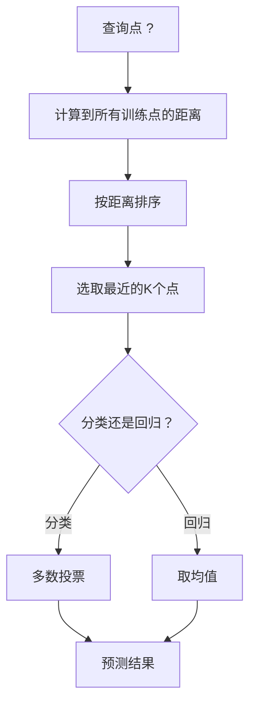
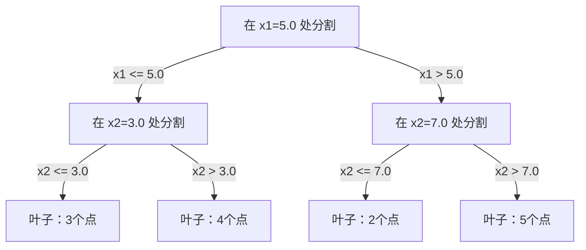

# K近邻与距离度量

> 把所有东西都存起来，预测时看看邻居怎么说。这是真正管用的最简单算法。

**类型：** 动手实现
**语言：** Python
**前置知识：** 第一阶段（第14课范数与距离）
**预计时间：** 约90分钟

## 学习目标

- 从头实现可配置K值和距离加权投票的KNN分类器与回归器
- 对比L1、L2、余弦和Minkowski距离，为不同数据类型选择合适的度量方式
- 解释维度灾难，并演示KNN在高维空间中性能下降的原因
- 构建KD树以实现高效的最近邻搜索，分析它在何时优于暴力搜索

## 问题背景

你有一个数据集，现在来了一个新的数据点，需要对它分类或预测它的值。不同于线性回归或SVM那样从数据中学习参数，KNN的思路更直接：找出训练集中离这个新点最近的K个点，让它们投票。

这就是K近邻（KNN）算法。没有训练阶段，没有要学的参数，没有要最小化的损失函数。你把整个训练集存起来，在预测时计算距离就行了。

听起来简单到不像话。但KNN在很多问题上出人意料地有竞争力，尤其是中小型数据集。深入理解它，能帮你建立几个重要概念：距离度量的选择（对接第一阶段第14课）、维度灾难，以及"惰性学习"与"勤奋学习"的区别。

KNN的身影其实到处都是，只是换了个名字。向量数据库对embedding做KNN搜索，检索增强生成（RAG）找最近的K个文档片段，推荐系统找相似用户或物品——算法都是同一个，只是规模和数据结构不同。

## 核心概念

### KNN的工作原理

给定一组带标签的训练点和一个新的查询点：

1. 计算查询点到数据集每个点的距离
2. 按距离排序
3. 取最近的K个点
4. 分类：K个邻居中多数类的标签
5. 回归：K个邻居的目标值均值（或加权平均）



这就是整个算法，没有拟合，没有梯度下降，没有epoch。

### 如何选择K

K是唯一的超参数，它控制偏差-方差权衡：

| K | 行为 |
|---|------|
| K = 1 | 决策边界跟着每个点走，训练误差为零，方差极高，严重过拟合 |
| K 较小（3-5） | 对局部结构敏感，能捕捉复杂边界 |
| K 较大 | 边界更平滑，对噪声更鲁棒，但可能欠拟合 |
| K = N | 对每个点都预测多数类，偏差最大 |

常用经验起点是 K = sqrt(N)（N 为样本数）。二分类时建议用奇数K，避免平票。


### 距离度量

距离函数定义了什么叫"近"。不同的度量方式会找到不同的邻居，给出不同的预测。

**L2（欧氏距离）**是默认选择，就是直线距离：

```
d(a, b) = sqrt(sum((a_i - b_i)^2))
```

对特征尺度敏感。使用L2配合KNN时，一定要先对特征做标准化。

**L1（曼哈顿距离）**对差值的绝对值求和，比L2对异常值更鲁棒——因为它不平方差值：

```
d(a, b) = sum(|a_i - b_i|)
```

**余弦距离**衡量向量之间的夹角，忽略向量的大小。处理文本和embedding数据时必不可少：

```
d(a, b) = 1 - (a · b) / (||a|| * ||b||)
```

**Minkowski距离**用参数p来统一L1和L2：

```
d(a, b) = (sum(|a_i - b_i|^p))^(1/p)

p=1：曼哈顿距离
p=2：欧氏距离
p→∞：切比雪夫距离（最大绝对差值）
```

怎么选度量方式，取决于数据类型：

| 数据类型 | 推荐度量 | 原因 |
|---------|---------|------|
| 数值特征，尺度相似 | L2（欧氏） | 默认选择，适用于空间数据 |
| 数值特征，有异常值 | L1（曼哈顿） | 不放大大差值，更鲁棒 |
| 文本embedding | 余弦 | 向量大小是噪声，方向是含义 |
| 高维稀疏数据 | 余弦或L1 | L2受维度灾难影响大 |
| 混合类型 | 自定义距离 | 按特征类型组合多种度量 |

### 加权KNN

标准KNN对K个邻居一视同仁。但距离0.1处的邻居应该比距离5.0处的邻居更有发言权。

**距离加权KNN**用距离的倒数作为权重：

```
weight_i = 1 / (distance_i + epsilon)

分类：加权投票
回归：加权平均 = sum(w_i * y_i) / sum(w_i)
```

加上 epsilon 是为了防止查询点与某个训练点完全重合时出现除以零的情况。

加权KNN对K的选择不那么敏感，因为远处的邻居不管K取多少都贡献很小。

### 维度灾难

KNN在高维空间中性能会下降。这不是模糊的担忧，而是有数学依据的。

**问题一：距离趋于相同。** 随着维度增加，最大距离与最小距离之比趋近于1——所有点到查询点的距离几乎一样"远"。

```
在 d 维空间中，对均匀分布的随机点：

d=2：    max_dist / min_dist 变化很大
d=100：  max_dist / min_dist ≈ 1.01
d=1000： max_dist / min_dist ≈ 1.001

当所有距离几乎相等时，"最近邻"这个概念就失去意义了。
```

**问题二：体积爆炸。** 要在固定比例的数据中找到K个邻居，你的搜索半径必须扩展到覆盖越来越大的特征空间比例。高维空间中的"邻域"几乎会覆盖整个空间。

**问题三：角落主导。** 在d维单位超正方体中，绝大多数体积集中在角落，而不是中心。随着d增大，内切球所占的体积比例趋近于零。

实际影响：KNN在大约20-50个特征以内表现良好。超过这个范围，就需要先做降维（PCA、UMAP、t-SNE），再用KNN；或者使用能利用数据内在低维结构的树形搜索结构。

### KD树：高效的最近邻搜索

暴力KNN需要计算查询点到每个训练点的距离，每次查询是 O(n * d)。对大数据集来说太慢了。

KD树沿特征轴递归地划分空间，每一层在某一维度的中位值处分割：



查找最近邻时，先沿树走到包含查询点的叶子节点，然后回溯，只在"有可能包含更近点"的分支上继续搜索。

平均查询时间：低维时是 O(log n)。但在高维（d > 20）时，KD树会退化到 O(n)——因为回溯时几乎排除不了任何分支。

### 球树：适合中等维度

球树把数据划分进嵌套的超球体（而不是轴对齐的矩形盒子）。每个节点定义一个球（中心 + 半径），包含该子树的所有点。

球树相对KD树的优势：
- 在中等维度（最多约50维）中表现更好
- 能处理非轴对齐的结构
- 更紧密的包围体意味着搜索时能剪掉更多分支

KD树和球树都是精确算法。对于真正大规模的搜索（数百万个点、几百维），需要用近似最近邻方法（HNSW、IVF、乘积量化）——这些在第一阶段第14课中有介绍。

### 惰性学习 vs 勤奋学习

KNN是**惰性学习器**：训练时什么都不做，预测时才干活。大多数其他算法（线性回归、SVM、神经网络）是**勤奋学习器**：训练时做大量计算，构建一个紧凑的模型，预测时很快。

| 方面 | 惰性（KNN） | 勤奋（SVM、神经网络） |
|------|-----------|------------------|
| 训练时间 | O(1)，只存数据 | O(n * epochs) |
| 预测时间 | 每次查询 O(n * d) | O(d) 或 O(参数数量) |
| 预测时内存 | 需存整个训练集 | 只存模型参数 |
| 适应新数据 | 直接加点，无需重训 | 需要重新训练模型 |
| 决策边界 | 隐式，查询时实时计算 | 显式，训练后固定 |

惰性学习适合的场景：
- 数据集频繁变化（可随时增删点而不用重训）
- 只需预测极少量查询
- 需要零训练时间
- 数据集足够小，暴力搜索还可以接受

### 用于回归的KNN

不再多数投票，而是对K个邻居的目标值取均值：

```
prediction = (1/K) * sum(y_i for i in K 个最近邻)

带距离加权：
prediction = sum(w_i * y_i) / sum(w_i)
其中 w_i = 1 / distance_i
```

KNN回归的预测是分段常数（加权时分段平滑）。它无法外推到训练数据的范围之外——如果训练目标值全在0到100之间，KNN永远不会预测出200。

## 动手实现

### 第一步：距离函数

实现L1、L2、余弦和Minkowski距离，对应第一阶段第14课的内容。

```python
import math

def l2_distance(a, b):
    return math.sqrt(sum((ai - bi) ** 2 for ai, bi in zip(a, b)))

def l1_distance(a, b):
    return sum(abs(ai - bi) for ai, bi in zip(a, b))

def cosine_distance(a, b):
    dot_val = sum(ai * bi for ai, bi in zip(a, b))
    norm_a = math.sqrt(sum(ai ** 2 for ai in a))
    norm_b = math.sqrt(sum(bi ** 2 for bi in b))
    if norm_a == 0 or norm_b == 0:
        return 1.0
    return 1.0 - dot_val / (norm_a * norm_b)

def minkowski_distance(a, b, p=2):
    if p == float('inf'):
        return max(abs(ai - bi) for ai, bi in zip(a, b))
    return sum(abs(ai - bi) ** p for ai, bi in zip(a, b)) ** (1 / p)
```

### 第二步：KNN分类器和回归器

构建完整的KNN类，支持可配置的K、距离度量和可选的距离加权。

```python
class KNN:
    def __init__(self, k=5, distance_fn=l2_distance, weighted=False,
                 task="classification"):
        self.k = k
        self.distance_fn = distance_fn
        self.weighted = weighted
        self.task = task
        self.X_train = None
        self.y_train = None

    def fit(self, X, y):
        self.X_train = X
        self.y_train = y

    def predict(self, X):
        return [self._predict_one(x) for x in X]
```

### 第三步：KD树高效搜索

从头构建KD树，在每一维的中位值处递归分割：

```python
class KDTree:
    def __init__(self, X, indices=None, depth=0):
        # 递归划分数据
        self.axis = depth % len(X[0])
        # 在当前维度的中位值处分割
        ...

    def query(self, point, k=1):
        # 走到叶子节点，再回溯
        ...
```

完整实现（含所有辅助方法和演示）见 `code/knn.py`。

### 第四步：特征标准化

KNN必须做特征标准化，因为距离对特征量纲非常敏感。一个取值在0到1000之间的特征会完全压制一个取值在0到1之间的特征。

```python
def standardize(X):
    n = len(X)
    d = len(X[0])
    means = [sum(X[i][j] for i in range(n)) / n for j in range(d)]
    stds = [
        max(1e-10, (sum((X[i][j] - means[j]) ** 2 for i in range(n)) / n) ** 0.5)
        for j in range(d)
    ]
    return [[((X[i][j] - means[j]) / stds[j]) for j in range(d)] for i in range(n)], means, stds
```

## 实际使用

用 scikit-learn：

```python
from sklearn.neighbors import KNeighborsClassifier
from sklearn.preprocessing import StandardScaler
from sklearn.pipeline import Pipeline

clf = Pipeline([
    ("scaler", StandardScaler()),
    ("knn", KNeighborsClassifier(n_neighbors=5, metric="euclidean")),
])
clf.fit(X_train, y_train)
print(f"Accuracy: {clf.score(X_test, y_test):.4f}")
```

scikit-learn 会在数据集足够大、维度足够低时自动使用KD树或球树；高维数据则退回暴力搜索。可以用 `algorithm` 参数手动控制。

对于大规模最近邻搜索（数百万个向量），用FAISS、Annoy或向量数据库：

```python
import faiss

index = faiss.IndexFlatL2(dimension)
index.add(embeddings)
distances, indices = index.search(query_vectors, k=5)
```

## 练习

1. 在一个二维三分类数据集上实现KNN分类。画出 K=1、K=5、K=15 和 K=N 的决策边界，观察从过拟合到欠拟合的变化。

2. 在2、5、10、50、100和500维空间中各生成1000个随机点。对每个维度，计算最大两两距离与最小两两距离的比值，画出比值随维度的变化曲线，直观感受维度灾难。

3. 在文本分类任务（使用TF-IDF向量）上对比L1、L2和余弦距离的KNN表现。哪种度量准确率最高？为什么余弦距离在文本上通常胜出？

4. 实现KD树并测量在2维、10维和50维空间中，数据集规模分别为1k、10k和10万时，KD树与暴力搜索的查询时间。在哪个维度KD树不再比暴力搜索快？

5. 为 y = sin(x) + 噪声 构建加权KNN回归器，与未加权KNN在 K=3、10、30 时对比。展示加权版本的预测更平滑，尤其是K较大时。

## 关键术语

| 术语 | 实际含义 |
|------|----------|
| K近邻 (K-Nearest Neighbors) | 非参数算法，通过找训练集中离查询点最近的K个点来预测 |
| 惰性学习 (Lazy Learning) | 训练时不做任何计算，所有工作在预测时发生。KNN是典型代表 |
| 勤奋学习 (Eager Learning) | 训练时做大量计算以构建紧凑模型，大多数ML算法属于此类 |
| 维度灾难 (Curse of Dimensionality) | 在高维空间中，距离趋于相同，邻域扩大到覆盖大部分空间，KNN失效 |
| KD树 (KD-Tree) | 沿特征轴递归划分空间的二叉树，低维时查询 O(log n) |
| 球树 (Ball Tree) | 嵌套超球体构成的树，在中等维度（最多约50维）比KD树效果更好 |
| 加权KNN (Weighted KNN) | 邻居按距离倒数加权，近邻对预测影响更大 |
| 特征标准化 (Feature Scaling) | 将特征归一化到可比较的范围，距离类方法（如KNN）的必要预处理 |
| 多数投票 (Majority Vote) | 以K个邻居中最多的类别作为分类结果 |
| 暴力搜索 (Brute Force Search) | 计算到每个训练点的距离，每次查询 O(n*d)，精确但大规模时很慢 |
| 近似最近邻 (Approximate Nearest Neighbor) | 算法（HNSW、LSH、IVF）能比精确搜索快得多地找到近似最近点 |
| Voronoi图 (Voronoi Diagram) | 空间中每个区域包含离某个训练点比其他所有点都近的查询点。K=1时KNN的决策边界就是Voronoi边界 |

## 延伸阅读

- [Cover & Hart：最近邻模式分类（1967）](https://ieeexplore.ieee.org/document/1053964) — 奠基性KNN论文，证明其误差率最多是贝叶斯最优率的两倍
- [Friedman, Bentley, Finkel：对数期望时间的最佳匹配算法（1977）](https://dl.acm.org/doi/10.1145/355744.355745) — 原始KD树论文
- [Beyer等："最近邻"何时有意义？（1999）](https://link.springer.com/chapter/10.1007/3-540-49257-7_15) — 维度灾难对最近邻影响的形式分析
- [scikit-learn 最近邻文档](https://scikit-learn.org/stable/modules/neighbors.html) — 含算法选择建议的实用指南
- [FAISS：高效相似性搜索库](https://github.com/facebookresearch/faiss) — Meta开发的十亿规模近似最近邻搜索库
