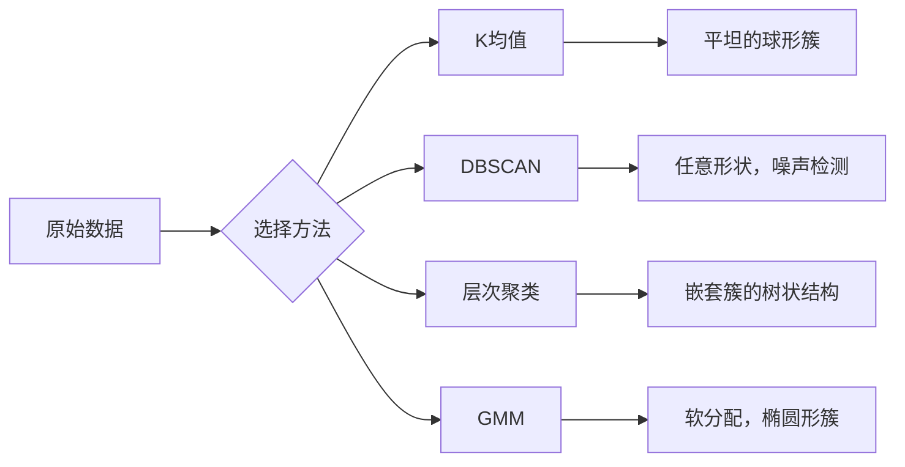

# 无监督学习

> 没有标签，没有老师，算法自己去发现数据里的结构。

**类型：** 动手实现
**语言：** Python
**前置知识：** 第一阶段（范数与距离、概率与分布），第二阶段第1-6课
**预计时间：** 约90分钟

## 学习目标

- 从头实现K均值、DBSCAN和高斯混合模型，对比它们的聚类行为
- 用轮廓分数和肘部法则评估聚类质量，选择最优K值
- 解释DBSCAN在什么情况下优于K均值，以及哪种算法能处理非球形簇和异常值
- 基于聚类方法构建一个异常检测流水线

## 问题背景

前面每一课都假设数据是有标签的："这是输入，这是正确输出。"但现实中，标签往往很贵。医院有数百万份病历，但没人手工给每份贴上疾病分类标签；电商网站有数百万次用户会话，但没人手工标注客户细分；安全团队有海量网络日志，但没人逐条标记异常。

无监督学习不需要被告知"找什么"，它自己找数据里的规律：把相似的点归在一起，发现隐藏结构，把异常浮出水面。如果说监督学习是拿着答案册学课本，无监督学习就是对着一堆原始数据发呆，直到规律自己浮现出来。

有个代价：没有标签，你就不能直接衡量"对不对"。你需要不同的工具来评估算法找到的结构是否有意义。

## 核心概念

### 聚类：把相似的东西归在一起

聚类把每个数据点分配到一个组（簇），使得同组内的点彼此比较相似，不同组的点彼此比较不同。问题在于："相似"是什么意思？



### K均值：最常用的聚类算法

K均值把数据切成恰好K个簇。每个簇有一个质心（重心），每个点属于离它最近的质心。

Lloyd算法步骤：

1. 随机选K个点作为初始质心
2. 把每个数据点分配给最近的质心
3. 重新计算每个质心为其所属点的均值
4. 重复步骤2-3，直到分配不再变化

目标函数（惯性）衡量每个点到其质心的总平方距离。K均值最小化这个值，但只能找到局部最优——不同的初始化可能给出不同结果。

### 选择K

两种标准方法：

**肘部法则：** 对 K = 1, 2, 3, ..., n 分别跑K均值，画出惯性随K的变化曲线，找到"肘点"——增加K之后惯性不再显著下降的转折处。

**轮廓分数：** 对每个点，衡量它与自己簇的相似程度（a）和与最近的其他簇的相似程度（b）。轮廓系数是 (b - a) / max(a, b)，范围从 -1（分配错误）到 +1（聚类效果好）。对所有点取平均就得到全局分数。

### DBSCAN：基于密度的聚类

K均值假设簇是球形的，而且需要你提前指定K。DBSCAN这两个假设都不需要——它把密集区域识别为簇，稀疏区域是簇与簇之间的间隔。

两个参数：
- **eps**：邻域半径
- **min_samples**：构成密集区域所需的最少点数

三种点：
- **核心点（Core Point）**：在eps距离内至少有min_samples个邻居
- **边界点（Border Point）**：在某个核心点的eps范围内，但自身不是核心点
- **噪声点（Noise Point）**：既不是核心点也不是边界点，就是异常值

DBSCAN把在eps范围内互相可达的核心点连成一个簇，边界点加入附近核心点所在的簇，噪声点不属于任何簇。

优点：能发现任意形状的簇，自动确定簇的数量，直接识别异常值。缺点：对密度不均匀的簇处理起来比较困难。

### 层次聚类

构建一棵嵌套簇的树（树状图）。

凝聚（自底向上）方式：
1. 初始时每个点各自为一个簇
2. 合并距离最近的两个簇
3. 重复直到只剩一个簇
4. 在想要的层次截断树状图，得到K个簇

"两个簇之间的距离"可以这样定义：
- **单链接**：两簇中任意两点的最小距离
- **全链接**：两簇中任意两点的最大距离
- **平均链接**：所有点对的平均距离
- **Ward方法**：合并后簇内总方差增量最小的方案

### 高斯混合模型（GMM）

K均值是硬分配——每个点只属于一个簇。GMM是软分配——每个点属于每个簇的概率各是多少。

GMM假设数据由K个高斯分布的混合生成，每个高斯有自己的均值和协方差。EM算法在两步之间交替迭代：

- **E步（期望步）**：计算每个点属于每个高斯的概率
- **M步（最大化步）**：更新每个高斯的均值、协方差和混合权重，最大化数据的似然

GMM可以建模椭圆形簇（不像K均值只能处理球形），也能自然处理簇之间有重叠的情况。

### 什么时候用哪种方法

| 方法 | 适合 | 避免用于 |
|------|------|---------|
| K均值 | 大数据集、球形簇、K已知 | 不规则形状、有异常值 |
| DBSCAN | K未知、任意形状、异常点检测 | 密度不均匀、高维数据 |
| 层次聚类 | 小数据集、需要树状图、K未知 | 大数据集（O(n²)内存） |
| GMM | 有重叠的簇、需要软分配 | 超大数据集、维度过高 |

### 用聚类做异常检测

聚类天然支持异常检测：
- **K均值**：离所有质心都很远的点是异常
- **DBSCAN**：噪声点就是异常
- **GMM**：在所有高斯分布下概率都很低的点是异常

## 动手实现

### 第一步：从头实现K均值

```python
import math
import random


def euclidean_distance(a, b):
    return math.sqrt(sum((ai - bi) ** 2 for ai, bi in zip(a, b)))


def kmeans(data, k, max_iterations=100, seed=42):
    random.seed(seed)
    n_features = len(data[0])

    centroids = random.sample(data, k)

    for iteration in range(max_iterations):
        clusters = [[] for _ in range(k)]
        assignments = []

        for point in data:
            distances = [euclidean_distance(point, c) for c in centroids]
            nearest = distances.index(min(distances))
            clusters[nearest].append(point)
            assignments.append(nearest)

        new_centroids = []
        for cluster in clusters:
            if len(cluster) == 0:
                new_centroids.append(random.choice(data))
                continue
            centroid = [
                sum(point[j] for point in cluster) / len(cluster)
                for j in range(n_features)
            ]
            new_centroids.append(centroid)

        if all(
            euclidean_distance(old, new) < 1e-6
            for old, new in zip(centroids, new_centroids)
        ):
            print(f"  Converged at iteration {iteration + 1}")
            break

        centroids = new_centroids

    return assignments, centroids
```

### 第二步：肘部法则和轮廓分数

```python
def compute_inertia(data, assignments, centroids):
    total = 0.0
    for point, cluster_id in zip(data, assignments):
        total += euclidean_distance(point, centroids[cluster_id]) ** 2
    return total


def silhouette_score(data, assignments):
    n = len(data)
    if n < 2:
        return 0.0

    clusters = {}
    for i, c in enumerate(assignments):
        clusters.setdefault(c, []).append(i)

    if len(clusters) < 2:
        return 0.0

    scores = []
    for i in range(n):
        own_cluster = assignments[i]
        own_members = [j for j in clusters[own_cluster] if j != i]

        if len(own_members) == 0:
            scores.append(0.0)
            continue

        a = sum(euclidean_distance(data[i], data[j]) for j in own_members) / len(own_members)

        b = float("inf")
        for cluster_id, members in clusters.items():
            if cluster_id == own_cluster:
                continue
            avg_dist = sum(euclidean_distance(data[i], data[j]) for j in members) / len(members)
            b = min(b, avg_dist)

        if max(a, b) == 0:
            scores.append(0.0)
        else:
            scores.append((b - a) / max(a, b))

    return sum(scores) / len(scores)


def find_best_k(data, max_k=10):
    print("Elbow method:")
    inertias = []
    for k in range(1, max_k + 1):
        assignments, centroids = kmeans(data, k)
        inertia = compute_inertia(data, assignments, centroids)
        inertias.append(inertia)
        print(f"  K={k}: inertia={inertia:.2f}")

    print("\nSilhouette scores:")
    for k in range(2, max_k + 1):
        assignments, centroids = kmeans(data, k)
        score = silhouette_score(data, assignments)
        print(f"  K={k}: silhouette={score:.4f}")

    return inertias
```

### 第三步：从头实现DBSCAN

```python
def dbscan(data, eps, min_samples):
    n = len(data)
    labels = [-1] * n
    cluster_id = 0

    def region_query(point_idx):
        neighbors = []
        for i in range(n):
            if euclidean_distance(data[point_idx], data[i]) <= eps:
                neighbors.append(i)
        return neighbors

    visited = [False] * n

    for i in range(n):
        if visited[i]:
            continue
        visited[i] = True

        neighbors = region_query(i)

        if len(neighbors) < min_samples:
            labels[i] = -1
            continue

        labels[i] = cluster_id
        seed_set = list(neighbors)
        seed_set.remove(i)

        j = 0
        while j < len(seed_set):
            q = seed_set[j]

            if not visited[q]:
                visited[q] = True
                q_neighbors = region_query(q)
                if len(q_neighbors) >= min_samples:
                    for nb in q_neighbors:
                        if nb not in seed_set:
                            seed_set.append(nb)

            if labels[q] == -1:
                labels[q] = cluster_id

            j += 1

        cluster_id += 1

    return labels
```

### 第四步：高斯混合模型（EM算法）

```python
def gmm(data, k, max_iterations=100, seed=42):
    random.seed(seed)
    n = len(data)
    d = len(data[0])

    indices = random.sample(range(n), k)
    means = [list(data[i]) for i in indices]
    variances = [1.0] * k
    weights = [1.0 / k] * k

    def gaussian_pdf(x, mean, variance):
        d = len(x)
        coeff = 1.0 / ((2 * math.pi * variance) ** (d / 2))
        exponent = -sum((xi - mi) ** 2 for xi, mi in zip(x, mean)) / (2 * variance)
        return coeff * math.exp(max(exponent, -500))

    for iteration in range(max_iterations):
        responsibilities = []
        for i in range(n):
            probs = []
            for j in range(k):
                probs.append(weights[j] * gaussian_pdf(data[i], means[j], variances[j]))
            total = sum(probs)
            if total == 0:
                total = 1e-300
            responsibilities.append([p / total for p in probs])

        old_means = [list(m) for m in means]

        for j in range(k):
            r_sum = sum(responsibilities[i][j] for i in range(n))
            if r_sum < 1e-10:
                continue

            weights[j] = r_sum / n

            for dim in range(d):
                means[j][dim] = sum(
                    responsibilities[i][j] * data[i][dim] for i in range(n)
                ) / r_sum

            variances[j] = sum(
                responsibilities[i][j]
                * sum((data[i][dim] - means[j][dim]) ** 2 for dim in range(d))
                for i in range(n)
            ) / (r_sum * d)
            variances[j] = max(variances[j], 1e-6)

        shift = sum(
            euclidean_distance(old_means[j], means[j]) for j in range(k)
        )
        if shift < 1e-6:
            print(f"  GMM converged at iteration {iteration + 1}")
            break

    assignments = []
    for i in range(n):
        assignments.append(responsibilities[i].index(max(responsibilities[i])))

    return assignments, means, weights, responsibilities
```

### 第五步：生成测试数据并运行

```python
def make_blobs(centers, n_per_cluster=50, spread=0.5, seed=42):
    random.seed(seed)
    data = []
    true_labels = []
    for label, (cx, cy) in enumerate(centers):
        for _ in range(n_per_cluster):
            x = cx + random.gauss(0, spread)
            y = cy + random.gauss(0, spread)
            data.append([x, y])
            true_labels.append(label)
    return data, true_labels


def make_moons(n_samples=200, noise=0.1, seed=42):
    random.seed(seed)
    data = []
    labels = []
    n_half = n_samples // 2
    for i in range(n_half):
        angle = math.pi * i / n_half
        x = math.cos(angle) + random.gauss(0, noise)
        y = math.sin(angle) + random.gauss(0, noise)
        data.append([x, y])
        labels.append(0)
    for i in range(n_half):
        angle = math.pi * i / n_half
        x = 1 - math.cos(angle) + random.gauss(0, noise)
        y = 1 - math.sin(angle) - 0.5 + random.gauss(0, noise)
        data.append([x, y])
        labels.append(1)
    return data, labels


if __name__ == "__main__":
    centers = [[2, 2], [8, 3], [5, 8]]
    data, true_labels = make_blobs(centers, n_per_cluster=50, spread=0.8)

    print("=== K-Means on 3 blobs ===")
    assignments, centroids = kmeans(data, k=3)
    print(f"  Centroids: {[[round(c, 2) for c in cent] for cent in centroids]}")
    sil = silhouette_score(data, assignments)
    print(f"  Silhouette score: {sil:.4f}")

    print("\n=== Elbow Method ===")
    find_best_k(data, max_k=6)

    print("\n=== DBSCAN on 3 blobs ===")
    db_labels = dbscan(data, eps=1.5, min_samples=5)
    n_clusters = len(set(db_labels) - {-1})
    n_noise = db_labels.count(-1)
    print(f"  Found {n_clusters} clusters, {n_noise} noise points")

    print("\n=== GMM on 3 blobs ===")
    gmm_assignments, gmm_means, gmm_weights, _ = gmm(data, k=3)
    print(f"  Means: {[[round(m, 2) for m in mean] for mean in gmm_means]}")
    print(f"  Weights: {[round(w, 3) for w in gmm_weights]}")
    gmm_sil = silhouette_score(data, gmm_assignments)
    print(f"  Silhouette score: {gmm_sil:.4f}")

    print("\n=== DBSCAN on moons (non-spherical clusters) ===")
    moon_data, moon_labels = make_moons(n_samples=200, noise=0.1)
    moon_db = dbscan(moon_data, eps=0.3, min_samples=5)
    n_moon_clusters = len(set(moon_db) - {-1})
    n_moon_noise = moon_db.count(-1)
    print(f"  Found {n_moon_clusters} clusters, {n_moon_noise} noise points")

    print("\n=== K-Means on moons (will fail to separate) ===")
    moon_km, moon_centroids = kmeans(moon_data, k=2)
    moon_sil = silhouette_score(moon_data, moon_km)
    print(f"  Silhouette score: {moon_sil:.4f}")
    print("  K-Means splits moons poorly because they are not spherical")

    print("\n=== Anomaly detection with DBSCAN ===")
    anomaly_data = list(data)
    anomaly_data.append([20.0, 20.0])
    anomaly_data.append([-5.0, -5.0])
    anomaly_data.append([15.0, 0.0])
    anomaly_labels = dbscan(anomaly_data, eps=1.5, min_samples=5)
    anomalies = [
        anomaly_data[i]
        for i in range(len(anomaly_labels))
        if anomaly_labels[i] == -1
    ]
    print(f"  Detected {len(anomalies)} anomalies")
    for a in anomalies[-3:]:
        print(f"    Point {[round(v, 2) for v in a]}")
```

## 实际使用

用 scikit-learn，同样的算法只需一行：

```python
from sklearn.cluster import KMeans, DBSCAN, AgglomerativeClustering
from sklearn.mixture import GaussianMixture
from sklearn.metrics import silhouette_score as sklearn_silhouette

km = KMeans(n_clusters=3, random_state=42).fit(data)
db = DBSCAN(eps=1.5, min_samples=5).fit(data)
agg = AgglomerativeClustering(n_clusters=3).fit(data)
gmm_model = GaussianMixture(n_components=3, random_state=42).fit(data)
```

从头实现的版本让你看清楚这些库在做什么：K均值在分配和重新计算之间交替；DBSCAN从密集种子点向外扩展簇；GMM在期望和最大化之间交替。库版本加了数值稳定性处理、更聪明的初始化（K-Means++）和GPU加速，但核心逻辑是一样的。

## 交付产物

本课产出K均值、DBSCAN和GMM的完整实现，可作为更高级无监督学习方法的基础。

## 练习

1. 实现K-Means++初始化：第一个质心随机选，后续每个质心的选择概率正比于它到最近已有质心的平方距离。与随机初始化比较收敛速度。

2. 在代码中添加层次凝聚聚类，实现Ward链接方式，产出树状图（用嵌套合并列表表示）。在不同层次截断，与K均值结果对比。

3. 构建一个简单的异常检测流水线：对同一数据分别跑DBSCAN和GMM，标记两种方法都认为是异常的点（DBSCAN的噪声点 + GMM的低概率点）。测量两者的重叠度，讨论两者不一致时是什么情况。

## 关键术语

| 术语 | 通常的说法 | 实际含义 |
|------|-----------|----------|
| 聚类 (Clustering) | "把相似的东西分组" | 把数据划分成子集，使得组内相似度超过组间相似度，相似度由特定距离度量衡量 |
| 质心 (Centroid) | "簇的中心" | 所有被分配到该簇的点的均值，K均值用质心代表一个簇 |
| 惯性 (Inertia) | "簇有多紧" | 每个点到其质心的平方距离之和，越小说明簇越紧凑 |
| 轮廓分数 (Silhouette Score) | "簇分得有多开" | 对每个点，(b - a) / max(a, b)，a是簇内平均距离，b是到最近其他簇的平均距离 |
| 核心点 (Core Point) | "密集区域中的点" | 在DBSCAN中，eps距离内至少有min_samples个邻居的点 |
| EM算法 (EM Algorithm) | "软K均值" | 期望最大化算法：交替计算成员概率（E步）和更新分布参数（M步） |
| 树状图 (Dendrogram) | "簇的树" | 展示层次聚类中簇合并顺序和距离的树形图 |
| 异常值 (Anomaly) | "离群点" | 不符合预期规律的数据点，在DBSCAN中是噪声点，在GMM中是低概率点 |

## 延伸阅读

- [Stanford CS229 - 无监督学习](https://cs229.stanford.edu/notes2022fall/main_notes.pdf) — Andrew Ng关于聚类和EM的讲义
- [scikit-learn 聚类指南](https://scikit-learn.org/stable/modules/clustering.html) — 所有聚类算法的实用对比，含可视化示例
- [DBSCAN原始论文（Ester等，1996）](https://www.aaai.org/Papers/KDD/1996/KDD96-037.pdf) — 提出基于密度聚类的论文
