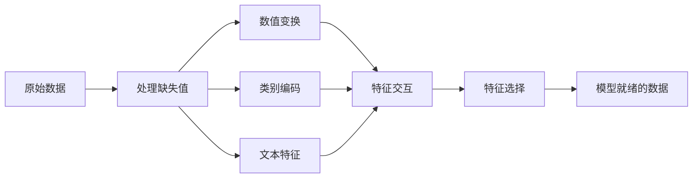

# 特征工程与特征选择

> 一个好特征，胜过一千个数据点。

**类型：** 动手实现
**语言：** Python
**前置知识：** 第一阶段（面向ML的统计学、线性代数），第二阶段第1-7课
**预计时间：** 约90分钟

## 学习目标

- 实现数值变换（标准化、最小-最大缩放、对数变换、分箱），并解释各自的适用场景
- 构建类别特征的独热编码、标签编码和目标编码，识别目标编码中的数据泄露风险
- 从头构建TF-IDF向量化器，解释它为何在文本分类上优于原始词频统计
- 应用基于过滤的特征选择（方差阈值、相关性、互信息）来降低维度

## 问题背景

你有一个数据集，选了一个算法，训练了模型，结果平平无奇。换了个更复杂的算法，还是差不多。花了一周调超参数，改善微乎其微。

然后有个人把原始数据转换成更好的特征，用一个简单的逻辑回归就打败了你精心调过的梯度提升集成模型。

这种事经常发生。在传统机器学习中，数据的表示方式比算法的选择更重要。一个用"建筑面积"和"卧室数量"的房价模型，会击败用"原始地址字符串"的模型，无论后者用多复杂的学习器。算法只能用你给它的东西。

特征工程是把原始数据转换成让模型更容易找到规律的表示形式的过程；特征选择是去掉那些只会带来噪声、没有信号的特征的过程。两者合起来，是传统机器学习中杠杆最高的活动。

## 核心概念

### 特征处理流水线



### 数值特征

原始数字很少能直接送进模型。常用变换：

**缩放：** 把特征放到同一量级，这样基于距离的算法（K均值、KNN、SVM）才能公平对待所有特征。最小-最大缩放映射到 [0, 1]；标准化（z分数）映射到均值=0、标准差=1。

**对数变换：** 压缩右偏分布（收入、人口、词频）。把乘法关系变成加法关系，让线性模型更容易处理。

**分箱：** 把连续值转成类别。适用于特征与目标之间是阶梯式非线性关系的场景（比如年龄段）。

**多项式特征：** 生成 x²、x³、x1*x2 等项。让线性模型能捕捉非线性关系，代价是特征数量增加。

### 类别特征

模型需要数字，类别需要编码。

**独热编码（One-Hot Encoding）：** 为每个类别创建一列二值特征。"颜色 = 红/蓝/绿" 变成三列：是否红、是否蓝、是否绿。低基数特征效果好，但类别很多时会爆炸式增长。

**标签编码（Label Encoding）：** 把每个类别映射成整数：红=0，蓝=1，绿=2。但这引入了虚假的顺序关系（模型可能认为绿 > 蓝 > 红）。只适合树模型，因为树是按单个值分裂的。

**目标编码（Target Encoding）：** 用该类别对应目标变量的均值来替换这个类别。效果强，但有风险：极容易造成数据泄露。必须只在训练数据上计算，再应用到测试数据。

### 文本特征

**词频向量（Count Vectorizer）：** 统计每个词在文档中出现的次数。"the cat sat on the mat" 变成 {the: 2, cat: 1, sat: 1, on: 1, mat: 1}。

**TF-IDF：** 词频-逆文档频率。按词在整个文档集合中的独特性来加权。像 "the" 这样的常见词权重很低；稀有的、有区分度的词权重很高。

```
TF(词, 文档) = 词在文档中出现次数 / 文档总词数
IDF(词) = log(总文档数 / 包含该词的文档数)
TF-IDF = TF * IDF
```

### 缺失值处理

真实数据总有空洞。处理策略：

- **删除行：** 只在缺失数据量少且随机缺失时适用
- **均值/中位数填充：** 简单，保持分布形状（中位数对异常值更鲁棒）
- **众数填充：** 适用于类别特征
- **缺失指示列：** 在填充之前先加一列"该字段是否缺失"的二值列——数据缺失本身可能就是有价值的信息
- **前向/后向填充：** 适用于时间序列数据

### 特征交互

有时候，关系藏在组合里。"身高"和"体重"单独预测效果有限，但 "BMI = 体重 / 身高²" 更有预测力。特征交互会乘上特征空间，所以要用领域知识挑选有意义的组合。

### 特征选择

特征越多不一定越好。无关特征会引入噪声，增加训练时间，还可能导致过拟合。

**过滤方法（模型无关，提前做）：**
- 相关性：删除互相高度相关的特征（冗余）
- 互信息：衡量知道某个特征后，对目标变量的不确定性减少了多少
- 方差阈值：删除几乎不变化的特征

**包装方法（依赖模型）：**
- L1正则化（Lasso）：把无关特征的权重精确压到零
- 递归特征消除：训练，删除最不重要的特征，重复

**为什么选择很重要：** 10个好特征的模型，通常会打败10个好特征加90个噪声特征的模型。噪声特征给了模型更多过拟合训练数据中无法泛化的机会。

## 动手实现

### 第一步：从头实现数值变换

```python
import math


def min_max_scale(values):
    min_val = min(values)
    max_val = max(values)
    if max_val == min_val:
        return [0.0] * len(values)
    return [(v - min_val) / (max_val - min_val) for v in values]


def standardize(values):
    n = len(values)
    mean = sum(values) / n
    variance = sum((v - mean) ** 2 for v in values) / n
    std = math.sqrt(variance) if variance > 0 else 1.0
    return [(v - mean) / std for v in values]


def log_transform(values):
    return [math.log(v + 1) for v in values]


def bin_values(values, n_bins=5):
    min_val = min(values)
    max_val = max(values)
    bin_width = (max_val - min_val) / n_bins
    if bin_width == 0:
        return [0] * len(values)
    result = []
    for v in values:
        bin_idx = int((v - min_val) / bin_width)
        bin_idx = min(bin_idx, n_bins - 1)
        result.append(bin_idx)
    return result


def polynomial_features(row, degree=2):
    n = len(row)
    result = list(row)
    if degree >= 2:
        for i in range(n):
            result.append(row[i] ** 2)
        for i in range(n):
            for j in range(i + 1, n):
                result.append(row[i] * row[j])
    return result
```

### 第二步：从头实现类别编码

```python
def one_hot_encode(values):
    categories = sorted(set(values))
    cat_to_idx = {cat: i for i, cat in enumerate(categories)}
    n_cats = len(categories)

    encoded = []
    for v in values:
        row = [0] * n_cats
        row[cat_to_idx[v]] = 1
        encoded.append(row)

    return encoded, categories


def label_encode(values):
    categories = sorted(set(values))
    cat_to_int = {cat: i for i, cat in enumerate(categories)}
    return [cat_to_int[v] for v in values], cat_to_int


def target_encode(feature_values, target_values, smoothing=10):
    global_mean = sum(target_values) / len(target_values)

    category_stats = {}
    for feat, target in zip(feature_values, target_values):
        if feat not in category_stats:
            category_stats[feat] = {"sum": 0.0, "count": 0}
        category_stats[feat]["sum"] += target
        category_stats[feat]["count"] += 1

    encoding = {}
    for cat, stats in category_stats.items():
        cat_mean = stats["sum"] / stats["count"]
        weight = stats["count"] / (stats["count"] + smoothing)
        encoding[cat] = weight * cat_mean + (1 - weight) * global_mean

    return [encoding[v] for v in feature_values], encoding
```

### 第三步：从头实现文本特征

```python
def count_vectorize(documents):
    vocab = {}
    idx = 0
    for doc in documents:
        for word in doc.lower().split():
            if word not in vocab:
                vocab[word] = idx
                idx += 1

    vectors = []
    for doc in documents:
        vec = [0] * len(vocab)
        for word in doc.lower().split():
            vec[vocab[word]] += 1
        vectors.append(vec)

    return vectors, vocab


def tfidf(documents):
    n_docs = len(documents)

    vocab = {}
    idx = 0
    for doc in documents:
        for word in doc.lower().split():
            if word not in vocab:
                vocab[word] = idx
                idx += 1

    doc_freq = {}
    for doc in documents:
        seen = set()
        for word in doc.lower().split():
            if word not in seen:
                doc_freq[word] = doc_freq.get(word, 0) + 1
                seen.add(word)

    vectors = []
    for doc in documents:
        words = doc.lower().split()
        word_count = len(words)
        tf_map = {}
        for word in words:
            tf_map[word] = tf_map.get(word, 0) + 1

        vec = [0.0] * len(vocab)
        for word, count in tf_map.items():
            tf = count / word_count
            idf = math.log(n_docs / doc_freq[word])
            vec[vocab[word]] = tf * idf
        vectors.append(vec)

    return vectors, vocab
```

### 第四步：从头实现缺失值填充

```python
def impute_mean(values):
    present = [v for v in values if v is not None]
    if not present:
        return [0.0] * len(values), 0.0
    mean = sum(present) / len(present)
    return [v if v is not None else mean for v in values], mean


def impute_median(values):
    present = sorted(v for v in values if v is not None)
    if not present:
        return [0.0] * len(values), 0.0
    n = len(present)
    if n % 2 == 0:
        median = (present[n // 2 - 1] + present[n // 2]) / 2
    else:
        median = present[n // 2]
    return [v if v is not None else median for v in values], median


def impute_mode(values):
    present = [v for v in values if v is not None]
    if not present:
        return values, None
    counts = {}
    for v in present:
        counts[v] = counts.get(v, 0) + 1
    mode = max(counts, key=counts.get)
    return [v if v is not None else mode for v in values], mode


def add_missing_indicator(values):
    return [0 if v is not None else 1 for v in values]
```

### 第五步：从头实现特征选择

```python
def correlation(x, y):
    n = len(x)
    mean_x = sum(x) / n
    mean_y = sum(y) / n
    cov = sum((xi - mean_x) * (yi - mean_y) for xi, yi in zip(x, y)) / n
    std_x = math.sqrt(sum((xi - mean_x) ** 2 for xi in x) / n)
    std_y = math.sqrt(sum((yi - mean_y) ** 2 for yi in y) / n)
    if std_x == 0 or std_y == 0:
        return 0.0
    return cov / (std_x * std_y)


def mutual_information(feature, target, n_bins=10):
    feat_min = min(feature)
    feat_max = max(feature)
    bin_width = (feat_max - feat_min) / n_bins if feat_max != feat_min else 1.0
    feat_binned = [
        min(int((f - feat_min) / bin_width), n_bins - 1) for f in feature
    ]

    n = len(feature)
    target_classes = sorted(set(target))

    feat_bins = sorted(set(feat_binned))
    p_feat = {}
    for b in feat_bins:
        p_feat[b] = feat_binned.count(b) / n

    p_target = {}
    for t in target_classes:
        p_target[t] = target.count(t) / n

    mi = 0.0
    for b in feat_bins:
        for t in target_classes:
            joint_count = sum(
                1 for fb, tv in zip(feat_binned, target) if fb == b and tv == t
            )
            p_joint = joint_count / n
            if p_joint > 0:
                mi += p_joint * math.log(p_joint / (p_feat[b] * p_target[t]))

    return mi


def variance_threshold(features, threshold=0.01):
    n_features = len(features[0])
    n_samples = len(features)
    selected = []

    for j in range(n_features):
        col = [features[i][j] for i in range(n_samples)]
        mean = sum(col) / n_samples
        var = sum((v - mean) ** 2 for v in col) / n_samples
        if var >= threshold:
            selected.append(j)

    return selected


def remove_correlated(features, threshold=0.9):
    n_features = len(features[0])
    n_samples = len(features)

    to_remove = set()
    for i in range(n_features):
        if i in to_remove:
            continue
        col_i = [features[r][i] for r in range(n_samples)]
        for j in range(i + 1, n_features):
            if j in to_remove:
                continue
            col_j = [features[r][j] for r in range(n_samples)]
            corr = abs(correlation(col_i, col_j))
            if corr >= threshold:
                to_remove.add(j)

    return [i for i in range(n_features) if i not in to_remove]
```

### 第六步：完整流水线与演示

```python
import random


def make_housing_data(n=200, seed=42):
    random.seed(seed)
    data = []
    for _ in range(n):
        sqft = random.uniform(500, 5000)
        bedrooms = random.choice([1, 2, 3, 4, 5])
        age = random.uniform(0, 50)
        neighborhood = random.choice(["downtown", "suburbs", "rural"])
        has_pool = random.choice([True, False])

        sqft_with_missing = sqft if random.random() > 0.05 else None
        age_with_missing = age if random.random() > 0.08 else None

        price = (
            50 * sqft
            + 20000 * bedrooms
            - 1000 * age
            + (50000 if neighborhood == "downtown" else 10000 if neighborhood == "suburbs" else 0)
            + (15000 if has_pool else 0)
            + random.gauss(0, 20000)
        )

        data.append({
            "sqft": sqft_with_missing,
            "bedrooms": bedrooms,
            "age": age_with_missing,
            "neighborhood": neighborhood,
            "has_pool": has_pool,
            "price": price,
        })
    return data


if __name__ == "__main__":
    data = make_housing_data(200)

    print("=== Raw Data Sample ===")
    for row in data[:3]:
        print(f"  {row}")

    sqft_raw = [d["sqft"] for d in data]
    age_raw = [d["age"] for d in data]
    prices = [d["price"] for d in data]

    print("\n=== Missing Value Handling ===")
    sqft_missing = sum(1 for v in sqft_raw if v is None)
    age_missing = sum(1 for v in age_raw if v is None)
    print(f"  sqft missing: {sqft_missing}/{len(sqft_raw)}")
    print(f"  age missing: {age_missing}/{len(age_raw)}")

    sqft_indicator = add_missing_indicator(sqft_raw)
    age_indicator = add_missing_indicator(age_raw)
    sqft_imputed, sqft_fill = impute_median(sqft_raw)
    age_imputed, age_fill = impute_mean(age_raw)
    print(f"  sqft filled with median: {sqft_fill:.0f}")
    print(f"  age filled with mean: {age_fill:.1f}")

    print("\n=== Numerical Transforms ===")
    sqft_scaled = standardize(sqft_imputed)
    age_scaled = min_max_scale(age_imputed)
    sqft_log = log_transform(sqft_imputed)
    age_binned = bin_values(age_imputed, n_bins=5)
    print(f"  sqft standardized: mean={sum(sqft_scaled)/len(sqft_scaled):.4f}, std={math.sqrt(sum(v**2 for v in sqft_scaled)/len(sqft_scaled)):.4f}")
    print(f"  age min-max: [{min(age_scaled):.2f}, {max(age_scaled):.2f}]")
    print(f"  age bins: {sorted(set(age_binned))}")

    print("\n=== Categorical Encoding ===")
    neighborhoods = [d["neighborhood"] for d in data]

    ohe, ohe_cats = one_hot_encode(neighborhoods)
    print(f"  One-hot categories: {ohe_cats}")
    print(f"  Sample encoding: {neighborhoods[0]} -> {ohe[0]}")

    le, le_map = label_encode(neighborhoods)
    print(f"  Label encoding map: {le_map}")

    te, te_map = target_encode(neighborhoods, prices, smoothing=10)
    print(f"  Target encoding: {({k: round(v) for k, v in te_map.items()})}")

    print("\n=== Text Features ===")
    descriptions = [
        "large modern house with pool",
        "small cozy cottage near downtown",
        "spacious family home with large yard",
        "modern apartment downtown with view",
        "rustic cabin in rural area",
    ]
    cv, cv_vocab = count_vectorize(descriptions)
    print(f"  Vocabulary size: {len(cv_vocab)}")
    print(f"  Doc 0 non-zero features: {sum(1 for v in cv[0] if v > 0)}")

    tf, tf_vocab = tfidf(descriptions)
    print(f"  TF-IDF vocabulary size: {len(tf_vocab)}")
    top_words = sorted(tf_vocab.keys(), key=lambda w: tf[0][tf_vocab[w]], reverse=True)[:3]
    print(f"  Doc 0 top TF-IDF words: {top_words}")

    print("\n=== Polynomial Features ===")
    sample_row = [sqft_scaled[0], age_scaled[0]]
    poly = polynomial_features(sample_row, degree=2)
    print(f"  Input: {[round(v, 4) for v in sample_row]}")
    print(f"  Polynomial: {[round(v, 4) for v in poly]}")
    print(f"  Features: [x1, x2, x1^2, x2^2, x1*x2]")

    print("\n=== Feature Selection ===")
    feature_matrix = [
        [sqft_scaled[i], age_scaled[i], float(sqft_indicator[i]), float(age_indicator[i])]
        + ohe[i]
        for i in range(len(data))
    ]

    print(f"  Total features: {len(feature_matrix[0])}")

    surviving_var = variance_threshold(feature_matrix, threshold=0.01)
    print(f"  After variance threshold (0.01): {len(surviving_var)} features kept")

    surviving_corr = remove_correlated(feature_matrix, threshold=0.9)
    print(f"  After correlation filter (0.9): {len(surviving_corr)} features kept")

    binary_prices = [1 if p > sum(prices) / len(prices) else 0 for p in prices]
    print("\n  Mutual information with target:")
    feature_names = ["sqft", "age", "sqft_missing", "age_missing"] + [f"neigh_{c}" for c in ohe_cats]
    for j in range(len(feature_matrix[0])):
        col = [feature_matrix[i][j] for i in range(len(feature_matrix))]
        mi = mutual_information(col, binary_prices, n_bins=10)
        print(f"    {feature_names[j]}: MI={mi:.4f}")

    print("\n  Correlation with price:")
    for j in range(len(feature_matrix[0])):
        col = [feature_matrix[i][j] for i in range(len(feature_matrix))]
        corr = correlation(col, prices)
        print(f"    {feature_names[j]}: r={corr:.4f}")
```

## 实际使用

用 scikit-learn，这些变换可以组合成流水线：

```python
from sklearn.preprocessing import StandardScaler, OneHotEncoder, PolynomialFeatures
from sklearn.impute import SimpleImputer
from sklearn.feature_extraction.text import TfidfVectorizer
from sklearn.feature_selection import mutual_info_classif, VarianceThreshold
from sklearn.compose import ColumnTransformer
from sklearn.pipeline import Pipeline

numeric_pipe = Pipeline([
    ("imputer", SimpleImputer(strategy="median")),
    ("scaler", StandardScaler()),
])

categorical_pipe = Pipeline([
    ("encoder", OneHotEncoder(sparse_output=False)),
])

preprocessor = ColumnTransformer([
    ("num", numeric_pipe, ["sqft", "age"]),
    ("cat", categorical_pipe, ["neighborhood"]),
])
```

从头实现的版本让你看清楚每个变换内部发生了什么。库版本在此基础上加了边界情况处理、稀疏矩阵支持和流水线组合，但数学逻辑是一样的。

## 交付产物

本课产出：
- `outputs/prompt-feature-engineer.md` — 一个从原始数据系统地进行特征工程的提示词模板

## 练习

1. 在数值变换中加入鲁棒缩放（用中位数和四分位距代替均值和标准差）。在含极端异常值的数据上，把它和标准缩放进行对比。

2. 实现留一法目标编码：对每一行，计算目标均值时排除该行自身的目标值。证明这比朴素目标编码更不容易过拟合。

3. 构建一个自动特征选择流水线，依次做方差阈值过滤、相关性过滤和互信息排序。在房价数据集上，对比用全部特征和选择后特征训练简单线性回归的性能差异。

## 关键术语

| 术语 | 通常的说法 | 实际含义 |
|------|-----------|----------|
| 特征工程 (Feature Engineering) | "制造新列" | 将原始数据转换成能让模型更容易发现规律的表示形式 |
| 标准化 (Standardization) | "让它变正态" | 减去均值再除以标准差，使特征变成均值=0、标准差=1的分布 |
| 独热编码 (One-Hot Encoding) | "制作哑变量" | 为每个类别创建一列二值列，每行中恰好有一列为1 |
| 目标编码 (Target Encoding) | "用答案来编码" | 用该类别对应的目标变量均值替换该类别，加平滑防止过拟合 |
| TF-IDF | "高级词频统计" | 词频乘以逆文档频率：按词在语料库中的区分度加权 |
| 填充 (Imputation) | "填空" | 用估计值（均值、中位数、众数或模型预测）替换缺失值 |
| 特征选择 (Feature Selection) | "扔掉坏列" | 删除带来噪声或冗余的特征，只保留对目标有价值的那些 |
| 互信息 (Mutual Information) | "一件事告诉你多少关于另一件事" | 通过观察变量X，对变量Y不确定性的减少量度量 |
| 数据泄露 (Data Leakage) | "意外作弊" | 训练时用了预测阶段本不该有的信息，导致虚高的乐观结果 |

## 延伸阅读

- [特征工程与选择（Max Kuhn & Kjell Johnson）](http://www.feat.engineering/) — 免费在线书，全面覆盖特征工程的方方面面
- [scikit-learn 预处理指南](https://scikit-learn.org/stable/modules/preprocessing.html) — 所有标准变换的实用参考
- [目标编码的正确做法（Micci-Barreca，2001）](https://dl.acm.org/doi/10.1145/507533.507538) — 带平滑的目标编码原始论文
