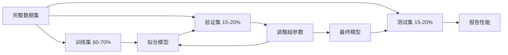

# 模型评估

> 模型好不好，取决于你怎么衡量它。

**类型：** 动手实现
**语言：** Python
**前置知识：** 第一阶段（概率与分布、面向ML的统计学），第二阶段第1-8课
**预计时间：** 约90分钟

## 学习目标

- 从头实现K折和分层K折交叉验证，解释为什么分层对不平衡数据很重要
- 从头计算精确率、召回率、F1、AUC-ROC，以及回归指标（MSE、RMSE、MAE、R²）
- 通过学习曲线诊断模型是高偏差还是高方差
- 识别常见的评估陷阱：数据泄露、指标选错、测试集被污染

## 问题背景

你训练了一个模型，在数据上达到了95%的准确率。这是好模型吗？

不一定。如果95%的数据属于同一个类别，那么一个永远预测该类别的模型就能达到95%准确率，但它毫无用处。如果你在训练数据上评估，95%这个数字毫无意义，因为模型只是把答案背下来了。如果数据有时间顺序，却随机打乱后再分割，你的模型可能在用"未来"的数据预测"过去"。

模型评估是大多数机器学习项目翻车的地方。指标选错会让烂模型看起来很好；分割方式不对会让模型作弊；比较方法不对会让你选出更差的模型。把评估做对不是可选项，而是决定模型能不能在真实场景中落地的关键。

## 核心概念

### 训练集、验证集、测试集



三个分割，三个用途：

- **训练集**：模型从这里学习，这些样本在训练过程中被看到
- **验证集**：用于调超参数、在不同模型间做选择。模型不在这上面训练，但你的决策会受它影响
- **测试集**：在最后才动一次，报告最终性能。如果你看了测试集的表现再回头改模型，它就不再是测试集，而变成了第二个验证集

测试集是你对"报告的性能能反映真实新数据上的表现"这一承诺的保证。

### K折交叉验证

数据量小时，单次训练/验证分割会浪费数据，估计值也不稳定。K折交叉验证让所有数据都能同时用于训练和验证：


1. 把数据分成K等份
2. 每次用K-1份训练，剩余1份验证
3. 对K次验证分数取平均

K=5或K=10是常用选择。每个数据点恰好被用于验证一次。平均分数比任何单次分割都更稳定。

**分层K折**：保持每折中的类别比例与原始数据一致。如果数据集是70%类A、30%类B，每折都保持大致相同的比例。对于不平衡数据集，随机分割可能把所有少数类样本都集中在某一折，分层K折可以避免这个问题。

### 分类指标

**混淆矩阵**是基础。对于二分类：

|  | 预测为正 | 预测为负 |
|--|---------|---------|
| 实际为正 | 真正例 (TP) | 假负例 (FN) |
| 实际为负 | 假正例 (FP) | 真负例 (TN) |

由这个矩阵推导出所有其他指标：

- **准确率（Accuracy）** = (TP + TN) / (TP + TN + FP + FN)。正确预测的比例。类别不平衡时会产生误导。
- **精确率（Precision）** = TP / (TP + FP)。所有预测为正的样本中，真正是正的有多少？当假正例代价高时用这个（比如垃圾邮件过滤器误判正常邮件）。
- **召回率（Recall，灵敏度）** = TP / (TP + FN)。所有真正为正的样本中，我们找到了多少？当假负例代价高时用这个（比如癌症筛查漏诊）。
- **F1分数** = 2 * 精确率 * 召回率 / (精确率 + 召回率)。精确率和召回率的调和平均。当两者都重要且没有明显主次时使用。
- **AUC-ROC**：受试者工作特征曲线下面积。在各个分类阈值下绘制真正例率（召回率）对假正例率的曲线。AUC = 0.5 意味着随机猜测，AUC = 1.0 意味着完美分离。与阈值无关：它衡量的是模型把正例排在负例前面的能力，与你选哪个截断点无关。

### 回归指标

- **MSE（均方误差）** = mean((y_true - y_pred)²)。对大误差进行平方惩罚，对异常值敏感。
- **RMSE（均方根误差）** = sqrt(MSE)。与目标变量同单位，比MSE更直观。
- **MAE（平均绝对误差）** = mean(|y_true - y_pred|)。对所有误差线性对待，比MSE对异常值更鲁棒。
- **R²（决定系数）** = 1 - SS_res / SS_tot，其中 SS_res = sum((y_true - y_pred)²)，SS_tot = sum((y_true - y_mean)²)。模型解释的方差比例。R²=1.0 完美，R²=0.0 意味着模型和总是预测均值一样差，R²可以为负（比总是预测均值还差）。

### 学习曲线

把训练集和验证集的分数画成训练集大小的函数：

- **高偏差（欠拟合）**：两条曲线都收敛到一个较低的分数。加更多数据没用，你需要更复杂的模型。
- **高方差（过拟合）**：训练分数高，验证分数明显低，两者差距大。加更多数据应该能帮上忙。

### 验证曲线

把训练集和验证集的分数画成某个超参数的函数：

- 复杂度低：两个分数都低（欠拟合）
- 复杂度合适：两个分数都高，且接近
- 复杂度高：训练分数保持高位，验证分数下滑（过拟合）

最优超参数值在验证分数达到峰值的地方。

### 常见评估错误

**数据泄露**：测试集的信息渗漏到了训练过程中。例如：在分割之前对整个数据集拟合缩放器；时间序列预测中包含了未来数据；使用了从目标变量派生的特征。原则：先分割，再预处理。

**类别不平衡**：99%的交易是正常的，1%是欺诈。一个总是预测"正常"的模型能达到99%准确率——改用精确率、召回率、F1或AUC-ROC。

**指标选错**：应该优化召回率（医疗诊断）却在优化准确率；或者数据有大量异常值应该用MAE却用了RMSE。

**没有使用分层分割**：对于不平衡数据，随机分割可能让验证折里的少数类样本极少，导致估计不稳定。

**测试次数太多**：每次看测试性能再做调整，你都在向测试集过拟合。测试集只能用一次。

## 动手实现

### 第一步：训练/验证/测试分割

```python
import random
import math


def train_val_test_split(X, y, train_ratio=0.6, val_ratio=0.2, seed=42):
    random.seed(seed)
    n = len(X)
    indices = list(range(n))
    random.shuffle(indices)

    train_end = int(n * train_ratio)
    val_end = int(n * (train_ratio + val_ratio))

    train_idx = indices[:train_end]
    val_idx = indices[train_end:val_end]
    test_idx = indices[val_end:]

    X_train = [X[i] for i in train_idx]
    y_train = [y[i] for i in train_idx]
    X_val = [X[i] for i in val_idx]
    y_val = [y[i] for i in val_idx]
    X_test = [X[i] for i in test_idx]
    y_test = [y[i] for i in test_idx]

    return X_train, y_train, X_val, y_val, X_test, y_test
```

### 第二步：K折和分层K折交叉验证

```python
def kfold_split(n, k=5, seed=42):
    random.seed(seed)
    indices = list(range(n))
    random.shuffle(indices)

    fold_size = n // k
    folds = []

    for i in range(k):
        start = i * fold_size
        end = start + fold_size if i < k - 1 else n
        val_idx = indices[start:end]
        train_idx = indices[:start] + indices[end:]
        folds.append((train_idx, val_idx))

    return folds


def stratified_kfold_split(y, k=5, seed=42):
    random.seed(seed)

    class_indices = {}
    for i, label in enumerate(y):
        class_indices.setdefault(label, []).append(i)

    for label in class_indices:
        random.shuffle(class_indices[label])

    folds = [{"train": [], "val": []} for _ in range(k)]

    for label, indices in class_indices.items():
        fold_size = len(indices) // k
        for i in range(k):
            start = i * fold_size
            end = start + fold_size if i < k - 1 else len(indices)
            val_part = indices[start:end]
            train_part = indices[:start] + indices[end:]
            folds[i]["val"].extend(val_part)
            folds[i]["train"].extend(train_part)

    return [(f["train"], f["val"]) for f in folds]


def cross_validate(X, y, model_fn, k=5, metric_fn=None, stratified=False):
    n = len(X)

    if stratified:
        folds = stratified_kfold_split(y, k)
    else:
        folds = kfold_split(n, k)

    scores = []
    for train_idx, val_idx in folds:
        X_train = [X[i] for i in train_idx]
        y_train = [y[i] for i in train_idx]
        X_val = [X[i] for i in val_idx]
        y_val = [y[i] for i in val_idx]

        model = model_fn()
        model.fit(X_train, y_train)
        predictions = [model.predict(x) for x in X_val]

        if metric_fn:
            score = metric_fn(y_val, predictions)
        else:
            score = sum(1 for yt, yp in zip(y_val, predictions) if yt == yp) / len(y_val)
        scores.append(score)

    return scores
```

### 第三步：混淆矩阵和分类指标

```python
def confusion_matrix(y_true, y_pred):
    tp = sum(1 for yt, yp in zip(y_true, y_pred) if yt == 1 and yp == 1)
    tn = sum(1 for yt, yp in zip(y_true, y_pred) if yt == 0 and yp == 0)
    fp = sum(1 for yt, yp in zip(y_true, y_pred) if yt == 0 and yp == 1)
    fn = sum(1 for yt, yp in zip(y_true, y_pred) if yt == 1 and yp == 0)
    return tp, tn, fp, fn


def accuracy(y_true, y_pred):
    tp, tn, fp, fn = confusion_matrix(y_true, y_pred)
    total = tp + tn + fp + fn
    return (tp + tn) / total if total > 0 else 0.0


def precision(y_true, y_pred):
    tp, tn, fp, fn = confusion_matrix(y_true, y_pred)
    return tp / (tp + fp) if (tp + fp) > 0 else 0.0


def recall(y_true, y_pred):
    tp, tn, fp, fn = confusion_matrix(y_true, y_pred)
    return tp / (tp + fn) if (tp + fn) > 0 else 0.0


def f1_score(y_true, y_pred):
    p = precision(y_true, y_pred)
    r = recall(y_true, y_pred)
    return 2 * p * r / (p + r) if (p + r) > 0 else 0.0


def roc_curve(y_true, y_scores):
    thresholds = sorted(set(y_scores), reverse=True)
    tpr_list = []
    fpr_list = []

    total_positives = sum(y_true)
    total_negatives = len(y_true) - total_positives

    for threshold in thresholds:
        y_pred = [1 if s >= threshold else 0 for s in y_scores]
        tp = sum(1 for yt, yp in zip(y_true, y_pred) if yt == 1 and yp == 1)
        fp = sum(1 for yt, yp in zip(y_true, y_pred) if yt == 0 and yp == 1)

        tpr = tp / total_positives if total_positives > 0 else 0.0
        fpr = fp / total_negatives if total_negatives > 0 else 0.0

        tpr_list.append(tpr)
        fpr_list.append(fpr)

    return fpr_list, tpr_list, thresholds


def auc_roc(y_true, y_scores):
    fpr_list, tpr_list, _ = roc_curve(y_true, y_scores)

    pairs = sorted(zip(fpr_list, tpr_list))
    fpr_sorted = [p[0] for p in pairs]
    tpr_sorted = [p[1] for p in pairs]

    area = 0.0
    for i in range(1, len(fpr_sorted)):
        width = fpr_sorted[i] - fpr_sorted[i - 1]
        height = (tpr_sorted[i] + tpr_sorted[i - 1]) / 2
        area += width * height

    return area
```

### 第四步：回归指标

```python
def mse(y_true, y_pred):
    n = len(y_true)
    return sum((yt - yp) ** 2 for yt, yp in zip(y_true, y_pred)) / n


def rmse(y_true, y_pred):
    return math.sqrt(mse(y_true, y_pred))


def mae(y_true, y_pred):
    n = len(y_true)
    return sum(abs(yt - yp) for yt, yp in zip(y_true, y_pred)) / n


def r_squared(y_true, y_pred):
    mean_y = sum(y_true) / len(y_true)
    ss_res = sum((yt - yp) ** 2 for yt, yp in zip(y_true, y_pred))
    ss_tot = sum((yt - mean_y) ** 2 for yt in y_true)
    if ss_tot == 0:
        return 0.0
    return 1.0 - ss_res / ss_tot
```

### 第五步：学习曲线

```python
def learning_curve(X, y, model_fn, metric_fn, train_sizes=None, val_ratio=0.2, seed=42):
    random.seed(seed)
    n = len(X)
    indices = list(range(n))
    random.shuffle(indices)

    val_size = int(n * val_ratio)
    val_idx = indices[:val_size]
    pool_idx = indices[val_size:]

    X_val = [X[i] for i in val_idx]
    y_val = [y[i] for i in val_idx]

    if train_sizes is None:
        train_sizes = [int(len(pool_idx) * r) for r in [0.1, 0.2, 0.4, 0.6, 0.8, 1.0]]

    train_scores = []
    val_scores = []

    for size in train_sizes:
        subset = pool_idx[:size]
        X_train = [X[i] for i in subset]
        y_train = [y[i] for i in subset]

        model = model_fn()
        model.fit(X_train, y_train)

        train_pred = [model.predict(x) for x in X_train]
        val_pred = [model.predict(x) for x in X_val]

        train_scores.append(metric_fn(y_train, train_pred))
        val_scores.append(metric_fn(y_val, val_pred))

    return train_sizes, train_scores, val_scores
```

### 第六步：用于测试的简单分类器和完整演示

```python
class SimpleLogistic:
    def __init__(self, lr=0.1, epochs=100):
        self.lr = lr
        self.epochs = epochs
        self.weights = None
        self.bias = 0.0

    def sigmoid(self, z):
        z = max(-500, min(500, z))
        return 1.0 / (1.0 + math.exp(-z))

    def fit(self, X, y):
        n_features = len(X[0])
        self.weights = [0.0] * n_features
        self.bias = 0.0

        for _ in range(self.epochs):
            for xi, yi in zip(X, y):
                z = sum(w * x for w, x in zip(self.weights, xi)) + self.bias
                pred = self.sigmoid(z)
                error = yi - pred
                for j in range(n_features):
                    self.weights[j] += self.lr * error * xi[j]
                self.bias += self.lr * error

    def predict_proba(self, x):
        z = sum(w * xi for w, xi in zip(self.weights, x)) + self.bias
        return self.sigmoid(z)

    def predict(self, x):
        return 1 if self.predict_proba(x) >= 0.5 else 0


class SimpleLinearRegression:
    def __init__(self, lr=0.001, epochs=200):
        self.lr = lr
        self.epochs = epochs
        self.weights = None
        self.bias = 0.0

    def fit(self, X, y):
        n_features = len(X[0])
        self.weights = [0.0] * n_features
        self.bias = 0.0
        n = len(X)

        for _ in range(self.epochs):
            for xi, yi in zip(X, y):
                pred = sum(w * x for w, x in zip(self.weights, xi)) + self.bias
                error = yi - pred
                for j in range(n_features):
                    self.weights[j] += self.lr * error * xi[j] / n
                self.bias += self.lr * error / n

    def predict(self, x):
        return sum(w * xi for w, xi in zip(self.weights, x)) + self.bias


def standardize(values):
    n = len(values)
    mean = sum(values) / n
    var = sum((v - mean) ** 2 for v in values) / n
    std = math.sqrt(var) if var > 0 else 1.0
    return [(v - mean) / std for v in values], mean, std


def make_classification_data(n=300, seed=42):
    random.seed(seed)
    X = []
    y = []
    for _ in range(n):
        x1 = random.gauss(0, 1)
        x2 = random.gauss(0, 1)
        label = 1 if (x1 + x2 + random.gauss(0, 0.5)) > 0 else 0
        X.append([x1, x2])
        y.append(label)
    return X, y


def make_regression_data(n=200, seed=42):
    random.seed(seed)
    X = []
    y = []
    for _ in range(n):
        x1 = random.uniform(0, 10)
        x2 = random.uniform(0, 5)
        target = 3 * x1 + 2 * x2 + random.gauss(0, 2)
        X.append([x1, x2])
        y.append(target)
    return X, y


def make_imbalanced_data(n=300, minority_ratio=0.05, seed=42):
    random.seed(seed)
    X = []
    y = []
    for _ in range(n):
        if random.random() < minority_ratio:
            x1 = random.gauss(3, 0.5)
            x2 = random.gauss(3, 0.5)
            label = 1
        else:
            x1 = random.gauss(0, 1)
            x2 = random.gauss(0, 1)
            label = 0
        X.append([x1, x2])
        y.append(label)
    return X, y


if __name__ == "__main__":
    X_clf, y_clf = make_classification_data(300)

    print("=== Train/Validation/Test Split ===")
    X_train, y_train, X_val, y_val, X_test, y_test = train_val_test_split(X_clf, y_clf)
    print(f"  Train: {len(X_train)}, Val: {len(X_val)}, Test: {len(X_test)}")
    print(f"  Train class distribution: {sum(y_train)}/{len(y_train)} positive")
    print(f"  Val class distribution: {sum(y_val)}/{len(y_val)} positive")

    model = SimpleLogistic(lr=0.1, epochs=200)
    model.fit(X_train, y_train)

    print("\n=== Classification Metrics ===")
    y_pred = [model.predict(x) for x in X_test]
    tp, tn, fp, fn = confusion_matrix(y_test, y_pred)
    print(f"  Confusion matrix: TP={tp}, TN={tn}, FP={fp}, FN={fn}")
    print(f"  Accuracy:  {accuracy(y_test, y_pred):.4f}")
    print(f"  Precision: {precision(y_test, y_pred):.4f}")
    print(f"  Recall:    {recall(y_test, y_pred):.4f}")
    print(f"  F1 Score:  {f1_score(y_test, y_pred):.4f}")

    y_scores = [model.predict_proba(x) for x in X_test]
    auc = auc_roc(y_test, y_scores)
    print(f"  AUC-ROC:   {auc:.4f}")

    print("\n=== K-Fold Cross-Validation (K=5) ===")
    cv_scores = cross_validate(
        X_clf, y_clf,
        model_fn=lambda: SimpleLogistic(lr=0.1, epochs=200),
        k=5,
        metric_fn=accuracy,
    )
    mean_cv = sum(cv_scores) / len(cv_scores)
    std_cv = math.sqrt(sum((s - mean_cv) ** 2 for s in cv_scores) / len(cv_scores))
    print(f"  Fold scores: {[round(s, 4) for s in cv_scores]}")
    print(f"  Mean: {mean_cv:.4f} (+/- {std_cv:.4f})")

    print("\n=== Stratified K-Fold Cross-Validation (K=5) ===")
    strat_scores = cross_validate(
        X_clf, y_clf,
        model_fn=lambda: SimpleLogistic(lr=0.1, epochs=200),
        k=5,
        metric_fn=accuracy,
        stratified=True,
    )
    strat_mean = sum(strat_scores) / len(strat_scores)
    strat_std = math.sqrt(sum((s - strat_mean) ** 2 for s in strat_scores) / len(strat_scores))
    print(f"  Fold scores: {[round(s, 4) for s in strat_scores]}")
    print(f"  Mean: {strat_mean:.4f} (+/- {strat_std:.4f})")

    print("\n=== Imbalanced Data: Why Accuracy Lies ===")
    X_imb, y_imb = make_imbalanced_data(300, minority_ratio=0.05)
    positives = sum(y_imb)
    print(f"  Class distribution: {positives} positive, {len(y_imb) - positives} negative ({positives/len(y_imb)*100:.1f}% positive)")

    always_negative = [0] * len(y_imb)
    print(f"  Always-negative baseline:")
    print(f"    Accuracy:  {accuracy(y_imb, always_negative):.4f}")
    print(f"    Precision: {precision(y_imb, always_negative):.4f}")
    print(f"    Recall:    {recall(y_imb, always_negative):.4f}")
    print(f"    F1 Score:  {f1_score(y_imb, always_negative):.4f}")

    X_tr_i, y_tr_i, X_v_i, y_v_i, X_te_i, y_te_i = train_val_test_split(X_imb, y_imb)
    model_imb = SimpleLogistic(lr=0.5, epochs=500)
    model_imb.fit(X_tr_i, y_tr_i)
    y_pred_imb = [model_imb.predict(x) for x in X_te_i]
    print(f"\n  Trained model on imbalanced data:")
    print(f"    Accuracy:  {accuracy(y_te_i, y_pred_imb):.4f}")
    print(f"    Precision: {precision(y_te_i, y_pred_imb):.4f}")
    print(f"    Recall:    {recall(y_te_i, y_pred_imb):.4f}")
    print(f"    F1 Score:  {f1_score(y_te_i, y_pred_imb):.4f}")

    print("\n=== Regression Metrics ===")
    X_reg, y_reg = make_regression_data(200)

    col0 = [x[0] for x in X_reg]
    col1 = [x[1] for x in X_reg]
    col0_s, m0, s0 = standardize(col0)
    col1_s, m1, s1 = standardize(col1)
    X_reg_scaled = [[col0_s[i], col1_s[i]] for i in range(len(X_reg))]

    X_tr_r, y_tr_r, X_v_r, y_v_r, X_te_r, y_te_r = train_val_test_split(X_reg_scaled, y_reg)
    reg_model = SimpleLinearRegression(lr=0.01, epochs=500)
    reg_model.fit(X_tr_r, y_tr_r)
    y_pred_r = [reg_model.predict(x) for x in X_te_r]

    print(f"  MSE:       {mse(y_te_r, y_pred_r):.4f}")
    print(f"  RMSE:      {rmse(y_te_r, y_pred_r):.4f}")
    print(f"  MAE:       {mae(y_te_r, y_pred_r):.4f}")
    print(f"  R-squared: {r_squared(y_te_r, y_pred_r):.4f}")

    mean_baseline = [sum(y_tr_r) / len(y_tr_r)] * len(y_te_r)
    print(f"\n  Mean baseline:")
    print(f"    MSE:       {mse(y_te_r, mean_baseline):.4f}")
    print(f"    R-squared: {r_squared(y_te_r, mean_baseline):.4f}")

    print("\n=== Learning Curve ===")
    sizes, train_sc, val_sc = learning_curve(
        X_clf, y_clf,
        model_fn=lambda: SimpleLogistic(lr=0.1, epochs=200),
        metric_fn=accuracy,
    )
    print(f"  {'Size':>6} {'Train':>8} {'Val':>8}")
    for s, tr, va in zip(sizes, train_sc, val_sc):
        print(f"  {s:>6} {tr:>8.4f} {va:>8.4f}")

    print("\n=== Statistical Model Comparison ===")
    model_a_scores = cross_validate(
        X_clf, y_clf,
        model_fn=lambda: SimpleLogistic(lr=0.1, epochs=100),
        k=5, metric_fn=accuracy,
    )
    model_b_scores = cross_validate(
        X_clf, y_clf,
        model_fn=lambda: SimpleLogistic(lr=0.1, epochs=500),
        k=5, metric_fn=accuracy,
    )
    diffs = [a - b for a, b in zip(model_a_scores, model_b_scores)]
    mean_diff = sum(diffs) / len(diffs)
    std_diff = math.sqrt(sum((d - mean_diff) ** 2 for d in diffs) / len(diffs))
    t_stat = mean_diff / (std_diff / math.sqrt(len(diffs))) if std_diff > 0 else 0.0
    print(f"  Model A (100 epochs) mean: {sum(model_a_scores)/len(model_a_scores):.4f}")
    print(f"  Model B (500 epochs) mean: {sum(model_b_scores)/len(model_b_scores):.4f}")
    print(f"  Mean difference: {mean_diff:.4f}")
    print(f"  Paired t-statistic: {t_stat:.4f}")
    print(f"  (|t| > 2.78 for significance at p<0.05 with df=4)")
```

## 实际使用

用 scikit-learn，评估已内置到工作流中：

```python
from sklearn.model_selection import cross_val_score, StratifiedKFold, learning_curve
from sklearn.metrics import (
    accuracy_score, precision_score, recall_score, f1_score,
    roc_auc_score, confusion_matrix, mean_squared_error, r2_score,
)
from sklearn.linear_model import LogisticRegression

model = LogisticRegression()
scores = cross_val_score(model, X, y, cv=StratifiedKFold(5), scoring="f1")
```

从头实现的版本让你看清楚交叉验证在做什么（没有魔法，只是for循环和索引追踪），每个指标怎么计算（只是统计TP/FP/TN/FN），以及分层为什么重要（保持每折的类别比例）。库版本在此基础上加了并行计算、更多评分选项和流水线集成。

## 交付产物

本课产出：
- `outputs/skill-evaluation.md` — 一份分类和回归模型评估策略的技能文档

## 练习

1. 实现精确率-召回率曲线：在不同阈值下画出精确率对召回率的曲线，计算平均精确率（PR曲线下面积）。在不平衡数据集上对比PR曲线和ROC曲线，解释各自在什么情况下更有参考价值。

2. 构建嵌套交叉验证：外层循环评估模型性能，内层循环调超参数。用它公平地对比两个模型，避免把验证数据泄露进评估。

3. 实现模型对比的置换检验：随机打乱标签，重新训练，测量性能。重复100次构建零分布，对比观测到的模型性能，计算p值。

## 关键术语

| 术语 | 通常的说法 | 实际含义 |
|------|-----------|----------|
| 过拟合 (Overfitting) | "把训练数据背下来了" | 模型捕捉到了训练数据中的噪声，在训练集上表现好，在新数据上表现差 |
| 交叉验证 (Cross-Validation) | "在不同子集上测试" | 系统地轮换哪部分数据用于验证，对所有轮次的结果取平均 |
| 精确率 (Precision) | "预测为正的有多少是真正的正" | TP / (TP + FP)：预测为正的样本中，真正为正的比例 |
| 召回率 (Recall) | "真正的正我们找到了多少" | TP / (TP + FN)：所有真正为正的样本中，被正确识别的比例 |
| AUC-ROC | "模型区分两类的能力" | 在所有阈值下，真正例率对假正例率曲线的面积，0.5为随机猜测，1.0为完美 |
| R² | "解释了多少方差" | 1 - (残差平方和 / 总平方和)：模型捕捉的目标变量方差比例 |
| 数据泄露 (Data Leakage) | "模型作弊了" | 训练时用了预测阶段本不该有的信息，导致乐观的评估结果 |
| 学习曲线 (Learning Curve) | "数据量怎么影响性能" | 训练集和验证集分数随训练集大小的变化曲线，揭示欠拟合或过拟合 |
| 分层分割 (Stratified Split) | "保持类别比例平衡" | 确保每个子集的类别比例与完整数据集相同的分割方式 |

## 延伸阅读

- [scikit-learn 模型选择指南](https://scikit-learn.org/stable/model_selection.html) — 交叉验证、指标和超参数调优的全面参考
- [超越准确率：精确率和召回率（Google ML速成课）](https://developers.google.com/machine-learning/crash-course/classification/precision-and-recall) — 带交互示例的清晰解释
- [交叉验证方法综述（Arlot & Celisse，2010）](https://projecteuclid.org/journals/statistics-surveys/volume-4/issue-none/A-survey-of-cross-validation-procedures-for-model-selection/10.1214/09-SS054.full) — 不同交叉验证策略何时有效的严谨分析
