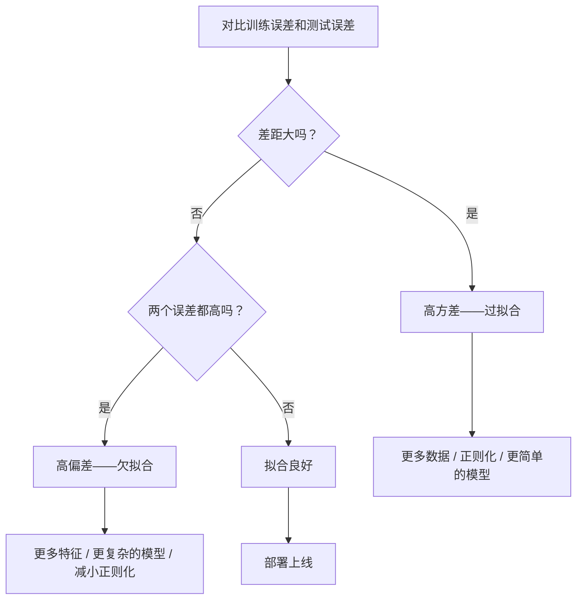
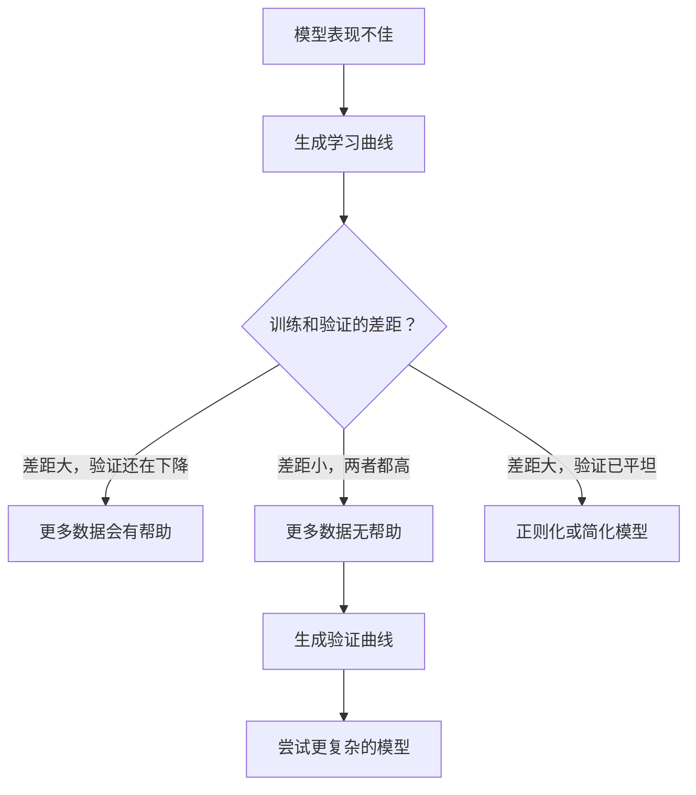

# 偏差-方差权衡

> 模型的所有误差来自三个来源：偏差、方差或噪声。你只能控制前两个。

**类型：** 概念学习
**语言：** Python
**前置知识：** 第二阶段第1-9课（ML基础、回归、分类、评估）
**预计时间：** 约75分钟

## 学习目标

- 推导期望预测误差的偏差-方差分解，解释不可约噪声的作用
- 通过训练误差和测试误差的模式，诊断模型是高偏差还是高方差
- 解释正则化技术（L1、L2、Dropout、早停）如何用偏差换方差
- 实现实验，可视化随模型复杂度增加的偏差-方差权衡

## 问题背景

你训练了一个模型，在测试数据上有一些误差。这些误差从哪里来？

如果模型太简单（对曲线数据用线性回归），它会系统性地错过真实规律——这是**偏差**。如果模型太复杂（对15个数据点拟合20次多项式），它会完美拟合训练数据，但在新数据上给出天差地别的预测——这是**方差**。

在固定模型容量的情况下，你不能同时把两者都压到最低：压低偏差，方差就上升；压低方差，偏差就上升。理解这个权衡是机器学习中最有用的诊断技能，没有之一。它告诉你是该把模型变得更复杂还是更简单，是该多搞数据还是做更好的特征，是该增大还是减小正则化。

## 核心概念

### 偏差：系统性误差

偏差衡量模型的平均预测与真实值的差距。设想你用从同一分布中抽取的许多不同训练集都训练了这个模型，再对预测结果取平均——偏差就是那个平均值与真实值之间的差距。

高偏差意味着模型太"死板"，捕捉不到真实规律。把直线硬拟合到抛物线上，不管给多少数据，永远都会偏离曲线。这就是欠拟合。

```
高偏差（欠拟合）：
  模型总是预测出大致相同的错误结果。
  训练误差：高
  测试误差：高
  两者差距：小
```

### 方差：对训练数据的敏感性

方差衡量在不同训练数据子集上训练时，预测结果的变化程度。训练集稍有变动就引起模型大幅变化，说明方差高。

高方差意味着模型在拟合训练数据中的噪声，而不是背后的规律。20次多项式会穿过每一个训练点，但在点与点之间剧烈震荡。这就是过拟合。

```
高方差（过拟合）：
  模型在训练数据上表现完美，但在新数据上失败。
  训练误差：低
  测试误差：高
  两者差距：大
```

### 分解公式

对任意点 x，在平方损失下，期望预测误差可以精确分解为：

```
期望误差 = Bias² + Variance + 不可约噪声

其中：
  Bias²    = (E[f̂(x)] - f(x))²
  Variance = E[(f̂(x) - E[f̂(x)])²]
  Noise    = E[(y - f(x))²]         （即 sigma²）
```

- `f(x)` 是真实函数
- `f̂(x)` 是模型的预测
- `E[...]` 是对不同训练集取期望
- `y` 是观测标签（真实函数加噪声）

噪声项是不可约的——没有任何模型能在有噪声的数据上做得比 sigma² 更好。你的任务是在 Bias² 和 Variance 之间找到合适的平衡点。

### 模型复杂度与误差


经典的U形曲线：

| 复杂度 | 偏差 | 方差 | 总误差 |
|-------|------|------|-------|
| 太低 | 高 | 低 | 高（欠拟合） |
| 合适 | 中等 | 中等 | 最低 |
| 太高 | 低 | 高 | 高（过拟合） |

### 正则化是控制偏差-方差的工具

正则化有意增加偏差来减少方差——它约束模型，让模型不能追着噪声跑。

- **L2（Ridge）：** 把所有权重都向零收缩。保留所有特征，但减小它们的影响力。
- **L1（Lasso）：** 把某些权重精确压到零，自动做特征选择。
- **Dropout：** 训练时随机关闭一些神经元，强迫模型学习冗余表示。
- **早停（Early Stopping）：** 在模型完全拟合训练数据之前停止训练。

正则化强度（lambda、dropout率、训练轮数）直接控制你在偏差-方差曲线上的位置。正则化越强，偏差越大，方差越小。

### 双重下降：现代视角

经典理论认为：过了最优点之后，更高的复杂度只会让性能更差。但2019年以后的研究发现了意外的现象——如果模型容量远远超过"插值阈值"（模型恰好有足够参数来完美拟合训练数据的点），测试误差可能会再次下降。


这种"双重下降"现象解释了为什么严重过参数化的神经网络（参数数量远多于训练样本）仍然能泛化得很好。经典偏差-方差权衡并没有错，只是在现代规模下不够完整。

关于双重下降的关键观察：
- 在线性模型、决策树和神经网络上都有这种现象
- 更多数据在插值区域实际上有时会让性能变差（样本维度的双重下降）
- 更多训练轮数也可能导致这个现象（epoch维度的双重下降）
- 正则化能平滑峰值，但不能消除它

为什么会这样？在插值阈值处，模型刚好有足够容量穿过所有训练点，被迫选择一个非常特定的解——数据稍有扰动就会导致拟合大幅变化，这是方差的峰值。越过阈值之后，有很多种解都能完美拟合数据。学习算法（比如有隐式正则化的梯度下降）倾向于从中选最简单的那个。这种对简单解的隐式偏好，就是过参数化模型能泛化的原因。

| 区域 | 参数 vs 样本 | 行为 |
|------|------------|------|
| 欠参数化 | p << n | 经典权衡适用 |
| 插值阈值 | p ~ n | 方差达到峰值，测试误差飙升 |
| 过参数化 | p >> n | 隐式正则化生效，测试误差下降 |

实际建议：使用神经网络或大型树集成时，不要停在插值阈值处——要么用显式正则化待在阈值以下，要么大幅超过阈值。最糟糕的状态是恰好停在阈值附近。

### 诊断你的模型



| 症状 | 诊断 | 解决方案 |
|------|------|---------|
| 训练误差高，测试误差高 | 偏差 | 更多特征、更复杂的模型、减小正则化 |
| 训练误差低，测试误差高 | 方差 | 更多数据、正则化、更简单的模型、Dropout |
| 训练误差低，测试误差低 | 拟合良好 | 上线！ |
| 训练误差下降，测试误差上升 | 过拟合进行中 | 早停 |

### 实用策略

**偏差是问题时：**
- 添加多项式或交互特征
- 换用更灵活的模型（树集成代替线性模型）
- 减小正则化强度
- 继续训练（如果还没收敛）

**方差是问题时：**
- 获取更多训练数据
- 使用Bagging（随机森林）
- 增大正则化（更大的lambda，更多Dropout）
- 特征选择（去掉有噪声的特征）
- 用交叉验证提前发现问题

### 集成方法与方差减少

集成方法是对抗方差最实用的工具。

**Bagging（自助聚合）**在训练数据的不同自助样本上训练多个模型，再对预测结果取平均。每个单独模型方差高，但平均后方差大幅降低。随机森林就是Bagging在决策树上的应用。

数学上为什么有效：对N个独立预测取平均，每个预测方差为sigma²，平均后的方差是 sigma²/N。这些模型并非真正独立（看的数据类似），所以实际减少幅度不到1/N，但效果仍然显著。

**Boosting**通过顺序构建模型来减少偏差，每个新模型专门纠正已有集成的误差。梯度提升和AdaBoost是主要代表。Boosting如果模型加太多也会过拟合，需要早停或正则化。

| 方法 | 主要效果 | 偏差变化 | 方差变化 |
|------|---------|---------|---------|
| Bagging | 减少方差 | 不变 | 减少 |
| Boosting | 减少偏差 | 减少 | 可能增加 |
| Stacking | 同时减少 | 取决于元学习器 | 取决于基础模型 |
| Dropout | 隐式Bagging | 略微增加 | 减少 |

**实用原则：** 如果基础模型方差高（深树、高次多项式），用Bagging；如果基础模型偏差高（浅树桩、简单线性模型），用Boosting。

### 学习曲线

学习曲线把训练误差和验证误差画成训练集大小的函数——这是你手头最实用的诊断工具。与单次训练/测试比较不同，学习曲线展示的是模型的轨迹，告诉你更多数据是否真的有帮助。


如何解读：

| 场景 | 训练误差 | 验证误差 | 差距 | 含义 | 怎么做 |
|------|---------|---------|------|------|-------|
| 高偏差 | 高 | 高 | 小 | 模型捕捉不到规律 | 更多特征、更复杂模型、减小正则化 |
| 高方差 | 低 | 高 | 大 | 模型记住了训练数据 | 更多数据、正则化、更简单模型 |
| 拟合良好 | 中 | 中 | 小 | 模型泛化良好 | 上线！ |
| 高方差但在改善 | 低 | 随数据增多在下降 | 在缩小 | 数据量能解决的方差问题 | 收集更多数据 |
| 高偏差且已平坦 | 高 | 高且平坦 | 小且平坦 | 更多数据没有帮助 | 改变模型架构 |

核心洞察：如果两条曲线都已平坦，差距小但两者误差都高——更多数据没用，你需要更好的模型。如果差距还在缩小，更多数据会有帮助。

### 如何生成学习曲线

有两种方式：

**方法一：固定模型，改变训练集大小。** 固定模型和超参数，用越来越大的训练数据子集训练，在每个大小处测量训练和验证误差。这是标准学习曲线。

**方法二：固定数据，改变模型复杂度。** 固定数据，扫描某个复杂度参数（多项式次数、树深度、层数），在每个复杂度处测量训练和验证误差。这叫验证曲线，直接展示偏差-方差权衡。

两种方法相辅相成：第一种告诉你更多数据是否有帮助，第二种告诉你换一个不同的模型是否有帮助。做决定之前两个都跑一遍。



## 动手实现

`code/bias_variance.py` 中的代码运行完整的偏差-方差分解实验，以下是核心步骤。

### 第一步：生成已知函数的合成数据

用 `f(x) = sin(1.5x) + 0.5x` 加高斯噪声。知道真实函数，就能精确计算偏差和方差。

```python
def true_function(x):
    return np.sin(1.5 * x) + 0.5 * x

def generate_data(n_samples=30, noise_std=0.5, x_range=(-3, 3), seed=None):
    rng = np.random.RandomState(seed)
    x = rng.uniform(x_range[0], x_range[1], n_samples)
    y = true_function(x) + rng.normal(0, noise_std, n_samples)
    return x, y
```

### 第二步：自助采样和多项式拟合

对每个多项式次数，抽取多个自助训练集，拟合多项式，在固定测试网格上记录预测值——这给出了每个测试点处的预测分布。

```python
def fit_polynomial(x_train, y_train, degree, lam=0.0):
    X = np.column_stack([x_train ** d for d in range(degree + 1)])
    if lam > 0:
        penalty = lam * np.eye(X.shape[1])
        penalty[0, 0] = 0
        w = np.linalg.solve(X.T @ X + penalty, X.T @ y_train)
    else:
        w = np.linalg.lstsq(X, y_train, rcond=None)[0]
    return w
```

在200个不同的自助样本上拟合，每个自助样本来自同一底层分布但包含不同的点。

### 第三步：计算 Bias²、方差分解

有了每个测试点处200组预测，可以直接按定义计算分解：

```python
mean_pred = predictions.mean(axis=0)
bias_sq = np.mean((mean_pred - y_true) ** 2)
variance = np.mean(predictions.var(axis=0))
total_error = np.mean(np.mean((predictions - y_true) ** 2, axis=1))
```

- `mean_pred` 是从自助样本估计的 E[f̂(x)]
- `bias_sq` 是平均预测与真实值之间差的平方
- `variance` 是自助样本间预测的平均波动幅度
- `total_error` 应约等于 bias² + variance + noise

### 第四步：学习曲线

学习曲线在固定模型复杂度的情况下扫描训练集大小，展示模型是受限于数据量还是受限于容量。

```python
def demo_learning_curves():
    sizes = [10, 15, 20, 30, 50, 75, 100, 150, 200, 300]
    degree = 5

    for n in sizes:
        train_errors = []
        test_errors = []
        for seed in range(50):
            x_train, y_train = generate_data(n_samples=n, seed=seed * 100)
            w = fit_polynomial(x_train, y_train, degree)
            train_pred = predict_polynomial(x_train, w)
            train_mse = np.mean((train_pred - y_train) ** 2)
            test_pred = predict_polynomial(x_test, w)
            test_mse = np.mean((test_pred - y_test) ** 2)
            train_errors.append(train_mse)
            test_errors.append(test_mse)
        # 对多次运行取平均，得到学习曲线的一个点
```

对高方差模型（小数据量时的5次多项式），你会看到：
- 训练误差开始很低，随着数据增多记忆变难而升高
- 测试误差开始很高，随着模型获得更多信号而降低
- 差距随数据增多而收窄

对高偏差模型（1次多项式），两条曲线快速收敛到同样较高的误差值，更多数据没有帮助。

### 第五步：正则化扫描

代码还包含 `demo_regularization_sweep()`，它固定一个高次多项式（15次），把Ridge正则化强度从0.001扫到100。这从另一个角度展示了偏差-方差权衡：不是改变模型复杂度，而是改变约束强度。

```python
def demo_regularization_sweep():
    alphas = [0.001, 0.005, 0.01, 0.05, 0.1, 0.5, 1.0, 5.0, 10.0, 50.0, 100.0]
    for alpha in alphas:
        results = bias_variance_decomposition([15], lam=alpha)
        r = results[15]
        print(f"alpha={alpha:.3f}  bias={r['bias_sq']:.4f}  var={r['variance']:.4f}")
```

alpha 低时，15次多项式几乎无约束，方差主导——模型在每个自助样本上都追着噪声跑。alpha 高时，惩罚如此之强，模型实际上变成了近似常数函数，偏差主导。最优alpha在两个极端之间。

这和改变多项式次数得到的U形曲线是一回事，但这里用的是连续旋钮而不是离散参数。实际中，正则化是控制权衡的首选方式，因为它不用改变特征集，控制更精细。

## 实际使用

scikit-learn 提供 `learning_curve` 和 `validation_curve` 来自动化这些诊断，不需要手写自助循环。

### 验证曲线：扫描模型复杂度

```python
from sklearn.model_selection import validation_curve
from sklearn.pipeline import make_pipeline
from sklearn.preprocessing import PolynomialFeatures
from sklearn.linear_model import Ridge

degrees = list(range(1, 16))
train_scores_all = []
val_scores_all = []

for d in degrees:
    pipe = make_pipeline(PolynomialFeatures(d), Ridge(alpha=0.01))
    train_scores, val_scores = validation_curve(
        pipe, X, y, param_name="polynomialfeatures__degree",
        param_range=[d], cv=5, scoring="neg_mean_squared_error"
    )
    train_scores_all.append(-train_scores.mean())
    val_scores_all.append(-val_scores.mean())
```

这直接给出偏差-方差权衡曲线。验证分数相对训练分数最差的地方，方差主导；两者都差的地方，偏差主导。

### 学习曲线：扫描训练集大小

```python
from sklearn.model_selection import learning_curve

pipe = make_pipeline(PolynomialFeatures(5), Ridge(alpha=0.01))
train_sizes, train_scores, val_scores = learning_curve(
    pipe, X, y, train_sizes=np.linspace(0.1, 1.0, 10),
    cv=5, scoring="neg_mean_squared_error"
)
train_mse = -train_scores.mean(axis=1)
val_mse = -val_scores.mean(axis=1)
```

把 `train_mse` 和 `val_mse` 画成 `train_sizes` 的函数，曲线的形状能告诉你关于模型的一切。

### 交叉验证 + 正则化扫描

```python
from sklearn.model_selection import cross_val_score

alphas = [0.001, 0.01, 0.1, 1.0, 10.0, 100.0]
for alpha in alphas:
    pipe = make_pipeline(PolynomialFeatures(10), Ridge(alpha=alpha))
    scores = cross_val_score(pipe, X, y, cv=5, scoring="neg_mean_squared_error")
    print(f"alpha={alpha:>7.3f}  MSE={-scores.mean():.4f} +/- {scores.std():.4f}")
```

在固定模型复杂度的情况下扫描正则化强度。你会看到同样的权衡：alpha 小意味着高方差，alpha 大意味着高偏差。

### 整合起来：完整诊断流程

实际使用时，按顺序运行这些诊断：

1. 训练模型，计算训练和测试误差。
2. 如果两者都高：偏差问题，跳到第4步。
3. 如果训练低但测试高：方差问题。生成学习曲线看更多数据是否有帮助，不行就正则化。
4. 生成主要复杂度参数的验证曲线，找到最优点。
5. 在最优点处生成学习曲线。如果差距还大，需要更多数据或正则化。
6. 用 `cross_val_score` 尝试不同 alpha 的Ridge/Lasso，选交叉验证误差最低的那个。

对大多数表格数据集，这个流程只需10-15分钟计算，但能省去数小时的盲目猜测。

## 交付产物

本课产出：`outputs/prompt-model-diagnostics.md`

## 练习

1. 设 `noise_std=0`（无噪声）跑分解实验。不可约误差项会怎样？最优复杂度会变化吗？

2. 把训练集大小从30增加到300，方差分量有何变化？最优多项式次数会移动吗？

3. 给实验加上L2正则化（Ridge回归）。对固定的高次多项式（15次），把lambda从0扫到100，把 Bias² 和 Variance 画成 lambda 的函数。

4. 把真实函数从多项式改成 `sin(x)`。偏差-方差分解怎么变化？还有清晰的最优次数吗？

5. 实现简单的自助聚合（Bagging）包装器：在自助样本上训练10个模型，对预测取平均。证明这能减少方差而不显著增加偏差。

## 关键术语

| 术语 | 通常的说法 | 实际含义 |
|------|-----------|----------|
| 偏差 (Bias) | "模型太简单" | 来自错误假设的系统性误差。模型平均预测与真实值的差距 |
| 方差 (Variance) | "模型在过拟合" | 来自对训练数据敏感性的误差。不同训练集上预测变化的幅度 |
| 不可约误差 (Irreducible Error) | "数据中的噪声" | 来自真实数据生成过程随机性的误差，任何模型都无法消除 |
| 欠拟合 (Underfitting) | "学得不够" | 模型偏差高，在训练数据上也无法捕捉真实规律 |
| 过拟合 (Overfitting) | "把数据背下来了" | 模型方差高，拟合了训练数据中无法泛化的噪声 |
| 正则化 (Regularization) | "约束模型" | 加入惩罚项减少模型复杂度，用增加偏差换取降低方差 |
| 双重下降 (Double Descent) | "参数更多反而更好" | 当模型容量远超插值阈值时，测试误差再次下降的现象 |
| 模型复杂度 (Model Complexity) | "模型有多灵活" | 模型拟合任意规律的能力，由架构、特征或正则化控制 |

## 延伸阅读

- [Hastie, Tibshirani, Friedman：统计学习精要，第7章](https://hastie.su.domains/ElemStatLearn/) — 偏差-方差分解的权威论述
- [Belkin等：调和现代机器学习实践与偏差-方差权衡（2019）](https://arxiv.org/abs/1812.11118) — 双重下降论文
- [Nakkiran等：深度双重下降（2019）](https://arxiv.org/abs/1912.02292) — epoch维度和样本维度的双重下降
- [Scott Fortmann-Roe：理解偏差-方差权衡](http://scott.fortmann-roe.com/docs/BiasVariance.html) — 清晰的可视化解释
