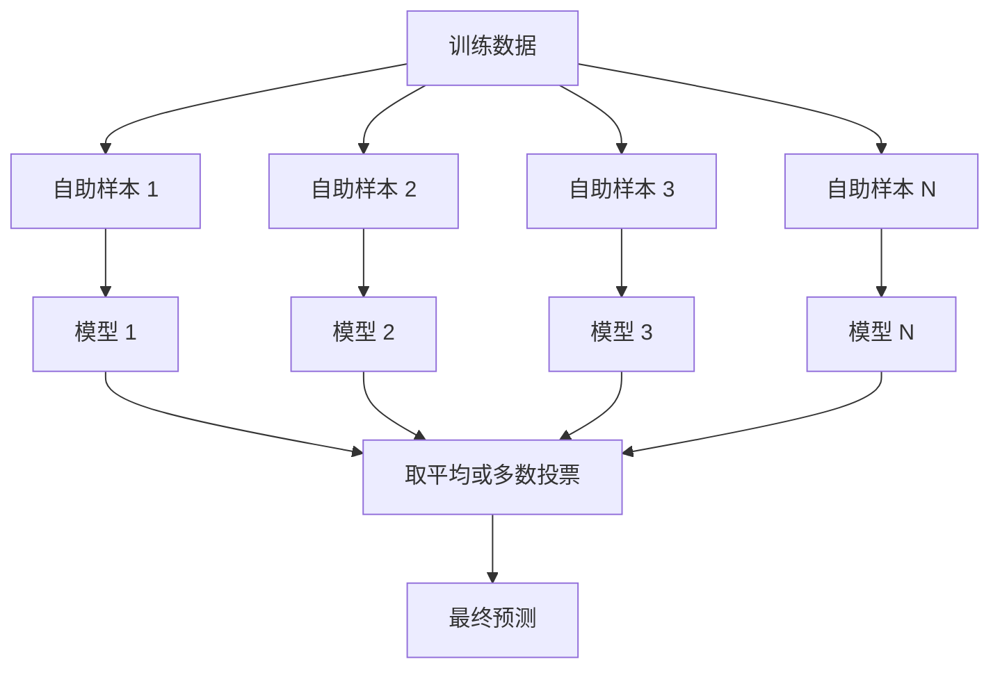
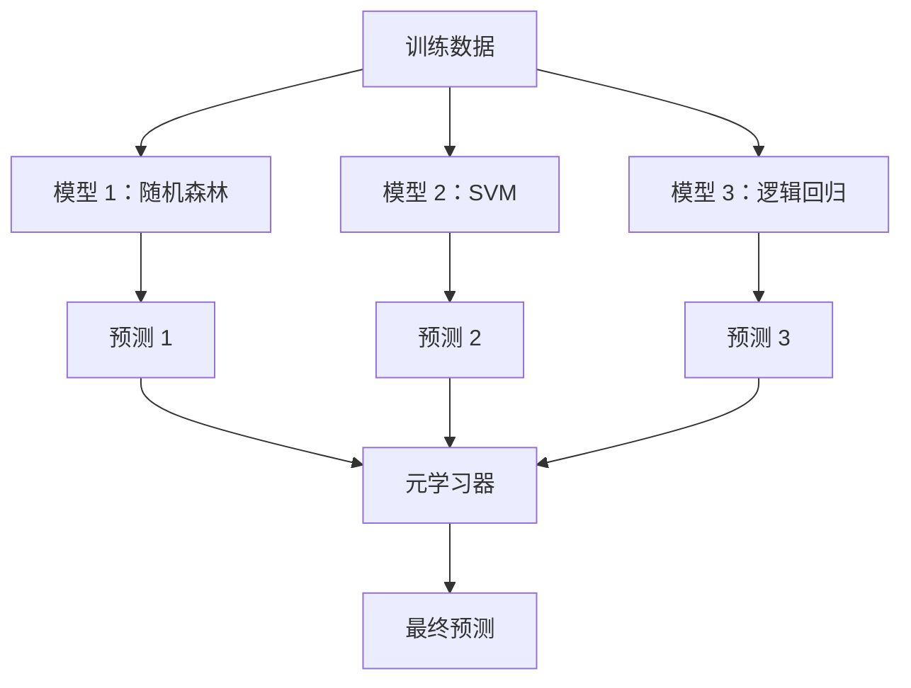

# 集成方法

> 一群弱学习器，正确地组合在一起，就成了强学习器。这不是比喻，而是定理。

**类型：** 动手实现
**语言：** Python
**前置知识：** 第二阶段第10课（偏差-方差权衡）
**预计时间：** 约120分钟

## 学习目标

- 从头实现AdaBoost和梯度提升，解释提升如何顺序地减少偏差
- 构建Bagging集成，演示对去相关模型取平均如何在不增加偏差的情况下减少方差
- 从各自针对的误差分量角度，对比Bagging、Boosting和Stacking
- 评估集成多样性，解释为什么随着弱学习器数量增加（且互相独立），多数投票的准确率会提升

## 问题背景

单棵决策树训练快、好解释，但会过拟合。单个线性模型在复杂边界上又会欠拟合。你可以花几天时间精心设计完美的模型架构——或者，把一堆不完美的模型组合起来，得到比其中任何一个都更好的结果。

集成方法做的就是这件事。它是Kaggle表格数据竞赛中最可靠的制胜技术，驱动着大多数生产ML系统，并把偏差-方差权衡从理论变成了可操作的工具。Bagging减少方差，Boosting减少偏差，Stacking学习在什么输入下信任哪个模型。

## 核心概念

### 集成为何有效

设你有N个独立分类器，每个准确率 p > 0.5。多数投票的准确率为：

```
P(多数正确) = sum over k > N/2 of C(N,k) * p^k * (1-p)^(N-k)
```

21个分类器各有60%准确率，多数投票准确率约为74%。101个分类器，升到84%。各模型犯不同的错误，误差就相互抵消了。

关键要求是**多样性**。如果所有模型犯同样的错误，组合毫无帮助。集成奏效，是因为以下方式让模型保持多样：

- 不同的训练子集（Bagging）
- 不同的特征子集（随机森林）
- 顺序纠错（Boosting）
- 不同的模型家族（Stacking）

### Bagging（自助聚合）

Bagging通过让每个模型在不同的自助训练样本上训练来制造多样性。



自助样本从原始数据有放回地抽取，大小与原始数据相同。每个自助样本约包含63.2%的不重复样本，剩余36.8%（袋外样本）提供免费的验证集。

Bagging减少方差而几乎不增加偏差。每棵树都过拟合了它的自助样本，但每棵树过拟合的方向不同，取平均就把噪声抵消了。

**随机森林**是Bagging加一个额外技巧：每次分裂时，只从随机选取的特征子集中找最优分裂点。这强制让树与树之间更加多样。分类任务默认的候选特征数是 `sqrt(n_features)`，回归任务是 `n_features / 3`。

### Boosting（顺序纠错）

Boosting顺序训练模型，每个新模型专注于前面模型搞错的样本。


Boosting减少偏差。每个新模型纠正当前集成的系统性错误。最终预测是所有模型的加权求和，表现更好的模型权重更大。

代价是：如果运行轮数太多，Boosting也会过拟合——因为它不断拟合越来越难的样本，其中一些可能是噪声。

### AdaBoost

AdaBoost（自适应提升）是第一个实用的提升算法，可配合任何基学习器使用，通常是决策树桩（深度为1的树）。

算法步骤：

```
1. 初始化样本权重：w_i = 1/N（对所有 i）

2. 对 t = 1 到 T：
   a. 在加权数据上训练弱学习器 h_t
   b. 计算加权误差：
      err_t = sum(w_i * I(h_t(x_i) != y_i)) / sum(w_i)
   c. 计算模型权重：
      alpha_t = 0.5 * ln((1 - err_t) / err_t)
   d. 更新样本权重：
      w_i = w_i * exp(-alpha_t * y_i * h_t(x_i))
   e. 归一化权重使之和为1

3. 最终预测：H(x) = sign(sum(alpha_t * h_t(x)))
```

误差越小的模型获得越大的alpha权重。被误分类的样本权重增大，让下一个模型重点关注它们。

### 梯度提升

梯度提升把提升推广到任意损失函数。它不重新加权样本，而是让每个新模型拟合当前集成的残差（损失函数的负梯度）。

```
1. 初始化：F_0(x) = argmin_c sum(L(y_i, c))

2. 对 t = 1 到 T：
   a. 计算伪残差：
      r_i = -dL(y_i, F_{t-1}(x_i)) / dF_{t-1}(x_i)
   b. 用树 h_t 拟合残差 r_i
   c. 找最优步长：
      gamma_t = argmin_gamma sum(L(y_i, F_{t-1}(x_i) + gamma * h_t(x_i)))
   d. 更新：
      F_t(x) = F_{t-1}(x) + learning_rate * gamma_t * h_t(x)

3. 最终预测：F_T(x)
```

对于平方误差损失，伪残差就是真实残差：`r_i = y_i - F_{t-1}(x_i)`。每棵树都在字面意义上拟合前一个集成的误差。

学习率（收缩率）控制每棵树贡献多少。学习率越小，需要的树越多，但泛化效果更好。典型取值范围：0.01到0.3。

### XGBoost：为何统治表格数据

XGBoost（极端梯度提升）是梯度提升加上工程优化，让它更快、更准、更不容易过拟合：

- **正则化目标函数：** 对叶子权重加L1和L2惩罚，防止单棵树过于自信
- **二阶近似：** 同时利用损失的一阶和二阶导数，做出更好的分裂决策
- **稀疏感知分裂：** 在每次分裂时学习缺失值的最优方向，原生支持缺失值
- **列子采样：** 像随机森林一样，在每次分裂时采样特征增加多样性
- **加权分位数草图：** 在分布式数据上高效找到连续特征的分裂点
- **缓存感知块结构：** 内存布局针对CPU缓存行优化

对表格数据，XGBoost（及其后继LightGBM）持续击败神经网络。这个局面短期内不会改变。只要你的数据能用行列表格表示，就先从梯度提升开始。

### Stacking（元学习）

Stacking用多个基础模型的预测作为元学习器的输入特征。



元学习器学习在哪些输入上信任哪个基础模型。如果随机森林在某些区域更好，SVM在另一些区域更好，元学习器就会学会相应地分配信任。

为了避免数据泄露，基础模型的预测必须通过在训练集上做交叉验证来生成——绝不能用同一份数据既训练基础模型，又生成元特征。

### 投票

最简单的集成，直接组合预测。

- **硬投票：** 对类别标签多数投票。
- **软投票：** 对预测概率取平均，选平均概率最高的类别。通常更好，因为利用了置信度信息。

## 动手实现

### 第一步：决策树桩（基学习器）

`code/ensembles.py` 中的代码从头实现了所有内容。从决策树桩开始：只有一次分裂的树。

```python
class DecisionStump:
    def __init__(self):
        self.feature_idx = None
        self.threshold = None
        self.polarity = 1
        self.alpha = None

    def fit(self, X, y, weights):
        n_samples, n_features = X.shape
        best_error = float("inf")

        for f in range(n_features):
            thresholds = np.unique(X[:, f])
            for thresh in thresholds:
                for polarity in [1, -1]:
                    pred = np.ones(n_samples)
                    pred[polarity * X[:, f] < polarity * thresh] = -1
                    error = np.sum(weights[pred != y])
                    if error < best_error:
                        best_error = error
                        self.feature_idx = f
                        self.threshold = thresh
                        self.polarity = polarity

    def predict(self, X):
        n = X.shape[0]
        pred = np.ones(n)
        idx = self.polarity * X[:, self.feature_idx] < self.polarity * self.threshold
        pred[idx] = -1
        return pred
```

### 第二步：从头实现AdaBoost

```python
class AdaBoostScratch:
    def __init__(self, n_estimators=50):
        self.n_estimators = n_estimators
        self.stumps = []
        self.alphas = []

    def fit(self, X, y):
        n = X.shape[0]
        weights = np.full(n, 1 / n)

        for _ in range(self.n_estimators):
            stump = DecisionStump()
            stump.fit(X, y, weights)
            pred = stump.predict(X)

            err = np.sum(weights[pred != y])
            err = np.clip(err, 1e-10, 1 - 1e-10)

            alpha = 0.5 * np.log((1 - err) / err)
            weights *= np.exp(-alpha * y * pred)
            weights /= weights.sum()

            stump.alpha = alpha
            self.stumps.append(stump)
            self.alphas.append(alpha)

    def predict(self, X):
        total = sum(a * s.predict(X) for a, s in zip(self.alphas, self.stumps))
        return np.sign(total)
```

### 第三步：从头实现梯度提升

```python
class GradientBoostingScratch:
    def __init__(self, n_estimators=100, learning_rate=0.1, max_depth=3):
        self.n_estimators = n_estimators
        self.lr = learning_rate
        self.max_depth = max_depth
        self.trees = []
        self.initial_pred = None

    def fit(self, X, y):
        self.initial_pred = np.mean(y)
        current_pred = np.full(len(y), self.initial_pred)

        for _ in range(self.n_estimators):
            residuals = y - current_pred
            tree = SimpleRegressionTree(max_depth=self.max_depth)
            tree.fit(X, residuals)
            update = tree.predict(X)
            current_pred += self.lr * update
            self.trees.append(tree)

    def predict(self, X):
        pred = np.full(X.shape[0], self.initial_pred)
        for tree in self.trees:
            pred += self.lr * tree.predict(X)
        return pred
```

### 第四步：与sklearn对比

代码验证我们从头实现的版本与sklearn的 `AdaBoostClassifier` 和 `GradientBoostingClassifier` 准确率相当，并把所有方法并排对比。

## 实际使用

### 何时用哪种方法

| 方法 | 减少 | 最适合 | 注意 |
|------|------|-------|------|
| Bagging / 随机森林 | 方差 | 有噪声数据、特征多 | 对偏差没有帮助 |
| AdaBoost | 偏差 | 干净数据、简单基学习器 | 对异常值和噪声敏感 |
| 梯度提升 | 偏差 | 表格数据、竞赛 | 训练慢，不调参容易过拟合 |
| XGBoost / LightGBM | 两者 | 生产表格ML | 超参数多 |
| Stacking | 两者 | 追求最后1-2%的提升 | 复杂，元学习器容易过拟合 |
| 投票 | 方差 | 快速组合多样化模型 | 只有模型多样时才有效 |

### 表格数据的生产套路

对于大多数表格预测问题，按以下顺序尝试：

1. **LightGBM或XGBoost**，用默认参数
2. 调 n_estimators、learning_rate、max_depth、min_child_weight
3. 如果还需要最后0.5%的提升，用3-5个多样化模型构建Stacking集成
4. 全程使用交叉验证

表格数据上的神经网络几乎总是比梯度提升差，尽管研究一直没有停止。TabNet、NODE之类的架构偶尔能持平，但很少能超越调好的XGBoost。

## 交付产物

本课产出：
- `outputs/prompt-ensemble-selector.md` — 帮你为特定数据集选择合适集成方法的提示词模板
- `outputs/skill-ensemble-builder.md` — 完整的集成方法选择指南

## 练习

1. 修改AdaBoost实现，记录每轮后的训练准确率。画出准确率随估计器数量的变化曲线，观察何时收敛。

2. 从头实现随机森林：给回归树加上随机特征子采样。用 `max_features=sqrt(n_features)` 训练100棵树并取平均预测，与单棵树对比方差减少量。

3. 在梯度提升实现中加入早停：每轮后跟踪验证损失，连续10轮没有改善就停止。实际需要多少棵树？

4. 用三个基础模型（逻辑回归、决策树、K近邻）和逻辑回归元学习器构建Stacking集成，用5折交叉验证生成元特征，与各基础模型单独使用对比。

5. 用默认参数在相同数据集上跑XGBoost，与你从头实现的梯度提升对比准确率和训练时间，速度差距有多大？

## 关键术语

| 术语 | 通常的说法 | 实际含义 |
|------|-----------|----------|
| Bagging | "在随机子集上训练" | 自助聚合：在自助样本上训练模型，取平均预测以减少方差 |
| Boosting | "专注于难例" | 顺序训练模型，每个新模型纠正当前集成的误差，以减少偏差 |
| AdaBoost | "重新加权数据" | 通过样本权重更新实现提升，被误分类的点对下一个学习器获得更高权重 |
| 梯度提升 (Gradient Boosting) | "拟合残差" | 通过让每个新模型拟合损失函数的负梯度来实现提升 |
| XGBoost | "Kaggle神器" | 带正则化、二阶优化和系统级速度优化的梯度提升 |
| Stacking | "模型上面再叠模型" | 将基础模型的预测作为元学习器的输入特征 |
| 随机森林 (Random Forest) | "很多棵随机树" | 带决策树的Bagging，每次分裂时加随机特征子采样以增加多样性 |
| 集成多样性 (Ensemble Diversity) | "犯不同的错误" | 模型之间的误差要不相关，集成才能比单个模型有提升 |
| 袋外误差 (Out-of-Bag Error) | "免费验证" | 未出现在某个自助样本中的约36.8%的样本，可作为验证集，不需要额外的留出集 |

## 延伸阅读

- [Schapire & Freund：提升：基础与算法](https://mitpress.mit.edu/9780262526036/) — AdaBoost创建者写的书
- [Friedman：贪心函数近似——梯度提升机（2001）](https://statweb.stanford.edu/~jhf/ftp/trebst.pdf) — 原始梯度提升论文
- [Chen & Guestrin：XGBoost（2016）](https://arxiv.org/abs/1603.02754) — XGBoost论文
- [Wolpert：叠加泛化（1992）](https://www.sciencedirect.com/science/article/abs/pii/S0893608005800231) — 原始Stacking论文
- [scikit-learn 集成方法](https://scikit-learn.org/stable/modules/ensemble.html) — 实用参考
