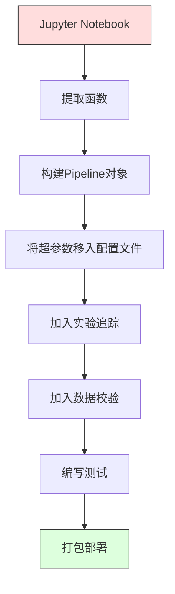

# ML流水线（ML Pipelines）

> 模型不是产品，流水线才是。从原始数据到最终预测的每一个环节，都必须可以复现。

**类型：** 动手实现
**语言：** Python
**前置知识：** 第二阶段第12课（超参数调优）
**预计时间：** 约120分钟

## 学习目标

- 从零搭建一条ML流水线，将缺失值填充、特征缩放、类别编码、模型训练串联成一个可复现的对象
- 识别数据泄露的常见场景，理解流水线如何通过"只在训练集上拟合变换器"来杜绝泄露
- 使用 `ColumnTransformer` 对数值列和类别列分别施加不同的预处理逻辑
- 实现流水线的序列化，并验证训练和生产环境下同一条流水线的输出完全一致

## 问题背景

你有一个 Notebook：加载数据、用中位数填充缺失值、缩放特征、训练模型、打印准确率。一切正常，于是你上线了。

一个月后，有人重新训练模型，结果却不一样了——中位数是用完整数据集（含测试集）计算的，这是数据泄露；缩放参数没有保存，推理时用了不同的统计量；特征工程代码在训练和服务端之间来回拷贝，两份代码渐渐出现了差异；生产环境里出现了一个模型从未见过的新类别值，编码器直接报错崩溃。

这不是假设。这些是 ML 系统在生产中失败最常见的原因。**流水线**通过把所有变换步骤打包成一个有序的、可复现的对象，一次性解决了上述所有问题。

## 核心概念

### 流水线是什么

流水线是一串按顺序排列的数据变换步骤，最后跟着一个模型。每一步接收上一步的输出作为输入。整条流水线只在训练数据上拟合一次。推理时，同一条已拟合的流水线负责变换新数据并产出预测。


流水线能保证：
- 变换器只在训练数据上拟合（不会泄露测试集信息）
- 推理时施加的是完全相同的变换
- 整个对象可以序列化后作为一个部署制品
- 交叉验证时对每个折分别执行流水线，防止隐性泄露

### 数据泄露：沉默的杀手

数据泄露是指测试集或未来数据的信息污染了训练过程。流水线能防止最常见的几类泄露。

**有泄露的写法（错误）：**
```python
X = df.drop("target", axis=1)
y = df["target"]

scaler = StandardScaler()
X_scaled = scaler.fit_transform(X)   # 此处用了全量数据，含测试集！

X_train, X_test = X_scaled[:800], X_scaled[800:]
y_train, y_test = y[:800], y[800:]
```

缩放器见到了测试集数据。均值和标准差里混入了测试样本，准确率估计因此虚高。

**正确写法：**
```python
X_train, X_test = X[:800], X[800:]

scaler = StandardScaler()
X_train_scaled = scaler.fit_transform(X_train)
X_test_scaled = scaler.transform(X_test)   # 只做 transform，不 fit
```

用了流水线之后，你根本不需要操心这些——流水线自动处理好了。

### sklearn Pipeline

sklearn 的 `Pipeline` 把多个变换器和一个估计器串联起来，对外暴露统一的 `.fit()`、`.predict()`、`.score()` 接口，内部按顺序执行各步骤。

```python
from sklearn.pipeline import Pipeline
from sklearn.preprocessing import StandardScaler
from sklearn.linear_model import LogisticRegression

pipe = Pipeline([
    ("scaler", StandardScaler()),
    ("model", LogisticRegression()),
])

pipe.fit(X_train, y_train)
predictions = pipe.predict(X_test)
```

调用 `pipe.fit(X_train, y_train)` 时，内部发生了什么：
1. 缩放器对 X_train 调用 `fit_transform`
2. 模型对缩放后的 X_train 调用 `fit`

调用 `pipe.predict(X_test)` 时：
1. 缩放器对 X_test 调用 `transform`（注意：**不是** fit_transform）
2. 模型对缩放后的 X_test 调用 `predict`

缩放器在拟合阶段永远看不到测试数据——这正是流水线的价值所在。

### ColumnTransformer：为不同列施加不同处理

真实数据集里，数值列和类别列需要完全不同的预处理。`ColumnTransformer` 正是为此而生。

```python
from sklearn.compose import ColumnTransformer
from sklearn.preprocessing import StandardScaler, OneHotEncoder
from sklearn.impute import SimpleImputer

numeric_pipe = Pipeline([
    ("impute", SimpleImputer(strategy="median")),
    ("scale", StandardScaler()),
])

categorical_pipe = Pipeline([
    ("impute", SimpleImputer(strategy="most_frequent")),
    ("encode", OneHotEncoder(handle_unknown="ignore")),
])

preprocessor = ColumnTransformer([
    ("num", numeric_pipe, ["age", "income", "score"]),
    ("cat", categorical_pipe, ["city", "gender", "plan"]),
])

full_pipeline = Pipeline([
    ("preprocess", preprocessor),
    ("model", GradientBoostingClassifier()),
])
```

`OneHotEncoder` 里的 `handle_unknown="ignore"` 在生产环境中至关重要——当出现模型从未见过的新类别（比如一个新城市），它会输出全零向量而不是直接报错崩溃。

### 实验追踪（Experiment Tracking）

流水线让训练可复现，但你还需要跨实验地追踪所发生的事情：用了哪些超参数、哪个版本的数据集、指标是多少、运行的是哪份代码。

**MLflow** 是最常用的开源方案：

```python
import mlflow

with mlflow.start_run():
    mlflow.log_param("max_depth", 5)
    mlflow.log_param("n_estimators", 100)
    mlflow.log_param("learning_rate", 0.1)

    pipe.fit(X_train, y_train)
    accuracy = pipe.score(X_test, y_test)

    mlflow.log_metric("accuracy", accuracy)
    mlflow.sklearn.log_model(pipe, "model")
```

每次运行都会记录参数、指标、制品和完整模型，可以横向对比多次实验，随时重现任意一次，并部署任意版本的模型。

**Weights & Biases（wandb）** 提供相同的功能，还附带一个托管可视化面板：

```python
import wandb

wandb.init(project="my-pipeline")
wandb.config.update({"max_depth": 5, "n_estimators": 100})

pipe.fit(X_train, y_train)
accuracy = pipe.score(X_test, y_test)

wandb.log({"accuracy": accuracy})
```

### 模型版本管理

有了实验追踪，还需要管理模型版本：哪个在生产？哪个在灰度？上周的是哪个？

MLflow 的 Model Registry 提供：
- **版本跟踪**：每个保存的模型都会得到一个版本号
- **阶段流转**："Staging"（灰度）、"Production"（生产）、"Archived"（归档）
- **审批流程**：模型必须经过显式晋升才能进入生产
- **回滚**：一键切换回任意历史版本

### 数据版本管理（DVC）

代码用 git 版本化，数据也应该版本化——但 git 搞不定大文件。DVC（Data Version Control）解决了这个问题。

```
dvc init
dvc add data/training.csv
git add data/training.csv.dvc data/.gitignore
git commit -m "Track training data"
dvc push
```

DVC 把实际数据存在远端存储（S3、GCS、Azure），在 git 里只保留一个记录哈希值的小 `.dvc` 文件。当你 checkout 某个 git 提交时，`dvc checkout` 就能还原当时用的精确数据。

这样，每个 git 提交都同时钉住了代码和数据——真正的完全可复现。

### 可复现实验的四要素

一个可复现的实验需要四样东西：

1. **固定随机种子**：给 numpy、random 以及框架（torch、sklearn）统一设置种子
2. **锁定依赖版本**：用 requirements.txt 或 poetry.lock 记录精确版本号
3. **数据版本化**：用 DVC 或类似工具
4. **配置文件**：所有超参数写进配置文件，不要硬编码

```python
import numpy as np
import random

def set_seed(seed=42):
    random.seed(seed)
    np.random.seed(seed)
    try:
        import torch
        torch.manual_seed(seed)
        torch.cuda.manual_seed_all(seed)
        torch.backends.cudnn.deterministic = True
    except ImportError:
        pass
```

### 从 Notebook 到生产流水线



典型的演进路径：

1. **Notebook 探索**：快速试验、可视化、特征想法
2. **提取函数**：把预处理、特征工程、评估逻辑抽成独立模块
3. **构建 Pipeline**：把各变换步骤串进 sklearn Pipeline 或自定义类
4. **配置管理**：把所有超参数移进 YAML/JSON 配置文件
5. **实验追踪**：接入 MLflow 或 wandb 记录日志
6. **数据校验**：训练前检查数据结构（schema）、分布、缺失值模式
7. **测试**：对变换器写单元测试，对完整流水线写集成测试
8. **部署**：序列化流水线，包装成 API（FastAPI、Flask），容器化

### 常见流水线错误

| 错误 | 为什么有害 | 正确做法 |
|------|-----------|---------|
| 先在全量数据上 fit 再划分 | 数据泄露 | 用 Pipeline 配合 cross_val_score |
| 特征工程写在 Pipeline 外 | 训练和服务端变换不一致 | 把所有变换放进 Pipeline |
| 没处理未知类别 | 生产环境遇到新值直接崩溃 | 使用 `OneHotEncoder(handle_unknown="ignore")` |
| 列名硬编码 | 数据结构变化时直接报错 | 从配置文件读取列名列表 |
| 没有数据校验 | 输入数据异常时静默产出错误预测 | 预测前加 schema 检查 |
| 训练/服务不一致（训练-服务偏差） | 模型在生产中看到的特征与训练时不同 | 训练和服务共用同一个 Pipeline 对象 |

## 动手实现

`code/pipeline.py` 中包含一条完整的 ML 流水线，从零实现到 sklearn 版本一应俱全。

### 第一步：自定义变换器

```python
class CustomTransformer:
    def __init__(self):
        self.means = None
        self.stds = None

    def fit(self, X):
        self.means = np.mean(X, axis=0)
        self.stds = np.std(X, axis=0)
        self.stds[self.stds == 0] = 1.0   # 防止除以零
        return self

    def transform(self, X):
        return (X - self.means) / self.stds

    def fit_transform(self, X):
        return self.fit(X).transform(X)
```

### 第二步：从零实现 Pipeline

```python
class PipelineFromScratch:
    def __init__(self, steps):
        self.steps = steps

    def fit(self, X, y=None):
        X_current = X.copy()
        for name, step in self.steps[:-1]:          # 遍历所有变换器（除最后一步）
            X_current = step.fit_transform(X_current)
        name, model = self.steps[-1]                # 最后一步是模型
        model.fit(X_current, y)
        return self

    def predict(self, X):
        X_current = X.copy()
        for name, step in self.steps[:-1]:
            X_current = step.transform(X_current)   # 注意：只 transform，不 fit
        name, model = self.steps[-1]
        return model.predict(X_current)
```

### 第三步：配合交叉验证使用 Pipeline

代码演示了如何在交叉验证中配合 Pipeline 防止数据泄露：缩放器在每个折的训练数据上单独拟合，测试折永远看不到拟合时的任何信息。

### 第四步：完整生产级 Pipeline（使用 sklearn）

用 `ColumnTransformer` 构建多路预处理，配合模型组成完整流水线，通过正确的交叉验证训练并记录实验日志。

## 成果

本课产出：
- `outputs/prompt-ml-pipeline.md` —— 构建和调试 ML 流水线的技能提示词
- `code/pipeline.py` —— 从零实现到 sklearn 完整版的流水线代码

## 练习

1. 构建一条处理 3 个数值列和 2 个类别列数据集的流水线。用 `ColumnTransformer` 对数值列施加中位数填充 + 标准化，对类别列施加众数填充 + One-Hot 编码，用 5 折交叉验证训练。

2. 故意制造数据泄露：在划分数据集之前先在全量数据上 fit 缩放器。对比泄露版的交叉验证分数和干净 Pipeline 版的分数，差距有多大？

3. 用 `joblib.dump` 序列化你的流水线，在另一个脚本里加载它并运行预测。验证预测结果完全一致。

4. 在流水线中加入一个自定义变换器，为两个最重要的数值列生成二次多项式特征。它应该插在流水线的哪个位置？

5. 为流水线配置 MLflow 追踪。用不同超参数运行 5 次实验，通过 MLflow UI（`mlflow ui`）对比结果，挑选最佳模型。

## 关键术语

| 术语 | 常见说法 | 实际含义 |
|------|---------|---------|
| 流水线（Pipeline） | "变换链 + 模型" | 一组已拟合的有序变换器加上模型，作为一个整体执行，防止数据泄露 |
| 数据泄露（Data leakage） | "测试集信息泄进了训练" | 使用训练集之外的信息来构建模型，导致性能指标虚高 |
| 列变换器（ColumnTransformer） | "按列分别预处理" | 对不同列子集应用不同的流水线，再合并结果 |
| 实验追踪（Experiment tracking） | "记录你的每次运行" | 对每次训练运行记录参数、指标、制品和代码版本 |
| MLflow | "追踪和部署模型" | 开源的实验追踪、模型注册和部署平台 |
| DVC | "数据的 git" | 大文件版本控制系统，在 git 中存哈希，在远端存数据 |
| 模型注册表（Model registry） | "模型版本目录" | 带阶段标签（灰度、生产、归档）的模型版本跟踪系统 |
| 训练-服务偏差（Training/serving skew） | "Notebook 里跑得好好的" | 训练和推理时数据处理方式不同，导致静默错误 |
| 可复现性（Reproducibility） | "相同代码，相同结果" | 用相同的代码、数据和配置能够得到完全相同的结果 |

## 延伸阅读

- [scikit-learn Pipeline 官方文档](https://scikit-learn.org/stable/modules/compose.html) —— Pipeline 权威参考
- [MLflow 文档](https://mlflow.org/docs/latest/index.html) —— 实验追踪与模型注册
- [DVC 文档](https://dvc.org/doc) —— 数据版本管理
- [Sculley et al., Hidden Technical Debt in Machine Learning Systems (2015)](https://papers.nips.cc/paper/2015/hash/86df7dcfd896fcaf2674f757a2463eba-Abstract.html) —— ML 系统复杂性的奠基论文
- [Google ML Best Practices: Rules of ML](https://developers.google.com/machine-learning/guides/rules-of-ml) —— 生产级 ML 实践指南
