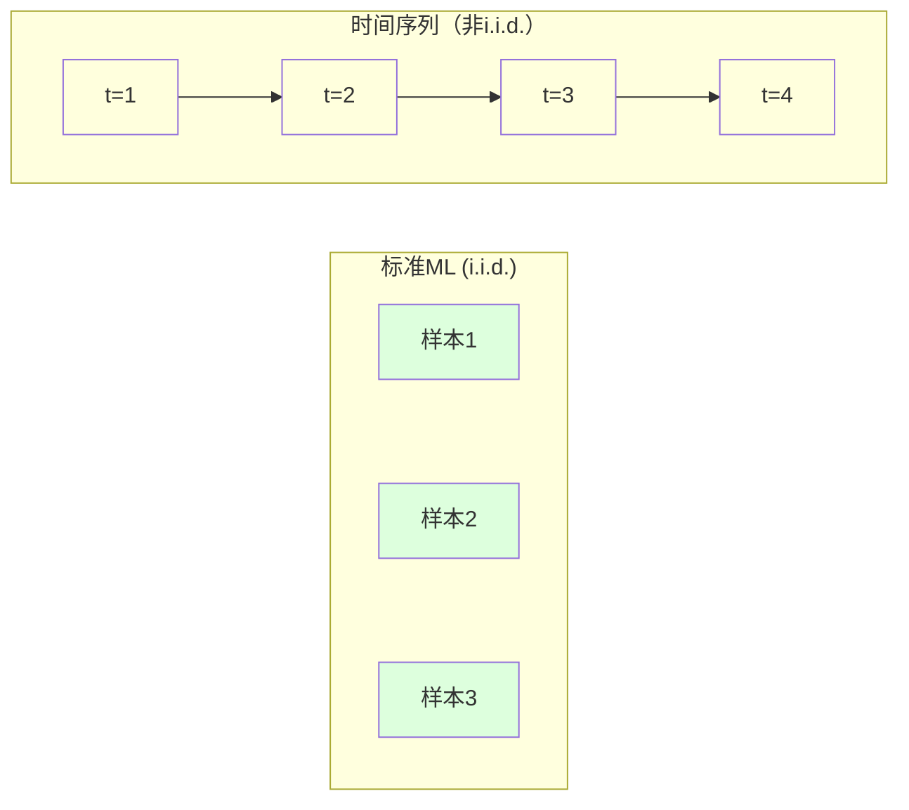
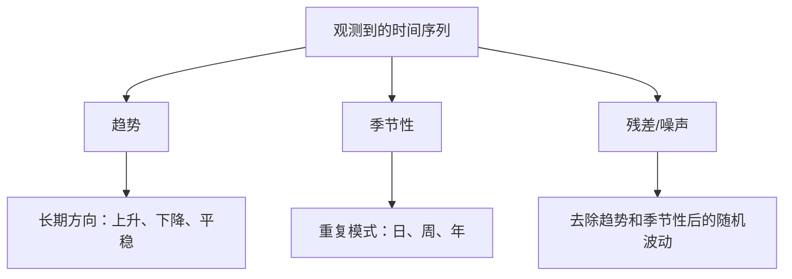
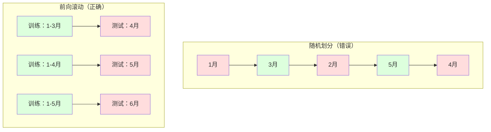

# 时间序列基础（Time Series Fundamentals）

> 历史确实能预测未来——前提是你先检验了平稳性。

**类型：** 动手实现
**语言：** Python
**前置知识：** 第二阶段第1-9课
**预计时间：** 约90分钟

## 学习目标

- 把一条时间序列分解为趋势、季节性和残差成分，并检验平稳性
- 构造滞后特征和滚动统计量，将时间序列问题转化为监督学习问题
- 搭建前向滚动验证框架，防止未来数据泄露到训练集
- 解释为什么随机划分对时间序列是错误的，并展示与正确时间划分相比的性能差距

## 问题背景

你有一份按时间排序的数据：每日销售额、每小时气温、每分钟 CPU 使用率、每周股价。你想预测下一个值、下一周、下一季度。

于是你拿出惯用的 ML 工具箱：随机划分训练集和测试集、交叉验证、输入特征矩阵、输出预测。——然而每一步都是错的。

时间序列打破了标准 ML 所依赖的假设。样本不是独立的——今天的气温取决于昨天的。随机划分会让未来信息泄露到过去。看起来回测效果很好的特征，上线后往往失败，因为它们依赖于会随时间漂移的模式。

**用随机交叉验证得到 95% 准确率的模型，用正确的时间评估方式可能只有 55%。** 这个差距不是技术细节，而是"纸面上能跑通"和"生产中真的有效"之间的差距。

本课涵盖基本功：时间数据有什么特殊性、如何诚实地评估模型、以及如何把时间序列转化成标准 ML 模型能够消费的特征。

## 核心概念

### 时间序列有什么特殊性

标准 ML 假设 i.i.d.——独立同分布：每个样本从相同的分布中独立采样。时间序列同时违反这两点：

- **不独立。** 今天的股价取决于昨天的，本周销售额和上周相关。
- **不同分布。** 分布随时间漂移。12月的销售额和3月的看起来完全不同。

这不是无关紧要的小问题。它改变了你构建特征、评估模型、选择算法的每一个方面。



标准 ML 的样本可以互换，打乱顺序什么都不会变。时间序列里，顺序就是一切，打乱了就没有信号了。

### 时间序列的组成部分

每条时间序列都是以下几部分的叠加：



- **趋势（Trend）**：长期走向。营收每年增长 10%，全球气温持续上升。
- **季节性（Seasonality）**：在固定间隔重复的模式。零售销售额在 12 月飙升，空调用电在 7 月达到峰值。
- **残差（Residual）**：去除趋势和季节性后剩下的部分。如果残差看起来像白噪声，说明分解捕获了信号中的规律。

### 平稳性（Stationarity）

如果一条时间序列的统计特性（均值、方差、自相关）不随时间变化，就称它是**平稳的**。大多数预测方法都假设平稳性。

**为什么重要：** 非平稳序列的均值会漂移。在一月数据上训练的模型，学到的均值和二月的不一样——它将系统性地出错。

**如何检验：** 计算滚动均值和滚动标准差。如果它们漂移了，序列就是非平稳的。

**如何修复：** 差分（Differencing）。不建模原始值，而是建模相邻两个时间步之间的变化量：

```
diff[t] = value[t] - value[t-1]
```

一阶差分不够的话，再做一次（二阶差分）。实际中大多数序列最多需要两阶差分。

**举例：**

```
原始序列：[100, 102, 106, 112, 120]
一阶差分：[2, 4, 6, 8]     （还有上升趋势）
二阶差分：[2, 2, 2]         （恒定——平稳了！）
```

原始序列有二次趋势，一阶差分变成线性趋势，二阶差分变成平坦。

**正式检验：** 增广 Dickey-Fuller（ADF）检验是检验平稳性的标准统计方法。原假设是"序列非平稳"，p 值低于 0.05 时拒绝原假设，得出平稳结论。我们不从零实现 ADF（需要渐进分布表），但代码中的滚动统计方法可以给出实用的可视化检验。

### 自相关（Autocorrelation）

自相关衡量时刻 t 的值与 t-k 时刻的值（k 步之前）之间的相关性。自相关函数（ACF）画出每个滞后 k 对应的相关系数。

**ACF 能告诉你：**
- 序列的"记忆"有多长——如果 ACF 在滞后 5 之后降到零，5 步之前的值就无关紧要了
- 是否存在季节性——如果 ACF 在滞后 12 处（月度数据）有峰值，说明存在年度季节性
- 应该创建多少个滞后特征——用到 ACF 变得可忽略的滞后阶数为止

**偏自相关函数（PACF）** 去除了间接相关性。如果今天和三天前相关，只是因为两者都与昨天相关，那么 PACF 在滞后 3 处为零，而 ACF 不为零。

### 滞后特征：把时间序列转化为监督学习

标准 ML 模型需要特征矩阵 X 和目标 y，而时间序列只给你一列数值。连接两者的桥梁就是**滞后特征**。

取序列 [10, 12, 14, 13, 15]，创建滞后 1 和滞后 2 特征：

| lag_2 | lag_1 | 目标 |
|-------|-------|------|
| 10    | 12    | 14   |
| 12    | 14    | 13   |
| 14    | 13    | 15   |

现在你有了一个标准回归问题。任何 ML 模型（线性回归、随机森林、梯度提升）都可以用滞后特征预测目标值。

还可以构造的其他特征：
- **滚动统计量**：过去 k 个值的均值、标准差、最小值、最大值
- **日历特征**：星期几、月份、是否节假日、是否周末
- **差分值**：相对上一步的变化量
- **扩展统计量**：累积均值、累积求和
- **比率特征**：当前值 / 滚动均值（偏离近期均值的程度）
- **交互特征**：lag_1 × 星期几（星期几对动量的影响）

**创建多少个滞后？** 用自相关函数判断。如果 ACF 在滞后 10 之前都显著，至少创建 10 个滞后特征。如果有周级别季节性，加入滞后 7（可能还要加 14）。更多滞后给模型更多历史信息，但也带来更多特征，增加过拟合风险。

**目标对齐陷阱。** 创建滞后特征时，目标必须是时刻 t 的值，所有特征必须使用时刻 t-1 或更早的值。如果不小心把时刻 t 的值包含进了特征，你就有了一个完美预测器——同时也是一个完全没用的模型。这是时间序列特征工程中最常见的 bug。

### 前向滚动验证（Walk-Forward Validation）

**这是本课最重要的概念。** 标准 K 折交叉验证随机分配样本，对时间序列会造成未来信息泄露。



前向滚动验证的流程：
1. 在截止时刻 t 的数据上训练
2. 预测 t+1（或 t+1 到 t+k 的多步预测）
3. 将窗口向前滑动
4. 重复

每个测试折都只包含所有训练数据之后的数据——没有未来泄露。这给出了模型部署后真实性能的诚实估计。

**扩展窗口（Expanding window）** 使用所有历史数据训练（窗口增长）。**滑动窗口（Sliding window）** 使用固定大小的训练窗口（窗口滑动）。当你认为历史数据仍然有参考价值时用扩展窗口；当世界在变化、旧数据反而有害时用滑动窗口。

### ARIMA 直觉理解

ARIMA 是经典的时间序列模型，有三个组件：

- **AR（自回归）**：用过去的值预测未来。AR(p) 使用过去 p 个值。
- **I（整合）**：差分以实现平稳性。I(d) 做 d 阶差分。
- **MA（移动平均）**：用过去的预测误差来修正预测。MA(q) 使用过去 q 个误差。

ARIMA(p, d, q) 结合了三者。根据 ACF/PACF 分析或自动搜索（auto-ARIMA）来选择 p、d、q。

我们不从零实现 ARIMA——它需要超出本课范围的数值优化。关键是理解每个组件做什么，这样你才能解读 ARIMA 结果，知道什么时候该用它。

### 该用什么方法

| 方法 | 最适合 | 能处理季节性 | 能处理外部特征 |
|------|--------|------------|--------------|
| 滞后特征 + ML | 有很多外部特征的表格数据 | 用日历特征 | 可以 |
| ARIMA | 单变量序列、短期预测 | SARIMA 变体 | 有限（ARIMAX） |
| 指数平滑 | 简单的趋势+季节性 | 可以（Holt-Winters） | 不可以 |
| Prophet | 商业预测、节假日 | 可以（傅里叶项） | 有限 |
| 神经网络（LSTM、Transformer） | 长序列、多序列 | 自动学习 | 可以 |

对大多数实际问题，**滞后特征 + 梯度提升** 是最强的起点：天然处理外部特征，不要求平稳性，易于调试。

### 预测时间跨度与策略

单步预测只预测下一个时间步。多步预测要预测多个时间步。有三种策略：

**递归（Recursive）**：预测一步，把预测值作为下一步的输入，循环往复。实现简单，但误差会累积——每步预测都用上了上一步的预测，错误不断叠加。

**直接（Direct）**：为每个时间跨度单独训练一个模型。模型-1 预测 t+1，模型-5 预测 t+5。没有误差累积，但每个模型的训练样本更少，各模型之间不共享信息。

**多输出（Multi-output）**：训练一个同时输出所有时间跨度的模型，在不同跨度间共享信息，但需要支持多输出的模型或自定义损失函数。

实际中：短跨度（1-5 步）用递归，更长跨度用直接。

### 时间序列的常见错误

| 错误 | 为什么会犯 | 如何修正 |
|------|-----------|---------|
| 随机划分训练/测试集 | 标准 ML 的习惯 | 用前向滚动或时间划分 |
| 使用未来特征 | 不小心包含了时刻 t 的特征 | 逐一审查每个特征的时间对齐 |
| 对季节性过拟合 | 模型记住了日历模式 | 测试集至少包含一个完整的季节周期 |
| 忽略尺度变化 | 营收翻倍但模式不变 | 建模百分比变化而非绝对值 |
| 滞后特征太多 | "历史越多越好" | 用 ACF 确定有意义的滞后阶数 |
| 不做差分 | "模型会自己学会的" | 树模型能处理趋势，线性模型需要平稳性 |

## 动手实现

`code/time_series.py` 从零实现了核心构建模块。

### 滞后特征生成器

```python
def make_lag_features(series, n_lags):
    n = len(series)
    X = np.full((n, n_lags), np.nan)
    for lag in range(1, n_lags + 1):
        X[lag:, lag - 1] = series[:-lag]
    valid = ~np.isnan(X).any(axis=1)
    return X[valid], series[valid]
```

把一维序列转换成特征矩阵：每行包含过去 `n_lags` 个值作为特征，当前值作为目标。

### 前向滚动交叉验证

```python
def walk_forward_split(n_samples, n_splits=5, min_train=50):
    assert min_train < n_samples, "min_train must be less than n_samples"
    step = max(1, (n_samples - min_train) // n_splits)
    for i in range(n_splits):
        train_end = min_train + i * step
        test_end = min(train_end + step, n_samples)
        if train_end >= n_samples:
            break
        yield slice(0, train_end), slice(train_end, test_end)
```

每次划分都严格保证训练数据在测试数据之前。训练窗口随每个折扩展。

### 简单自回归模型

纯 AR 模型就是在滞后特征上做线性回归：

```python
class SimpleAR:
    def __init__(self, n_lags=5):
        self.n_lags = n_lags
        self.weights = None
        self.bias = None

    def fit(self, series):
        X, y = make_lag_features(series, self.n_lags)
        # 用正规方程求解
        X_b = np.column_stack([np.ones(len(X)), X])
        theta = np.linalg.lstsq(X_b, y, rcond=None)[0]
        self.bias = theta[0]
        self.weights = theta[1:]
        return self
```

这在概念上和第2课的线性回归完全相同，只是把自变量换成了同一变量的历史滞后值。

### 平稳性检验

代码通过计算滚动统计量来可视化和定量地评估平稳性：

```python
def check_stationarity(series, window=50):
    rolling_mean = np.array([
        series[max(0, i - window):i].mean()
        for i in range(1, len(series) + 1)
    ])
    rolling_std = np.array([
        series[max(0, i - window):i].std()
        for i in range(1, len(series) + 1)
    ])
    return rolling_mean, rolling_std
```

如果滚动均值漂移或滚动标准差改变，序列就是非平稳的，需要差分后再检验一次。

代码还通过对比序列前半段和后半段来检验平稳性：如果均值相差超过半个标准差，或者方差之比超过 2 倍，就标记为非平稳。

### 自相关计算

```python
def autocorrelation(series, max_lag=20):
    n = len(series)
    mean = series.mean()
    var = series.var()
    acf = np.zeros(max_lag + 1)
    for k in range(max_lag + 1):
        cov = np.mean((series[:n-k] - mean) * (series[k:] - mean))
        acf[k] = cov / var if var > 0 else 0
    return acf
```

## 实际使用

用 sklearn，可以直接把滞后特征搭配任意回归器使用：

```python
from sklearn.linear_model import Ridge
from sklearn.ensemble import GradientBoostingRegressor

X, y = make_lag_features(series, n_lags=10)

for train_idx, test_idx in walk_forward_split(len(X)):
    model = Ridge(alpha=1.0)
    model.fit(X[train_idx], y[train_idx])
    predictions = model.predict(X[test_idx])
```

ARIMA 使用 statsmodels：

```python
from statsmodels.tsa.arima.model import ARIMA

model = ARIMA(train_series, order=(5, 1, 2))
fitted = model.fit()
forecast = fitted.forecast(steps=30)
```

`time_series.py` 中同时演示了两种方法，并用前向滚动验证进行对比。

### sklearn TimeSeriesSplit

sklearn 提供了 `TimeSeriesSplit`，实现了前向滚动验证：

```python
from sklearn.model_selection import TimeSeriesSplit

tscv = TimeSeriesSplit(n_splits=5)
for train_index, test_index in tscv.split(X):
    X_train, X_test = X[train_index], X[test_index]
    y_train, y_test = y[train_index], y[test_index]
    model.fit(X_train, y_train)
    score = model.score(X_test, y_test)
```

等价于我们从零实现的 `walk_forward_split`，但与 sklearn 的交叉验证框架无缝集成，可以搭配 `cross_val_score` 使用：

```python
from sklearn.model_selection import cross_val_score

scores = cross_val_score(model, X, y, cv=TimeSeriesSplit(n_splits=5))
print(f"平均得分: {scores.mean():.4f} +/- {scores.std():.4f}")
```

### 评估指标

时间序列预测使用回归指标，但需要结合时间背景来解读：

- **MAE（平均绝对误差）**：|预测值 - 真实值| 的平均。容易用原始单位解读——"平均预测误差为 3.2 度"。
- **RMSE（均方根误差）**：均方误差的平方根。对大误差的惩罚比 MAE 更重。当大误差比很多小误差更糟时使用。
- **MAPE（平均绝对百分比误差）**：|误差/真实值| × 100 的平均。与尺度无关，便于跨序列对比。当真实值为零时无法计算。
- **与朴素基线对比**：永远要和简单基线比较。"季节性朴素基线"预测值等于上一个周期同期的值（昨天、上周）。如果你的模型打不过这个，说明哪里出了问题。

### 滚动特征

代码演示了在滞后特征之外加入滚动统计量（7 天和 14 天窗口的均值、标准差、最小值、最大值）。这些特征让模型能感知到单纯滞后特征无法捕捉的近期趋势和波动性。

比如滚动均值在上升，说明有上升趋势；滚动标准差在增加，说明波动性在增大。这些是基于树的模型能学到但线性模型学不到的模式。

## 成果

本课产出：
- `outputs/prompt-time-series-advisor.md` —— 构建时间序列问题框架的提示词
- `code/time_series.py` —— 滞后特征、前向滚动验证、AR 模型、平稳性检验

### 你必须超越的基线

在建模之前，先建立基线：

1. **持久性（Persistence）**：预测明天和今天一样。对很多序列，这个基线出人意料地难以超越。
2. **季节性朴素**：预测今天和上周同日一样（或去年同日）。如果你的模型连这个都打不过，它除了记住季节性什么都没学到。
3. **移动平均**：预测过去 k 个值的平均。平滑了噪声，但无法捕捉突然变化。

如果你精心设计的 ML 模型输给了季节性朴素基线，一定是出了 bug。最常见的原因：特征中有未来泄露、评估方法不对，或者这条序列本身是真正随机的、不可预测的。

### 实践建议

1. **先画图。** 建模之前，先把原始序列画出来。观察趋势、季节性、异常值、结构性断点（行为突然改变）。30 秒的目视检查往往比一小时的自动化分析更有价值。

2. **先差分，再建模。** 如果序列有明显趋势，先差分再创建滞后特征。树模型能处理趋势，但线性模型不行；差分了也不会有坏处。

3. **测试集至少包含一个完整的季节周期。** 如果有周级别季节性，测试集需要至少一整周；月级别的，至少一整个月。否则无法评估模型是否真的捕捉了季节模式。

4. **在生产中持续监控。** 时间序列模型会随世界的变化而老化。持续跟踪滚动预测误差，当误差开始上升时，用近期数据重新训练。

5. **警惕体制转换（Regime changes）。** 疫情前数据上训练的模型无法预测疫情后的行为。把已知的体制变化作为特征加进去，或者使用滑动窗口来"遗忘"陈旧的历史。

6. **对偏态序列做对数变换。** 营收、价格、计数值通常是右偏的。取对数能稳定方差，把乘法模式转化为加法模式（线性模型能处理的形式）。在对数空间里预测，再指数化回原始单位。

## 练习

1. **平稳性实验。** 生成一条带线性趋势的序列，用滚动统计量检验平稳性，做一阶差分后再检验。二次趋势需要几阶差分？

2. **滞后阶数选择。** 对一条有季节性的序列（周期=7）计算 ACF，哪些滞后阶数的自相关最高？只用那些滞后阶数（不用连续的 1 到 7），与用 1 到 7 阶滞后相比，准确率是否提升？

3. **前向滚动 vs 随机划分。** 在滞后特征上训练 Ridge 回归，分别用随机 80/20 划分和前向滚动验证评估。随机划分高估了多少性能？

4. **特征工程。** 在滞后特征基础上加入 7 天滚动均值、7 天滚动标准差和星期几特征。用前向滚动验证对比加了这些特征前后的准确率。

5. **多步预测。** 修改 AR 模型，预测未来 5 步而非 1 步。对比两种策略：(a) 递归——每次预测一步，把预测值作为下一步输入；(b) 直接——为每个预测跨度单独训练一个模型。哪种更准确？

## 关键术语

| 术语 | 常见说法 | 实际含义 |
|------|---------|---------|
| 平稳性（Stationarity） | "统计量不随时间变化" | 均值、方差、自相关结构都随时间保持恒定的序列 |
| 差分（Differencing） | "相邻值相减" | 计算 y[t] - y[t-1] 以消除趋势、实现平稳 |
| 自相关函数（ACF） | "序列与自身的相关" | 时间序列与其自身滞后 k 步版本的相关系数，作为 k 的函数 |
| 偏自相关函数（PACF） | "纯直接相关" | 去除所有更短滞后影响后，滞后 k 处的自相关 |
| 滞后特征（Lag features） | "用过去值作为输入" | 用 y[t-1]、y[t-2]、...、y[t-k] 作为特征预测 y[t] |
| 前向滚动验证（Walk-forward validation） | "时间感知的交叉验证" | 训练数据在时间上始终严格早于测试数据的评估方法 |
| ARIMA | "经典时间序列模型" | 自回归积分移动平均：结合过去值（AR）、差分（I）和过去误差（MA） |
| 季节性（Seasonality） | "周期性的日历模式" | 与日历周期（日、周、年）绑定的规律性、可预期的周期模式 |
| 趋势（Trend） | "长期走向" | 序列水平随时间持续上升或下降 |
| 扩展窗口（Expanding window） | "用全部历史" | 每个折的训练集都包含所有历史数据，随折的推进而增长 |
| 滑动窗口（Sliding window） | "固定大小的历史" | 每个折的训练集大小固定，随时间向前滑动 |

## 延伸阅读

- [Hyndman and Athanasopoulos, Forecasting: Principles and Practice (第3版)](https://otexts.com/fpp3/) —— 最好的免费时间序列预测教材
- [scikit-learn TimeSeriesSplit](https://scikit-learn.org/stable/modules/generated/sklearn.model_selection.TimeSeriesSplit.html) —— sklearn 的前向滚动划分器
- [statsmodels ARIMA 文档](https://www.statsmodels.org/stable/generated/statsmodels.tsa.arima.model.ARIMA.html) —— 含诊断功能的 ARIMA 实现
- [Makridakis et al., The M5 Competition (2022)](https://www.sciencedirect.com/science/article/pii/S0169207021001874) —— 大规模预测竞赛，展示了 ML 方法与统计方法的对比
