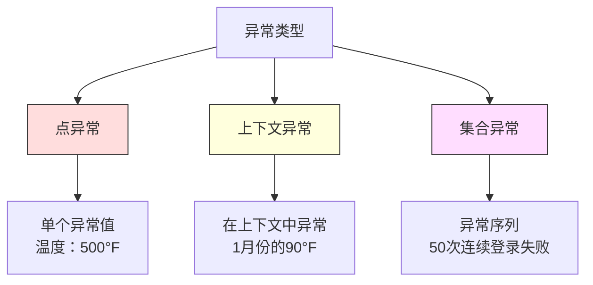
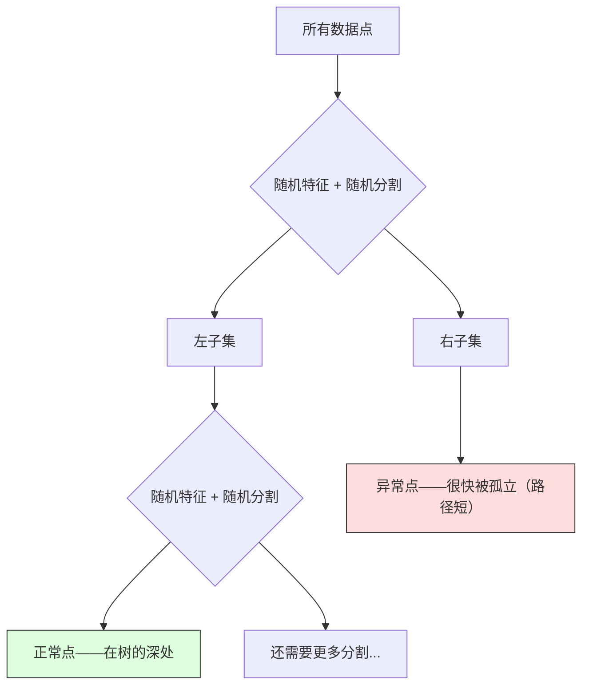

# 异常检测（Anomaly Detection）

> "正常"很容易定义，"异常"就是所有不符合正常的东西。

**类型：** 动手实现
**语言：** Python
**前置知识：** 第二阶段第1-9课
**预计时间：** 约75分钟

## 学习目标

- 从零实现 Z-score、IQR 和孤立森林三种异常检测方法
- 区分点异常、上下文异常和集合异常，为每种类型选择合适的检测方法
- 解释为什么异常检测是建模"正常数据"而不是分类"异常"
- 对比无监督异常检测与监督分类，理解两者在新型异常覆盖率和精确率上的权衡

## 问题背景

一张信用卡下午 2 点在纽约被使用，2 点 5 分又在东京被使用；工厂传感器读数 150 度，而正常范围是 80-120 度；服务器每秒发出 5 万个请求，而日常平均只有 200 个。

这些都是异常。发现它们至关重要——欺诈每年造成数十亿损失，设备故障带来停工，网络入侵导致数据泄露。

难点在于：你几乎没有异常样本的标注。欺诈只占交易量的 0.1%，设备故障一年发生几次。你无法训练标准分类器，因为"异常"类别里几乎没有可学习的样本。就算有一些标注，你见过的异常类型也远不是全部——明天的欺诈手法和今天的看起来完全不同。

**异常检测翻转了这个问题：** 不学什么是异常，而是学什么是正常，偏离正常的就是可疑的。这种方式不需要标注、能适应新型异常、可以扩展到海量数据集。

## 核心概念

### 异常的类型

并非所有异常都一样：

- **点异常（Point anomaly）**：单个数据点无论在什么上下文中都很反常。温度读数 500 度，通常只花 50 美元的账户出现了 50000 美元的交易。
- **上下文异常（Contextual anomaly）**：在特定上下文中才显得异常的数据点。90 度在夏天正常，在冬天就是异常。数值相同，上下文不同。
- **集合异常（Collective anomaly）**：一组数据点作为整体看才显得异常，尽管每个单独的点可能都是正常的。5 次登录失败是正常的，连续 50 次就是暴力破解攻击。

大多数方法检测点异常；上下文异常需要时间或位置特征；集合异常需要感知序列的方法。



### 无监督框架

在标准分类中，你有两类的标注。在异常检测里，通常面对三种情况之一：

1. **完全无监督**：没有任何标注。在全量数据上拟合检测器，希望异常足够稀少，不会污染"正常"模型。
2. **半监督**：只有一批干净的正常数据。在干净数据上拟合，对其余所有数据打分。这是条件允许时最强的设置。
3. **弱监督**：有少量标注的异常样本。用它们来评估，而不是训练。无监督地训练，然后在有标注的子集上测量精确率/召回率。

核心洞察：**异常检测与分类有本质区别**。你建模的是正常数据的分布，而不是两类之间的决策边界。

### 监督 vs 无监督：权衡

如果你确实有标注的异常，应该用它们训练（监督分类）还是只用来评估（无监督检测）？

**监督（当成分类问题）：**
- 能精准捕获你见过的那些异常类型
- 在已知异常类型上精确率更高
- 完全漏掉新型异常
- 出现新异常类型时需要重新训练
- 需要足够的异常样本（往往太少）

**无监督（建模正常，标记偏差）：**
- 能捕获任何偏离正常的情况，包括新型异常
- 不需要标注异常
- 误报率更高（不是所有异常的东西都真的有问题）
- 对分布漂移更鲁棒

实践中，最好的系统结合两者：无监督检测提供广泛覆盖，监督模型处理已知的高优先级异常类型，人工审核处理模糊情况。

### Z-Score 方法

最简单的方法。计算每个特征的均值和标准差，标记任何偏离均值超过 k 个标准差的点。

```text
z_score = (x - 均值) / 标准差
若 |z_score| > 阈值，则标记为异常
```

默认阈值是 3.0（高斯分布中 99.7% 的正常数据落在均值 3 个标准差以内）。

**优点：** 简单、快速、可解释（"这个值偏离正常水平 4.5 个标准差"）。

**缺点：** 假设数据服从正态分布；对训练数据中的离群点敏感（离群点会影响均值和标准差，使它们更难被检测到）；在多峰分布上失效。

**适用场景：** 数据近似钟形曲线的单特征监控，如服务器响应时间、制造公差、有稳定基线的传感器读数。

**失效场景：** 多簇数据（两个办公地点有不同基线温度）、偏态数据（交易金额中 1000 美元虽少见但不异常）、训练集里有离群点的情况。

### IQR 方法

比 Z-score 更鲁棒。使用四分位距代替均值和标准差。

```
Q1 = 第25百分位数
Q3 = 第75百分位数
IQR = Q3 - Q1
下界 = Q1 - factor × IQR
上界 = Q3 + factor × IQR
若 x < 下界 或 x > 上界，则标记为异常
```

默认 factor 为 1.5。

**优点：** 对离群点鲁棒（百分位数不受极端值影响）；适用于偏态分布；不假设正态性。

**缺点：** 仅单变量（每个特征独立判断）；无法检测只有在联合特征空间中才显得异常的点——某个点在每个特征单独看都正常，但在联合分布里是异常的。

**实际说明：** IQR 中的 1.5 系数对应箱线图的须（whiskers），须外的点是潜在离群点。用 3.0 代替 1.5 会让检测器更保守（更少标记，更少误报）。合适的系数取决于你对误报的容忍度。

### 孤立森林（Isolation Forest）

核心洞察：**异常数量少且特征不同**。在对数据进行随机划分时，异常更容易被孤立——只需要更少的随机分割就能把它们从其余数据中分开。



**工作原理：**
1. 构建很多棵随机树（组成孤立森林）
2. 每个节点随机选一个特征和该特征 min-max 范围内的随机分割值
3. 持续分割直到每个点都被孤立（在独自的叶子节点里）
4. 异常点在所有树上的平均路径长度更短

**为什么有效：** 正常点住在稠密区域，要把它们从邻居中孤立出来需要很多随机分割；异常点住在稀疏区域，一两次随机分割就够了。

异常分数基于所有树上的平均路径长度，用随机二叉搜索树的期望路径长度归一化：

```
score(x) = 2^(-平均路径长度(x) / c(n))
```

其中 `c(n)` 是 n 个样本时的期望路径长度。分数接近 1 意味着异常；接近 0.5 意味着正常；接近 0 意味着非常正常（深处于稠密簇）。

**优点：** 不假设分布；适用于高维数据；扩展性好（每棵树只用子采样，复杂度次线性）；处理混合特征类型。

**缺点：** 对稠密区域中的异常效果差（masking 效应）；当很多特征无关时，随机分割效果变差。

**关键超参数：**
- `n_estimators`：树的数量，通常 100 棵就够，更多树的分数更稳定但计算更慢
- `max_samples`：每棵树的样本数，默认 256。更小的值使单棵树准确性下降但增加多样性——子采样正是让孤立森林快速的原因
- `contamination`：预期异常比例，只用于设置阈值，不影响分数本身

### 局部离群因子（Local Outlier Factor，LOF）

LOF 把某个点周围的局部密度与其邻居的密度进行比较。处于稀疏区域但被稠密区域包围的点就是异常。

**工作原理：**
1. 找每个点的 k 个最近邻
2. 计算局部可达密度（邻域有多稠密）
3. 比较每个点的密度与其邻居的密度
4. 如果某点的密度远低于其邻居，就是离群点

**LOF 分数：**
- 接近 1.0：与邻居密度相似（正常）
- 大于 1.0：密度低于邻居（可能是异常）
- 远大于 1.0（如 2.0+）：密度显著低于邻居（很可能是异常）

**"局部"**这个特性至关重要。设想一个数据集有两个簇：一个 1000 个点的稠密簇和一个 50 个点的稀疏簇。稀疏簇边缘的点从全局来看并不异常——它有 50 个邻居。但如果它的直接邻居比它自身更稠密，它在局部就是异常的。LOF 捕捉了全局方法遗漏的这种细微差异。

**优点：** 能检测局部异常（在邻域中异常但全局不异常的点）；适用于密度不同的多个簇。

**缺点：** 在大数据集上慢（朴素实现是 O(n²)）；对 k 的选择敏感；在高维空间效果变差（维度诅咒影响距离计算）。

### 方法对比

| 方法 | 假设 | 速度 | 适用高维 | 检测局部异常 |
|------|------|------|---------|------------|
| Z-score | 正态分布 | 非常快 | 是（逐特征） | 否 |
| IQR | 无（逐特征） | 非常快 | 是（逐特征） | 否 |
| 孤立森林 | 无 | 快 | 是 | 部分 |
| LOF | 距离有意义 | 慢 | 差 | 是 |

### 评估的挑战

评估异常检测器比评估分类器更难：

- **极端类别不均衡。** 0.1% 是异常时，对所有样本预测"正常"就有 99.9% 准确率——准确率完全没用。
- **AUROC 会误导人。** 严重不均衡时，即使模型在实用阈值下漏掉了大多数异常，AUROC 看起来依然很高。
- **更好的指标：** Precision@k（前 k 个标记中有多少是真实异常）、AUPRC（精确率-召回率曲线下面积）、固定误报率下的召回率。

```mermaid
flowchart LR
    A[原始数据] --> B[只在正常数据上训练]
    B --> C[对所有测试数据打分]
    C --> D[按异常分数排名]
    D --> E[评估排名前K的点]
    E --> F[Precision@K / AUPRC]

    style A fill:#f9f,stroke:#333
    style F fill:#9f9,stroke:#333
```

### 异常检测流程

实践中，异常检测遵循以下工作流程：

1. **收集基线数据。** 理想情况下选取一段已知没有（或很少有）异常的时期。
2. **特征工程。** 原始特征加上衍生特征（滚动统计量、时间特征、比率）。
3. **训练检测器。** 在基线数据上拟合，模型学习"正常"是什么样的。
4. **对新数据打分。** 每条新观测得到一个异常分数。
5. **阈值选择。** 选择分数截断点。这是业务决策，不是技术问题：阈值越高误报越少，但漏检越多。
6. **告警与调查。** 被标记的点交给人工审核或自动化响应。
7. **反馈收集。** 记录被标记的点是真实异常还是误报。用这些数据评估和调优检测器。

这个流程永远不会"完成"——数据分布会漂移，新型异常会出现，阈值需要持续调整。把异常检测当作一个活的系统，而不是一个一次性的模型。

## 动手实现

`code/anomaly_detection.py` 从零实现了 Z-score、IQR 和孤立森林。

### Z-Score 检测器

```python
def zscore_detect(X, threshold=3.0):
    mean = X.mean(axis=0)
    std = X.std(axis=0)
    std[std == 0] = 1.0
    z = np.abs((X - mean) / std)
    return z.max(axis=1) > threshold
```

简洁且向量化。只要任意一个特征超过阈值，就标记该点。

### IQR 检测器

```python
def iqr_detect(X, factor=1.5):
    q1 = np.percentile(X, 25, axis=0)
    q3 = np.percentile(X, 75, axis=0)
    iqr = q3 - q1
    iqr[iqr == 0] = 1.0
    lower = q1 - factor * iqr
    upper = q3 + factor * iqr
    outside = (X < lower) | (X > upper)
    return outside.any(axis=1)
```

### 从零实现孤立森林

从零实现构建随机划分特征空间的孤立树：

```python
class IsolationTree:
    def __init__(self, max_depth):
        self.max_depth = max_depth

    def fit(self, X, depth=0):
        n, p = X.shape
        if depth >= self.max_depth or n <= 1:
            self.is_leaf = True
            self.size = n
            return self
        self.is_leaf = False
        self.feature = np.random.randint(p)
        x_min = X[:, self.feature].min()
        x_max = X[:, self.feature].max()
        if x_min == x_max:
            self.is_leaf = True
            self.size = n
            return self
        self.threshold = np.random.uniform(x_min, x_max)
        left_mask = X[:, self.feature] < self.threshold
        self.left = IsolationTree(self.max_depth).fit(X[left_mask], depth + 1)
        self.right = IsolationTree(self.max_depth).fit(X[~left_mask], depth + 1)
        return self
```

孤立一个点所需的路径长度决定其异常分数——路径越短越异常。

`IsolationForest` 类封装多棵树：

```python
class IsolationForest:
    def __init__(self, n_estimators=100, max_samples=256, seed=42):
        self.n_estimators = n_estimators
        self.max_samples = max_samples

    def fit(self, X):
        sample_size = min(self.max_samples, X.shape[0])
        max_depth = int(np.ceil(np.log2(sample_size)))
        for _ in range(self.n_estimators):
            idx = rng.choice(X.shape[0], size=sample_size, replace=False)
            tree = IsolationTree(max_depth=max_depth)
            tree.fit(X[idx])
            self.trees.append(tree)

    def anomaly_score(self, X):
        # 计算所有树上的平均路径长度
        avg_path = ...  # 跨树平均路径长度
        scores = 2.0 ** (-avg_path / c(max_samples))
        return scores
```

归一化因子 `c(n)` 是 n 个元素的二叉搜索树中失败搜索的期望路径长度，等于 `2 × H(n-1) - 2×(n-1)/n`，其中 H 是调和数。这个归一化保证了不同大小数据集上的分数可以相互比较。

### 演示场景

代码生成多个测试场景：

1. **单簇带离群点**：一个 2D 高斯簇，在远离中心处注入异常。所有方法都应该在这里有效。
2. **多峰数据**：三个大小和密度不同的簇。簇之间的点是异常的。Z-score 在这里吃力，因为每个特征的值域范围很宽。
3. **高维数据**：50 个特征，但异常只在其中 5 个特征上有差异。测试各方法能否在特征子集中找到异常。

每个场景用精确率、召回率、F1 和 Precision@k 对比所有方法。

## 实际使用

使用 sklearn：

```python
from sklearn.ensemble import IsolationForest
from sklearn.neighbors import LocalOutlierFactor

iso = IsolationForest(n_estimators=100, contamination=0.05, random_state=42)
iso.fit(X_train)
predictions = iso.predict(X_test)

lof = LocalOutlierFactor(n_neighbors=20, contamination=0.05, novelty=True)
lof.fit(X_train)
predictions = lof.predict(X_test)
```

注意 `contamination` 设置了预期异常比例。设置准确很重要——太低会漏掉异常，太高会产生误报。

`anomaly_detection.py` 在同一数据上对比从零实现和 sklearn 版本。

### sklearn contamination 参数

sklearn 中的 `contamination` 参数决定了将连续异常分数转化为二值预测的阈值，不影响底层分数。

```python
iso_5 = IsolationForest(contamination=0.05)
iso_10 = IsolationForest(contamination=0.10)
```

两者产生相同的异常分数，但 `iso_5` 标记前 5% 而 `iso_10` 标记前 10%。如果不知道真实异常率（通常不知道），把 contamination 设为 "auto"，直接使用原始分数，根据误报和漏报的成本权衡自己设阈值。

### 单类 SVM（One-Class SVM）

另一种值得了解的无监督异常检测器。单类 SVM 在高维特征空间中（利用核函数技巧）拟合一个包围正常数据的边界。

```python
from sklearn.svm import OneClassSVM

oc_svm = OneClassSVM(kernel="rbf", gamma="auto", nu=0.05)
oc_svm.fit(X_train)
predictions = oc_svm.predict(X_test)
```

`nu` 参数近似等于异常比例。单类 SVM 在中小型数据集上效果不错，但无法扩展到大数据（核矩阵大小是样本数的平方）。

### 自编码器方法（预告）

自编码器是学习压缩和重建数据的神经网络。在正常数据上训练后，测试时异常数据的重建误差很高，因为网络只学会了重建正常模式。

第三阶段（深度学习）会详细讲这个，原理和这里一样：建模正常，标记偏差。

### 集成异常检测

就像集成方法改进分类（第11课），组合多个异常检测器也能改进检测效果。最简单的方法：

1. 运行多个检测器（Z-score、IQR、孤立森林、LOF）
2. 把每个检测器的分数归一化到 [0, 1]
3. 对归一化分数取平均
4. 标记平均分数超过阈值的点

这能减少误报，因为不同方法有不同的失效场景——一个被四种方法都标记的点几乎肯定是异常；只被一种方法标记的点可能只是那种方法的特殊情况。

更复杂的集成方式会根据每个检测器的估计可靠性（在有标注异常的验证集上衡量）加权。

### 生产部署注意事项

1. **阈值漂移。** 随着数据分布的变化，固定阈值会过时。监控异常分数的分布，定期调整。
2. **告警疲劳。** 误报太多，操作员就会不再关注。从高阈值（更少但更可靠的告警）开始，随着信任建立逐步降低。
3. **集成方法。** 在生产中组合多个检测器，只有多种方法都认为异常的点才发出告警，显著减少误报。
4. **特征工程。** 原始特征很少够用。加入滚动统计量、比率、距上次事件的时间、领域特定特征。好的特征集合比检测器的选择更重要。
5. **反馈闭环。** 当操作员调查被标记的点并确认或否定时，把结果反馈回系统。随时间积累标注数据，用于评估和改进检测器。

## 成果

本课产出：
- `outputs/skill-anomaly-detector.md` —— 选择正确检测器的决策技能提示词
- `code/anomaly_detection.py` —— Z-score、IQR、孤立森林从零实现，含 sklearn 对比

### 如何选择阈值

异常分数是连续的，你需要一个阈值来做二值决策。这是一个业务决策，不是技术决策。

考虑两个场景：
- **欺诈检测。** 漏掉欺诈代价高昂（拒付、用户信任）；误报让人工分析师多花 5 分钟。把阈值设低，多抓欺诈，接受更多误报。
- **设备维护。** 误报意味着不必要的停工，损失 5 万元；漏报意味着 50 万元的维修。设置阈值来平衡这两种成本。

两种情况下，最优阈值都取决于误报和漏报之间的成本比率。在不同阈值下画出精确率和召回率曲线，叠加成本函数，选取最低成本点。

### 生产扩展

用于实时异常检测的生产系统：

1. **批量训练，在线评分。** 定期（每天、每周）用近期正常数据重新训练模型，每条新观测到达时实时打分。
2. **特征计算必须一致。** 如果训练时用了 30 天窗口的滚动统计量，为新观测计算特征时就需要 30 天的历史数据——缓存必要的历史。
3. **分数分布监控。** 跟踪异常分数的分布随时间的变化。如果中位数分数持续上升，要么数据在变化，要么模型已经过时了。
4. **可解释性。** 标记异常时，说明原因。Z-score："特征 X 比正常高 4.2 个标准差。" 孤立森林："这个点的平均孤立路径是 3.1 步（正常点需要 8.5 步）。"

## 练习

1. **阈值调优。** 以 0.5 为步长，在 1.0 到 5.0 之间运行 Z-score 检测器。画出每个阈值下的精确率和召回率。你的数据上的甜点在哪里？

2. **多变量异常。** 创建 2D 数据，使得每个特征单独看都正常，但组合起来是异常的（例如，远离主簇对角线的点）。证明逐特征的 Z-score 漏掉了这些，而孤立森林能捕捉到。

3. **从零实现 LOF。** 用 k 最近邻实现局部离群因子。与 sklearn 的 LocalOutlierFactor 在相同数据上对比。用 k=10 和 k=50 各跑一次——k 的选择如何影响结果？

4. **流式异常检测。** 修改 Z-score 检测器以支持流式场景：随着新数据点到来，用 Welford 在线算法更新运行均值和方差。与批量 Z-score 在相同数据上对比。

5. **真实数据评估。** 找一个有已知异常的数据集（例如 Kaggle 上的信用卡欺诈数据）。用 precision@100、precision@500 和 AUPRC 评估所有四种方法。哪种方法表现最好？为什么？

## 关键术语

| 术语 | 常见说法 | 实际含义 |
|------|---------|---------|
| 异常（Anomaly） | "离群点、异常点" | 显著偏离正常数据预期模式的数据点 |
| 点异常（Point anomaly） | "单个奇怪值" | 无论在什么上下文中都很异常的单条观测 |
| 上下文异常（Contextual anomaly） | "正常值，错误上下文" | 在其特定上下文（时间、位置等）中异常，但在另一个上下文中可能正常的观测 |
| 孤立森林（Isolation Forest） | "随机分割找离群点" | 用随机树集成的方法，以比正常点更少的分割步数孤立异常点 |
| 局部离群因子（LOF） | "与邻居比密度" | 标记局部密度远低于其邻居密度的点的方法 |
| Z-score | "偏离均值的标准差数" | (x - 均值) / 标准差，以标准差为单位衡量点偏离中心的程度 |
| IQR（四分位距） | "中间50%的范围" | Q3 - Q1，衡量数据中间 50% 的分散程度，用于鲁棒的离群点检测 |
| Contamination（污染率） | "预期异常比例" | 告诉检测器应该把多大比例的数据标记为异常的超参数 |
| Precision@k | "前k个标记里有多少是真的" | 只在最可疑的 k 个点上计算的精确率，适用于不均衡的异常检测 |
| AUPRC | "精确率-召回率曲线下面积" | 汇总所有阈值下精确率-召回率性能的指标，比 AUROC 更适合不均衡数据 |

## 延伸阅读

- [Liu et al., Isolation Forest (2008)](https://cs.nju.edu.cn/zhouzh/zhouzh.files/publication/icdm08b.pdf) —— 孤立森林原始论文
- [Breunig et al., LOF: Identifying Density-Based Local Outliers (2000)](https://dl.acm.org/doi/10.1145/342009.335388) —— LOF 原始论文
- [scikit-learn 离群点检测文档](https://scikit-learn.org/stable/modules/outlier_detection.html) —— sklearn 所有异常检测器概览
- [Chandola et al., Anomaly Detection: A Survey (2009)](https://dl.acm.org/doi/10.1145/1541880.1541882) —— 异常检测方法综述
- [Goldstein and Uchida, A Comparative Evaluation of Unsupervised Anomaly Detection Algorithms (2016)](https://journals.plos.org/plosone/article?id=10.1371/journal.pone.0152173) —— 10 种方法在真实数据集上的实证比较
