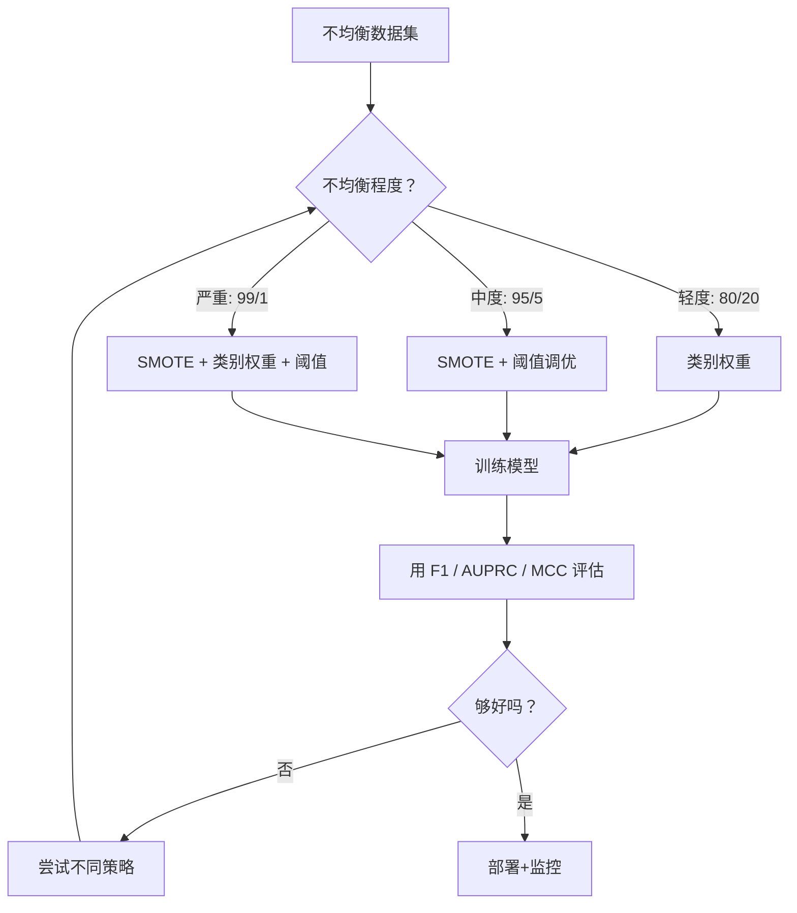
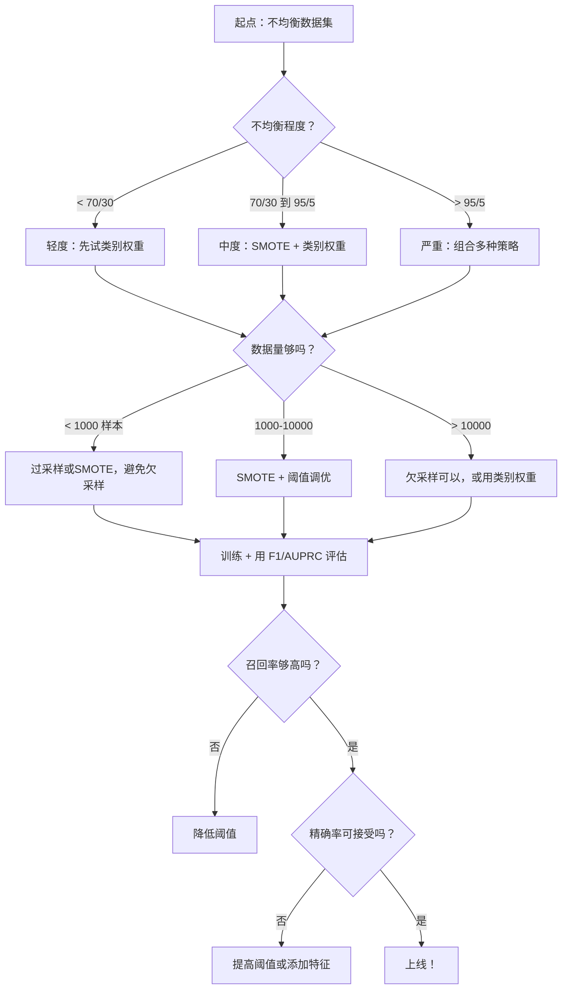

# 处理不均衡数据（Handling Imbalanced Data）

> 当你的数据中 99% 都是"正常"时，准确率是一个谎言。

**类型：** 动手实现
**语言：** Python
**前置知识：** 第二阶段第1-9课（尤其是评估指标）
**预计时间：** 约90分钟

## 学习目标

- 从零实现 SMOTE，并解释合成过采样与随机复制的区别
- 用 F1、AUPRC 和马修斯相关系数（而不是准确率）评估不均衡分类器
- 对比类别权重、阈值调优和重采样策略，为给定不均衡比例选择合适的方法
- 构建一条完整的不均衡数据流水线，组合使用 SMOTE、类别权重和阈值优化

## 问题背景

你构建了一个欺诈检测模型，准确率达到 99.9%，兴奋地准备庆祝——然后你发现，它对每一笔交易都预测"非欺诈"。

这不是 bug，而是当只有 0.1% 的交易是欺诈时，模型做出的"理性"选择：永远预测多数类能最小化整体误差。它在技术上是正确的，却完全没用。

这种情况在真正重要的分类任务中随处可见：疾病诊断（阳性率 1%）、网络入侵（攻击率 0.01%）、制造缺陷（缺陷率 0.5%）、垃圾邮件过滤（垃圾邮件占 20%）、流失预测（流失率 5%）。少数类越重要，往往就越稀少。

准确率失效是因为它对所有正确预测一视同仁。正确标记一笔正常交易和正确抓住一笔欺诈，各算一分准确率——但抓欺诈才是模型存在的全部意义。我们需要能迫使模型关注稀少但重要类别的指标、技术和训练策略。

## 核心概念

### 为什么准确率会撒谎

考虑一个有 1000 个样本的数据集：990 个负例，10 个正例。一个总是预测负例的模型：

|  | 预测正例 | 预测负例 |
|--|---------|---------|
| 实际正例 | 0（TP） | 10（FN） |
| 实际负例 | 0（FP） | 990（TN） |

准确率 = (0 + 990) / 1000 = 99.0%

这个模型没有抓住任何欺诈、任何疾病、任何缺陷——但准确率说 99%。这就是为什么准确率对不均衡问题是危险的。

### 更好的指标

**精确率（Precision）** = TP / (TP + FP)。在所有被标记为正例的样本中，有多少真的是正例？高精确率意味着少误报。

**召回率（Recall）** = TP / (TP + FN)。在所有真正的正例中，我们抓住了多少？高召回率意味着少漏报。

**F1 分数** = 2 × 精确率 × 召回率 / (精确率 + 召回率)。调和平均数，对精确率和召回率之间的极端不平衡的惩罚比算术平均更重。

**F-beta 分数** = (1 + β²) × 精确率 × 召回率 / (β² × 精确率 + 召回率)。β > 1 时召回率更重要；β < 1 时精确率更重要。欺诈检测中 F2 很常见（漏掉欺诈比误报代价更高）。

**AUPRC**（精确率-召回率曲线下面积）。类似 AUC-ROC，但对不均衡数据更有信息量。随机分类器的 AUPRC 等于正类比例（不像 ROC 那样是 0.5），这让改进更容易被看出来。

**马修斯相关系数（MCC）** = (TP×TN - FP×FN) / √[(TP+FP)(TP+FN)(TN+FP)(TN+FN)]。范围 [-1, +1]，只有当模型在两个类别上都表现良好时才给出高分。即使类别大小差异极大，它也保持平衡。

对上面那个"永远预测负例"的模型：精确率 = 0/0（未定义，通常设为 0），召回率 = 0/10 = 0，F1 = 0，MCC = 0。这些指标正确地揭示了这个模型毫无价值。

### 不均衡数据处理流程



### SMOTE：合成少数类过采样技术

随机过采样只是复制已有的少数类样本。这能用，但会导致过拟合——模型反复看到完全相同的点。

SMOTE 创建新的合成少数类样本：合情合理，但不是复制品。算法如下：

1. 对每个少数类样本 x，在其他少数类样本中找 k 个最近邻
2. 随机选一个邻居
3. 在 x 和这个邻居之间的线段上创建一个新样本

公式：`new_sample = x + random(0, 1) × (neighbor - x)`

这在真实的少数类点之间进行插值，在特征空间的相同区域创建样本，而不仅仅是复制已有数据。


### 采样策略对比

**随机过采样**：复制少数类样本直到与多数类数量相当。
- 优点：简单，没有信息损失
- 缺点：精确复制导致过拟合，增加训练时间

**随机欠采样**：删除多数类样本直到与少数类数量相当。
- 优点：训练快，简单
- 缺点：丢弃了潜在有用的多数类数据，方差更高

**SMOTE**：通过插值创建合成少数类样本。
- 优点：生成新数据点，比随机过采样减少过拟合风险
- 缺点：可能在决策边界附近创建噪声样本，不考虑多数类的分布

| 策略 | 改变什么 | 风险 | 适用场景 |
|------|---------|------|---------|
| 过采样 | 少数类被复制 | 过拟合 | 小数据集，轻度不均衡 |
| 欠采样 | 多数类被删除 | 信息损失 | 大数据集，想要快速训练 |
| SMOTE | 添加合成少数类 | 边界噪声 | 中度不均衡，少数类有足够样本做 k-NN |

### 类别权重

不改变数据，而是改变模型如何对待误差——对少数类的误分类赋予更高的权重。

对一个有 950 个负例和 50 个正例的二分类问题：
- 负类权重 = n_samples / (2 × n_negative) = 1000 / (2 × 950) ≈ 0.526
- 正类权重 = n_samples / (2 × n_positive) = 1000 / (2 × 50) = 10.0

正类得到 19 倍的权重。误分类一个正例的代价等同于误分类 19 个负例，模型被迫关注少数类。

在逻辑回归中，这修改了损失函数：

```
加权损失 = -Σ(w_i × [y_i × log(p_i) + (1-y_i) × log(1-p_i)])
```

其中 w_i 取决于样本 i 的类别。

从期望的角度来看，类别权重在数学上等价于过采样，但不创建新数据点——速度更快，也避免了复制样本带来的过拟合风险。

### 阈值调优

大多数分类器输出概率。默认阈值是 0.5：P(正例) >= 0.5 时预测正例。但 0.5 是任意的——当类别不均衡时，最优阈值通常远低于 0.5。

操作流程：
1. 训练模型
2. 在验证集上获取预测概率
3. 从 0.0 到 1.0 遍历阈值
4. 在每个阈值下计算 F1（或你选择的指标）
5. 选取让指标最大化的阈值


模型可能对一笔欺诈交易输出 P(欺诈) = 0.15。阈值为 0.5 时被分类为非欺诈；阈值为 0.10 时被正确抓住。概率校准的准确性不如排名重要——只要欺诈的概率总是高于非欺诈，就一定存在一个能把它们分开的阈值。

### 代价敏感学习（Cost-Sensitive Learning）

类别权重的泛化版本。不用统一的代价，而是指定具体的误分类代价：

| | 预测正例 | 预测负例 |
|--|---------|---------|
| 实际正例 | 0（正确） | C_FN = 100 |
| 实际负例 | C_FP = 1 | 0（正确） |

漏掉一笔欺诈交易（FN）的代价是误报（FP）的 100 倍。模型优化总代价而不是总误差数。

当你能估计真实世界的代价时，这是最有原则的方法。漏诊癌症和误诊导致的额外活检，代价完全不同。明确这些代价，才能做出正确的权衡。

### 决策流程图



## 动手实现

### 第一步：生成不均衡数据集

```python
import numpy as np


def make_imbalanced_data(n_majority=950, n_minority=50, seed=42):
    rng = np.random.RandomState(seed)

    X_maj = rng.randn(n_majority, 2) * 1.0 + np.array([0.0, 0.0])
    X_min = rng.randn(n_minority, 2) * 0.8 + np.array([2.5, 2.5])

    X = np.vstack([X_maj, X_min])
    y = np.concatenate([np.zeros(n_majority), np.ones(n_minority)])

    shuffle_idx = rng.permutation(len(y))
    return X[shuffle_idx], y[shuffle_idx]
```

### 第二步：从零实现 SMOTE

```python
def euclidean_distance(a, b):
    return np.sqrt(np.sum((a - b) ** 2))


def find_k_neighbors(X, idx, k):
    distances = []
    for i in range(len(X)):
        if i == idx:
            continue
        d = euclidean_distance(X[idx], X[i])
        distances.append((i, d))
    distances.sort(key=lambda x: x[1])
    return [d[0] for d in distances[:k]]


def smote(X_minority, k=5, n_synthetic=100, seed=42):
    rng = np.random.RandomState(seed)
    n_samples = len(X_minority)
    k = min(k, n_samples - 1)
    synthetic = []

    for _ in range(n_synthetic):
        idx = rng.randint(0, n_samples)
        neighbors = find_k_neighbors(X_minority, idx, k)
        neighbor_idx = neighbors[rng.randint(0, len(neighbors))]
        t = rng.random()
        new_point = X_minority[idx] + t * (X_minority[neighbor_idx] - X_minority[idx])
        synthetic.append(new_point)

    return np.array(synthetic)
```

### 第三步：随机过采样和欠采样

```python
def random_oversample(X, y, seed=42):
    rng = np.random.RandomState(seed)
    classes, counts = np.unique(y, return_counts=True)
    max_count = counts.max()

    X_resampled = list(X)
    y_resampled = list(y)

    for cls, count in zip(classes, counts):
        if count < max_count:
            cls_indices = np.where(y == cls)[0]
            n_needed = max_count - count
            chosen = rng.choice(cls_indices, size=n_needed, replace=True)
            X_resampled.extend(X[chosen])
            y_resampled.extend(y[chosen])

    X_out = np.array(X_resampled)
    y_out = np.array(y_resampled)
    shuffle = rng.permutation(len(y_out))
    return X_out[shuffle], y_out[shuffle]


def random_undersample(X, y, seed=42):
    rng = np.random.RandomState(seed)
    classes, counts = np.unique(y, return_counts=True)
    min_count = counts.min()

    X_resampled = []
    y_resampled = []

    for cls in classes:
        cls_indices = np.where(y == cls)[0]
        chosen = rng.choice(cls_indices, size=min_count, replace=False)
        X_resampled.extend(X[chosen])
        y_resampled.extend(y[chosen])

    X_out = np.array(X_resampled)
    y_out = np.array(y_resampled)
    shuffle = rng.permutation(len(y_out))
    return X_out[shuffle], y_out[shuffle]
```

### 第四步：带类别权重的逻辑回归

```python
def sigmoid(z):
    return 1.0 / (1.0 + np.exp(-np.clip(z, -500, 500)))


def logistic_regression_weighted(X, y, weights, lr=0.01, epochs=200):
    n_samples, n_features = X.shape
    w = np.zeros(n_features)
    b = 0.0

    for _ in range(epochs):
        z = X @ w + b
        pred = sigmoid(z)
        error = pred - y
        weighted_error = error * weights

        gradient_w = (X.T @ weighted_error) / n_samples
        gradient_b = np.mean(weighted_error)

        w -= lr * gradient_w
        b -= lr * gradient_b

    return w, b


def compute_class_weights(y):
    classes, counts = np.unique(y, return_counts=True)
    n_samples = len(y)
    n_classes = len(classes)
    weight_map = {}
    for cls, count in zip(classes, counts):
        weight_map[cls] = n_samples / (n_classes * count)
    return np.array([weight_map[yi] for yi in y])
```

### 第五步：阈值调优

```python
def find_optimal_threshold(y_true, y_probs, metric="f1"):
    best_threshold = 0.5
    best_score = -1.0

    for threshold in np.arange(0.05, 0.96, 0.01):
        y_pred = (y_probs >= threshold).astype(int)
        tp = np.sum((y_pred == 1) & (y_true == 1))
        fp = np.sum((y_pred == 1) & (y_true == 0))
        fn = np.sum((y_pred == 0) & (y_true == 1))

        if metric == "f1":
            precision = tp / (tp + fp) if (tp + fp) > 0 else 0.0
            recall = tp / (tp + fn) if (tp + fn) > 0 else 0.0
            score = 2 * precision * recall / (precision + recall) if (precision + recall) > 0 else 0.0
        elif metric == "recall":
            score = tp / (tp + fn) if (tp + fn) > 0 else 0.0
        elif metric == "precision":
            score = tp / (tp + fp) if (tp + fp) > 0 else 0.0

        if score > best_score:
            best_score = score
            best_threshold = threshold

    return best_threshold, best_score
```

### 第六步：评估函数

```python
def confusion_matrix_values(y_true, y_pred):
    tp = np.sum((y_pred == 1) & (y_true == 1))
    tn = np.sum((y_pred == 0) & (y_true == 0))
    fp = np.sum((y_pred == 1) & (y_true == 0))
    fn = np.sum((y_pred == 0) & (y_true == 1))
    return tp, tn, fp, fn


def compute_metrics(y_true, y_pred):
    tp, tn, fp, fn = confusion_matrix_values(y_true, y_pred)
    accuracy = (tp + tn) / (tp + tn + fp + fn)
    precision = tp / (tp + fp) if (tp + fp) > 0 else 0.0
    recall = tp / (tp + fn) if (tp + fn) > 0 else 0.0
    f1 = 2 * precision * recall / (precision + recall) if (precision + recall) > 0 else 0.0

    denom = np.sqrt(float((tp + fp) * (tp + fn) * (tn + fp) * (tn + fn)))
    mcc = (tp * tn - fp * fn) / denom if denom > 0 else 0.0

    return {
        "accuracy": accuracy,
        "precision": precision,
        "recall": recall,
        "f1": f1,
        "mcc": mcc,
    }
```

### 第七步：对比所有方法

```python
X, y = make_imbalanced_data(950, 50, seed=42)
split = int(0.8 * len(y))
X_train, X_test = X[:split], X[split:]
y_train, y_test = y[:split], y[split:]

# 基线：不做任何处理
w_base, b_base = logistic_regression_weighted(
    X_train, y_train, np.ones(len(y_train)), lr=0.1, epochs=300
)
probs_base = sigmoid(X_test @ w_base + b_base)
preds_base = (probs_base >= 0.5).astype(int)

# 过采样
X_over, y_over = random_oversample(X_train, y_train)
w_over, b_over = logistic_regression_weighted(
    X_over, y_over, np.ones(len(y_over)), lr=0.1, epochs=300
)
preds_over = (sigmoid(X_test @ w_over + b_over) >= 0.5).astype(int)

# SMOTE
minority_mask = y_train == 1
X_minority = X_train[minority_mask]
synthetic = smote(X_minority, k=5, n_synthetic=len(y_train) - 2 * int(minority_mask.sum()))
X_smote = np.vstack([X_train, synthetic])
y_smote = np.concatenate([y_train, np.ones(len(synthetic))])
w_sm, b_sm = logistic_regression_weighted(
    X_smote, y_smote, np.ones(len(y_smote)), lr=0.1, epochs=300
)
preds_smote = (sigmoid(X_test @ w_sm + b_sm) >= 0.5).astype(int)

# 类别权重
sample_weights = compute_class_weights(y_train)
w_cw, b_cw = logistic_regression_weighted(
    X_train, y_train, sample_weights, lr=0.1, epochs=300
)
probs_cw = sigmoid(X_test @ w_cw + b_cw)
preds_cw = (probs_cw >= 0.5).astype(int)

# 阈值调优（在验证集上调，不在测试集上调！）
probs_val = sigmoid(X_val @ w_cw + b_cw)
best_thresh, best_f1 = find_optimal_threshold(y_val, probs_val, metric="f1")
preds_thresh = (probs_cw >= best_thresh).astype(int)
```

## 实际使用

用 scikit-learn 和 imbalanced-learn，这些技术都是一行代码：

```python
from sklearn.linear_model import LogisticRegression
from sklearn.metrics import classification_report, f1_score
from sklearn.model_selection import train_test_split
from imblearn.over_sampling import SMOTE
from imblearn.under_sampling import RandomUnderSampler
from imblearn.pipeline import Pipeline

X_train, X_test, y_train, y_test = train_test_split(X, y, stratify=y)

# 类别权重
model_weighted = LogisticRegression(class_weight="balanced")
model_weighted.fit(X_train, y_train)
print(classification_report(y_test, model_weighted.predict(X_test)))

# SMOTE
smote = SMOTE(random_state=42)
X_resampled, y_resampled = smote.fit_resample(X_train, y_train)
model_smote = LogisticRegression()
model_smote.fit(X_resampled, y_resampled)
print(classification_report(y_test, model_smote.predict(X_test)))

# 组合流水线
pipeline = Pipeline([
    ("smote", SMOTE()),
    ("model", LogisticRegression(class_weight="balanced")),
])
pipeline.fit(X_train, y_train)
print(classification_report(y_test, pipeline.predict(X_test)))
```

从零实现的版本展示了每种技术的本质：SMOTE 就是在少数类上做 k-NN 插值；类别权重就是把损失函数乘以一个系数；阈值调优就是遍历一个截断值的循环。没有魔法。

## 成果

本课产出：
- `outputs/skill-imbalanced-data.md` —— 处理不均衡分类问题的决策清单

## 练习

1. **边界 SMOTE**：修改 SMOTE 实现，只对靠近决策边界的少数类点（其 k 个最近邻中包含多数类样本的点）生成合成样本。在类别有重叠的数据集上与标准 SMOTE 对比结果。

2. **代价矩阵优化**：实现代价敏感学习，把代价矩阵作为参数。创建一个函数，接受代价矩阵并返回最小化期望代价的最优预测。用不同代价比率（1:10、1:100、1:1000）测试，画出精确率-召回率权衡如何变化。

3. **阈值校准**：实现 Platt 缩放（在模型原始输出上拟合一个逻辑回归，以生成校准后的概率）。对比校准前后的精确率-召回率曲线。证明校准不改变排名（AUC 保持不变），但让概率更有意义。

4. **均衡 Bagging 集成**：训练多个模型，每个模型在一个均衡的自助采样上训练（所有少数类 + 随机子集多数类）。平均它们的预测。与单模型 SMOTE 对比，同时衡量性能和多次运行的方差。

5. **不均衡比例实验**：取一个均衡数据集，逐步增加不均衡比例（50/50、70/30、90/10、95/5、99/1）。在每个比例下，分别用有无 SMOTE 训练。画出两种方法的 F1 随不均衡比例的变化曲线。在什么比例下 SMOTE 开始产生明显效果？

## 关键术语

| 术语 | 常见说法 | 实际含义 |
|------|---------|---------|
| 类别不均衡（Class imbalance） | "一个类的样本多得多" | 数据集中类别分布显著偏斜，导致模型倾向于预测多数类 |
| SMOTE | "合成过采样" | 通过在已有少数类样本和其 k 个最近少数类邻居之间插值，创建新的少数类样本 |
| 类别权重（Class weights） | "让稀有类的错误代价更高" | 用类别特定的权重乘以损失函数，使模型对少数类误分类的惩罚更重 |
| 阈值调优（Threshold tuning） | "移动决策边界" | 把分类的概率截断值从默认的 0.5 调整到能优化目标指标的值 |
| 精确率-召回率权衡（Precision-recall tradeoff） | "鱼和熊掌不可兼得" | 降低阈值能抓住更多正例（召回率更高），但也标记更多误报（精确率更低），反之亦然 |
| AUPRC | "PR 曲线下面积" | 用单个数字汇总精确率-召回率曲线的性能；类别严重不均衡时比 AUC-ROC 更有信息量 |
| 马修斯相关系数（MCC） | "均衡指标" | 预测标签与真实标签之间的相关系数，只有当模型在两个类别上都表现良好时才给出高分 |
| 代价敏感学习（Cost-sensitive learning） | "不同错误代价不同" | 把真实世界的误分类代价纳入训练目标，使模型优化总代价而不是总误差数 |
| 随机过采样（Random oversampling） | "复制少数类" | 重复少数类样本以平衡类别数量；简单但会对复制的点产生过拟合 |

## 延伸阅读

- [SMOTE: Synthetic Minority Over-sampling Technique (Chawla et al., 2002)](https://arxiv.org/abs/1106.1813) —— SMOTE 原始论文，不均衡学习领域被引用最多的工作
- [Learning from Imbalanced Data (He & Garcia, 2009)](https://ieeexplore.ieee.org/document/5128907) —— 涵盖采样、代价敏感和算法方法的综合综述
- [imbalanced-learn 文档](https://imbalanced-learn.org/stable/) —— 包含 SMOTE 变体、欠采样策略和流水线集成的 Python 库
- [The Precision-Recall Plot Is More Informative than the ROC Plot (Saito & Rehmsmeier, 2015)](https://journals.plos.org/plosone/article?id=10.1371/journal.pone.0118432) —— 为什么在不均衡问题中 PR 曲线比 ROC 曲线更有信息量
