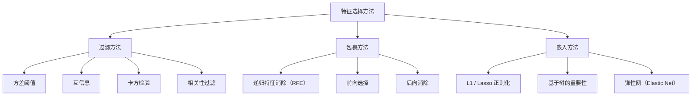
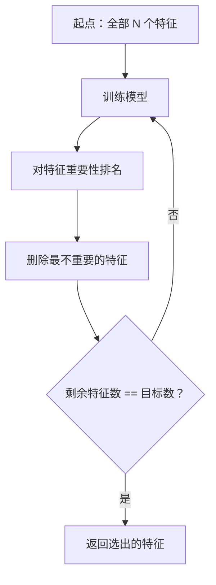
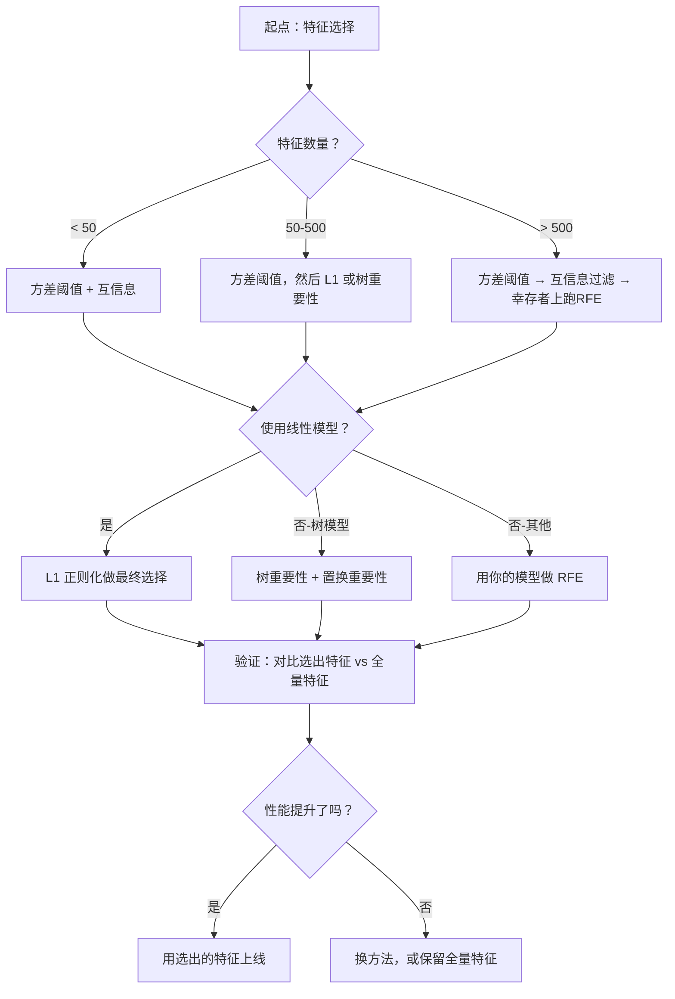

# 特征选择（Feature Selection）

> 特征更多不等于更好，选对特征才是关键。

**类型：** 动手实现
**语言：** Python
**前置知识：** 第二阶段第1-9课、第8课（特征工程）
**预计时间：** 约75分钟

## 学习目标

- 从零实现过滤方法（方差阈值、互信息、卡方检验）和包裹方法（RFE、前向选择）
- 解释为什么互信息能捕捉相关系数遗漏的非线性特征-目标关系
- 对比 L1 正则化（嵌入式选择）和 RFE（包裹式选择）在计算复杂度上的权衡
- 构建组合多种方法的特征选择流水线，并在留出数据上验证泛化能力的提升

## 问题背景

你有 500 个特征。模型训练缓慢，反复过拟合，没有人能解释它学到了什么。你继续加特征，希望能提升性能——结果更糟了。

这是维度诅咒在发作。特征数量增长时，特征空间的体积指数级膨胀，数据点变得稀疏，点与点之间的距离趋于收敛，模型需要指数级更多的数据才能找到真实模式，噪声特征淹没了有效特征，过拟合成了常态。

**特征选择是解药。** 剥掉噪声，消除冗余，只保留真正携带目标信息的特征。结果：训练更快、泛化更好、模型真正可解释。

目标不是使用所有可用信息，而是使用正确的信息。

## 核心概念

### 三类特征选择方法

每种特征选择方法都属于以下三类之一：



**过滤方法（Filter）**：用统计量独立评分每个特征，不使用模型。速度快，但忽略特征间的交互关系。

**包裹方法（Wrapper）**：训练模型来评估特征子集，以模型性能作为评分。效果更好，但代价昂贵——需要多次重新训练模型。

**嵌入方法（Embedded）**：在模型训练过程中进行特征选择。L1 正则化把权重压为零；决策树在最有用的特征上分裂。选择在拟合时发生，不是单独的步骤。

### 方差阈值

最简单的过滤方法。如果一个特征在样本间几乎不变，它携带的信息几乎为零。

设想一个在 1000 个样本中有 999 个都是 0.0 的特征，方差接近零，没有任何模型能用它来区分类别——删掉它。

```
variance(x) = mean((x - mean(x))^2)
```

设置一个阈值（如 0.01），删除所有方差低于阈值的特征。这在完全不看目标变量的情况下，就能以近乎零的成本清除明显无用的特征。

使用时机：作为其他方法之前的预处理步骤。

局限：特征可以有高方差但仍是纯噪声。方差阈值是必要条件，不是充分条件。

### 互信息（Mutual Information）

互信息衡量的是：知道特征 X 的值，能减少多少关于目标 Y 的不确定性。

```
I(X; Y) = Σ_x Σ_y p(x, y) × log(p(x, y) / (p(x) × p(y)))
```

如果 X 和 Y 独立，p(x, y) = p(x) × p(y)，对数项为零，I(X; Y) = 0。X 对 Y 的预测能力越强，互信息越高。

**相对于相关系数的关键优势**：互信息能捕捉非线性关系。一个特征与目标的相关系数可能为零，但互信息很高——因为它们之间的关系是二次的或周期性的。

对于连续特征，先离散化为若干区间（基于直方图的估计）。区间数影响估计结果——太少丢失信息，太多引入噪声。常用选择：√n 个区间，或 Sturges 法则（1 + log2(n)）。


### 递归特征消除（RFE）

包裹方法。利用模型自身的特征重要性来迭代剪枝：

1. 用所有特征训练模型
2. 按重要性对特征排名（线性模型用系数，树用不纯度减少量）
3. 删除最不重要的特征
4. 重复，直到剩余目标数量的特征



RFE 会考虑特征交互，因为模型同时看到所有剩余特征。删除一个特征会改变其他特征的重要性，这使它比过滤方法更彻底。

代价：需要训练模型 N - 目标数 次。500 个特征、目标 10 个特征，就是 490 次训练。对于昂贵的模型来说很慢。可以每轮删除多个特征（如每轮删除最后 10%）来加速。

### L1（Lasso）正则化

L1 正则化把权重的绝对值之和加入损失函数：

```
损失 = 预测误差 + alpha × Σ|w_i|
```

alpha 参数控制特征被剪除的力度。alpha 越大，越多权重趋于精确的零。

**为什么是精确的零？** L1 惩罚在权重空间中创造了一个菱形约束区域。最优解倾向于落在菱形的角点上，此处一个或多个权重为零。L2 正则化（岭回归）创造的是圆形约束，权重会缩小但很少精确归零。

这是嵌入式特征选择：模型在训练中自行学习忽略哪些特征。权重为零的特征被有效地移除了。

优点：只需单次训练；能处理相关特征（从中选一个并将其余归零）；内置于大多数线性模型实现中。

局限：仅适用于线性模型，无法捕捉非线性特征重要性。

### 基于树的特征重要性

决策树和集成方法（随机森林、梯度提升）天然对特征进行排名。每次分裂都减少了不纯度（分类用 Gini 或熵，回归用方差）。产生更大不纯度减少的特征更重要。

对于有 T 棵树的随机森林：

```
importance(特征_j) = (1/T) × Σ 所有树 Σ 在特征j上分裂的节点 (样本数 × 不纯度减少量)
```

这给出了每个特征的归一化重要性分数，能自动处理非线性关系和特征交互。

**注意**：基于树的重要性偏向于拥有很多不同取值的特征（高基数）。一个随机 ID 列看起来很重要，因为它能完美地分裂每个样本。用置换重要性做一致性检查。

### 置换重要性（Permutation Importance）

一种与模型无关的方法：

1. 训练模型，在验证数据上记录基线性能
2. 对每个特征：随机打乱它的值，测量性能下降幅度
3. 下降越大，特征越重要

如果打乱某个特征不影响性能，模型就不依赖它。如果性能崩溃，那个特征是关键的。

置换重要性避免了基于树的重要性的高基数偏差。但速度慢：每个特征需要一次完整评估，重复多次以保证稳定性。

### 方法对比

| 方法 | 类型 | 速度 | 捕捉非线性 | 考虑特征交互 |
|------|------|------|-----------|------------|
| 方差阈值 | 过滤 | 非常快 | 否 | 否 |
| 互信息 | 过滤 | 快 | 是 | 否 |
| 相关性过滤 | 过滤 | 快 | 否 | 否 |
| RFE | 包裹 | 慢 | 取决于模型 | 是 |
| L1 / Lasso | 嵌入 | 快 | 否（线性） | 否 |
| 树的重要性 | 嵌入 | 中 | 是 | 是 |
| 置换重要性 | 模型无关 | 慢 | 是 | 是 |

### 决策流程图



## 动手实现

### 第一步：生成已知特征结构的合成数据

```python
import numpy as np


def make_feature_selection_data(n_samples=500, seed=42):
    rng = np.random.RandomState(seed)

    x1 = rng.randn(n_samples)
    x2 = rng.randn(n_samples)
    x3 = rng.randn(n_samples)
    x4 = x1 + 0.1 * rng.randn(n_samples)  # x1 的近似副本
    x5 = x2 + 0.1 * rng.randn(n_samples)  # x2 的近似副本

    informative = np.column_stack([x1, x2, x3, x4, x5])

    correlated = np.column_stack([
        x1 * 0.9 + 0.1 * rng.randn(n_samples),
        x2 * 0.8 + 0.2 * rng.randn(n_samples),
        x3 * 0.7 + 0.3 * rng.randn(n_samples),
        x1 * 0.5 + x2 * 0.5 + 0.1 * rng.randn(n_samples),
        x2 * 0.6 + x3 * 0.4 + 0.1 * rng.randn(n_samples),
    ])

    noise = rng.randn(n_samples, 10) * 0.5

    X = np.hstack([informative, correlated, noise])
    y = (2 * x1 - 1.5 * x2 + x3 + 0.5 * rng.randn(n_samples) > 0).astype(int)

    feature_names = (
        [f"info_{i}" for i in range(5)]
        + [f"corr_{i}" for i in range(5)]
        + [f"noise_{i}" for i in range(10)]
    )

    return X, y, feature_names
```

我们知道真实情况：特征 0-4 是有效的（其中 3 和 4 是 0 和 1 的相关副本），5-9 与有效特征相关，10-19 是纯噪声。好的选择方法应该把 0-4 排最高，10-19 排最低。

### 第二步：方差阈值

```python
def variance_threshold(X, threshold=0.01):
    variances = np.var(X, axis=0)
    mask = variances > threshold
    return mask, variances
```

### 第三步：互信息（离散化版本）

```python
def discretize(x, n_bins=10):
    min_val, max_val = x.min(), x.max()
    if max_val == min_val:
        return np.zeros_like(x, dtype=int)
    bin_edges = np.linspace(min_val, max_val, n_bins + 1)
    binned = np.digitize(x, bin_edges[1:-1])
    return binned


def mutual_information(X, y, n_bins=10):
    n_samples, n_features = X.shape
    mi_scores = np.zeros(n_features)

    y_vals, y_counts = np.unique(y, return_counts=True)
    p_y = y_counts / n_samples

    for f in range(n_features):
        x_binned = discretize(X[:, f], n_bins)
        x_vals, x_counts = np.unique(x_binned, return_counts=True)
        p_x = dict(zip(x_vals, x_counts / n_samples))

        mi = 0.0
        for xv in x_vals:
            for yi, yv in enumerate(y_vals):
                joint_mask = (x_binned == xv) & (y == yv)
                p_xy = np.sum(joint_mask) / n_samples
                if p_xy > 0:
                    mi += p_xy * np.log(p_xy / (p_x[xv] * p_y[yi]))
        mi_scores[f] = mi

    return mi_scores
```

### 第四步：递归特征消除（RFE）

```python
def simple_logistic_importance(X, y, lr=0.1, epochs=100):
    n_samples, n_features = X.shape
    w = np.zeros(n_features)
    b = 0.0

    for _ in range(epochs):
        z = X @ w + b
        pred = 1.0 / (1.0 + np.exp(-np.clip(z, -500, 500)))
        error = pred - y
        w -= lr * (X.T @ error) / n_samples
        b -= lr * np.mean(error)

    return w, b


def rfe(X, y, n_features_to_select=5, lr=0.1, epochs=100):
    n_total = X.shape[1]
    remaining = list(range(n_total))
    rankings = np.ones(n_total, dtype=int)
    rank = n_total

    while len(remaining) > n_features_to_select:
        X_subset = X[:, remaining]
        w, _ = simple_logistic_importance(X_subset, y, lr, epochs)
        importances = np.abs(w)

        least_idx = np.argmin(importances)
        original_idx = remaining[least_idx]
        rankings[original_idx] = rank
        rank -= 1
        remaining.pop(least_idx)

    for idx in remaining:
        rankings[idx] = 1

    selected_mask = rankings == 1
    return selected_mask, rankings
```

### 第五步：L1 特征选择

```python
def soft_threshold(w, alpha):
    return np.sign(w) * np.maximum(np.abs(w) - alpha, 0)


def l1_feature_selection(X, y, alpha=0.1, lr=0.01, epochs=500):
    n_samples, n_features = X.shape
    w = np.zeros(n_features)
    b = 0.0

    for _ in range(epochs):
        z = X @ w + b
        pred = 1.0 / (1.0 + np.exp(-np.clip(z, -500, 500)))
        error = pred - y

        gradient_w = (X.T @ error) / n_samples
        gradient_b = np.mean(error)

        w -= lr * gradient_w
        w = soft_threshold(w, lr * alpha)   # 软阈值运算驱动权重趋零
        b -= lr * gradient_b

    selected_mask = np.abs(w) > 1e-6
    return selected_mask, w
```

### 第六步：基于树的重要性（简单决策树）

```python
def gini_impurity(y):
    if len(y) == 0:
        return 0.0
    classes, counts = np.unique(y, return_counts=True)
    probs = counts / len(y)
    return 1.0 - np.sum(probs ** 2)


def best_split(X, y, feature_idx):
    values = np.unique(X[:, feature_idx])
    if len(values) <= 1:
        return None, -1.0

    best_threshold = None
    best_gain = -1.0
    parent_gini = gini_impurity(y)
    n = len(y)

    for i in range(len(values) - 1):
        threshold = (values[i] + values[i + 1]) / 2.0
        left_mask = X[:, feature_idx] <= threshold
        right_mask = ~left_mask

        n_left = np.sum(left_mask)
        n_right = np.sum(right_mask)

        if n_left == 0 or n_right == 0:
            continue

        gain = parent_gini - (n_left / n) * gini_impurity(y[left_mask]) \
                           - (n_right / n) * gini_impurity(y[right_mask])

        if gain > best_gain:
            best_gain = gain
            best_threshold = threshold

    return best_threshold, best_gain


def tree_importance(X, y, n_trees=50, max_depth=5, seed=42):
    rng = np.random.RandomState(seed)
    n_samples, n_features = X.shape
    importances = np.zeros(n_features)

    for _ in range(n_trees):
        sample_idx = rng.choice(n_samples, size=n_samples, replace=True)
        feature_subset = rng.choice(n_features, size=max(1, int(np.sqrt(n_features))), replace=False)

        X_boot = X[sample_idx]
        y_boot = y[sample_idx]

        tree_imp = _build_tree_importance(X_boot, y_boot, feature_subset, max_depth)
        importances += tree_imp

    total = importances.sum()
    if total > 0:
        importances /= total

    return importances
```

### 第七步：运行所有方法并对比

代码文件在同一合成数据集上运行全部五种方法，并打印对比表，展示每种方法分别选出了哪些特征。

## 实际使用

在 sklearn 中，特征选择已内置到流水线框架：

```python
from sklearn.feature_selection import (
    VarianceThreshold,
    mutual_info_classif,
    RFE,
    SelectFromModel,
)
from sklearn.linear_model import Lasso, LogisticRegression
from sklearn.ensemble import RandomForestClassifier

# 方差阈值
vt = VarianceThreshold(threshold=0.01)
X_filtered = vt.fit_transform(X)

# 互信息
mi_scores = mutual_info_classif(X, y)
top_k = np.argsort(mi_scores)[-10:]

# RFE
rfe_selector = RFE(LogisticRegression(), n_features_to_select=10)
rfe_selector.fit(X, y)
X_rfe = rfe_selector.transform(X)

# L1（Lasso）
lasso_selector = SelectFromModel(Lasso(alpha=0.01))
lasso_selector.fit(X, y)
X_lasso = lasso_selector.transform(X)

# 随机森林重要性
rf = RandomForestClassifier(n_estimators=100)
rf.fit(X, y)
importances = rf.feature_importances_
```

从零实现展示了每种方法的本质：方差阈值就是计算 `var(X, axis=0)` 然后应用掩码；互信息就是在列联表里统计联合频率和边际频率；RFE 就是"训练-排名-剪枝"的循环；L1 就是梯度下降加软阈值运算；树的重要性就是跨分裂累加不纯度减少量。没有魔法，只有统计学和循环。

sklearn 版本加入了鲁棒性（如 `mutual_info_classif` 用 k-NN 密度估计代替分箱）、速度（C 实现）和流水线集成。

## 成果

本课产出：
- `outputs/skill-feature-selector.md` —— 选择正确特征选择方法的快速参考决策树

## 练习

1. **前向选择**：实现 RFE 的反向过程——从零特征开始，每一步加入能最大提升模型性能的特征，直到加特征不再有帮助。与 RFE 的结果对比，哪个更快？哪个效果更好？

2. **稳定性选择**：运行 L1 特征选择 50 次，每次在随机的 80% 数据子集上，用略微不同的 alpha 值。统计每个特征被选中的次数，被超过 80% 的运行选中的特征视为"稳定"。与单次 L1 选择的结果对比，哪个更可靠？

3. **多重共线性检测**：计算所有特征的相关矩阵。实现一个函数：给定相关性阈值（如 0.9），从每对高度相关的特征中删除一个（保留与目标互信息更高的那个）。在合成数据集上测试，验证它能删除冗余的相关特征。

4. **特征选择流水线**：把方差阈值、互信息过滤和 RFE 串联成一条流水线——先删除近零方差特征，再保留互信息前 50% 的特征，再对幸存者跑 RFE。与直接对全量特征跑 RFE 相比，流水线更快吗？准确率一样吗？

5. **从零实现置换重要性**：实现置换重要性——对每个特征，将其值随机打乱 10 次，测量 F1 分数的平均下降幅度。与基于树的重要性排名对比，找出它们不一致的情况，解释原因（提示：相关特征）。

## 关键术语

| 术语 | 常见说法 | 实际含义 |
|------|---------|---------|
| 过滤方法（Filter method） | "独立评分特征" | 用统计量对每个特征独立排名，不训练模型，孤立地评估每个特征 |
| 包裹方法（Wrapper method） | "用模型来选特征" | 通过训练模型并以模型性能作为选择标准，来评估特征子集的方法 |
| 嵌入方法（Embedded method） | "模型在训练中自己选特征" | 作为模型拟合过程一部分发生的特征选择，例如 L1 正则化将权重驱向零 |
| 互信息（Mutual information） | "一个变量能告诉你多少关于另一个的信息" | 度量给定 X 的情况下，Y 的不确定性减少程度，能捕捉线性和非线性依赖关系 |
| 递归特征消除（RFE） | "训练、排名、剪枝、重复" | 一种迭代包裹方法：训练模型，删除最不重要的特征，重复直到达到目标数量 |
| L1/Lasso 正则化 | "会杀死特征的惩罚项" | 把权重绝对值之和加入损失函数，驱动不重要特征的权重精确归零 |
| 方差阈值（Variance threshold） | "删除常数特征" | 删除在样本间方差低于指定阈值的特征，过滤掉不携带任何信息的特征 |
| 特征重要性（Feature importance） | "哪些特征最重要" | 表示每个特征对模型预测贡献程度的分数，由分裂增益（树）或系数大小（线性模型）计算得出 |
| 置换重要性（Permutation importance） | "打乱后看损失多大" | 通过随机打乱每个特征的值并测量模型性能的下降幅度来评估特征重要性 |
| 维度诅咒（Curse of dimensionality） | "特征太多，数据不够" | 随着特征增加，特征空间体积指数级膨胀，导致数据稀疏、距离失去意义的现象 |

## 延伸阅读

- [An Introduction to Variable and Feature Selection (Guyon & Elisseeff, 2003)](https://jmlr.org/papers/v3/guyon03a.html) —— 特征选择方法的奠基综述，至今被广泛引用
- [scikit-learn 特征选择指南](https://scikit-learn.org/stable/modules/feature_selection.html) —— 过滤、包裹和嵌入方法的实用参考，附代码示例
- [Stability Selection (Meinshausen & Buhlmann, 2010)](https://arxiv.org/abs/0809.2932) —— 将子采样与特征选择结合，得到鲁棒、可复现的结果
- [Beware Default Random Forest Importances (Strobl et al., 2007)](https://bmcbioinformatics.biomedcentral.com/articles/10.1186/1471-2105-8-25) —— 揭示基于树的重要性对高基数特征的偏差，提出条件重要性作为替代
