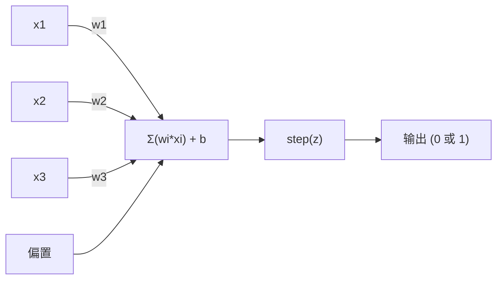
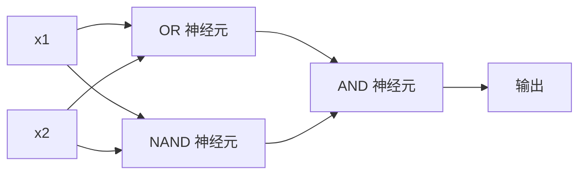

# 感知机（The Perceptron）

> 感知机是神经网络的原子。把它拆开，里面只有权重、偏置和一个决策。

**类型：** 动手实现
**语言：** Python
**前置知识：** 第一阶段（线性代数直觉）
**预计时间：** 约60分钟

## 学习目标

- 用 Python 从零实现感知机，包括权重更新规则和阶跃激活函数
- 解释为什么单个感知机只能解决线性可分问题，并演示 XOR 失败的情形
- 通过组合 OR、NAND 和 AND 门，构建一个多层感知机来解决 XOR 问题
- 用 sigmoid 激活函数和反向传播训练一个两层网络，让它自动学会 XOR

## 问题背景

你已经了解了向量和点积，也知道矩阵能把输入变换成输出。但机器是怎么**学会**用哪种变换的？

感知机回答了这个问题。它是最简单的学习机器：拿一些输入，乘以权重，加上偏置，做出二值决策——然后调整。就这些。有史以来构建的每一个神经网络，都是把这个想法一层一层叠起来的结果。

理解感知机，就是理解代码里的"学习"究竟意味着什么：不断调整数字，直到输出与现实相符。

## 核心概念

### 一个神经元，一个决策

感知机接收 n 个输入，将每个输入乘以对应的权重，求和，加上偏置，然后通过一个激活函数输出结果。



阶跃函数很粗暴：加权求和加偏置 >= 0 就输出 1，否则输出 0。

```
step(z) = 1  若 z >= 0
           0  若 z < 0
```

这是一个线性分类器。权重和偏置共同定义了一条直线（高维时是超平面），把输入空间切成两个区域。

### 决策边界

对于两个输入，感知机在二维空间中画一条线：

```
  x2
  ┤
  │  类别1           /
  │    (0)           /
  │                 /
  │                / w1·x1 + w2·x2 + b = 0
  │               /
  │              /       类别2
  │             /          (1)
  ┼────────────/─────────────── x1
```

线的一侧输出 0，另一侧输出 1。训练过程就是不断移动这条线，直到它能正确分开两类样本。

### 学习规则

感知机学习规则很简单：

```
对每个训练样本 (x, y_true)：
    y_pred = predict(x)
    error = y_true - y_pred

    对每个权重：
        w_i = w_i + learning_rate * error * x_i
    bias = bias + learning_rate * error
```

预测正确时，error = 0，什么都不变；预测为 0 但应该是 1 时，权重增大；预测为 1 但应该是 0 时，权重减小。学习率控制每次调整的幅度。

### XOR 问题

这里是感知机的极限。看看这几个逻辑门：

```
AND 门:             OR 门:              XOR 门:
x1  x2  输出        x1  x2  输出        x1  x2  输出
0   0   0           0   0   0           0   0   0
0   1   0           0   1   1           0   1   1
1   0   0           1   0   1           1   0   1
1   1   1           1   1   1           1   1   0
```

AND 和 OR 是线性可分的——你能画一条直线把 0 和 1 分开。XOR 不行。没有任何一条直线能把 [0,1] 和 [1,0]（输出1）从 [0,0] 和 [1,1]（输出0）中分离出来。

```
AND（可分离）:           XOR（不可分离）:

  x2                      x2
  1 ┤  0     1            1 ┤  1     0
    │     /                 │
  0 ┤  0 / 0              0 ┤  0     1
    ┼──/──────── x1         ┼──────────── x1
       一条线就够！             没有单条线能做到！
```

这是一个根本性的限制。单个感知机只能解决线性可分问题。Minsky 和 Papert 在 1969 年证明了这一点，这几乎让神经网络研究停滞了十年。

解决方案：把感知机叠成层。多层感知机可以通过组合两个线性决策来解决 XOR，产生非线性边界。

## 动手实现

### 第一步：感知机类

```python
class Perceptron:
    def __init__(self, n_inputs, learning_rate=0.1):
        self.weights = [0.0] * n_inputs
        self.bias = 0.0
        self.lr = learning_rate

    def predict(self, inputs):
        total = sum(w * x for w, x in zip(self.weights, inputs))
        total += self.bias
        return 1 if total >= 0 else 0

    def train(self, training_data, epochs=100):
        for epoch in range(epochs):
            errors = 0
            for inputs, target in training_data:
                prediction = self.predict(inputs)
                error = target - prediction
                if error != 0:
                    errors += 1
                    for i in range(len(self.weights)):
                        self.weights[i] += self.lr * error * inputs[i]
                    self.bias += self.lr * error
            if errors == 0:
                print(f"Converged at epoch {epoch + 1}")
                return
        print(f"Did not converge after {epochs} epochs")
```

### 第二步：在逻辑门上训练

```python
and_data = [
    ([0, 0], 0),
    ([0, 1], 0),
    ([1, 0], 0),
    ([1, 1], 1),
]

or_data = [
    ([0, 0], 0),
    ([0, 1], 1),
    ([1, 0], 1),
    ([1, 1], 1),
]

not_data = [
    ([0], 1),
    ([1], 0),
]

print("=== AND 门 ===")
p_and = Perceptron(2)
p_and.train(and_data)
for inputs, _ in and_data:
    print(f"  {inputs} -> {p_and.predict(inputs)}")

print("\n=== OR 门 ===")
p_or = Perceptron(2)
p_or.train(or_data)
for inputs, _ in or_data:
    print(f"  {inputs} -> {p_or.predict(inputs)}")

print("\n=== NOT 门 ===")
p_not = Perceptron(1)
p_not.train(not_data)
for inputs, _ in not_data:
    print(f"  {inputs} -> {p_not.predict(inputs)}")
```

### 第三步：见证 XOR 失败

```python
xor_data = [
    ([0, 0], 0),
    ([0, 1], 1),
    ([1, 0], 1),
    ([1, 1], 0),
]

print("\n=== XOR 门（单个感知机）===")
p_xor = Perceptron(2)
p_xor.train(xor_data, epochs=1000)
for inputs, expected in xor_data:
    result = p_xor.predict(inputs)
    status = "OK" if result == expected else "WRONG"
    print(f"  {inputs} -> {result} (期望 {expected}) {status}")
```

它永远不会收敛。这是单个感知机无法学习 XOR 的铁证。

### 第四步：用两层解决 XOR

技巧在于：XOR = (x1 OR x2) AND NOT (x1 AND x2)，用三个感知机组合完成：



```python
def xor_network(x1, x2):
    or_neuron = Perceptron(2)
    or_neuron.weights = [1.0, 1.0]
    or_neuron.bias = -0.5

    nand_neuron = Perceptron(2)
    nand_neuron.weights = [-1.0, -1.0]
    nand_neuron.bias = 1.5

    and_neuron = Perceptron(2)
    and_neuron.weights = [1.0, 1.0]
    and_neuron.bias = -1.5

    hidden1 = or_neuron.predict([x1, x2])
    hidden2 = nand_neuron.predict([x1, x2])
    output = and_neuron.predict([hidden1, hidden2])
    return output


print("\n=== XOR 门（多层网络）===")
for inputs, expected in xor_data:
    result = xor_network(inputs[0], inputs[1])
    print(f"  {inputs} -> {result} (期望 {expected})")
```

四种输入全部正确。把感知机叠成层，就能创造出单个感知机无法产生的决策边界。

### 第五步：训练两层网络

第四步是手动设置权重的。对于 XOR 这样简单的问题，这可以做到；但对于真实问题，你事先不知道正确的权重。解决方案：用 sigmoid 替换阶跃函数，通过反向传播自动学习权重。

```python
class TwoLayerNetwork:
    def __init__(self, learning_rate=0.5):
        import random
        random.seed(0)
        self.w_hidden = [[random.uniform(-1, 1), random.uniform(-1, 1)] for _ in range(2)]
        self.b_hidden = [random.uniform(-1, 1), random.uniform(-1, 1)]
        self.w_output = [random.uniform(-1, 1), random.uniform(-1, 1)]
        self.b_output = random.uniform(-1, 1)
        self.lr = learning_rate

    def sigmoid(self, x):
        import math
        x = max(-500, min(500, x))
        return 1.0 / (1.0 + math.exp(-x))

    def forward(self, inputs):
        self.inputs = inputs
        self.hidden_outputs = []
        for i in range(2):
            z = sum(w * x for w, x in zip(self.w_hidden[i], inputs)) + self.b_hidden[i]
            self.hidden_outputs.append(self.sigmoid(z))
        z_out = sum(w * h for w, h in zip(self.w_output, self.hidden_outputs)) + self.b_output
        self.output = self.sigmoid(z_out)
        return self.output

    def train(self, training_data, epochs=10000):
        for epoch in range(epochs):
            total_error = 0
            for inputs, target in training_data:
                output = self.forward(inputs)
                error = target - output
                total_error += error ** 2

                d_output = error * output * (1 - output)

                saved_w_output = self.w_output[:]
                hidden_deltas = []
                for i in range(2):
                    h = self.hidden_outputs[i]
                    hd = d_output * saved_w_output[i] * h * (1 - h)
                    hidden_deltas.append(hd)

                for i in range(2):
                    self.w_output[i] += self.lr * d_output * self.hidden_outputs[i]
                self.b_output += self.lr * d_output

                for i in range(2):
                    for j in range(len(inputs)):
                        self.w_hidden[i][j] += self.lr * hidden_deltas[i] * inputs[j]
                    self.b_hidden[i] += self.lr * hidden_deltas[i]
```

```python
net = TwoLayerNetwork(learning_rate=2.0)
net.train(xor_data, epochs=10000)
for inputs, expected in xor_data:
    result = net.forward(inputs)
    predicted = 1 if result >= 0.5 else 0
    print(f"  {inputs} -> {result:.4f} (取整: {predicted}, 期望 {expected})")
```

与第四步相比，有两个关键区别。第一，sigmoid 替代了阶跃函数——它是平滑的，所以梯度存在。第二，`train` 方法把误差从输出层反向传播到隐藏层，按每个权重对误差的贡献比例进行调整——这就是用 20 行代码写成的反向传播。

这是通往第03课的桥梁。`d_output` 和 `hidden_deltas` 背后的数学，是链式法则在网络计算图上的应用，我们会在那里推导清楚。

## 实际使用

你刚才从零构建的一切，在 sklearn 里只需一行导入：

```python
from sklearn.linear_model import Perceptron as SkPerceptron
import numpy as np

X = np.array([[0,0],[0,1],[1,0],[1,1]])
y = np.array([0, 0, 0, 1])

clf = SkPerceptron(max_iter=100, tol=1e-3)
clf.fit(X, y)
print([clf.predict([x])[0] for x in X])
```

五行代码，你自己写的 30 行 `Perceptron` 类做了同样的事。sklearn 版本加了收敛检查、多种损失函数和稀疏输入支持——但核心循环是一样的：加权求和，阶跃函数，有误差就更新权重。

真正的差距体现在规模上。生产网络里有什么变化：

- 阶跃函数变成了 sigmoid、ReLU 或其他平滑激活函数
- 权重通过反向传播自动学习（第03课）
- 层数更深：3、10、100+ 层
- 同样的原理成立：每一层从上一层的输出中创造新的特征

单个感知机只能画直线。叠起来，你就能画出任何形状。

## 成果

本课产出：
- `outputs/skill-perceptron.md` —— 关于何时需要单层 vs 多层架构的技能说明

## 练习

1. 训练一个感知机学习 NAND 门（通用门——任何逻辑电路都能用 NAND 搭建）。验证它的权重和偏置构成了一个有效的决策边界。
2. 修改感知机类，在每个 epoch 记录决策边界（w1×x1 + w2×x2 + b = 0）。打印在 AND 门训练过程中，这条线是如何移动的。
3. 构建一个 3 输入感知机，当至少 2 个输入为 1 时输出 1（多数投票函数）。这是线性可分的吗？为什么？

## 关键术语

| 术语 | 常见说法 | 实际含义 |
|------|---------|---------|
| 感知机（Perceptron） | "人造神经元" | 线性分类器：输入与权重的点积加偏置，通过阶跃函数 |
| 权重（Weight） | "输入有多重要" | 对每个输入的贡献进行缩放的乘数 |
| 偏置（Bias） | "阈值" | 移动决策边界的常数，让感知机在输入全为零时也能激活 |
| 激活函数（Activation function） | "压缩值的东西" | 加权求和后应用的函数——感知机用阶跃函数，现代网络用 sigmoid/ReLU |
| 线性可分（Linearly separable） | "能画一条线把它们分开" | 单个超平面能完美分离所有类别的数据集 |
| XOR 问题（XOR problem） | "感知机搞不定的东西" | 证明了单层网络无法学习非线性可分函数 |
| 决策边界（Decision boundary） | "分类器切换的地方" | 超平面 w·x + b = 0，把输入空间划分为两个类别 |
| 多层感知机（Multi-layer perceptron） | "真正的神经网络" | 感知机按层叠放，每层的输出作为下一层的输入 |

## 延伸阅读

- Frank Rosenblatt, "The Perceptron: A Probabilistic Model for Information Storage and Organization in the Brain" (1958) —— 开创了一切的原始论文
- Minsky & Papert, "Perceptrons" (1969) —— 证明了单层网络无法解决 XOR，让感知机研究沉寂了十年
- Michael Nielsen, "Neural Networks and Deep Learning", 第1章 (http://neuralnetworksanddeeplearning.com/) —— 免费在线，对感知机如何组合成网络的可视化解释最好
