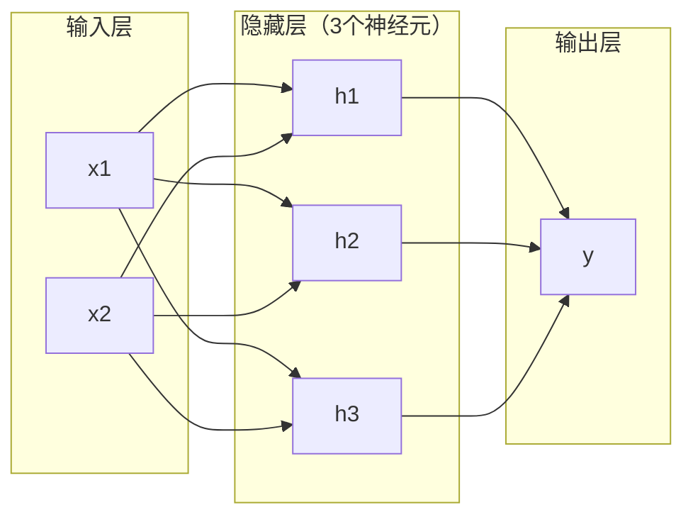
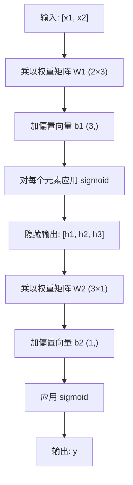

# 多层网络与前向传播（Multi-Layer Networks and Forward Pass）

> 一个神经元画直线，叠起来就能画任何形状。

**类型：** 动手实现
**语言：** Python
**前置知识：** 第一阶段（数学基础），第03.01课（感知机）
**预计时间：** 约90分钟

## 学习目标

- 用 Python 从零构建多层网络，实现 Layer 和 Network 类，执行完整的前向传播
- 追踪网络每一层的矩阵维度，识别形状不匹配的 bug
- 解释叠加非线性激活函数如何让网络能够学习曲线决策边界
- 用手动调参的 sigmoid 权重，通过 2-2-1 架构解决 XOR 问题

## 问题背景

单个神经元只能画直线——就这一件事。一条穿过数据的直线。而 AI 中所有真实问题——图像识别、语言理解、围棋——都需要曲线。把神经元叠成层，就是获得曲线的方式。

1969 年，Minsky 和 Papert 证明了这个限制是致命的：单层网络无法学习 XOR。不是"很难学"，是数学上根本不可能。XOR 真值表把 [0,1] 和 [1,0] 放在一边，[0,0] 和 [1,1] 放在另一边，没有任何单条直线能分开它们。

这让神经网络的经费断了十年。解决方案事后看来显而易见：别用一层，把神经元叠成层。让第一层把输入空间切割成新特征，让第二层把这些特征组合成任何单条直线都无法实现的决策。

这个叠放结构就是多层网络，也是当今生产中所有深度学习模型的基础。前向传播——数据从输入经过隐藏层流向输出——是一切能够运转的前提，是你首先需要构建的东西。

## 核心概念

### 三类层：输入、隐藏、输出

多层网络有三种类型的层：

**输入层**——严格来说不算层，只是存放原始数据。两个特征就两个输入节点，这里不发生任何计算。

**隐藏层**——真正干活的地方。每个神经元接收上一层的所有输出，施加权重和偏置，然后通过激活函数输出结果。之所以叫"隐藏"，是因为你在训练数据里直接看不到这些值。

**输出层**——最终答案。二分类用一个带 sigmoid 的神经元，多分类每类用一个神经元。



这是一个 2-3-1 网络：两个输入，三个隐藏神经元，一个输出。每条连接都携带一个权重，每个神经元（除输入层外）都有一个偏置。

每一层产生一个数值向量，称为隐藏状态。对于文本，隐藏状态会增加维度——把一个词编码成 768 个数字来捕捉语义；对于图像，则会降低维度——把数百万像素压缩成易于处理的表示。隐藏状态是学习存在的地方。

### 神经元与激活函数

每个神经元做三件事：

1. 把每个输入乘以对应的权重
2. 对所有乘积求和，加上偏置
3. 把求和结果通过激活函数

现在我们使用 sigmoid 激活函数：

```
sigmoid(z) = 1 / (1 + e^(-z))
```

sigmoid 把任意实数压缩到 (0, 1) 区间。大正数趋向 1，大负数趋向 0，零映射到 0.5。这条光滑的曲线让学习成为可能——与感知机的硬阶跃不同，sigmoid 处处都有梯度。

### 前向传播：数据如何流动

前向传播把输入数据推过网络，逐层前进，直到到达输出层。前向传播过程中没有学习发生，只有纯粹的计算：乘，加，激活，重复。



每一层依次执行三个操作：

```
z = W × 输入 + b     （线性变换）
a = sigmoid(z)        （激活）
```

一层的输出成为下一层的输入——这就是前向传播的全部。

### 矩阵维度

追踪维度是深度学习中最重要的调试技能。以 2-3-1 网络为例：

| 步骤 | 操作 | 维度 | 结果形状 |
|------|------|------|---------|
| 输入 | x | -- | (2,) |
| 隐藏线性变换 | W1 × x + b1 | W1: (3,2), b1: (3,) | (3,) |
| 隐藏激活 | sigmoid(z1) | -- | (3,) |
| 输出线性变换 | W2 × h + b2 | W2: (1,3), b2: (1,) | (1,) |
| 输出激活 | sigmoid(z2) | -- | (1,) |

规则：第 k 层的权重矩阵 W 的形状是 (当前层神经元数, 上一层神经元数)，行对应当前层，列对应上一层。形状对不上，就是有 bug。

### 万能近似定理（Universal Approximation Theorem）

1989 年，George Cybenko 证明了一件了不起的事：单隐藏层、足够多神经元的神经网络，能以任意精度近似任何连续函数。

这不是说单隐藏层总是最好的。这是说这种架构在理论上有这个能力。实践中，更深的网络（更多层，每层神经元更少）用远少于宽浅网络的参数总量就能学到相同的函数——这就是为什么深度学习有效。

直觉理解：隐藏层中的每个神经元学习一个"凸起"或特征。足够多的凸起放在正确的位置，就能近似任何光滑曲线。神经元越多，凸起越多，近似越好。


### 可组合性

神经网络是可组合的——你可以堆叠它们、串联它们、并行运行它们。Whisper 模型用一个编码器网络处理音频，一个解码器网络生成文本。现代大语言模型是纯解码器架构，BERT 是纯编码器，T5 是编码器-解码器。架构选择决定了模型能做什么。

## 动手实现

纯 Python，不用 numpy，所有矩阵运算从零手写。

### 第一步：sigmoid 激活函数

```python
import math

def sigmoid(x):
    x = max(-500.0, min(500.0, x))
    return 1.0 / (1.0 + math.exp(-x))
```

限制到 [-500, 500] 是为了防止溢出。`math.exp(500)` 是个大数但还有限，`math.exp(1000)` 就是无穷大了。

### 第二步：Layer 类

深度学习中最重要的操作是矩阵乘法。每一层、每个注意力头、每次前向传播——归根结底都是矩阵乘法。线性层接收一个输入向量，乘以权重矩阵，加上偏置向量：y = Wx + b。这个简单的方程占了神经网络计算量的 90%。

Layer 持有权重矩阵和偏置向量，前向方法接收输入向量并返回激活后的输出。

```python
class Layer:
    def __init__(self, n_inputs, n_neurons, weights=None, biases=None):
        if weights is not None:
            self.weights = weights
        else:
            import random
            self.weights = [
                [random.uniform(-1, 1) for _ in range(n_inputs)]
                for _ in range(n_neurons)
            ]
        if biases is not None:
            self.biases = biases
        else:
            self.biases = [0.0] * n_neurons

    def forward(self, inputs):
        self.last_input = inputs
        self.last_output = []
        for neuron_idx in range(len(self.weights)):
            z = sum(
                w * x for w, x in zip(self.weights[neuron_idx], inputs)
            )
            z += self.biases[neuron_idx]
            self.last_output.append(sigmoid(z))
        return self.last_output
```

权重矩阵形状是 (n_neurons, n_inputs)，每一行是一个神经元对所有输入的权重。前向方法遍历神经元，计算加权和加偏置，应用 sigmoid，收集结果。

### 第三步：Network 类

Network 是一个层的列表，前向传播把它们链起来：第 k 层的输出作为第 k+1 层的输入。

```python
class Network:
    def __init__(self, layers):
        self.layers = layers

    def forward(self, inputs):
        current = inputs
        for layer in self.layers:
            current = layer.forward(current)
        return current
```

这就是完整的前向传播，只有四行逻辑。数据进来，流过每一层，从另一端出来。

### 第四步：用手动权重解决 XOR

在第01课中，我们通过组合 OR、NAND 和 AND 感知机解决了 XOR。现在用 Layer 和 Network 类做同样的事，采用 2-2-1 架构：两个输入，两个隐藏神经元，一个输出。

```python
hidden = Layer(
    n_inputs=2,
    n_neurons=2,
    weights=[[20.0, 20.0], [-20.0, -20.0]],
    biases=[-10.0, 30.0],
)

output = Layer(
    n_inputs=2,
    n_neurons=1,
    weights=[[20.0, 20.0]],
    biases=[-30.0],
)

xor_net = Network([hidden, output])

xor_data = [
    ([0, 0], 0),
    ([0, 1], 1),
    ([1, 0], 1),
    ([1, 1], 0),
]

for inputs, expected in xor_data:
    result = xor_net.forward(inputs)
    predicted = 1 if result[0] >= 0.5 else 0
    print(f"  {inputs} -> {result[0]:.6f} (取整: {predicted}, 期望: {expected})")
```

大权重值（20、-20）让 sigmoid 表现得像阶跃函数。第一个隐藏神经元近似 OR，第二个近似 NAND，输出神经元把它们组合成 AND，最终实现 XOR。

### 第五步：圆形分类

更难的问题：把二维平面上的点分类为在半径 0.5、圆心在原点的圆内部还是外部。这需要曲线决策边界——单个感知机根本无法做到。

```python
import random
import math

random.seed(42)

data = []
for _ in range(200):
    x = random.uniform(-1, 1)
    y = random.uniform(-1, 1)
    label = 1 if (x * x + y * y) < 0.25 else 0
    data.append(([x, y], label))

circle_net = Network([
    Layer(n_inputs=2, n_neurons=8),
    Layer(n_inputs=8, n_neurons=1),
])
```

用随机权重，网络分类效果会很差。但前向传播依然可以运行——这才是重点：前向传播只是计算，学习正确权重是反向传播的事，见第03课。

```python
correct = 0
for inputs, expected in data:
    result = circle_net.forward(inputs)
    predicted = 1 if result[0] >= 0.5 else 0
    if predicted == expected:
        correct += 1

print(f"随机权重的准确率: {correct}/{len(data)} ({100*correct/len(data):.1f}%)")
```

随机权重准确率很差，往往比猜多数类还糟。训练后（第03课），同样这个带 8 个隐藏神经元的架构将能画出一条曲线边界，把圆内和圆外分开。

## 实际使用

PyTorch 用四行代码做了上面所有的事：

```python
import torch
import torch.nn as nn

model = nn.Sequential(
    nn.Linear(2, 8),
    nn.Sigmoid(),
    nn.Linear(8, 1),
    nn.Sigmoid(),
)

x = torch.tensor([[0.0, 0.0], [0.0, 1.0], [1.0, 0.0], [1.0, 1.0]])
output = model(x)
print(output)
```

`nn.Linear(2, 8)` 就是你的 Layer 类：形状 (8, 2) 的权重矩阵加形状 (8,) 的偏置向量。`nn.Sigmoid()` 就是逐元素应用你的 sigmoid 函数。`nn.Sequential` 就是你的 Network 类：按顺序链接各层。

区别在于速度和规模。PyTorch 在 GPU 上运行，处理数百万样本的批次，并自动计算反向传播所需的梯度。但前向传播的逻辑与你刚才从零构建的完全相同。

## 成果

本课产出可复用的网络架构设计提示词：
- `outputs/prompt-network-architect.md`

在你需要决定层数、每层神经元数和激活函数时使用。

## 练习

1. 构建一个 2-4-2-1 网络（两个隐藏层），用随机权重在 XOR 数据上执行前向传播。打印中间隐藏层的输出，观察表示在每一层是如何变换的。

2. 把圆形分类器的隐藏层大小从 8 改成 2，再改成 32。每次用随机权重执行前向传播。隐藏神经元数量会影响输出的范围或分布吗？为什么？

3. 在 Network 类上实现 `count_parameters` 方法，返回可训练权重和偏置的总数。在 784-256-128-10 网络（经典 MNIST 架构）上测试，有多少参数？

4. 构建一个 3-4-4-2 网络的前向传播。输入归一化到 0-1 的 RGB 颜色值，观察两个输出。这是一个简单颜色二分类器的架构。

5. 把 sigmoid 替换为"软阶跃"函数：z < 0 时返回 0.01×z，否则返回 1.0。用第四步中相同的手动权重在 XOR 上执行前向传播，还能正确吗？为什么光滑的 sigmoid 比硬截断更受欢迎？

## 关键术语

| 术语 | 常见说法 | 实际含义 |
|------|---------|---------|
| 前向传播（Forward pass） | "跑一遍模型" | 把输入推过每一层——乘权重、加偏置、激活——产生输出 |
| 隐藏层（Hidden layer） | "中间部分" | 输入和输出之间的任何层，其值在训练数据中不会直接观察到 |
| 多层网络（Multi-layer network） | "深度神经网络" | 按顺序叠放的神经元层，每层的输出作为下一层的输入 |
| 激活函数（Activation function） | "非线性部分" | 线性变换之后应用的函数，给决策边界引入曲线 |
| sigmoid | "S 形曲线" | σ(z) = 1/(1+e^(-z))，把任意实数压缩到 (0,1)，处处光滑可微 |
| 权重矩阵（Weight matrix） | "参数" | 形状为 (当前层神经元数, 上一层神经元数) 的矩阵，存储可学习的连接强度 |
| 偏置向量（Bias vector） | "偏移量" | 矩阵乘法之后加的向量，让神经元在所有输入为零时也能激活 |
| 万能近似（Universal approximation） | "神经网络能学习任何东西" | 单隐藏层加足够多神经元，能近似任何连续函数——但"足够多"可能意味着数十亿 |
| 线性变换（Linear transformation） | "矩阵乘法步骤" | z = W×x + b，激活之前的计算，把输入映射到新空间 |
| 决策边界（Decision boundary） | "分类器切换的地方" | 输入空间中网络输出越过分类阈值的那个面 |

## 延伸阅读

- Michael Nielsen, "Neural Networks and Deep Learning", 第1-2章 (http://neuralnetworksanddeeplearning.com/) —— 对前向传播和网络结构最清晰的免费解释，有交互式可视化
- Cybenko, "Approximation by Superpositions of a Sigmoidal Function" (1989) —— 万能近似定理的原始论文，出人意料地易读
- 3Blue1Brown, "But what is a neural network?" (https://www.youtube.com/watch?v=aircAruvnKk) —— 20分钟直观讲解层、权重和前向传播，帮你建立正确的心智模型
- Goodfellow, Bengio, Courville, "Deep Learning", 第6章 (https://www.deeplearningbook.org/) —— 多层网络的标准参考书，免费在线
