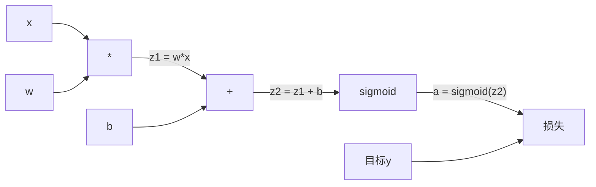
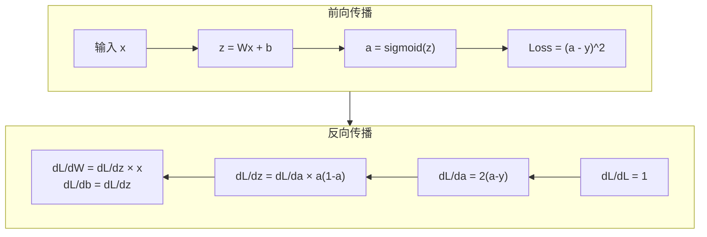

# 从零实现反向传播（Backpropagation from Scratch）

> 反向传播是让学习成为可能的算法。没有它，神经网络不过是昂贵的随机数生成器。

**类型：** 动手实现
**语言：** Python
**前置知识：** 第03.02课（多层网络）
**预计时间：** 约120分钟

## 学习目标

- 实现基于 Value 的自动微分引擎，构建计算图并通过拓扑排序计算梯度
- 推导加法、乘法和 sigmoid 的反向传播，理解链式法则的应用
- 只用你自己从零实现的反向传播引擎，在 XOR 和圆形分类任务上训练多层网络
- 找到深层 sigmoid 网络中的梯度消失问题，并解释梯度为什么会指数级缩小

## 问题背景

你的网络有一个隐藏层，输入 768 维，输出 3072 维——光这一层就有 2,359,296 个权重。它预测错了，是哪些权重导致的？挨个测试每个权重需要 230 万次前向传播。**反向传播只用一次反向传播就算出所有 230 万个梯度。** 这不是优化，这是能训练和不可能训练之间的差距。

朴素的做法：取一个权重，微调一点，再跑一次前向传播，看损失升了还是降了——这就是那个权重的梯度。现在对网络里每个权重做一遍。乘以成千上万次训练步，再乘以数百万数据点，你需要地质纪年才能训练出什么有用的东西。

反向传播解决了这个问题：一次前向传播，一次反向传播，所有梯度一次算完。诀窍是把微积分里的链式法则系统地应用到计算图上。这是让深度学习变得实用的算法，没有它，我们还在玩玩具问题。

## 核心概念

### 链式法则应用于网络

你在第一阶段第05课已经见过链式法则。快速回顾：若 y = f(g(x))，则 dy/dx = f'(g(x)) × g'(x)——沿着链条把导数乘起来。

在神经网络里，"链条"就是从输入到损失的一系列操作：每一层施加权重、加偏置、通过激活函数。损失函数比较最终输出和目标值。反向传播沿这条链条往回走，计算每个操作对误差的贡献。

### 计算图

每次前向传播都构建一张图。每个节点是一个操作（乘法、加法、sigmoid），每条边向前传递数值，向后传递梯度。



**前向传播**：数值从左流向右。x 和 w 产生 z1 = w×x，加 b 得 z2，sigmoid 给出激活值 a，与目标 y 用损失函数比较。

**反向传播**：梯度从右流向左。从 dL/da（损失对激活的导数）开始，乘以 da/dz2（sigmoid 的导数），得到 dL/dz2，拆分成 dL/db 和 dL/dz1，再推出 dL/dw = dL/dz1 × x 和 dL/dx = dL/dz1 × w。

图中每个节点在反向传播中只有一个任务：接收来自上方的梯度，乘以自己的局部导数，向下传递。

### 前向传播 vs 反向传播



前向传播存储每个中间值：z、a、每层的输入。反向传播需要这些存储的值来计算梯度。这是反向传播核心的内存-计算权衡：用内存（存储激活值）换速度（一次传播而不是数百万次）。

### 梯度在网络中的流动

对于 3 层网络，梯度通过每一层链式传递：


在每一层，梯度都要乘以 sigmoid 的导数。sigmoid 的导数是 a × (1 - a)，最大值是 0.25（当 a = 0.5 时）。三层深处，梯度已经被乘了最多 0.25³ = 0.0156。十层深处：0.25¹⁰ = 0.000001。

### 梯度消失

这就是梯度消失问题。sigmoid 把输出压缩到 0 到 1 之间，导数永远小于 0.25。叠够多的 sigmoid 层，梯度会缩小到几乎为零，早期的层几乎无法学习，因为它们收到的梯度接近零。

```
sigmoid(z)：    输出范围 [0, 1]
sigmoid'(z)：   最大值 0.25（z = 0 时）

经过 5 层：   梯度 × 0.25^5 = 原来的 0.001x
经过 10 层：  梯度 × 0.25^10 = 原来的 0.000001x
```

这就是为什么深层 sigmoid 网络几乎无法训练。解决方案——ReLU 及其变体——是第04课的主题。现在先理解：反向传播本身是完全正确的，问题出在它传播的那个激活函数上。

### 推导 2 层网络的梯度

具体的数学推导：输入 x，带 sigmoid 的隐藏层，带 sigmoid 的输出层，MSE 损失。

前向传播：
```
z1 = W1 × x + b1
a1 = sigmoid(z1)
z2 = W2 × a1 + b2
a2 = sigmoid(z2)
L = (a2 - y)²
```

反向传播（逐步应用链式法则）：
```
dL/da2 = 2(a2 - y)
da2/dz2 = a2 × (1 - a2)
dL/dz2 = dL/da2 × da2/dz2 = 2(a2 - y) × a2 × (1 - a2)

dL/dW2 = dL/dz2 × a1
dL/db2 = dL/dz2

dL/da1 = dL/dz2 × W2
da1/dz1 = a1 × (1 - a1)
dL/dz1 = dL/da1 × da1/dz1

dL/dW1 = dL/dz1 × x
dL/db1 = dL/dz1
```

每个梯度都是从损失向后追溯的局部导数之积——反向传播不过如此。

## 动手实现

### 第一步：Value 节点

计算中的每个数都变成一个 Value，它存储自己的数值、梯度，以及自己是怎么被创造出来的（这样它才知道如何在反向传播中计算梯度）。

```python
class Value:
    def __init__(self, data, children=(), op=''):
        self.data = data
        self.grad = 0.0
        self._backward = lambda: None
        self._children = set(children)
        self._op = op

    def __repr__(self):
        return f"Value(data={self.data:.4f}, grad={self.grad:.4f})"
```

初始梯度为 0.0，初始反向函数为空操作。`_children` 追踪哪些 Value 产生了当前这个，这样我们后面可以对图进行拓扑排序。

### 第二步：带反向函数的运算

每个操作创建一个新的 Value，并定义梯度如何向后流过它。

```python
def __add__(self, other):
    other = other if isinstance(other, Value) else Value(other)
    out = Value(self.data + other.data, (self, other), '+')

    def _backward():
        self.grad += out.grad
        other.grad += out.grad

    out._backward = _backward
    return out

def __mul__(self, other):
    other = other if isinstance(other, Value) else Value(other)
    out = Value(self.data * other.data, (self, other), '*')

    def _backward():
        self.grad += other.data * out.grad
        other.grad += self.data * out.grad

    out._backward = _backward
    return out
```

对于加法：d(a+b)/da = 1，d(a+b)/db = 1，所以两个输入都直接获得输出的梯度。

对于乘法：d(a×b)/da = b，d(a×b)/db = a，每个输入获得另一个的数值乘以输出梯度。

`+=` 至关重要。一个 Value 可能在多个操作中被使用，其梯度是所有路径上梯度的总和。

### 第三步：sigmoid 和损失函数

```python
import math

def sigmoid(self):
    x = self.data
    x = max(-500, min(500, x))
    s = 1.0 / (1.0 + math.exp(-x))
    out = Value(s, (self,), 'sigmoid')

    def _backward():
        self.grad += (s * (1 - s)) * out.grad

    out._backward = _backward
    return out
```

sigmoid 的导数：sigmoid(x) × (1 - sigmoid(x))。我们在前向传播时计算了 sigmoid(x) = s，直接复用，不需要额外计算。

```python
def mse_loss(predicted, target):
    diff = predicted + Value(-target)
    return diff * diff
```

单个输出的 MSE：(predicted - target)²，把减法表示为加一个取负的 Value。

### 第四步：反向传播

拓扑排序确保我们按正确顺序处理节点——一个节点的梯度在传播之前已经完全累积。

```python
def backward(self):
    topo = []
    visited = set()

    def build_topo(v):
        if v not in visited:
            visited.add(v)
            for child in v._children:
                build_topo(child)
            topo.append(v)

    build_topo(self)
    self.grad = 1.0         # dL/dL = 1
    for v in reversed(topo):
        v._backward()
```

从损失节点开始（梯度 = 1.0，因为 dL/dL = 1），向后遍历排序好的图，每个节点的 `_backward` 把梯度推送给它的子节点。

### 第五步：Layer 和 Network

```python
import random

class Neuron:
    def __init__(self, n_inputs):
        scale = (2.0 / n_inputs) ** 0.5
        self.weights = [Value(random.uniform(-scale, scale)) for _ in range(n_inputs)]
        self.bias = Value(0.0)

    def __call__(self, x):
        act = sum((wi * xi for wi, xi in zip(self.weights, x)), self.bias)
        return act.sigmoid()

    def parameters(self):
        return self.weights + [self.bias]


class Layer:
    def __init__(self, n_inputs, n_outputs):
        self.neurons = [Neuron(n_inputs) for _ in range(n_outputs)]

    def __call__(self, x):
        out = [n(x) for n in self.neurons]
        return out[0] if len(out) == 1 else out

    def parameters(self):
        params = []
        for n in self.neurons:
            params.extend(n.parameters())
        return params


class Network:
    def __init__(self, sizes):
        self.layers = []
        for i in range(len(sizes) - 1):
            self.layers.append(Layer(sizes[i], sizes[i + 1]))

    def __call__(self, x):
        for layer in self.layers:
            x = layer(x)
            if not isinstance(x, list):
                x = [x]
        return x[0] if len(x) == 1 else x

    def parameters(self):
        params = []
        for layer in self.layers:
            params.extend(layer.parameters())
        return params

    def zero_grad(self):
        for p in self.parameters():
            p.grad = 0.0
```

Neuron 接收输入，计算加权和加偏置，应用 sigmoid。权重初始化按 sqrt(2/n_inputs) 缩放，防止深层网络中 sigmoid 饱和。Layer 是一组 Neuron，Network 是一组 Layer。`parameters()` 收集所有可学习的 Value，这样我们才能更新它们。

### 第六步：训练 XOR

```python
random.seed(42)
net = Network([2, 4, 1])

xor_data = [
    ([0.0, 0.0], 0.0),
    ([0.0, 1.0], 1.0),
    ([1.0, 0.0], 1.0),
    ([1.0, 1.0], 0.0),
]

learning_rate = 1.0

for epoch in range(1000):
    total_loss = Value(0.0)
    for inputs, target in xor_data:
        x = [Value(i) for i in inputs]
        pred = net(x)
        loss = mse_loss(pred, target)
        total_loss = total_loss + loss

    net.zero_grad()
    total_loss.backward()

    for p in net.parameters():
        p.data -= learning_rate * p.grad

    if epoch % 100 == 0:
        print(f"Epoch {epoch:4d} | Loss: {total_loss.data:.6f}")

print("\nXOR 结果：")
for inputs, target in xor_data:
    x = [Value(i) for i in inputs]
    pred = net(x)
    print(f"  {inputs} -> {pred.data:.4f} (期望 {target})")
```

观察损失下降。从随机预测到正确输出，完全由反向传播计算梯度、朝正确方向微调权重驱动。

### 第七步：圆形分类

在第02课，你手动调整权重来做圆形分类。现在让网络自己学习这些权重。

```python
random.seed(7)

def generate_circle_data(n=100):
    data = []
    for _ in range(n):
        x1 = random.uniform(-1.5, 1.5)
        x2 = random.uniform(-1.5, 1.5)
        label = 1.0 if x1 * x1 + x2 * x2 < 1.0 else 0.0
        data.append(([x1, x2], label))
    return data

circle_data = generate_circle_data(80)

circle_net = Network([2, 8, 1])
learning_rate = 0.5

for epoch in range(2000):
    random.shuffle(circle_data)
    total_loss_val = 0.0
    for inputs, target in circle_data:
        x = [Value(i) for i in inputs]
        pred = circle_net(x)
        loss = mse_loss(pred, target)
        circle_net.zero_grad()
        loss.backward()
        for p in circle_net.parameters():
            p.data -= learning_rate * p.grad
        total_loss_val += loss.data

    if epoch % 200 == 0:
        correct = 0
        for inputs, target in circle_data:
            x = [Value(i) for i in inputs]
            pred = circle_net(x)
            predicted_class = 1.0 if pred.data > 0.5 else 0.0
            if predicted_class == target:
                correct += 1
        accuracy = correct / len(circle_data) * 100
        print(f"Epoch {epoch:4d} | Loss: {total_loss_val:.4f} | Accuracy: {accuracy:.1f}%")
```

这里使用在线 SGD——每个样本后都更新权重，而不是累积完整批次再更新。这能更快打破对称性，避免在全量损失上 sigmoid 饱和。每个 epoch 打乱数据，防止网络记住顺序。

不需要任何手动调参。网络自己发现圆形决策边界。这就是反向传播的力量：你只需定义架构、损失函数和数据，算法自己搞清楚权重。

## 实际使用

PyTorch 用几行代码做了上面所有的事。核心思想完全相同——autograd 在前向传播时构建计算图，再向后追踪计算梯度。

```python
import torch
import torch.nn as nn

model = nn.Sequential(
    nn.Linear(2, 4),
    nn.Sigmoid(),
    nn.Linear(4, 1),
    nn.Sigmoid(),
)
optimizer = torch.optim.SGD(model.parameters(), lr=1.0)
criterion = nn.MSELoss()

X = torch.tensor([[0,0],[0,1],[1,0],[1,1]], dtype=torch.float32)
y = torch.tensor([[0],[1],[1],[0]], dtype=torch.float32)

for epoch in range(1000):
    pred = model(X)
    loss = criterion(pred, y)
    optimizer.zero_grad()
    loss.backward()
    optimizer.step()

print("PyTorch XOR 结果：")
with torch.no_grad():
    for i in range(4):
        pred = model(X[i])
        print(f"  {X[i].tolist()} -> {pred.item():.4f} (期望 {y[i].item()})")
```

`loss.backward()` 就是你的 `total_loss.backward()`；`optimizer.step()` 就是你手动写的 `p.data -= lr * p.grad`；`optimizer.zero_grad()` 就是你的 `net.zero_grad()`。同样的算法，工业级实现。PyTorch 处理 GPU 加速、混合精度、梯度检查点以及数百种层类型，但反向传播逻辑就是同样的链式法则应用在同样的计算图上。

训练时：先前向传播，再反向传播，然后更新权重。推理时：只运行前向传播，不计算梯度，不更新权重。这个区别很重要——生产环境里发生的是推理。当你调用 Claude 或 GPT 的 API 时，你的提示词在网络里向前流动，另一端冒出 token，没有任何权重被改变。理解反向传播的意义在于：它塑造了那个网络里的每一个权重。

## 成果

本课产出：
- `outputs/prompt-gradient-debugger.md` —— 用于诊断任何神经网络中梯度问题（消失、爆炸、NaN）的可复用提示词

## 练习

1. 给 Value 类添加 `__sub__` 方法（a - b = a + (-1 × b)），然后实现 `__neg__` 方法。通过与手算结果对比，验证梯度是否正确，例如表达式 (a - b)²。

2. 给 Value 添加 `relu` 方法（输出 max(0, x)，x > 0 时导数为 1，否则为 0）。用 relu 替换隐藏层中的 sigmoid，再训练 XOR。对比收敛速度，你应该看到更快的训练——这是第04课的预告。

3. 实现 Value 的整数幂运算 `__pow__` 方法，用它把 `mse_loss` 改写成 `(predicted - target) ** 2` 的形式，验证梯度与原实现一致。

4. 在训练循环中加入梯度裁剪：调用 `backward()` 后，把所有梯度裁剪到 [-1, 1]。用更深的网络（4层以上 sigmoid）训练，对比有无裁剪的损失曲线，这是应对梯度爆炸的第一道防线。

5. 构建可视化：训练 XOR 后，打印网络中每个参数的梯度，找出哪一层的梯度最小——这直观演示了概念部分讲到的梯度消失问题。

## 关键术语

| 术语 | 常见说法 | 实际含义 |
|------|---------|---------|
| 反向传播（Backpropagation） | "网络在学习" | 通过计算图向后应用链式法则，计算每个权重的 dL/dw 的算法 |
| 计算图（Computational graph） | "网络结构" | 节点是操作、边向前传数值、向后传梯度的有向无环图 |
| 链式法则（Chain rule） | "把导数乘起来" | 若 y = f(g(x))，则 dy/dx = f'(g(x)) × g'(x)——反向传播的数学基础 |
| 梯度（Gradient） | "最陡上升的方向" | 损失对某参数的偏导数——告诉你如何调整该参数来减少损失 |
| 梯度消失（Vanishing gradient） | "深层网络不会学习" | 梯度在通过饱和激活函数（如 sigmoid）的层时指数级缩小 |
| 前向传播（Forward pass） | "跑一遍网络" | 从输入出发，依次应用每一层的操作并存储中间值，计算输出 |
| 反向传播（Backward pass） | "计算梯度" | 反向遍历计算图，在每个节点用链式法则累积梯度 |
| 学习率（Learning rate） | "学得多快" | 更新权重时的步长缩放因子：w_new = w_old - lr × 梯度 |
| 拓扑排序（Topological sort） | "正确的顺序" | 图节点的排序，使每个节点都在其所有依赖节点之后出现——确保梯度在传播前完全累积 |
| 自动微分（Autograd） | "自动求导" | 在前向计算时构建计算图、自动计算梯度的系统——PyTorch 引擎所做的事 |

## 延伸阅读

- Rumelhart, Hinton & Williams, "Learning representations by back-propagating errors" (1986) —— 让反向传播流行起来、解锁多层网络训练的论文
- 3Blue1Brown, "Neural Networks" 系列 (https://www.youtube.com/playlist?list=PLZHQObOWTQDNU6R1_67000Dx_ZCJB-3pi) —— 对反向传播和网络中梯度流动最好的可视化解释
