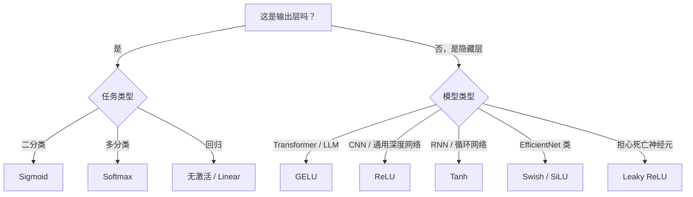

# 激活函数

## 为什么需要非线性？

在上一章，我们证明了反向传播能让神经网络学习。但有个前提被我们悄悄跳过了：激活函数必须是非线性的。

如果用线性激活（直接输出 `z = Wx + b`），无论叠多少层，整个网络都会塌缩成一层：

```
第一层：z1 = W1 * x + b1
第二层：z2 = W2 * z1 + b2
       = W2 * (W1 * x + b1) + b2
       = (W2 * W1) * x + (W2 * b1 + b2)
       = W_new * x + b_new
```

两层线性层 = 一层线性层。三层、十层也一样。所有的参数在数学上等价于一个矩阵乘法。

这意味着没有非线性激活的"深度网络"根本学不了复杂函数——它永远只能拟合线性关系。非线性激活函数是让网络真正"深"起来的关键。

---

## Sigmoid

最早被广泛使用的激活函数。

**公式：** σ(x) = 1 / (1 + e^(-x))

**输出范围：** (0, 1)

**导数：** σ'(x) = σ(x) · (1 - σ(x))

最大值 0.25（当 x = 0 时）。

```python
import numpy as np

def sigmoid(x):
    return 1 / (1 + np.exp(-x))

def sigmoid_derivative(x):
    s = sigmoid(x)
    return s * (1 - s)
```

**优点：**
- 输出可以解释为概率（0 到 1）
- 数学性质良好，处处可微

**缺点：**
- **梯度消失（Vanishing Gradient）**：导数最大只有 0.25。10 层之后，梯度变成 0.25^10 ≈ 0.000001，几乎全部消失
- **输出始终为正**：导致梯度更新方向受限，训练出现"锯齿形"震荡
- **指数运算较慢**

现代网络中，Sigmoid 几乎只出现在最后一层做二分类输出，隐藏层已基本弃用。

---

## Tanh

Tanh 是 Sigmoid 的"改良版"，把输出中心化到零。

**公式：** tanh(x) = (e^x - e^(-x)) / (e^x + e^(-x))

**输出范围：** (-1, 1)

**导数：** tanh'(x) = 1 - tanh²(x)

最大值 1.0（当 x = 0 时）。

```python
def tanh_act(x):
    return np.tanh(x)

def tanh_derivative(x):
    return 1 - np.tanh(x) ** 2
```

**优点：**
- 零中心化（Zero-centered）：输出有正有负，梯度方向不受约束
- 导数比 Sigmoid 大（最大 1.0），梯度消失稍轻

**缺点：**
- 依然存在梯度消失（饱和区导数趋近 0）
- 同样有指数运算开销

Tanh 曾是 RNN 的标准激活，现在仍在某些循环网络中使用。

---

## ReLU

ReLU（Rectified Linear Unit）是深度学习历史上最重要的激活函数之一。简单到令人惊讶，效果出奇的好。

**公式：** ReLU(x) = max(0, x)

**输出范围：** [0, +∞)

**导数：**
```
ReLU'(x) = 1  (x > 0)
ReLU'(x) = 0  (x ≤ 0)
```

```python
def relu(x):
    return np.maximum(0, x)

def relu_derivative(x):
    return (x > 0).astype(float)
```

**优点：**
- **无梯度消失**：正区间导数恒为 1，梯度能直接传到任意深度
- **计算极快**：只是一个 max 操作，比指数运算快 6 倍
- **稀疏激活**：约一半神经元输出为零，减少计算量，带有隐式正则化效果

**缺点：**
- **Dead Neuron（死亡神经元）**：如果一个神经元的输入永远 ≤ 0，它的梯度恒为 0，参数永远不更新。实际训练中，10%–40% 的 ReLU 神经元可能死亡
- **输出非零中心化**

死亡神经元的成因：大的负偏置、过大的学习率、或者不恰当的权重初始化都可能导致神经元"卡死"。

---

## Leaky ReLU

针对死亡神经元问题的直接修复：给负区间一个小斜率。

**公式：**
```
LeakyReLU(x) = x         (x > 0)
LeakyReLU(x) = alpha * x (x ≤ 0)
```
alpha 通常取 0.01。

```python
def leaky_relu(x, alpha=0.01):
    return np.where(x > 0, x, alpha * x)

def leaky_relu_derivative(x, alpha=0.01):
    return np.where(x > 0, 1.0, alpha)
```

即使输入为负，也有 0.01 的梯度流回去，神经元不会完全死亡。

实用中，Leaky ReLU 是 ReLU 的一个安全替代，尤其是当你发现训练中损失不下降时，可以怀疑死亡神经元并换成 Leaky ReLU 试试。

---

## GELU

GELU（Gaussian Error Linear Unit）是现代 Transformer 模型的默认激活函数，被 BERT、GPT 系列、以及几乎所有大语言模型采用。

**公式：** GELU(x) = x · Φ(x)

其中 Φ(x) 是标准正态分布的累积分布函数（CDF）。

**近似实现（实践中常用）：**

GELU(x) ≈ 0.5 · x · (1 + tanh(√(2/π) · (x + 0.044715 · x³)))

```python
def gelu(x):
    return 0.5 * x * (1 + np.tanh(np.sqrt(2 / np.pi) * (x + 0.044715 * x**3)))

def gelu_derivative(x):
    # 数值微分（生产中用自动微分）
    eps = 1e-5
    return (gelu(x + eps) - gelu(x - eps)) / (2 * eps)
```

**特点：**
- **平滑**：不像 ReLU 在 0 处有尖角，GELU 处处平滑可微
- **有随机性解释**：可以理解为"以概率 Φ(x) 让信号通过"，x 越大通过概率越高
- **负值区域有小梯度**：不会完全截断负输入，更多信息得以保留

GELU 计算比 ReLU 慢，但在 Transformer 这类模型中，注意力机制才是性能瓶颈，激活函数的速度差异可以忽略。

---

## Swish / SiLU

Swish 是 Google Brain 在 2017 年通过神经架构搜索（NAS）发现的激活函数，也叫 SiLU（Sigmoid Linear Unit）。

**公式：** Swish(x) = x · σ(x)

其中 σ 是 Sigmoid 函数。

```python
def swish(x):
    return x * sigmoid(x)

def swish_derivative(x):
    s = sigmoid(x)
    return s + x * s * (1 - s)
```

Swish 和 GELU 形状非常相似，都是平滑的、非单调的（在 x ≈ -1.28 附近有轻微下凹）。EfficientNet 系列用的就是 Swish/SiLU。

---

## Softmax

Softmax 是输出层专用的激活函数，用于多分类任务。

**公式：** softmax(x)_i = e^(x_i) / Σ_j e^(x_j)

它把一组实数转化为加和为 1 的概率分布。

```python
def softmax(x):
    # 数值稳定版本：减去最大值防止溢出
    exp_x = np.exp(x - np.max(x, axis=-1, keepdims=True))
    return exp_x / np.sum(exp_x, axis=-1, keepdims=True)
```

**为什么要减去最大值？**

e^1000 会溢出为 inf。减去最大值后，最大的项变成 e^0 = 1，其他项变成 e^(负数) < 1，数值安全且结果等价（分子分母同乘常数不改变比值）。

Softmax 通常不用于隐藏层，只在最后一层用来产生分类概率。

---

## 梯度扫描：观察各激活函数的梯度大小

```python
def gradient_scan(activation_fn, derivative_fn, x_range=(-5, 5)):
    x = np.linspace(x_range[0], x_range[1], 1000)
    y = activation_fn(x)
    dy = derivative_fn(x)

    max_grad = np.max(np.abs(dy))
    mean_grad = np.mean(np.abs(dy))
    zero_grad_frac = np.mean(np.abs(dy) < 1e-4)

    print(f"  最大梯度: {max_grad:.4f}")
    print(f"  平均梯度: {mean_grad:.4f}")
    print(f"  接近零的梯度比例: {zero_grad_frac:.1%}")
    return x, y, dy

print("=== Sigmoid ===")
gradient_scan(sigmoid, sigmoid_derivative)

print("=== Tanh ===")
gradient_scan(tanh_act, tanh_derivative)

print("=== ReLU ===")
gradient_scan(relu, relu_derivative)

print("=== Leaky ReLU ===")
gradient_scan(leaky_relu, leaky_relu_derivative)

print("=== GELU ===")
gradient_scan(gelu, gelu_derivative)
```

**预期输出（大致）：**

```
=== Sigmoid ===
  最大梯度: 0.2500
  平均梯度: 0.0918
  接近零的梯度比例: 35.2%

=== Tanh ===
  最大梯度: 1.0000
  平均梯度: 0.3184
  接近零的梯度比例: 20.4%

=== ReLU ===
  最大梯度: 1.0000
  平均梯度: 0.5000
  接近零的梯度比例: 50.0%

=== Leaky ReLU ===
  最大梯度: 1.0000
  平均梯度: 0.5050
  接近零的梯度比例: 0.0%

=== GELU ===
  最大梯度: 1.1289
  平均梯度: 0.5421
  接近零的梯度比例: 12.7%
```

ReLU 负半轴全为零（死亡神经元的来源），Leaky ReLU 接近零的比例是 0%，Sigmoid 最大梯度只有 0.25。

---

## 梯度消失实验

```python
def vanishing_gradient_experiment(activation_fn, derivative_fn, n_layers=10):
    """
    模拟反向传播：梯度经过多层后变得多小？
    """
    x = np.array([0.5])
    gradient = 1.0

    for layer in range(n_layers):
        # 前向传播
        x = activation_fn(x)
        # 反向传播：乘上该层导数
        gradient *= derivative_fn(x)

    print(f"经过 {n_layers} 层后的梯度: {gradient[0]:.8f}")
    return gradient

print("=== 梯度消失实验 ===")
print("Sigmoid:")
vanishing_gradient_experiment(sigmoid, sigmoid_derivative, 10)
print("Tanh:")
vanishing_gradient_experiment(tanh_act, tanh_derivative, 10)
print("ReLU:")
vanishing_gradient_experiment(relu, relu_derivative, 10)
```

**预期输出：**
```
=== 梯度消失实验 ===
Sigmoid:
经过 10 层后的梯度: 0.00000041
Tanh:
经过 10 层后的梯度: 0.00013542
ReLU:
经过 10 层后的梯度: 1.00000000
```

Sigmoid 经过 10 层几乎为零。ReLU 保持为 1，这就是深层网络能训练的原因。

---

## 死亡神经元检测器

```python
def dead_neuron_detector(network_weights, activation_fn, x_samples, threshold=1e-4):
    """
    检测网络中有多少神经元在所有样本上输出都接近零。
    """
    dead_counts = []

    activations = x_samples
    for W, b in network_weights:
        z = activations @ W.T + b
        activations = activation_fn(z)
        # 每个神经元在所有样本上的最大激活值
        max_activation = np.max(np.abs(activations), axis=0)
        dead = np.sum(max_activation < threshold)
        dead_counts.append(dead)
        print(f"  该层死亡神经元: {dead}/{activations.shape[1]} ({dead/activations.shape[1]:.1%})")

    return dead_counts

# 演示：用 ReLU 和随机权重
np.random.seed(42)
n_samples = 100
x = np.random.randn(n_samples, 4)

# 故意用偏大的负偏置来制造死亡神经元
weights = [
    (np.random.randn(8, 4) * 0.1, np.full(8, -2.0)),  # 大负偏置 → 死亡
    (np.random.randn(4, 8) * 0.1, np.zeros(4)),
]

print("ReLU 网络死亡神经元检测：")
dead_neuron_detector(weights, relu, x)
```

---

## 激活函数对比训练

```python
class ActivationNetwork:
    def __init__(self, activation_fn, activation_deriv, hidden_size=16):
        self.W1 = np.random.randn(hidden_size, 2) * 0.1
        self.b1 = np.zeros(hidden_size)
        self.W2 = np.random.randn(1, hidden_size) * 0.1
        self.b2 = np.zeros(1)
        self.act = activation_fn
        self.act_deriv = activation_deriv

    def forward(self, x):
        self.x = x
        self.z1 = x @ self.W1.T + self.b1
        self.a1 = self.act(self.z1)
        self.z2 = self.a1 @ self.W2.T + self.b2
        self.out = sigmoid(self.z2)
        return self.out

    def backward(self, y, lr=0.01):
        n = len(y)
        # 输出层
        dout = (self.out - y.reshape(-1, 1)) / n
        dW2 = dout.T @ self.a1
        db2 = dout.sum(axis=0)
        # 隐藏层
        da1 = dout @ self.W2
        dz1 = da1 * self.act_deriv(self.z1)
        dW1 = dz1.T @ self.x
        db1 = dz1.sum(axis=0)
        # 更新
        self.W1 -= lr * dW1
        self.b1 -= lr * db1
        self.W2 -= lr * dW2
        self.b2 -= lr * db2

def train_and_compare(epochs=500):
    # 生成圆形分类数据集
    np.random.seed(42)
    n = 200
    r_inner = np.random.uniform(0, 0.5, n // 2)
    r_outer = np.random.uniform(0.7, 1.0, n // 2)
    theta = np.random.uniform(0, 2 * np.pi, n)

    r = np.concatenate([r_inner, r_outer])
    x = np.column_stack([r * np.cos(theta), r * np.sin(theta)])
    y = np.array([0] * (n // 2) + [1] * (n // 2), dtype=float)

    activations = {
        "Sigmoid": (sigmoid, sigmoid_derivative),
        "Tanh": (tanh_act, tanh_derivative),
        "ReLU": (relu, relu_derivative),
        "Leaky ReLU": (leaky_relu, leaky_relu_derivative),
        "GELU": (gelu, gelu_derivative),
    }

    results = {}
    for name, (act_fn, act_deriv) in activations.items():
        net = ActivationNetwork(act_fn, act_deriv)
        for _ in range(epochs):
            out = net.forward(x)
            net.backward(y)

        pred = (net.forward(x) > 0.5).flatten()
        acc = np.mean(pred == y.astype(bool))
        results[name] = acc
        print(f"{name:12s}: 准确率 {acc:.1%}")

    return results

print("=== 各激活函数训练对比（500轮）===")
train_and_compare()
```

---

## 如何选择激活函数



**一句话总结：**

| 场景 | 推荐激活 | 原因 |
|------|----------|------|
| Transformer / LLM 隐藏层 | GELU | 平滑、现代默认 |
| CNN / 通用 MLP 隐藏层 | ReLU | 快、无消失、简单 |
| RNN 隐藏层 | Tanh | 零中心化，RNN 传统选择 |
| 二分类输出层 | Sigmoid | 输出 (0,1) 可作概率 |
| 多分类输出层 | Softmax | 输出概率分布，和为 1 |
| 回归输出层 | 无激活 | 不限制输出范围 |
| 遇到死亡神经元 | Leaky ReLU | 给负区间保留小梯度 |

---

## 关键术语

| 术语 | 英文 | 含义 |
|------|------|------|
| 激活函数 | Activation Function | 引入非线性的函数 |
| 梯度消失 | Vanishing Gradient | 梯度经多层后趋近于零 |
| 死亡神经元 | Dead Neuron | ReLU 神经元输出恒为零 |
| 零中心化 | Zero-centered | 输出均值为零 |
| 饱和区 | Saturation Region | 导数趋近于零的输入范围 |
| 稀疏激活 | Sparse Activation | 大量神经元输出为零 |
| GELU | Gaussian Error Linear Unit | Transformer 默认激活 |
| SiLU | Sigmoid Linear Unit | Swish 的另一名称 |
