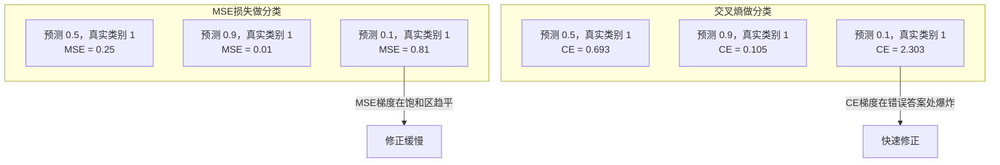
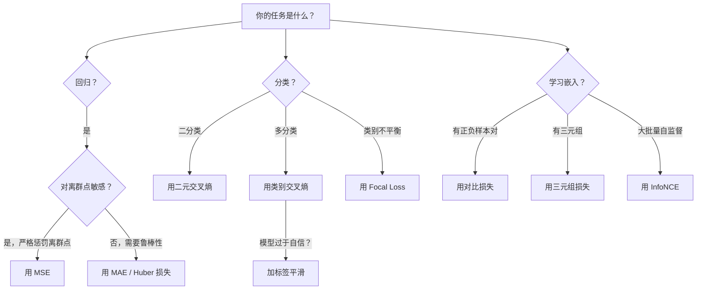

# 损失函数

> 你的网络做出了预测，真实答案说：不对。错了多少？这个数字就是损失。选错损失函数，模型就会优化一个完全错误的目标。

## 核心问题

一个用 MSE 做分类的模型会对所有输入都自信地预测 0.5。它在最小化损失——同时也毫无用处。

损失函数是模型唯一真正优化的东西。不是准确率，不是 F1，不是你汇报给经理的任何指标。优化器对损失函数求梯度，然后调整权重让这个数字变小。如果损失函数没有捕捉到你真正关心的东西，模型会找到数学上最廉价的方式来满足它——而那种方式几乎从来不是你想要的。

举个具体例子：二分类任务，两类各 50%，用 MSE 作损失。模型对每个输入都预测 0.5。平均 MSE = 0.25，这是不学任何东西的理论最低值。模型没有任何区分能力，但它"合法地"最小化了损失函数。换成交叉熵，同样的模型被迫把预测推向 0 或 1——因为 -log(0.5) = 0.693 是个很糟糕的损失，而 -log(0.99) = 0.01 才是对自信正确答案的奖励。**损失函数的选择，决定了模型是真正学习还是钻空子。**

情况还会更糟。在自监督学习中，你连标签都没有。对比损失完全定义了学习信号：什么算相似，什么算不同，模型要把它们推多远。对比损失搞错了，嵌入会坍缩到一个点——每个输入都映射到同一个向量。损失为零，完全无用。

---

## 均方误差（MSE）

回归任务的默认损失。计算预测值和真实值的差，平方后取平均。

```
MSE = (1/n) * sum((y_pred - y_true)^2)
```

**为什么要平方？** 它对大误差的惩罚是二次方级的。误差为 2 的代价是误差为 1 的 4 倍；误差为 10 的代价是误差为 1 的 100 倍。这使 MSE 对离群点非常敏感——一个预测极度偏离的样本会主导整个损失。

现实例子：预测房价，模型对 99 栋房子误差都在 1 万元以内，但对一栋豪宅误差了 20 万元。MSE 会拼命优化那一栋豪宅，可能反而损害其他 99 栋的预测。

**MSE 关于预测值的梯度：**

```
dMSE/dy_pred = (2/n) * (y_pred - y_true)
```

梯度与误差成线性关系。这对回归是个优点（大误差需要大修正），对分类是个缺点（分类需要对自信的错误答案进行指数级惩罚，而不是线性惩罚）。

---

## 交叉熵损失

分类任务的损失函数。根植于信息论——它衡量预测概率分布与真实分布之间的散度（Divergence）。

### 二元交叉熵（Binary Cross-Entropy, BCE）

```
BCE = -(y * log(p) + (1 - y) * log(1 - p))
```

其中 y 是真实标签（0 或 1），p 是预测概率。

**为什么 -log(p) 有效？**

- 真实标签为 1，预测 p = 0.99：损失 = -log(0.99) = 0.01（几乎没有惩罚）
- 真实标签为 1，预测 p = 0.01：损失 = -log(0.01) = 4.6（重罚）

460 倍的差距，这就是交叉熵的威力。它残酷地惩罚自信的错误预测，几乎不惩罚自信的正确预测。

梯度的含义也是一样的：

```
dBCE/dp = -(y/p) + (1-y)/(1-p)
```

当 y=1 且 p 接近零时，梯度为 -1/p，趋近负无穷。模型收到巨大的信号来纠正错误。当 p 接近 1 时，梯度极小——已经正确了，不需要大幅修正。

### 类别交叉熵（Categorical Cross-Entropy, CCE）

用于多分类任务（目标为 one-hot 编码）。

```
CCE = -sum(y_i * log(p_i))
```

只有真实类别对损失有贡献（其他类别的 y_i 都是 0）。10 个类别，正确类被分配概率 0.1（随机猜测水平），损失 = -log(0.1) = 2.3；正确类概率 0.9，损失 = -log(0.9) = 0.105。模型被引导把概率质量集中到正确答案上。

---

## 为什么 MSE 不适合分类



MSE 的梯度在预测接近 0 或 1 时（Sigmoid 饱和区）会趋平。交叉熵能补偿这一点——-log 恰好抵消了 Sigmoid 的平坦区，在最需要的地方提供强梯度。

---

## 标签平滑（Label Smoothing）

标准的 one-hot 标签说："这 100% 是第 3 类，其他类 0%。"这是个很强的断言。标签平滑软化它：

```
smooth_label = (1 - alpha) * one_hot + alpha / num_classes
```

alpha = 0.1，10 个类别：目标从 [0, 0, 1, 0, ...] 变成 [0.01, 0.01, 0.91, 0.01, ...]。模型的目标是 0.91 而不是 1.0。

**为什么有效？** 一个通过 Softmax 试图输出精确 1.0 的模型，需要把对应 logit 推向无穷大。这导致过度自信（Overconfidence），损害泛化能力，让模型对分布偏移更脆弱。标签平滑把目标上限设为 0.91，让 logit 保持在合理范围内。GPT 和大多数现代模型都使用标签平滑或其等效技术。

---

## 对比损失（Contrastive Loss）

没有标签，没有类别。只有一对输入，和一个问题：这两个是相似的还是不同的？

### SimCLR 风格的对比损失（NT-Xent / InfoNCE）

取一张图片，创建它的两个增强视图（裁剪、旋转、颜色抖动）。这是"正样本对"——它们应该有相似的嵌入。批次中其他所有图片构成"负样本对"——它们应该有不同的嵌入。

```
L = -log(exp(sim(z_i, z_j) / τ) / sum(exp(sim(z_i, z_k) / τ)))
```

其中 sim() 是余弦相似度，z_i 和 z_j 是正样本对，求和遍历所有负样本，τ（温度）控制分布的锐利程度。温度越低 = 负样本越"硬" = 分离越积极。

具体数字：批大小 256 意味着每个正样本对有 255 个负样本。SimCLR 默认温度 τ = 0.07。损失形式类似对相似度做 Softmax——它希望正样本对的相似度在所有 256 个选项中最高。

### 三元组损失（Triplet Loss）

取三个输入：锚点（Anchor）、正样本（Positive，同类）、负样本（Negative，不同类）。

```
L = max(0, d(anchor, positive) - d(anchor, negative) + margin)
```

margin（通常 0.2-1.0）强制要求正负样本距离之间有最小间隔。如果负样本已经够远，损失为零——没有梯度，不更新。这让训练高效，但需要仔细做"难负样本挖掘"（Hard Negative Mining）——选择靠近锚点的负样本。

---

## 焦点损失（Focal Loss）

专为不平衡数据集设计。标准交叉熵对所有被正确分类的样本一视同仁。Focal Loss 降低简单样本的权重：

```
FL = -alpha * (1 - p_t)^gamma * log(p_t)
```

其中 p_t 是真实类别的预测概率，gamma 控制聚焦程度。gamma = 0 时退化为标准交叉熵。gamma = 2（默认值）时：

- 简单样本（p_t = 0.9）：权重 = (0.1)^2 = 0.01，基本被忽略
- 困难样本（p_t = 0.1）：权重 = (0.9)^2 = 0.81，获得完整梯度信号

Focal Loss 由 Lin 等人为目标检测提出，彼时 99% 的候选区域都是背景（简单负样本）。没有 Focal Loss，模型淹没在简单背景样本中，永远学不会检测物体。有了它，模型专注于真正困难的、模糊的案例。

---

## 损失函数选择指南



---

## 从零实现

### 第一步：MSE 及其梯度

```python
def mse(predictions, targets):
    n = len(predictions)
    total = 0.0
    for p, t in zip(predictions, targets):
        total += (p - t) ** 2
    return total / n

def mse_gradient(predictions, targets):
    n = len(predictions)
    grads = []
    for p, t in zip(predictions, targets):
        grads.append(2.0 * (p - t) / n)
    return grads
```

### 第二步：二元交叉熵

log(0) 问题是真实存在的。如果模型对正样本预测恰好为 0，log(0) = 负无穷。裁剪防止这种情况：

```python
import math

def binary_cross_entropy(predictions, targets, eps=1e-15):
    n = len(predictions)
    total = 0.0
    for p, t in zip(predictions, targets):
        p_clipped = max(eps, min(1 - eps, p))
        total += -(t * math.log(p_clipped) + (1 - t) * math.log(1 - p_clipped))
    return total / n

def bce_gradient(predictions, targets, eps=1e-15):
    grads = []
    for p, t in zip(predictions, targets):
        p_clipped = max(eps, min(1 - eps, p))
        grads.append(-(t / p_clipped) + (1 - t) / (1 - p_clipped))
    return grads
```

### 第三步：带 Softmax 的类别交叉熵

Softmax 把原始 logit 转为概率，然后计算对 one-hot 目标的交叉熵：

```python
def softmax(logits):
    max_val = max(logits)
    exps = [math.exp(x - max_val) for x in logits]
    total = sum(exps)
    return [e / total for e in exps]

def categorical_cross_entropy(logits, target_index, eps=1e-15):
    probs = softmax(logits)
    p = max(eps, probs[target_index])
    return -math.log(p)

def cce_gradient(logits, target_index):
    probs = softmax(logits)
    grads = list(probs)
    grads[target_index] -= 1.0
    return grads
```

Softmax + 交叉熵的梯度有个优雅的简化：真实类别的梯度是（预测概率 - 1），其他类别的梯度是预测概率本身。这不是巧合——这正是 Softmax 和交叉熵总是成对使用的原因。

### 第四步：标签平滑

```python
def label_smoothed_cce(logits, target_index, num_classes, alpha=0.1, eps=1e-15):
    probs = softmax(logits)
    loss = 0.0
    for i in range(num_classes):
        if i == target_index:
            smooth_target = 1.0 - alpha + alpha / num_classes
        else:
            smooth_target = alpha / num_classes
        p = max(eps, probs[i])
        loss += -smooth_target * math.log(p)
    return loss
```

### 第五步：对比损失（简化版 InfoNCE）

```python
def cosine_similarity(a, b):
    dot = sum(x * y for x, y in zip(a, b))
    norm_a = math.sqrt(sum(x * x for x in a))
    norm_b = math.sqrt(sum(x * x for x in b))
    if norm_a < 1e-10 or norm_b < 1e-10:
        return 0.0
    return dot / (norm_a * norm_b)

def contrastive_loss(anchor, positive, negatives, temperature=0.07):
    sim_pos = cosine_similarity(anchor, positive) / temperature
    sim_negs = [cosine_similarity(anchor, neg) / temperature for neg in negatives]

    # 数值稳定：减去最大值
    max_sim = max(sim_pos, max(sim_negs)) if sim_negs else sim_pos
    exp_pos = math.exp(sim_pos - max_sim)
    exp_negs = [math.exp(s - max_sim) for s in sim_negs]
    total_exp = exp_pos + sum(exp_negs)

    return -math.log(max(1e-15, exp_pos / total_exp))
```

### 第六步：MSE vs 交叉熵对比训练

```python
import random

def sigmoid(x):
    x = max(-500, min(500, x))
    return 1.0 / (1.0 + math.exp(-x))

def make_circle_data(n=200, seed=42):
    random.seed(seed)
    data = []
    for _ in range(n):
        x = random.uniform(-2, 2)
        y = random.uniform(-2, 2)
        label = 1.0 if x * x + y * y < 1.5 else 0.0
        data.append(([x, y], label))
    return data


class LossComparisonNetwork:
    def __init__(self, loss_type="bce", hidden_size=8, lr=0.1):
        random.seed(0)
        self.loss_type = loss_type
        self.lr = lr
        self.hidden_size = hidden_size

        self.w1 = [[random.gauss(0, 0.5) for _ in range(2)] for _ in range(hidden_size)]
        self.b1 = [0.0] * hidden_size
        self.w2 = [random.gauss(0, 0.5) for _ in range(hidden_size)]
        self.b2 = 0.0

    def forward(self, x):
        self.x = x
        self.z1 = []
        self.h = []
        for i in range(self.hidden_size):
            z = self.w1[i][0] * x[0] + self.w1[i][1] * x[1] + self.b1[i]
            self.z1.append(z)
            self.h.append(max(0.0, z))  # ReLU

        self.z2 = sum(self.w2[i] * self.h[i] for i in range(self.hidden_size)) + self.b2
        self.out = sigmoid(self.z2)
        return self.out

    def backward(self, target):
        if self.loss_type == "mse":
            d_loss = 2.0 * (self.out - target)
        else:
            eps = 1e-15
            p = max(eps, min(1 - eps, self.out))
            d_loss = -(target / p) + (1 - target) / (1 - p)

        d_sigmoid = self.out * (1 - self.out)
        d_out = d_loss * d_sigmoid

        for i in range(self.hidden_size):
            d_relu = 1.0 if self.z1[i] > 0 else 0.0
            d_h = d_out * self.w2[i] * d_relu
            self.w2[i] -= self.lr * d_out * self.h[i]
            for j in range(2):
                self.w1[i][j] -= self.lr * d_h * self.x[j]
            self.b1[i] -= self.lr * d_h
        self.b2 -= self.lr * d_out

    def compute_loss(self, pred, target):
        if self.loss_type == "mse":
            return (pred - target) ** 2
        else:
            eps = 1e-15
            p = max(eps, min(1 - eps, pred))
            return -(target * math.log(p) + (1 - target) * math.log(1 - p))

    def train(self, data, epochs=200):
        losses = []
        for epoch in range(epochs):
            total_loss = 0.0
            correct = 0
            for x, y in data:
                pred = self.forward(x)
                self.backward(y)
                total_loss += self.compute_loss(pred, y)
                if (pred >= 0.5) == (y >= 0.5):
                    correct += 1
            avg_loss = total_loss / len(data)
            accuracy = correct / len(data) * 100
            losses.append((avg_loss, accuracy))
            if epoch % 50 == 0 or epoch == epochs - 1:
                print(f"    第 {epoch:3d} 轮: loss={avg_loss:.4f}, accuracy={accuracy:.1f}%")
        return losses


# 运行对比
data = make_circle_data()

print("=== MSE 损失 ===")
net_mse = LossComparisonNetwork(loss_type="mse")
net_mse.train(data, epochs=200)

print("\n=== 二元交叉熵 ===")
net_bce = LossComparisonNetwork(loss_type="bce")
net_bce.train(data, epochs=200)
```

---

## 用 PyTorch 实现

PyTorch 内置了所有标准损失函数，并有数值稳定性保证：

```python
import torch
import torch.nn as nn
import torch.nn.functional as F

predictions = torch.tensor([0.9, 0.1, 0.7], requires_grad=True)
targets = torch.tensor([1.0, 0.0, 1.0])

mse_loss = F.mse_loss(predictions, targets)
bce_loss = F.binary_cross_entropy(predictions, targets)

logits = torch.randn(4, 10)
labels = torch.tensor([3, 7, 1, 9])
ce_loss = F.cross_entropy(logits, labels)
ce_smooth = F.cross_entropy(logits, labels, label_smoothing=0.1)
```

用 `F.cross_entropy`，不要手动 Softmax 再 `F.nll_loss`。它把 log-softmax 和负对数似然合并成一个数值稳定的操作。分开计算会在大指数相减时损失精度。

对比学习通常用自定义实现或 `lightly`、`pytorch-metric-learning` 等库。核心循环始终相同：计算成对相似度，对正负样本做 Softmax，反向传播。

---

## 关键术语

| 术语 | 英文 | 含义 |
|------|------|------|
| 损失函数 | Loss Function | 把预测和目标映射为标量的可微函数，优化器最小化它 |
| 均方误差 | MSE | 预测与目标之差的平方均值，对大误差二次方惩罚 |
| 交叉熵 | Cross-Entropy | 用 -log(p) 衡量预测分布与真实分布的散度 |
| 二元交叉熵 | Binary Cross-Entropy (BCE) | 两类分类的交叉熵：-(y·log(p) + (1-y)·log(1-p)) |
| 标签平滑 | Label Smoothing | 把硬标签 0/1 替换为软标签（如 0.1/0.9），防止过度自信 |
| 对比损失 | Contrastive Loss | 让相似对靠近、不相似对远离的损失函数 |
| InfoNCE | InfoNCE | 基于相似度的归一化温度缩放交叉熵，SimCLR/CLIP 使用 |
| 焦点损失 | Focal Loss | 用 (1-p_t)^gamma 降权简单样本，专注困难样本 |
| 三元组损失 | Triplet Loss | 锚点-正样本-负样本，强制正负样本距离有最小间隔 |
| 温度 | Temperature | 控制分布锐利程度的标量除数；温度越低，分布越尖锐 |
