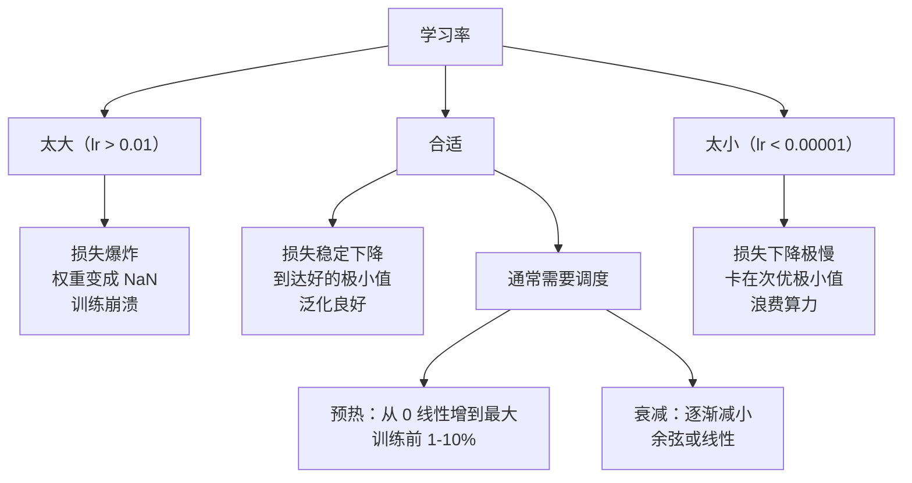
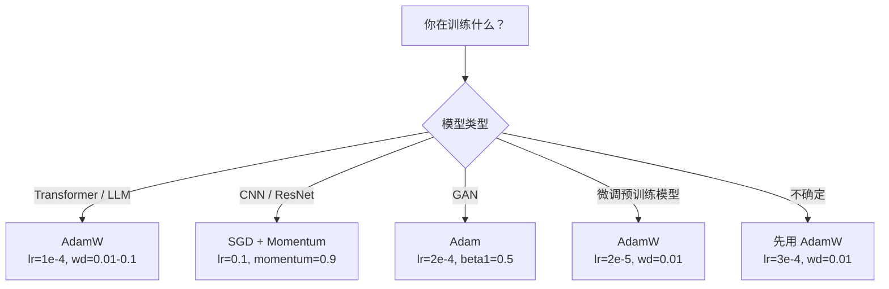

# 优化器

> 梯度下降告诉你往哪个方向走。它什么都没说走多远、走多快。SGD 是一个指南针。Adam 是带有实时路况的 GPS。

## 核心问题

你算出了梯度。你知道第 4721 号权重应该减少 0.003，这样损失才会降低。但是 0.003 是以什么为单位？按什么缩放？第 1 步和第 1000 步应该移动同样的距离吗？

最简单的梯度下降对每个参数在每一步应用同样的学习率：`w = w - lr * gradient`。这在实际训练神经网络时制造了三个令人头痛的问题。

**第一，震荡（Oscillation）。** 损失曲面很少像光滑的碗。更像是一条狭长的山谷。梯度指向山谷的横向（陡峭方向），而不是沿山谷的纵向（平缓方向）。梯度下降在狭窄维度来回反弹，在有用方向上几乎不前进。你见过这种现象：损失快速下降然后停滞，不是因为收敛了，而是在震荡。

**第二，所有参数用同一个学习率是错的。** 有些权重需要大更新（还在欠拟合阶段）。另一些需要小更新（已经接近最优值）。对前者合适的学习率会摧毁后者，反之亦然。

**第三，鞍点（Saddle Points）。** 在高维空间里，损失曲面有大片平坦区域，梯度接近零。普通 SGD 以梯度的速度爬过这些区域，也就是几乎不动。模型看起来卡住了。实际上它没有卡住——它在一个平坦区域里，另一边还有有用的下降空间。但 SGD 没有穿越平坦区的机制。

**Adam 解决了这三个问题。** 它为每个参数维护两个运行均值——梯度均值（动量，处理震荡）和梯度平方均值（自适应学习率，处理尺度差异）。加上对前几步的偏差校正，它成为一个用默认超参数就能处理 80% 问题的优化器。本章从零实现它，让你清楚理解它在另外 20% 问题上何时失效、为什么失效。

---

## 随机梯度下降（SGD）

最简单的优化器。在小批量（Mini-batch）上计算梯度，然后朝反方向迈一步。

```
w = w - lr * gradient
```

"随机"指的是用一个随机子集（小批量）来估算梯度，而不是全量数据。这种噪声其实有用——它有助于逃离尖锐的局部极小值。但噪声也会造成震荡。

学习率是唯一的旋钮。太大：损失发散。太小：训练永远不结束。最优值取决于架构、数据、批大小和训练阶段。普通 SGD 在现代网络上，典型值在 0.01 到 0.1 之间。但即便在单次训练中，理想学习率也会变化。

---

## 带动量的 SGD（Momentum）

"球滚下山"的比喻被用滥了，但确实准确。不只用梯度来迈步，而是维护一个累积了历史梯度的速度（Velocity）：

```
m_t = beta * m_{t-1} + gradient
w = w - lr * m_t
```

beta（通常 0.9）控制保留多少历史。beta = 0.9 时，动量大约是过去 10 个梯度的平均（1 / (1 - 0.9) = 10）。

**为什么能解决震荡？** 指向同一方向的梯度会累积。方向翻转的梯度会相消。在那条狭长山谷里，"横向"分量每步都翻转符号，被阻尼；"纵向"分量保持一致，被放大。结果是在有用方向平滑加速。

具体数字：条件不好的损失曲面上，纯 SGD 可能需要 10000 步。带动量（beta=0.9）的 SGD 通常只需 3000-5000 步。这个加速不是微不足道的。

---

## RMSProp

第一个真正有效的按参数自适应学习率方法。由 Hinton 在 Coursera 课上提出（从未正式发表）。

```
s_t = beta * s_{t-1} + (1 - beta) * gradient^2
w = w - lr * gradient / (sqrt(s_t) + epsilon)
```

s_t 跟踪梯度平方的运行均值。梯度一直很大的参数被除以一个大数（有效学习率变小）。梯度一直很小的参数被除以一个小数（有效学习率变大）。

这解决了"所有参数用同一学习率"的问题：一个一直收到大更新的权重可能已经接近目标——放慢它。一直收到小更新的权重可能训练不足——加速它。

epsilon（通常 1e-8）防止参数没被更新时除以零。

---

## Adam：动量 + RMSProp

Adam 结合了两个思想。它为每个参数维护两个指数移动平均：

```
m_t = beta1 * m_{t-1} + (1 - beta1) * gradient       # 一阶矩：均值
v_t = beta2 * v_{t-1} + (1 - beta2) * gradient^2      # 二阶矩：方差
```

**偏差校正（Bias Correction）是大多数解释跳过的关键细节。** 第 1 步时，m_1 = (1 - beta1) * gradient。beta1 = 0.9 时，m_1 = 0.1 * gradient——比实际梯度小 10 倍。移动平均还没有"热身"。偏差校正来补偿：

```
m_hat = m_t / (1 - beta1^t)
v_hat = v_t / (1 - beta2^t)
```

第 1 步，beta1 = 0.9：m_hat = m_1 / (1 - 0.9) = m_1 / 0.1 = 实际梯度。第 100 步：(1 - 0.9^100) ≈ 1.0，校正消失。偏差校正在最初约 10 步很重要，约 50 步后无关紧要。

更新公式：

```
w = w - lr * m_hat / (sqrt(v_hat) + epsilon)
```

**Adam 默认值：** lr = 0.001，beta1 = 0.9，beta2 = 0.999，epsilon = 1e-8。这些默认值适用于 80% 的问题。如果不奏效，先调 lr，再调 beta2，几乎不需要动 beta1 或 epsilon。

---

## AdamW：正确的权重衰减

L2 正则化把 lambda * w^2 加到损失里。对普通 SGD，这等价于权重衰减（每步从权重里减去 lambda * w）。但对 Adam，这个等价性**不成立**。

Loshchilov & Hutter 的洞察：把 L2 加到损失再让 Adam 处理梯度，自适应学习率也会缩放正则化项。梯度方差大的参数得到更少的正则化，方差小的参数得到更多。这不是你想要的——你想要无论梯度统计如何，正则化都均匀。

AdamW 通过在 Adam 更新之后直接对权重施加衰减来修复这个问题：

```
w = w - lr * m_hat / (sqrt(v_hat) + epsilon) - lr * lambda * w
```

权重衰减项（`lr * lambda * w`）不经过 Adam 的自适应因子缩放，每个参数都得到同等比例的收缩。

这看起来是个小细节，其实不是。AdamW 在几乎所有任务上都比 Adam + L2 正则化收敛到更好的解。它是 PyTorch 训练 Transformer、扩散模型和大多数现代架构的默认优化器。BERT、GPT、LLaMA、Stable Diffusion——全用 AdamW 训练。

---

## 学习率：最重要的超参数



**如果只调一个超参数，调学习率。** 学习率变化 10 倍，比任何架构决策都重要。常用默认值：

- SGD: lr = 0.01 到 0.1
- Adam/AdamW: lr = 1e-4 到 3e-4
- 微调预训练模型: lr = 1e-5 到 5e-5
- 学习率预热: 前 1-10% 步数线性增长

---

## 各优化器的适用场景



---

## 从零实现

### 第一步：普通 SGD

```python
class SGD:
    def __init__(self, lr=0.01):
        self.lr = lr

    def step(self, params, grads):
        for i in range(len(params)):
            params[i] -= self.lr * grads[i]
```

### 第二步：带动量的 SGD

```python
class SGDMomentum:
    def __init__(self, lr=0.01, beta=0.9):
        self.lr = lr
        self.beta = beta
        self.velocities = None

    def step(self, params, grads):
        if self.velocities is None:
            self.velocities = [0.0] * len(params)
        for i in range(len(params)):
            self.velocities[i] = self.beta * self.velocities[i] + grads[i]
            params[i] -= self.lr * self.velocities[i]
```

### 第三步：Adam

```python
import math

class Adam:
    def __init__(self, lr=0.001, beta1=0.9, beta2=0.999, epsilon=1e-8):
        self.lr = lr
        self.beta1 = beta1
        self.beta2 = beta2
        self.epsilon = epsilon
        self.m = None
        self.v = None
        self.t = 0

    def step(self, params, grads):
        if self.m is None:
            self.m = [0.0] * len(params)
            self.v = [0.0] * len(params)

        self.t += 1

        for i in range(len(params)):
            self.m[i] = self.beta1 * self.m[i] + (1 - self.beta1) * grads[i]
            self.v[i] = self.beta2 * self.v[i] + (1 - self.beta2) * grads[i] ** 2

            m_hat = self.m[i] / (1 - self.beta1 ** self.t)
            v_hat = self.v[i] / (1 - self.beta2 ** self.t)

            params[i] -= self.lr * m_hat / (math.sqrt(v_hat) + self.epsilon)
```

### 第四步：AdamW

```python
class AdamW:
    def __init__(self, lr=0.001, beta1=0.9, beta2=0.999, epsilon=1e-8, weight_decay=0.01):
        self.lr = lr
        self.beta1 = beta1
        self.beta2 = beta2
        self.epsilon = epsilon
        self.weight_decay = weight_decay
        self.m = None
        self.v = None
        self.t = 0

    def step(self, params, grads):
        if self.m is None:
            self.m = [0.0] * len(params)
            self.v = [0.0] * len(params)

        self.t += 1

        for i in range(len(params)):
            self.m[i] = self.beta1 * self.m[i] + (1 - self.beta1) * grads[i]
            self.v[i] = self.beta2 * self.v[i] + (1 - self.beta2) * grads[i] ** 2

            m_hat = self.m[i] / (1 - self.beta1 ** self.t)
            v_hat = self.v[i] / (1 - self.beta2 ** self.t)

            params[i] -= self.lr * m_hat / (math.sqrt(v_hat) + self.epsilon)
            # 权重衰减：直接施加，不经 Adam 自适应因子缩放
            params[i] -= self.lr * self.weight_decay * params[i]
```

### 第五步：四种优化器对比训练

```python
import random

def sigmoid(x):
    x = max(-500, min(500, x))
    return 1.0 / (1.0 + math.exp(-x))

def make_circle_data(n=200, seed=42):
    random.seed(seed)
    data = []
    for _ in range(n):
        x = random.uniform(-2, 2)
        y = random.uniform(-2, 2)
        label = 1.0 if x * x + y * y < 1.5 else 0.0
        data.append(([x, y], label))
    return data


class OptimizerTestNetwork:
    def __init__(self, optimizer, hidden_size=8):
        random.seed(0)
        self.hidden_size = hidden_size
        self.optimizer = optimizer

        self.w1 = [[random.gauss(0, 0.5) for _ in range(2)] for _ in range(hidden_size)]
        self.b1 = [0.0] * hidden_size
        self.w2 = [random.gauss(0, 0.5) for _ in range(hidden_size)]
        self.b2 = 0.0

    def get_params(self):
        params = []
        for row in self.w1:
            params.extend(row)
        params.extend(self.b1)
        params.extend(self.w2)
        params.append(self.b2)
        return params

    def set_params(self, params):
        idx = 0
        for i in range(self.hidden_size):
            for j in range(2):
                self.w1[i][j] = params[idx]
                idx += 1
        for i in range(self.hidden_size):
            self.b1[i] = params[idx]
            idx += 1
        for i in range(self.hidden_size):
            self.w2[i] = params[idx]
            idx += 1
        self.b2 = params[idx]

    def forward(self, x):
        self.x = x
        self.z1 = []
        self.h = []
        for i in range(self.hidden_size):
            z = self.w1[i][0] * x[0] + self.w1[i][1] * x[1] + self.b1[i]
            self.z1.append(z)
            self.h.append(max(0.0, z))  # ReLU

        self.z2 = sum(self.w2[i] * self.h[i] for i in range(self.hidden_size)) + self.b2
        self.out = sigmoid(self.z2)
        return self.out

    def compute_grads(self, target):
        eps = 1e-15
        p = max(eps, min(1 - eps, self.out))
        d_loss = -(target / p) + (1 - target) / (1 - p)
        d_sigmoid = self.out * (1 - self.out)
        d_out = d_loss * d_sigmoid

        grads = [0.0] * (self.hidden_size * 2 + self.hidden_size + self.hidden_size + 1)
        idx = 0
        for i in range(self.hidden_size):
            d_relu = 1.0 if self.z1[i] > 0 else 0.0
            d_h = d_out * self.w2[i] * d_relu
            grads[idx] = d_h * self.x[0]
            grads[idx + 1] = d_h * self.x[1]
            idx += 2

        for i in range(self.hidden_size):
            d_relu = 1.0 if self.z1[i] > 0 else 0.0
            grads[idx] = d_out * self.w2[i] * d_relu
            idx += 1

        for i in range(self.hidden_size):
            grads[idx] = d_out * self.h[i]
            idx += 1

        grads[idx] = d_out
        return grads

    def train(self, data, epochs=300):
        losses = []
        for epoch in range(epochs):
            total_loss = 0.0
            correct = 0
            for x, y in data:
                pred = self.forward(x)
                grads = self.compute_grads(y)
                params = self.get_params()
                self.optimizer.step(params, grads)
                self.set_params(params)

                eps = 1e-15
                p = max(eps, min(1 - eps, pred))
                total_loss += -(y * math.log(p) + (1 - y) * math.log(1 - p))
                if (pred >= 0.5) == (y >= 0.5):
                    correct += 1
            avg_loss = total_loss / len(data)
            accuracy = correct / len(data) * 100
            losses.append((avg_loss, accuracy))
            if epoch % 75 == 0 or epoch == epochs - 1:
                print(f"    第 {epoch:3d} 轮: loss={avg_loss:.4f}, accuracy={accuracy:.1f}%")
        return losses


# 运行对比
data = make_circle_data()
optimizers = {
    "SGD": SGD(lr=0.01),
    "SGD + Momentum": SGDMomentum(lr=0.01, beta=0.9),
    "Adam": Adam(lr=0.001),
    "AdamW": AdamW(lr=0.001, weight_decay=0.01),
}

for name, opt in optimizers.items():
    print(f"\n=== {name} ===")
    net = OptimizerTestNetwork(opt)
    net.train(data, epochs=300)
```

---

## 用 PyTorch 实现

PyTorch 优化器支持参数组、梯度裁剪和学习率调度：

```python
import torch
import torch.optim as optim

model = torch.nn.Sequential(
    torch.nn.Linear(784, 256),
    torch.nn.ReLU(),
    torch.nn.Linear(256, 10),
)

optimizer = optim.AdamW(model.parameters(), lr=3e-4, weight_decay=0.01)
scheduler = optim.lr_scheduler.CosineAnnealingLR(optimizer, T_max=100)

for epoch in range(100):
    optimizer.zero_grad()
    output = model(torch.randn(32, 784))
    loss = torch.nn.functional.cross_entropy(output, torch.randint(0, 10, (32,)))
    loss.backward()
    torch.nn.utils.clip_grad_norm_(model.parameters(), max_norm=1.0)
    optimizer.step()
    scheduler.step()
```

**顺序要背熟：** zero_grad → forward → loss → backward → (clip) → step → (schedule)。顺序搞错（比如在 `optimizer.step()` 之前调 `scheduler.step()`）是常见的隐蔽 bug 来源。

对于 CNN，很多从业者仍然偏好 SGD + 动量（lr=0.1, momentum=0.9, weight_decay=1e-4）加步进或余弦调度。SGD 能找到更平坦的极小值，通常泛化更好。对于 Transformer 和 LLM，AdamW + 预热 + 余弦衰减是通用默认。没有充分的测量依据不要反潮流。

---

## 关键术语

| 术语 | 英文 | 含义 |
|------|------|------|
| 学习率 | Learning Rate | 梯度更新的标量倍数；训练中影响最大的单个超参数 |
| 随机梯度下降 | SGD | 用小批量估算梯度，然后减去 lr * gradient 更新权重 |
| 动量 | Momentum | 历史梯度的指数移动平均；阻尼震荡，放大一致方向 |
| RMSProp | RMSProp | 每个参数除以其近期梯度的均方根，均衡学习率 |
| Adam | Adam | 动量（一阶矩）+ RMSProp（二阶矩）+ 偏差校正 |
| AdamW | AdamW | 解耦权重衰减的 Adam；正则化直接施加于权重而非通过梯度 |
| 偏差校正 | Bias Correction | 除以 (1 - beta^t) 补偿 Adam 矩估计的零初始化误差 |
| 权重衰减 | Weight Decay | 每步按比例缩小权重；惩罚大权重的正则化方法 |
| 学习率调度 | Learning Rate Schedule | 训练中调整学习率的函数；预热 + 余弦衰减是现代默认 |
| 梯度裁剪 | Gradient Clipping | 当梯度范数超过阈值时缩小梯度向量；防止梯度爆炸 |
