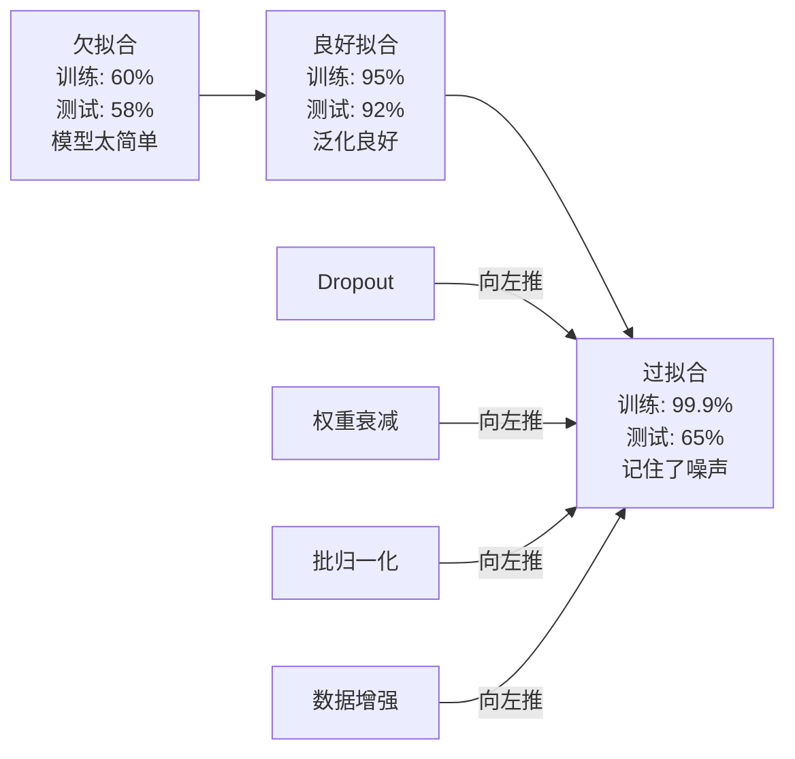
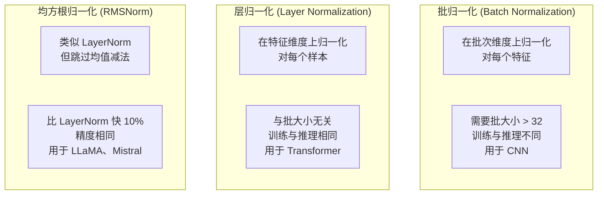
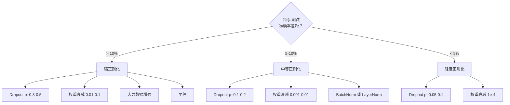

# 正则化

> 你的模型在训练集上达到 99%，在测试集上只有 60%。它记住了数据，而不是真正学习。正则化是你对复杂度征收的税，用来强制泛化。

## 核心问题

参数足够多的神经网络可以记住任意数据集。这不是假设——Zhang 等人（2017）用随机标签训练标准网络在 ImageNet 上证明了这一点。网络在完全随机的标签分配下达到了接近零的训练损失。它们记住了一百万个没有任何规律的随机输入-输出对。训练损失完美，测试准确率为零。

这就是过拟合问题，而且随着模型变大会越来越严重。GPT-3 有 1750 亿个参数，训练集约 5000 亿个 token。有这么多参数，模型完全有能力逐字逐句记住大量训练数据。没有正则化，它只会背诵训练样本，而不是学习可泛化的规律。

训练性能和测试性能之间的差距就是**过拟合差距**。本章每种技术从不同角度攻击这个差距：
- **Dropout** 强迫网络不依赖任何单一神经元
- **权重衰减** 防止任何单一权重增长过大
- **批归一化** 平滑损失曲面，让优化器找到更平坦、更可泛化的极小值
- **层归一化** 在批归一化失效的场合（小批量、变长序列）做同样的事
- **RMSNorm** 通过去掉均值计算快约 10%，精度相同

---

## 过拟合谱

每个模型都处于从欠拟合（太简单，学不到规律）到过拟合（太复杂，学到了噪声）的谱上。甜蜜点在中间，正则化把过拟合的模型往那个方向推。



---

## Dropout

最简单的正则化技术，也有最优雅的解释。训练时，以概率 p 随机把每个神经元的输出置零。

```
output = activation(z) * mask    其中 mask[i] ~ Bernoulli(1 - p)
```

p = 0.5 时，每次前向传播有一半神经元被置零。网络必须学习冗余表示，因为它不能预测哪些神经元会在。这防止了**共适应（Co-adaptation）**——神经元依赖特定其他神经元存在才能工作的现象。

**集成解释：** 有 N 个神经元和 Dropout 的网络创造了 2^N 种可能的子网络（每种神经元开关组合）。用 Dropout 训练近似于同时训练所有 2^N 个子网络，每个都在不同的小批量上。测试时，用所有神经元（不丢弃）并把输出缩小 (1-p) 倍，匹配训练时的期望值。这等价于对 2^N 个子网络的预测取平均——从单个模型得到一个巨大的集成。

实践中，缩放在训练时做（倒置 Dropout，Inverted Dropout）：

```
训练时：output = activation(z) * mask / (1 - p)
测试时：output = activation(z)   （不需要任何修改）
```

这更简洁——测试代码完全不需要知道 Dropout 的存在。

**常用 Dropout 率：** Transformer 用 p = 0.1，MLP 用 p = 0.5，CNN 用 p = 0.2-0.3。Dropout 越大 = 正则化越强 = 欠拟合风险越高。

---

## 权重衰减（L2 正则化）

把所有权重的平方和加到损失里：

```
total_loss = task_loss + (lambda / 2) * sum(w_i^2)
```

正则化项的梯度是 `lambda * w`。这意味着每一步，每个权重都以正比于其大小的比例向零收缩。大权重惩罚更多。模型被推向没有任何单一权重主导的解。

**为什么有助于泛化？** 过拟合模型倾向于有大权重，它们放大训练数据中的噪声。权重衰减让权重保持小，限制模型的有效容量，迫使它依赖稳健的、可泛化的特征，而不是记住的怪癖。

lambda 控制强度。典型值：
- Transformer 上 AdamW 用 0.01
- CNN 上 SGD 用 1e-4
- 严重过拟合时用 0.1

如第 06 章所说：权重衰减和 L2 正则化在 SGD 中等价，在 Adam 中不等价。用 Adam 时，始终使用 AdamW（解耦权重衰减）。

---

## 批归一化（Batch Normalization）

在把每层输出传给下一层之前，在小批量维度上归一化。

对某层的一个小批量激活值：

```
mu = (1/B) * sum(x_i)                   # 批均值
sigma^2 = (1/B) * sum((x_i - mu)^2)    # 批方差
x_hat = (x_i - mu) / sqrt(sigma^2 + eps)  # 归一化
y = gamma * x_hat + beta                 # 缩放和平移
```

gamma 和 beta 是可学习参数，允许网络在最优时撤销归一化。没有它们，你会强制每层输出都是零均值单位方差，但这不一定是网络想要的。

**训练与推理的区别：** 训练时，mu 和 sigma 来自当前小批量。推理时，用训练期间积累的运行均值（指数移动平均，momentum = 0.1，即 90% 旧值 + 10% 新值）。

BatchNorm 为什么有效至今仍有争论。原论文称它减少了"内部协变量偏移"（随着早期层更新，层输入的分布发生变化）。Santurkar 等人（2018）证明这个解释是错的。实际原因：**BatchNorm 使损失曲面更平滑**。梯度更有预测性，Lipschitz 常数更小，优化器可以安全地走更大的步。这就是为什么 BatchNorm 允许使用更高的学习率，收敛更快。

BatchNorm 有个根本限制：它依赖批统计量。批大小为 1 时，均值和方差毫无意义。批很小（< 32）时，统计量噪声大，损害性能。这对目标检测（内存限制批大小）和语言建模（序列长度变化）很重要。

---

## 层归一化（Layer Normalization）

跨特征维度归一化，而不是跨批次。对单个样本：

```
mu = (1/D) * sum(x_j)                    # 特征均值
sigma^2 = (1/D) * sum((x_j - mu)^2)    # 特征方差
x_hat = (x_j - mu) / sqrt(sigma^2 + eps)
y = gamma * x_hat + beta
```

D 是特征维度。每个样本独立归一化——不依赖批大小。这就是 Transformer 用 LayerNorm 而不是 BatchNorm 的原因：序列长度可变，批大小经常很小（生成时为 1），且训练和推理的计算完全相同。

LayerNorm 在 Transformer 中应用在每个自注意力块和每个前馈块之后（Post-LN），或之前（Pre-LN，训练更稳定）。

---

## RMSNorm

去掉了均值减法的 LayerNorm。由 Zhang & Sennrich（2019）提出。

```
rms = sqrt((1/D) * sum(x_j^2))
y = gamma * x / rms
```

就这些。没有均值计算，没有 beta 参数。观察：LayerNorm 中的重中心化（均值减法）对模型性能几乎没有贡献，但有计算开销。去掉它，精度相同，计算量减少约 10%。

LLaMA、LLaMA 2、LLaMA 3、Mistral 以及大多数现代大语言模型都用 RMSNorm 代替 LayerNorm。在数十亿参数、数万亿 token 的规模下，那 10% 的节省非常可观。

---

## 归一化方法对比



---

## 数据增强作为正则化

不修改模型，而是修改数据。对训练输入做变换，同时保留标签：

- **图像：** 随机裁剪、翻转、旋转、颜色抖动、随机遮挡
- **文本：** 同义词替换、回译、随机删除
- **音频：** 时间拉伸、音调变换、加噪声

效果与正则化相同：增加训练集的有效大小，让模型更难记住特定样本。只看到每张图片一次原始版本的模型可以记住它；看到 50 个增强版本的模型被迫学习不变的结构。

---

## 早停（Early Stopping）

最简单的正则化器：验证损失开始上升时停止训练。此时模型还没有过拟合。实践中，每轮跟踪验证损失，保存最佳模型，在"耐心窗口"（通常 5-20 轮）内继续训练。如果验证损失在耐心窗口内不再改善，停止训练并加载最佳保存模型。

---

## 何时应用什么



---

## 从零实现

### 第一步：Dropout（训练与评估模式）

```python
import random
import math


class Dropout:
    def __init__(self, p=0.5):
        self.p = p
        self.training = True
        self.mask = None

    def forward(self, x):
        if not self.training:
            return list(x)
        self.mask = []
        output = []
        for val in x:
            if random.random() < self.p:
                self.mask.append(0)
                output.append(0.0)
            else:
                self.mask.append(1)
                # 倒置缩放：训练时除以 (1-p)，测试时不需要处理
                output.append(val / (1 - self.p))
        return output

    def backward(self, grad_output):
        grads = []
        for g, m in zip(grad_output, self.mask):
            if m == 0:
                grads.append(0.0)
            else:
                grads.append(g / (1 - self.p))
        return grads
```

### 第二步：L2 权重衰减

```python
def l2_regularization(weights, lambda_reg):
    penalty = 0.0
    for w in weights:
        penalty += w * w
    return lambda_reg * 0.5 * penalty

def l2_gradient(weights, lambda_reg):
    return [lambda_reg * w for w in weights]
```

### 第三步：批归一化

```python
class BatchNorm:
    def __init__(self, num_features, momentum=0.1, eps=1e-5):
        self.gamma = [1.0] * num_features
        self.beta = [0.0] * num_features
        self.eps = eps
        self.momentum = momentum
        self.running_mean = [0.0] * num_features
        self.running_var = [1.0] * num_features
        self.training = True
        self.num_features = num_features

    def forward(self, batch):
        batch_size = len(batch)
        if self.training:
            # 计算批均值
            mean = [0.0] * self.num_features
            for sample in batch:
                for j in range(self.num_features):
                    mean[j] += sample[j]
            mean = [m / batch_size for m in mean]

            # 计算批方差
            var = [0.0] * self.num_features
            for sample in batch:
                for j in range(self.num_features):
                    var[j] += (sample[j] - mean[j]) ** 2
            var = [v / batch_size for v in var]

            # 更新运行统计量
            for j in range(self.num_features):
                self.running_mean[j] = (1 - self.momentum) * self.running_mean[j] + self.momentum * mean[j]
                self.running_var[j] = (1 - self.momentum) * self.running_var[j] + self.momentum * var[j]
        else:
            mean = list(self.running_mean)
            var = list(self.running_var)

        self.x_hat = []
        output = []
        for sample in batch:
            normalized = []
            out_sample = []
            for j in range(self.num_features):
                x_h = (sample[j] - mean[j]) / math.sqrt(var[j] + self.eps)
                normalized.append(x_h)
                out_sample.append(self.gamma[j] * x_h + self.beta[j])
            self.x_hat.append(normalized)
            output.append(out_sample)
        return output
```

### 第四步：层归一化

```python
class LayerNorm:
    def __init__(self, num_features, eps=1e-5):
        self.gamma = [1.0] * num_features
        self.beta = [0.0] * num_features
        self.eps = eps
        self.num_features = num_features

    def forward(self, x):
        mean = sum(x) / len(x)
        var = sum((xi - mean) ** 2 for xi in x) / len(x)

        self.x_hat = []
        output = []
        for j in range(self.num_features):
            x_h = (x[j] - mean) / math.sqrt(var + self.eps)
            self.x_hat.append(x_h)
            output.append(self.gamma[j] * x_h + self.beta[j])
        return output
```

### 第五步：RMSNorm

```python
class RMSNorm:
    def __init__(self, num_features, eps=1e-6):
        self.gamma = [1.0] * num_features
        self.eps = eps
        self.num_features = num_features

    def forward(self, x):
        rms = math.sqrt(sum(xi * xi for xi in x) / len(x) + self.eps)
        output = []
        for j in range(self.num_features):
            output.append(self.gamma[j] * x[j] / rms)
        return output
```

### 第六步：有无正则化的训练对比

```python
def sigmoid(x):
    x = max(-500, min(500, x))
    return 1.0 / (1.0 + math.exp(-x))


def make_circle_data(n=200, seed=42):
    random.seed(seed)
    data = []
    for _ in range(n):
        x = random.uniform(-2, 2)
        y = random.uniform(-2, 2)
        label = 1.0 if x * x + y * y < 1.5 else 0.0
        data.append(([x, y], label))
    return data


class RegularizedNetwork:
    def __init__(self, hidden_size=16, lr=0.05, dropout_p=0.0, weight_decay=0.0):
        random.seed(0)
        self.hidden_size = hidden_size
        self.lr = lr
        self.dropout_p = dropout_p
        self.weight_decay = weight_decay
        self.dropout = Dropout(p=dropout_p) if dropout_p > 0 else None

        self.w1 = [[random.gauss(0, 0.5) for _ in range(2)] for _ in range(hidden_size)]
        self.b1 = [0.0] * hidden_size
        self.w2 = [random.gauss(0, 0.5) for _ in range(hidden_size)]
        self.b2 = 0.0

    def forward(self, x, training=True):
        self.x = x
        self.z1 = []
        self.h = []
        for i in range(self.hidden_size):
            z = self.w1[i][0] * x[0] + self.w1[i][1] * x[1] + self.b1[i]
            self.z1.append(z)
            self.h.append(max(0.0, z))

        if self.dropout:
            self.dropout.training = training
            self.h = self.dropout.forward(self.h)

        self.z2 = sum(self.w2[i] * self.h[i] for i in range(self.hidden_size)) + self.b2
        self.out = sigmoid(self.z2)
        return self.out

    def backward(self, target):
        eps = 1e-15
        p = max(eps, min(1 - eps, self.out))
        d_loss = -(target / p) + (1 - target) / (1 - p)
        d_sigmoid = self.out * (1 - self.out)
        d_out = d_loss * d_sigmoid

        for i in range(self.hidden_size):
            d_relu = 1.0 if self.z1[i] > 0 else 0.0
            d_h = d_out * self.w2[i] * d_relu
            # 权重衰减：在梯度中加入 lambda * w
            self.w2[i] -= self.lr * (d_out * self.h[i] + self.weight_decay * self.w2[i])
            for j in range(2):
                self.w1[i][j] -= self.lr * (d_h * self.x[j] + self.weight_decay * self.w1[i][j])
            self.b1[i] -= self.lr * d_h
        self.b2 -= self.lr * d_out

    def evaluate(self, data):
        correct = 0
        total_loss = 0.0
        for x, y in data:
            pred = self.forward(x, training=False)
            eps = 1e-15
            p = max(eps, min(1 - eps, pred))
            total_loss += -(y * math.log(p) + (1 - y) * math.log(1 - p))
            if (pred >= 0.5) == (y >= 0.5):
                correct += 1
        return total_loss / len(data), correct / len(data) * 100

    def train_model(self, train_data, test_data, epochs=300):
        history = []
        for epoch in range(epochs):
            total_loss = 0.0
            correct = 0
            for x, y in train_data:
                pred = self.forward(x, training=True)
                self.backward(y)
                eps = 1e-15
                p = max(eps, min(1 - eps, pred))
                total_loss += -(y * math.log(p) + (1 - y) * math.log(1 - p))
                if (pred >= 0.5) == (y >= 0.5):
                    correct += 1
            train_loss = total_loss / len(train_data)
            train_acc = correct / len(train_data) * 100
            test_loss, test_acc = self.evaluate(test_data)
            history.append((train_loss, train_acc, test_loss, test_acc))
            if epoch % 75 == 0 or epoch == epochs - 1:
                gap = train_acc - test_acc
                print(f"    第 {epoch:3d} 轮: train={train_acc:.1f}%, test={test_acc:.1f}%, 差距={gap:.1f}%")
        return history


# 运行对比
all_data = make_circle_data(400)
train_data = all_data[:200]
test_data = all_data[200:]

configs = [
    {"name": "无正则化",          "dropout_p": 0.0, "weight_decay": 0.0},
    {"name": "仅 Dropout",       "dropout_p": 0.3, "weight_decay": 0.0},
    {"name": "仅权重衰减",        "dropout_p": 0.0, "weight_decay": 0.01},
    {"name": "Dropout + 权重衰减", "dropout_p": 0.3, "weight_decay": 0.01},
]

for cfg in configs:
    print(f"\n=== {cfg['name']} ===")
    net = RegularizedNetwork(hidden_size=16, lr=0.05,
                              dropout_p=cfg["dropout_p"],
                              weight_decay=cfg["weight_decay"])
    net.train_model(train_data, test_data, epochs=300)
```

---

## 用 PyTorch 实现

PyTorch 以模块形式提供所有归一化和正则化组件：

```python
import torch
import torch.nn as nn

model = nn.Sequential(
    nn.Linear(784, 256),
    nn.BatchNorm1d(256),
    nn.ReLU(),
    nn.Dropout(0.3),
    nn.Linear(256, 128),
    nn.BatchNorm1d(128),
    nn.ReLU(),
    nn.Dropout(0.3),
    nn.Linear(128, 10),
)

model.train()
out_train = model(torch.randn(32, 784))

model.eval()
out_test = model(torch.randn(1, 784))
```

**`model.train()` / `model.eval()` 切换至关重要。** 它控制 Dropout 的开关，并告诉 BatchNorm 使用批统计量还是运行统计量。推理前忘记调 `model.eval()` 是深度学习中最常见的 bug 之一——你的测试准确率会随机波动，因为 Dropout 还在运行，BatchNorm 还在用小批量统计量。

对于 Transformer，模式不同：

```python
class TransformerBlock(nn.Module):
    def __init__(self, d_model=512, nhead=8, dropout=0.1):
        super().__init__()
        self.attention = nn.MultiheadAttention(d_model, nhead, dropout=dropout)
        self.norm1 = nn.LayerNorm(d_model)
        self.ff = nn.Sequential(
            nn.Linear(d_model, d_model * 4),
            nn.GELU(),
            nn.Linear(d_model * 4, d_model),
            nn.Dropout(dropout),
        )
        self.norm2 = nn.LayerNorm(d_model)
        self.dropout = nn.Dropout(dropout)

    def forward(self, x):
        attended, _ = self.attention(x, x, x)
        x = self.norm1(x + self.dropout(attended))
        x = self.norm2(x + self.ff(x))
        return x
```

LayerNorm，不是 BatchNorm。Dropout p=0.1，不是 p=0.5。这是 Transformer 的默认值。

---

## 关键术语

| 术语 | 英文 | 含义 |
|------|------|------|
| 过拟合 | Overfitting | 训练性能显著超过测试性能；学到了噪声而不是规律 |
| 正则化 | Regularization | 约束模型复杂度以改善泛化的任何技术 |
| Dropout | Dropout | 训练时以概率 p 置零随机神经元，强迫冗余表示；等价于训练集成 |
| 权重衰减 | Weight Decay | 每步以 lambda * w 收缩所有权重，通过权重大小惩罚复杂度 |
| 批归一化 | Batch Normalization | 用批统计量归一化层输出；训练用当前批，推理用运行均值 |
| 层归一化 | Layer Normalization | 在每个样本内跨特征归一化；与批大小无关，用于 Transformer |
| RMSNorm | RMSNorm | 去掉均值减法的层归一化；快约 10%，精度相同，LLaMA 使用 |
| 早停 | Early Stopping | 验证损失停止改善时停止训练；最简单的正则化器 |
| 数据增强 | Data Augmentation | 变换训练输入（翻转、裁剪、加噪）增大有效数据集，强迫学习不变性 |
| 泛化差距 | Generalization Gap | 训练和测试性能的差距；正则化的目标是最小化这个差距 |
