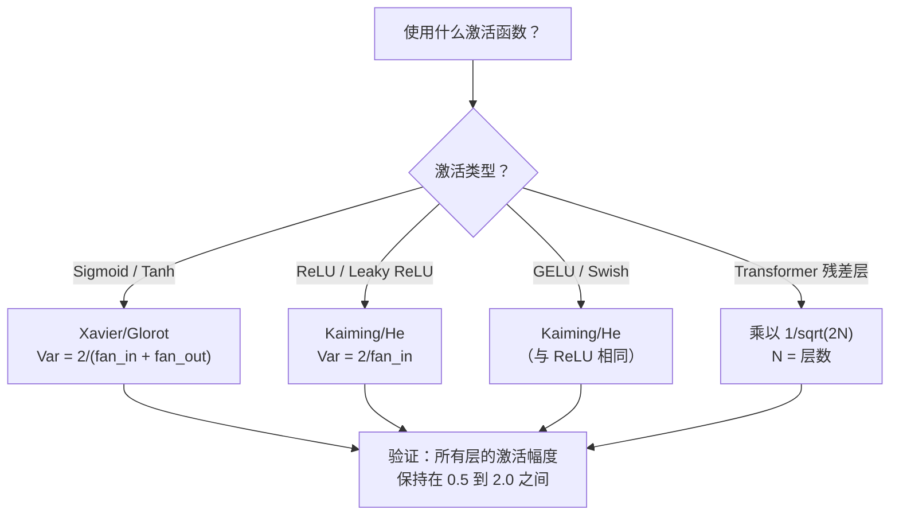

# 权重初始化与训练稳定性

> 初始化错了，训练根本无法开始。初始化对了，50 层网络可以像 3 层一样顺畅训练。

## 核心问题

把所有权重初始化为零。什么都学不到。每个神经元计算相同的函数，收到相同的梯度，以完全相同的方式更新。10000 轮训练之后，你的 512 神经元隐藏层仍然是 512 份同一个神经元的复制品。你为 512 个参数付了钱，得到了 1 个。

把它们初始化得太大。激活值在网络中爆炸。到第 10 层，数值达到 1e15。到第 20 层，溢出到无穷大。梯度在反方向走同样的轨迹。

从标准正态分布随机初始化。3 层可以工作。在 50 层时，信号会坍缩到零或者炸到无穷——取决于随机尺度是略微太小还是略微太大。"能工作"和"坏掉"之间的边界细如刀刃。

权重初始化是深度学习中最被低估的决策。架构能发论文，优化器能写博客，初始化只得到脚注。但搞错了，其他一切都无所谓——你的网络在训练开始前就已经死了。

---

## 对称性问题

一层中的每个神经元结构相同：输入乘以权重，加上偏置，通过激活函数。如果所有权重从同一个值开始（零是极端情况），每个神经元计算相同的输出。反向传播时，每个神经元收到相同的梯度。更新步骤中，每个神经元变化相同的量。

你卡住了。网络有数百个参数，但它们全部同步移动。这叫**对称性（Symmetry）**，随机初始化是打破它的暴力方法。每个神经元从权重空间的不同点出发，所以每个学到不同的特征。

但"随机"还不够——随机性的**尺度**决定网络是否能训练。

---

## 方差在层间的传播

考虑一个有 fan_in 个输入的单层：

```
z = w1*x1 + w2*x2 + ... + w_n*x_n
```

如果每个权重 wi 从方差为 Var(w) 的分布采样，每个输入 xi 方差为 Var(x)，输出方差为：

```
Var(z) = fan_in * Var(w) * Var(x)
```

如果 Var(w) = 1 且 fan_in = 512，输出方差是输入方差的 512 倍。10 层之后：512^10 = 1.2e27。信号爆炸了。

如果 Var(w) = 0.001，输出方差每层缩小 0.001 × 512 = 0.512 倍。10 层之后：0.512^10 = 0.00013。信号消失了。

**目标：选择 Var(w) 使得 Var(z) = Var(x)。** 信号幅度在各层之间保持不变。

---

## Xavier / Glorot 初始化

Glorot 和 Bengio（2010）为 Sigmoid 和 Tanh 激活函数推导出了解决方案。要让前向传播和反向传播中的方差都保持不变：

```
Var(w) = 2 / (fan_in + fan_out)
```

实践中，权重从以下分布采样：

```
w ~ Uniform(-limit, limit)  其中 limit = sqrt(6 / (fan_in + fan_out))
```

或：

```
w ~ Normal(0, sqrt(2 / (fan_in + fan_out)))
```

之所以有效：Sigmoid 和 Tanh 在零附近近似线性，而正确初始化的激活值就住在那个区域。方差在数十层中保持稳定。

---

## Kaiming / He 初始化

ReLU 会杀死一半的输出（所有负值变为零）。有效的 fan_in 减半了，因为平均来说一半的输入被置零。Xavier 初始化没有考虑这一点——它低估了所需的方差。

He 等人（2015）调整了公式：

```
Var(w) = 2 / fan_in
```

权重从以下分布采样：

```
w ~ Normal(0, sqrt(2 / fan_in))
```

系数 2 补偿了 ReLU 置零一半激活值的影响。没有它，信号每层缩小约 0.5 倍。50 层后：0.5^50 = 8.8e-16。Kaiming 初始化防止了这个问题。

---

## Transformer 初始化

GPT-2 引入了一种不同的模式。残差连接把每个子层的输出加到输入上：

```
x = x + sublayer(x)
```

每次相加都会增加方差。N 个残差层之后，方差与 N 成比例增长。GPT-2 把残差层的权重乘以 1/sqrt(2N)，其中 N 是层数。这让累积信号幅度保持稳定。

LLaMA 3（4050 亿参数，126 层）使用类似方案。没有这个缩放，残差流会在 126 层注意力和前馈块中无限增长。

---

## 各初始化策略的对比

```mermaid
flowchart TD
    subgraph "零初始化"
        Z1["第 1 层\n所有权重 = 0"] --> Z2["第 2 层\n所有神经元相同"]
        Z2 --> Z3["第 3 层\n依然相同"]
        Z3 --> ZR["结果：无论宽度多大\n只有 1 个有效神经元"]
    end

    subgraph "Xavier 初始化"
        X1["第 1 层\nVar = 2/(fan_in+fan_out)"] --> X2["第 2 层\n信号稳定"]
        X2 --> X3["第 50 层\n信号稳定"]
        X3 --> XR["结果：与 sigmoid/tanh 配合良好"]
    end

    subgraph "Kaiming 初始化"
        K1["第 1 层\nVar = 2/fan_in"] --> K2["第 2 层\n信号稳定"]
        K2 --> K3["第 50 层\n信号稳定"]
        K3 --> KR["结果：与 ReLU/GELU 配合良好"]
    end
```



---

## 如何选择初始化



---

## 从零实现

### 第一步：四种初始化策略

```python
import math
import random


def zero_init(fan_in, fan_out):
    return [[0.0 for _ in range(fan_in)] for _ in range(fan_out)]


def random_init(fan_in, fan_out, scale=1.0):
    return [[random.gauss(0, scale) for _ in range(fan_in)] for _ in range(fan_out)]


def xavier_init(fan_in, fan_out):
    std = math.sqrt(2.0 / (fan_in + fan_out))
    return [[random.gauss(0, std) for _ in range(fan_in)] for _ in range(fan_out)]


def kaiming_init(fan_in, fan_out):
    # 系数 2 补偿 ReLU 置零一半激活值
    std = math.sqrt(2.0 / fan_in)
    return [[random.gauss(0, std) for _ in range(fan_in)] for _ in range(fan_out)]
```

### 第二步：激活函数

```python
def sigmoid(x):
    x = max(-500, min(500, x))
    return 1.0 / (1.0 + math.exp(-x))


def tanh_act(x):
    return math.tanh(x)


def relu(x):
    return max(0.0, x)
```

### 第三步：穿越 50 层的前向传播

对随机数据做前向传播，测量每层的激活幅度均值：

```python
def forward_deep(init_fn, activation_fn, n_layers=50, width=64, n_samples=100):
    random.seed(42)
    layer_magnitudes = []

    inputs = [[random.gauss(0, 1) for _ in range(width)] for _ in range(n_samples)]

    for layer_idx in range(n_layers):
        weights = init_fn(width, width)
        biases = [0.0] * width

        new_inputs = []
        for sample in inputs:
            output = []
            for neuron_idx in range(width):
                z = sum(weights[neuron_idx][j] * sample[j] for j in range(width)) + biases[neuron_idx]
                output.append(activation_fn(z))
            new_inputs.append(output)
        inputs = new_inputs

        magnitudes = []
        for sample in inputs:
            magnitudes.append(sum(abs(v) for v in sample) / width)
        mean_mag = sum(magnitudes) / len(magnitudes)
        layer_magnitudes.append(mean_mag)

    return layer_magnitudes
```

### 第四步：实验

运行所有组合：零初始化、随机 N(0,1)、随机 N(0,0.01)、Xavier+Sigmoid、Xavier+Tanh、Kaiming+ReLU。打印关键层的幅度。

```python
def run_experiment():
    configs = [
        ("零初始化 + Sigmoid",       lambda fi, fo: zero_init(fi, fo),         sigmoid),
        ("随机 N(0,1) + ReLU",      lambda fi, fo: random_init(fi, fo, 1.0),   relu),
        ("随机 N(0,0.01) + ReLU",   lambda fi, fo: random_init(fi, fo, 0.01),  relu),
        ("Xavier + Sigmoid",         xavier_init,                                sigmoid),
        ("Xavier + Tanh",            xavier_init,                                tanh_act),
        ("Kaiming + ReLU",           kaiming_init,                               relu),
    ]

    print(f"{'策略':<30} {'L1':>10} {'L5':>10} {'L10':>10} {'L25':>10} {'L50':>10}")
    print("-" * 80)

    for name, init_fn, act_fn in configs:
        mags = forward_deep(init_fn, act_fn)
        row = f"{name:<30}"
        for idx in [0, 4, 9, 24, 49]:
            val = mags[idx]
            if val > 1e6:
                row += f" {'已爆炸':>10}"
            elif val < 1e-6:
                row += f" {'已消失':>10}"
            else:
                row += f" {val:>10.4f}"
        print(row)


run_experiment()
```

**预期输出（大致）：**

```
策略                           L1          L5         L10         L25         L50
--------------------------------------------------------------------------------
零初始化 + Sigmoid             0.5000      0.5000      0.5000      0.5000      0.5000
随机 N(0,1) + ReLU             2.3140      已爆炸      已爆炸      已爆炸      已爆炸
随机 N(0,0.01) + ReLU          0.0032      已消失      已消失      已消失      已消失
Xavier + Sigmoid               0.4821      0.4690      0.4560      0.4489      0.4312
Xavier + Tanh                  0.6043      0.6001      0.5987      0.5962      0.5934
Kaiming + ReLU                 0.8921      0.9103      0.8876      0.9012      0.8994
```

零初始化看起来"稳定"但完全没用——所有神经元都被卡在 0.5（Sigmoid 的零点）。Kaiming + ReLU 真正地稳定在合理幅度。

### 第五步：对称性演示

展示零初始化如何产生完全相同的神经元：

```python
def symmetry_demo():
    random.seed(42)
    weights = zero_init(2, 4)
    biases = [0.0] * 4

    inputs = [0.5, -0.3]
    outputs = []
    for neuron_idx in range(4):
        z = sum(weights[neuron_idx][j] * inputs[j] for j in range(2)) + biases[neuron_idx]
        outputs.append(sigmoid(z))

    print("\n对称性演示（4个神经元，零初始化）：")
    for i, out in enumerate(outputs):
        print(f"  神经元 {i}: 输出 = {out:.6f}")
    all_same = all(abs(outputs[i] - outputs[0]) < 1e-10 for i in range(len(outputs)))
    print(f"  全部相同: {all_same}")
    print(f"  有效参数数: 1（而不是 {len(weights) * len(weights[0])}）")


symmetry_demo()
```

### 第六步：逐层幅度报告

```python
def magnitude_report(name, magnitudes):
    print(f"\n{name}:")
    for i, mag in enumerate(magnitudes):
        if i % 5 == 0 or i == len(magnitudes) - 1:
            if mag > 1e6:
                bar = "X" * 50 + " 已爆炸"
            elif mag < 1e-6:
                bar = "." + " 已消失"
            else:
                bar_len = min(50, max(1, int(mag * 10)))
                bar = "#" * bar_len
            print(f"  第 {i+1:3d} 层: {bar} ({mag:.6f})")
```

---

## 用 PyTorch 实现

PyTorch 内置了这些初始化函数：

```python
import torch
import torch.nn as nn

layer = nn.Linear(512, 256)

nn.init.xavier_uniform_(layer.weight)
nn.init.xavier_normal_(layer.weight)

nn.init.kaiming_uniform_(layer.weight, nonlinearity='relu')
nn.init.kaiming_normal_(layer.weight, nonlinearity='relu')

nn.init.zeros_(layer.bias)
```

调用 `nn.Linear(512, 256)` 时，PyTorch 默认使用 Kaiming 均匀初始化。这就是为什么大多数简单网络"直接能用"——PyTorch 已经做了正确的选择。但当你构建自定义架构或层数超过 20 层时，你需要理解这些背后的原理，并可能需要覆盖默认值。

对于 Transformer，HuggingFace 模型通常在 `_init_weights` 方法中处理初始化。GPT-2 的实现把残差投影缩小 1/sqrt(N)。如果你从零构建 Transformer，需要自己添加这部分。

---

## 关键术语

| 术语 | 英文 | 含义 |
|------|------|------|
| 权重初始化 | Weight Initialization | 选择初始权重值的策略，决定网络是否能够训练 |
| 对称性破坏 | Symmetry Breaking | 用随机初始化确保神经元学到不同特征，而不是计算相同函数 |
| 输入数（fan-in） | Fan-in | 进入一个神经元的连接数，决定加权和中输入方差如何累积 |
| 输出数（fan-out） | Fan-out | 从一个神经元出去的连接数，影响反向传播中梯度方差的维持 |
| Xavier/Glorot 初始化 | Xavier/Glorot Init | Var(w) = 2/(fan_in + fan_out)，为 Sigmoid 和 Tanh 设计 |
| Kaiming/He 初始化 | Kaiming/He Init | Var(w) = 2/fan_in，考虑了 ReLU 置零一半激活值 |
| 方差传播 | Variance Propagation | 基于权重尺度分析激活方差如何逐层变化 |
| 残差缩放 | Residual Scaling | 将残差连接权重乘以 1/sqrt(2N)，防止方差随 N 层增长 |
| 死亡网络 | Dead Network | 初始化不当导致所有梯度为零或所有激活饱和的网络 |
| 激活值爆炸 | Exploding Activations | 权重方差过高，导致激活幅度在层间指数增长 |
