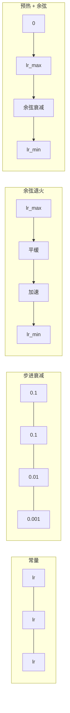
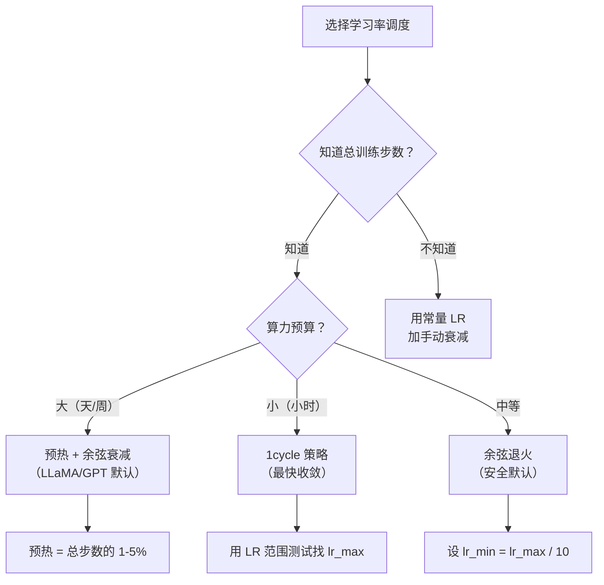

# 学习率调度与预热

> 学习率是最重要的单个超参数。不是架构，不是数据集大小，不是激活函数。就是学习率。如果你只调一个参数，调这个。

## 核心问题

把学习率设为 0.1——训练发散，3 步内损失跳到无穷大。设为 0.0001——训练爬行，100 轮之后模型几乎没有从随机初始化处移动。设为 0.01——训练 50 轮运行良好，然后损失在某个极小值附近震荡，因为步长太大永远无法真正到达那里。

**最优学习率不是常数。它在训练过程中会变化。** 早期你想要大步长快速覆盖地形。训练末期你想要小步长精确落入锐利的极小值。一个 90% 准确率模型和一个 95% 准确率模型之间的差距，往往只是调度策略。

过去三年发表的每个主要模型都使用了学习率调度。LLaMA 3 使用峰值 lr=3e-4，2000 步预热，余弦衰减到 3e-5。GPT-3 使用 lr=6e-4，在 3.75 亿个 token 上预热。这些不是随意的选择——它们是代价数百万美元的超参数搜索的结果。

---

## 常量学习率

最简单的方法。选一个数，每步都用它。

```
lr(t) = lr_0
```

几乎不是最优解。对训练末期太大（在极小值附近震荡），或对训练初期太小（在微小步长上浪费算力）。对小模型和调试很好用。对训练超过一小时的任何东西来说都是糟糕的选择。

---

## 步进衰减（Step Decay）

ResNet 时代的经典方法。在固定的轮数切割学习率（通常 10 倍）。

```
lr(t) = lr_0 * gamma^(floor(epoch / step_size))
```

gamma = 0.1，step_size = 30 的意思是：每 30 轮学习率下降 10 倍。ResNet-50 就用这个——lr=0.1，在第 30、60、90 轮各下降 10 倍。

问题：最优衰减点取决于数据集和架构。换到不同问题就需要重新调整何时下降。过渡是突然的——学习率突然变化时损失可能出现尖峰。

---

## 余弦退火（Cosine Annealing）

从最大学习率平滑衰减到最小值，沿余弦曲线：

```
lr(t) = lr_min + 0.5 * (lr_max - lr_min) * (1 + cos(π * t / T))
```

其中 t 是当前步，T 是总步数。

t=0 时，余弦项为 1，lr = lr_max。t=T 时，余弦项为 -1，lr = lr_min。衰减开始时平缓，中间加速，接近结束时再次平缓。

**这是大多数现代训练运行的默认选择。** 除了 lr_max 和 lr_min 之外没有其他超参数需要调。余弦形状与经验观察相符——大多数学习发生在训练中期，那时你希望有合理的步长。

---

## 预热（Warmup）：为什么从小学习率开始

Adam 等自适应优化器维护梯度均值和方差的运行估计。第 0 步时，这些估计初始化为零。最初几次梯度更新基于的是垃圾统计量。如果此时学习率很大，模型会走出巨大的、方向错误的步。

预热修复了这个问题。从极小的学习率开始（通常是 lr_max / warmup_steps 甚至是零），在前 N 步线性增长到 lr_max。到你到达完整学习率时，Adam 的统计量已经稳定。

```
lr(t) = lr_max * (t / warmup_steps)     当 t < warmup_steps 时
```

典型预热：总训练步数的 1-5%。LLaMA 3 训练了约 1.8 万亿个 token，预热了 2000 步。GPT-3 在 3.75 亿个 token 上预热。

---

## 线性预热 + 余弦衰减

现代默认方案。线性增长，然后余弦衰减：

```
如果 t < warmup_steps:
    lr(t) = lr_max * (t / warmup_steps)
否则:
    progress = (t - warmup_steps) / (total_steps - warmup_steps)
    lr(t) = lr_min + 0.5 * (lr_max - lr_min) * (1 + cos(π * progress))
```

这是 LLaMA、GPT、PaLM 以及大多数现代 Transformer 使用的方案。预热防止早期不稳定；余弦衰减让模型沉入好的极小值。

---

## 1cycle 策略

Leslie Smith 的发现（2018）：在训练前半段把学习率从低值增加到高值，然后在后半段再降回去。反直觉——为什么要在训练中途**增加**学习率？

理论：高学习率通过在优化轨迹中加入噪声来充当正则化。模型在增加阶段探索更多的损失曲面，找到更好的盆地。减少阶段再在找到的最佳盆地中精细调整。

```
阶段 1（0 到 T/2）：    lr 从 lr_max/25 增加到 lr_max
阶段 2（T/2 到 T）：    lr 从 lr_max 减少到 lr_max/10000
```

在固定算力预算下，1cycle 通常比余弦退火训练更快。代价：你必须提前知道总步数。

---

## 调度形状



---

## 如何选择调度



---

## 已发布模型的真实参数

| 模型 | 峰值学习率 | 预热 | 调度 |
|------|----------|------|------|
| LLaMA 3 (4050亿参数) | 3e-4 | 2000 步 | 余弦衰减到 3e-5 |
| GPT-3 (1750亿参数) | 6e-4 | 3.75亿 token | 余弦衰减到 0 |
| ResNet-50 | 0.1 | 无 | 步进衰减，第30/60/90轮×0.1 |
| BERT (3.4亿参数) | 1e-4 | 10000 步 | 线性衰减 |

---

## 从零实现

### 第一步：调度函数

每个函数接收当前步数，返回该步的学习率：

```python
import math


def constant_schedule(step, lr=0.01, **kwargs):
    return lr


def step_decay_schedule(step, lr=0.1, step_size=100, gamma=0.1, **kwargs):
    return lr * (gamma ** (step // step_size))


def cosine_schedule(step, lr=0.01, total_steps=1000, lr_min=1e-5, **kwargs):
    if step >= total_steps:
        return lr_min
    return lr_min + 0.5 * (lr - lr_min) * (1 + math.cos(math.pi * step / total_steps))


def warmup_cosine_schedule(step, lr=0.01, total_steps=1000, warmup_steps=100, lr_min=1e-5, **kwargs):
    if total_steps <= warmup_steps:
        return lr * (step / max(warmup_steps, 1))
    if step < warmup_steps:
        return lr * step / warmup_steps
    progress = (step - warmup_steps) / (total_steps - warmup_steps)
    return lr_min + 0.5 * (lr - lr_min) * (1 + math.cos(math.pi * progress))


def one_cycle_schedule(step, lr=0.01, total_steps=1000, **kwargs):
    mid = max(total_steps // 2, 1)
    if step < mid:
        return (lr / 25) + (lr - lr / 25) * step / mid
    else:
        progress = (step - mid) / max(total_steps - mid, 1)
        return lr * (1 - progress) + (lr / 10000) * progress
```

### 第二步：可视化所有调度

打印每个调度随训练的变化：

```python
def visualize_schedule(name, schedule_fn, total_steps=500, **kwargs):
    steps = list(range(0, total_steps, total_steps // 20))
    if total_steps - 1 not in steps:
        steps.append(total_steps - 1)

    lrs = [schedule_fn(s, total_steps=total_steps, **kwargs) for s in steps]
    max_lr = max(lrs) if max(lrs) > 0 else 1.0

    print(f"\n{name}:")
    for s, lr_val in zip(steps, lrs):
        bar_len = int(lr_val / max_lr * 40)
        bar = "#" * bar_len
        print(f"  步骤 {s:4d}: lr={lr_val:.6f} {bar}")
```

### 第三步：训练网络

```python
import random


def sigmoid(x):
    x = max(-500, min(500, x))
    return 1.0 / (1.0 + math.exp(-x))


def relu(x):
    return max(0.0, x)


def relu_deriv(x):
    return 1.0 if x > 0 else 0.0


def make_circle_data(n=200, seed=42):
    random.seed(seed)
    data = []
    for _ in range(n):
        x = random.uniform(-2, 2)
        y = random.uniform(-2, 2)
        label = 1.0 if x * x + y * y < 1.5 else 0.0
        data.append(([x, y], label))
    return data


def train_with_schedule(schedule_fn, schedule_name, data, epochs=300, base_lr=0.05, **kwargs):
    random.seed(0)
    hidden_size = 8
    total_steps = epochs * len(data)

    std = math.sqrt(2.0 / 2)
    w1 = [[random.gauss(0, std) for _ in range(2)] for _ in range(hidden_size)]
    b1 = [0.0] * hidden_size
    w2 = [random.gauss(0, std) for _ in range(hidden_size)]
    b2 = 0.0

    step = 0
    epoch_losses = []

    for epoch in range(epochs):
        total_loss = 0
        correct = 0

        for x, target in data:
            lr = schedule_fn(step, lr=base_lr, total_steps=total_steps, **kwargs)

            z1 = []
            h = []
            for i in range(hidden_size):
                z = w1[i][0] * x[0] + w1[i][1] * x[1] + b1[i]
                z1.append(z)
                h.append(relu(z))

            z2 = sum(w2[i] * h[i] for i in range(hidden_size)) + b2
            out = sigmoid(z2)

            error = out - target
            d_out = error * out * (1 - out)

            for i in range(hidden_size):
                d_h = d_out * w2[i] * relu_deriv(z1[i])
                w2[i] -= lr * d_out * h[i]
                for j in range(2):
                    w1[i][j] -= lr * d_h * x[j]
                b1[i] -= lr * d_h
            b2 -= lr * d_out

            total_loss += (out - target) ** 2
            if (out >= 0.5) == (target >= 0.5):
                correct += 1
            step += 1

        avg_loss = total_loss / len(data)
        accuracy = correct / len(data) * 100
        epoch_losses.append(avg_loss)

    return epoch_losses
```

### 第四步：对比所有调度

```python
def compare_schedules(data):
    configs = [
        ("常量", constant_schedule, {}),
        ("步进衰减", step_decay_schedule, {"step_size": 15000, "gamma": 0.1}),
        ("余弦退火", cosine_schedule, {"lr_min": 1e-5}),
        ("预热+余弦", warmup_cosine_schedule, {"warmup_steps": 3000, "lr_min": 1e-5}),
        ("1cycle", one_cycle_schedule, {}),
    ]

    print(f"\n{'调度策略':<20} {'初始损失':>12} {'中间损失':>12} {'最终损失':>12} {'最佳损失':>12}")
    print("-" * 70)

    for name, schedule_fn, extra_kwargs in configs:
        losses = train_with_schedule(schedule_fn, name, data, epochs=300, base_lr=0.05, **extra_kwargs)
        mid_idx = len(losses) // 2
        best = min(losses)
        print(f"{name:<20} {losses[0]:>12.6f} {losses[mid_idx]:>12.6f} {losses[-1]:>12.6f} {best:>12.6f}")
```

### 第五步：学习率太高 vs 太低

演示三种失败模式：太高（发散）、太低（爬行）、合适：

```python
def lr_sensitivity(data):
    learning_rates = [1.0, 0.1, 0.01, 0.001, 0.0001]

    print("\n学习率敏感性（常量调度，100轮）：")
    print(f"  {'学习率':>10} {'初始损失':>12} {'最终损失':>12} {'状态':>15}")
    print("  " + "-" * 52)

    for lr in learning_rates:
        losses = train_with_schedule(constant_schedule, f"lr={lr}", data, epochs=100, base_lr=lr)
        start = losses[0]
        end = losses[-1]

        if end > start or math.isnan(end) or end > 1.0:
            status = "发散"
        elif end > start * 0.9:
            status = "几乎不动"
        elif end < 0.15:
            status = "收敛"
        else:
            status = "学习中"

        end_str = f"{end:.6f}" if not math.isnan(end) else "NaN"
        print(f"  {lr:>10.4f} {start:>12.6f} {end_str:>12} {status:>15}")


# 运行所有实验
data = make_circle_data()

print("=== 各调度策略可视化 ===")
visualize_schedule("余弦退火", cosine_schedule, total_steps=500, lr=0.05, lr_min=1e-5)
visualize_schedule("预热+余弦", warmup_cosine_schedule, total_steps=500, lr=0.05,
                   warmup_steps=50, lr_min=1e-5)

print("\n=== 各调度策略对比训练 ===")
compare_schedules(data)

print("\n=== 学习率敏感性 ===")
lr_sensitivity(data)
```

---

## 用 PyTorch 实现

PyTorch 在 `torch.optim.lr_scheduler` 中提供了调度器：

```python
import torch
import torch.optim as optim
from torch.optim.lr_scheduler import CosineAnnealingLR, OneCycleLR, StepLR

model = torch.nn.Sequential(torch.nn.Linear(10, 64), torch.nn.ReLU(), torch.nn.Linear(64, 1))
optimizer = optim.Adam(model.parameters(), lr=3e-4)

scheduler = CosineAnnealingLR(optimizer, T_max=1000, eta_min=1e-5)

for step in range(1000):
    loss = train_step(model, optimizer)
    scheduler.step()
```

对于预热 + 余弦，使用 HuggingFace 的 `get_cosine_schedule_with_warmup`：

```python
from transformers import get_cosine_schedule_with_warmup

scheduler = get_cosine_schedule_with_warmup(
    optimizer,
    num_warmup_steps=2000,
    num_training_steps=100000,
)
```

这个函数是大多数 LLaMA 和 GPT 微调脚本使用的。有疑问时，用预热 + 余弦，预热设为总步数的 3-5%。它适用于几乎所有情况。

---

## 关键术语

| 术语 | 英文 | 含义 |
|------|------|------|
| 学习率 | Learning Rate | 乘以梯度来决定参数更新大小的标量 |
| 调度 | Schedule | 将训练步数映射到学习率的函数，旨在优化收敛 |
| 预热 | Warmup | 在前 N 步将学习率从接近零线性增加到目标值，稳定优化器统计量 |
| 余弦退火 | Cosine Annealing | 沿余弦曲线从 lr_max 平滑衰减到 lr_min |
| 步进衰减 | Step Decay | 在固定轮数间隔处将学习率乘以一个因子（通常 0.1） |
| 1cycle 策略 | 1cycle Policy | Leslie Smith 的方法：先增后减，单周期内快速收敛 |
| LR 范围测试 | LR Range Test | 逐步增大学习率训练，找到损失开始发散前的最大值 |
| 余弦热重启 | Cosine with Warm Restarts | 周期性将学习率重置为 lr_max 再衰减（SGDR） |
| 最小学习率 | Eta min | 调度衰减到的学习率下限 |
| 峰值学习率 | Peak Learning Rate | 训练中达到的最大学习率，通常在预热结束后 |
