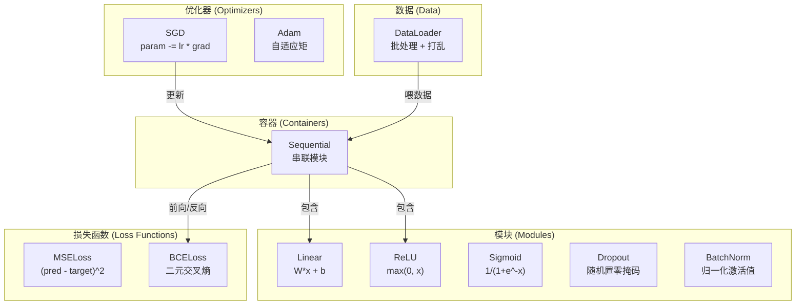
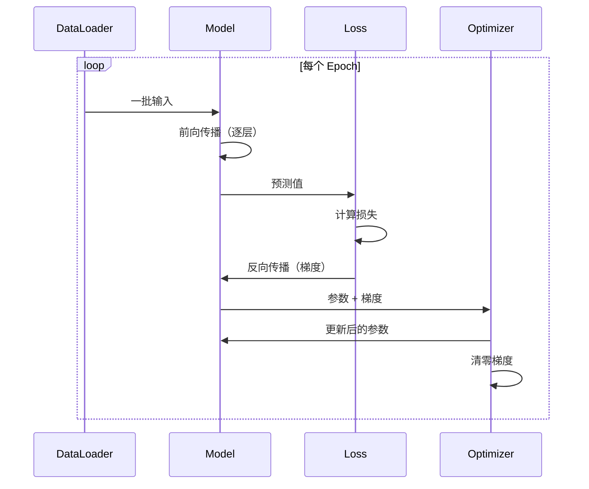

# 构建你自己的迷你框架

> 你已经构建了神经元、层、网络、反向传播、激活函数、损失函数、优化器、正则化、初始化和学习率调度——都是分开的零件。现在把它们组装成一个框架。不是 PyTorch，不是 TensorFlow，是**你自己的**。

## 核心问题

你有来自十个章节的积木，散落在各个文件里。这里有个 `Value` 类，那里有个训练循环，另一个文件里是权重初始化，还有一个文件里是学习率调度。要训练一个网络，你需要从五个不同章节复制粘贴，然后手工把它们连在一起。

这就是框架要解决的问题。PyTorch 给你 `nn.Module`、`nn.Sequential`、`optim.Adam`、`DataLoader` 和一个把它们串起来的训练循环模式。TensorFlow 给你 `keras.Layer`、`keras.Sequential`、`keras.optimizers.Adam`。这些不是魔法——它们是组织模式，使得定义、训练和评估网络成为可能，而无需每次都重新发明管道。

你将用约 500 行 Python 构建同样的东西。不用 numpy，不用外部依赖。一个可以定义任意前馈网络、用 SGD 或 Adam 训练、批处理数据、应用 Dropout 和批归一化、使用任意激活函数、调度学习率的框架。

完成之后，你将精确理解在 PyTorch 中写 `model = nn.Sequential(...)` 时发生了什么。你将理解为什么 `model.train()` 和 `model.eval()` 存在，为什么 `optimizer.zero_grad()` 是单独的调用。你懂得这一切，因为你构建了这一切。

---

## 核心概念

### Module 抽象

PyTorch 中每一层都继承自 `nn.Module`。一个 Module 有三个职责：

1. **forward()** — 计算给定输入的输出
2. **parameters()** — 返回所有可训练权重
3. **backward()** — 计算梯度（PyTorch 中由自动微分处理，在我们的框架中手动实现）

线性层是 Module，ReLU 激活是 Module，Dropout 层是 Module，批归一化层是 Module。它们都有相同的接口。

### Sequential 容器

`nn.Sequential` 把 Module 串联起来。前向传播：数据经过 Module 1 → Module 2 → Module 3。反向传播：反向经过该链。容器本身也是 Module——它有 forward()、parameters() 和 backward()。这是**组合模式（Composite Pattern）**：一组 Module 的序列本身也是一个 Module。

### 训练模式与评估模式

Dropout 在训练时随机置零神经元，但在评估时直通所有输入。批归一化在训练时用批统计量，在评估时用运行均值。`train()` 和 `eval()` 方法切换这个行为。每个 Module 都有一个 `training` 标志。

### 优化器

优化器用参数的梯度来更新参数。SGD: `param -= lr * grad`。Adam: 维护动量和方差估计，然后更新。优化器不了解网络架构——它只看到参数和梯度的平坦列表。

### DataLoader

批处理重要的原因有两个：第一，大问题无法把整个数据集装入内存；第二，小批量梯度下降提供的噪声有助于逃离局部极小值。DataLoader 把数据分成批次，并可以在每个 epoch 之间打乱顺序。

---

## 框架架构



---

## 训练循环



---

## 从零实现

### 第一步：Module 基类

每个层实现的抽象接口：

```python
class Module:
    def __init__(self):
        self.training = True

    def forward(self, x):
        raise NotImplementedError

    def backward(self, grad):
        raise NotImplementedError

    def parameters(self):
        return []

    def train(self):
        self.training = True

    def eval(self):
        self.training = False
```

### 第二步：Linear 层

基本构建块。存储权重和偏置，前向计算 Wx + b，反向计算权重梯度和输入梯度。

```python
import math
import random


class Linear(Module):
    def __init__(self, fan_in, fan_out):
        super().__init__()
        # Kaiming 初始化
        std = math.sqrt(2.0 / fan_in)
        self.weights = [[random.gauss(0, std) for _ in range(fan_in)] for _ in range(fan_out)]
        self.biases = [0.0] * fan_out
        self.weight_grads = [[0.0] * fan_in for _ in range(fan_out)]
        self.bias_grads = [0.0] * fan_out
        self.fan_in = fan_in
        self.fan_out = fan_out
        self.input = None

    def forward(self, x):
        self.input = x
        output = []
        for i in range(self.fan_out):
            val = self.biases[i]
            for j in range(self.fan_in):
                val += self.weights[i][j] * x[j]
            output.append(val)
        return output

    def backward(self, grad):
        input_grad = [0.0] * self.fan_in
        for i in range(self.fan_out):
            self.bias_grads[i] += grad[i]
            for j in range(self.fan_in):
                self.weight_grads[i][j] += grad[i] * self.input[j]
                input_grad[j] += grad[i] * self.weights[i][j]
        return input_grad

    def parameters(self):
        params = []
        for i in range(self.fan_out):
            for j in range(self.fan_in):
                params.append((self.weights, i, j, self.weight_grads))
            params.append((self.biases, i, None, self.bias_grads))
        return params
```

### 第三步：激活函数模块

ReLU、Sigmoid 和 Tanh 作为 Module。每个都缓存反向传播所需的中间值。

```python
class ReLU(Module):
    def __init__(self):
        super().__init__()
        self.mask = None

    def forward(self, x):
        self.mask = [1.0 if v > 0 else 0.0 for v in x]
        return [max(0.0, v) for v in x]

    def backward(self, grad):
        return [g * m for g, m in zip(grad, self.mask)]


class Sigmoid(Module):
    def __init__(self):
        super().__init__()
        self.output = None

    def forward(self, x):
        self.output = []
        for v in x:
            v = max(-500, min(500, v))
            self.output.append(1.0 / (1.0 + math.exp(-v)))
        return self.output

    def backward(self, grad):
        return [g * o * (1 - o) for g, o in zip(grad, self.output)]


class Tanh(Module):
    def __init__(self):
        super().__init__()
        self.output = None

    def forward(self, x):
        self.output = [math.tanh(v) for v in x]
        return self.output

    def backward(self, grad):
        return [g * (1 - o * o) for g, o in zip(grad, self.output)]
```

### 第四步：Dropout 模块

训练时随机置零元素。把剩余元素缩放 1/(1-p) 使期望值不变。评估时直通。

```python
class Dropout(Module):
    def __init__(self, p=0.5):
        super().__init__()
        self.p = p
        self.mask = None

    def forward(self, x):
        if not self.training:
            return x
        # 倒置 Dropout：训练时缩放，测试时不需要处理
        self.mask = [0.0 if random.random() < self.p else 1.0 / (1 - self.p) for _ in x]
        return [v * m for v, m in zip(x, self.mask)]

    def backward(self, grad):
        if self.mask is None:
            return grad
        return [g * m for g, m in zip(grad, self.mask)]
```

### 第五步：BatchNorm 模块

```python
class BatchNorm(Module):
    def __init__(self, size, momentum=0.1, eps=1e-5):
        super().__init__()
        self.size = size
        self.gamma = [1.0] * size
        self.beta = [0.0] * size
        self.gamma_grads = [0.0] * size
        self.beta_grads = [0.0] * size
        self.running_mean = [0.0] * size
        self.running_var = [1.0] * size
        self.momentum = momentum
        self.eps = eps
        self.x_norm = None
        self.std_inv = None

    def forward_batch(self, batch):
        batch_size = len(batch)
        output_batch = []

        if self.training:
            mean = [sum(s[j] for s in batch) / batch_size for j in range(self.size)]
            var = [sum((s[j] - mean[j]) ** 2 for s in batch) / batch_size for j in range(self.size)]
            self.std_inv = [1.0 / math.sqrt(v + self.eps) for v in var]

            self.x_norm = []
            for sample in batch:
                normed = [(sample[j] - mean[j]) * self.std_inv[j] for j in range(self.size)]
                self.x_norm.append(normed)
                output_batch.append([self.gamma[j] * normed[j] + self.beta[j] for j in range(self.size)])

            for j in range(self.size):
                self.running_mean[j] = (1 - self.momentum) * self.running_mean[j] + self.momentum * mean[j]
                self.running_var[j] = (1 - self.momentum) * self.running_var[j] + self.momentum * var[j]
        else:
            std_inv = [1.0 / math.sqrt(v + self.eps) for v in self.running_var]
            for sample in batch:
                normed = [(sample[j] - self.running_mean[j]) * std_inv[j] for j in range(self.size)]
                output_batch.append([self.gamma[j] * normed[j] + self.beta[j] for j in range(self.size)])

        return output_batch

    def forward(self, x):
        return self.forward_batch([x])[0]

    def backward(self, grad):
        if self.x_norm is None:
            return grad
        for j in range(self.size):
            self.gamma_grads[j] += self.x_norm[0][j] * grad[j]
            self.beta_grads[j] += grad[j]
        return [grad[j] * self.gamma[j] * self.std_inv[j] for j in range(self.size)]

    def parameters(self):
        params = []
        for j in range(self.size):
            params.append((self.gamma, j, None, self.gamma_grads))
            params.append((self.beta, j, None, self.beta_grads))
        return params
```

### 第六步：Sequential 容器

串联模块。前向传播从左到右，反向传播从右到左。

```python
class Sequential(Module):
    def __init__(self, *modules):
        super().__init__()
        self.modules = list(modules)

    def forward(self, x):
        for module in self.modules:
            x = module.forward(x)
        return x

    def backward(self, grad):
        for module in reversed(self.modules):
            grad = module.backward(grad)
        return grad

    def parameters(self):
        params = []
        for module in self.modules:
            params.extend(module.parameters())
        return params

    def train(self):
        self.training = True
        for module in self.modules:
            module.train()

    def eval(self):
        self.training = False
        for module in self.modules:
            module.eval()
```

### 第七步：损失函数

MSE 和二元交叉熵。每个都返回损失值，并提供 backward() 返回梯度。

```python
class MSELoss:
    def __call__(self, predicted, target):
        self.predicted = predicted
        self.target = target
        n = len(predicted)
        self.loss = sum((p - t) ** 2 for p, t in zip(predicted, target)) / n
        return self.loss

    def backward(self):
        n = len(self.predicted)
        return [2 * (p - t) / n for p, t in zip(self.predicted, self.target)]


class BCELoss:
    def __call__(self, predicted, target):
        self.predicted = predicted
        self.target = target
        eps = 1e-7
        n = len(predicted)
        self.loss = 0
        for p, t in zip(predicted, target):
            p = max(eps, min(1 - eps, p))
            self.loss += -(t * math.log(p) + (1 - t) * math.log(1 - p))
        self.loss /= n
        return self.loss

    def backward(self):
        eps = 1e-7
        n = len(self.predicted)
        grads = []
        for p, t in zip(self.predicted, self.target):
            p = max(eps, min(1 - eps, p))
            grads.append((-t / p + (1 - t) / (1 - p)) / n)
        return grads
```

### 第八步：SGD 和 Adam 优化器

```python
class SGD:
    def __init__(self, parameters, lr=0.01):
        self.params = parameters
        self.lr = lr

    def step(self):
        for container, i, j, grad_container in self.params:
            if j is not None:
                container[i][j] -= self.lr * grad_container[i][j]
            else:
                container[i] -= self.lr * grad_container[i]

    def zero_grad(self):
        for container, i, j, grad_container in self.params:
            if j is not None:
                grad_container[i][j] = 0.0
            else:
                grad_container[i] = 0.0


class Adam:
    def __init__(self, parameters, lr=0.001, beta1=0.9, beta2=0.999, eps=1e-8):
        self.params = parameters
        self.lr = lr
        self.beta1 = beta1
        self.beta2 = beta2
        self.eps = eps
        self.t = 0
        self.m = [0.0] * len(parameters)
        self.v = [0.0] * len(parameters)

    def step(self):
        self.t += 1
        for idx, (container, i, j, grad_container) in enumerate(self.params):
            g = grad_container[i][j] if j is not None else grad_container[i]

            self.m[idx] = self.beta1 * self.m[idx] + (1 - self.beta1) * g
            self.v[idx] = self.beta2 * self.v[idx] + (1 - self.beta2) * g * g

            m_hat = self.m[idx] / (1 - self.beta1 ** self.t)
            v_hat = self.v[idx] / (1 - self.beta2 ** self.t)
            update = self.lr * m_hat / (math.sqrt(v_hat) + self.eps)

            if j is not None:
                container[i][j] -= update
            else:
                container[i] -= update

    def zero_grad(self):
        for container, i, j, grad_container in self.params:
            if j is not None:
                grad_container[i][j] = 0.0
            else:
                grad_container[i] = 0.0
```

### 第九步：DataLoader

把数据分成批次，可以在每个 epoch 打乱。

```python
class DataLoader:
    def __init__(self, data, batch_size=32, shuffle=True):
        self.data = data
        self.batch_size = batch_size
        self.shuffle = shuffle

    def __iter__(self):
        indices = list(range(len(self.data)))
        if self.shuffle:
            random.shuffle(indices)
        for start in range(0, len(indices), self.batch_size):
            batch_indices = indices[start:start + self.batch_size]
            batch = [self.data[i] for i in batch_indices]
            inputs = [item[0] for item in batch]
            targets = [item[1] for item in batch]
            yield inputs, targets

    def __len__(self):
        return (len(self.data) + self.batch_size - 1) // self.batch_size
```

### 第十步：用 4 层网络训练圆形分类

把所有东西串起来。定义模型，选择损失函数，选择优化器，运行训练循环。

```python
def make_circle_data(n=500, seed=42):
    random.seed(seed)
    data = []
    for _ in range(n):
        x = random.uniform(-2, 2)
        y = random.uniform(-2, 2)
        label = 1.0 if x * x + y * y < 1.5 else 0.0
        data.append(([x, y], [label]))
    return data


def train():
    random.seed(42)

    model = Sequential(
        Linear(2, 16),
        ReLU(),
        Linear(16, 16),
        ReLU(),
        Linear(16, 8),
        ReLU(),
        Linear(8, 1),
        Sigmoid(),
    )

    criterion = BCELoss()
    optimizer = Adam(model.parameters(), lr=0.01)

    data = make_circle_data(500)
    split = int(len(data) * 0.8)
    train_data = data[:split]
    test_data = data[split:]

    loader = DataLoader(train_data, batch_size=16, shuffle=True)

    model.train()

    for epoch in range(100):
        total_loss = 0
        total_correct = 0
        total_samples = 0

        for batch_inputs, batch_targets in loader:
            for x, t in zip(batch_inputs, batch_targets):
                pred = model.forward(x)
                loss = criterion(pred, t)
                total_loss += loss

                optimizer.zero_grad()
                grad = criterion.backward()
                model.backward(grad)
                optimizer.step()

                predicted_class = 1.0 if pred[0] >= 0.5 else 0.0
                if predicted_class == t[0]:
                    total_correct += 1
                total_samples += 1

        avg_loss = total_loss / total_samples
        accuracy = total_correct / total_samples * 100

        if epoch % 10 == 0 or epoch == 99:
            print(f"第 {epoch:3d} 轮 | 损失: {avg_loss:.6f} | 训练准确率: {accuracy:.1f}%")

    model.eval()
    correct = 0
    for x, t in test_data:
        pred = model.forward(x)
        predicted_class = 1.0 if pred[0] >= 0.5 else 0.0
        if predicted_class == t[0]:
            correct += 1
    test_accuracy = correct / len(test_data) * 100
    print(f"\n测试准确率: {test_accuracy:.1f}% ({correct}/{len(test_data)})")

    return model, test_accuracy


train()
```

---

## 与 PyTorch 对比

这是你刚才构建的 PyTorch 等价代码：

```python
import torch
import torch.nn as nn
from torch.utils.data import DataLoader, TensorDataset

model = nn.Sequential(
    nn.Linear(2, 16),
    nn.ReLU(),
    nn.Linear(16, 16),
    nn.ReLU(),
    nn.Linear(16, 8),
    nn.ReLU(),
    nn.Linear(8, 1),
    nn.Sigmoid(),
)

criterion = nn.BCELoss()
optimizer = torch.optim.Adam(model.parameters(), lr=0.01)

for epoch in range(100):
    model.train()
    for inputs, targets in dataloader:
        optimizer.zero_grad()
        predictions = model(inputs)
        loss = criterion(predictions, targets)
        loss.backward()
        optimizer.step()

    model.eval()
    with torch.no_grad():
        test_predictions = model(test_inputs)
```

结构完全一样。`Sequential`、`Linear`、`ReLU`、`Sigmoid`、`BCELoss`、`Adam`、`zero_grad`、`backward`、`step`、`train`、`eval`——每个概念都一一对应。

区别在于：PyTorch 自动处理自动微分（不需要在每个模块里手写 backward()），能在 GPU 上运行，并经过多年优化。但骨架是相同的。

现在你看到 PyTorch 代码时，你清楚地知道每一行在做什么。这种理解就是整个练习的意义。

---

## 关键术语

| 术语 | 英文 | 含义 |
|------|------|------|
| 模块 | Module | 框架中的基本抽象——任何有 forward()、backward() 和 parameters() 的东西 |
| Sequential | Sequential | 串联模块的容器；前向顺序执行，反向逆序执行 |
| 前向传播 | Forward Pass | 通过依次经过每个模块计算输出 |
| 反向传播 | Backward Pass | 反向传播损失梯度，计算参数梯度 |
| 参数 | Parameters | 网络中所有优化器可以更新的值——权重和偏置 |
| 优化器 | Optimizer | 用梯度更新参数的算法；实现 SGD、Adam 等规则 |
| DataLoader | DataLoader | 把数据集分成批次的迭代器，可在 epoch 间打乱顺序 |
| 训练模式 | Training Mode | 启用 Dropout 等随机行为和使用批统计量的 BatchNorm 的标志 |
| 评估模式 | Evaluation Mode | 禁用 Dropout 并让 BatchNorm 使用运行统计量的标志 |
| 清零梯度 | Zero Grad | 在计算下一批梯度之前将所有参数梯度重置为零 |
