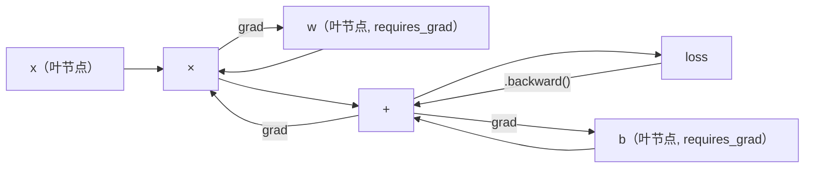
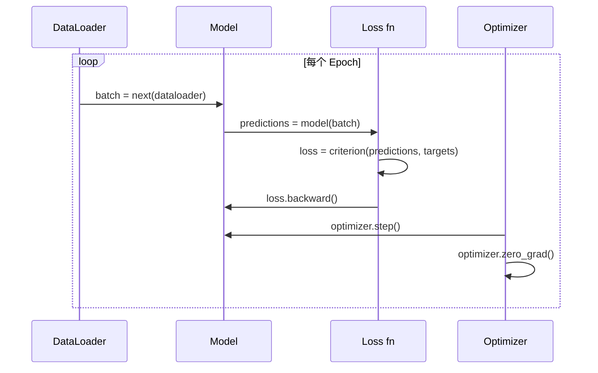

# PyTorch 入门

> 你用活塞和曲轴造了发动机。现在学习大家实际开的那辆车。

## 核心问题

你有一个能工作的迷你框架：Linear 层、ReLU、Dropout、批归一化、Adam、DataLoader、训练循环。它用纯 Python 训练一个 4 层网络做圆形分类。

它也比 PyTorch 慢 500 倍。

你的迷你框架用嵌套的 Python 循环逐样本处理。PyTorch 把相同的操作分发给运行在 GPU 上的优化 C++/CUDA 内核。在一块 NVIDIA A100 上，PyTorch 训练 ResNet-50（2560 万参数）在 ImageNet（128 万图片）上大约需要 6 小时。你的框架在同一任务上需要大约 3000 小时——如果不先耗尽内存的话。

速度不是唯一的差距。你的框架没有 GPU 支持，没有自动微分（你为每个模块手写了 backward()），没有序列化，没有分布式训练，没有混合精度，没有调试梯度流的方法（除了 print 语句）。

PyTorch 填补了所有这些差距——同时保留了你已经构建的完全相同的心智模型：Module、forward()、parameters()、backward()、optimizer.step()。概念一一对应，语法几乎相同。区别在于 PyTorch 在你从零设计的同样接口背后，封装了十年的系统工程。

---

## PyTorch 为什么赢了

2015 年，TensorFlow 要求你在运行任何东西之前定义静态计算图。你构建图，编译它，然后把数据喂进去。调试意味着盯着图的可视化。改变架构意味着从头重建图。

PyTorch 在 2017 年以不同的哲学发布：**即时执行（Eager Execution）**。你写 Python，它立即运行。`y = model(x)` 现在就计算 y，而不是"向图中添加一个稍后将计算 y 的节点"。这意味着标准 Python 调试工具都能用：print() 能用，pdb 能用，forward 里的 if/else 能用。

到 2020 年，市场已经投票。PyTorch 在 ML 研究论文中的份额从 7%（2017 年）增长到超过 75%（2022 年）。Meta、Google DeepMind、OpenAI、Anthropic 和 Hugging Face 都用 PyTorch 作为主要框架。TensorFlow 2.x 随后采用了即时执行——这是对 PyTorch 设计正确性的默认承认。

**教训：开发体验会复利。** 一个慢 10% 但调试快 50% 的框架每次都赢。

---

## 张量（Tensor）

张量是具有三个关键属性的多维数组：形状（shape）、数据类型（dtype）和设备（device）。

```python
import torch

x = torch.zeros(3, 4)           # shape: (3, 4), dtype: float32, device: cpu
x = torch.randn(2, 3, 224, 224) # 2张 RGB 图片，224x224
x = torch.tensor([1, 2, 3])     # 从 Python 列表创建
```

**形状**是维度。标量是 ()，向量是 (n,)，矩阵是 (m, n)，一批图片是 (batch, channels, height, width)。

**数据类型**控制精度和内存：

| dtype | 位数 | 范围 | 使用场景 |
|-------|------|------|----------|
| float32 | 32 | ~7位小数 | 默认训练 |
| float16 | 16 | ~3.3位小数 | 混合精度 |
| bfloat16 | 16 | 与float32相同范围，精度低 | LLM训练 |
| int8 | 8 | -128到127 | 量化推理 |

**设备**决定计算在哪里发生：

```python
device = torch.device("cuda" if torch.cuda.is_available() else "cpu")
x = torch.randn(3, 4, device=device)
x = x.to("cuda")
x = x.cpu()
```

每个操作要求所有张量在同一个设备上。这是初学者最常遇到的 PyTorch 错误：`RuntimeError: Expected all tensors to be on the same device`。通过在计算前把所有东西移到同一设备来修复。

**变形是常数时间**——它改变元数据，不改变数据：

```python
x = torch.randn(2, 3, 4)
x.view(2, 12)      # 变形为 (2, 12)——必须连续
x.reshape(6, 4)    # 变形为 (6, 4)——始终有效
x.permute(2, 0, 1) # 重新排序维度
x.unsqueeze(0)     # 添加维度：(1, 2, 3, 4)
x.squeeze()        # 移除大小为 1 的维度
```

---

## 自动微分（Autograd）

你的迷你框架要求你为每个模块实现 backward()。PyTorch 不需要。它把对张量的每个操作记录到有向无环图（计算图）中，然后逆向遍历该图自动计算梯度。



与你的框架的关键区别：PyTorch 使用**基于磁带的自动微分（Tape-based Autodiff）**。每个操作在前向传播中追加到"磁带"上。调用 `.backward()` 逆向回放磁带。

```python
x = torch.randn(3, requires_grad=True)
y = x ** 2 + 3 * x
z = y.sum()
z.backward()
print(x.grad)  # dz/dx = 2x + 3
```

**Autograd 的三条规则：**

1. 只有带 `requires_grad=True` 的叶张量才会累积梯度
2. 梯度默认累积——每次反向传播前调用 `optimizer.zero_grad()`
3. `torch.no_grad()` 禁用梯度跟踪（评估时使用）

---

## nn.Module

`nn.Module` 是 PyTorch 中每个神经网络组件的基类。你在第 10 章已经构建了这个抽象。PyTorch 版本额外增加了自动参数注册、递归模块发现、设备管理和状态字典序列化。

```python
import torch.nn as nn

class MLP(nn.Module):
    def __init__(self, input_dim, hidden_dim, output_dim):
        super().__init__()
        self.layer1 = nn.Linear(input_dim, hidden_dim)
        self.relu = nn.ReLU()
        self.layer2 = nn.Linear(hidden_dim, output_dim)

    def forward(self, x):
        x = self.layer1(x)
        x = self.relu(x)
        x = self.layer2(x)
        return x
```

当你在 `__init__` 中把 `nn.Module` 或 `nn.Parameter` 赋值为属性时，PyTorch 自动注册它。`model.parameters()` 递归收集所有注册的参数。这就是为什么你不需要像迷你框架中那样手动聚合权重。

**常用模块：**

| 模块 | 功能 | 参数数量 |
|------|------|----------|
| nn.Linear(in, out) | Wx + b | in*out + out |
| nn.Conv2d(in_ch, out_ch, k) | 2D卷积 | in_ch*out_ch*k*k + out_ch |
| nn.BatchNorm1d(features) | 归一化激活 | 2 * features |
| nn.Dropout(p) | 随机置零 | 0 |
| nn.ReLU() | max(0, x) | 0 |
| nn.GELU() | 高斯误差线性 | 0 |
| nn.Embedding(vocab, dim) | 查找表 | vocab * dim |
| nn.LayerNorm(dim) | 逐样本归一化 | 2 * dim |

---

## 损失函数与优化器

**损失函数**（来自 `torch.nn`）：

| 损失函数 | 任务 | 输入 |
|---------|------|------|
| nn.MSELoss() | 回归 | 任意形状 |
| nn.CrossEntropyLoss() | 多分类 | 原始 logit（非 softmax 后） |
| nn.BCEWithLogitsLoss() | 二分类 | 原始 logit（非 sigmoid 后） |
| nn.L1Loss() | 鲁棒回归 | 任意形状 |

注意：`CrossEntropyLoss` 内部组合了 `LogSoftmax` + `NLLLoss`。传入原始 logit，不要传 softmax 后的输出。这是一个常见错误，会产生错误的梯度而不报错。

**优化器**（来自 `torch.optim`）：

| 优化器 | 使用场景 | 典型学习率 |
|-------|---------|-----------|
| SGD(params, lr, momentum) | CNN，经过调优的流水线 | 0.01--0.1 |
| Adam(params, lr) | 默认起点 | 1e-3 |
| AdamW(params, lr, weight_decay) | Transformer，微调 | 1e-4--1e-3 |

---

## 训练循环

每个 PyTorch 训练循环遵循同样的 5 步模式（你在第 10 章已经知道了）：



标准模式：

```python
for epoch in range(num_epochs):
    model.train()
    for inputs, targets in train_loader:
        inputs, targets = inputs.to(device), targets.to(device)
        optimizer.zero_grad()
        outputs = model(inputs)
        loss = criterion(outputs, targets)
        loss.backward()
        optimizer.step()
```

批循环内 5 行。就这 5 行训练了 GPT-4、Stable Diffusion 和 LLaMA。架构会变，数据会变，这 5 行不变。

---

## Dataset 和 DataLoader

PyTorch 的 `Dataset` 是一个有两个方法的抽象类：`__len__` 和 `__getitem__`。`DataLoader` 用批处理、打乱和多进程数据加载来包装它。

```python
from torch.utils.data import Dataset, DataLoader

class MNISTDataset(Dataset):
    def __init__(self, images, labels):
        self.images = images
        self.labels = labels

    def __len__(self):
        return len(self.labels)

    def __getitem__(self, idx):
        return self.images[idx], self.labels[idx]

loader = DataLoader(dataset, batch_size=64, shuffle=True, num_workers=4)
```

`num_workers=4` 启动 4 个进程并行加载数据，同时 GPU 训练当前批次。在磁盘受限的工作负载（大图片、音频）上，仅此一项就能让训练速度翻倍。

---

## GPU 训练

把模型移到 GPU：

```python
device = torch.device("cuda" if torch.cuda.is_available() else "cpu")
model = model.to(device)
```

这会递归地把每个参数和缓冲区移到 GPU。然后在训练时移动每个批次：

```python
inputs, targets = inputs.to(device), targets.to(device)
```

**混合精度**在现代 GPU（A100, H100, RTX 4090）上把内存使用减半，吞吐量翻倍——以 float16 运行前向/反向传播，同时保持 float32 主权重：

```python
from torch.amp import autocast, GradScaler

scaler = GradScaler()
for inputs, targets in loader:
    with autocast(device_type="cuda"):
        outputs = model(inputs)
        loss = criterion(outputs, targets)
    scaler.scale(loss).backward()
    scaler.step(optimizer)
    scaler.update()
    optimizer.zero_grad()
```

---

## 从零实现：在 MNIST 上训练 MLP

### 第一步：从原始文件加载 MNIST

MNIST 有 4 个 gzip 压缩文件：训练图像（60000×28×28）、训练标签、测试图像（10000×28×28）、测试标签。

```python
import torch
import torch.nn as nn
import struct
import gzip
import urllib.request
import os

def download_mnist(path="./mnist_data"):
    base_url = "https://storage.googleapis.com/cvdf-datasets/mnist/"
    files = [
        "train-images-idx3-ubyte.gz",
        "train-labels-idx1-ubyte.gz",
        "t10k-images-idx3-ubyte.gz",
        "t10k-labels-idx1-ubyte.gz",
    ]
    os.makedirs(path, exist_ok=True)
    for f in files:
        filepath = os.path.join(path, f)
        if not os.path.exists(filepath):
            urllib.request.urlretrieve(base_url + f, filepath)

def load_images(filepath):
    with gzip.open(filepath, "rb") as f:
        magic, num, rows, cols = struct.unpack(">IIII", f.read(16))
        data = f.read()
        images = torch.frombuffer(bytearray(data), dtype=torch.uint8)
        images = images.reshape(num, rows * cols).float() / 255.0
    return images

def load_labels(filepath):
    with gzip.open(filepath, "rb") as f:
        magic, num = struct.unpack(">II", f.read(8))
        data = f.read()
        labels = torch.frombuffer(bytearray(data), dtype=torch.uint8).long()
    return labels
```

### 第二步：定义模型

3 层 MLP：784 → 256 → 128 → 10。ReLU 激活，Dropout 正则化，不用批归一化以保持简单。

```python
class MNISTModel(nn.Module):
    def __init__(self):
        super().__init__()
        self.net = nn.Sequential(
            nn.Linear(784, 256),
            nn.ReLU(),
            nn.Dropout(0.2),
            nn.Linear(256, 128),
            nn.ReLU(),
            nn.Dropout(0.2),
            nn.Linear(128, 10),
        )

    def forward(self, x):
        return self.net(x)
```

输出层产生 10 个原始 logit（每个数字一个）。不加 Softmax——`CrossEntropyLoss` 内部处理。

参数量：784×256 + 256 + 256×128 + 128 + 128×10 + 10 = 235,146。以现代标准来说很小，但训练只需几秒钟。

### 第三步：训练循环

```python
def train_one_epoch(model, loader, criterion, optimizer, device):
    model.train()
    total_loss = 0
    correct = 0
    total = 0
    for images, labels in loader:
        images, labels = images.to(device), labels.to(device)
        optimizer.zero_grad()
        outputs = model(images)
        loss = criterion(outputs, labels)
        loss.backward()
        optimizer.step()
        total_loss += loss.item() * images.size(0)
        _, predicted = outputs.max(1)
        correct += predicted.eq(labels).sum().item()
        total += labels.size(0)
    return total_loss / total, correct / total


def evaluate(model, loader, criterion, device):
    model.eval()
    total_loss = 0
    correct = 0
    total = 0
    with torch.no_grad():  # 禁用梯度跟踪，节省内存和加速推理
        for images, labels in loader:
            images, labels = images.to(device), labels.to(device)
            outputs = model(images)
            loss = criterion(outputs, labels)
            total_loss += loss.item() * images.size(0)
            _, predicted = outputs.max(1)
            correct += predicted.eq(labels).sum().item()
            total += labels.size(0)
    return total_loss / total, correct / total
```

注意评估时的 `torch.no_grad()`。它禁用了自动微分，减少内存使用并加速推理。没有它，PyTorch 会构建一个你永远不会使用的计算图。

### 第四步：串联所有组件

```python
def main():
    device = torch.device("cuda" if torch.cuda.is_available() else "cpu")

    download_mnist()
    train_images = load_images("./mnist_data/train-images-idx3-ubyte.gz")
    train_labels = load_labels("./mnist_data/train-labels-idx1-ubyte.gz")
    test_images = load_images("./mnist_data/t10k-images-idx3-ubyte.gz")
    test_labels = load_labels("./mnist_data/t10k-labels-idx1-ubyte.gz")

    train_dataset = torch.utils.data.TensorDataset(train_images, train_labels)
    test_dataset = torch.utils.data.TensorDataset(test_images, test_labels)
    train_loader = torch.utils.data.DataLoader(train_dataset, batch_size=64, shuffle=True)
    test_loader = torch.utils.data.DataLoader(test_dataset, batch_size=256, shuffle=False)

    model = MNISTModel().to(device)
    criterion = nn.CrossEntropyLoss()
    optimizer = torch.optim.Adam(model.parameters(), lr=1e-3)

    num_params = sum(p.numel() for p in model.parameters())
    print(f"设备: {device}")
    print(f"参数量: {num_params:,}")
    print(f"训练样本: {len(train_dataset):,}")
    print(f"测试样本: {len(test_dataset):,}")
    print()

    for epoch in range(10):
        train_loss, train_acc = train_one_epoch(model, train_loader, criterion, optimizer, device)
        test_loss, test_acc = evaluate(model, test_loader, criterion, device)
        print(
            f"第 {epoch+1:2d} 轮 | "
            f"训练损失: {train_loss:.4f} | 训练准确率: {train_acc:.4f} | "
            f"测试损失: {test_loss:.4f} | 测试准确率: {test_acc:.4f}"
        )

    torch.save(model.state_dict(), "mnist_mlp.pt")
    print(f"\n模型已保存到 mnist_mlp.pt")
    print(f"最终测试准确率: {test_acc:.4f}")


main()
```

**预期结果：** 10 轮后约 97.8% 测试准确率。CPU 上训练时间：约 30 秒。GPU 上：约 5 秒。用你的迷你框架做同样架构：约 45 分钟。

---

## 保存和加载模型

```python
torch.save(model.state_dict(), "model.pt")

model = MNISTModel()
model.load_state_dict(torch.load("model.pt", weights_only=True))
model.eval()
```

始终保存 `state_dict()`（参数字典），而不是模型对象。保存模型对象用的是 pickle，重构代码时会出问题。状态字典是可移植的。

---

## 学习率调度

```python
scheduler = torch.optim.lr_scheduler.CosineAnnealingLR(optimizer, T_max=10)
for epoch in range(10):
    train_one_epoch(model, train_loader, criterion, optimizer, device)
    scheduler.step()
```

PyTorch 内置了 15+ 种调度器：StepLR、ExponentialLR、CosineAnnealingLR、OneCycleLR、ReduceLROnPlateau。所有的都接入同一个优化器接口。

---

## 迷你框架 vs PyTorch 对比

| 迷你框架（第10章） | PyTorch |
|-------------------|---------|
| `model = Sequential(Linear(784, 256), ReLU(), ...)` | `model = nn.Sequential(nn.Linear(784, 256), nn.ReLU(), ...)` |
| `pred = model.forward(x)` | `pred = model(x)` |
| `optimizer.zero_grad()` | `optimizer.zero_grad()` |
| `grad = criterion.backward()` 然后 `model.backward(grad)` | `loss.backward()` |
| `optimizer.step()` | `optimizer.step()` |
| 没有 GPU | `model.to("cuda")` |
| 为每个模块手写 backward() | Autograd 自动处理 |

接口几乎相同。区别是引擎盖下的所有东西。

---

## 三种框架对比

| 特性 | 迷你框架（第10章） | PyTorch | JAX |
|------|------------------|---------|-----|
| 自动微分 | 手写 backward() | 基于磁带的 autograd | 函数式变换 |
| 执行方式 | 即时（Python 循环） | 即时（C++ 内核） | 追踪 + JIT 编译 |
| GPU 支持 | 无 | 有（CUDA, ROCm, MPS） | 有（CUDA, TPU） |
| MNIST MLP 速度 | ~300秒/轮 | ~0.5秒/轮 | ~0.3秒/轮 |
| 模块系统 | 自定义 Module | nn.Module | 无状态函数（Flax/Equinox）|
| 调试 | print() | print(), pdb, breakpoint() | 较难（JIT 追踪打断 print） |
| 生态系统 | 无 | Hugging Face, Lightning, timm | Flax, Optax, Orbax |
| 生产用户 | 玩具问题 | Meta, OpenAI, Anthropic, HF | Google DeepMind, Midjourney |

---

## 关键术语

| 术语 | 英文 | 含义 |
|------|------|------|
| 张量 | Tensor | 具有自动微分支持的类型化、设备感知多维数组 |
| 自动微分 | Autograd | 基于磁带的系统，在前向传播时记录操作，然后逆向回放计算精确梯度 |
| nn.Module | nn.Module | 任何可微分计算块的基类——注册参数，支持嵌套，处理训练/评估模式 |
| 状态字典 | state_dict | 参数名到张量的有序字典——训练模型的可移植、可序列化表示 |
| .backward() | .backward() | 逆向遍历计算图，为每个 requires_grad=True 的叶张量计算并累积梯度 |
| .to(device) | .to(device) | 递归地把所有参数和缓冲区转移到指定设备（CPU, CUDA, MPS） |
| DataLoader | DataLoader | 批处理、打乱并可选并行化数据加载的迭代器 |
| 混合精度 | Mixed Precision | 用 float16 前向/反向传播提速，同时保持 float32 主权重的数值稳定性 |
| 即时执行 | Eager Execution | 操作调用时立即执行，不推迟到后续编译步骤——PyTorch 区别于 TF 1.x 的核心设计选择 |
| 清零梯度 | zero_grad | 下一次反向传播前把所有参数梯度设为零，因为 PyTorch 默认累积梯度 |
