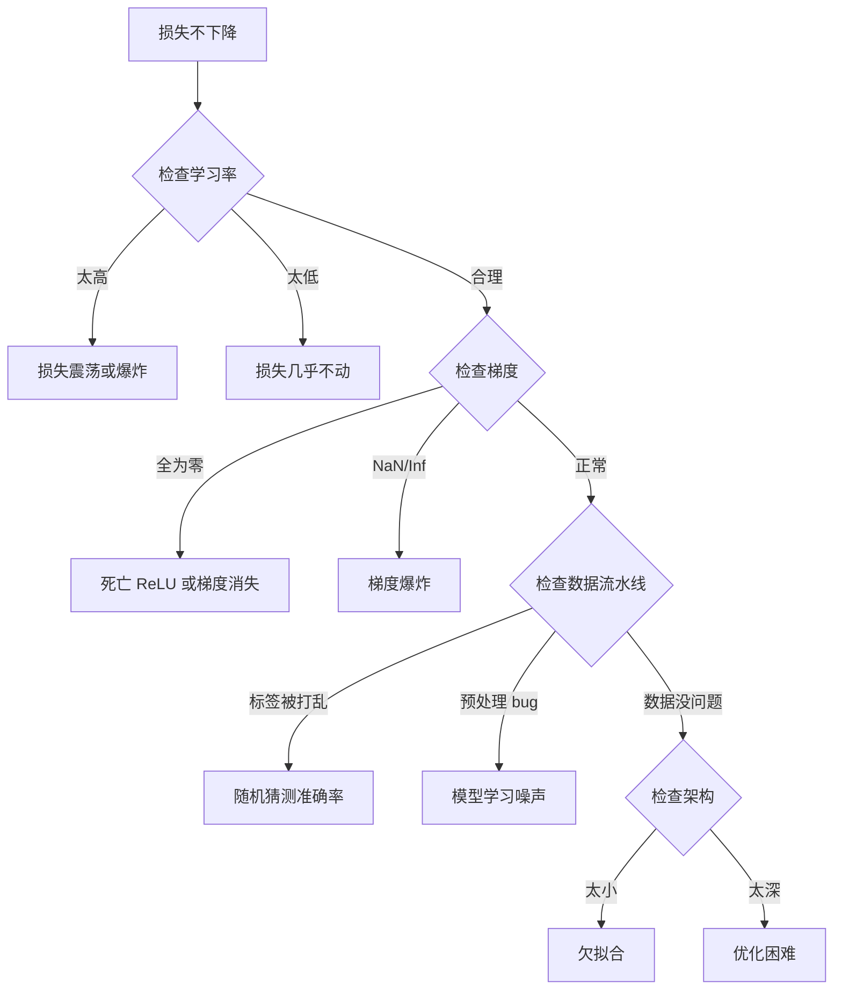
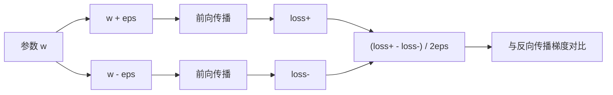
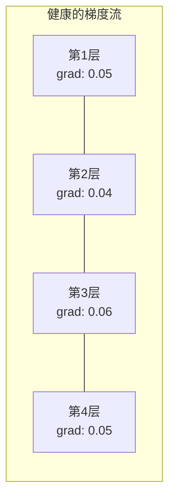
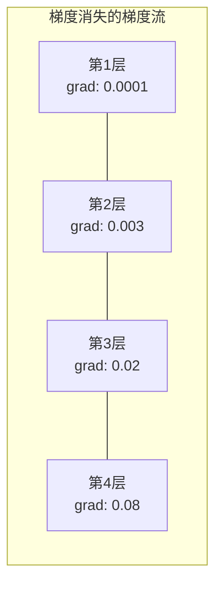

# 调试神经网络

> 你的网络编译了，运行了，产生了一个数字。这个数字是错的，但什么也没崩溃。欢迎来到最难的调试——没有错误信息的那种。

## 核心问题

传统软件在出错时会崩溃。空指针抛出异常，类型不匹配在编译时失败，差一错误产生明显错误的输出。

神经网络不给你这种奢侈。

一个损坏的神经网络会运行到完成，打印出一个损失值，输出预测。损失可能在下降，预测可能看起来合理。但模型在悄悄地出错——学习捷径，记住噪声，或收敛到无用的局部极小值。Google 研究人员估计，60-70% 的 ML 调试时间花在"静默"的 bug 上，这些 bug 不产生错误但会降低模型质量。

一个工作的模型和一个损坏的模型之间，往往只差一行代码：缺少了 `zero_grad()`，一个转置的维度，学习率差了 10 倍。Karpathy 的"训练神经网络配方"（2019）以这句话开头："最常见的神经网络错误是不会崩溃的 bug。"

本章教你找到这些 bug。

---

## 调试心态

忘掉"打印然后祈祷"式调试。神经网络调试需要系统性方法，因为反馈循环很慢（每次训练运行需要几分钟到几小时），症状也很模糊（损失差可能意味着 20 种不同的事情）。

**黄金法则：从简单开始，一次添加一个复杂度，独立验证每一块。**



---

## 症状一：损失不下降

**学习率错误。** 太高：损失震荡或跳到 NaN。太低：损失下降太慢，看起来像平的。对 Adam，从 1e-3 开始；对 SGD，从 1e-1 或 1e-2 开始。在得出其他结论之前，始终尝试三个相差 10 倍的学习率（如 1e-2, 1e-3, 1e-4）。

**死亡 ReLU。** 如果 ReLU 神经元收到一个很大的负输入，它输出 0，梯度也是 0，它再也不会激活了。如果足够多的神经元死亡，网络就无法学习。检查：打印每个 ReLU 层后输出为零的激活值比例。如果 > 50% 是死的，换成 LeakyReLU 或减小学习率。

**梯度消失。** 在使用 Sigmoid 或 Tanh 的深层网络中，梯度在反向传播时指数级缩小。等它们到达第一层时，已经接近 0。前几层停止学习。修复：使用 ReLU/GELU，添加残差连接，或使用批归一化。

**梯度爆炸。** 相反的问题——梯度指数级增长。在 RNN 和极深的网络中常见。损失跳到 NaN。修复：梯度裁剪（`torch.nn.utils.clip_grad_norm_`）、更小的学习率，或加归一化。

---

## 症状二：损失在下降，但模型很差

训练准确率达到 99%，但测试准确率只有 55%，或者模型在真实数据上产生无意义的输出。

**过拟合。** 模型记住了训练数据而不是学习规律。训练和验证损失之间的差距随时间增大。修复：更多数据、Dropout、权重衰减、早停、数据增强。

**数据泄漏。** 测试数据泄露到了训练中。准确率高得令人怀疑。常见原因：分割前打乱、用完整数据集统计量做预处理、分割间有重复样本。修复：先分割，后预处理，检查重复。

**标签错误。** 大多数真实数据集中有 5-10% 的标签是错的（Northcutt 等人，2021）。模型学习了噪声。修复：用置信学习找到并修复错误标注的样本，或用损失截断忽略高损失样本。

---

## 症状三：损失中出现 NaN 或 Inf

**学习率太高。** 梯度更新过冲太远，权重爆炸。修复：减少 10 倍。

**log(0) 或 log(负数)。** 交叉熵损失计算 `log(p)`。如果你的模型输出恰好为 0 或负概率，log 就爆炸了。修复：把预测值夹到 `[eps, 1-eps]`，其中 `eps=1e-7`。

**除以零。** 批归一化除以标准差。常数值的批次标准差为 0。修复：在分母中加 epsilon（PyTorch 默认这样做，但自定义实现可能没有）。

**数值溢出。** 大的激活值送入 `exp()` 产生 Inf。Softmax 特别容易。修复：在指数运算前减去最大值（log-sum-exp 技巧）。

---

## 技术一：梯度检验

把解析梯度（来自反向传播）与数值梯度（来自有限差分）进行比较。如果它们不一致，你的反向传播有 bug。

参数 `w` 的数值梯度：

```
grad_numerical = (loss(w + eps) - loss(w - eps)) / (2 * eps)
```

一致性指标（相对差）：

```
rel_diff = |grad_analytical - grad_numerical| / max(|grad_analytical|, |grad_numerical|, 1e-8)
```

- `rel_diff < 1e-5`：正确
- `rel_diff > 1e-3`：几乎可以确定是 bug



---

## 技术二：激活统计

在训练期间监控每层激活值的均值和标准差。健康网络的激活值均值接近 0，标准差接近 1（归一化后），或至少有界。

| 健康指标 | 均值 | 标准差 | 诊断 |
|---------|------|--------|------|
| 健康 | ~0 | ~1 | 网络正常学习 |
| 饱和 | >>0 或 <<0 | ~0 | 激活卡在极端值 |
| 死亡 | 0 | 0 | 神经元死亡（全为零） |
| 爆炸 | >>10 | >>10 | 激活无限增长 |

---

## 技术三：梯度流可视化

绘制每层的平均梯度幅度。健康网络的梯度幅度在各层间大致相似。如果早期层的梯度比后期层小 1000 倍，说明存在梯度消失。





---

## 技术四：单批过拟合测试

**深度学习中最重要的单个调试技术。**

取一个小批次（8-32 个样本），在它上面训练 100+ 次迭代。损失应该接近零，训练准确率应该达到 100%。如果没有，你的模型或训练循环有根本性的 bug——不要继续全量训练。

这个测试能捕捉到：
- 损坏的损失函数
- 损坏的反向传播
- 架构太小无法表示数据
- 优化器没有连接到模型参数
- 数据和标签不对齐

这个测试只需 30 秒，可以节省数小时的全量训练调试。

---

## 技术五：学习率查找器

Leslie Smith（2017）提出在一个 epoch 内将学习率从极小（1e-7）扫到极大（10），同时记录损失。绘制损失 vs 学习率的曲线。最优学习率大约是损失开始下降最快的地方前 10 倍。

---

## 常见 PyTorch Bug

| Bug | 症状 | 修复 |
|-----|------|------|
| 忘记 `optimizer.zero_grad()` | 梯度在批次间累积，损失震荡 | 在 `loss.backward()` 前添加 `optimizer.zero_grad()` |
| 测试时忘记 `model.eval()` | Dropout 和 BatchNorm 表现不同，测试准确率在运行间变化 | 添加 `model.eval()` 和 `torch.no_grad()` |
| 张量形状错误 | 静默的广播产生错误结果，没有报错 | 调试时在每个操作后打印形状 |
| CPU/GPU 不匹配 | `RuntimeError: expected CUDA tensor` | 在模型和数据上都使用 `.to(device)` |
| 未分离张量 | 计算图无限增长，OOM | 使用 `.detach()` 或 `with torch.no_grad()` |
| 原地操作破坏自动微分 | `RuntimeError: modified by in-place operation` | 把 `x += 1` 替换为 `x = x + 1` |
| 数据未归一化 | 损失卡在随机猜测水平 | 把输入归一化到均值=0，标准差=1 |
| 标签数据类型错误 | 交叉熵期望 `Long`，得到 `Float` | 转换标签：`labels.long()` |

---

## 主诊断表

| 症状 | 可能原因 | 第一步要做的事 |
|------|---------|--------------|
| 损失卡在 -log(1/类别数) | 模型预测均匀分布 | 检查数据流水线，验证标签与输入对应 |
| 几步后损失变 NaN | 学习率太高 | 减少 10 倍 |
| 立即损失变 NaN | log(0) 或除以零 | 在 log/除法操作中加 epsilon |
| 损失剧烈震荡 | 学习率太高或批大小太小 | 减小学习率，增大批大小 |
| 损失下降后停滞 | 微调阶段学习率太高 | 添加学习率调度（余弦或步进衰减） |
| 训练准确率高，测试准确率低 | 过拟合 | 添加 Dropout、权重衰减、更多数据 |
| 训练准确率 = 测试准确率 = 随机概率 | 模型没有学习任何东西 | 运行单批过拟合测试 |
| 训练准确率 = 测试准确率，但都低 | 欠拟合 | 更大的模型，更多层，更多特征 |
| 梯度全为零 | 死亡 ReLU 或分离的计算图 | 换成 LeakyReLU，检查 `.requires_grad` |
| 训练时内存溢出 | 批太大或计算图未释放 | 减小批大小，评估时使用 `torch.no_grad()` |

---

## 从零实现

### 第一步：NetworkDebugger 类

钩入 PyTorch 模型，记录每层的激活和梯度统计：

```python
import torch
import torch.nn as nn
import math


class NetworkDebugger:
    def __init__(self, model):
        self.model = model
        self.activation_stats = {}
        self.gradient_stats = {}
        self.loss_history = []
        self.hooks = []
        self._register_hooks()

    def _register_hooks(self):
        for name, module in self.model.named_modules():
            if isinstance(module, (nn.Linear, nn.Conv2d, nn.ReLU, nn.LeakyReLU)):
                hook = module.register_forward_hook(self._make_activation_hook(name))
                self.hooks.append(hook)
                hook = module.register_full_backward_hook(self._make_gradient_hook(name))
                self.hooks.append(hook)

    def _make_activation_hook(self, name):
        def hook(module, input, output):
            with torch.no_grad():
                out = output.detach().float()
                self.activation_stats[name] = {
                    "mean": out.mean().item(),
                    "std": out.std().item(),
                    "fraction_zero": (out == 0).float().mean().item(),
                    "min": out.min().item(),
                    "max": out.max().item(),
                }
        return hook

    def _make_gradient_hook(self, name):
        def hook(module, grad_input, grad_output):
            if grad_output[0] is not None:
                with torch.no_grad():
                    grad = grad_output[0].detach().float()
                    self.gradient_stats[name] = {
                        "mean": grad.mean().item(),
                        "std": grad.std().item(),
                        "abs_mean": grad.abs().mean().item(),
                        "max": grad.abs().max().item(),
                    }
        return hook

    def record_loss(self, loss_value):
        self.loss_history.append(loss_value)

    def check_loss_health(self):
        if len(self.loss_history) < 2:
            return "数据不足"
        recent = self.loss_history[-10:]
        if any(math.isnan(v) or math.isinf(v) for v in recent):
            return "NAN_OR_INF"
        if len(self.loss_history) >= 20:
            first_half = sum(self.loss_history[:10]) / 10
            second_half = sum(self.loss_history[-10:]) / 10
            if second_half >= first_half * 0.99:
                return "不在下降"
        if len(recent) >= 5:
            diffs = [recent[i+1] - recent[i] for i in range(len(recent)-1)]
            if max(diffs) - min(diffs) > 2 * abs(sum(diffs) / len(diffs)):
                return "震荡"
        return "健康"

    def check_activations(self):
        issues = []
        for name, stats in self.activation_stats.items():
            if stats["fraction_zero"] > 0.5:
                issues.append(f"死亡神经元: {name} 有 {stats['fraction_zero']:.0%} 的零激活")
            if abs(stats["mean"]) > 10:
                issues.append(f"激活爆炸: {name} mean={stats['mean']:.2f}")
            if stats["std"] < 1e-6:
                issues.append(f"激活坍缩: {name} std={stats['std']:.2e}")
        return issues if issues else ["健康"]

    def check_gradients(self):
        issues = []
        grad_magnitudes = []
        for name, stats in self.gradient_stats.items():
            grad_magnitudes.append((name, stats["abs_mean"]))
            if stats["abs_mean"] < 1e-7:
                issues.append(f"梯度消失: {name} abs_mean={stats['abs_mean']:.2e}")
            if stats["abs_mean"] > 100:
                issues.append(f"梯度爆炸: {name} abs_mean={stats['abs_mean']:.2e}")
        if len(grad_magnitudes) >= 2:
            first_mag = grad_magnitudes[0][1]
            last_mag = grad_magnitudes[-1][1]
            if last_mag > 0 and first_mag / last_mag > 100:
                issues.append(f"梯度比率: 首层/末层 = {first_mag/last_mag:.0f}x（消失）")
        return issues if issues else ["健康"]

    def print_report(self):
        print("\n=== 网络调试报告 ===")
        print(f"\n损失健康状态: {self.check_loss_health()}")
        if self.loss_history:
            print(f"  最近5次损失: {[f'{v:.4f}' for v in self.loss_history[-5:]]}")
        print("\n激活诊断:")
        for item in self.check_activations():
            print(f"  {item}")
        print("\n梯度诊断:")
        for item in self.check_gradients():
            print(f"  {item}")
        print("\n逐层激活统计:")
        for name, stats in self.activation_stats.items():
            print(f"  {name}: mean={stats['mean']:.4f} std={stats['std']:.4f} zero={stats['fraction_zero']:.1%}")
        print("\n逐层梯度统计:")
        for name, stats in self.gradient_stats.items():
            print(f"  {name}: abs_mean={stats['abs_mean']:.2e} max={stats['max']:.2e}")

    def remove_hooks(self):
        for hook in self.hooks:
            hook.remove()
        self.hooks.clear()
```

### 第二步：单批过拟合测试

```python
def overfit_one_batch(model, x_batch, y_batch, criterion, lr=0.01, steps=200):
    optimizer = torch.optim.Adam(model.parameters(), lr=lr)
    model.train()
    print("\n=== 单批过拟合测试 ===")
    print(f"批大小: {x_batch.shape[0]}, 步数: {steps}")

    for step in range(steps):
        optimizer.zero_grad()
        output = model(x_batch)
        loss = criterion(output, y_batch)
        loss.backward()
        optimizer.step()

        if step % 50 == 0 or step == steps - 1:
            with torch.no_grad():
                preds = (output > 0).float() if output.shape[-1] == 1 else output.argmax(dim=1)
                targets = y_batch if y_batch.dim() == 1 else y_batch.squeeze()
                acc = (preds.squeeze() == targets).float().mean().item()
            print(f"  步骤 {step:3d} | 损失: {loss.item():.6f} | 准确率: {acc:.1%}")

    final_loss = loss.item()
    if final_loss > 0.1:
        print(f"\n  失败: 损失未收敛 ({final_loss:.4f})。模型或训练循环有根本性 bug。")
        return False
    print(f"\n  通过: 损失收敛到 {final_loss:.6f}")
    return True
```

### 第三步：学习率查找器

```python
def find_learning_rate(model, x_data, y_data, criterion, start_lr=1e-7, end_lr=10, steps=100):
    import copy
    original_state = copy.deepcopy(model.state_dict())
    optimizer = torch.optim.SGD(model.parameters(), lr=start_lr)
    lr_mult = (end_lr / start_lr) ** (1 / steps)

    model.train()
    results = []
    best_loss = float("inf")
    current_lr = start_lr

    print("\n=== 学习率查找器 ===")

    for step in range(steps):
        optimizer.zero_grad()
        output = model(x_data)
        loss = criterion(output, y_data)

        if math.isnan(loss.item()) or loss.item() > best_loss * 10:
            break

        best_loss = min(best_loss, loss.item())
        results.append((current_lr, loss.item()))

        loss.backward()
        optimizer.step()

        current_lr *= lr_mult
        for param_group in optimizer.param_groups:
            param_group["lr"] = current_lr

    model.load_state_dict(original_state)

    if len(results) < 10:
        print("  无法完成学习率扫描——损失发散太快")
        return results

    min_loss_idx = min(range(len(results)), key=lambda i: results[i][1])
    suggested_lr = results[max(0, min_loss_idx - 10)][0]

    print(f"  扫描了 {len(results)} 步，从 {start_lr:.0e} 到 {results[-1][0]:.0e}")
    print(f"  最小损失 {results[min_loss_idx][1]:.4f} 在 lr={results[min_loss_idx][0]:.2e}")
    print(f"  建议学习率: {suggested_lr:.2e}")

    return results
```

### 第四步：梯度检验

```python
def _flat_to_multi_index(flat_idx, shape):
    multi_idx = []
    remaining = flat_idx
    for dim in reversed(shape):
        multi_idx.insert(0, remaining % dim)
        remaining //= dim
    return tuple(multi_idx)


def gradient_check(model, x, y, criterion, eps=1e-4):
    model.train()
    x_double = x.double()
    y_double = y.double()
    model_double = model.double()

    print("\n=== 梯度检验 ===")
    overall_max_diff = 0
    checked = 0

    for name, param in model_double.named_parameters():
        if not param.requires_grad:
            continue

        layer_max_diff = 0

        model_double.zero_grad()
        output = model_double(x_double)
        loss = criterion(output, y_double)
        loss.backward()
        analytical_grad = param.grad.clone()

        num_checks = min(5, param.numel())
        for i in range(num_checks):
            idx = _flat_to_multi_index(i, param.shape)
            original = param.data[idx].item()

            param.data[idx] = original + eps
            with torch.no_grad():
                loss_plus = criterion(model_double(x_double), y_double).item()

            param.data[idx] = original - eps
            with torch.no_grad():
                loss_minus = criterion(model_double(x_double), y_double).item()

            param.data[idx] = original

            numerical = (loss_plus - loss_minus) / (2 * eps)
            analytical = analytical_grad[idx].item()

            denom = max(abs(numerical), abs(analytical), 1e-8)
            rel_diff = abs(numerical - analytical) / denom

            layer_max_diff = max(layer_max_diff, rel_diff)
            checked += 1

        overall_max_diff = max(overall_max_diff, layer_max_diff)
        status = "通过" if layer_max_diff < 1e-5 else "不匹配"
        print(f"  {name}: 最大相对差={layer_max_diff:.2e} [{status}]")

    model.float()

    print(f"\n  检验了 {checked} 个参数")
    if overall_max_diff < 1e-5:
        print("  通过: 梯度匹配（相对差 < 1e-5）")
    elif overall_max_diff < 1e-3:
        print("  警告: 小差异（1e-5 < 相对差 < 1e-3）")
    else:
        print("  失败: 检测到梯度不匹配（相对差 > 1e-3）")
    return overall_max_diff
```

### 第五步：故意损坏的网络演示

```python
def demo_broken_networks():
    torch.manual_seed(42)
    x = torch.randn(64, 10)
    y = (x[:, 0] > 0).long()
    criterion = nn.CrossEntropyLoss()

    print("\n" + "=" * 60)
    print("Bug 1: 学习率太高 (lr=10)")
    print("=" * 60)
    model1 = nn.Sequential(nn.Linear(10, 32), nn.ReLU(), nn.Linear(32, 2))
    debugger1 = NetworkDebugger(model1)
    optimizer1 = torch.optim.SGD(model1.parameters(), lr=10.0)
    for step in range(20):
        optimizer1.zero_grad()
        out = model1(x)
        loss = criterion(out, y)
        debugger1.record_loss(loss.item())
        loss.backward()
        optimizer1.step()
    debugger1.print_report()
    debugger1.remove_hooks()

    print("\n" + "=" * 60)
    print("Bug 2: 不良初始化导致死亡 ReLU")
    print("=" * 60)
    model2 = nn.Sequential(nn.Linear(10, 32), nn.ReLU(), nn.Linear(32, 32), nn.ReLU(), nn.Linear(32, 2))
    with torch.no_grad():
        for m in model2.modules():
            if isinstance(m, nn.Linear):
                m.weight.fill_(-1.0)
                m.bias.fill_(-5.0)  # 大负偏置 → 所有神经元死亡
    debugger2 = NetworkDebugger(model2)
    optimizer2 = torch.optim.Adam(model2.parameters(), lr=1e-3)
    for step in range(50):
        optimizer2.zero_grad()
        out = model2(x)
        loss = criterion(out, y)
        debugger2.record_loss(loss.item())
        loss.backward()
        optimizer2.step()
    debugger2.print_report()
    debugger2.remove_hooks()

    print("\n" + "=" * 60)
    print("Bug 3: 缺少 zero_grad（梯度累积）")
    print("=" * 60)
    model3 = nn.Sequential(nn.Linear(10, 32), nn.ReLU(), nn.Linear(32, 2))
    debugger3 = NetworkDebugger(model3)
    optimizer3 = torch.optim.SGD(model3.parameters(), lr=0.01)
    for step in range(50):
        # 注意：这里故意没有 zero_grad()！
        out = model3(x)
        loss = criterion(out, y)
        debugger3.record_loss(loss.item())
        loss.backward()
        optimizer3.step()
    debugger3.print_report()
    debugger3.remove_hooks()

    print("\n" + "=" * 60)
    print("健康网络：正确设置（作为对比）")
    print("=" * 60)
    model_good = nn.Sequential(nn.Linear(10, 32), nn.ReLU(), nn.Linear(32, 2))
    debugger_good = NetworkDebugger(model_good)
    optimizer_good = torch.optim.Adam(model_good.parameters(), lr=1e-3)
    for step in range(50):
        optimizer_good.zero_grad()
        out = model_good(x)
        loss = criterion(out, y)
        debugger_good.record_loss(loss.item())
        loss.backward()
        optimizer_good.step()
    debugger_good.print_report()
    debugger_good.remove_hooks()

    print("\n" + "=" * 60)
    print("单批过拟合测试（健康模型）")
    print("=" * 60)
    model_test = nn.Sequential(nn.Linear(10, 32), nn.ReLU(), nn.Linear(32, 2))
    overfit_one_batch(model_test, x[:8], y[:8], criterion)

    print("\n" + "=" * 60)
    print("学习率查找器")
    print("=" * 60)
    model_lr = nn.Sequential(nn.Linear(10, 32), nn.ReLU(), nn.Linear(32, 2))
    find_learning_rate(model_lr, x, y, criterion)

    print("\n" + "=" * 60)
    print("梯度检验")
    print("=" * 60)
    model_grad = nn.Sequential(nn.Linear(10, 8), nn.ReLU(), nn.Linear(8, 2))
    gradient_check(model_grad, x[:4], y[:4], criterion)


demo_broken_networks()
```

---

## PyTorch 内置调试工具

```python
import torch
import torch.nn as nn

model = nn.Sequential(
    nn.Linear(768, 256),
    nn.ReLU(),
    nn.Linear(256, 10),
)

# 自动检测 NaN/Inf
with torch.autograd.detect_anomaly():
    output = model(input_tensor)
    loss = criterion(output, target)
    loss.backward()

# 手动检查每个参数的梯度
for name, param in model.named_parameters():
    if param.grad is not None:
        print(f"{name}: grad_mean={param.grad.abs().mean():.2e}")
```

---

## 调试前的检查清单

1. 运行单批过拟合测试。如果失败，停下来。
2. 打印模型摘要——验证参数数量合理。
3. 用随机数据做一次前向传播——检查输出形状。
4. 训练 5 轮——验证损失在下降。
5. 检查激活统计——没有死亡层，没有爆炸。
6. 检查梯度流——没有消失，没有爆炸。
7. 验证数据流水线——打印 5 个随机样本及其标签。

---

## 关键术语

| 术语 | 英文 | 含义 |
|------|------|------|
| 静默 Bug | Silent Bug | 不产生错误但降低模型质量的 bug——ML 中占主导的失败模式 |
| 死亡 ReLU | Dead ReLU | 输入始终为负的 ReLU 神经元，永久输出 0 并接收 0 梯度 |
| 梯度消失 | Vanishing Gradients | 梯度在各层间指数级缩小，使早期层权重实际上被冻结 |
| 梯度爆炸 | Exploding Gradients | 梯度在各层间指数级增长，导致权重更新大到溢出 |
| 梯度检验 | Gradient Checking | 将反向传播的解析梯度与有限差分的数值梯度进行比较 |
| 单批过拟合 | Overfit-one-batch | 在单个小批次上训练以验证模型**能**学习——如果不能，说明有根本性 bug |
| 学习率查找器 | LR Finder | 在一个 epoch 内指数级增加学习率，选择损失发散前的值 |
| 数据泄漏 | Data Leakage | 测试集信息污染了训练，产生虚高的准确率 |
| 激活统计 | Activation Statistics | 跟踪每层输出的均值、标准差和零比例，检测死亡、饱和或爆炸的神经元 |
| 梯度裁剪 | Gradient Clipping | 当梯度范数超过阈值时缩小梯度，防止梯度爆炸更新 |
