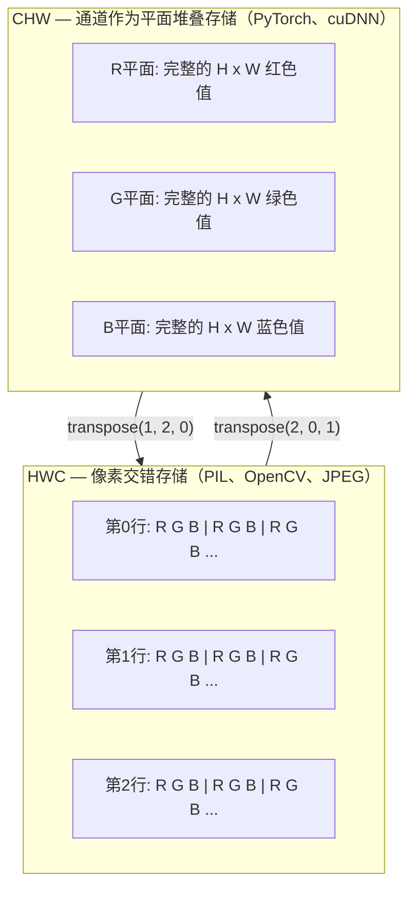

# 图像基础 — 像素、通道与色彩空间

> 图像是光采样的张量。你将使用的每一个视觉模型，都从这个事实出发。

**类型：** 动手实现
**语言：** Python
**前置知识：** Phase 1 第12课（张量运算），Phase 3 第11课（PyTorch入门）
**预计时间：** ~45分钟

## 学习目标

- 解释连续场景如何被离散化为像素，以及采样与量化决策为何决定了所有下游模型的性能上限
- 将图像作为 NumPy 数组读取、切片和检查，并在 HWC 与 CHW 布局之间自如切换
- 在 RGB、灰度、HSV 和 YCbCr 之间互相转换，并解释每种色彩空间存在的原因
- 完全按照 torchvision 的预期，执行像素级预处理（归一化、标准化、缩放、通道优先）

## 问题所在

你阅读的每篇论文、下载的每个预训练权重、调用的每个视觉 API，都对输入有特定的编码假设。把 `uint8` 图像传给一个期望 `float32` 的模型，它照样能运行——只是会悄无声息地输出垃圾。把 BGR 图像喂给一个在 RGB 上训练的网络，精度会下降十个百分点。把通道在最后的输入传给期望通道在前的模型，第一个卷积层会把高度当成特征通道来处理。这一切都不会报错，只会悄悄毁掉你的指标，让你花一周时间追查一个藏在文件加载方式里的 bug。

一旦知道卷积在滑动什么，卷积本身并不复杂。真正难的是：「一张图像」对摄像头、JPEG 解码器、PIL、OpenCV、torchvision 和 CUDA 核而言各有不同的含义。每个栈都有自己的轴顺序、字节范围和通道约定。一个搞不清这些的视觉工程师，会交付一条断掉的流水线。

本课修正这个基础，让 Phase 04 的后续内容可以在上面构建。学完之后，你将明白像素是什么、为什么每个像素有三个数而不是一个、「用 ImageNet 统计量归一化」究竟做了什么，以及如何在这个 Phase 中每节课都会假设的两三种布局之间转换。

## 核心概念

### 完整预处理流水线一览

每个生产级视觉系统都是相同的可逆变换序列。其中任何一步出错，模型看到的输入就会和训练时不同。

```mermaid
flowchart LR
    A["图像文件<br/>(JPEG/PNG)"] --> B["解码<br/>uint8 HWC"]
    B --> C["色彩空间转换<br/>(RGB/BGR/YCbCr)"]
    C --> D["缩放<br/>短边对齐"]
    D --> E["中心裁剪<br/>到模型尺寸"]
    E --> F["除以255<br/>float32 [0,1]"]
    F --> G["减均值<br/>除以标准差"]
    G --> H["转置<br/>HWC → CHW"]
    H --> I["批处理<br/>CHW → NCHW"]
    I --> J["模型"]

    style A fill:#fef3c7,stroke:#d97706
    style J fill:#ddd6fe,stroke:#7c3aed
    style G fill:#fecaca,stroke:#dc2626
    style H fill:#bfdbfe,stroke:#2563eb
```



红色和蓝色的两个框是 80% 静默失败的来源：缺少标准化，以及错误的布局。

### 像素是采样，不是方块

相机传感器计算落在探测器网格上的光子数。每个探测器在极短的时间内积分光线，并发出与光子数成正比的电压，再将该电压离散化为整数。一个探测器变成一个像素。

```
连续场景                       传感器网格                      数字图像
（无限细节）                   （H x W 个探测器）              （H x W 个整数）

    ~~~~~                      +--+--+--+--+--+                210 198 180 155 120
   ~   ~   ~                   |  |  |  |  |  |                205 195 178 152 118
  ~ light ~      ---->         +--+--+--+--+--+     ---->      200 190 175 150 115
   ~~~~~                       |  |  |  |  |  |                195 185 170 148 112
                               +--+--+--+--+--+                188 180 165 145 108
```

这一步发生的两个选择，决定了下游一切的上限：

- **空间采样**决定每度视场有多少探测器。太少，边缘会出现锯齿（混叠）；太多，存储和计算量会爆炸。
- **强度量化**决定电压被划分成多细的桶。8 位给出 256 个等级，是显示的标准。10、12、16 位给出更平滑的梯度，对医学成像、HDR 和原始传感器流水线有意义。

像素不是有面积的彩色方块，它是一次单一的测量。当你缩放或旋转时，你是在对这个测量网格进行重采样。

### 为什么是三个通道

一个探测器对整个可见光谱计数——那就是灰度。为了获得颜色，传感器在网格上覆盖一层红、绿、蓝滤镜的马赛克。去马赛克后，每个空间位置有三个整数：附近红色滤镜探测器、绿色滤镜和蓝色滤镜探测器的响应值。这三个整数就是像素的 RGB 三元组。

```
内存中的一个像素：

    (R, G, B) = (210, 140, 30)   <- 橙红色

一张 H x W 的 RGB 图像：

    shape (H, W, 3)    存储为   H 行，每行 W 个像素，每个像素 3 个值
                                uint8 时每个值在 [0, 255]
```

三不是魔法数字。深度相机有 Z 通道，卫星图像有红外和紫外波段，医学扫描通常只有一个通道（X 光、CT）或很多通道（高光谱）。通道数是最后一个轴，卷积层学习如何在通道间混合。

### 两种布局约定：HWC 与 CHW

同一个张量，两种排列方式。每个库选择一种。

```
HWC（高度、宽度、通道）                 CHW（通道、高度、宽度）

   W ->                                   H ->
  +-----+-----+-----+                    +-----+-----+
H |R G B|R G B|R G B|                  C |R R R R R R|
| +-----+-----+-----+                  | +-----+-----+
v |R G B|R G B|R G B|                  v |G G G G G G|
  +-----+-----+-----+                    +-----+-----+
                                         |B B B B B B|
                                         +-----+-----+

   PIL、OpenCV、matplotlib，           PyTorch、大多数深度学习框架、
   磁盘上几乎所有图像文件              cuDNN 核
```

CHW 存在是因为卷积核在 H 和 W 方向滑动。通道轴在前，意味着每个核对每个通道看到的是连续的 2D 平面，向量化更干净。磁盘格式保留 HWC，因为它匹配传感器扫描线输出的顺序。

你会写一千遍的单行转换：

```
img_chw = img_hwc.transpose(2, 0, 1)      # NumPy
img_chw = img_hwc.permute(2, 0, 1)        # PyTorch 张量
```

内存布局可视化：



### 字节范围与数据类型

三种约定占主导地位：

| 约定 | dtype | 范围 | 常见场景 |
|------|-------|------|---------|
| 原始 | `uint8` | [0, 255] | 磁盘文件、PIL、OpenCV 输出 |
| 归一化 (Normalized) | `float32` | [0.0, 1.0] | 执行 `img.astype('float32') / 255` 之后 |
| 标准化 (Standardized) | `float32` | 大约 [-2, +2] | 减去均值再除以标准差之后 |

卷积网络是在标准化输入上训练的。ImageNet 统计量 `mean=[0.485, 0.456, 0.406]`、`std=[0.229, 0.224, 0.225]` 是对 [0, 1] 归一化像素，在完整 ImageNet 训练集上三个通道的算术均值和标准差。把原始 `uint8` 喂给一个期望标准化浮点数的模型，是应用视觉中最常见的静默失败。

### 色彩空间及其存在原因

RGB 是采集格式，但它并不总是对模型最有用的表示。

```
 RGB               HSV                        YCbCr / YUV

 R 红色            H 色调（角度 0-360）        Y 亮度（brightness）
 G 绿色            S 饱和度（0-1）             Cb 色度蓝黄分量
 B 蓝色            V 明度/亮度（0-1）          Cr 色度红绿分量

 与传感器输出      将颜色与亮度分离。           将亮度与颜色分离。JPEG
 线性对应          适用于颜色阈值分割、         和大多数视频编解码器对
                  UI 滑块、简单滤波            色度通道压缩更重，因为
                                             人眼对色度细节不如对 Y 敏感
```

对大多数现代 CNN，你输入 RGB。以下情况会遇到其他色彩空间：

- **HSV** — 经典 CV 代码、基于颜色的分割、白平衡。
- **YCbCr** — 读取 JPEG 内部结构、视频流水线、只在 Y 通道上操作的超分辨率模型。
- **灰度** — OCR、文档模型、颜色是干扰项而非信号的场景。

RGB 转灰度是加权求和，而不是平均，因为人眼对绿色比对红色或蓝色更敏感：

```
Y = 0.299 R + 0.587 G + 0.114 B       (ITU-R BT.601，经典权重)
```

### 长宽比、缩放与插值

每个模型都有固定的输入尺寸（大多数 ImageNet 分类器是 224×224，现代检测器是 384×384 或 512×512）。你的图像很少正好匹配。三种关键的缩放选择：

- **缩放短边，然后中心裁剪** — 标准 ImageNet 做法。保留长宽比，丢掉边缘像素条。
- **缩放并填充** — 保留长宽比和每个像素，添加黑边。检测和 OCR 的标准做法。
- **直接缩放到目标尺寸** — 拉伸图像。便宜，扭曲几何形状，对许多分类任务无妨。

插值方法决定当新网格与旧网格不对齐时，如何计算中间像素：

```
最近邻     最快，有块状感，唯一适用于 mask/标签的方法
双线性     快，平滑，大多数图像缩放的默认选择
双三次     较慢，在放大时更清晰
Lanczos    最慢，质量最好，用于最终显示
```

经验法则：训练用双线性，要看的素材用双三次或 Lanczos，含有整数类别 ID 的内容用最近邻。

## 动手实现

### 第1步：加载图像并检查其 shape

用 Pillow 加载任意 JPEG 或 PNG，转换为 NumPy，打印结果。为了有确定性的离线示例，我们合成一张。

```python
import numpy as np
from PIL import Image

def synthetic_rgb(h=128, w=192, seed=0):
    rng = np.random.default_rng(seed)
    yy, xx = np.meshgrid(np.linspace(0, 1, h), np.linspace(0, 1, w), indexing="ij")
    r = (np.sin(xx * 6) * 0.5 + 0.5) * 255
    g = yy * 255
    b = (1 - yy) * xx * 255
    rgb = np.stack([r, g, b], axis=-1) + rng.normal(0, 6, (h, w, 3))
    return np.clip(rgb, 0, 255).astype(np.uint8)

arr = synthetic_rgb()
# 或从磁盘加载：
# arr = np.asarray(Image.open("your_image.jpg").convert("RGB"))

print(f"type:   {type(arr).__name__}")
print(f"dtype:  {arr.dtype}")
print(f"shape:  {arr.shape}     # (H, W, C)")
print(f"min:    {arr.min()}")
print(f"max:    {arr.max()}")
print(f"pixel at (0, 0): {arr[0, 0]}")
```

预期输出：`shape: (H, W, 3)`，`dtype: uint8`，范围 `[0, 255]`。这是标准的磁盘表示，无论字节来自摄像头、JPEG 解码器还是合成生成器。

### 第2步：分离通道并重排布局

分别提取 R、G、B，然后从 HWC 转换为 PyTorch 所需的 CHW。

```python
R = arr[:, :, 0]
G = arr[:, :, 1]
B = arr[:, :, 2]
print(f"R shape: {R.shape}, mean: {R.mean():.1f}")
print(f"G shape: {G.shape}, mean: {G.mean():.1f}")
print(f"B shape: {B.shape}, mean: {B.mean():.1f}")

arr_chw = arr.transpose(2, 0, 1)
print(f"\nHWC shape: {arr.shape}")
print(f"CHW shape: {arr_chw.shape}")
```

三个灰度平面，每个通道一个。CHW 只是重排轴；当内存布局允许时，并不严格需要复制数据。

### 第3步：灰度与 HSV 转换

加权求和得到灰度，然后手动实现 RGB-to-HSV。

```python
def rgb_to_grayscale(rgb):
    weights = np.array([0.299, 0.587, 0.114], dtype=np.float32)
    return (rgb.astype(np.float32) @ weights).astype(np.uint8)

def rgb_to_hsv(rgb):
    rgb_f = rgb.astype(np.float32) / 255.0
    r, g, b = rgb_f[..., 0], rgb_f[..., 1], rgb_f[..., 2]
    cmax = np.max(rgb_f, axis=-1)
    cmin = np.min(rgb_f, axis=-1)
    delta = cmax - cmin

    h = np.zeros_like(cmax)
    mask = delta > 0
    rmax = mask & (cmax == r)
    gmax = mask & (cmax == g)
    bmax = mask & (cmax == b)
    h[rmax] = ((g[rmax] - b[rmax]) / delta[rmax]) % 6
    h[gmax] = ((b[gmax] - r[gmax]) / delta[gmax]) + 2
    h[bmax] = ((r[bmax] - g[bmax]) / delta[bmax]) + 4
    h = h * 60.0

    s = np.where(cmax > 0, delta / cmax, 0)
    v = cmax
    return np.stack([h, s, v], axis=-1)

gray = rgb_to_grayscale(arr)
hsv = rgb_to_hsv(arr)
print(f"gray shape: {gray.shape}, range: [{gray.min()}, {gray.max()}]")
print(f"hsv   shape: {hsv.shape}")
print(f"hue range: [{hsv[..., 0].min():.1f}, {hsv[..., 0].max():.1f}] 度")
print(f"sat range: [{hsv[..., 1].min():.2f}, {hsv[..., 1].max():.2f}]")
print(f"val range: [{hsv[..., 2].min():.2f}, {hsv[..., 2].max():.2f}]")
```

色调以度为单位输出，饱和度和明度在 [0, 1]。这与 OpenCV 的 `hsv_full` 约定一致。

### 第4步：归一化、标准化及其逆操作

从原始字节转换到预训练 ImageNet 模型期望的精确张量，然后再还原回去。

```python
mean = np.array([0.485, 0.456, 0.406], dtype=np.float32)
std = np.array([0.229, 0.224, 0.225], dtype=np.float32)

def preprocess_imagenet(rgb_uint8):
    x = rgb_uint8.astype(np.float32) / 255.0
    x = (x - mean) / std
    x = x.transpose(2, 0, 1)
    return x

def deprocess_imagenet(chw_float32):
    x = chw_float32.transpose(1, 2, 0)
    x = x * std + mean
    x = np.clip(x * 255.0, 0, 255).astype(np.uint8)
    return x

x = preprocess_imagenet(arr)
print(f"preprocessed shape: {x.shape}     # (C, H, W)")
print(f"preprocessed dtype: {x.dtype}")
print(f"preprocessed mean per channel:  {x.mean(axis=(1, 2)).round(3)}")
print(f"preprocessed std  per channel:  {x.std(axis=(1, 2)).round(3)}")

roundtrip = deprocess_imagenet(x)
max_diff = np.abs(roundtrip.astype(int) - arr.astype(int)).max()
print(f"roundtrip max pixel diff: {max_diff}    # 应为 0 或 1")
```

每通道均值应接近零，标准差接近一。preprocess/deprocess 这对函数，正是每个 torchvision `transforms.Normalize` 调用在底层做的事情。

### 第5步：三种插值方法的缩放比较

在放大操作上比较最近邻、双线性和双三次，让差异肉眼可见。

```python
target = (arr.shape[0] * 3, arr.shape[1] * 3)

nearest = np.asarray(Image.fromarray(arr).resize(target[::-1], Image.NEAREST))
bilinear = np.asarray(Image.fromarray(arr).resize(target[::-1], Image.BILINEAR))
bicubic = np.asarray(Image.fromarray(arr).resize(target[::-1], Image.BICUBIC))

def local_roughness(x):
    gy = np.diff(x.astype(float), axis=0)
    gx = np.diff(x.astype(float), axis=1)
    return float(np.abs(gy).mean() + np.abs(gx).mean())

for name, out in [("nearest", nearest), ("bilinear", bilinear), ("bicubic", bicubic)]:
    print(f"{name:>8}  shape={out.shape}  roughness={local_roughness(out):6.2f}")
```

最近邻的粗糙度最高，因为它保留了硬边缘。双线性最平滑。双三次居中，在不产生阶梯伪影的情况下保留了感知锐度。

## 实际使用

`torchvision.transforms` 将上面的所有操作打包成一个可组合的流水线。下面的代码精确复现了 `preprocess_imagenet` 的功能，并额外加上了缩放和裁剪。

```python
import torch
from torchvision import transforms
from PIL import Image

img = Image.fromarray(synthetic_rgb(256, 256))

pipeline = transforms.Compose([
    transforms.Resize(256),
    transforms.CenterCrop(224),
    transforms.ToTensor(),
    transforms.Normalize(mean=[0.485, 0.456, 0.406], std=[0.229, 0.224, 0.225]),
])

x = pipeline(img)
print(f"tensor type:  {type(x).__name__}")
print(f"tensor dtype: {x.dtype}")
print(f"tensor shape: {tuple(x.shape)}      # (C, H, W)")
print(f"per-channel mean: {x.mean(dim=(1, 2)).tolist()}")
print(f"per-channel std:  {x.std(dim=(1, 2)).tolist()}")

batch = x.unsqueeze(0)
print(f"\nbatched shape: {tuple(batch.shape)}   # (N, C, H, W) — 可直接输入模型")
```

四步，按这个精确顺序：`Resize(256)` 将短边缩放至 256；`CenterCrop(224)` 从中间取一个 224×224 的块；`ToTensor()` 除以 255 并将 HWC 换成 CHW；`Normalize` 减去 ImageNet 均值再除以标准差。颠倒顺序会悄悄改变到达模型的输入。

## 练习

1. **(简单)** 用 OpenCV (`cv2.imread`) 和 Pillow 分别加载一张 JPEG 图像。打印两者的 shape 和 `(0, 0)` 处的像素。解释通道顺序的差异，然后写一行代码让 OpenCV 数组与 Pillow 的完全一致。
2. **(中等)** 编写 `standardize(img, mean, std)` 及其逆函数，使得两者对任意 uint8 图像都能通过 `roundtrip_max_diff <= 1` 的测试。你的函数必须对单张 HWC 格式的图像和一批 NCHW 格式的图像使用同样的调用方式。
3. **(困难)** 取一个经过 3 通道 ImageNet 标准化的张量，通过一个 1×1 卷积，将 RGB 学习为单个灰度通道的加权混合。将权重初始化为 `[0.299, 0.587, 0.114]` 并冻结，验证输出与你手动实现的 `rgb_to_grayscale` 在浮点误差范围内一致。还有哪些经典的色彩空间变换可以写成 1×1 卷积？

## 关键术语

| 术语 | 通常的说法 | 准确含义 |
|------|-----------|---------|
| 像素 (Pixel) | 「一个彩色方块」 | 在一个网格位置对光强的单次采样——颜色图像有三个数，灰度图像有一个 |
| 通道 (Channel) | 「颜色」 | 堆叠在图像张量中的多个并行空间网格之一；HWC 中在最后一轴，CHW 中在第一轴 |
| HWC / CHW | 「张量的 shape」 | 图像张量的轴顺序；磁盘和 PIL 用 HWC，PyTorch 和 cuDNN 用 CHW |
| 归一化 (Normalize) | 「缩放图像」 | 除以 255 使像素在 [0, 1]——必要但不充分 |
| 标准化 (Standardize) | 「零中心化」 | 逐通道减均值再除以标准差，使输入分布与模型训练时一致 |
| 灰度转换 (Grayscale conversion) | 「对通道取平均」 | 用系数 0.299/0.587/0.114 加权求和，匹配人眼亮度感知 |
| 插值 (Interpolation) | 「缩放时像素的计算方式」 | 当新网格与旧网格不对齐时，决定输出值的规则——标签用最近邻，训练用双线性，显示用双三次 |
| 长宽比 (Aspect ratio) | 「宽除以高」 | 区分「缩放后填充」与「缩放后拉伸」的比值 |

## 延伸阅读

- [Charles Poynton — A Guided Tour of Color Space](https://poynton.ca/PDFs/Guided_tour.pdf) — 关于为什么有这么多色彩空间、各自何时重要的最清晰技术论述
- [PyTorch Vision Transforms 文档](https://pytorch.org/vision/stable/transforms.html) — 你在生产中实际会组合的完整变换流水线
- [How JPEG Works (Colt McAnlis)](https://www.youtube.com/watch?v=F1kYBnY6mwg) — 关于色度子采样、DCT 以及 JPEG 为何编码 YCbCr 而非 RGB 的精彩可视化讲解
- [ImageNet 预处理约定 (torchvision models)](https://pytorch.org/vision/stable/models.html) — `mean=[0.485, 0.456, 0.406]` 的权威来源，以及为何模型动物园中的每个模型都期望这个值
