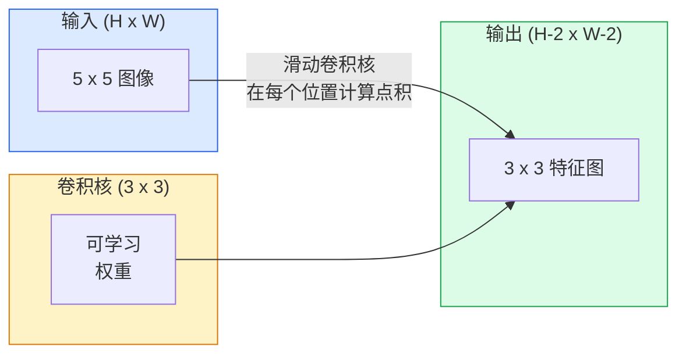
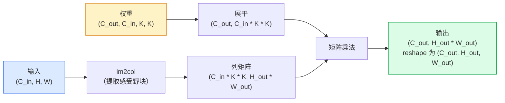

# 从零实现卷积

> 卷积是一个微型全连接层，你把它滑过整张图像，在每个位置共享同一套权重。

**类型：** 动手实现
**语言：** Python
**前置知识：** Phase 3（深度学习核心），Phase 4 第1课（图像基础）
**预计时间：** ~75分钟

## 学习目标

- 仅用 NumPy 从零实现 2D 卷积，包括嵌套循环版本和向量化的 `im2col` 版本
- 对任意输入尺寸、卷积核尺寸、填充和步幅的组合，计算输出的空间尺寸，并推导 `(H - K + 2P) / S + 1` 公式
- 手工设计卷积核（边缘检测、模糊、锐化、Sobel），并解释每种核为何产生其特有的激活模式
- 将多个卷积堆叠成特征提取器，并将堆叠深度与感受野大小联系起来

## 问题所在

对一张 224×224 的 RGB 图像使用全连接层，每个神经元需要 224 × 224 × 3 = 150,528 个输入权重。仅一个有 1,000 个神经元的隐藏层就已经有 1.5 亿个参数——在你学到任何有用的东西之前。更糟糕的是，那一层对左上角的狗和右下角的狗毫无概念，认为它们是同一个模式。它把每个像素位置视为独立的，而这对图像来说恰恰是错的：把一只猫平移三个像素，不应该逼着网络重新学习猫这个概念。

图像模型需要两个属性：**平移等变性**（输入平移时输出也随之平移）和**参数共享**（同一个特征检测器在所有位置运行）。全连接层两者都给不了，卷积则两者都免费奉送。

卷积不是为深度学习发明的，它是 JPEG 压缩、Photoshop 高斯模糊、工业视觉边缘检测以及每一个音频滤波器背后的同一个操作。CNN 从 2012 年到 2020 年主导 ImageNet 的原因在于，卷积对于邻近值有关联、且相同模式可以出现在任何位置的数据而言，是正确的归纳偏置。

## 核心概念

### 一个卷积核，滑动前进

2D 卷积取一个称为卷积核（或滤波器）的小型权重矩阵，在输入上滑动，在每个位置计算逐元素乘积之和。这个和成为一个输出像素。



一个 5×5 输入上 3×3 卷积核的具体例子（无填充，步幅为 1）：

```
输入 X (5 x 5):                卷积核 W (3 x 3):

  1  2  0  1  2                   1  0 -1
  0  1  3  1  0                   2  0 -2
  2  1  0  2  1                   1  0 -1
  1  0  2  1  3
  2  1  1  0  1

卷积核滑过每个有效的 3x3 窗口。输出 Y 为 3 x 3：

 Y[0,0] = sum( W * X[0:3, 0:3] )
 Y[0,1] = sum( W * X[0:3, 1:4] )
 Y[0,2] = sum( W * X[0:3, 2:5] )
 Y[1,0] = sum( W * X[1:4, 0:3] )
 ... 依此类推
```

这一个公式——**共享权重、局部性、滑动窗口**——就是全部思想。其他一切都是记账工作。

### 输出尺寸公式

给定输入空间尺寸 `H`，卷积核尺寸 `K`，填充 `P`，步幅 `S`：

```
H_out = floor( (H - K + 2P) / S ) + 1
```

记住这个公式。在设计架构时你会计算它数十次。

| 场景 | H | K | P | S | H_out |
|------|---|---|---|---|-------|
| 有效卷积，无填充 | 32 | 3 | 0 | 1 | 30 |
| 同尺寸卷积（保持大小） | 32 | 3 | 1 | 1 | 32 |
| 下采样2倍 | 32 | 3 | 1 | 2 | 16 |
| 2x2 池化 | 32 | 2 | 0 | 2 | 16 |
| 大感受野 | 32 | 7 | 3 | 2 | 16 |

「同尺寸填充」意味着当 S=1 时选择 P 使得 H_out == H。对于奇数 K，P = (K-1)/2。这就是为什么 3×3 核占主导——它是最小的奇数核，同时仍然有一个中心。

### 填充

不填充的话，每次卷积都会缩小特征图。叠 20 层后，你的 224×224 图像变成 184×184，浪费边界计算资源，并使需要形状匹配的残差连接变得复杂。

```
在 5x5 输入上进行零填充（P=1）：

  0  0  0  0  0  0  0
  0  1  2  0  1  2  0
  0  0  1  3  1  0  0
  0  2  1  0  2  1  0       现在卷积核可以以像素 (0, 0)
  0  1  0  2  1  3  0       为中心，仍然有三行三列的值可以相乘
  0  2  1  1  0  1  0
  0  0  0  0  0  0  0
```

实践中常见的模式：`zero`（最常见）、`reflect`（镜像边缘，避免生成模型中的硬边界）、`replicate`（复制边缘）、`circular`（环绕，用于环形拓扑问题）。

### 步幅

步幅是滑动的步长。`stride=1` 是默认值。`stride=2` 将空间维度减半，是在 CNN 内部下采样而不用单独池化层的经典方法——每个现代架构（ResNet、ConvNeXt、MobileNet）都在某处用步幅卷积替代最大池化。

```
5x5 输入，3x3 卷积核，步幅为 1：

  起始位置: (0,0) (0,1) (0,2)        -> 输出第0行
            (1,0) (1,1) (1,2)        -> 输出第1行
            (2,0) (2,1) (2,2)        -> 输出第2行

  输出: 3 x 3

同样的输入，步幅为 2：

  起始位置: (0,0) (0,2)              -> 输出第0行
            (2,0) (2,2)              -> 输出第1行

  输出: 2 x 2
```

### 多输入通道

真实图像有三个通道。对 RGB 输入的 3×3 卷积实际上是一个 3×3×3 的体积：每个输入通道一个 3×3 切片。在每个空间位置，你对所有三个切片做乘加，再加上偏置。

```
输入:   (C_in,  H,  W)        3 x 5 x 5
卷积核: (C_in,  K,  K)        3 x 3 x 3（一个卷积核）
输出:   (1,     H', W')       2D 特征图

对于产生 C_out 个输出通道的层，堆叠 C_out 个卷积核：

权重:  (C_out, C_in, K, K)   例如 64 x 3 x 3 x 3
输出:  (C_out, H', W')        64 x 3 x 3

参数量: C_out * C_in * K * K + C_out   （+ C_out 是偏置）
```

最后一行是规划模型时需要计算的。一个 3 通道输入上的 64 通道 3×3 卷积有 `64 * 3 * 3 * 3 + 64 = 1,792` 个参数，非常经济。

### im2col 技巧

嵌套循环易读但慢。GPU 需要大矩阵乘法。技巧是：将输入中每个感受野窗口展平成一个大矩阵的一列，将卷积核展平成一行，整个卷积就变成了一次矩阵乘法。



每个生产级卷积实现都是这个方案加上缓存分块技巧（直接卷积、Winograd、大核的 FFT 卷积）的某种变体。理解 im2col，就理解了核心。

### 感受野

单个 3×3 卷积看到 9 个输入像素。堆叠两个 3×3 卷积，第二层的一个神经元看到 5×5 的输入像素。三个 3×3 卷积给出 7×7。一般而言：

```
L 个堆叠的 K x K 卷积（步幅为1）后的感受野 = 1 + L * (K - 1)

有步幅时：感受野随每层的步幅倍增。
```

「一路用 3×3」之所以有效（VGG、ResNet、ConvNeXt），正是因为两个 3×3 卷积与一个 5×5 卷积的感受野相同，但参数更少，中间还多了一个非线性变换。

## 动手实现

### 第1步：填充数组

从最小的原语开始：一个在 H×W 数组周围用零填充的函数。

```python
import numpy as np

def pad2d(x, p):
    if p == 0:
        return x
    h, w = x.shape[-2:]
    out = np.zeros(x.shape[:-2] + (h + 2 * p, w + 2 * p), dtype=x.dtype)
    out[..., p:p + h, p:p + w] = x
    return out

x = np.arange(9).reshape(3, 3)
print(x)
print()
print(pad2d(x, 1))
```

末尾轴的技巧 `x.shape[:-2]` 意味着同一个函数可以处理 `(H, W)`、`(C, H, W)` 或 `(N, C, H, W)`，无需修改。

### 第2步：嵌套循环的 2D 卷积

参考实现——慢，但清晰无歧义。这就是 `torch.nn.functional.conv2d` 在原理上做的事情。

```python
def conv2d_naive(x, w, b=None, stride=1, padding=0):
    c_in, h, w_in = x.shape
    c_out, c_in_w, kh, kw = w.shape
    assert c_in == c_in_w

    x_pad = pad2d(x, padding)
    h_out = (h + 2 * padding - kh) // stride + 1
    w_out = (w_in + 2 * padding - kw) // stride + 1

    out = np.zeros((c_out, h_out, w_out), dtype=np.float32)
    for oc in range(c_out):
        for i in range(h_out):
            for j in range(w_out):
                hs = i * stride
                ws = j * stride
                patch = x_pad[:, hs:hs + kh, ws:ws + kw]
                out[oc, i, j] = np.sum(patch * w[oc])
        if b is not None:
            out[oc] += b[oc]
    return out
```

四层嵌套循环（输出通道、行、列，加上对 C_in、kh、kw 的隐式求和）。这是你用来验证每个更快实现的基准真相。

### 第3步：用手工设计的卷积核验证

构建一个垂直 Sobel 核，将其应用于一张合成的阶跃图像，观察垂直边缘亮起来。

```python
def synthetic_step_image():
    img = np.zeros((1, 16, 16), dtype=np.float32)
    img[:, :, 8:] = 1.0
    return img

sobel_x = np.array([
    [[-1, 0, 1],
     [-2, 0, 2],
     [-1, 0, 1]]
], dtype=np.float32)[None]

x = synthetic_step_image()
y = conv2d_naive(x, sobel_x, padding=1)
print(y[0].round(1))
```

期望在第 7 列（从左到右亮度增加）出现大的正值，其他地方为零。这一次打印就是你确认数学正确的健全检查。

### 第4步：im2col

将输入中每个核大小的窗口转换为矩阵的一列。对于 `C_in=3, K=3`，每列有 27 个数。

```python
def im2col(x, kh, kw, stride=1, padding=0):
    c_in, h, w = x.shape
    x_pad = pad2d(x, padding)
    h_out = (h + 2 * padding - kh) // stride + 1
    w_out = (w + 2 * padding - kw) // stride + 1

    cols = np.zeros((c_in * kh * kw, h_out * w_out), dtype=x.dtype)
    col = 0
    for i in range(h_out):
        for j in range(w_out):
            hs = i * stride
            ws = j * stride
            patch = x_pad[:, hs:hs + kh, ws:ws + kw]
            cols[:, col] = patch.reshape(-1)
            col += 1
    return cols, h_out, w_out
```

它仍然是 Python 循环，但现在繁重的计算将通过一次向量化的矩阵乘法完成。

### 第5步：用 im2col + 矩阵乘法实现快速卷积

用一次矩阵乘法替换四层循环。

```python
def conv2d_im2col(x, w, b=None, stride=1, padding=0):
    c_out, c_in, kh, kw = w.shape
    cols, h_out, w_out = im2col(x, kh, kw, stride, padding)
    w_flat = w.reshape(c_out, -1)
    out = w_flat @ cols
    if b is not None:
        out += b[:, None]
    return out.reshape(c_out, h_out, w_out)
```

正确性检查：运行两种实现并进行比较。

```python
rng = np.random.default_rng(0)
x = rng.normal(0, 1, (3, 16, 16)).astype(np.float32)
w = rng.normal(0, 1, (8, 3, 3, 3)).astype(np.float32)
b = rng.normal(0, 1, (8,)).astype(np.float32)

y_naive = conv2d_naive(x, w, b, padding=1)
y_im2col = conv2d_im2col(x, w, b, padding=1)

print(f"max abs diff: {np.max(np.abs(y_naive - y_im2col)):.2e}")
```

`max abs diff` 应该在 `1e-5` 左右——差异来自浮点累加顺序，不是 bug。

### 第6步：手工设计的卷积核集合

五种滤波器，展示单个卷积层在训练之前能表达什么。

```python
KERNELS = {
    "identity": np.array([[0, 0, 0], [0, 1, 0], [0, 0, 0]], dtype=np.float32),
    "blur_3x3": np.ones((3, 3), dtype=np.float32) / 9.0,
    "sharpen": np.array([[0, -1, 0], [-1, 5, -1], [0, -1, 0]], dtype=np.float32),
    "sobel_x": np.array([[-1, 0, 1], [-2, 0, 2], [-1, 0, 1]], dtype=np.float32),
    "sobel_y": np.array([[-1, -2, -1], [0, 0, 0], [1, 2, 1]], dtype=np.float32),
}

def apply_kernel(img2d, kernel):
    x = img2d[None].astype(np.float32)
    w = kernel[None, None]
    return conv2d_im2col(x, w, padding=1)[0]
```

应用于任何灰度图像：模糊会柔化，锐化会加强边缘，Sobel-x 会点亮垂直边缘，Sobel-y 会点亮水平边缘。这些正是 AlexNet 和 VGG 中*第一个*训练过的卷积层最终学到的模式——因为一个好的图像模型无论执行什么任务，都需要边缘和团块检测器。

## 实际使用

PyTorch 的 `nn.Conv2d` 将同样的操作封装了自动微分、CUDA 核和 cuDNN 优化。形状语义完全相同。

```python
import torch
import torch.nn as nn

conv = nn.Conv2d(in_channels=3, out_channels=64, kernel_size=3, stride=1, padding=1)
print(conv)
print(f"weight shape: {tuple(conv.weight.shape)}   # (C_out, C_in, K, K)")
print(f"bias shape:   {tuple(conv.bias.shape)}")
print(f"param count:  {sum(p.numel() for p in conv.parameters())}")

x = torch.randn(8, 3, 224, 224)
y = conv(x)
print(f"\ninput  shape: {tuple(x.shape)}")
print(f"output shape: {tuple(y.shape)}")
```

把 `padding=1` 换成 `padding=0`，输出变成 222×222。把 `stride=1` 换成 `stride=2`，变成 112×112。与你记住的公式完全一致。

## 练习

1. **(简单)** 对一个 128×128 灰度输入和一个 `[Conv3x3(s=1,p=1), Conv3x3(s=2,p=1), Conv3x3(s=1,p=1), Conv3x3(s=2,p=1)]` 的堆叠，手工计算每层的输出空间尺寸和感受野。用 PyTorch 的 `nn.Sequential` 虚设卷积层进行验证。
2. **(中等)** 扩展 `conv2d_naive` 和 `conv2d_im2col`，使其接受 `groups` 参数。证明 `groups=C_in=C_out` 能复现深度可分卷积，其参数量为 `C * K * K` 而非 `C * C * K * K`。
3. **(困难)** 手工实现 `conv2d_im2col` 的反向传播：给定输出的梯度，计算 `x` 和 `w` 的梯度。与相同输入和权重上的 `torch.autograd.grad` 进行验证。技巧：im2col 的梯度是 `col2im`，它需要对重叠的窗口进行累加。

## 关键术语

| 术语 | 通常的说法 | 准确含义 |
|------|-----------|---------|
| 卷积 (Convolution) | 「滑动一个滤波器」 | 在每个空间位置上应用共享权重的可学习点积；数学上是互相关，但大家都叫它卷积 |
| 卷积核/滤波器 (Kernel / filter) | 「特征检测器」 | 形状为 (C_in, K, K) 的小型权重张量，与输入的一个窗口做点积得到一个输出像素 |
| 步幅 (Stride) | 「跳跃的距离」 | 连续卷积核放置位置之间的步长；步幅为 2 将每个空间维度减半 |
| 填充 (Padding) | 「边缘补零」 | 在输入周围添加额外值，使卷积核可以以边界像素为中心；`same` 填充使输出尺寸等于输入尺寸 |
| 感受野 (Receptive field) | 「神经元能看到多少」 | 给定输出激活所依赖的原始输入区域，随深度和步幅增长 |
| im2col | 「GEMM 技巧」 | 将每个感受野窗口重排成列，使卷积变成一次大矩阵乘法——每个快速卷积核的核心 |
| 深度可分卷积 (Depthwise conv) | 「每个通道一个核」 | `groups == C_in` 的卷积，仅从对应的输入通道计算每个输出通道；MobileNet 和 ConvNeXt 的骨干 |
| 平移等变性 (Translation equivariance) | 「输入平移，输出也平移」 | 输入平移 k 个像素时输出也平移 k 个像素的属性；共享权重的免费赠品 |

## 延伸阅读

- [A guide to convolution arithmetic for deep learning (Dumoulin & Visin, 2016)](https://arxiv.org/abs/1603.07285) — 关于填充/步幅/扩张的权威图解，每门课都在悄悄参考
- [CS231n: Convolutional Neural Networks for Visual Recognition](https://cs231n.github.io/convolutional-networks/) — 经典讲义，包含原始的 im2col 解释
- [The Annotated ConvNet (fast.ai)](https://nbviewer.org/github/fastai/fastbook/blob/master/13_convolutions.ipynb) — 从手工卷积到训练好的数字分类器的完整 notebook
- [Receptive Field Arithmetic for CNNs (Dang Ha The Hien)](https://distill.pub/2019/computing-receptive-fields/) — 论文级质量的感受野计算交互式讲解
