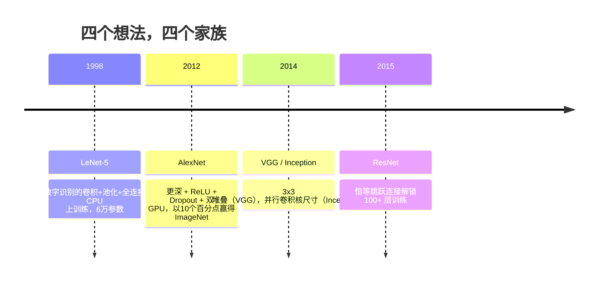
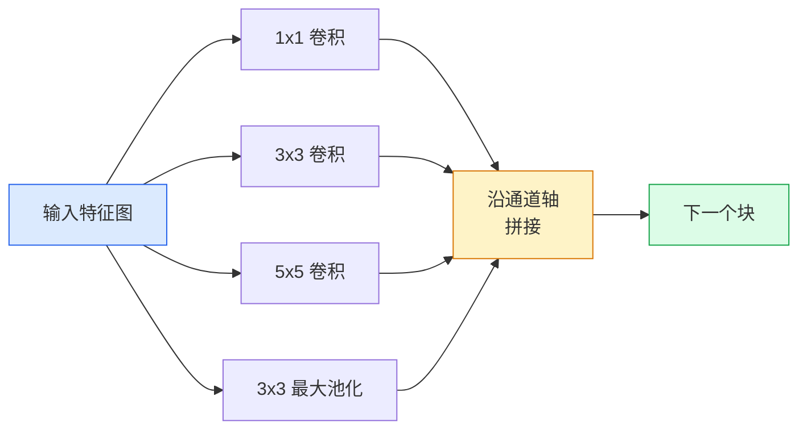
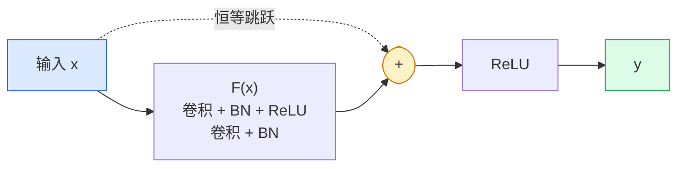

# CNN 进化史：从 LeNet 到 ResNet

> 过去三十年里每一个重要的 CNN，都是同一套卷积-非线性-下采样方案，加上一个新想法。按顺序学这些想法。

**类型：** 学习 + 动手实现
**语言：** Python
**前置知识：** Phase 3 第11课（PyTorch），Phase 4 第1课（图像基础），Phase 4 第2课（从零实现卷积）
**预计时间：** ~75分钟

## 学习目标

- 梳理 LeNet-5 → AlexNet → VGG → Inception → ResNet 的架构传承，并说出每个家族贡献的那一个核心新想法
- 用 PyTorch 实现 LeNet-5、VGG 风格块和 ResNet BasicBlock，每个不超过 40 行
- 解释为什么残差连接能把一个 1000 层网络从无法训练变成最先进水平
- 阅读一个现代骨干网络（ResNet-18、ResNet-50），在查看源码之前预测其输出形状、感受野和参数量

## 问题所在

2011 年，最好的 ImageNet 分类器的 top-5 准确率约为 74%。2012 年 AlexNet 达到 85%。2015 年 ResNet 达到 96%。没有新数据，没有新 GPU 世代，进步来自架构想法。一个能打仗的视觉工程师必须知道哪个想法来自哪篇论文，因为你在 2026 年发布的每个生产骨干网络，都是这些同样零件的重组——而且这些想法不断迁移：分组卷积从 CNN 转移到了 Transformer，残差连接从 ResNet 转移到了每个现存的 LLM，批归一化活在扩散模型里。

按顺序研究这些网络，还能让你免疫一个常见错误：明明 LeNet 大小的网络就能解决问题，却去拿最大的可用模型。MNIST 不需要 ResNet。知道每个家族的缩放曲线，才能判断自己该坐在曲线的哪个位置。

## 核心概念

### 改变视觉领域的四个想法



在经典视觉领域，没有任何东西像这四次跳跃一样重要。

### LeNet-5（1998）

Yann LeCun 的数字识别器。60,000 个参数。两个卷积-池化块，两个全连接层，tanh 激活。它定义了每个 CNN 都继承的模板：

```
输入 (1, 32, 32)
  conv 5x5 -> (6, 28, 28)
  avg pool 2x2 -> (6, 14, 14)
  conv 5x5 -> (16, 10, 10)
  avg pool 2x2 -> (16, 5, 5)
  flatten -> 400
  dense -> 120
  dense -> 84
  dense -> 10
```

现代世界所说的 CNN——交替的卷积和下采样，输入一个小型分类头——就是 LeNet 加上更多层、更大的通道数和更好的激活函数。

### AlexNet（2012）

三个合在一起打破了 ImageNet 的改变：

1. **ReLU** 代替 tanh。梯度不再消失，训练速度快了六倍。
2. **Dropout** 在全连接头中。正则化变成了一个层，而不是一个技巧。
3. **深度和宽度**。五个卷积层，三个全连接层，6000 万参数，用两块 GPU 跨卡分割训练。

论文的图 2 仍然展示了 GPU 分割的两条并行流。那种并行性是一个硬件权宜之计，不是架构洞见——但上面三个想法至今仍在你使用的每个模型中。

### VGG（2014）

VGG 问道：如果只用 3×3 卷积并且一直往深处走，会发生什么？

```
堆叠: conv 3x3 -> conv 3x3 -> pool 2x2
重复: 16 或 19 个卷积层
```

两个 3×3 卷积看到与一个 5×5 卷积相同的输入区域，但参数更少（2×9×C² = 18C² vs 25×C²），中间还多了一个 ReLU。VGG 把这个观察做成了一整个架构。这种简洁——一种块类型，反复堆叠——使它成为之后所有东西的参照点。

代价：1.38 亿参数，训练慢，推理贵。

### Inception（2014，同年）

谷歌对「该用什么尺寸的卷积核？」的回答是：全部都用，并行运行。



每个分支专注于不同的事情——1×1 用于通道混合，3×3 用于局部纹理，5×5 用于更大的模式，池化用于平移不变特征——拼接让下一层可以选择有用的分支。Inception v1 在每个分支内部用 1×1 卷积作为瓶颈以控制参数量。

### 退化问题

到 2015 年，VGG-19 能工作，但 VGG-32 不行。深度本应有帮助，但超过约 20 层后，训练损失和测试损失都变得更差了。这不是过拟合，这是优化器在失败——梯度在每一层都乘法地缩小，找不到有用的权重。

```
普通深层网络:
  y = f_L( f_{L-1}( ... f_1(x) ... ) )

关于早期层的梯度:
  dL/dW_1 = dL/dy * df_L/df_{L-1} * ... * df_2/df_1 * df_1/dW_1

每个乘法项的量级大约是（权重量级）×（激活增益）。
叠 100 个增益 < 1 的项，梯度实际上变成零了。
```

VGG 在 19 层能工作，是因为批归一化（同期发表）保持了激活的良好尺度。但即便是批归一化也无法拯救超过约 30 层的深度。

### ResNet（2015）

何恺明、张祥雨、任少卿、孙剑提出了一个改变了一切的修改：

```
标准块:   y = F(x)
残差块:   y = F(x) + x
```

`+ x` 意味着层总是可以通过将 `F(x)` 驱动到零来选择什么都不做。一个 1000 层的 ResNet，现在最多与一个 1 层网络一样差，因为每个额外的块都有一个微不足道的逃生口。有了这个保证，优化器愿意让每个块变得*稍微*有用——而稍微有用，叠 100 次，就是最先进水平。



块的两种变体随处可见：

- **BasicBlock**（ResNet-18、ResNet-34）：两个 3×3 卷积，跳跃连接跨越两者。
- **Bottleneck**（ResNet-50、-101、-152）：1×1 降维，3×3 中间层，1×1 升维，跳跃连接跨越三者。当通道数较高时更经济。

当跳跃连接需要跨越下采样（stride=2）时，恒等路径被替换为一个 1×1 stride=2 的卷积以匹配形状。

### 为什么残差连接的意义超越视觉领域

这个想法本质上不是关于图像分类的，而是关于把深层网络从「交叉手指希望梯度能活下来」变成可靠、可扩展的工程工具。你在下一个 Phase 读到的每个 Transformer，在每个块中都有完全相同的跳跃连接。没有 ResNet，就没有 GPT。

## 动手实现

### 第1步：LeNet-5

一个最小、忠实的 LeNet。Tanh 激活，平均池化。唯一向现代的妥协是，我们在下游使用 `nn.CrossEntropyLoss` 而非原始的高斯连接。

```python
import torch
import torch.nn as nn
import torch.nn.functional as F

class LeNet5(nn.Module):
    def __init__(self, num_classes=10):
        super().__init__()
        self.conv1 = nn.Conv2d(1, 6, kernel_size=5)
        self.conv2 = nn.Conv2d(6, 16, kernel_size=5)
        self.pool = nn.AvgPool2d(2)
        self.fc1 = nn.Linear(16 * 5 * 5, 120)
        self.fc2 = nn.Linear(120, 84)
        self.fc3 = nn.Linear(84, num_classes)

    def forward(self, x):
        x = self.pool(torch.tanh(self.conv1(x)))
        x = self.pool(torch.tanh(self.conv2(x)))
        x = torch.flatten(x, 1)
        x = torch.tanh(self.fc1(x))
        x = torch.tanh(self.fc2(x))
        return self.fc3(x)

net = LeNet5()
x = torch.randn(1, 1, 32, 32)
print(f"output: {net(x).shape}")
print(f"params: {sum(p.numel() for p in net.parameters()):,}")
```

预期输出：`output: torch.Size([1, 10])`，`params: 61,706`。这就是开启现代视觉的完整数字分类器。

### 第2步：一个 VGG 块

一个可复用的块：两个 3×3 卷积，ReLU，批归一化，最大池化。

```python
class VGGBlock(nn.Module):
    def __init__(self, in_c, out_c):
        super().__init__()
        self.conv1 = nn.Conv2d(in_c, out_c, kernel_size=3, padding=1)
        self.bn1 = nn.BatchNorm2d(out_c)
        self.conv2 = nn.Conv2d(out_c, out_c, kernel_size=3, padding=1)
        self.bn2 = nn.BatchNorm2d(out_c)
        self.pool = nn.MaxPool2d(2)

    def forward(self, x):
        x = F.relu(self.bn1(self.conv1(x)))
        x = F.relu(self.bn2(self.conv2(x)))
        return self.pool(x)

class MiniVGG(nn.Module):
    def __init__(self, num_classes=10):
        super().__init__()
        self.stack = nn.Sequential(
            VGGBlock(3, 32),
            VGGBlock(32, 64),
            VGGBlock(64, 128),
        )
        self.head = nn.Sequential(
            nn.AdaptiveAvgPool2d(1),
            nn.Flatten(),
            nn.Linear(128, num_classes),
        )

    def forward(self, x):
        return self.head(self.stack(x))

net = MiniVGG()
x = torch.randn(1, 3, 32, 32)
print(f"output: {net(x).shape}")
print(f"params: {sum(p.numel() for p in net.parameters()):,}")
```

三个 VGG 块处理 CIFAR 大小的输入，一个自适应池化，一个线性层。约 29 万参数，足以处理 CIFAR-10。

### 第3步：ResNet BasicBlock

ResNet-18 和 ResNet-34 的核心构建块。

```python
class BasicBlock(nn.Module):
    def __init__(self, in_c, out_c, stride=1):
        super().__init__()
        self.conv1 = nn.Conv2d(in_c, out_c, kernel_size=3, stride=stride, padding=1, bias=False)
        self.bn1 = nn.BatchNorm2d(out_c)
        self.conv2 = nn.Conv2d(out_c, out_c, kernel_size=3, stride=1, padding=1, bias=False)
        self.bn2 = nn.BatchNorm2d(out_c)
        if stride != 1 or in_c != out_c:
            self.shortcut = nn.Sequential(
                nn.Conv2d(in_c, out_c, kernel_size=1, stride=stride, bias=False),
                nn.BatchNorm2d(out_c),
            )
        else:
            self.shortcut = nn.Identity()

    def forward(self, x):
        out = F.relu(self.bn1(self.conv1(x)))
        out = self.bn2(self.conv2(out))
        out = out + self.shortcut(x)
        return F.relu(out)
```

卷积层上的 `bias=False` 是批归一化的约定——BN 的 beta 参数已经处理了偏置，再带一个卷积偏置是浪费。只有在步幅或通道数变化时，`shortcut` 才需要真正的卷积；否则它是一个无操作的恒等。

### 第4步：一个小型 ResNet

将四组 BasicBlock 堆叠起来，得到一个适用于 CIFAR 大小输入的可工作 ResNet。

```python
class TinyResNet(nn.Module):
    def __init__(self, num_classes=10):
        super().__init__()
        self.stem = nn.Sequential(
            nn.Conv2d(3, 32, kernel_size=3, stride=1, padding=1, bias=False),
            nn.BatchNorm2d(32),
            nn.ReLU(inplace=True),
        )
        self.layer1 = self._make_group(32, 32, num_blocks=2, stride=1)
        self.layer2 = self._make_group(32, 64, num_blocks=2, stride=2)
        self.layer3 = self._make_group(64, 128, num_blocks=2, stride=2)
        self.layer4 = self._make_group(128, 256, num_blocks=2, stride=2)
        self.head = nn.Sequential(
            nn.AdaptiveAvgPool2d(1),
            nn.Flatten(),
            nn.Linear(256, num_classes),
        )

    def _make_group(self, in_c, out_c, num_blocks, stride):
        blocks = [BasicBlock(in_c, out_c, stride=stride)]
        for _ in range(num_blocks - 1):
            blocks.append(BasicBlock(out_c, out_c, stride=1))
        return nn.Sequential(*blocks)

    def forward(self, x):
        x = self.stem(x)
        x = self.layer1(x)
        x = self.layer2(x)
        x = self.layer3(x)
        x = self.layer4(x)
        return self.head(x)

net = TinyResNet()
x = torch.randn(1, 3, 32, 32)
print(f"output: {net(x).shape}")
print(f"params: {sum(p.numel() for p in net.parameters()):,}")
```

每组两个块，共四组。在第 2、3、4 组开始时步幅为 2，每次下采样时通道数翻倍。约 280 万参数。这就是可以干净地扩展到 ResNet-152 的标准方案。

### 第5步：比较参数与特征效率

将相同输入传入三个网络，比较参数量。

```python
def summary(name, net, x):
    y = net(x)
    params = sum(p.numel() for p in net.parameters())
    print(f"{name:12s}  input {tuple(x.shape)} -> output {tuple(y.shape)}  params {params:>10,}")

x = torch.randn(1, 3, 32, 32)
summary("LeNet5",     LeNet5(),       torch.randn(1, 1, 32, 32))
summary("MiniVGG",    MiniVGG(),      x)
summary("TinyResNet", TinyResNet(),   x)
```

三个模型，三个时代，参数量相差三个数量级。对于 CIFAR-10 准确率，粗略地说：LeNet 60%，MiniVGG 89%，TinyResNet 训练几轮后 93%。

## 实际使用

`torchvision.models` 提供上述所有网络的预训练版本。调用签名在所有家族中完全相同，这正是骨干网络抽象的意义所在。

```python
from torchvision.models import resnet18, ResNet18_Weights, vgg16, VGG16_Weights

r18 = resnet18(weights=ResNet18_Weights.IMAGENET1K_V1)
r18.eval()

print(f"ResNet-18 params: {sum(p.numel() for p in r18.parameters()):,}")
print(r18.layer1[0])
print()

v16 = vgg16(weights=VGG16_Weights.IMAGENET1K_V1)
v16.eval()
print(f"VGG-16   params: {sum(p.numel() for p in v16.parameters()):,}")
```

ResNet-18 有 1170 万参数，VGG-16 有 1.38 亿。ImageNet top-1 准确率相近（69.8% vs 71.6%）。残差连接带来了 12 倍的参数效率提升。这就是为什么 ResNet 变体从 2016 年统治到 2021 年 ViT 出现——至今仍在计算资源受限的真实部署中占主导。

迁移学习的方案始终相同：加载预训练，冻结骨干，替换分类头。

```python
for p in r18.parameters():
    p.requires_grad = False
r18.fc = nn.Linear(r18.fc.in_features, 10)
```

三行代码。你现在有了一个继承了 ImageNet 所花代价得来的表示的 10 类 CIFAR 分类器。

## 练习

1. **(简单)** 逐层手工计算 `TinyResNet` 的参数量。与 `sum(p.numel() for p in net.parameters())` 的结果对比。参数预算的大部分去了哪里——卷积、BN 还是分类头？
2. **(中等)** 实现 Bottleneck 块（1×1 → 3×3 → 1×1 加跳跃连接），并用它为 CIFAR 构建 ResNet-50 风格的网络。将参数量与 `TinyResNet` 对比。
3. **(困难)** 从 `BasicBlock` 中移除跳跃连接，在 CIFAR-10 上各训练一个 34 块「普通」网络和一个 34 块 ResNet，各训练 10 轮。绘制两者的训练损失-轮次曲线。复现 He 等人论文图 1 中普通深层网络收敛到比其更浅孪生网络更高损失的结果。

## 关键术语

| 术语 | 通常的说法 | 准确含义 |
|------|-----------|---------|
| 骨干网络 (Backbone) | 「模型」 | 产生特征图送入任务头的卷积块堆叠 |
| 残差连接 (Residual connection) | 「跳跃连接」 | `y = F(x) + x`；让优化器可以通过将 F 置零来学习恒等，从而使任意深度可训练 |
| BasicBlock | 「两个 3×3 卷积加跳跃」 | ResNet-18/34 的构建块：卷积-BN-ReLU-卷积-BN-相加-ReLU |
| Bottleneck | 「1×1 降维，3×3，1×1 升维」 | ResNet-50/101/152 的块；在通道数较高时更经济，因为 3×3 在较窄的宽度上运行 |
| 退化问题 (Degradation problem) | 「越深越差」 | 超过约 20 个普通卷积层后，训练和测试误差都会增加；由残差连接解决，而非更多数据 |
| 主干 (Stem) | 「第一层」 | 将 3 通道输入转换为基础特征宽度的初始卷积；ImageNet 通常是 7×7 步幅 2，CIFAR 是 3×3 步幅 1 |
| 分类头 (Head) | 「分类器」 | 最终骨干块之后的层：自适应池化、展平、线性层 |
| 迁移学习 (Transfer learning) | 「预训练权重」 | 加载在 ImageNet 上训练的骨干，仅对你的任务微调分类头 |

## 延伸阅读

- [Deep Residual Learning for Image Recognition (He et al., 2015)](https://arxiv.org/abs/1512.03385) — ResNet 论文；每张图都值得研究
- [Very Deep Convolutional Networks (Simonyan & Zisserman, 2014)](https://arxiv.org/abs/1409.1556) — VGG 论文；「为什么用 3×3」的最佳参考
- [ImageNet Classification with Deep CNNs (Krizhevsky et al., 2012)](https://papers.nips.cc/paper_files/paper/2012/hash/c399862d3b9d6b76c8436e924a68c45b-Abstract.html) — AlexNet；终结手工特征时代的论文
- [Going Deeper with Convolutions (Szegedy et al., 2014)](https://arxiv.org/abs/1409.4842) — Inception v1；并行滤波器的想法至今仍出现在视觉 Transformer 中
