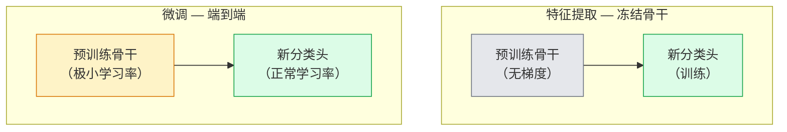

# 迁移学习与微调

> 别人已经花了一百万 GPU 小时教一个网络识别边缘、纹理和物体部件。在训练自己的之前，你应该先借用那些特征。

**类型：** 动手实现
**语言：** Python
**前置知识：** Phase 4 第3课（CNN），Phase 4 第4课（图像分类）
**预计时间：** ~75分钟

## 学习目标

- 区分特征提取与微调，并根据数据集大小、领域距离和计算预算选择合适的方案
- 加载预训练骨干网络，替换其分类头，并在 20 行以内仅训练分类头到可用的基线
- 使用分层学习率逐步解冻层，使早期的通用特征获得比后期任务特定特征更小的更新
- 诊断三种常见失败：解冻块上过高学习率导致的特征漂移、小数据集上的 BN 统计量崩溃，以及灾难性遗忘

## 问题所在

在 ImageNet 上训练 ResNet-50 大约需要 2000 GPU 小时。很少有团队有足够的预算为每个要发布的任务都这样做。几乎每个团队实际发布的，都是带有新分类头的预训练骨干，这个头在几百到几千张特定任务图像上训练。

这不是走捷径。任何 ImageNet 训练的 CNN 的第一个卷积块学习边缘和类 Gabor 滤波器。接下来的几个块学习纹理和简单图案。中间块学习物体部件。最后几块学习开始像 1000 个 ImageNet 类别的组合。那个层次结构的前 90% 几乎不加修改地迁移到医学成像、工业检测、卫星数据，以及几乎所有其他视觉任务——因为自然界的边缘和纹理词汇是有限的。你实际训练的是后 10%。

正确做好迁移学习有三个潜伏的 bug：用过高的学习率破坏预训练特征、冻结太多而让模型信息匮乏，以及让 BatchNorm 的运行统计量向网络其余部分从未从中学习过的小数据集漂移。本课故意一一走过这些问题。

## 核心概念

### 特征提取 vs 微调

两种模式，由你对预训练特征的信任程度和数据量来决定。



经验法则：

| 数据集大小 | 与 ImageNet 的领域距离 | 方案 |
|-----------|---------------------|------|
| < 1千张 | 接近 ImageNet | 冻结骨干，仅训练分类头 |
| 1千-1万 | 接近 | 冻结前 2-3 个阶段，微调其余部分 |
| 1万-10万 | 任意 | 用分层学习率端到端微调 |
| 10万+ | 较远 | 微调所有层；如果领域足够远，考虑从头训练 |

「接近 ImageNet」大致意味着有物体内容的自然 RGB 照片。医学 CT 扫描、俯视卫星图像和显微镜图像属于远领域——特征仍有帮助，但你需要让更多层进行适应。

### 为什么冻结有效

CNN 从 ImageNet 学到的特征不是专门针对 1000 个类别的。它们专门针对自然图像的统计特性：特定方向的边缘、纹理、对比度模式、形状基元。这些统计特性在人类能命名的几乎所有视觉领域中都是稳定的。这就是为什么一个在 ImageNet 上训练的模型，仅用一个新的线性头（不微调骨干）进行零样本迁移，在 CIFAR-10 上就能达到 80%+ 的准确率。分类头在学习对这个任务要加权哪些已学到的特征。

### 分层学习率

当你确实要解冻时，早期层应该比晚期层训练得更慢。早期层编码你想保留的通用特征；晚期层编码你需要大量调整的任务特定结构。

```
典型方案：

  第0阶段（主干 + 第一组）: lr = base_lr / 100    （基本固定）
  第1阶段:                   lr = base_lr / 10
  第2阶段:                   lr = base_lr / 3
  第3阶段（最后一个骨干组）: lr = base_lr
  分类头:                    lr = base_lr  （或稍高）
```

在 PyTorch 中，这只是传递给优化器的参数组列表。一个模型，五个学习率，零额外代码。

### BatchNorm 问题

BN 层持有在 ImageNet 上计算的 `running_mean` 和 `running_var` 缓冲区。如果你的任务有不同的像素分布——不同的光照、不同的传感器、不同的色彩空间——那些缓冲区是错误的。按优先顺序的三个选项：

1. **以 train 模式进行微调 BN。** 让 BN 随其他所有东西一起更新其运行统计量。当任务数据集中等大小（>= 5000 个样本）时是默认选择。
2. **以 eval 模式冻结 BN。** 保留 ImageNet 统计量，只训练权重。当你的数据集小到 BN 的移动平均会有噪声时是正确选择。
3. **用 GroupNorm 替换 BN。** 完全消除移动平均问题。用于每个 GPU 批大小极小的检测和分割骨干。

搞错这一点会悄悄降低 5-15% 的准确率。

### 分类头设计

分类头是 1-3 个线性层加上可选的 dropout。每个 torchvision 骨干都附带一个你需要替换的默认头：

```
backbone.fc = nn.Linear(backbone.fc.in_features, num_classes)          # ResNet
backbone.classifier[1] = nn.Linear(..., num_classes)                    # EfficientNet, MobileNet
backbone.heads.head = nn.Linear(..., num_classes)                       # torchvision ViT
```

对于小数据集，单个线性层通常就足够了。当任务分布与骨干训练分布相差较远时，添加一个隐藏层（Linear → ReLU → Dropout → Linear）会有帮助。

### 逐层学习率衰减

现代微调中使用的更平滑的分层学习率版本（BEiT、DINOv2、ViT-B 微调）。不是将层分组为阶段，而是给每一层一个略小于上一层的学习率：

```
lr_layer_k = base_lr * decay^(L - k)
```

当 decay = 0.75，L = 12 个 Transformer 块时，第一个块以 `0.75^11 ≈ 0.04x` 的分类头学习率训练。对 Transformer 微调比对 CNN 更重要，在 CNN 中按阶段分组学习率通常足够了。

### 要评估什么

迁移学习运行需要从头训练时不会跟踪的两个数字：

- **仅预训练准确率** — 冻结骨干时分类头的准确率。这是你的下限。
- **微调准确率** — 端到端训练后同一模型的准确率。这是你的上限。

如果微调后低于仅预训练，你有学习率或 BN 的 bug。始终打印两者。

## 动手实现

### 第1步：加载预训练骨干并检查它

```python
import torch
import torch.nn as nn
from torchvision.models import resnet18, ResNet18_Weights

backbone = resnet18(weights=ResNet18_Weights.IMAGENET1K_V1)
print(backbone)
print()
print("classifier head:", backbone.fc)
print("feature dim:", backbone.fc.in_features)
```

`ResNet18` 有四个阶段（`layer1..layer4`）加上一个主干和一个 `fc` 分类头。每个 torchvision 分类骨干都有类似的结构。

### 第2步：特征提取——冻结一切，替换分类头

```python
def make_feature_extractor(num_classes=10):
    model = resnet18(weights=ResNet18_Weights.IMAGENET1K_V1)
    for p in model.parameters():
        p.requires_grad = False
    model.fc = nn.Linear(model.fc.in_features, num_classes)
    return model

model = make_feature_extractor(num_classes=10)
trainable = sum(p.numel() for p in model.parameters() if p.requires_grad)
frozen = sum(p.numel() for p in model.parameters() if not p.requires_grad)
print(f"trainable: {trainable:>10,}")
print(f"frozen:    {frozen:>10,}")
```

只有 `model.fc` 是可训练的。骨干是一个冻结的特征提取器。

### 第3步：分层微调

构建具有阶段特定学习率的参数组的工具函数。

```python
def discriminative_param_groups(model, base_lr=1e-3, decay=0.3):
    stages = [
        ["conv1", "bn1"],
        ["layer1"],
        ["layer2"],
        ["layer3"],
        ["layer4"],
        ["fc"],
    ]
    groups = []
    for i, names in enumerate(stages):
        lr = base_lr * (decay ** (len(stages) - 1 - i))
        params = [p for n, p in model.named_parameters()
                  if any(n.startswith(k) for k in names)]
        if params:
            groups.append({"params": params, "lr": lr, "name": "_".join(names)})
    return groups

model = resnet18(weights=ResNet18_Weights.IMAGENET1K_V1)
model.fc = nn.Linear(model.fc.in_features, 10)
for p in model.parameters():
    p.requires_grad = True

groups = discriminative_param_groups(model)
for g in groups:
    print(f"{g['name']:>10s}  lr={g['lr']:.2e}  params={sum(p.numel() for p in g['params']):>8,}")
```

`decay=0.3` 意味着每个阶段以下一阶段 30% 的速度训练。`fc` 获得 `base_lr`，`layer4` 获得 `0.3 * base_lr`，`conv1` 获得 `0.3^5 * base_lr ≈ 0.00243 * base_lr`。听起来极端；经验上是有效的。

### 第4步：BatchNorm 处理

在不冻结 BN 权重的情况下冻结 BN 运行统计量的辅助函数。

```python
def freeze_bn_stats(model):
    for m in model.modules():
        if isinstance(m, (nn.BatchNorm1d, nn.BatchNorm2d, nn.BatchNorm3d)):
            m.eval()
            for p in m.parameters():
                p.requires_grad = False
    return model
```

在每个轮次开始时 `model.train()` 之后调用它。`model.train()` 将所有东西切换到训练模式；这只对 BN 层将其撤回。

### 第5步：最小的端到端微调循环

```python
from torch.optim import SGD
from torch.utils.data import DataLoader
from torch.optim.lr_scheduler import CosineAnnealingLR
import torch.nn.functional as F

def fine_tune(model, train_loader, val_loader, device, epochs=5, base_lr=1e-3, freeze_bn=False):
    model = model.to(device)
    groups = discriminative_param_groups(model, base_lr=base_lr)
    optimizer = SGD(groups, momentum=0.9, weight_decay=1e-4, nesterov=True)
    scheduler = CosineAnnealingLR(optimizer, T_max=epochs)

    for epoch in range(epochs):
        model.train()
        if freeze_bn:
            freeze_bn_stats(model)
        tr_loss, tr_correct, tr_total = 0.0, 0, 0
        for x, y in train_loader:
            x, y = x.to(device), y.to(device)
            logits = model(x)
            loss = F.cross_entropy(logits, y, label_smoothing=0.1)
            optimizer.zero_grad()
            loss.backward()
            optimizer.step()
            tr_loss += loss.item() * x.size(0)
            tr_total += x.size(0)
            tr_correct += (logits.argmax(-1) == y).sum().item()
        scheduler.step()

        model.eval()
        va_total, va_correct = 0, 0
        with torch.no_grad():
            for x, y in val_loader:
                x, y = x.to(device), y.to(device)
                pred = model(x).argmax(-1)
                va_total += x.size(0)
                va_correct += (pred == y).sum().item()
        print(f"epoch {epoch}  train {tr_loss/tr_total:.3f}/{tr_correct/tr_total:.3f}  "
              f"val {va_correct/va_total:.3f}")
    return model
```

用上述方案在 CIFAR-10 上训练五轮，可以将 `ResNet18-IMAGENET1K_V1` 从约 70% 的零样本线性探测准确率提高到约 93% 的微调准确率。仅凭分类头，不接触骨干，大约会在 86% 附近停滞。

### 第6步：逐步解冻

一个从末尾向开头每轮解冻一个阶段的调度方案。以额外轮次为代价减少特征漂移。

```python
def progressive_unfreeze_schedule(model):
    stages = ["layer4", "layer3", "layer2", "layer1"]
    yielded = set()

    def start():
        for p in model.parameters():
            p.requires_grad = False
        for p in model.fc.parameters():
            p.requires_grad = True

    def unfreeze(epoch):
        if epoch < len(stages):
            name = stages[epoch]
            yielded.add(name)
            for n, p in model.named_parameters():
                if n.startswith(name):
                    p.requires_grad = True
            return name
        return None

    return start, unfreeze
```

在第一轮之前调用一次 `start()`。在每轮开始时调用 `unfreeze(epoch)`。每当可训练参数集发生变化时重建优化器，否则被冻结的参数仍然持有缓存的动量，会让它混乱。

## 实际使用

对于大多数真实任务，`torchvision.models` + 三行代码就足够了。上面的重型机制在你遇到库默认值无法修复的问题时才有意义。

```python
from torchvision.models import resnet50, ResNet50_Weights

model = resnet50(weights=ResNet50_Weights.IMAGENET1K_V2)
model.fc = nn.Linear(model.fc.in_features, num_classes)
optimizer = torch.optim.AdamW(model.parameters(), lr=1e-4, weight_decay=1e-4)
```

另外两个生产级默认值：

- `timm` 提供约 800 个预训练视觉骨干，具有统一 API（`timm.create_model("resnet50", pretrained=True, num_classes=10)`）。对于 torchvision 动物园之外的任何微调，它是标准。
- 对于 Transformer，`transformers.AutoModelForImageClassification.from_pretrained(name, num_labels=N)` 提供与文本模型相同加载语义的 ViT / BEiT / DeiT。

## 练习

1. **(简单)** 在相同的合成 CIFAR 数据集上，将 `ResNet18` 作为线性探测（冻结骨干）和完整微调各训练一次。并排报告两个准确率。解释哪个差距告诉你特征迁移良好，哪个告诉你迁移不良。
2. **(中等)** 故意引入一个 bug：在骨干阶段而不是分类头上设置 `base_lr = 1e-1`。展示训练损失爆炸，然后通过应用 `discriminative_param_groups` 辅助函数恢复。记录每个阶段开始发散的学习率。
3. **(困难)** 取一个医学成像数据集（如 CheXpert-small、PatchCamelyon 或 HAM10000），比较三种模式：(a) ImageNet 预训练冻结骨干 + 线性头；(b) ImageNet 预训练端到端微调；(c) 从头训练。报告每种的准确率和计算成本。在什么数据集大小时，从头训练开始具有竞争力？

## 关键术语

| 术语 | 通常的说法 | 准确含义 |
|------|-----------|---------|
| 特征提取 (Feature extraction) | 「冻结并训练分类头」 | 骨干参数冻结，只有新分类头接受梯度 |
| 微调 (Fine-tuning) | 「端到端重新训练」 | 所有参数可训练，通常使用比从头训练小得多的学习率 |
| 分层学习率 (Discriminative LR) | 「早期层用更小的学习率」 | 优化器参数组，其中早期阶段的学习率是晚期阶段的一个分数 |
| 逐层学习率衰减 (Layer-wise LR decay) | 「平滑的学习率梯度」 | 每层学习率乘以 decay^(L-k)；在 Transformer 微调中常见 |
| 灾难性遗忘 (Catastrophic forgetting) | 「模型丢失了 ImageNet」 | 过高的学习率在新任务信号被学习之前覆盖了预训练特征 |
| BN 统计量漂移 (BN statistics drift) | 「running mean 是错的」 | BatchNorm 的 running_mean/var 是在不同分布上计算的，悄悄损害准确率 |
| 线性探测 (Linear probe) | 「冻结骨干 + 线性头」 | 预训练特征的评估——冻结表示上最佳线性分类器的准确率 |
| 灾难性崩溃 (Catastrophic collapse) | 「一切都预测同一类别」 | 当学习率高到足以在分类头的梯度稳定之前破坏特征时发生 |

## 延伸阅读

- [How transferable are features in deep neural networks? (Yosinski et al., 2014)](https://arxiv.org/abs/1411.1792) — 量化跨层特征可迁移性的论文
- [Universal Language Model Fine-tuning (ULMFiT, Howard & Ruder, 2018)](https://arxiv.org/abs/1801.06146) — 原始的分层学习率/逐步解冻方案；这些想法直接迁移到视觉领域
- [timm 文档](https://huggingface.co/docs/timm) — 现代视觉骨干和训练时使用的精确微调默认值的参考
- [A Simple Framework for Linear-Probe Evaluation (Kornblith et al., 2019)](https://arxiv.org/abs/1805.08974) — 线性探测准确率为何重要以及如何正确报告
