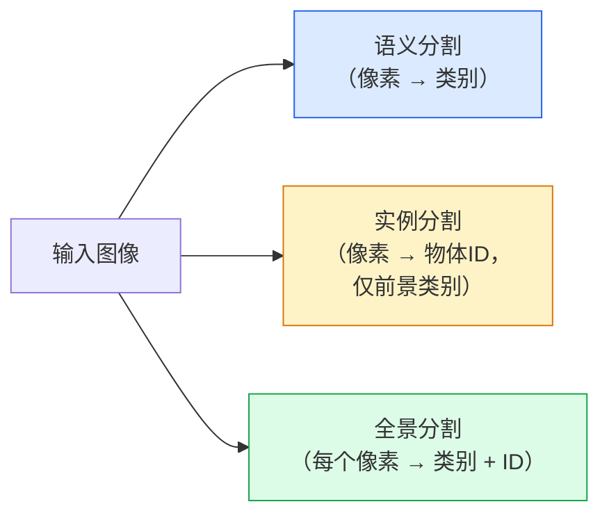
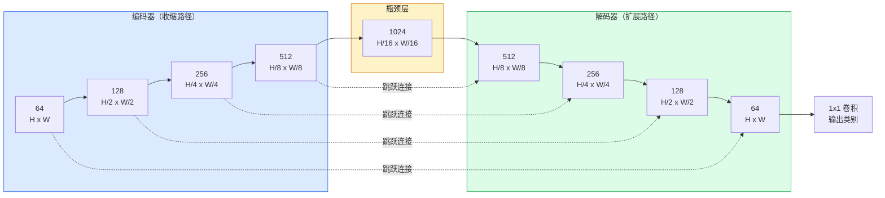

# 语义分割——U-Net

> 分割是在每个像素上进行的分类。U-Net 通过将下采样编码器与上采样解码器配对，并在它们之间连接跳跃连接来实现这一点。

**类型：** 动手实现
**语言：** Python
**前置知识：** Phase 4 第3课（CNN），Phase 4 第4课（图像分类）
**预计时间：** ~75分钟

## 学习目标

- 区分语义分割、实例分割和全景分割，并为给定问题选择正确的任务
- 用 PyTorch 从零构建 U-Net，包括编码器块、瓶颈层、带转置卷积的解码器和跳跃连接
- 实现逐像素交叉熵、Dice 损失以及它们的组合损失（当前医学和工业分割的默认方案）
- 逐类读取 IoU 和 Dice 指标，诊断差分数是来自小目标召回、边界精度还是类别不平衡

## 问题所在

分类每张图像输出一个标签。检测每张图像输出少量框。分割每个像素输出一个标签。对于 `H × W` 的输入，输出是一个形状为 `H × W`（语义）或 `H × W × N_实例`（实例）的张量。每张图像有数百万个预测，而不是一个。

分割的结构特点决定了它驱动几乎所有密集预测视觉产品：医学成像（肿瘤掩码）、自动驾驶（道路、车道、障碍物）、卫星（建筑轮廓、农田边界）、文档解析（布局区域）、机器人（可抓取区域）。这些任务都无法通过在物体周围画框来解决；它们需要精确的轮廓。

架构上的问题简单说来却不简单：你需要网络同时看到图像的全局上下文（这是什么类型的场景）和局部像素细节（哪个像素是道路，哪个是人行道）。标准 CNN 通过空间压缩来获取上下文，这丢掉了细节。U-Net 是同时获得两者的设计。

## 核心概念

### 语义 vs 实例 vs 全景分割



- **语义**说「这个像素是道路，那个像素是汽车。」相邻的两辆汽车合并成一个blob。
- **实例**说「这个像素是3号汽车，那个像素是5号汽车。」忽略背景（「stuff」= 天空、道路、草地）。
- **全景**统一两者：每个像素有类别标签，每个实例有唯一ID，stuff和things都被分割。

本课涵盖语义分割。下一课（Mask R-CNN）涵盖实例分割。

### U-Net 形状



编码器将空间分辨率减半四次，通道数加倍。解码器反转：空间分辨率加倍四次，通道数减半。跳跃连接在每个分辨率处将匹配的编码器特征与解码器特征拼接。最终的 1×1 卷积在全分辨率下将 `64 -> num_classes`。

为什么跳跃连接是必要的：当解码器试图输出像素级预测时，它只看到了小特征图。没有跳跃连接，它无法精确定位边缘，因为那些信息在编码器中被压缩掉了。跳跃连接把编码器下行过程中计算的高分辨率特征图传递给解码器。

### 转置卷积 vs 双线性上采样

解码器必须扩展空间维度。两种选择：

- **转置卷积**（`nn.ConvTranspose2d`）——可学习的上采样。历史上的 U-Net 默认方案。如果步幅和核尺寸不能整除，可能产生棋盘格伪影。
- **双线性上采样 + 3×3 卷积**——平滑上采样后跟卷积。伪影更少，参数更少，现在是现代默认方案。

两者在实际中都存在。对于第一个 U-Net，双线性更安全。

### 像素网格上的交叉熵

对于有 C 个类别的语义分割，模型输出是 `(N, C, H, W)`。目标是 `(N, H, W)` 的整数类别 ID。交叉熵与分类情况相同，只是在每个空间位置上应用：

```
Loss = 对 (n, h, w) 取均值，-log( softmax(logits[n, :, h, w])[target[n, h, w]] )
```

PyTorch 的 `F.cross_entropy` 原生处理这个形状，无需 reshape。

### Dice 损失及其必要性

交叉熵平等对待每个像素。当一个类别占据了大部分画面时，这是错误的（医学成像：99% 背景，1% 肿瘤）。网络通过到处预测背景可以得到 99% 的准确率，但这没有任何用处。

Dice 损失通过直接优化预测掩码与真实掩码之间的重叠来解决这个问题：

```
Dice(p, y) = 2 * sum(p * y) / (sum(p) + sum(y) + epsilon)
Dice_loss = 1 - Dice
```

其中 `p` 是某类别的 sigmoid/softmax 概率图，`y` 是二值真实掩码。只有重叠完美时损失才为零。因为它是基于比率的，类别不平衡无关紧要。

实践中使用**组合损失**：

```
L = L_交叉熵 + lambda * L_Dice       (lambda ~ 1)
```

交叉熵在训练早期提供稳定的梯度；Dice 将训练后期专注于实际匹配掩码形状。这种组合是医学成像的默认方案，在任何类别不平衡数据集上都很难被超越。

### 评估指标

- **像素准确率** — 正确预测的像素百分比。计算便宜。在不平衡数据上与分类准确率出于同样的原因是有问题的。
- **逐类 IoU** — 每个类别掩码的交并比；跨类别平均 = mIoU。
- **Dice（像素上的 F1）** — 与 IoU 类似；`Dice = 2 * IoU / (1 + IoU)`。医学成像偏好 Dice，驾驶社区偏好 IoU；两者单调相关。
- **边界 F1** — 测量预测边界与真实边界的接近程度，对微小偏移也有惩罚。对半导体检测等高精度任务很重要。

报告逐类 IoU，而不仅仅是 mIoU。当九个类别都在 85% 时，均值 IoU 会掩盖某一类别只有 15% 的问题。

### 输入分辨率权衡

U-Net 的编码器将分辨率减半四次，所以输入必须能被 16 整除。医学图像通常是 512×512 或 1024×1024。自动驾驶裁剪是 2048×1024。U-Net 的内存成本随 `H × W × C_max` 缩放，在 1024×1024 和 1024 通道瓶颈时，前向传播就已经消耗数 GB 的 VRAM。

两种标准解决方案：
1. 将输入分块——带重叠地处理 256×256 的块再拼接。
2. 用空洞卷积替换瓶颈，保持更高的空间分辨率但扩大感受野（DeepLab 家族）。

对于第一个模型，256×256 输入配 64 通道基础 U-Net 可以舒适地在 8 GB VRAM 上训练。

## 动手实现

### 第1步：编码器块

两个带批归一化和 ReLU 的 3×3 卷积。第一个卷积改变通道数，第二个保持不变。

```python
import torch
import torch.nn as nn
import torch.nn.functional as F

class DoubleConv(nn.Module):
    def __init__(self, in_c, out_c):
        super().__init__()
        self.net = nn.Sequential(
            nn.Conv2d(in_c, out_c, kernel_size=3, padding=1, bias=False),
            nn.BatchNorm2d(out_c),
            nn.ReLU(inplace=True),
            nn.Conv2d(out_c, out_c, kernel_size=3, padding=1, bias=False),
            nn.BatchNorm2d(out_c),
            nn.ReLU(inplace=True),
        )

    def forward(self, x):
        return self.net(x)
```

这个块在整个网络中复用。`bias=False` 是因为 BN 的 beta 已经处理了偏置。

### 第2步：下采样和上采样块

```python
class Down(nn.Module):
    def __init__(self, in_c, out_c):
        super().__init__()
        self.net = nn.Sequential(
            nn.MaxPool2d(2),
            DoubleConv(in_c, out_c),
        )

    def forward(self, x):
        return self.net(x)


class Up(nn.Module):
    def __init__(self, in_c, out_c):
        super().__init__()
        self.up = nn.Upsample(scale_factor=2, mode="bilinear", align_corners=False)
        self.conv = DoubleConv(in_c, out_c)

    def forward(self, x, skip):
        x = self.up(x)
        if x.shape[-2:] != skip.shape[-2:]:
            x = F.interpolate(x, size=skip.shape[-2:], mode="bilinear", align_corners=False)
        x = torch.cat([skip, x], dim=1)
        return self.conv(x)
```

只比较空间形状（`shape[-2:]`）可以处理维度不能被 16 整除的输入；安全的 `F.interpolate` 在拼接前对齐张量。比较完整形状还会在通道数差异上触发，这应该是一个响亮的错误，而不是静默的插值。

### 第3步：U-Net

```python
class UNet(nn.Module):
    def __init__(self, in_channels=3, num_classes=2, base=64):
        super().__init__()
        self.inc = DoubleConv(in_channels, base)
        self.d1 = Down(base, base * 2)
        self.d2 = Down(base * 2, base * 4)
        self.d3 = Down(base * 4, base * 8)
        self.d4 = Down(base * 8, base * 16)
        self.u1 = Up(base * 16 + base * 8, base * 8)
        self.u2 = Up(base * 8 + base * 4, base * 4)
        self.u3 = Up(base * 4 + base * 2, base * 2)
        self.u4 = Up(base * 2 + base, base)
        self.outc = nn.Conv2d(base, num_classes, kernel_size=1)

    def forward(self, x):
        x1 = self.inc(x)
        x2 = self.d1(x1)
        x3 = self.d2(x2)
        x4 = self.d3(x3)
        x5 = self.d4(x4)
        x = self.u1(x5, x4)
        x = self.u2(x, x3)
        x = self.u3(x, x2)
        x = self.u4(x, x1)
        return self.outc(x)

net = UNet(in_channels=3, num_classes=2, base=32)
x = torch.randn(1, 3, 256, 256)
print(f"output: {net(x).shape}")
print(f"params: {sum(p.numel() for p in net.parameters()):,}")
```

输出形状 `(1, 2, 256, 256)`——与输入相同的空间大小，`num_classes` 个通道。`base=32` 时约 770 万参数。

### 第4步：损失函数

```python
def dice_loss(logits, targets, num_classes, eps=1e-6):
    probs = F.softmax(logits, dim=1)
    targets_one_hot = F.one_hot(targets, num_classes).permute(0, 3, 1, 2).float()
    dims = (0, 2, 3)
    intersection = (probs * targets_one_hot).sum(dim=dims)
    denom = probs.sum(dim=dims) + targets_one_hot.sum(dim=dims)
    dice = (2 * intersection + eps) / (denom + eps)
    return 1 - dice.mean()


def combined_loss(logits, targets, num_classes, lam=1.0):
    ce = F.cross_entropy(logits, targets)
    dc = dice_loss(logits, targets, num_classes)
    return ce + lam * dc, {"ce": ce.item(), "dice": dc.item()}
```

Dice 按每个类别计算然后取平均（宏 Dice）。`eps` 防止批次中缺失类别时的除零错误。

### 第5步：IoU 指标

```python
@torch.no_grad()
def iou_per_class(logits, targets, num_classes):
    preds = logits.argmax(dim=1)
    ious = torch.zeros(num_classes)
    for c in range(num_classes):
        pred_c = (preds == c)
        true_c = (targets == c)
        inter = (pred_c & true_c).sum().float()
        union = (pred_c | true_c).sum().float()
        ious[c] = (inter / union) if union > 0 else torch.tensor(float("nan"))
    return ious
```

返回长度为 C 的向量。`nan` 标记批次中缺失的类别——计算 mIoU 时不要对这些取平均。

### 第6步：端到端验证的合成数据集

在有色背景上生成形状，使网络必须学习形状而非像素颜色。

```python
import numpy as np
from torch.utils.data import Dataset, DataLoader

def synthetic_segmentation(num_samples=200, size=64, seed=0):
    rng = np.random.default_rng(seed)
    images = np.zeros((num_samples, size, size, 3), dtype=np.float32)
    masks = np.zeros((num_samples, size, size), dtype=np.int64)
    for i in range(num_samples):
        bg = rng.uniform(0, 1, (3,))
        images[i] = bg
        masks[i] = 0
        num_shapes = rng.integers(1, 4)
        for _ in range(num_shapes):
            cls = int(rng.integers(1, 3))
            color = rng.uniform(0, 1, (3,))
            cx, cy = rng.integers(10, size - 10, size=2)
            r = int(rng.integers(4, 12))
            yy, xx = np.meshgrid(np.arange(size), np.arange(size), indexing="ij")
            if cls == 1:
                mask = (xx - cx) ** 2 + (yy - cy) ** 2 < r ** 2
            else:
                mask = (np.abs(xx - cx) < r) & (np.abs(yy - cy) < r)
            images[i][mask] = color
            masks[i][mask] = cls
        images[i] += rng.normal(0, 0.02, images[i].shape)
        images[i] = np.clip(images[i], 0, 1)
    return images, masks


class SegDataset(Dataset):
    def __init__(self, images, masks):
        self.images = images
        self.masks = masks

    def __len__(self):
        return len(self.images)

    def __getitem__(self, i):
        img = torch.from_numpy(self.images[i]).permute(2, 0, 1).float()
        mask = torch.from_numpy(self.masks[i]).long()
        return img, mask
```

三个类别：背景（0）、圆形（1）、方形（2）。网络必须学习区分形状。

### 第7步：训练循环

```python
def train_one_epoch(model, loader, optimizer, device, num_classes):
    model.train()
    loss_sum, total = 0.0, 0
    iou_sum = torch.zeros(num_classes)
    for x, y in loader:
        x, y = x.to(device), y.to(device)
        logits = model(x)
        loss, _ = combined_loss(logits, y, num_classes)
        optimizer.zero_grad()
        loss.backward()
        optimizer.step()
        loss_sum += loss.item() * x.size(0)
        total += x.size(0)
        iou_sum += iou_per_class(logits, y, num_classes).nan_to_num(0)
    return loss_sum / total, iou_sum / len(loader)
```

在合成数据集上运行 10-30 轮，观察形状类别的 mIoU 攀升超过 0.9。注意 `nan_to_num(0)` 将批次中缺失的类别视为零；对于准确的逐类 IoU，应按出现次数进行掩码，并在评估时跨批次使用 `torch.nanmean`，而不是在这里取平均。

## 实际使用

对于生产环境，`segmentation_models_pytorch`（"smp"）将每个标准分割架构与任何 torchvision 或 timm 骨干包装在一起。三行代码：

```python
import segmentation_models_pytorch as smp

model = smp.Unet(
    encoder_name="resnet34",
    encoder_weights="imagenet",
    in_channels=3,
    classes=3,
)
```

还值得为实际工作了解的：
- **DeepLabV3+** 用空洞卷积替换基于最大池化的下采样，使瓶颈保持更高分辨率；在卫星和驾驶数据上边界更快。
- **SegFormer** 用层次化 Transformer 替换卷积编码器；在许多基准上是当前 SOTA。
- **Mask2Former** / **OneFormer** 在单一架构中统一了语义、实例和全景分割。

所有三者都是 `smp` 或 `transformers` 中使用相同数据加载器的即插即用替换。

## 练习

1. **(简单)** 为二值分割任务（前景 vs 背景）实现 `bce_dice_loss`。在合成二分类数据集上验证，当前景占 5% 的像素时，组合损失比单独的 BCE 收敛更快。
2. **(中等)** 将 `nn.Upsample + conv` 上采样块替换为 `nn.ConvTranspose2d` 上采样块。在合成数据集上训练两者并比较 mIoU。观察转置卷积版本中棋盘格伪影出现在哪里。
3. **(困难)** 取一个真实的分割数据集（Oxford-IIIT Pets、Cityscapes mini 分割或医学子集），将 U-Net 训练到 `smp.Unet` 参考值 2 个 IoU 点以内。报告逐类 IoU，识别哪些类别从损失中添加 Dice 中受益最多。

## 关键术语

| 术语 | 通常的说法 | 准确含义 |
|------|-----------|---------|
| 语义分割 (Semantic segmentation) | 「标注每个像素」 | 将每个像素分类为 C 个类别之一；同一类别的实例合并 |
| 实例分割 (Instance segmentation) | 「标注每个物体」 | 分离同一类别的不同实例；仅前景 |
| 全景分割 (Panoptic segmentation) | 「语义 + 实例」 | 每个像素有类别；每个 thing 实例还有唯一 ID |
| 跳跃连接 (Skip connection) | 「U-Net 桥梁」 | 将编码器特征拼接到对应分辨率的解码器特征；保留高频细节 |
| 转置卷积 (Transposed conv) | 「反卷积」 | 可学习的上采样；可能产生棋盘格伪影 |
| Dice 损失 (Dice loss) | 「重叠损失」 | 1 - 2\|A∩B\| / (\|A\| + \|B\|)；直接优化掩码重叠，对类别不平衡鲁棒 |
| mIoU | 「平均交并比」 | 跨类别的 IoU 均值；分割的社区标准指标 |
| 边界 F1 (Boundary F1) | 「边界精度」 | 仅在边界像素上计算的 F1 分数；对精度要求高的任务很重要 |

## 延伸阅读

- [U-Net: Convolutional Networks for Biomedical Image Segmentation (Ronneberger et al., 2015)](https://arxiv.org/abs/1505.04597) — 原始论文；每个人都在复制的那张图在第 2 页
- [Fully Convolutional Networks (Long et al., 2015)](https://arxiv.org/abs/1411.4038) — 第一个将分割做成端到端卷积问题的论文
- [segmentation_models_pytorch](https://github.com/qubvel/segmentation_models.pytorch) — 生产分割的参考；每种标准架构加每种标准损失
- [训练 SOTA 分割的经验教训 (kaggle.com 竞赛)](https://www.kaggle.com/code/iafoss/carvana-unet-pytorch) — 讲解为什么 TTA、伪标签和类别权重在真实数据上很重要
