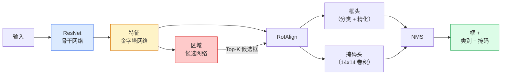

# 实例分割——Mask R-CNN

> 给 Faster R-CNN 检测器添加一个小型掩码分支，就有了实例分割。难点在于 RoIAlign，它比看起来要难。

**类型：** 动手实现 + 学习
**语言：** Python
**前置知识：** Phase 4 第6课（YOLO），Phase 4 第7课（U-Net）
**预计时间：** ~75分钟

## 学习目标

- 端到端梳理 Mask R-CNN 架构：骨干网络、FPN、RPN、RoIAlign、框头、掩码头
- 从零实现 RoIAlign，并解释为什么 RoIPool 不再使用
- 用 torchvision 的 `maskrcnn_resnet50_fpn_v2` 预训练模型进行生产级实例分割，并正确读取其输出格式
- 通过替换框头和掩码头并冻结骨干，在小型自定义数据集上微调 Mask R-CNN

## 问题所在

语义分割为每个类别提供一个掩码。实例分割为每个物体提供一个掩码，即使两个物体属于同一类别也是如此。计数个体、跨帧追踪以及测量物体（墙上每块砖、显微镜图像中每个细胞的边界框）都需要实例分割。

Mask R-CNN（He 等，2017）通过将实例分割重构为检测加掩码来解决这个问题。这个设计如此清晰，以至于在接下来的五年里，几乎每篇实例分割论文都是 Mask R-CNN 的变体，torchvision 的实现至今仍是小到中型数据集的生产默认方案。

困难的工程问题是采样：如何从角点不与像素边界对齐的候选框中裁剪固定大小的特征区域？搞错这一点会在各处损失数十分之一的 mAP。RoIAlign 就是答案。

## 核心概念

### 架构



需要理解的五个部件：

1. **骨干网络** — 在 ImageNet 上训练的 ResNet-50 或 ResNet-101。产生步幅为 4、8、16、32 的特征图层次结构。
2. **FPN（特征金字塔网络）** — 自顶向下加横向连接，为每个层级提供 C 通道的语义丰富特征。检测根据物体大小查询对应的 FPN 层级。
3. **RPN（区域候选网络）** — 一个小型卷积头，在每个锚框位置预测「这里有物体吗？」和「如何精化框？」。每张图像产生约 1000 个候选框。
4. **RoIAlign** — 从任意 FPN 层级的任意框中采样固定大小（如 7×7）的特征块。双线性采样，无量化。
5. **头** — 精化框并选择类别的两层框头，加上为每个候选输出 `28×28` 二值掩码的小型卷积头。

### 为什么是 RoIAlign，而不是 RoIPool

原始的 Fast R-CNN 使用 RoIPool，它将候选框分成网格，取每个单元中的最大特征，并将所有坐标舍入为整数。那种舍入会让特征图与输入像素坐标之间错位多达一个完整的特征图像素——在 224×224 图像上还好，当特征图步幅为 32 时就是灾难性的。

```
RoIPool:
  框 (34.7, 51.3, 98.2, 142.9)
  舍入 -> (34, 51, 98, 142)
  分割网格 -> 对每个单元边界舍入
  每步都在积累错位

RoIAlign:
  框 (34.7, 51.3, 98.2, 142.9)
  使用双线性插值在精确浮点坐标处采样
  没有任何舍入
```

RoIAlign 在 COCO 上免费提升了 3-4 个掩码 AP 点。每个关心定位的检测器现在都使用它——YOLOv7 seg、RT-DETR、Mask2Former 均如此。

### RPN 一段话讲清楚

在特征图的每个位置，放置 K 个不同大小和形状的锚框。预测每个锚框的目标性分数以及将锚框变成更合适框的回归偏移。按分数保留前约 1000 个框，以 IoU 0.7 应用 NMS，并将幸存者传递给头。RPN 以其自己的小型损失训练——与第6课的 YOLO 损失结构相同，只是有两个类别（有物体/无物体）。

### 掩码头

对于每个候选框（经过 RoIAlign 后），掩码头是一个小型 FCN：四个 3×3 卷积、一个 2× 反卷积、一个最终的 1×1 卷积，在 `28×28` 分辨率上产生 `num_classes` 个输出通道。只保留与预测类别对应的通道；其他的被忽略。这将掩码预测与分类解耦。

将 28×28 掩码上采样到候选框的原始像素大小，产生最终的二值掩码。

### 损失函数

Mask R-CNN 有四个损失相加：

```
L = L_rpn_cls + L_rpn_box + L_box_cls + L_box_reg + L_mask
```

- `L_rpn_cls`、`L_rpn_box` — RPN 候选框的目标性 + 框回归。
- `L_box_cls` — 头部分类器对 (C+1) 个类别（包括背景）的交叉熵。
- `L_box_reg` — 头部框精化的 smooth L1。
- `L_mask` — 28×28 掩码输出的逐像素二值交叉熵。

每个损失都有自己的默认权重；torchvision 实现将它们作为构造函数参数暴露。

### 输出格式

`torchvision.models.detection.maskrcnn_resnet50_fpn_v2` 返回字典列表，每张图像一个：

```
{
    "boxes":  (N, 4) 以 (x1, y1, x2, y2) 像素坐标，
    "labels": (N,) 类别ID，0 = 背景，所以索引从1开始，
    "scores": (N,) 置信度分数，
    "masks":  (N, 1, H, W) [0,1] 中的浮点掩码——阈值0.5得到二值掩码，
}
```

掩码已经是完整图像分辨率。28×28 头部输出已在内部上采样。

## 动手实现

### 第1步：从零实现 RoIAlign

这是 Mask R-CNN 中读代码比读文章更容易理解的一个组件。

```python
import torch
import torch.nn.functional as F

def roi_align_single(feature, box, output_size=7, spatial_scale=1 / 16.0):
    """
    feature: (C, H, W) 单张图像特征图
    box: (x1, y1, x2, y2) 原始图像像素坐标
    output_size: 输出网格的边长（框头为7，掩码头为14）
    spatial_scale: 特征图步幅的倒数
    """
    C, H, W = feature.shape
    x1, y1, x2, y2 = [c * spatial_scale - 0.5 for c in box]
    bin_w = (x2 - x1) / output_size
    bin_h = (y2 - y1) / output_size

    grid_y = torch.linspace(y1 + bin_h / 2, y2 - bin_h / 2, output_size)
    grid_x = torch.linspace(x1 + bin_w / 2, x2 - bin_w / 2, output_size)
    yy, xx = torch.meshgrid(grid_y, grid_x, indexing="ij")

    gx = 2 * (xx + 0.5) / W - 1
    gy = 2 * (yy + 0.5) / H - 1
    grid = torch.stack([gx, gy], dim=-1).unsqueeze(0)
    sampled = F.grid_sample(feature.unsqueeze(0), grid, mode="bilinear",
                            align_corners=False)
    return sampled.squeeze(0)
```

每个数字都在双线性采样的位置上。没有舍入，没有量化，没有丢失的梯度。

### 第2步：与 torchvision 的 RoIAlign 对比

```python
from torchvision.ops import roi_align

feature = torch.randn(1, 16, 50, 50)
boxes = torch.tensor([[0, 10, 20, 100, 90]], dtype=torch.float32)  # (batch_idx, x1, y1, x2, y2)

ours = roi_align_single(feature[0], boxes[0, 1:].tolist(), output_size=7, spatial_scale=1/4)
theirs = roi_align(feature, boxes, output_size=(7, 7), spatial_scale=1/4, sampling_ratio=1, aligned=True)[0]

print(f"shape ours:   {tuple(ours.shape)}")
print(f"shape theirs: {tuple(theirs.shape)}")
print(f"max|diff|:    {(ours - theirs).abs().max().item():.3e}")
```

使用 `sampling_ratio=1` 和 `aligned=True`，两者在 `1e-5` 以内匹配。

### 第3步：加载预训练 Mask R-CNN

```python
import torch
from torchvision.models.detection import maskrcnn_resnet50_fpn_v2, MaskRCNN_ResNet50_FPN_V2_Weights

model = maskrcnn_resnet50_fpn_v2(weights=MaskRCNN_ResNet50_FPN_V2_Weights.DEFAULT)
model.eval()
print(f"params: {sum(p.numel() for p in model.parameters()):,}")
```

4600 万参数，91 个类别（COCO）。第一个类别（id 0）是背景；模型实际检测的所有东西从 id 1 开始。

### 第4步：运行推理

```python
with torch.no_grad():
    x = torch.randn(3, 400, 600)
    predictions = model([x])
p = predictions[0]
print(f"boxes:  {tuple(p['boxes'].shape)}")
print(f"labels: {tuple(p['labels'].shape)}")
print(f"scores: {tuple(p['scores'].shape)}")
print(f"masks:  {tuple(p['masks'].shape)}")
```

掩码张量的形状是 `(N, 1, H, W)`。在 0.5 处阈值得到每个物体的二值掩码：

```python
binary_masks = (p['masks'] > 0.5).squeeze(1)  # (N, H, W) 布尔型
```

### 第5步：为自定义类别数量替换头部

常见的微调方案：复用骨干网络、FPN 和 RPN；替换两个分类头。

```python
from torchvision.models.detection.faster_rcnn import FastRCNNPredictor
from torchvision.models.detection.mask_rcnn import MaskRCNNPredictor

def build_custom_maskrcnn(num_classes):
    model = maskrcnn_resnet50_fpn_v2(weights=MaskRCNN_ResNet50_FPN_V2_Weights.DEFAULT)
    in_features = model.roi_heads.box_predictor.cls_score.in_features
    model.roi_heads.box_predictor = FastRCNNPredictor(in_features, num_classes)
    in_features_mask = model.roi_heads.mask_predictor.conv5_mask.in_channels
    hidden_layer = 256
    model.roi_heads.mask_predictor = MaskRCNNPredictor(in_features_mask, hidden_layer, num_classes)
    return model

custom = build_custom_maskrcnn(num_classes=5)
print(f"custom cls_score.out_features: {custom.roi_heads.box_predictor.cls_score.out_features}")
```

`num_classes` 必须包含背景类，所以有 4 个物体类别的数据集使用 `num_classes=5`。

### 第6步：冻结不需要训练的部分

在小数据集上，冻结骨干网络和 FPN。只有 RPN 目标性 + 回归和两个头部进行学习。

```python
def freeze_backbone_and_fpn(model):
    # torchvision Mask R-CNN 将 FPN 打包在 `model.backbone` 内部
    # （作为 `model.backbone.fpn`），所以迭代 `model.backbone.parameters()`
    # 涵盖了 ResNet 特征层和 FPN 横向/输出卷积两者。
    for p in model.backbone.parameters():
        p.requires_grad = False
    return model

custom = freeze_backbone_and_fpn(custom)
trainable = sum(p.numel() for p in custom.parameters() if p.requires_grad)
print(f"freeze 后可训练参数: {trainable:,}")
```

在 500 张图像的数据集上，这是收敛和过拟合之间的差异。

## 实际使用

torchvision 中 Mask R-CNN 的完整训练循环只有 40 行，在任务之间基本不变——换数据集就能用。

```python
def train_step(model, images, targets, optimizer):
    model.train()
    loss_dict = model(images, targets)
    losses = sum(loss for loss in loss_dict.values())
    optimizer.zero_grad()
    losses.backward()
    optimizer.step()
    return {k: v.item() for k, v in loss_dict.items()}
```

`targets` 列表必须有逐图像的字典，包含 `boxes`、`labels` 和 `masks`（作为 `(num_instances, H, W)` 的二值张量）。模型在训练时返回四个损失的字典，在评估时返回预测列表，通过 `model.training` 来区分。

`pycocotools` 评估器同时产生框和掩码的 mAP@IoU=0.5:0.95；你需要两个数字才能知道是框头还是掩码头是瓶颈。

## 练习

1. **(简单)** 在 100 个随机框上验证你的 RoIAlign 与 `torchvision.ops.roi_align` 的差异。报告最大绝对差值。同时运行 RoIPool（2017 年前的行为），展示它在边界附近的框上偏差约 1-2 个特征图像素。
2. **(中等)** 在 50 张图像的自定义数据集（任意两个类别：气球、鱼、坑洞、Logo）上微调 `maskrcnn_resnet50_fpn_v2`。冻结骨干，训练 20 轮，报告 mask AP@0.5。
3. **(困难)** 将 Mask R-CNN 的掩码头替换为在 56×56 而非 28×28 处预测的版本。测量修改前后的 mAP@IoU=0.75。解释为什么增益（或缺乏增益）与预期的边界精度/内存权衡相符。

## 关键术语

| 术语 | 通常的说法 | 准确含义 |
|------|-----------|---------|
| Mask R-CNN | 「检测加掩码」 | Faster R-CNN + 一个小型 FCN 头，为每个候选的每个类别预测 28×28 掩码 |
| FPN | 「特征金字塔」 | 自顶向下加横向连接，为每个步幅层级提供 C 通道的语义丰富特征 |
| RPN | 「区域候选器」 | 一个小型卷积头，每张图像产生约 1000 个有物体/无物体候选框 |
| RoIAlign | 「无舍入裁剪」 | 从任意浮点坐标框中双线性采样固定大小的特征网格 |
| RoIPool | 「2017年前的裁剪」 | 与 RoIAlign 目的相同但对框坐标取整；已过时 |
| 掩码 AP (Mask AP) | 「实例 mAP」 | 用掩码 IoU 而非框 IoU 计算的平均精确率；COCO 实例分割指标 |
| 二值掩码头 (Binary mask head) | 「逐类掩码」 | 为每个候选的每个类别预测一个二值掩码；只保留预测类别的通道 |
| 背景类 (Background class) | 「第0类」 | 「无物体」的兜底类；真实类别的索引从1开始 |

## 延伸阅读

- [Mask R-CNN (He et al., 2017)](https://arxiv.org/abs/1703.06870) — 原始论文；第3节关于 RoIAlign 的部分是关键阅读
- [FPN: Feature Pyramid Networks (Lin et al., 2017)](https://arxiv.org/abs/1612.03144) — FPN 论文；每个现代检测器都使用它
- [torchvision Mask R-CNN 教程](https://pytorch.org/tutorials/intermediate/torchvision_tutorial.html) — 微调循环的参考
- [Detectron2 模型库](https://github.com/facebookresearch/detectron2/blob/main/MODEL_ZOO.md) — 几乎所有检测和分割变体的生产实现，附带训练权重
