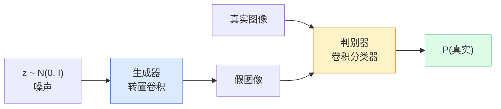
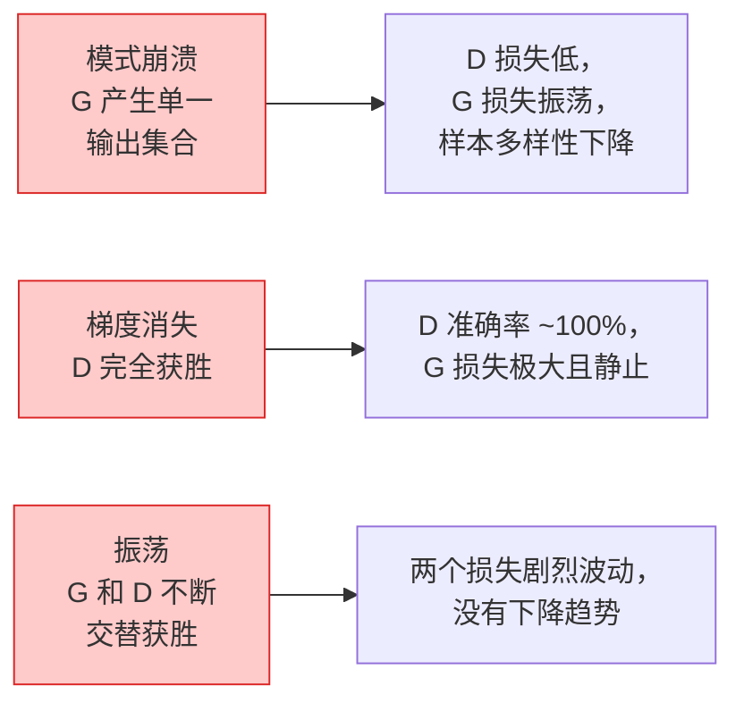

# 图像生成——GAN

> GAN 是两个神经网络在玩一个固定的博弈。一个画，一个批评。它们共同进步，直到画作能骗过批评者。

**类型：** 动手实现
**语言：** Python
**前置知识：** Phase 4 第3课（CNN），Phase 3 第6课（优化器），Phase 3 第7课（正则化）
**预计时间：** ~75分钟

## 学习目标

- 解释生成器与判别器之间的极小极大博弈，以及为什么均衡对应于 p_model = p_data
- 用 PyTorch 实现 DCGAN，在 60 行以内让它生成连贯的 32×32 合成图像
- 用三个标准技巧稳定 GAN 训练：非饱和损失、谱归一化、TTUR（两时间尺度更新规则）
- 读取区分健康收敛、模式崩溃、振荡和判别器完全获胜的训练曲线

## 问题所在

分类训练网络将图像映射到标签。生成反转了这个问题：采样看起来来自同一分布的新图像。没有可以与之 diff 的「正确」输出；只有你想模仿的分布。

标准损失函数（MSE、交叉熵）无法测量「这个样本是否来自真实分布」。最小化逐像素误差产生的是模糊的平均值，而不是真实的样本。突破在于学习损失：训练第二个网络，其工作是区分真实与虚假，并用它的判断来推动生成器。

GAN（Goodfellow 等，2014）定义了这个框架。到 2018 年，StyleGAN 已在生成与照片无法区分的 1024×1024 人脸。扩散模型此后在质量和可控性上夺取了王座，但使扩散模型实用的每个技巧——归一化选择、潜在空间、特征损失——都是首先在 GAN 上理解的。

## 核心概念

### 两个网络



**生成器** G 取一个噪声向量 `z` 并输出一张图像。**判别器** D 取一张图像并输出一个标量：图像是真实的概率。

### 博弈

G 希望 D 出错。D 希望自己是对的。形式上：

```
min_G max_D  E_x[log D(x)] + E_z[log(1 - D(G(z)))]
```

从右往左读：D 在最大化对真实图像（`log D(real)`）和假图像（`log (1 - D(fake))`）的准确率。G 在最小化 D 对假图像的准确率——它希望 `D(G(z))` 很高。

Goodfellow 证明，这个极小极大博弈有一个全局均衡，其中 `p_G = p_data`，D 处处输出 0.5，生成分布与真实分布之间的 Jensen-Shannon 散度为零。难点在于如何到达那里。

### 非饱和损失

上面的形式数值不稳定。在训练早期，每个假图像的 `D(G(z))` 都接近零，所以 `log(1 - D(G(z)))` 对 G 的梯度消失。修复方法：翻转 G 的损失。

```
L_D = -E_x[log D(x)] - E_z[log(1 - D(G(z)))]
L_G = -E_z[log D(G(z))]                          # 非饱和版本
```

现在当 `D(G(z))` 接近零时，G 的损失很大，其梯度是有信息量的。每个现代 GAN 都用这个变体训练。

### DCGAN 架构规则

Radford、Metz、Chintala（2015）将多年的失败实验提炼为五条使 GAN 训练稳定的规则：

1. 用步幅卷积替换池化（两个网络都这样）。
2. 在生成器和判别器中都使用批归一化，除了 G 的输出和 D 的输入。
3. 在更深的架构中移除全连接层。
4. G 除输出层（用 tanh 输出 [-1, 1]）外所有层都用 ReLU。
5. D 的所有层都用 LeakyReLU（negative_slope=0.2）。

每个现代基于卷积的 GAN（StyleGAN、BigGAN、GigaGAN）仍然从这些规则出发，然后逐件替换。

### 失败模式及其特征



- **模式崩溃**：G 发现一张能骗过 D 的图像并只生成那一张。修复：添加 minibatch discrimination、谱归一化或标签条件化。
- **判别器获胜**：D 变得太快太强，G 的梯度消失。修复：更小的 D、更低的 D 学习率，或在真实标签上应用标签平滑。
- **振荡**：两个网络交替获胜，永远不接近均衡。修复：TTUR（D 的学习速度比 G 快 2-4 倍），或切换到 Wasserstein 损失。

### 评估

GAN 没有真实标签，那你怎么知道它们在工作？

- **样本检查** — 在每个轮次结束时看 64 个样本。不可缺少。
- **FID（弗雷歇初始距离）** — 真实集和生成集的 Inception-v3 特征分布之间的距离。越低越好，社区标准。
- **Inception Score** — 更旧，更脆弱；优先使用 FID。
- **生成模型的精确率/召回率** — 分别测量质量（精确率）和覆盖率（召回率），比单独使用 FID 更具信息量。

对于小型合成数据运行，样本检查就足够了。

## 动手实现

### 第1步：生成器

一个小型 DCGAN 生成器，接受 64 维噪声，产生 32×32 图像。

```python
import torch
import torch.nn as nn

class Generator(nn.Module):
    def __init__(self, z_dim=64, img_channels=3, feat=64):
        super().__init__()
        self.net = nn.Sequential(
            nn.ConvTranspose2d(z_dim, feat * 4, kernel_size=4, stride=1, padding=0, bias=False),
            nn.BatchNorm2d(feat * 4),
            nn.ReLU(inplace=True),
            nn.ConvTranspose2d(feat * 4, feat * 2, kernel_size=4, stride=2, padding=1, bias=False),
            nn.BatchNorm2d(feat * 2),
            nn.ReLU(inplace=True),
            nn.ConvTranspose2d(feat * 2, feat, kernel_size=4, stride=2, padding=1, bias=False),
            nn.BatchNorm2d(feat),
            nn.ReLU(inplace=True),
            nn.ConvTranspose2d(feat, img_channels, kernel_size=4, stride=2, padding=1, bias=False),
            nn.Tanh(),
        )

    def forward(self, z):
        return self.net(z.view(z.size(0), -1, 1, 1))
```

四个转置卷积，每个使用 `kernel_size=4, stride=2, padding=1`，这样可以干净地将空间大小翻倍。通过 tanh 将输出激活值限制在 [-1, 1]。

### 第2步：判别器

生成器的镜像。LeakyReLU，步幅卷积，以标量 logit 结束。

```python
class Discriminator(nn.Module):
    def __init__(self, img_channels=3, feat=64):
        super().__init__()
        self.net = nn.Sequential(
            nn.Conv2d(img_channels, feat, kernel_size=4, stride=2, padding=1),
            nn.LeakyReLU(0.2, inplace=True),
            nn.Conv2d(feat, feat * 2, kernel_size=4, stride=2, padding=1, bias=False),
            nn.BatchNorm2d(feat * 2),
            nn.LeakyReLU(0.2, inplace=True),
            nn.Conv2d(feat * 2, feat * 4, kernel_size=4, stride=2, padding=1, bias=False),
            nn.BatchNorm2d(feat * 4),
            nn.LeakyReLU(0.2, inplace=True),
            nn.Conv2d(feat * 4, 1, kernel_size=4, stride=1, padding=0),
        )

    def forward(self, x):
        return self.net(x).view(-1)
```

最后一个卷积将 `4×4` 特征图降到 `1×1`。每张图像输出一个标量；只在计算损失时应用 sigmoid。

### 第3步：训练步骤

交替：每个批次更新 D 一次，然后更新 G 一次。

```python
import torch.nn.functional as F

def train_step(G, D, real, z, opt_g, opt_d, device):
    real = real.to(device)
    bs = real.size(0)

    # D 步骤
    opt_d.zero_grad()
    d_real = D(real)
    d_fake = D(G(z).detach())
    loss_d = (F.binary_cross_entropy_with_logits(d_real, torch.ones_like(d_real))
              + F.binary_cross_entropy_with_logits(d_fake, torch.zeros_like(d_fake)))
    loss_d.backward()
    opt_d.step()

    # G 步骤
    opt_g.zero_grad()
    d_fake = D(G(z))
    loss_g = F.binary_cross_entropy_with_logits(d_fake, torch.ones_like(d_fake))
    loss_g.backward()
    opt_g.step()

    return loss_d.item(), loss_g.item()
```

D 步骤中的 `G(z).detach()` 至关重要：我们不希望在 D 更新期间梯度流入 G。忘记这一点是经典的初学者 bug。

### 第4步：在合成形状上完整训练循环

```python
from torch.utils.data import DataLoader, TensorDataset
import numpy as np

def synthetic_images(num=2000, size=32, seed=0):
    rng = np.random.default_rng(seed)
    imgs = np.zeros((num, 3, size, size), dtype=np.float32) - 1.0
    for i in range(num):
        r = rng.uniform(6, 12)
        cx, cy = rng.uniform(r, size - r, size=2)
        yy, xx = np.meshgrid(np.arange(size), np.arange(size), indexing="ij")
        mask = (xx - cx) ** 2 + (yy - cy) ** 2 < r ** 2
        color = rng.uniform(-0.5, 1.0, size=3)
        for c in range(3):
            imgs[i, c][mask] = color[c]
    return torch.from_numpy(imgs)

device = "cuda" if torch.cuda.is_available() else "cpu"
data = synthetic_images()
loader = DataLoader(TensorDataset(data), batch_size=64, shuffle=True)

G = Generator(z_dim=64, img_channels=3, feat=32).to(device)
D = Discriminator(img_channels=3, feat=32).to(device)
opt_g = torch.optim.Adam(G.parameters(), lr=2e-4, betas=(0.5, 0.999))
opt_d = torch.optim.Adam(D.parameters(), lr=2e-4, betas=(0.5, 0.999))

for epoch in range(10):
    for (batch,) in loader:
        z = torch.randn(batch.size(0), 64, device=device)
        ld, lg = train_step(G, D, batch, z, opt_g, opt_d, device)
    print(f"epoch {epoch}  D {ld:.3f}  G {lg:.3f}")
```

`Adam(lr=2e-4, betas=(0.5, 0.999))` 是 DCGAN 默认值——低 beta1 防止动量项过度稳定对抗博弈。

### 第5步：采样

```python
@torch.no_grad()
def sample(G, n=16, z_dim=64, device="cpu"):
    G.eval()
    z = torch.randn(n, z_dim, device=device)
    imgs = G(z)
    imgs = (imgs + 1) / 2
    return imgs.clamp(0, 1)
```

采样前始终切换到 eval 模式。对于 DCGAN，这很重要，因为批归一化会使用运行统计量而不是批次的统计量。

### 第6步：谱归一化

判别器中 BN 的即插即用替换，保证网络是 1-Lipschitz 的。修复大多数「D 赢得太彻底」的失败。

```python
from torch.nn.utils import spectral_norm

def build_sn_discriminator(img_channels=3, feat=64):
    return nn.Sequential(
        spectral_norm(nn.Conv2d(img_channels, feat, 4, 2, 1)),
        nn.LeakyReLU(0.2, inplace=True),
        spectral_norm(nn.Conv2d(feat, feat * 2, 4, 2, 1)),
        nn.LeakyReLU(0.2, inplace=True),
        spectral_norm(nn.Conv2d(feat * 2, feat * 4, 4, 2, 1)),
        nn.LeakyReLU(0.2, inplace=True),
        spectral_norm(nn.Conv2d(feat * 4, 1, 4, 1, 0)),
    )
```

用 `build_sn_discriminator()` 替换 `Discriminator`，通常就不再需要 TTUR 技巧了。谱归一化是你能应用的最简单的单项鲁棒性升级。

## 实际使用

对于认真的图像生成，使用预训练权重或切换到扩散模型。两个标准库：

- `torch_fidelity` 无需编写自定义评估代码即可计算生成器的 FID / IS。
- `pytorch-gan-zoo`（旧版）和 `StudioGAN` 提供经过测试的 DCGAN、WGAN-GP、SN-GAN、StyleGAN 和 BigGAN 实现。

2026 年，GAN 在以下场景仍然是最佳选择：实时图像生成（延迟 <10ms）、风格迁移、具有精确控制的图像到图像转换（Pix2Pix、CycleGAN）。扩散模型在真实感和文本条件化上获胜。

## 练习

1. **(简单)** 在合成圆形数据集上训练上面的 DCGAN，在每个轮次结束时保存 16 个样本的网格。到哪个轮次，生成的圆形变得明显是圆形的？
2. **(中等)** 将判别器的批归一化替换为谱归一化。并排训练两个版本。哪个收敛更快？哪个在三个随机种子上的方差更低？
3. **(困难)** 实现条件 DCGAN：将类别标签输入 G 和 D 两者（在 G 中将 one-hot 拼接到噪声，在 D 中拼接一个类别嵌入通道）。在第7课的合成「圆形 vs 方形」数据集上训练，通过使用特定标签采样来展示类别条件化有效。

## 关键术语

| 术语 | 通常的说法 | 准确含义 |
|------|-----------|---------|
| 生成器 (Generator, G) | 「画东西的网络」 | 将噪声映射为图像；训练来欺骗判别器 |
| 判别器 (Discriminator, D) | 「批评者」 | 二值分类器；训练来区分真实与生成图像 |
| 极小极大 (Minimax) | 「博弈」 | 对抗损失上的 G 最小化、D 最大化；均衡是 p_G = p_data |
| 非饱和损失 (Non-saturating loss) | 「数值稳定版本」 | G 的损失是 -log(D(G(z))) 而非 log(1 - D(G(z)))，以避免训练早期的梯度消失 |
| 模式崩溃 (Mode collapse) | 「生成器只生成一种东西」 | G 只产生数据分布的一小部分；用 SN、minibatch discrimination 或更大批次修复 |
| TTUR | 「两个学习率」 | D 比 G 学习更快，通常快 2-4 倍；稳定训练 |
| 谱归一化 (Spectral norm) | 「1-Lipschitz 层」 | 限制每层 Lipschitz 常数的权重归一化；防止 D 变得任意陡峭 |
| FID | 「弗雷歇初始距离」 | 真实集和生成集的 Inception-v3 特征分布之间的距离；标准评估指标 |

## 延伸阅读

- [Generative Adversarial Networks (Goodfellow et al., 2014)](https://arxiv.org/abs/1406.2661) — 开山之作
- [DCGAN (Radford, Metz, Chintala, 2015)](https://arxiv.org/abs/1511.06434) — 使 GAN 可训练的架构规则
- [Spectral Normalization for GANs (Miyato et al., 2018)](https://arxiv.org/abs/1802.05957) — 最有用的单一稳定化技巧
- [StyleGAN3 (Karras et al., 2021)](https://arxiv.org/abs/2106.12423) — SOTA GAN；读起来像过去十年每个技巧的精华集锦
