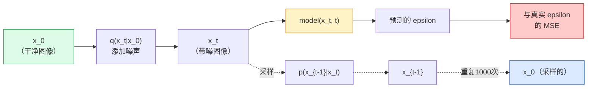

# 图像生成——扩散模型

> 扩散模型学习的是去噪。训练它从带噪图像中去除一小点噪声，把这个过程反向重复一千次，你就有了一个图像生成器。

**类型：** 动手实现
**语言：** Python
**前置知识：** Phase 4 第7课（U-Net），Phase 1 第6课（概率），Phase 3 第6课（优化器）
**预计时间：** ~75分钟

## 学习目标

- 推导前向加噪过程 `x_0 → x_1 → ... → x_T`，并解释为什么封闭形式的 `q(x_t | x_0)` 对任意 t 成立
- 实现 DDPM 风格的训练目标（回归每步添加的噪声）以及从纯噪声走回图像的采样器
- 构建一个时间条件化的 U-Net（小到可以在 CPU 上训练），预测任意时间步的噪声
- 解释 DDPM 与 DDIM 采样的区别，以及各自的适用场景（第23课深入介绍流匹配和整流流）

## 问题所在

GAN 一次生成：噪声进，图像出，一次前向传播。它们快速但难以训练。扩散模型迭代生成：从纯噪声开始，一步步去噪，图像逐渐浮现。它们慢但易于训练。在过去五年里，后一个属性占据了主导：任何小团队都能训练扩散模型并获得合理的样本；GAN 训练是一门需要多年失败运行才能学会的手艺。

除了训练稳定性，扩散的迭代结构还解锁了现代图像生成所做的一切：文本条件化、修复、图像编辑、超分辨率、可控风格。采样循环的每一步都是注入新约束的地方。这个钩子就是为什么 Stable Diffusion、Imagen、DALL-E 3、Midjourney 和你将使用的每个可控图像模型都基于扩散。

本课构建最小的 DDPM：前向加噪、反向去噪、训练循环。下一课（Stable Diffusion）将其连接到带有 VAE、文本编码器和分类器自由引导的生产系统中。

## 核心概念

### 前向过程

取一张图像 `x_0`。添加一小量高斯噪声得到 `x_1`。再添加一点得到 `x_2`。持续 T 步直到 `x_T` 与纯高斯噪声几乎无法区分。

```
q(x_t | x_{t-1}) = N(x_t; sqrt(1 - beta_t) * x_{t-1},  beta_t * I)
```

`beta_t` 是一个小方差调度，通常在 T=1000 步上从 0.0001 线性增加到 0.02。每步都略微收缩信号并注入新的噪声。

### 封闭形式的跳跃

逐步添加噪声是一个马尔可夫链，但数学可以折叠：你可以一步直接从 `x_0` 采样 `x_t`。

```
定义 alpha_t = 1 - beta_t
定义 alpha_bar_t = prod_{s=1..t} alpha_s

则:
  q(x_t | x_0) = N(x_t; sqrt(alpha_bar_t) * x_0,  (1 - alpha_bar_t) * I)

等价地:
  x_t = sqrt(alpha_bar_t) * x_0 + sqrt(1 - alpha_bar_t) * epsilon
  其中 epsilon ~ N(0, I)
```

这个单一方程式是扩散模型实用的全部原因。训练时，你选择一个随机的 `t`，直接从 `x_0` 采样 `x_t`，一步完成训练——不需要模拟完整的马尔可夫链。

### 反向过程

前向过程是固定的。反向过程 `p(x_{t-1} | x_t)` 是神经网络学习的。扩散模型不直接预测 `x_{t-1}`；它们预测在步骤 t 添加的噪声 `epsilon`，并从中推导出 `x_{t-1}`。



### 训练损失

每个训练步骤：

1. 采样一张真实图像 `x_0`。
2. 从 [1, T] 均匀采样一个时间步 `t`。
3. 采样噪声 `epsilon ~ N(0, I)`。
4. 计算 `x_t = sqrt(alpha_bar_t) * x_0 + sqrt(1 - alpha_bar_t) * epsilon`。
5. 用网络预测 `epsilon_theta(x_t, t)`。
6. 最小化 `|| epsilon - epsilon_theta(x_t, t) ||^2`。

就这些。神经网络学习预测任意时间步的噪声。损失是 MSE。没有对抗博弈，没有崩溃，没有振荡。

### 采样器（DDPM）

生成时：从 `x_T ~ N(0, I)` 开始，每次反向走一步。

```
for t = T, T-1, ..., 1:
    eps = model(x_t, t)
    x_{t-1} = (1 / sqrt(alpha_t)) * (x_t - (beta_t / sqrt(1 - alpha_bar_t)) * eps) + sqrt(beta_t) * z
    其中 t > 1 时 z ~ N(0, I)，否则 z = 0
return x_0
```

关键在于，尽管反向条件分布通常不是封闭形式的，但对于这个特定的高斯前向过程，它是的。那些看起来丑陋的系数就是贝叶斯规则给出的结果。

### 为什么是 1000 步

前向噪声调度的选择使每步添加的噪声恰好足以让反向步骤接近高斯。步骤太少，反向步骤远离高斯，网络无法很好地建模。步骤太多，采样变得昂贵而收益递减。T=1000 配线性调度是 DDPM 的默认值。

### DDIM：快 20 倍的采样

训练相同。采样改变。DDIM（Song 等，2020）定义了一个确定性反向过程，无需重新训练就能跳过时间步。用 DDIM 在 50 步内采样，质量接近 1000 步 DDPM。每个生产系统都使用 DDIM 或更快的变体（DPM-Solver、Euler ancestral）。

### 时间条件化

网络 `epsilon_theta(x_t, t)` 需要知道它在去噪哪个时间步。现代扩散模型通过正弦时间嵌入（与 Transformer 中的位置编码相同的想法）注入 `t`，这些嵌入被添加到每个 U-Net 层级的特征图中。

```
t_embedding = sinusoidal(t)
feature_map += MLP(t_embedding)
```

没有时间条件化，网络必须从图像本身猜测噪声水平，这也能工作但样本效率低得多。

## 动手实现

### 第1步：噪声调度

```python
import torch

def linear_beta_schedule(T=1000, beta_start=1e-4, beta_end=2e-2):
    return torch.linspace(beta_start, beta_end, T)


def precompute_schedule(betas):
    alphas = 1.0 - betas
    alphas_cumprod = torch.cumprod(alphas, dim=0)
    return {
        "betas": betas,
        "alphas": alphas,
        "alphas_cumprod": alphas_cumprod,
        "sqrt_alphas_cumprod": torch.sqrt(alphas_cumprod),
        "sqrt_one_minus_alphas_cumprod": torch.sqrt(1.0 - alphas_cumprod),
        "sqrt_recip_alphas": torch.sqrt(1.0 / alphas),
    }

schedule = precompute_schedule(linear_beta_schedule(T=1000))
```

预计算一次，在训练和采样时按索引取值。

### 第2步：前向扩散（q_sample）

```python
def q_sample(x0, t, noise, schedule):
    sqrt_a = schedule["sqrt_alphas_cumprod"][t].view(-1, 1, 1, 1)
    sqrt_one_minus_a = schedule["sqrt_one_minus_alphas_cumprod"][t].view(-1, 1, 1, 1)
    return sqrt_a * x0 + sqrt_one_minus_a * noise
```

单行封闭形式。`t` 是一批时间步，批次中每张图像一个。

### 第3步：一个小型时间条件化 U-Net

```python
import torch.nn as nn
import torch.nn.functional as F
import math

def timestep_embedding(t, dim=64):
    half = dim // 2
    freqs = torch.exp(-math.log(10000) * torch.arange(half, device=t.device) / half)
    args = t[:, None].float() * freqs[None]
    emb = torch.cat([args.sin(), args.cos()], dim=-1)
    return emb


class TinyUNet(nn.Module):
    def __init__(self, img_channels=3, base=32, t_dim=64):
        super().__init__()
        self.t_mlp = nn.Sequential(
            nn.Linear(t_dim, base * 4),
            nn.SiLU(),
            nn.Linear(base * 4, base * 4),
        )
        self.t_dim = t_dim
        self.enc1 = nn.Conv2d(img_channels, base, 3, padding=1)
        self.enc2 = nn.Conv2d(base, base * 2, 4, stride=2, padding=1)
        self.mid = nn.Conv2d(base * 2, base * 2, 3, padding=1)
        self.dec1 = nn.ConvTranspose2d(base * 2, base, 4, stride=2, padding=1)
        self.dec2 = nn.Conv2d(base * 2, img_channels, 3, padding=1)
        self.time_proj = nn.Linear(base * 4, base * 2)

    def forward(self, x, t):
        t_emb = timestep_embedding(t, self.t_dim)
        t_emb = self.t_mlp(t_emb)
        t_proj = self.time_proj(t_emb)[:, :, None, None]

        h1 = F.silu(self.enc1(x))
        h2 = F.silu(self.enc2(h1)) + t_proj
        h3 = F.silu(self.mid(h2))
        d1 = F.silu(self.dec1(h3))
        d2 = torch.cat([d1, h1], dim=1)
        return self.dec2(d2)
```

两层 U-Net，时间条件化注入在瓶颈处。对于真实图像，扩展深度和宽度。

### 第4步：训练循环

```python
def train_step(model, x0, schedule, optimizer, device, T=1000):
    model.train()
    x0 = x0.to(device)
    bs = x0.size(0)
    t = torch.randint(0, T, (bs,), device=device)
    noise = torch.randn_like(x0)
    x_t = q_sample(x0, t, noise, schedule)
    pred = model(x_t, t)
    loss = F.mse_loss(pred, noise)
    optimizer.zero_grad()
    loss.backward()
    optimizer.step()
    return loss.item()
```

这就是完整的训练循环。没有 GAN 博弈，没有专门的损失，一次 MSE 调用。

### 第5步：DDPM 采样器

```python
@torch.no_grad()
def sample(model, schedule, shape, T=1000, device="cpu"):
    model.eval()
    x = torch.randn(shape, device=device)
    betas = schedule["betas"].to(device)
    sqrt_one_minus_a = schedule["sqrt_one_minus_alphas_cumprod"].to(device)
    sqrt_recip_alphas = schedule["sqrt_recip_alphas"].to(device)

    for t in reversed(range(T)):
        t_batch = torch.full((shape[0],), t, dtype=torch.long, device=device)
        eps = model(x, t_batch)
        coef = betas[t] / sqrt_one_minus_a[t]
        mean = sqrt_recip_alphas[t] * (x - coef * eps)
        if t > 0:
            x = mean + torch.sqrt(betas[t]) * torch.randn_like(x)
        else:
            x = mean
    return x
```

1000 次前向传播产生一批样本。在真实代码中你会换成 DDIM 50 步采样器。

### 第6步：DDIM 采样器（确定性，快约 20 倍）

```python
@torch.no_grad()
def sample_ddim(model, schedule, shape, steps=50, T=1000, device="cpu", eta=0.0):
    model.eval()
    x = torch.randn(shape, device=device)
    alphas_cumprod = schedule["alphas_cumprod"].to(device)

    ts = torch.linspace(T - 1, 0, steps + 1).long()
    for i in range(steps):
        t = ts[i]
        t_prev = ts[i + 1]
        t_batch = torch.full((shape[0],), t, dtype=torch.long, device=device)
        eps = model(x, t_batch)
        a_t = alphas_cumprod[t]
        a_prev = alphas_cumprod[t_prev] if t_prev >= 0 else torch.tensor(1.0, device=device)
        x0_pred = (x - torch.sqrt(1 - a_t) * eps) / torch.sqrt(a_t)
        sigma = eta * torch.sqrt((1 - a_prev) / (1 - a_t) * (1 - a_t / a_prev))
        dir_xt = torch.sqrt(1 - a_prev - sigma ** 2) * eps
        noise = sigma * torch.randn_like(x) if eta > 0 else 0
        x = torch.sqrt(a_prev) * x0_pred + dir_xt + noise
    return x
```

`eta=0` 是完全确定性的（相同噪声输入总是产生相同输出）。`eta=1` 等价于 DDPM。

## 实际使用

对于生产工作，使用 `diffusers`：

```python
from diffusers import DDPMScheduler, UNet2DModel

unet = UNet2DModel(sample_size=32, in_channels=3, out_channels=3, layers_per_block=2)
scheduler = DDPMScheduler(num_train_timesteps=1000)
```

该库附带现成的调度器（DDPM、DDIM、DPM-Solver、Euler、Heun）、可配置的 U-Net、文本到图像和图像到图像的流水线，以及 LoRA 微调辅助工具。

对于研究，`k-diffusion`（Katherine Crowson）有最忠实的参考实现和最好的采样变体。

## 练习

1. **(简单)** 可视化前向过程：取一张图像，绘制 `t ∈ [0, 100, 250, 500, 750, 1000]` 时的 `x_t`。验证 `x_1000` 看起来像纯高斯噪声。
2. **(中等)** 在合成圆形数据集上训练 TinyUNet 20 轮并采样 16 个圆形。比较 DDPM（1000步）和 DDIM（50步）采样——它们从相同的噪声种子产生类似的图像吗？
3. **(困难)** 实现余弦噪声调度（Nichol & Dhariwal，2021）：`alpha_bar_t = cos²((t/T + s) / (1 + s) * π / 2)`。用线性和余弦调度训练相同的模型，展示余弦调度在步数较少时给出更好的样本。

## 关键术语

| 术语 | 通常的说法 | 准确含义 |
|------|-----------|---------|
| 前向过程 (Forward process) | 「随时间添加噪声」 | 将图像逐步破坏为高斯噪声的固定马尔可夫链，共 T 步 |
| 反向过程 (Reverse process) | 「逐步去噪」 | 学习到的从噪声走回图像的分布 |
| Epsilon 预测 | 「预测噪声」 | 训练目标：`epsilon_theta(x_t, t)` 预测在步骤 t 添加的噪声 |
| Beta 调度 (Beta schedule) | 「噪声量」 | T 个小方差的序列，定义每步进入多少噪声 |
| alpha_bar_t | 「累积保留因子」 | (1 - beta_s) 到时间 t 的乘积；t 越大，剩余信号越少 |
| DDPM 采样器 | 「祖先采样，随机性」 | 从条件高斯分布采样每个 x_{t-1}；1000 步 |
| DDIM 采样器 | 「确定性，快速」 | 将采样重写为确定性 ODE；20-100 步，质量相近 |
| 时间条件化 (Time conditioning) | 「告诉模型是哪个 t」 | t 的正弦嵌入注入 U-Net，使其知道噪声水平 |

## 延伸阅读

- [Denoising Diffusion Probabilistic Models (Ho et al., 2020)](https://arxiv.org/abs/2006.11239) — 使扩散模型实用并在 FID 上超越 GAN 的论文
- [Improved DDPM (Nichol & Dhariwal, 2021)](https://arxiv.org/abs/2102.09672) — 余弦调度和 v-参数化
- [DDIM (Song, Meng, Ermon, 2020)](https://arxiv.org/abs/2010.02502) — 使实时推理成为可能的确定性采样器
- [Elucidating the Design Space of Diffusion (Karras et al., 2022)](https://arxiv.org/abs/2206.00364) — 每个扩散设计选择的统一视角；当前最佳参考
