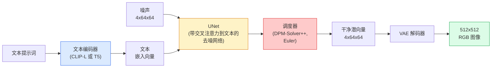

# Stable Diffusion — 架构与微调

> Stable Diffusion 是一个在预训练 VAE 的潜空间中运行的 DDPM，通过交叉注意力接受文本条件，使用快速确定性 ODE 求解器进行采样，并由无分类器引导（Classifier-Free Guidance）精确控制输出方向。

**类型：** 学习 + 使用
**语言：** Python
**前置知识：** 第4阶段第10课（扩散模型）、第7阶段第2课（自注意力）
**预计时间：** 约75分钟

## 学习目标

- 理清 Stable Diffusion 流水线的五个核心组件：VAE、文本编码器、U-Net、调度器、安全检查器，以及各自的职责
- 解释潜空间扩散的原理，以及为何在 4×64×64 的潜空间（而非 3×512×512 的图像空间）中训练能将计算量压缩 48 倍而不损失质量
- 使用 `diffusers` 完成文生图、图生图、图像修复、ControlNet 引导生成
- 用 LoRA 在小型自定义数据集上微调 Stable Diffusion，并在推理时加载 LoRA 适配器

## 问题背景

直接在 512×512 的 RGB 图像上训练 DDPM 代价极高。每个训练步骤都要通过一个接收 3×512×512 = 786,432 个输入值的 U-Net 进行反向传播，而采样需要对同一个 U-Net 进行 50+ 次前向传播。按 Stable Diffusion 1.5（2022年发布）的质量水平，像素空间扩散大约需要 256 个 GPU-月的训练时间，在消费级 GPU 上每张图像需要 10-30 秒。

让开放权重文生图变得实用的关键技巧是**潜空间扩散**（Rombach et al., CVPR 2022）。先训练一个 VAE，将 3×512×512 的图像映射为 4×64×64 的潜向量再还原回去，然后在潜空间中做扩散。计算量降低为 `(3×512×512)/(4×64×64) = 48 倍`，采样时间从数十秒降到同一 GPU 上的两秒以内。

几乎所有现代图像生成模型——SDXL、SD3、FLUX、HunyuanDiT、Wan-Video——都是潜空间扩散模型，只是在自编码器、去噪器（U-Net 或 DiT）和文本条件化方式上各有变化。学会 Stable Diffusion，就掌握了这个模板。

## 核心概念

### 流水线全景



- **VAE** — 冻结的自编码器。编码器将图像转为潜向量（用于图生图和训练），解码器将潜向量还原为图像。
- **文本编码器** — SD 1.x/2.x 用 CLIP 文本编码器，SDXL 用 CLIP-L + CLIP-G，SD3/FLUX 用 T5-XXL。产生一组 token 嵌入序列。
- **U-Net** — 去噪器。在每个空间分辨率层级都有交叉注意力层，从潜向量 token 关注文本嵌入。
- **调度器** — 采样算法（DDIM、Euler、DPM-Solver++）。决定噪声水平序列，将预测的噪声融合回潜向量。
- **安全检查器** — 可选的 NSFW / 违规内容过滤器，作用于输出图像。

### 无分类器引导（CFG）

普通文本条件化的目标是对每个提示词 `c` 学习 `epsilon_theta(x_t, t, c)`。CFG 在训练时有 10% 的概率将 `c` 替换为空嵌入，这样单个模型既能预测条件噪声，也能预测无条件噪声。推理时：

```
eps = eps_uncond + w * (eps_cond - eps_uncond)
```

`w` 是引导强度（guidance scale）。`w=0` 是无条件生成，`w=1` 是普通条件生成，`w>1` 会将输出推向"更符合提示词"的方向，代价是多样性降低。SD 的默认值是 `w=7.5`。

CFG 是文生图能达到产品质量的根本原因。没有 CFG，提示词对输出的影响很弱；有了 CFG，提示词就能主导生成结果。

### 潜空间的几何结构

VAE 的 4 通道潜向量不只是压缩后的图像。它是一个流形，在这个流形上的算术运算大致对应语义编辑（提示词工程和插值都在这里发生），扩散 U-Net 的整个建模能力都聚焦于此。随机采样一个 4×64×64 的潜向量解码后不会得到随机的图像——而是乱码，因为只有潜空间中特定的子流形才能解码为有效图像。

两个重要推论：

1. **图生图** = 将图像编码为潜向量，加入部分噪声，运行去噪器，再解码。图像结构得以保留是因为编码近似可逆；内容变化则来自提示词。
2. **图像修复** = 与图生图相同，但去噪器只更新被遮罩的区域；未遮罩区域保持编码后的潜向量不变。

### U-Net 架构

SD 的 U-Net 是第10课 TinyUNet 的大型版本，增加了三个要素：

- **Transformer 块** — 出现在每个空间分辨率层级，包含自注意力 + 到文本嵌入的交叉注意力。
- **时间步嵌入** — 通过 MLP 对正弦编码进行处理。
- **跳跃连接** — 在编码器和解码器的对应分辨率之间传递特征。

SD 1.5 的参数量约 860M，SDXL 约 2.6B，FLUX 约 12B。参数量的跃升主要来自注意力层。

### LoRA 微调

全量微调 Stable Diffusion 需要 20+ GB 显存，并更新 8.6 亿个参数。LoRA（Low-Rank Adaptation，低秩适配）保持基础模型冻结，只向注意力层注入小型低秩分解矩阵。SD 的 LoRA 适配器通常只有 10-50 MB，在单张消费级 GPU 上训练 10-60 分钟即可，推理时作为即插即用的模型修改加载。

```
原始权重: W_q : (d_in, d_out)   冻结
LoRA:     W_q + alpha * (A @ B)   其中 A : (d_in, r), B : (r, d_out)

r 通常为 4-32
```

LoRA 是社区分发几乎所有微调模型的方式。CivitAI 和 Hugging Face 上有数百万个 LoRA 适配器。

### 常见调度器

- **DDIM** — 确定性，约 50 步，简单可靠。
- **Euler ancestral** — 随机性，30-50 步，样本创意度稍高。
- **DPM-Solver++ 2M Karras** — 确定性，20-30 步，2026年的生产默认选项。
- **LCM / TCD / Turbo** — 一致性模型和蒸馏变体，1-4 步完成，但质量有所损失。

在 `diffusers` 中切换调度器只需一行代码，有时无需重新训练就能解决采样问题。

## 动手实现

本课全程使用 `diffusers`，而不是从头重建 Stable Diffusion。重建所需的各个组件（VAE、文本编码器、U-Net、调度器）都是独立课题；本课的目标是熟练使用生产级 API。

### 第一步：文本生成图像

```python
import torch
from diffusers import StableDiffusionPipeline

pipe = StableDiffusionPipeline.from_pretrained(
    "runwayml/stable-diffusion-v1-5",
    torch_dtype=torch.float16,
).to("cuda")

image = pipe(
    prompt="a dog riding a skateboard in tokyo, studio ghibli style",
    guidance_scale=7.5,
    num_inference_steps=25,
    generator=torch.Generator("cuda").manual_seed(42),
).images[0]
image.save("dog.png")
```

`float16` 将显存占用减半，且视觉质量无明显损失。使用默认 DPM-Solver++ 时 `num_inference_steps=25` 的效果等同于 DDIM 的 `num_inference_steps=50`。

### 第二步：切换调度器

```python
from diffusers import DPMSolverMultistepScheduler, EulerAncestralDiscreteScheduler

pipe.scheduler = DPMSolverMultistepScheduler.from_config(pipe.scheduler.config)
pipe.scheduler = EulerAncestralDiscreteScheduler.from_config(pipe.scheduler.config)
```

调度器状态与 U-Net 权重解耦。可以用 DDPM 训练，再用任意调度器采样。

### 第三步：图生图

```python
from diffusers import StableDiffusionImg2ImgPipeline
from PIL import Image

img2img = StableDiffusionImg2ImgPipeline.from_pretrained(
    "runwayml/stable-diffusion-v1-5",
    torch_dtype=torch.float16,
).to("cuda")

init_image = Image.open("dog.png").convert("RGB").resize((512, 512))
out = img2img(
    prompt="a dog riding a skateboard, oil painting",
    image=init_image,
    strength=0.6,
    guidance_scale=7.5,
).images[0]
```

`strength` 控制去噪前加入多少噪声（0.0 = 不变，1.0 = 完全重新生成）。0.5-0.7 是风格迁移的常用范围。

### 第四步：图像修复

```python
from diffusers import StableDiffusionInpaintPipeline

inpaint = StableDiffusionInpaintPipeline.from_pretrained(
    "runwayml/stable-diffusion-inpainting",
    torch_dtype=torch.float16,
).to("cuda")

image = Image.open("dog.png").convert("RGB").resize((512, 512))
mask = Image.open("dog_mask.png").convert("L").resize((512, 512))

out = inpaint(
    prompt="a cat",
    image=image,
    mask_image=mask,
    guidance_scale=7.5,
).images[0]
```

遮罩中白色像素的区域会被重新生成，黑色像素的区域保持原样。

### 第五步：加载 LoRA

```python
pipe.load_lora_weights("sayakpaul/sd-lora-ghibli")
pipe.fuse_lora(lora_scale=0.8)

image = pipe(prompt="a village square in ghibli style").images[0]
```

`lora_scale` 控制效果强度：0.0 = 无效果，1.0 = 完全应用。`fuse_lora` 将适配器烘焙进权重中以提升速度，但这样就无法再切换其他适配器了。加载不同适配器前需调用 `pipe.unfuse_lora()`。

### 第六步：LoRA 训练（梗概）

真正的 LoRA 训练代码在 `peft` 或 `diffusers.training` 中。核心流程如下：

```python
# 伪代码
for step, batch in enumerate(dataloader):
    images, prompts = batch
    latents = vae.encode(images).latent_dist.sample() * 0.18215

    t = torch.randint(0, num_train_timesteps, (batch_size,))
    noise = torch.randn_like(latents)
    noisy_latents = scheduler.add_noise(latents, noise, t)

    text_emb = text_encoder(tokenizer(prompts))

    pred_noise = unet(noisy_latents, t, text_emb)  # LoRA 权重在这里注入

    loss = F.mse_loss(pred_noise, noise)
    loss.backward()
    optimizer.step()
```

只有 LoRA 矩阵接收梯度；基础 U-Net、VAE 和文本编码器全部冻结。batch size 为 1 并开启梯度检查点（gradient checkpointing）时，这个流程在 8 GB 显存内即可运行。

## 工程应用

在生产环境中，你实际需要做的决策：

- **模型系列**：SD 1.5 适合开源社区微调，SDXL 保真度更高，SD3/FLUX 质量最佳且有严格的授权要求。
- **调度器**：DPM-Solver++ 2M Karras 用于 20-30 步生成，需要低延迟时用 LCM-LoRA（1 秒以内）。
- **精度**：4080/4090 用 `float16`，A100 及更新硬件用 `bfloat16`，显存紧张时用 `int8`（通过 `bitsandbytes` 或 `compel`）。
- **条件化**：纯文本条件基本够用；需要更强的结构控制时，在基础流水线上叠加 ControlNet（canny 边缘、depth 深度、pose 姿态）。

批量生成可用 AUTO1111 / ComfyUI 等社区工具；生产 API 部署则用 `diffusers` + `accelerate` 或 `optimum-nvidia`（带 TensorRT 编译）。

## 交付物

本课产出：

- `outputs/prompt-sd-pipeline-planner.md` — 一个提示词，根据延迟预算、保真度目标和授权限制，自动选择 SD 1.5 / SDXL / SD3 / FLUX 以及对应的调度器和精度。
- `outputs/skill-lora-training-setup.md` — 一个技能文件，为自定义数据集生成完整的 LoRA 训练配置，包括文本描述、rank、batch size 和学习率。

## 练习

1. **(简单)** 用 `guidance_scale` 在 `[1, 3, 5, 7.5, 10, 15]` 之间依次生成同一提示词。描述图像如何变化。从哪个 guidance 值开始出现伪影？
2. **(中等)** 取任意真实照片，通过 `StableDiffusionImg2ImgPipeline` 以 `strength` 在 `[0.2, 0.4, 0.6, 0.8, 1.0]` 之间生成。哪个 strength 值能在改变风格的同时保留构图？为什么 1.0 会完全忽略输入图像？
3. **(困难)** 用 10-20 张单一主体（宠物、logo、角色）的图像训练一个 LoRA，然后生成该主体出现在不同场景中的图像。报告在主体身份保留与防止对输入图像过拟合之间取得最佳平衡的 LoRA rank 和训练步数。

## 关键术语

| 术语 | 常见说法 | 真正含义 |
|------|---------|---------|
| 潜空间扩散 (Latent diffusion) | "在潜空间里扩散" | 在 VAE 潜空间（4×64×64）而非像素空间（3×512×512）运行完整 DDPM；节省 48 倍计算量 |
| VAE 缩放因子 (VAE scale factor) | "0.18215" | 将 VAE 原始潜向量缩放至大致单位方差的常数；在每个 SD 流水线中硬编码 |
| 无分类器引导 (Classifier-free guidance) | "CFG" | 混合条件和无条件的噪声预测；推理阶段最重要的调节旋钮 |
| 调度器 (Scheduler) | "Sampler（采样器）" | 将噪声 + 模型预测转化为去噪潜向量轨迹的算法 |
| LoRA | "低秩适配器" | 注入注意力层的小型低秩分解矩阵，不修改基础权重即可完成微调 |
| 交叉注意力 (Cross-attention) | "文本-图像注意力" | 从潜向量 token 到文本 token 的注意力机制；在每个 U-Net 层级注入提示词信息 |
| ControlNet | "结构条件化" | 独立训练的适配器，通过额外输入（canny、depth、pose、segmentation）引导 SD 的生成结构 |
| DPM-Solver++ | "默认调度器" | 二阶确定性 ODE 求解器；2026 年低步数（20-30 步）下质量最佳 |

## 延伸阅读

- [High-Resolution Image Synthesis with Latent Diffusion (Rombach et al., 2022)](https://arxiv.org/abs/2112.10752) — Stable Diffusion 原论文；包含证明每项设计决策的完整消融实验
- [Classifier-Free Diffusion Guidance (Ho & Salimans, 2022)](https://arxiv.org/abs/2207.12598) — CFG 原论文
- [LoRA: Low-Rank Adaptation of Large Language Models (Hu et al., 2021)](https://arxiv.org/abs/2106.09685) — LoRA 最初为 NLP 设计，几乎无需改动就迁移到了 SD
- [diffusers 文档](https://huggingface.co/docs/diffusers) — 所有 SD / SDXL / SD3 / FLUX 流水线的参考手册
